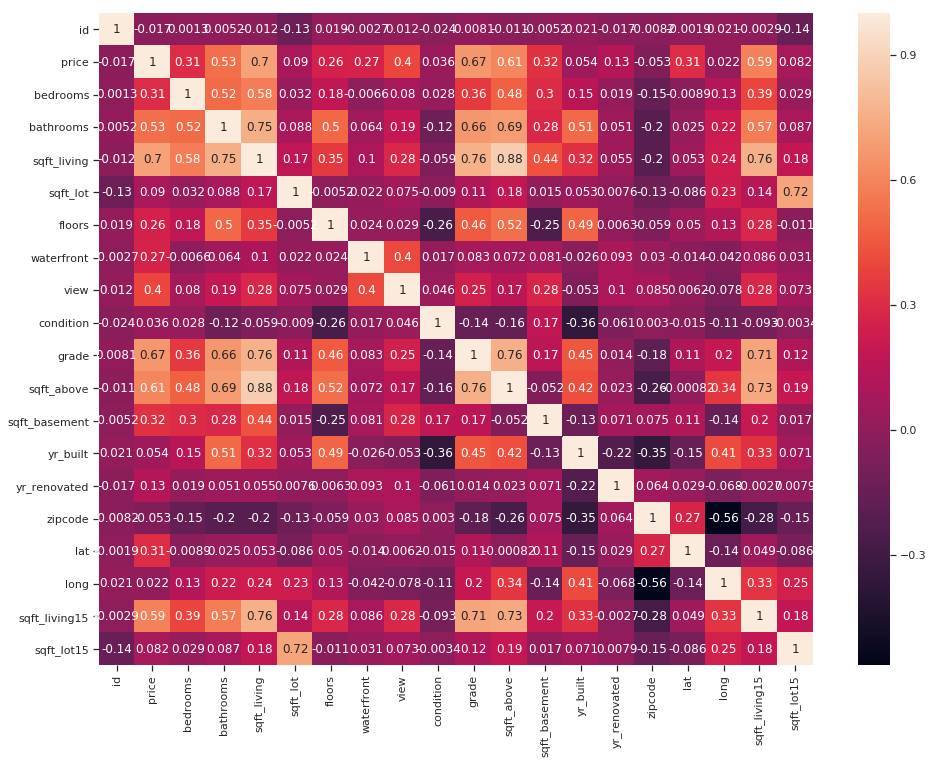
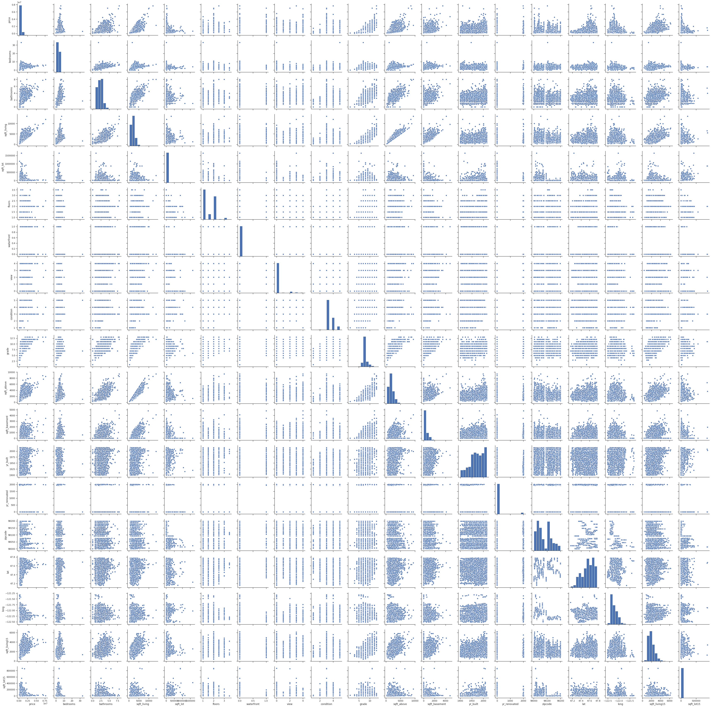
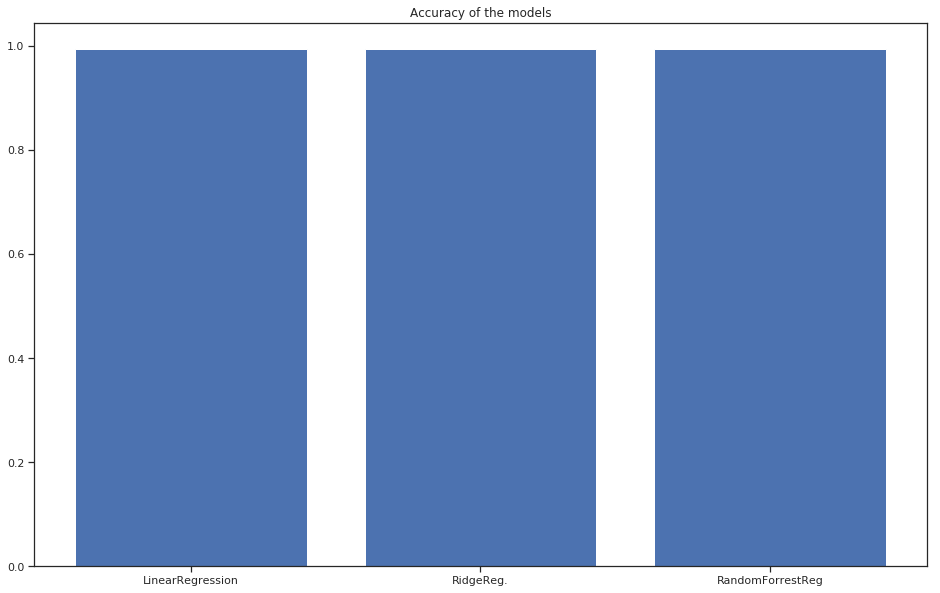

# House Sale Prediction 2014-2015

# 1.Import, cleaning data and visualization

Import libraries


```python
import numpy as np
import pprint
import matplotlib.pyplot as plt
%matplotlib inline
import pandas as pd
import seaborn as sns
from IPython.display import display
import plotly
import plotly.plotly as py
import plotly.graph_objs as go
from plotly.offline import iplot
import cufflinks.offline
import cufflinks as cf
cufflinks.offline.run_from_ipython()
sns.set(style="ticks")
cf.set_config_file(world_readable=True, theme='pearl', offline=True)
plt.rc('font', family='Verdana')
```


        <script type="text/javascript">
        window.PlotlyConfig = {MathJaxConfig: 'local'};
        if (window.MathJax) {MathJax.Hub.Config({SVG: {font: "STIX-Web"}});}
        if (typeof require !== 'undefined') {
        require.undef("plotly");
        requirejs.config({
            paths: {
                'plotly': ['https://cdn.plot.ly/plotly-latest.min']
            }
        });
        require(['plotly'], function(Plotly) {
            window._Plotly = Plotly;
        });
        }
        </script>
        


Import data and transform in to pandas dataframe 


```python
data = pd.read_csv('/home/shashy/Загрузки/housesalesprediction/kc_house_data.csv')
data.head()
```


<div>
<style scoped>
    .dataframe tbody tr th:only-of-type {
        vertical-align: middle;
    }

    .dataframe tbody tr th {
        vertical-align: top;
    }

    .dataframe thead th {
        text-align: right;
    }
</style>
<table border="1" class="dataframe">
  <thead>
    <tr style="text-align: right;">
      <th></th>
      <th>id</th>
      <th>date</th>
      <th>price</th>
      <th>bedrooms</th>
      <th>bathrooms</th>
      <th>sqft_living</th>
      <th>sqft_lot</th>
      <th>floors</th>
      <th>waterfront</th>
      <th>view</th>
      <th>...</th>
      <th>grade</th>
      <th>sqft_above</th>
      <th>sqft_basement</th>
      <th>yr_built</th>
      <th>yr_renovated</th>
      <th>zipcode</th>
      <th>lat</th>
      <th>long</th>
      <th>sqft_living15</th>
      <th>sqft_lot15</th>
    </tr>
  </thead>
  <tbody>
    <tr>
      <th>0</th>
      <td>7129300520</td>
      <td>20141013T000000</td>
      <td>221900.0</td>
      <td>3</td>
      <td>1.00</td>
      <td>1180</td>
      <td>5650</td>
      <td>1.0</td>
      <td>0</td>
      <td>0</td>
      <td>...</td>
      <td>7</td>
      <td>1180</td>
      <td>0</td>
      <td>1955</td>
      <td>0</td>
      <td>98178</td>
      <td>47.5112</td>
      <td>-122.257</td>
      <td>1340</td>
      <td>5650</td>
    </tr>
    <tr>
      <th>1</th>
      <td>6414100192</td>
      <td>20141209T000000</td>
      <td>538000.0</td>
      <td>3</td>
      <td>2.25</td>
      <td>2570</td>
      <td>7242</td>
      <td>2.0</td>
      <td>0</td>
      <td>0</td>
      <td>...</td>
      <td>7</td>
      <td>2170</td>
      <td>400</td>
      <td>1951</td>
      <td>1991</td>
      <td>98125</td>
      <td>47.7210</td>
      <td>-122.319</td>
      <td>1690</td>
      <td>7639</td>
    </tr>
    <tr>
      <th>2</th>
      <td>5631500400</td>
      <td>20150225T000000</td>
      <td>180000.0</td>
      <td>2</td>
      <td>1.00</td>
      <td>770</td>
      <td>10000</td>
      <td>1.0</td>
      <td>0</td>
      <td>0</td>
      <td>...</td>
      <td>6</td>
      <td>770</td>
      <td>0</td>
      <td>1933</td>
      <td>0</td>
      <td>98028</td>
      <td>47.7379</td>
      <td>-122.233</td>
      <td>2720</td>
      <td>8062</td>
    </tr>
    <tr>
      <th>3</th>
      <td>2487200875</td>
      <td>20141209T000000</td>
      <td>604000.0</td>
      <td>4</td>
      <td>3.00</td>
      <td>1960</td>
      <td>5000</td>
      <td>1.0</td>
      <td>0</td>
      <td>0</td>
      <td>...</td>
      <td>7</td>
      <td>1050</td>
      <td>910</td>
      <td>1965</td>
      <td>0</td>
      <td>98136</td>
      <td>47.5208</td>
      <td>-122.393</td>
      <td>1360</td>
      <td>5000</td>
    </tr>
    <tr>
      <th>4</th>
      <td>1954400510</td>
      <td>20150218T000000</td>
      <td>510000.0</td>
      <td>3</td>
      <td>2.00</td>
      <td>1680</td>
      <td>8080</td>
      <td>1.0</td>
      <td>0</td>
      <td>0</td>
      <td>...</td>
      <td>8</td>
      <td>1680</td>
      <td>0</td>
      <td>1987</td>
      <td>0</td>
      <td>98074</td>
      <td>47.6168</td>
      <td>-122.045</td>
      <td>1800</td>
      <td>7503</td>
    </tr>
  </tbody>
</table>
<p>5 rows × 21 columns</p>
</div>


Check the size of dataset


```python
data.shape
```


    (21613, 21)


Check the info about dataset and search a null objects


```python
data.info()
```

    <class 'pandas.core.frame.DataFrame'>
    RangeIndex: 21613 entries, 0 to 21612
    Data columns (total 21 columns):
    id               21613 non-null int64
    date             21613 non-null object
    price            21613 non-null float64
    bedrooms         21613 non-null int64
    bathrooms        21613 non-null float64
    sqft_living      21613 non-null int64
    sqft_lot         21613 non-null int64
    floors           21613 non-null float64
    waterfront       21613 non-null int64
    view             21613 non-null int64
    condition        21613 non-null int64
    grade            21613 non-null int64
    sqft_above       21613 non-null int64
    sqft_basement    21613 non-null int64
    yr_built         21613 non-null int64
    yr_renovated     21613 non-null int64
    zipcode          21613 non-null int64
    lat              21613 non-null float64
    long             21613 non-null float64
    sqft_living15    21613 non-null int64
    sqft_lot15       21613 non-null int64
    dtypes: float64(5), int64(15), object(1)
    memory usage: 3.5+ MB


Some visualization of price


```python
data['price'].iplot(kind='hist', xTitle='price',
                  yTitle='count', title='Price')
```


<div>
        
        
            <div id="91a92f26-5ad9-4b14-bbd2-6ebea874f893" class="plotly-graph-div" style="height:525px; width:100%;"></div>
            <script type="text/javascript">
                require(["plotly"], function(Plotly) {
                    window.PLOTLYENV=window.PLOTLYENV || {};
                    window.PLOTLYENV.BASE_URL='https://plot.ly';
                    
                if (document.getElementById("91a92f26-5ad9-4b14-bbd2-6ebea874f893")) {
                    Plotly.newPlot(
                        '91a92f26-5ad9-4b14-bbd2-6ebea874f893',
                        [{"histfunc": "count", "histnorm": "", "marker": {"color": "rgba(255, 153, 51, 1.0)", "line": {"color": "#4D5663", "width": 1.3}}, "name": "price", "opacity": 0.8, "orientation": "v", "type": "histogram", "uid": "60d638d8-75d2-4da9-9f21-4d1eceb58abd", "x": [221900.0, 538000.0, 180000.0, 604000.0, 510000.0, 1225000.0, 257500.0, 291850.0, 229500.0, 323000.0, 662500.0, 468000.0, 310000.0, 400000.0, 530000.0, 650000.0, 395000.0, 485000.0, 189000.0, 230000.0, 385000.0, 2000000.0, 285000.0, 252700.0, 329000.0, 233000.0, 937000.0, 667000.0, 438000.0, 719000.0, 580500.0, 280000.0, 687500.0, 535000.0, 322500.0, 696000.0, 550000.0, 640000.0, 240000.0, 605000.0, 625000.0, 775000.0, 861990.0, 685000.0, 309000.0, 488000.0, 210490.0, 785000.0, 450000.0, 1350000.0, 228000.0, 345000.0, 600000.0, 585000.0, 920000.0, 885000.0, 292500.0, 301000.0, 951000.0, 430000.0, 650000.0, 289000.0, 505000.0, 549000.0, 425000.0, 317625.0, 975000.0, 287000.0, 204000.0, 1325000.0, 1040000.0, 325000.0, 571000.0, 360000.0, 349000.0, 832500.0, 380000.0, 480000.0, 410000.0, 720000.0, 390000.0, 360000.0, 355000.0, 356000.0, 315000.0, 940000.0, 305000.0, 461000.0, 215000.0, 335000.0, 243500.0, 1099880.0, 153000.0, 430000.0, 700000.0, 905000.0, 247500.0, 199000.0, 314000.0, 437500.0, 850830.0, 555000.0, 699950.0, 1088000.0, 290000.0, 375000.0, 460000.0, 188500.0, 680000.0, 470000.0, 597750.0, 570000.0, 272500.0, 329950.0, 480000.0, 740500.0, 518500.0, 205425.0, 171800.0, 535000.0, 660000.0, 391500.0, 395000.0, 445000.0, 770000.0, 1450000.0, 445000.0, 260000.0, 822500.0, 430000.0, 212000.0, 660500.0, 784000.0, 453246.0, 675000.0, 199000.0, 220000.0, 452000.0, 382500.0, 519950.0, 665000.0, 527700.0, 205000.0, 420000.0, 500000.0, 921500.0, 890000.0, 430000.0, 258000.0, 511000.0, 532170.0, 560000.0, 282950.0, 2250000.0, 350000.0, 215000.0, 650000.0, 320000.0, 247000.0, 320000.0, 255000.0, 438000.0, 900000.0, 441000.0, 420000.0, 370000.0, 269950.0, 807100.0, 653000.0, 371500.0, 284000.0, 272000.0, 313000.0, 917500.0, 673000.0, 425000.0, 399950.0, 385000.0, 269950.0, 330000.0, 260000.0, 470000.0, 589000.0, 163500.0, 835000.0, 1095000.0, 269000.0, 560000.0, 615000.0, 585188.0, 305000.0, 166950.0, 799000.0, 400000.0, 230000.0, 256883.0, 423000.0, 465000.0, 440000.0, 385000.0, 210000.0, 297000.0, 470000.0, 226500.0, 274250.0, 840000.0, 677900.0, 425000.0, 180250.0, 464000.0, 320000.0, 625504.0, 592500.0, 465000.0, 477000.0, 280000.0, 1505000.0, 445838.0, 1072000.0, 467000.0, 686000.0, 279950.0, 527000.0, 325000.0, 328000.0, 390000.0, 479950.0, 264950.0, 235000.0, 516500.0, 655000.0, 500000.0, 315000.0, 213000.0, 475000.0, 1025000.0, 416000.0, 410000.0, 800000.0, 472000.0, 225000.0, 210000.0, 455000.0, 225000.0, 480000.0, 363000.0, 2400000.0, 181000.0, 250000.0, 481000.0, 260000.0, 455000.0, 415000.0, 349500.0, 245000.0, 592500.0, 385000.0, 315000.0, 255000.0, 693000.0, 780000.0, 237000.0, 525000.0, 425000.0, 369900.0, 290000.0, 285000.0, 415000.0, 272500.0, 2900000.0, 1365000.0, 436000.0, 210000.0, 236000.0, 331000.0, 365000.0, 450000.0, 770000.0, 455000.0, 405000.0, 304900.0, 170000.0, 2050000.0, 780000.0, 330000.0, 370000.0, 467000.0, 405000.0, 675000.0, 500000.0, 389999.0, 630000.0, 360000.0, 580000.0, 550000.0, 879000.0, 265000.0, 446500.0, 404000.0, 267500.0, 3075000.0, 335000.0, 576000.0, 208633.0, 315000.0, 725000.0, 550000.0, 610750.0, 550700.0, 665000.0, 834000.0, 201000.0, 2384000.0, 1384000.0, 1400000.0, 305000.0, 487000.0, 390000.0, 548000.0, 268750.0, 819900.0, 520000.0, 230000.0, 240000.0, 232000.0, 240500.0, 274975.0, 740000.0, 186375.0, 790000.0, 880000.0, 279000.0, 295000.0, 640000.0, 940000.0, 260000.0, 559900.0, 791500.0, 265000.0, 245000.0, 485000.0, 684000.0, 425000.0, 309600.0, 552250.0, 165000.0, 239900.0, 320000.0, 206600.0, 387000.0, 299000.0, 855000.0, 315000.0, 437500.0, 252000.0, 375000.0, 300000.0, 420000.0, 900000.0, 679900.0, 463000.0, 380000.0, 329500.0, 604950.0, 795000.0, 465000.0, 673000.0, 810000.0, 785000.0, 338000.0, 280000.0, 315000.0, 530000.0, 380000.0, 297000.0, 730000.0, 450000.0, 275000.0, 595000.0, 435000.0, 270000.0, 950000.0, 389000.0, 560000.0, 1350000.0, 799000.0, 365500.0, 252350.0, 403950.0, 385000.0, 345000.0, 490000.0, 330000.0, 927000.0, 1118000.0, 330000.0, 530000.0, 365000.0, 378750.0, 269900.0, 557000.0, 360000.0, 352000.0, 437000.0, 322500.0, 650000.0, 450000.0, 278500.0, 364950.0, 840000.0, 268000.0, 517534.0, 632925.0, 577500.0, 339000.0, 570000.0, 563500.0, 423000.0, 355000.0, 1550000.0, 482000.0, 625000.0, 538000.0, 380000.0, 375000.0, 245000.0, 310000.0, 1300000.0, 397000.0, 365000.0, 328500.0, 988000.0, 1000000.0, 237000.0, 525000.0, 749000.0, 722500.0, 843000.0, 438000.0, 578000.0, 227950.0, 196000.0, 641000.0, 350000.0, 205000.0, 400000.0, 1030000.0, 505000.0, 475000.0, 520000.0, 1450000.0, 333500.0, 232000.0, 691100.0, 811000.0, 551000.0, 496500.0, 705000.0, 578000.0, 255000.0, 1050000.0, 348000.0, 230000.0, 359500.0, 330000.0, 80000.0, 465000.0, 325000.0, 340500.0, 342500.0, 290900.0, 868700.0, 1199000.0, 1150000.0, 859900.0, 520000.0, 460000.0, 438924.0, 315000.0, 590000.0, 378500.0, 328500.0, 849950.0, 525000.0, 1385000.0, 295000.0, 1067000.0, 207950.0, 699900.0, 1280000.0, 452000.0, 370000.0, 232000.0, 669950.0, 397500.0, 490000.0, 725000.0, 299000.0, 625000.0, 437500.0, 650000.0, 475000.0, 342000.0, 1197350.0, 280000.0, 240000.0, 529000.0, 442000.0, 615000.0, 1485000.0, 585000.0, 480000.0, 1095000.0, 290000.0, 615000.0, 300000.0, 308000.0, 750000.0, 2250000.0, 890000.0, 288000.0, 190000.0, 515000.0, 235000.0, 275000.0, 727500.0, 650000.0, 1600000.0, 365000.0, 662000.0, 270500.0, 200000.0, 970000.0, 160000.0, 204000.0, 358000.0, 452000.0, 595000.0, 249000.0, 346900.0, 2125000.0, 280000.0, 318888.0, 530000.0, 375000.0, 910000.0, 782000.0, 259950.0, 315000.0, 215000.0, 705000.0, 1450000.0, 451000.0, 261000.0, 396000.0, 725000.0, 1950000.0, 238000.0, 750000.0, 331500.0, 460000.0, 404950.0, 880000.0, 863000.0, 638700.0, 435000.0, 260000.0, 671500.0, 610000.0, 405000.0, 338900.0, 720000.0, 442000.0, 650000.0, 263500.0, 300000.0, 266000.0, 930000.0, 530000.0, 180000.0, 619000.0, 264000.0, 730000.0, 439000.0, 268500.0, 330000.0, 640000.0, 900000.0, 370000.0, 685000.0, 505000.0, 265000.0, 290000.0, 296000.0, 360000.0, 240500.0, 372500.0, 595000.0, 515000.0, 1220000.0, 507000.0, 399950.0, 185000.0, 460000.0, 435500.0, 469000.0, 531000.0, 443500.0, 223000.0, 590000.0, 340000.0, 650000.0, 533600.0, 695000.0, 242000.0, 425000.0, 525000.0, 485000.0, 175000.0, 210000.0, 260000.0, 577000.0, 200000.0, 605000.0, 325000.0, 289500.0, 559950.0, 1042500.0, 543500.0, 480000.0, 218000.0, 565000.0, 426700.0, 650000.0, 542000.0, 415000.0, 214000.0, 245000.0, 314500.0, 1120000.0, 378000.0, 305000.0, 595000.0, 729500.0, 430000.0, 240000.0, 545000.0, 530000.0, 157000.0, 425000.0, 220000.0, 521000.0, 325000.0, 597500.0, 337000.0, 1000000.0, 3070000.0, 495000.0, 748000.0, 888000.0, 269900.0, 496500.0, 475000.0, 312000.0, 323000.0, 331000.0, 306000.0, 655000.0, 290000.0, 1250000.0, 460000.0, 435000.0, 664000.0, 865000.0, 385000.0, 497000.0, 280000.0, 188000.0, 478500.0, 1145000.0, 222000.0, 799000.0, 609900.0, 413000.0, 400000.0, 802541.0, 320000.0, 507000.0, 387500.0, 396000.0, 373000.0, 1484900.0, 359900.0, 410000.0, 690000.0, 245000.0, 700000.0, 268000.0, 225000.0, 980000.0, 795000.0, 195000.0, 480000.0, 485000.0, 130000.0, 325000.0, 440000.0, 550000.0, 310000.0, 530000.0, 390000.0, 243000.0, 639000.0, 215000.0, 405000.0, 250000.0, 405500.0, 452000.0, 730000.0, 267000.0, 289950.0, 565000.0, 1578000.0, 636000.0, 350000.0, 320000.0, 210000.0, 245000.0, 328000.0, 985000.0, 501000.0, 315000.0, 403000.0, 550000.0, 347500.0, 365000.0, 588000.0, 605000.0, 1300000.0, 233000.0, 360000.0, 459000.0, 740000.0, 305000.0, 395000.0, 560000.0, 650000.0, 449950.0, 517500.0, 435000.0, 329999.0, 950000.0, 447000.0, 699800.0, 850000.0, 316500.0, 942500.0, 1310000.0, 856600.0, 405600.0, 565000.0, 400000.0, 330000.0, 374950.0, 405300.0, 560000.0, 824000.0, 260000.0, 760000.0, 405000.0, 429900.0, 341500.0, 465250.0, 450000.0, 390000.0, 420000.0, 269950.0, 493000.0, 370000.0, 2250000.0, 305000.0, 400000.0, 320000.0, 715000.0, 650000.0, 218000.0, 500000.0, 460000.0, 232500.0, 408200.0, 522000.0, 675000.0, 1355000.0, 249950.0, 210000.0, 429950.0, 737500.0, 710000.0, 470000.0, 1100000.0, 650000.0, 1216000.0, 422120.0, 625000.0, 385200.0, 500000.0, 308000.0, 565000.0, 581000.0, 361000.0, 345000.0, 419000.0, 347000.0, 625000.0, 2400000.0, 379000.0, 310000.0, 250000.0, 682000.0, 246500.0, 325000.0, 310950.0, 1100000.0, 287500.0, 431000.0, 226000.0, 825000.0, 175000.0, 465750.0, 659000.0, 595000.0, 350000.0, 270000.0, 662500.0, 249900.0, 324500.0, 430000.0, 419950.0, 285000.0, 332000.0, 282000.0, 320000.0, 428750.0, 330000.0, 456500.0, 352000.0, 664000.0, 628000.0, 512000.0, 254000.0, 535800.0, 287653.0, 438000.0, 450000.0, 327000.0, 370500.0, 265000.0, 450000.0, 425000.0, 166600.0, 245000.0, 565000.0, 539900.0, 910000.0, 280000.0, 275000.0, 467000.0, 457500.0, 381156.0, 289999.0, 642450.0, 469950.0, 795000.0, 785000.0, 860000.0, 1095000.0, 147500.0, 390000.0, 229000.0, 185000.0, 414900.0, 200000.0, 225000.0, 720000.0, 930000.0, 1270000.0, 700000.0, 466000.0, 374000.0, 480000.0, 740000.0, 1010000.0, 395000.0, 340000.0, 209000.0, 431650.0, 980000.0, 660000.0, 730000.0, 291500.0, 905000.0, 800000.0, 839900.0, 200000.0, 300000.0, 530000.0, 314950.0, 255000.0, 550000.0, 435000.0, 234000.0, 615000.0, 205000.0, 384000.0, 324000.0, 645000.0, 570000.0, 324000.0, 270000.0, 290000.0, 250000.0, 342000.0, 255000.0, 800000.0, 451000.0, 990000.0, 288400.0, 420000.0, 359000.0, 390000.0, 300000.0, 545000.0, 288349.0, 299900.0, 891000.0, 1200000.0, 378000.0, 299995.0, 253000.0, 350000.0, 565000.0, 315000.0, 570000.0, 971000.0, 915000.0, 419000.0, 260000.0, 1321500.0, 369950.0, 1029900.0, 435000.0, 601000.0, 460500.0, 720000.0, 851000.0, 550000.0, 700000.0, 323000.0, 345500.0, 378000.0, 650000.0, 385000.0, 425000.0, 210000.0, 630000.0, 335000.0, 196500.0, 582800.0, 440000.0, 752500.0, 532500.0, 265000.0, 397500.0, 524250.0, 765000.0, 648000.0, 469500.0, 237500.0, 216000.0, 427200.0, 280000.0, 718000.0, 420000.0, 379000.0, 326100.0, 535000.0, 283000.0, 260000.0, 399000.0, 484950.0, 640000.0, 585000.0, 645000.0, 253000.0, 178500.0, 291000.0, 199950.0, 553500.0, 189950.0, 289000.0, 700000.0, 270000.0, 258000.0, 530000.0, 245000.0, 563000.0, 515000.0, 325000.0, 540000.0, 280300.0, 460000.0, 475000.0, 900000.0, 538200.0, 429000.0, 164808.0, 520000.0, 475000.0, 283000.0, 321500.0, 840000.0, 287000.0, 375000.0, 349500.0, 446450.0, 315000.0, 271310.0, 315000.0, 245000.0, 543115.0, 900000.0, 2450000.0, 554000.0, 249900.0, 768000.0, 980000.0, 395000.0, 415000.0, 380000.0, 566000.0, 218500.0, 550000.0, 512031.0, 197500.0, 470000.0, 590000.0, 465000.0, 499000.0, 515000.0, 716500.0, 410000.0, 850000.0, 1050000.0, 648000.0, 620000.0, 935000.0, 379000.0, 699000.0, 528000.0, 425000.0, 249500.0, 1035480.0, 790000.0, 399950.0, 275000.0, 550000.0, 140000.0, 250000.0, 318000.0, 505000.0, 470500.0, 360000.0, 1242500.0, 986000.0, 515000.0, 320000.0, 310000.0, 356700.0, 775000.0, 325000.0, 208000.0, 825000.0, 515000.0, 490000.0, 675000.0, 360000.0, 550000.0, 225000.0, 500000.0, 385000.0, 837700.0, 448000.0, 730000.0, 575000.0, 430000.0, 435000.0, 241000.0, 453500.0, 285000.0, 151000.0, 1570000.0, 631000.0, 285000.0, 195000.0, 817500.0, 550000.0, 1127000.0, 609850.0, 200000.0, 367000.0, 285167.0, 275000.0, 350900.0, 660000.0, 525000.0, 262000.0, 690000.0, 624000.0, 353000.0, 552500.0, 224500.0, 239000.0, 975000.0, 1200000.0, 505000.0, 302000.0, 170000.0, 195000.0, 272000.0, 369000.0, 332500.0, 515000.0, 269000.0, 1278000.0, 303000.0, 420000.0, 400000.0, 225000.0, 219000.0, 605000.0, 625000.0, 380000.0, 620000.0, 687500.0, 225500.0, 252500.0, 510000.0, 510000.0, 725000.0, 75000.0, 492000.0, 425000.0, 1955000.0, 298900.0, 699000.0, 310000.0, 350000.0, 790000.0, 305000.0, 315000.0, 267500.0, 1750000.0, 435000.0, 482500.0, 5110800.0, 439995.0, 460000.0, 194000.0, 290000.0, 274700.0, 900000.0, 1150000.0, 605000.0, 359000.0, 850000.0, 505000.0, 565000.0, 585000.0, 328000.0, 749950.0, 826000.0, 535000.0, 925000.0, 875000.0, 902000.0, 423000.0, 235000.0, 545000.0, 343000.0, 334950.0, 405000.0, 220000.0, 173000.0, 655000.0, 406000.0, 632000.0, 357000.0, 361000.0, 277000.0, 630000.0, 254000.0, 472800.0, 263000.0, 510000.0, 179950.0, 525000.0, 479000.0, 651000.0, 949000.0, 392400.0, 585000.0, 460000.0, 470000.0, 245000.0, 500000.0, 455000.0, 485500.0, 1875000.0, 100000.0, 307000.0, 475000.0, 330000.0, 130000.0, 320000.0, 735000.0, 365000.0, 234000.0, 211000.0, 680000.0, 457000.0, 349000.0, 360000.0, 350000.0, 208000.0, 250275.0, 435000.0, 270000.0, 438000.0, 659000.0, 645000.0, 685100.0, 350000.0, 375000.0, 170000.0, 880000.0, 410500.0, 780000.0, 1225000.0, 449000.0, 546000.0, 317000.0, 276900.0, 399000.0, 495000.0, 258000.0, 600000.0, 265000.0, 321000.0, 682000.0, 295700.0, 609000.0, 995000.0, 530000.0, 614000.0, 390000.0, 467000.0, 484000.0, 340000.0, 302495.0, 532500.0, 441500.0, 470000.0, 2300000.0, 590000.0, 320000.0, 363000.0, 747500.0, 750000.0, 831000.0, 403000.0, 445000.0, 345000.0, 2260000.0, 371025.0, 355000.0, 270000.0, 425000.0, 364808.0, 320000.0, 325000.0, 350000.0, 170000.0, 255000.0, 550000.0, 835000.0, 420000.0, 925000.0, 389250.0, 748000.0, 284000.0, 588000.0, 372500.0, 285000.0, 360000.0, 275000.0, 428000.0, 847000.0, 316000.0, 375000.0, 533000.0, 556000.0, 225000.0, 537250.0, 255000.0, 530000.0, 5300000.0, 595000.0, 548000.0, 234975.0, 600000.0, 432000.0, 455000.0, 279950.0, 267500.0, 620000.0, 110000.0, 625000.0, 389000.0, 1200000.0, 788500.0, 567000.0, 515000.0, 605000.0, 430000.0, 805000.0, 567500.0, 647500.0, 495000.0, 825000.0, 435000.0, 445950.0, 960000.0, 780000.0, 274500.0, 729953.0, 464950.0, 620000.0, 735000.0, 450000.0, 450000.0, 842500.0, 360000.0, 585000.0, 461000.0, 345000.0, 1075000.0, 643000.0, 690000.0, 282000.0, 549000.0, 815000.0, 2200000.0, 700000.0, 933399.0, 290000.0, 372000.0, 450000.0, 303700.0, 672000.0, 334000.0, 260000.0, 749950.0, 330000.0, 830000.0, 1131000.0, 320000.0, 260000.0, 225000.0, 279200.0, 520000.0, 505000.0, 234000.0, 503000.0, 606000.0, 433500.0, 250000.0, 719000.0, 381000.0, 267000.0, 275000.0, 651000.0, 439000.0, 325000.0, 490000.0, 519900.0, 545000.0, 1062500.0, 542000.0, 465000.0, 408000.0, 292000.0, 253000.0, 280000.0, 658588.0, 635000.0, 439000.0, 300000.0, 345000.0, 283500.0, 425000.0, 685000.0, 750000.0, 245000.0, 585444.0, 706000.0, 445000.0, 241000.0, 1175000.0, 530000.0, 350000.0, 1700000.0, 389000.0, 799000.0, 1400000.0, 340895.0, 780000.0, 350000.0, 470000.0, 914600.0, 354000.0, 470000.0, 715000.0, 265000.0, 2537000.0, 640000.0, 290000.0, 480000.0, 535000.0, 907000.0, 459000.0, 1355000.0, 264950.0, 352950.0, 491500.0, 1229000.0, 369500.0, 566000.0, 290000.0, 5350000.0, 180000.0, 215000.0, 302000.0, 352500.0, 235867.0, 500000.0, 382000.0, 515000.0, 250000.0, 672500.0, 755000.0, 707500.0, 459000.0, 140000.0, 495000.0, 757000.0, 765000.0, 359000.0, 440000.0, 400000.0, 652000.0, 260000.0, 1328000.0, 519500.0, 650000.0, 280000.0, 515000.0, 400000.0, 652100.0, 235000.0, 701000.0, 640000.0, 455800.0, 504750.0, 483000.0, 530000.0, 250000.0, 229950.0, 884744.0, 514000.0, 532000.0, 423000.0, 420000.0, 521000.0, 577000.0, 425000.0, 495000.0, 340000.0, 499950.0, 1218000.0, 720000.0, 249000.0, 206135.0, 300000.0, 612000.0, 1102030.0, 230000.0, 850000.0, 355000.0, 442000.0, 399000.0, 360000.0, 390000.0, 413000.0, 190000.0, 432900.0, 621138.0, 270000.0, 610000.0, 500000.0, 715000.0, 264000.0, 550000.0, 337000.0, 170000.0, 405000.0, 775000.0, 425000.0, 713000.0, 555000.0, 810000.0, 1250000.0, 819000.0, 409900.0, 935000.0, 657500.0, 900000.0, 932800.0, 391000.0, 420000.0, 1300000.0, 415000.0, 350000.0, 375000.0, 860000.0, 495000.0, 250000.0, 365000.0, 503000.0, 150000.0, 450000.0, 355000.0, 245000.0, 265900.0, 299000.0, 957500.0, 343000.0, 307500.0, 937500.0, 610000.0, 720000.0, 610000.0, 434500.0, 602500.0, 607010.0, 610000.0, 828500.0, 199990.0, 294000.0, 789500.0, 797000.0, 539950.0, 284950.0, 776500.0, 525000.0, 303000.0, 722080.0, 140000.0, 235000.0, 440000.0, 605000.0, 380000.0, 352000.0, 420000.0, 1175000.0, 1375000.0, 300000.0, 1150000.0, 453500.0, 443500.0, 332000.0, 655000.0, 475000.0, 372500.0, 1050000.0, 500000.0, 900000.0, 327500.0, 390000.0, 451101.0, 455000.0, 650000.0, 895000.0, 800000.0, 703770.0, 249950.0, 512000.0, 780000.0, 336000.0, 285000.0, 229900.0, 667500.0, 378000.0, 454000.0, 537500.0, 425000.0, 290000.0, 349500.0, 370000.0, 549500.0, 245000.0, 208000.0, 248000.0, 610000.0, 550000.0, 750000.0, 192000.0, 169317.0, 1198000.0, 880000.0, 210000.0, 180500.0, 540000.0, 520000.0, 177500.0, 415000.0, 495000.0, 325000.0, 440000.0, 411000.0, 810000.0, 561750.0, 835100.0, 450000.0, 238000.0, 299000.0, 570000.0, 340000.0, 450000.0, 272750.0, 520000.0, 284950.0, 255000.0, 231500.0, 415000.0, 330000.0, 365000.0, 425000.0, 400000.0, 335000.0, 342000.0, 490000.0, 331500.0, 960000.0, 720500.0, 830000.0, 662990.0, 220000.0, 349950.0, 550000.0, 396000.0, 635000.0, 293000.0, 339000.0, 285000.0, 775000.0, 224000.0, 2250000.0, 165050.0, 275000.0, 445000.0, 510000.0, 1230000.0, 390000.0, 460000.0, 700000.0, 874150.0, 470000.0, 374000.0, 510000.0, 467000.0, 576000.0, 196440.0, 825000.0, 281000.0, 326000.0, 340000.0, 440000.0, 749000.0, 340000.0, 561000.0, 270000.0, 600000.0, 219900.0, 617000.0, 469000.0, 229000.0, 1265000.0, 365000.0, 429000.0, 550000.0, 453000.0, 187500.0, 520500.0, 300000.0, 799000.0, 338000.0, 800000.0, 360000.0, 442500.0, 700000.0, 830000.0, 360400.0, 345000.0, 300000.0, 350000.0, 368000.0, 264000.0, 435000.0, 200000.0, 620000.0, 1679000.0, 337000.0, 1928000.0, 544500.0, 252000.0, 445000.0, 379500.0, 189950.0, 469000.0, 600000.0, 785000.0, 372000.0, 445000.0, 508000.0, 780000.0, 541100.0, 729000.0, 397000.0, 451555.0, 300000.0, 416000.0, 490000.0, 480000.0, 368000.0, 1038000.0, 545000.0, 850000.0, 550000.0, 600000.0, 535000.0, 599950.0, 531000.0, 530000.0, 597326.0, 805000.0, 390000.0, 487250.0, 301000.0, 1175000.0, 299000.0, 2350000.0, 400000.0, 467500.0, 305000.0, 210000.0, 300000.0, 327500.0, 269000.0, 975000.0, 355000.0, 712000.0, 883000.0, 190000.0, 443000.0, 920000.0, 285000.0, 901000.0, 552500.0, 256000.0, 341000.0, 279000.0, 686000.0, 225000.0, 215500.0, 950000.0, 503000.0, 780000.0, 212000.0, 580000.0, 465000.0, 206000.0, 615000.0, 519000.0, 1135000.0, 330000.0, 240000.0, 574000.0, 930000.0, 850000.0, 415000.0, 480000.0, 300000.0, 439000.0, 450000.0, 589000.0, 477000.0, 587500.0, 1315000.0, 1430000.0, 700000.0, 275000.0, 367500.0, 453250.0, 607000.0, 255000.0, 501000.0, 450000.0, 360000.0, 460000.0, 753000.0, 389950.0, 469000.0, 550000.0, 565000.0, 189650.0, 1525000.0, 260000.0, 243000.0, 1100000.0, 249000.0, 720000.0, 905000.0, 824500.0, 762500.0, 580000.0, 380000.0, 805000.0, 520000.0, 1569500.0, 175000.0, 353500.0, 500000.0, 386500.0, 210000.0, 439500.0, 315000.0, 339000.0, 655000.0, 740000.0, 685000.0, 550000.0, 405000.0, 765000.0, 625000.0, 207000.0, 370000.0, 475000.0, 365000.0, 411800.0, 668000.0, 618000.0, 247500.0, 345000.0, 616300.0, 348000.0, 425000.0, 850000.0, 820000.0, 832000.0, 835000.0, 350000.0, 349000.0, 1125000.0, 320000.0, 150000.0, 340000.0, 785500.0, 410500.0, 580000.0, 345000.0, 550000.0, 449500.0, 300000.0, 915000.0, 1575000.0, 599000.0, 755000.0, 400000.0, 133000.0, 330000.0, 330000.0, 375000.0, 485000.0, 470000.0, 1045000.0, 548800.0, 315000.0, 590000.0, 439950.0, 325000.0, 400000.0, 685000.0, 339950.0, 315000.0, 411753.0, 577000.0, 500000.0, 210000.0, 640000.0, 460000.0, 265000.0, 740000.0, 230000.0, 315000.0, 432000.0, 467000.0, 255000.0, 316500.0, 190000.0, 490000.0, 378000.0, 598800.0, 333800.0, 690000.0, 320000.0, 1249000.0, 335000.0, 840000.0, 608250.0, 550000.0, 240000.0, 998000.0, 275000.0, 284200.0, 1715000.0, 2400000.0, 930800.0, 930000.0, 215000.0, 480000.0, 483945.0, 347000.0, 232500.0, 390000.0, 550000.0, 590000.0, 420850.0, 345000.0, 429800.0, 302000.0, 800000.0, 250000.0, 605000.0, 412000.0, 252000.0, 375000.0, 725000.0, 471750.0, 490000.0, 439000.0, 355000.0, 250000.0, 780000.0, 409000.0, 420000.0, 200000.0, 830000.0, 695000.0, 815000.0, 210000.0, 635000.0, 562500.0, 402500.0, 555000.0, 310000.0, 500000.0, 430000.0, 1600000.0, 627500.0, 335000.0, 962000.0, 299000.0, 399950.0, 322000.0, 430000.0, 307000.0, 194000.0, 180000.0, 465000.0, 722500.0, 470450.0, 280000.0, 176250.0, 560000.0, 830000.0, 276900.0, 625000.0, 1015000.0, 463500.0, 485000.0, 272000.0, 305000.0, 760000.0, 387500.0, 352000.0, 507000.0, 156000.0, 580000.0, 630000.0, 275000.0, 835000.0, 340000.0, 329350.0, 1480000.0, 475000.0, 719950.0, 235000.0, 875000.0, 380000.0, 325000.0, 475000.0, 152900.0, 210000.0, 350000.0, 505000.0, 464900.0, 650000.0, 369950.0, 250000.0, 320000.0, 2532000.0, 340000.0, 440000.0, 219950.0, 940000.0, 399950.0, 1568000.0, 528000.0, 545000.0, 575000.0, 235000.0, 272000.0, 380000.0, 195000.0, 297000.0, 349000.0, 320000.0, 319990.0, 439900.0, 429000.0, 272500.0, 400000.0, 462000.0, 510000.0, 550000.0, 150000.0, 460000.0, 632500.0, 361000.0, 437000.0, 370000.0, 884250.0, 225000.0, 235000.0, 767500.0, 1200000.0, 715000.0, 417000.0, 199000.0, 875000.0, 545000.0, 192500.0, 822500.0, 800000.0, 1250000.0, 3850000.0, 295000.0, 419000.0, 1195000.0, 750000.0, 502000.0, 1025000.0, 398500.0, 700000.0, 248000.0, 800000.0, 383000.0, 688000.0, 521000.0, 365000.0, 491000.0, 643000.0, 279000.0, 583500.0, 310000.0, 310000.0, 280000.0, 272000.0, 870000.0, 307000.0, 490000.0, 399950.0, 1635000.0, 989000.0, 264950.0, 491500.0, 345000.0, 339900.0, 852000.0, 585000.0, 723000.0, 594000.0, 405000.0, 725500.0, 800000.0, 1325000.0, 180500.0, 325000.0, 235000.0, 330000.0, 678500.0, 463000.0, 250000.0, 655000.0, 239900.0, 185000.0, 1735000.0, 251700.0, 400000.0, 735000.0, 1700000.0, 82500.0, 765000.0, 292500.0, 270000.0, 415000.0, 950000.0, 353000.0, 670950.0, 280950.0, 585000.0, 525000.0, 605000.0, 1010000.0, 245990.0, 535000.0, 410000.0, 550000.0, 665000.0, 455000.0, 440000.0, 332000.0, 280000.0, 570000.0, 250000.0, 238000.0, 265000.0, 306000.0, 345000.0, 765000.0, 346300.0, 342500.0, 501000.0, 270000.0, 638000.0, 460000.0, 760000.0, 1085000.0, 234000.0, 1650000.0, 488000.0, 1550000.0, 499000.0, 150000.0, 333000.0, 700000.0, 275000.0, 330000.0, 360000.0, 467000.0, 568000.0, 605000.0, 750000.0, 760000.0, 265000.0, 490000.0, 360000.0, 311750.0, 399000.0, 347000.0, 1680000.0, 585000.0, 340000.0, 612000.0, 230000.0, 604000.0, 250000.0, 258500.0, 783000.0, 1050000.0, 760000.0, 276000.0, 550000.0, 398000.0, 775000.0, 1027500.0, 327000.0, 564500.0, 782000.0, 398000.0, 257000.0, 235000.0, 453000.0, 535000.0, 275000.0, 665000.0, 670000.0, 465000.0, 210000.0, 265000.0, 426000.0, 529219.0, 600000.0, 875000.0, 608000.0, 220000.0, 1760000.0, 295450.0, 315000.0, 205000.0, 310000.0, 1000000.0, 525000.0, 284000.0, 510000.0, 405000.0, 509950.0, 600000.0, 990000.0, 280005.0, 700000.0, 330000.0, 340000.0, 468000.0, 1339000.0, 515000.0, 245000.0, 265000.0, 372400.0, 390000.0, 208000.0, 273000.0, 455000.0, 270000.0, 618000.0, 213550.0, 210000.0, 2750000.0, 403500.0, 235000.0, 287500.0, 546800.0, 183000.0, 560000.0, 299500.0, 610000.0, 288350.0, 500000.0, 625000.0, 418000.0, 660000.0, 775000.0, 429500.0, 569000.0, 250000.0, 225000.0, 530000.0, 306000.0, 517100.0, 354950.0, 348000.0, 522250.0, 275000.0, 390000.0, 260000.0, 585000.0, 605000.0, 342000.0, 900000.0, 252000.0, 357000.0, 370000.0, 322500.0, 210000.0, 290000.0, 860000.0, 302000.0, 369160.0, 1185000.0, 993000.0, 380000.0, 635000.0, 260000.0, 243000.0, 1400000.0, 665000.0, 898000.0, 583000.0, 429000.0, 471000.0, 1810000.0, 739500.0, 450000.0, 552500.0, 437000.0, 270000.0, 226740.0, 446500.0, 283000.0, 445000.0, 250000.0, 307000.0, 315000.0, 555000.0, 264900.0, 510000.0, 328000.0, 358000.0, 325000.0, 1365000.0, 230000.0, 545000.0, 705380.0, 459000.0, 815000.0, 495000.0, 520000.0, 430000.0, 255000.0, 588000.0, 350000.0, 625000.0, 172500.0, 554000.0, 775000.0, 1187500.0, 618000.0, 305000.0, 232000.0, 262000.0, 234000.0, 500000.0, 278000.0, 230000.0, 500000.0, 366500.0, 665000.0, 1101000.0, 575000.0, 674750.0, 719000.0, 482000.0, 254000.0, 443725.0, 575000.0, 469000.0, 175000.0, 437000.0, 550000.0, 172040.0, 363000.0, 282000.0, 400000.0, 650000.0, 365000.0, 269950.0, 260000.0, 193000.0, 340000.0, 900000.0, 371000.0, 592000.0, 300000.0, 449950.0, 299500.0, 995000.0, 335000.0, 280000.0, 446000.0, 1544500.0, 325000.0, 450000.0, 322500.0, 453000.0, 655000.0, 603000.0, 235000.0, 968933.0, 1015000.0, 435000.0, 242000.0, 487000.0, 810000.0, 625000.0, 165000.0, 335000.0, 286700.0, 699000.0, 280000.0, 580000.0, 754800.0, 525000.0, 562000.0, 575000.0, 808900.0, 992000.0, 335000.0, 473000.0, 350000.0, 1600000.0, 305500.0, 306000.0, 233000.0, 490000.0, 445000.0, 355000.0, 360000.0, 737500.0, 985000.0, 349950.0, 520000.0, 355950.0, 485000.0, 143000.0, 3278000.0, 355000.0, 1126000.0, 200000.0, 913000.0, 1600000.0, 409900.0, 265000.0, 740000.0, 306000.0, 381000.0, 1220000.0, 1050000.0, 408000.0, 739900.0, 674250.0, 438400.0, 1700000.0, 703000.0, 262000.0, 353000.0, 500000.0, 1280000.0, 332000.0, 824000.0, 290000.0, 700000.0, 550000.0, 549000.0, 1865000.0, 858000.0, 345000.0, 340000.0, 1215000.0, 275000.0, 405000.0, 432500.0, 236500.0, 679000.0, 543000.0, 294000.0, 340500.0, 1012000.0, 335000.0, 425000.0, 353000.0, 540000.0, 640000.0, 339950.0, 195000.0, 322000.0, 660000.0, 280000.0, 300000.0, 207500.0, 195000.0, 700000.0, 560000.0, 260000.0, 575000.0, 475000.0, 285000.0, 753888.0, 650000.0, 620000.0, 526000.0, 155000.0, 342000.0, 390000.0, 685000.0, 608000.0, 179900.0, 1245000.0, 166000.0, 462000.0, 545000.0, 415000.0, 269000.0, 356500.0, 225000.0, 175000.0, 549000.0, 535000.0, 627000.0, 565000.0, 392450.0, 509000.0, 340000.0, 537000.0, 865000.0, 358000.0, 595000.0, 661000.0, 419950.0, 490000.0, 525000.0, 350000.0, 552500.0, 210000.0, 390000.0, 336800.0, 465000.0, 299900.0, 715000.0, 235000.0, 276000.0, 265000.0, 425000.0, 313000.0, 715000.0, 265000.0, 646000.0, 175000.0, 649000.0, 785000.0, 890000.0, 612000.0, 330000.0, 493000.0, 1600000.0, 1620000.0, 1650000.0, 499000.0, 603500.0, 530000.0, 895000.0, 267345.0, 275000.0, 439950.0, 455000.0, 630000.0, 690000.0, 212000.0, 231500.0, 1237500.0, 378500.0, 482000.0, 695000.0, 965000.0, 675000.0, 387000.0, 347500.0, 385000.0, 265000.0, 406000.0, 134000.0, 415000.0, 375000.0, 620000.0, 337500.0, 565000.0, 399500.0, 1065000.0, 352500.0, 259000.0, 320000.0, 733000.0, 381500.0, 343000.0, 205500.0, 525000.0, 300000.0, 299000.0, 561000.0, 450000.0, 540000.0, 379000.0, 230000.0, 399950.0, 355000.0, 580000.0, 700000.0, 279900.0, 210000.0, 1165000.0, 290300.0, 1599950.0, 490000.0, 606000.0, 359950.0, 677100.0, 465000.0, 4500000.0, 500000.0, 455000.0, 705000.0, 420000.0, 169575.0, 250000.0, 530000.0, 590000.0, 257500.0, 415000.0, 536000.0, 246500.0, 395000.0, 739000.0, 1272000.0, 190000.0, 305000.0, 925000.0, 895000.0, 656000.0, 560000.0, 610000.0, 645000.0, 259000.0, 980000.0, 872000.0, 1000000.0, 900000.0, 475000.0, 350000.0, 840000.0, 500000.0, 202500.0, 523000.0, 225000.0, 418200.0, 356500.0, 670000.0, 456150.0, 471000.0, 558000.0, 1380000.0, 161500.0, 311000.0, 470000.0, 569000.0, 689000.0, 271900.0, 278000.0, 820000.0, 399500.0, 462000.0, 347500.0, 562100.0, 230000.0, 687000.0, 725786.0, 315500.0, 312000.0, 343000.0, 385195.0, 415000.0, 461000.0, 369990.0, 349950.0, 285750.0, 542500.0, 830000.0, 705000.0, 615000.0, 184500.0, 412000.0, 250000.0, 580000.0, 220000.0, 675000.0, 373500.0, 662700.0, 239950.0, 383000.0, 485000.0, 610000.0, 545000.0, 780000.0, 305000.0, 405000.0, 1110000.0, 273000.0, 326500.0, 365000.0, 1000750.0, 422500.0, 354450.0, 320000.0, 223000.0, 410000.0, 438000.0, 390000.0, 298500.0, 749999.0, 779000.0, 570000.0, 385000.0, 649000.0, 283000.0, 699900.0, 278500.0, 700000.0, 535000.0, 234500.0, 374150.0, 397000.0, 613000.0, 1150000.0, 595000.0, 340000.0, 388000.0, 404000.0, 810000.0, 405000.0, 726000.0, 266000.0, 722500.0, 352000.0, 265000.0, 856000.0, 346950.0, 866059.0, 410000.0, 370000.0, 230000.0, 400000.0, 172000.0, 615000.0, 860000.0, 555000.0, 579000.0, 385000.0, 420000.0, 645000.0, 549950.0, 678000.0, 199000.0, 604000.0, 268000.0, 960000.0, 509250.0, 416000.0, 190000.0, 212000.0, 325900.0, 560000.0, 275000.0, 665000.0, 1505000.0, 375000.0, 359950.0, 340000.0, 401000.0, 669000.0, 638500.0, 545000.0, 524000.0, 1610000.0, 280000.0, 828000.0, 223000.0, 1289000.0, 750000.0, 430000.0, 711000.0, 310000.0, 415000.0, 274900.0, 525000.0, 179500.0, 478000.0, 195000.0, 385000.0, 401000.0, 522000.0, 330000.0, 503000.0, 175000.0, 963990.0, 845000.0, 157500.0, 450000.0, 925000.0, 600000.0, 709000.0, 1385000.0, 248000.0, 245000.0, 332000.0, 459950.0, 425000.0, 460000.0, 838300.0, 256000.0, 864000.0, 900000.0, 145600.0, 865000.0, 250250.0, 162000.0, 450000.0, 675500.0, 697000.0, 1324050.0, 490000.0, 590000.0, 280000.0, 515000.0, 576000.0, 375000.0, 478000.0, 282000.0, 1400000.0, 593500.0, 724950.0, 306000.0, 341000.0, 399950.0, 534000.0, 635000.0, 350000.0, 856000.0, 582000.0, 799000.0, 423700.0, 1835000.0, 322000.0, 929000.0, 443000.0, 441500.0, 875000.0, 3600000.0, 450000.0, 425000.0, 660000.0, 763101.0, 499000.0, 521000.0, 302000.0, 293000.0, 335000.0, 499000.0, 600000.0, 720000.0, 195000.0, 249000.0, 334000.0, 599950.0, 149900.0, 700000.0, 525000.0, 1049000.0, 402000.0, 450000.0, 520000.0, 205000.0, 635000.0, 210500.0, 406650.0, 350000.0, 425000.0, 798000.0, 180000.0, 1250000.0, 435000.0, 355000.0, 3000000.0, 685000.0, 311000.0, 305000.0, 675000.0, 769000.0, 430000.0, 516250.0, 760000.0, 579950.0, 476000.0, 510000.0, 205000.0, 240000.0, 738000.0, 420000.0, 455000.0, 765000.0, 372000.0, 160000.0, 772000.0, 1125000.0, 479000.0, 570000.0, 350000.0, 353000.0, 699000.0, 265000.0, 167000.0, 500000.0, 700000.0, 295000.0, 1010000.0, 209000.0, 276000.0, 380000.0, 315000.0, 685530.0, 254600.0, 230000.0, 335000.0, 550000.0, 123300.0, 275436.0, 325000.0, 635000.0, 513000.0, 580000.0, 225000.0, 265000.0, 313000.0, 296000.0, 655500.0, 250750.0, 438000.0, 590000.0, 329500.0, 1195000.0, 415000.0, 900000.0, 378000.0, 474000.0, 464000.0, 310000.0, 580000.0, 999000.0, 510000.0, 650000.0, 196000.0, 220000.0, 855000.0, 483000.0, 400000.0, 435000.0, 219500.0, 2950000.0, 427000.0, 430000.0, 685000.0, 495000.0, 299950.0, 390000.0, 385000.0, 740000.0, 991700.0, 765000.0, 802000.0, 950000.0, 392000.0, 590000.0, 425000.0, 765000.0, 313500.0, 320000.0, 604000.0, 570000.0, 639000.0, 335000.0, 896000.0, 259500.0, 637000.0, 307450.0, 535000.0, 669500.0, 259000.0, 441000.0, 228800.0, 530000.0, 524000.0, 430000.0, 1325000.0, 210000.0, 449000.0, 945000.0, 200450.0, 219950.0, 659500.0, 746000.0, 540000.0, 485000.0, 202000.0, 2525000.0, 502000.0, 279000.0, 409500.0, 453000.0, 367000.0, 550000.0, 273500.0, 505000.0, 770000.0, 565000.0, 316000.0, 160000.0, 170000.0, 235000.0, 1799000.0, 310000.0, 285000.0, 280000.0, 2298000.0, 763776.0, 530000.0, 362000.0, 430000.0, 456500.0, 445000.0, 386900.0, 479000.0, 525000.0, 272000.0, 517000.0, 615000.0, 439000.0, 716000.0, 308000.0, 800000.0, 575000.0, 219950.0, 770000.0, 424950.0, 387000.0, 790000.0, 156000.0, 580000.0, 490000.0, 950000.0, 400000.0, 325000.0, 365000.0, 255000.0, 985000.0, 595000.0, 427500.0, 728000.0, 549950.0, 650000.0, 1125000.0, 203000.0, 311000.0, 387500.0, 370000.0, 228000.0, 740000.0, 200000.0, 660000.0, 275000.0, 708000.0, 280000.0, 325000.0, 495000.0, 691000.0, 2288000.0, 329500.0, 348000.0, 425000.0, 210000.0, 285000.0, 222000.0, 200000.0, 247500.0, 1500000.0, 190000.0, 975000.0, 1130000.0, 283200.0, 650000.0, 449500.0, 400000.0, 89950.0, 158800.0, 870000.0, 196000.0, 850000.0, 775000.0, 483500.0, 387000.0, 900000.0, 336000.0, 415000.0, 380000.0, 350000.0, 1320000.0, 765000.0, 527000.0, 524000.0, 448000.0, 775000.0, 176500.0, 750000.0, 1265000.0, 250000.0, 759000.0, 640000.0, 990000.0, 395000.0, 275000.0, 390000.0, 752500.0, 450000.0, 473000.0, 178500.0, 485000.0, 215000.0, 589000.0, 325000.0, 580000.0, 181100.0, 345000.0, 781000.0, 402500.0, 426000.0, 389000.0, 670000.0, 1506000.0, 288400.0, 700000.0, 830000.0, 1899000.0, 350500.0, 431000.0, 485000.0, 780000.0, 720000.0, 415000.0, 480000.0, 452250.0, 316000.0, 700000.0, 285000.0, 575000.0, 590000.0, 587500.0, 364000.0, 490000.0, 410000.0, 520000.0, 389000.0, 450000.0, 325000.0, 660000.0, 850000.0, 285000.0, 395000.0, 440000.0, 249000.0, 635000.0, 515000.0, 1400000.0, 200000.0, 1135000.0, 445000.0, 555000.0, 537000.0, 315000.0, 805000.0, 414000.0, 375000.0, 401000.0, 210000.0, 365000.0, 178000.0, 710000.0, 255000.0, 528000.0, 537000.0, 442000.0, 375000.0, 637250.0, 427500.0, 700000.0, 680000.0, 393820.0, 525000.0, 505000.0, 555565.0, 650000.0, 632500.0, 269000.0, 405000.0, 845000.0, 234000.0, 638000.0, 290000.0, 262000.0, 270000.0, 875000.0, 299000.0, 551000.0, 350000.0, 1901000.0, 511718.0, 965000.0, 475000.0, 1062000.0, 252000.0, 580000.0, 374950.0, 739000.0, 271000.0, 230000.0, 210000.0, 350000.0, 491500.0, 325000.0, 190000.0, 658600.0, 299950.0, 464000.0, 308000.0, 625000.0, 240000.0, 530000.0, 1000000.0, 439000.0, 575000.0, 418000.0, 1208000.0, 1100000.0, 1900000.0, 580000.0, 380000.0, 256000.0, 349950.0, 691500.0, 556000.0, 218000.0, 425000.0, 935000.0, 732000.0, 805500.0, 507250.0, 800000.0, 600000.0, 627800.0, 660000.0, 153503.0, 456500.0, 1306000.0, 843500.0, 625000.0, 527000.0, 1965000.0, 1003000.0, 855000.0, 725000.0, 315000.0, 180000.0, 700000.0, 476500.0, 193000.0, 295000.0, 363000.0, 875000.0, 257200.0, 555000.0, 380000.0, 282000.0, 545000.0, 550000.0, 921500.0, 885000.0, 820000.0, 289000.0, 334000.0, 206000.0, 491950.0, 430000.0, 208000.0, 245000.0, 426000.0, 400000.0, 553000.0, 296000.0, 428000.0, 325000.0, 294000.0, 410000.0, 590000.0, 445000.0, 921000.0, 496000.0, 95000.0, 359000.0, 452500.0, 555000.0, 549900.0, 569000.0, 318500.0, 487028.0, 240000.0, 253000.0, 380000.0, 250000.0, 368500.0, 340000.0, 400000.0, 835000.0, 299000.0, 1675000.0, 265000.0, 437500.0, 865000.0, 626000.0, 247300.0, 2075000.0, 425000.0, 905000.0, 641250.0, 675000.0, 845000.0, 401500.0, 395000.0, 1100000.0, 145000.0, 900000.0, 374500.0, 850000.0, 490000.0, 304000.0, 400000.0, 454000.0, 160000.0, 542000.0, 403500.0, 418000.0, 406000.0, 242500.0, 425000.0, 613000.0, 189000.0, 700000.0, 750000.0, 494000.0, 700000.0, 705000.0, 356000.0, 625000.0, 144975.0, 970000.0, 415000.0, 485000.0, 799950.0, 783350.0, 430000.0, 2544750.0, 975000.0, 950000.0, 350000.0, 637000.0, 895000.0, 579000.0, 314900.0, 122000.0, 405000.0, 553650.0, 369900.0, 225000.0, 160000.0, 449500.0, 650000.0, 542126.0, 309950.0, 115000.0, 221700.0, 726000.0, 515000.0, 756000.0, 1570000.0, 442000.0, 260000.0, 390000.0, 459500.0, 330000.0, 189000.0, 280000.0, 400000.0, 368000.0, 390000.0, 245000.0, 375000.0, 465000.0, 445000.0, 250000.0, 475500.0, 672324.0, 420000.0, 515000.0, 732350.0, 297500.0, 475000.0, 414000.0, 357250.0, 289950.0, 550000.0, 446000.0, 279000.0, 370000.0, 216000.0, 1100000.0, 1280600.0, 355000.0, 699000.0, 412000.0, 276000.0, 100000.0, 955500.0, 199000.0, 762000.0, 425000.0, 546000.0, 419600.0, 735000.0, 1234570.0, 445000.0, 665000.0, 1290000.0, 508500.0, 345950.0, 207500.0, 1075000.0, 640000.0, 329500.0, 460000.0, 1230000.0, 805000.0, 200000.0, 749700.0, 288000.0, 535000.0, 330000.0, 479200.0, 373000.0, 355000.0, 275000.0, 380000.0, 417000.0, 1165000.0, 598500.0, 629000.0, 226950.0, 1225000.0, 415000.0, 595000.0, 209950.0, 568000.0, 119900.0, 207000.0, 195000.0, 324950.0, 210000.0, 1078000.0, 325088.0, 790000.0, 150000.0, 790000.0, 255000.0, 697000.0, 457500.0, 690000.0, 967000.0, 980000.0, 619420.0, 389000.0, 500000.0, 569000.0, 425000.0, 635000.0, 256500.0, 695000.0, 535000.0, 454200.0, 418500.0, 749950.0, 338500.0, 1250000.0, 299950.0, 325000.0, 434000.0, 328950.0, 2095000.0, 570000.0, 802000.0, 525000.0, 700000.0, 350000.0, 277500.0, 1575000.0, 195000.0, 222000.0, 865000.0, 445000.0, 495800.0, 548500.0, 310000.0, 205000.0, 470000.0, 430000.0, 310000.0, 355000.0, 621500.0, 175000.0, 326000.0, 690000.0, 335000.0, 197000.0, 312500.0, 436000.0, 1015000.0, 805000.0, 652427.0, 1008000.0, 355000.0, 334550.0, 557500.0, 277500.0, 300000.0, 325000.0, 402500.0, 461000.0, 540000.0, 385000.0, 480000.0, 539950.0, 529000.0, 417000.0, 405000.0, 299000.0, 299000.0, 372220.0, 494400.0, 280000.0, 277950.0, 770000.0, 760000.0, 230000.0, 525000.0, 307000.0, 253779.0, 405000.0, 360000.0, 521000.0, 680000.0, 355000.0, 200000.0, 330000.0, 221000.0, 1598890.0, 310000.0, 862000.0, 200000.0, 630000.0, 432250.0, 478000.0, 249000.0, 495000.0, 630000.0, 550000.0, 350000.0, 270000.0, 488250.0, 248000.0, 889000.0, 375000.0, 933000.0, 625000.0, 328000.0, 470000.0, 502500.0, 484000.0, 252500.0, 610000.0, 419000.0, 322500.0, 563000.0, 464000.0, 870000.0, 280000.0, 850000.0, 458950.0, 122000.0, 525000.0, 286300.0, 218450.0, 525000.0, 650000.0, 356000.0, 436500.0, 410000.0, 512500.0, 510000.0, 566000.0, 525000.0, 435000.0, 406500.0, 550000.0, 251000.0, 830000.0, 803000.0, 206000.0, 200000.0, 219000.0, 777000.0, 593700.0, 712500.0, 600000.0, 554663.0, 267000.0, 390000.0, 335000.0, 938000.0, 370000.0, 335000.0, 695000.0, 387500.0, 245000.0, 308550.0, 225000.0, 715000.0, 335000.0, 634000.0, 337500.0, 440000.0, 350000.0, 400000.0, 1288000.0, 435000.0, 681000.0, 397000.0, 775000.0, 480000.0, 158000.0, 590000.0, 772500.0, 464500.0, 281000.0, 620000.0, 475000.0, 245000.0, 660000.0, 527500.0, 135000.0, 275000.0, 430000.0, 213500.0, 535000.0, 641000.0, 436300.0, 1440000.0, 830000.0, 380000.0, 132500.0, 179950.0, 188200.0, 659000.0, 317000.0, 625000.0, 350000.0, 750000.0, 457000.0, 632500.0, 223000.0, 610000.0, 385000.0, 367500.0, 385100.0, 230000.0, 286000.0, 201700.0, 1350000.0, 525000.0, 361000.0, 530000.0, 455000.0, 421000.0, 640000.0, 240000.0, 360000.0, 157340.0, 1240000.0, 250000.0, 735000.0, 884900.0, 775000.0, 463000.0, 579000.0, 570000.0, 1060000.0, 375000.0, 422000.0, 866500.0, 705000.0, 470000.0, 360000.0, 795000.0, 800000.0, 2453500.0, 277284.0, 460000.0, 898888.0, 211000.0, 222000.0, 672000.0, 778000.0, 312500.0, 650000.0, 740000.0, 320000.0, 455000.0, 2450000.0, 500000.0, 325000.0, 416000.0, 495000.0, 549000.0, 589000.0, 194820.0, 405000.0, 625000.0, 205000.0, 345100.0, 200000.0, 1905000.0, 524500.0, 598600.0, 367777.0, 750000.0, 575000.0, 84000.0, 255000.0, 1740000.0, 415000.0, 449900.0, 220000.0, 899000.0, 430000.0, 472500.0, 680000.0, 1650000.0, 810000.0, 605000.0, 522000.0, 759000.0, 411000.0, 286950.0, 440000.0, 149000.0, 284700.0, 374950.0, 816000.0, 533250.0, 689800.0, 775000.0, 702000.0, 160000.0, 255500.0, 949000.0, 169500.0, 586000.0, 680000.0, 851500.0, 582500.0, 637000.0, 225000.0, 795000.0, 304999.0, 95000.0, 240000.0, 772000.0, 245000.0, 430000.0, 799000.0, 880000.0, 750000.0, 2890000.0, 532000.0, 525000.0, 239000.0, 460000.0, 540000.0, 475000.0, 445000.0, 1575000.0, 549950.0, 294950.0, 736000.0, 214946.0, 856000.0, 775000.0, 205000.0, 429592.0, 414250.0, 399950.0, 319990.0, 524000.0, 349950.0, 889000.0, 300000.0, 395000.0, 348000.0, 830000.0, 173000.0, 585000.0, 576750.0, 495000.0, 216650.0, 615000.0, 675000.0, 510000.0, 630000.0, 359950.0, 265000.0, 210000.0, 367000.0, 1075000.0, 756000.0, 203000.0, 535000.0, 525000.0, 347500.0, 620000.0, 645000.0, 2200000.0, 280000.0, 432000.0, 790000.0, 635000.0, 442000.0, 490000.0, 250000.0, 1325000.0, 120000.0, 2950000.0, 325000.0, 210000.0, 215000.0, 387000.0, 408000.0, 410000.0, 216000.0, 390000.0, 357000.0, 215000.0, 265000.0, 589950.0, 440000.0, 248000.0, 730000.0, 425000.0, 680000.0, 341500.0, 395000.0, 1225000.0, 695500.0, 308000.0, 422500.0, 418000.0, 385000.0, 876650.0, 450000.0, 418800.0, 330000.0, 550000.0, 270000.0, 978500.0, 975000.0, 455000.0, 1415000.0, 220000.0, 490000.0, 420000.0, 408500.0, 716000.0, 965000.0, 357823.0, 7062500.0, 425000.0, 711777.0, 335000.0, 825000.0, 210000.0, 575000.0, 1208000.0, 431500.0, 475000.0, 1495000.0, 540000.0, 775000.0, 635000.0, 1300000.0, 405000.0, 210000.0, 880000.0, 239000.0, 515000.0, 1379900.0, 215000.0, 315000.0, 442500.0, 311000.0, 425000.0, 433500.0, 450000.0, 675000.0, 535000.0, 577000.0, 480000.0, 400000.0, 304000.0, 355000.0, 998000.0, 550000.0, 550000.0, 210000.0, 317000.0, 700000.0, 265000.0, 700000.0, 1020000.0, 1145000.0, 460000.0, 410000.0, 665000.0, 600000.0, 502000.0, 364950.0, 680000.0, 235500.0, 576000.0, 405000.0, 335000.0, 122000.0, 432000.0, 375000.0, 276000.0, 450000.0, 210000.0, 279000.0, 635000.0, 350000.0, 218000.0, 750000.0, 310597.0, 355000.0, 735000.0, 155000.0, 354000.0, 415000.0, 202000.0, 580000.0, 1495000.0, 790000.0, 499900.0, 525000.0, 810000.0, 425000.0, 241250.0, 318700.0, 720000.0, 291000.0, 420000.0, 210000.0, 645000.0, 762000.0, 247500.0, 282500.0, 395000.0, 295000.0, 235000.0, 770000.0, 559950.0, 639000.0, 314950.0, 525000.0, 2400000.0, 820000.0, 1385000.0, 521450.0, 760750.0, 759600.0, 346150.0, 390000.0, 359950.0, 430000.0, 960000.0, 800000.0, 1010000.0, 290000.0, 1350000.0, 777000.0, 526000.0, 550000.0, 276000.0, 2500000.0, 325000.0, 365000.0, 2150000.0, 825050.0, 690000.0, 390000.0, 385000.0, 619000.0, 494000.0, 412450.0, 580000.0, 269900.0, 704300.0, 267000.0, 310000.0, 227064.0, 925000.0, 245000.0, 339888.0, 439000.0, 400000.0, 560000.0, 703011.0, 363000.0, 650000.0, 299950.0, 228950.0, 465000.0, 725000.0, 212500.0, 526000.0, 383000.0, 244000.0, 565000.0, 373000.0, 300000.0, 405000.0, 979000.0, 324888.0, 445000.0, 761000.0, 435000.0, 252000.0, 350000.0, 875000.0, 940000.0, 280000.0, 450000.0, 905000.0, 382450.0, 246700.0, 220000.0, 555750.0, 262500.0, 515000.0, 499500.0, 135000.0, 462500.0, 937500.0, 458000.0, 845000.0, 660000.0, 265000.0, 599999.0, 280000.0, 1055000.0, 875000.0, 125000.0, 634800.0, 269950.0, 359950.0, 417000.0, 389000.0, 1038000.0, 698000.0, 685000.0, 198500.0, 350000.0, 649950.0, 441000.0, 462600.0, 365070.0, 550000.0, 470000.0, 340000.0, 910000.0, 405000.0, 661000.0, 635000.0, 282000.0, 235000.0, 277500.0, 346500.0, 480000.0, 360000.0, 245000.0, 625000.0, 750500.0, 525000.0, 740000.0, 523000.0, 292000.0, 625000.0, 700000.0, 399950.0, 545000.0, 339999.0, 1210000.0, 545000.0, 260000.0, 526000.0, 701000.0, 290000.0, 330600.0, 550500.0, 430000.0, 4000000.0, 260600.0, 825000.0, 378950.0, 435000.0, 631000.0, 415000.0, 222000.0, 245000.0, 720000.0, 215000.0, 579100.0, 522500.0, 489000.0, 240000.0, 420250.0, 523000.0, 628000.0, 320000.0, 359950.0, 232000.0, 810000.0, 245000.0, 273000.0, 1191000.0, 438000.0, 400000.0, 340000.0, 552000.0, 790000.0, 360000.0, 235000.0, 775000.0, 489200.0, 341000.0, 335000.0, 393500.0, 360000.0, 400800.0, 585000.0, 1600000.0, 2880500.0, 300000.0, 1045000.0, 360000.0, 665900.0, 470000.0, 581000.0, 527000.0, 423000.0, 875000.0, 410000.0, 606000.0, 654000.0, 150000.0, 373000.0, 550000.0, 512500.0, 360000.0, 369000.0, 825000.0, 255000.0, 1285000.0, 270000.0, 480680.0, 525000.0, 291500.0, 305000.0, 285000.0, 1875000.0, 329500.0, 1570000.0, 379260.0, 356000.0, 571900.0, 271500.0, 390000.0, 550000.0, 755000.0, 509500.0, 486700.0, 527500.0, 475000.0, 268000.0, 562000.0, 780000.0, 700000.0, 710000.0, 445000.0, 729000.0, 384400.0, 815000.0, 865000.0, 514000.0, 615000.0, 865000.0, 755000.0, 425000.0, 375000.0, 750000.0, 722000.0, 1011000.0, 725000.0, 170000.0, 845000.0, 271900.0, 1300000.0, 261500.0, 619500.0, 435000.0, 210000.0, 489950.0, 260000.0, 300000.0, 530000.0, 235000.0, 593500.0, 562000.0, 585000.0, 2400000.0, 199500.0, 544500.0, 394900.0, 912000.0, 260000.0, 858000.0, 1275000.0, 242150.0, 220000.0, 235000.0, 370000.0, 450000.0, 534950.0, 730000.0, 465000.0, 178000.0, 215000.0, 300000.0, 430000.0, 183000.0, 585000.0, 192950.0, 599000.0, 326500.0, 358803.0, 537000.0, 1155000.0, 156000.0, 219000.0, 1190000.0, 248000.0, 340000.0, 899100.0, 346950.0, 330000.0, 325000.0, 315000.0, 649950.0, 316000.0, 386000.0, 535000.0, 600000.0, 339000.0, 167000.0, 430000.0, 688000.0, 834500.0, 1075000.0, 250000.0, 402500.0, 432500.0, 485000.0, 560000.0, 410000.0, 455000.0, 459500.0, 371000.0, 289500.0, 395000.0, 496752.0, 227000.0, 330000.0, 480000.0, 290000.0, 281000.0, 705000.0, 1400000.0, 485000.0, 622000.0, 380000.0, 2125000.0, 561500.0, 242000.0, 348500.0, 370000.0, 752000.0, 230000.0, 715000.0, 240415.0, 562000.0, 360000.0, 659950.0, 458500.0, 259950.0, 366000.0, 978000.0, 525000.0, 926300.0, 750000.0, 660000.0, 305000.0, 800000.0, 600000.0, 435000.0, 1135000.0, 318000.0, 639000.0, 453000.0, 800000.0, 437000.0, 1150000.0, 490000.0, 499950.0, 160134.0, 191000.0, 221000.0, 352800.0, 350000.0, 458000.0, 359950.0, 1050000.0, 353000.0, 717550.0, 450000.0, 167500.0, 550000.0, 939000.0, 700000.0, 480000.0, 501000.0, 580000.0, 527550.0, 399000.0, 240000.0, 353000.0, 335000.0, 475000.0, 660000.0, 551000.0, 249950.0, 1150000.0, 575000.0, 1088890.0, 515000.0, 235000.0, 796000.0, 450000.0, 2050000.0, 270000.0, 1705000.0, 565000.0, 680000.0, 5570000.0, 864500.0, 1150000.0, 335000.0, 911000.0, 425000.0, 299950.0, 864000.0, 425000.0, 374950.0, 247000.0, 475000.0, 275000.0, 355000.0, 285000.0, 1338750.0, 325000.0, 1670000.0, 402000.0, 1100000.0, 375000.0, 396000.0, 320000.0, 610000.0, 249950.0, 675000.0, 448000.0, 819000.0, 1250000.0, 225000.0, 790000.0, 685000.0, 812000.0, 705000.0, 360000.0, 344000.0, 825000.0, 476500.0, 379500.0, 620000.0, 477590.0, 490000.0, 470000.0, 500000.0, 370000.0, 790000.0, 725000.0, 840000.0, 390000.0, 507000.0, 263500.0, 369000.0, 500000.0, 570000.0, 284000.0, 415000.0, 197500.0, 925000.0, 468000.0, 355000.0, 639000.0, 720000.0, 381000.0, 1050000.0, 670000.0, 400000.0, 910000.0, 294000.0, 315001.0, 360000.0, 520000.0, 474000.0, 702000.0, 728000.0, 308000.0, 2000000.0, 340000.0, 306500.0, 716000.0, 950000.0, 673200.0, 564500.0, 393000.0, 425000.0, 150000.0, 327000.0, 444900.0, 305000.0, 469000.0, 525000.0, 330000.0, 618000.0, 295500.0, 567035.0, 518000.0, 303000.0, 300000.0, 413107.0, 400000.0, 535000.0, 555000.0, 312000.0, 785200.0, 749000.0, 285000.0, 425000.0, 360000.0, 260000.0, 369000.0, 275000.0, 407000.0, 575000.0, 1236000.0, 875000.0, 320000.0, 810000.0, 274000.0, 239900.0, 450000.0, 263400.0, 265000.0, 418000.0, 390000.0, 430000.0, 1442500.0, 297000.0, 650000.0, 195000.0, 554000.0, 550000.0, 700000.0, 300000.0, 315000.0, 603000.0, 530000.0, 397500.0, 221000.0, 466000.0, 197500.0, 280000.0, 412000.0, 454000.0, 540000.0, 250000.0, 900000.0, 245000.0, 290000.0, 160000.0, 1260000.0, 325000.0, 185000.0, 477000.0, 100000.0, 345000.0, 530000.0, 203000.0, 599000.0, 370000.0, 140000.0, 500000.0, 527200.0, 549900.0, 760000.0, 319000.0, 362300.0, 421000.0, 690000.0, 640000.0, 238000.0, 789000.0, 1050000.0, 302500.0, 259950.0, 456000.0, 369950.0, 363750.0, 585000.0, 268000.0, 1200000.0, 345000.0, 539000.0, 851000.0, 900000.0, 850000.0, 390000.0, 345000.0, 534500.0, 643500.0, 1206500.0, 495000.0, 535000.0, 435000.0, 305000.0, 799000.0, 700000.0, 467000.0, 263000.0, 760000.0, 293000.0, 245000.0, 181000.0, 240000.0, 880000.0, 285000.0, 407500.0, 325000.0, 405000.0, 291700.0, 370000.0, 270000.0, 800000.0, 626500.0, 1130000.0, 399950.0, 419000.0, 1160000.0, 1405000.0, 710000.0, 650000.0, 369900.0, 641000.0, 403000.0, 1015000.0, 865000.0, 2485000.0, 810000.0, 316750.0, 652500.0, 360000.0, 208000.0, 898000.0, 295000.0, 652500.0, 560000.0, 280000.0, 289950.0, 397500.0, 380000.0, 415900.0, 475000.0, 125000.0, 238000.0, 296000.0, 475000.0, 390000.0, 425000.0, 725000.0, 605000.0, 302000.0, 886000.0, 540000.0, 435000.0, 409000.0, 405000.0, 560200.0, 324000.0, 390000.0, 414000.0, 441500.0, 375000.0, 668500.0, 540000.0, 1035000.0, 1345000.0, 758000.0, 949880.0, 570000.0, 736000.0, 670000.0, 1130000.0, 650000.0, 690000.0, 610000.0, 413500.0, 765000.0, 828200.0, 205000.0, 465000.0, 556000.0, 540000.0, 423000.0, 375000.0, 173250.0, 599900.0, 646000.0, 1075000.0, 558000.0, 354000.0, 1195000.0, 670000.0, 1125000.0, 267500.0, 299800.0, 430000.0, 775000.0, 333000.0, 336000.0, 323000.0, 575000.0, 328000.0, 572500.0, 600000.0, 412000.0, 827500.0, 300000.0, 415000.0, 750000.0, 800000.0, 420000.0, 266000.0, 499000.0, 440000.0, 495000.0, 630000.0, 424000.0, 760000.0, 650000.0, 248500.0, 379600.0, 538000.0, 530000.0, 545000.0, 925000.0, 565000.0, 405100.0, 502000.0, 425000.0, 233500.0, 287000.0, 190000.0, 666000.0, 330000.0, 1490000.0, 393000.0, 353000.0, 260000.0, 680000.0, 921000.0, 319000.0, 280000.0, 220000.0, 219000.0, 528000.0, 405000.0, 372977.0, 934550.0, 1465000.0, 975000.0, 800866.0, 950000.0, 624000.0, 1850000.0, 310000.0, 315000.0, 675000.0, 490000.0, 600000.0, 154000.0, 480000.0, 196900.0, 735000.0, 205500.0, 357186.0, 275000.0, 248500.0, 350000.0, 390000.0, 390000.0, 660000.0, 310000.0, 717000.0, 260000.0, 745000.0, 470000.0, 429000.0, 220000.0, 497000.0, 716100.0, 371000.0, 379000.0, 937500.0, 720000.0, 616000.0, 259000.0, 538000.0, 605000.0, 369950.0, 310000.0, 227500.0, 274000.0, 410000.0, 354800.0, 650000.0, 353000.0, 224975.0, 600000.0, 437500.0, 567000.0, 225000.0, 255000.0, 2479000.0, 370000.0, 675000.0, 285000.0, 310000.0, 475000.0, 410000.0, 895000.0, 375000.0, 349000.0, 650500.0, 760000.0, 480000.0, 689000.0, 415000.0, 195000.0, 318000.0, 404000.0, 339950.0, 215000.0, 339900.0, 285000.0, 550000.0, 430000.0, 219000.0, 555000.0, 233000.0, 248000.0, 454000.0, 950000.0, 359000.0, 407500.0, 224000.0, 210000.0, 261000.0, 719000.0, 440000.0, 525000.0, 375000.0, 428000.0, 988830.0, 199950.0, 840000.0, 285000.0, 330000.0, 147500.0, 320000.0, 382500.0, 2048000.0, 596000.0, 220000.0, 325000.0, 679950.0, 175000.0, 268000.0, 715000.0, 600000.0, 228000.0, 950000.0, 475000.0, 700000.0, 275000.0, 369500.0, 215000.0, 593450.0, 498800.0, 849000.0, 1151250.0, 825000.0, 265000.0, 285000.0, 240000.0, 261000.0, 330000.0, 250000.0, 350000.0, 930000.0, 275000.0, 325000.0, 255000.0, 562200.0, 952000.0, 365000.0, 332900.0, 721000.0, 487275.0, 310000.0, 245000.0, 325000.0, 550000.0, 350000.0, 599000.0, 259950.0, 240000.0, 186000.0, 395000.0, 475000.0, 815000.0, 572000.0, 419500.0, 298700.0, 549000.0, 278000.0, 455000.0, 925000.0, 465000.0, 620000.0, 499900.0, 620000.0, 450000.0, 690000.0, 1895000.0, 1940000.0, 832500.0, 245000.0, 820000.0, 369000.0, 1050000.0, 653000.0, 220650.0, 300000.0, 970000.0, 360000.0, 672500.0, 268000.0, 440000.0, 1400000.0, 590000.0, 359000.0, 266500.0, 635000.0, 559000.0, 895000.0, 625000.0, 650000.0, 312500.0, 225000.0, 425000.0, 329999.0, 572000.0, 386500.0, 452000.0, 278000.0, 474900.0, 450000.0, 611000.0, 214100.0, 317000.0, 1000000.0, 1000000.0, 525000.0, 436000.0, 450000.0, 588500.0, 340000.0, 482000.0, 1575000.0, 749000.0, 330000.0, 568000.0, 239000.0, 528000.0, 385000.0, 825000.0, 815000.0, 625000.0, 690000.0, 210000.0, 599000.0, 860000.0, 147200.0, 476900.0, 450000.0, 570000.0, 567500.0, 790000.0, 875000.0, 490000.0, 335000.0, 550000.0, 385000.0, 395000.0, 650000.0, 637000.0, 692500.0, 322400.0, 233500.0, 400000.0, 547000.0, 519000.0, 1025000.0, 365000.0, 699000.0, 525000.0, 430000.0, 325000.0, 279000.0, 805000.0, 419950.0, 425000.0, 446000.0, 455000.0, 226550.0, 764000.0, 439950.0, 453000.0, 219950.0, 702500.0, 285000.0, 798750.0, 320000.0, 425000.0, 540000.0, 1060000.0, 1165000.0, 576000.0, 525000.0, 324950.0, 600000.0, 464000.0, 266000.0, 775000.0, 415000.0, 550000.0, 235000.0, 280000.0, 459000.0, 195000.0, 235000.0, 711800.0, 440000.0, 515000.0, 1200000.0, 560000.0, 340000.0, 600000.0, 764000.0, 337000.0, 1385000.0, 249000.0, 350000.0, 269950.0, 735000.0, 1295000.0, 475000.0, 339000.0, 600000.0, 397500.0, 1525000.0, 460000.0, 370000.0, 250000.0, 1100000.0, 430000.0, 1085000.0, 670000.0, 461550.0, 479990.0, 643000.0, 607000.0, 625000.0, 731100.0, 859000.0, 435000.0, 465000.0, 740000.0, 740000.0, 250000.0, 656000.0, 300000.0, 643000.0, 311000.0, 360000.0, 475000.0, 469950.0, 240000.0, 232000.0, 350000.0, 803000.0, 355000.0, 475000.0, 823000.0, 395000.0, 499000.0, 420000.0, 961500.0, 833000.0, 479000.0, 1150000.0, 267000.0, 555000.0, 490000.0, 619000.0, 569950.0, 549000.0, 422500.0, 400000.0, 692500.0, 310000.0, 499900.0, 492000.0, 460000.0, 800000.0, 832600.0, 470000.0, 542000.0, 1309500.0, 308130.0, 310000.0, 235000.0, 215000.0, 210000.0, 730000.0, 245000.0, 540000.0, 299000.0, 510000.0, 198000.0, 950000.0, 300000.0, 528000.0, 507000.0, 770000.0, 255000.0, 220000.0, 690700.0, 447000.0, 755000.0, 700000.0, 250000.0, 320000.0, 565000.0, 754300.0, 650000.0, 529888.0, 432000.0, 235000.0, 994900.0, 489000.0, 800000.0, 370000.0, 436000.0, 395000.0, 377691.0, 370000.0, 515000.0, 169000.0, 475000.0, 420000.0, 1297000.0, 822000.0, 1500000.0, 485000.0, 270000.0, 300000.0, 878000.0, 590000.0, 611900.0, 240000.0, 395000.0, 169000.0, 200500.0, 308000.0, 290256.0, 279950.0, 195000.0, 630000.0, 1160000.0, 478000.0, 835000.0, 639000.0, 623000.0, 220000.0, 526000.0, 243500.0, 750000.0, 329000.0, 525000.0, 190000.0, 772650.0, 355000.0, 650000.0, 678500.0, 669950.0, 850000.0, 572000.0, 492450.0, 813000.0, 710000.0, 792500.0, 285900.0, 389000.0, 675000.0, 352000.0, 1050000.0, 768500.0, 500000.0, 685000.0, 648475.0, 655000.0, 895000.0, 195000.0, 368000.0, 997000.0, 335000.0, 250000.0, 278500.0, 260000.0, 162500.0, 239000.0, 600000.0, 350000.0, 852500.0, 485000.0, 299000.0, 227450.0, 383000.0, 835000.0, 760000.0, 532500.0, 635000.0, 438500.0, 545500.0, 675000.0, 450000.0, 199999.0, 375000.0, 600000.0, 292600.0, 1038000.0, 610000.0, 397450.0, 382000.0, 370000.0, 520000.0, 260000.0, 890000.0, 344000.0, 205000.0, 379000.0, 424240.0, 589950.0, 582000.0, 349000.0, 658000.0, 294000.0, 690000.0, 600000.0, 199990.0, 220000.0, 440000.0, 439990.0, 815000.0, 535000.0, 215000.0, 605000.0, 349900.0, 495000.0, 515100.0, 620000.0, 657500.0, 250000.0, 385000.0, 307000.0, 288000.0, 226450.0, 390000.0, 350000.0, 368000.0, 469000.0, 865000.0, 515000.0, 410000.0, 210000.0, 460000.0, 241500.0, 322200.0, 279000.0, 303000.0, 420000.0, 249000.0, 294950.0, 1315000.0, 335000.0, 1155000.0, 520000.0, 560000.0, 243400.0, 405000.0, 495000.0, 350000.0, 368500.0, 99000.0, 1070000.0, 430000.0, 412500.0, 1122500.0, 915000.0, 535000.0, 390000.0, 499000.0, 375000.0, 349000.0, 635000.0, 682000.0, 321027.0, 150000.0, 410000.0, 449950.0, 194990.0, 475000.0, 530000.0, 319950.0, 210000.0, 485000.0, 774000.0, 478000.0, 385000.0, 595000.0, 285000.0, 723000.0, 279000.0, 195000.0, 625000.0, 270000.0, 559000.0, 474000.0, 303500.0, 350000.0, 367500.0, 595000.0, 589000.0, 585000.0, 482975.0, 365500.0, 570000.0, 335000.0, 767500.0, 386591.0, 279000.0, 620000.0, 407000.0, 364250.0, 399000.0, 766950.0, 710000.0, 320000.0, 300000.0, 263000.0, 445000.0, 554000.0, 335000.0, 307000.0, 404000.0, 775000.0, 220000.0, 518000.0, 1600000.0, 315000.0, 572650.0, 350000.0, 285000.0, 231000.0, 179000.0, 244000.0, 185850.0, 610000.0, 419000.0, 779000.0, 695000.0, 319900.0, 329000.0, 475226.0, 638000.0, 440000.0, 214000.0, 600000.0, 935000.0, 630000.0, 575000.0, 345000.0, 323000.0, 425000.0, 411000.0, 299800.0, 823000.0, 200000.0, 760000.0, 359950.0, 375000.0, 295000.0, 250000.0, 497000.0, 520000.0, 365000.0, 459900.0, 158000.0, 294700.0, 439950.0, 899000.0, 535000.0, 530000.0, 215000.0, 290000.0, 798000.0, 785000.0, 433000.0, 425000.0, 654000.0, 215000.0, 232000.0, 675000.0, 665000.0, 835000.0, 525000.0, 780000.0, 844000.0, 680000.0, 290000.0, 560000.0, 605500.0, 762500.0, 1740000.0, 665000.0, 540000.0, 375000.0, 342000.0, 340000.0, 1250000.0, 693000.0, 638500.0, 805000.0, 250000.0, 325000.0, 270000.0, 880000.0, 300000.0, 290000.0, 2850000.0, 259950.0, 1780000.0, 299950.0, 483000.0, 890000.0, 719000.0, 785000.0, 660000.0, 264000.0, 575000.0, 1215000.0, 475000.0, 845800.0, 352500.0, 347000.0, 560000.0, 323000.0, 595000.0, 257500.0, 450000.0, 410000.0, 810000.0, 372500.0, 325000.0, 280000.0, 258000.0, 329950.0, 836000.0, 365000.0, 111300.0, 864000.0, 725000.0, 550000.0, 130000.0, 765000.0, 255000.0, 439500.0, 268000.0, 985000.0, 751305.0, 280000.0, 304000.0, 200000.0, 325000.0, 736000.0, 426500.0, 640000.0, 230000.0, 366350.0, 365000.0, 482000.0, 345000.0, 682000.0, 657500.0, 895000.0, 425000.0, 532500.0, 540000.0, 578000.0, 1086000.0, 322500.0, 140000.0, 485000.0, 575000.0, 421000.0, 355000.0, 515000.0, 309000.0, 815000.0, 285000.0, 700000.0, 289000.0, 458000.0, 230000.0, 432500.0, 288000.0, 354000.0, 119500.0, 805000.0, 435000.0, 260000.0, 377000.0, 602000.0, 530000.0, 525000.0, 250000.0, 681000.0, 625000.0, 448500.0, 260000.0, 538000.0, 385500.0, 428400.0, 346290.0, 587000.0, 355000.0, 650000.0, 340000.0, 565000.0, 630000.0, 227000.0, 600000.0, 540400.0, 569000.0, 735000.0, 434000.0, 578888.0, 465425.0, 280500.0, 539950.0, 406430.0, 1150000.0, 250000.0, 266000.0, 258000.0, 472000.0, 530000.0, 302282.0, 370000.0, 625000.0, 142500.0, 334000.0, 362000.0, 181000.0, 241500.0, 245000.0, 227500.0, 158550.0, 450000.0, 485000.0, 353000.0, 500000.0, 360000.0, 357500.0, 272000.0, 422000.0, 365000.0, 450000.0, 275053.0, 1880000.0, 725000.0, 235000.0, 510000.0, 489950.0, 463000.0, 536000.0, 375000.0, 630000.0, 362000.0, 350000.0, 1691000.0, 255000.0, 269000.0, 370000.0, 270000.0, 265000.0, 487000.0, 835000.0, 850000.0, 575000.0, 335000.0, 318000.0, 510000.0, 242500.0, 750000.0, 439900.0, 710000.0, 2400000.0, 435000.0, 874000.0, 385000.0, 110000.0, 477000.0, 500000.0, 885000.0, 235000.0, 210000.0, 320000.0, 406000.0, 350000.0, 350000.0, 720000.0, 604700.0, 343000.0, 558000.0, 364000.0, 420000.0, 450000.0, 392000.0, 100000.0, 480000.0, 212000.0, 560000.0, 359950.0, 535000.0, 980000.0, 720000.0, 619950.0, 489000.0, 415000.0, 672500.0, 352500.0, 258750.0, 350000.0, 152000.0, 378500.0, 1017000.0, 419000.0, 895000.0, 668500.0, 487000.0, 538000.0, 898000.0, 315000.0, 800000.0, 516130.0, 1600000.0, 1200000.0, 355425.0, 1157400.0, 689000.0, 500000.0, 430000.0, 299500.0, 349950.0, 1419000.0, 998000.0, 329000.0, 575000.0, 529900.0, 1470000.0, 725000.0, 286000.0, 335000.0, 395300.0, 510000.0, 203000.0, 248000.0, 265000.0, 1000000.0, 1000000.0, 241400.0, 309950.0, 294010.0, 345000.0, 625000.0, 660000.0, 559000.0, 866000.0, 770000.0, 259950.0, 352000.0, 2466350.0, 395000.0, 276500.0, 530000.0, 798000.0, 380000.0, 350000.0, 325000.0, 336000.0, 286900.0, 472000.0, 263000.0, 565000.0, 765000.0, 1517000.0, 405000.0, 1098000.0, 555000.0, 305000.0, 289950.0, 487500.0, 96500.0, 185000.0, 150550.0, 339000.0, 675000.0, 615000.0, 837500.0, 250000.0, 583000.0, 499000.0, 550000.0, 400000.0, 990400.0, 600000.0, 325000.0, 265000.0, 1620500.0, 347500.0, 629000.0, 1087500.0, 397500.0, 404500.0, 225000.0, 267000.0, 800000.0, 339000.0, 1850000.0, 525000.0, 1150000.0, 565000.0, 387000.0, 720000.0, 1500000.0, 235000.0, 365000.0, 368250.0, 580000.0, 1100000.0, 215000.0, 648000.0, 705000.0, 465000.0, 650000.0, 335000.0, 640000.0, 638250.0, 1460000.0, 375000.0, 842000.0, 499950.0, 810000.0, 310000.0, 730000.0, 637800.0, 225000.0, 417500.0, 265000.0, 550000.0, 625700.0, 595000.0, 270000.0, 739375.0, 357562.0, 1010000.0, 455000.0, 310000.0, 415000.0, 452000.0, 810000.0, 730001.0, 825000.0, 665000.0, 327500.0, 699950.0, 424000.0, 657000.0, 445000.0, 450000.0, 350000.0, 460000.0, 385000.0, 272000.0, 535000.0, 216500.0, 325000.0, 420200.0, 258000.0, 450000.0, 720168.0, 652000.0, 569500.0, 411000.0, 524950.0, 153000.0, 775000.0, 338500.0, 570000.0, 653000.0, 435000.0, 207000.0, 540000.0, 386000.0, 265000.0, 250000.0, 1697000.0, 455000.0, 1795000.0, 759000.0, 970000.0, 280000.0, 690000.0, 789900.0, 447500.0, 440000.0, 278000.0, 980000.0, 245000.0, 287000.0, 435000.0, 585000.0, 616000.0, 203000.0, 860000.0, 833000.0, 565000.0, 572500.0, 254000.0, 1525000.0, 900000.0, 899000.0, 560000.0, 512500.0, 775000.0, 200000.0, 172000.0, 219900.0, 641200.0, 473000.0, 540000.0, 295000.0, 370000.0, 1727000.0, 275000.0, 89000.0, 175000.0, 490000.0, 342400.0, 345000.0, 399000.0, 550000.0, 652450.0, 438000.0, 605000.0, 395000.0, 449950.0, 651100.0, 241000.0, 3418800.0, 268500.0, 200000.0, 400375.0, 429000.0, 230000.0, 1200000.0, 314200.0, 513000.0, 535000.0, 420000.0, 345950.0, 483500.0, 695000.0, 295000.0, 434975.0, 513000.0, 360000.0, 234900.0, 963000.0, 595000.0, 942500.0, 1029000.0, 350000.0, 416500.0, 209900.0, 802000.0, 230000.0, 489000.0, 497000.0, 250000.0, 925000.0, 390000.0, 415000.0, 785000.0, 575000.0, 170000.0, 750000.0, 230000.0, 855000.0, 235000.0, 335000.0, 1195000.0, 677000.0, 575000.0, 450000.0, 817250.0, 440000.0, 526000.0, 762500.0, 325000.0, 840000.0, 377500.0, 212500.0, 749400.0, 663000.0, 1476000.0, 261000.0, 515000.0, 410000.0, 336000.0, 440000.0, 908950.0, 554000.0, 387000.0, 268643.0, 514000.0, 420000.0, 199000.0, 225000.0, 320000.0, 204995.0, 376000.0, 705000.0, 725995.0, 285000.0, 285000.0, 731000.0, 1564350.0, 510000.0, 620000.0, 1110000.0, 796000.0, 255000.0, 807000.0, 315000.0, 637000.0, 2725000.0, 490000.0, 253000.0, 325900.0, 425000.0, 215000.0, 315000.0, 724800.0, 295000.0, 509007.0, 306000.0, 205000.0, 275000.0, 685000.0, 465000.0, 560000.0, 458500.0, 354000.0, 441000.0, 194000.0, 316500.0, 524950.0, 1052000.0, 925000.0, 780000.0, 241000.0, 519000.0, 286000.0, 400000.0, 255000.0, 152000.0, 599000.0, 330000.0, 461000.0, 620000.0, 352500.0, 435000.0, 725000.0, 300000.0, 252000.0, 464625.0, 340000.0, 1325000.0, 455000.0, 495000.0, 925000.0, 587000.0, 524000.0, 1030000.0, 176000.0, 249900.0, 499500.0, 600000.0, 294000.0, 272000.0, 390000.0, 700000.0, 635000.0, 920000.0, 500000.0, 263500.0, 975000.0, 575000.0, 822000.0, 300000.0, 487600.0, 500000.0, 680000.0, 419000.0, 450000.0, 650000.0, 550000.0, 330000.0, 282510.0, 2385000.0, 230000.0, 750000.0, 321000.0, 2196000.0, 245000.0, 510000.0, 751000.0, 675000.0, 295000.0, 312000.0, 730000.0, 762500.0, 150000.0, 270000.0, 400000.0, 650000.0, 530000.0, 248000.0, 760000.0, 199000.0, 240000.0, 415000.0, 228000.0, 525000.0, 399950.0, 781000.0, 827000.0, 525000.0, 671300.0, 175000.0, 1100000.0, 800000.0, 329950.0, 445000.0, 237000.0, 1112500.0, 438900.0, 1280000.0, 600000.0, 670000.0, 519000.0, 320000.0, 270000.0, 1000000.0, 330000.0, 657500.0, 450000.0, 150000.0, 792500.0, 540000.0, 229900.0, 533000.0, 239000.0, 713900.0, 427500.0, 302000.0, 1150000.0, 555000.0, 495000.0, 495000.0, 340000.0, 464950.0, 320000.0, 440000.0, 686000.0, 555000.0, 361500.0, 1240000.0, 154950.0, 247200.0, 250000.0, 590300.0, 541125.0, 310000.0, 704111.0, 277500.0, 325000.0, 289200.0, 185000.0, 1445000.0, 420550.0, 603000.0, 345000.0, 650000.0, 589950.0, 309950.0, 775000.0, 590000.0, 863500.0, 517500.0, 700000.0, 699000.0, 350000.0, 795000.0, 543000.0, 325000.0, 337500.0, 425000.0, 780000.0, 259000.0, 524400.0, 260000.0, 273000.0, 639900.0, 420000.0, 510500.0, 290000.0, 226000.0, 300000.0, 407450.0, 390000.0, 1058800.0, 610000.0, 239975.0, 375000.0, 742500.0, 450000.0, 300000.0, 216600.0, 525000.0, 455000.0, 390000.0, 450000.0, 382000.0, 287000.0, 460000.0, 435000.0, 575000.0, 626700.0, 352000.0, 650000.0, 197000.0, 340000.0, 560000.0, 354000.0, 670000.0, 769000.0, 650000.0, 650000.0, 289950.0, 300000.0, 471000.0, 639000.0, 287000.0, 740000.0, 499922.0, 675000.0, 738515.0, 445000.0, 1039000.0, 346000.0, 450000.0, 350000.0, 2400000.0, 594950.0, 1695000.0, 219000.0, 450000.0, 402000.0, 275000.0, 421500.0, 560000.0, 314000.0, 287000.0, 277000.0, 337500.0, 792000.0, 435000.0, 313100.0, 575000.0, 510000.0, 299950.0, 1028000.0, 364000.0, 335000.0, 219950.0, 215000.0, 640000.0, 535000.0, 253000.0, 650000.0, 672000.0, 606000.0, 292000.0, 289950.0, 257500.0, 380000.0, 360000.0, 269500.0, 449000.0, 375000.0, 2200000.0, 810000.0, 994000.0, 275000.0, 300000.0, 380000.0, 200000.0, 635000.0, 280000.0, 574000.0, 1050000.0, 545000.0, 271950.0, 630000.0, 400000.0, 334000.0, 332500.0, 525000.0, 408000.0, 846450.0, 411100.0, 409124.0, 335950.0, 480000.0, 280000.0, 668000.0, 750000.0, 394475.0, 848000.0, 675000.0, 175000.0, 560000.0, 538888.0, 359000.0, 300000.0, 273000.0, 670000.0, 530000.0, 625000.0, 248000.0, 533000.0, 549950.0, 485000.0, 353500.0, 435000.0, 241000.0, 885000.0, 799200.0, 760000.0, 270000.0, 675000.0, 499000.0, 1202500.0, 320000.0, 890000.0, 275000.0, 490000.0, 550000.0, 390000.0, 277000.0, 236000.0, 265953.0, 545000.0, 535000.0, 1450000.0, 490000.0, 319950.0, 625000.0, 248000.0, 475000.0, 410000.0, 670000.0, 430000.0, 313000.0, 950000.0, 751750.0, 760000.0, 310650.0, 367500.0, 580000.0, 580000.0, 665000.0, 239950.0, 470000.0, 733000.0, 250000.0, 402000.0, 295000.0, 355000.0, 289000.0, 376000.0, 212700.0, 325000.0, 415000.0, 935000.0, 372000.0, 240000.0, 334950.0, 426500.0, 430000.0, 400000.0, 455850.0, 1965220.0, 400000.0, 397500.0, 755000.0, 287000.0, 480000.0, 490000.0, 365000.0, 260000.0, 505000.0, 260000.0, 430000.0, 905000.0, 440000.0, 439500.0, 270000.0, 306500.0, 380000.0, 215000.0, 299900.0, 1450000.0, 239950.0, 494000.0, 317500.0, 670000.0, 650000.0, 852000.0, 250000.0, 264950.0, 582500.0, 384000.0, 817000.0, 320000.0, 445800.0, 263300.0, 215000.0, 842500.0, 850000.0, 386000.0, 251100.0, 435000.0, 870000.0, 800000.0, 555000.0, 280000.0, 356000.0, 675000.0, 605000.0, 690500.0, 437000.0, 850000.0, 350000.0, 480000.0, 379500.0, 600000.0, 1436000.0, 303000.0, 800000.0, 549000.0, 324950.0, 170000.0, 178000.0, 144000.0, 1580000.0, 258000.0, 345000.0, 470000.0, 2903000.0, 350000.0, 225500.0, 473000.0, 279000.0, 470000.0, 565000.0, 695000.0, 315000.0, 529000.0, 750000.0, 481500.0, 211000.0, 455000.0, 238950.0, 722500.0, 795000.0, 327500.0, 585000.0, 775000.0, 645000.0, 445000.0, 257950.0, 375000.0, 245000.0, 725000.0, 702000.0, 330000.0, 940000.0, 354500.0, 279950.0, 284000.0, 480000.0, 647500.0, 625000.0, 152000.0, 322000.0, 445000.0, 595000.0, 165000.0, 278500.0, 517500.0, 343566.0, 286285.0, 474905.0, 550000.0, 286000.0, 900000.0, 449950.0, 259000.0, 340000.0, 785000.0, 490000.0, 344950.0, 950000.0, 810000.0, 998160.0, 377000.0, 595000.0, 313300.0, 360000.0, 188000.0, 755000.0, 1289000.0, 455000.0, 817500.0, 550000.0, 260000.0, 320000.0, 1153000.0, 362000.0, 503500.0, 653000.0, 760000.0, 775000.0, 1339000.0, 417500.0, 525000.0, 217000.0, 525000.0, 442500.0, 525000.0, 425500.0, 710000.0, 545000.0, 410000.0, 245000.0, 194900.0, 284000.0, 280000.0, 280000.0, 360000.0, 405000.0, 865000.0, 483300.0, 355000.0, 274950.0, 1925000.0, 755000.0, 1940000.0, 309212.0, 219950.0, 690000.0, 250800.0, 557500.0, 941000.0, 3650000.0, 305000.0, 815000.0, 1015000.0, 1240000.0, 535000.0, 775000.0, 255000.0, 327000.0, 560000.0, 1339000.0, 199500.0, 760000.0, 439000.0, 527000.0, 199950.0, 254000.0, 393000.0, 585000.0, 450000.0, 565000.0, 330000.0, 870000.0, 585000.0, 500000.0, 225000.0, 295000.0, 775000.0, 280000.0, 539000.0, 567500.0, 442500.0, 598200.0, 610000.0, 544900.0, 557500.0, 532500.0, 1350000.0, 750000.0, 530000.0, 346100.0, 260000.0, 365000.0, 615000.0, 318400.0, 498500.0, 450000.0, 200000.0, 234000.0, 121800.0, 805000.0, 410000.0, 475000.0, 1337500.0, 269000.0, 573000.0, 330000.0, 252750.0, 745000.0, 280000.0, 535000.0, 580000.0, 301000.0, 600000.0, 538900.0, 366000.0, 303000.0, 432000.0, 300000.0, 908800.0, 500000.0, 254000.0, 470000.0, 480000.0, 536000.0, 1349000.0, 550000.0, 260000.0, 284900.0, 740000.0, 425000.0, 230000.0, 675000.0, 267500.0, 814000.0, 1250000.0, 460000.0, 445000.0, 715000.0, 425000.0, 370000.0, 302000.0, 453000.0, 290000.0, 1035000.0, 925000.0, 600000.0, 354000.0, 204950.0, 675000.0, 995000.0, 800000.0, 472500.0, 549950.0, 575575.0, 545000.0, 340000.0, 225000.0, 299950.0, 829900.0, 340000.0, 515000.0, 601000.0, 470000.0, 371500.0, 550000.0, 242550.0, 367500.0, 359000.0, 204900.0, 850000.0, 187000.0, 326000.0, 340000.0, 330000.0, 782000.0, 612000.0, 400000.0, 941500.0, 313000.0, 735000.0, 471000.0, 350000.0, 530000.0, 415000.0, 639500.0, 580379.0, 378000.0, 265000.0, 212000.0, 400000.0, 750000.0, 384900.0, 176000.0, 350000.0, 168000.0, 358000.0, 580000.0, 442500.0, 515000.0, 554000.0, 659000.0, 414999.0, 275000.0, 193000.0, 525000.0, 424000.0, 455000.0, 463000.0, 1100000.0, 523000.0, 615000.0, 1515000.0, 870000.0, 710000.0, 215000.0, 590000.0, 323000.0, 279000.0, 535100.0, 830000.0, 815000.0, 535900.0, 230000.0, 325500.0, 359000.0, 505000.0, 253905.0, 369950.0, 350000.0, 650000.0, 295000.0, 620000.0, 1998000.0, 246000.0, 430000.0, 509990.0, 490000.0, 385000.0, 769000.0, 185000.0, 303500.0, 468000.0, 449950.0, 235000.0, 520000.0, 203000.0, 657000.0, 275000.0, 540000.0, 455000.0, 458500.0, 549900.0, 750000.0, 235000.0, 286000.0, 2650000.0, 602000.0, 640000.0, 267000.0, 712000.0, 244500.0, 301000.0, 990000.0, 739999.0, 480000.0, 305000.0, 703300.0, 265000.0, 600000.0, 253000.0, 617950.0, 385000.0, 319000.0, 696000.0, 345000.0, 380000.0, 647500.0, 725000.0, 269950.0, 875000.0, 299950.0, 1875000.0, 430000.0, 495000.0, 275000.0, 333000.0, 247000.0, 204555.0, 432000.0, 175000.0, 556300.0, 286000.0, 320000.0, 815000.0, 385000.0, 1039000.0, 350000.0, 277000.0, 415000.0, 295000.0, 969000.0, 339888.0, 269950.0, 1185000.0, 780000.0, 198000.0, 350000.0, 350000.0, 319000.0, 311000.0, 394000.0, 1335000.0, 2700000.0, 396000.0, 809000.0, 480000.0, 535000.0, 425000.0, 408000.0, 1255000.0, 310000.0, 292000.0, 217000.0, 398500.0, 2250000.0, 700000.0, 585000.0, 399950.0, 235000.0, 212000.0, 310000.0, 539000.0, 390000.0, 560000.0, 800000.0, 1900000.0, 472000.0, 502550.0, 830000.0, 224950.0, 375000.0, 645000.0, 599000.0, 515000.0, 135000.0, 485000.0, 890000.0, 215000.0, 299500.0, 800000.0, 275000.0, 256400.0, 310000.0, 385000.0, 203000.0, 285000.0, 473975.0, 320000.0, 599000.0, 580000.0, 269500.0, 274000.0, 347000.0, 270000.0, 1430000.0, 220000.0, 243000.0, 457500.0, 340000.0, 657500.0, 332500.0, 340000.0, 350000.0, 428000.0, 515055.0, 450000.0, 190000.0, 1000000.0, 299000.0, 508000.0, 294000.0, 320000.0, 641000.0, 675000.0, 255000.0, 286651.0, 607500.0, 765000.0, 334950.0, 426000.0, 775000.0, 343000.0, 470101.0, 195000.0, 772500.0, 450000.0, 1437500.0, 525000.0, 280000.0, 270000.0, 406100.0, 332544.0, 110000.0, 685000.0, 461000.0, 615000.0, 550000.0, 1060000.0, 685000.0, 1555000.0, 312000.0, 507500.0, 217000.0, 439000.0, 620000.0, 915000.0, 425000.0, 435000.0, 305000.0, 276000.0, 327500.0, 810000.0, 715000.0, 272000.0, 266000.0, 543000.0, 400000.0, 509500.0, 495000.0, 424950.0, 230000.0, 235000.0, 763000.0, 350000.0, 900000.0, 250000.0, 225000.0, 255000.0, 161700.0, 336000.0, 410500.0, 502700.0, 505000.0, 250000.0, 570000.0, 349900.0, 465000.0, 625000.0, 655000.0, 469000.0, 355000.0, 596000.0, 790000.0, 885000.0, 1030000.0, 710000.0, 428040.0, 1370000.0, 546000.0, 540000.0, 435000.0, 540000.0, 284000.0, 208000.0, 315000.0, 417500.0, 345000.0, 375000.0, 389800.0, 475000.0, 569000.0, 985000.0, 532000.0, 280000.0, 435000.0, 223000.0, 390000.0, 315000.0, 612000.0, 591000.0, 800000.0, 225000.0, 589900.0, 565000.0, 650000.0, 499000.0, 280000.0, 649950.0, 420000.0, 319990.0, 265000.0, 482000.0, 452000.0, 1488000.0, 375000.0, 588000.0, 635000.0, 280500.0, 210500.0, 196500.0, 1395000.0, 475000.0, 550000.0, 1580000.0, 240000.0, 272000.0, 408506.0, 640000.0, 316000.0, 299000.0, 447500.0, 736500.0, 665000.0, 707000.0, 215000.0, 275000.0, 648000.0, 415000.0, 690000.0, 320000.0, 750000.0, 355000.0, 246000.0, 1155000.0, 744000.0, 1210000.0, 217000.0, 583000.0, 515000.0, 594000.0, 303100.0, 430000.0, 708000.0, 221000.0, 325000.0, 1295650.0, 385000.0, 359500.0, 433000.0, 525000.0, 356200.0, 595000.0, 560000.0, 2175000.0, 513000.0, 365000.0, 368000.0, 870000.0, 225000.0, 1387000.0, 177000.0, 465000.0, 750000.0, 149000.0, 605000.0, 725000.0, 413900.0, 199950.0, 400000.0, 870000.0, 292000.0, 225000.0, 466750.0, 330000.0, 770000.0, 802500.0, 378800.0, 795000.0, 460000.0, 567000.0, 209950.0, 415000.0, 424500.0, 261000.0, 365000.0, 631000.0, 3800000.0, 584000.0, 310000.0, 717000.0, 667000.0, 190000.0, 430000.0, 213000.0, 475000.0, 649000.0, 715000.0, 845000.0, 390000.0, 390000.0, 328000.0, 239999.0, 225000.0, 920000.0, 940000.0, 465000.0, 241000.0, 307550.0, 490000.0, 647000.0, 780000.0, 517500.0, 295000.0, 560000.0, 319450.0, 1500000.0, 340000.0, 249950.0, 499950.0, 1038000.0, 750000.0, 875000.0, 678000.0, 360000.0, 354900.0, 632000.0, 350000.0, 990000.0, 1650000.0, 481000.0, 485000.0, 477000.0, 560000.0, 600000.0, 622500.0, 410000.0, 318200.0, 289000.0, 263000.0, 240000.0, 281500.0, 587206.0, 482000.0, 485000.0, 309000.0, 221000.0, 700000.0, 411500.0, 285000.0, 395000.0, 237950.0, 680000.0, 199950.0, 765000.0, 515000.0, 470000.0, 330000.0, 284000.0, 295000.0, 555000.0, 350000.0, 240000.0, 419900.0, 528000.0, 481000.0, 304700.0, 715000.0, 738950.0, 215000.0, 300000.0, 346000.0, 473000.0, 500000.0, 750000.0, 519900.0, 378500.0, 314500.0, 499950.0, 1735000.0, 630000.0, 360000.0, 460000.0, 361000.0, 713400.0, 445000.0, 305000.0, 1430000.0, 222000.0, 510000.0, 500000.0, 605000.0, 393000.0, 725000.0, 320000.0, 210000.0, 419900.0, 410000.0, 721000.0, 605000.0, 738000.0, 725000.0, 255000.0, 303000.0, 394950.0, 530000.0, 475000.0, 250000.0, 180000.0, 443500.0, 390000.0, 430000.0, 460000.0, 660000.0, 515000.0, 482500.0, 305000.0, 835000.0, 237000.0, 445000.0, 710000.0, 180000.0, 280017.0, 436500.0, 1255000.0, 420000.0, 205000.0, 570000.0, 565000.0, 287000.0, 260000.0, 470000.0, 700000.0, 249000.0, 568000.0, 500000.0, 358000.0, 225000.0, 275500.0, 495000.0, 758800.0, 280000.0, 380500.0, 3200000.0, 260000.0, 630000.0, 875000.0, 457500.0, 900000.0, 235000.0, 410000.0, 355000.0, 1300000.0, 467500.0, 500000.0, 995000.0, 277000.0, 630000.0, 628000.0, 655000.0, 170000.0, 352500.0, 615000.0, 165000.0, 243500.0, 304000.0, 369000.0, 779950.0, 605000.0, 292500.0, 500007.0, 449999.0, 355000.0, 258000.0, 380000.0, 650000.0, 456500.0, 259950.0, 123000.0, 520000.0, 506000.0, 425000.0, 438000.0, 1490000.0, 375000.0, 337500.0, 300000.0, 627000.0, 1400000.0, 674725.0, 325000.0, 230000.0, 485000.0, 315000.0, 560000.0, 444000.0, 325000.0, 118125.0, 212000.0, 428900.0, 510000.0, 416000.0, 950000.0, 204000.0, 7700000.0, 878000.0, 1045000.0, 350000.0, 659500.0, 395000.0, 308950.0, 410000.0, 710000.0, 175000.0, 508800.0, 606400.0, 245100.0, 540000.0, 415000.0, 469500.0, 195000.0, 1615000.0, 1450000.0, 1200000.0, 1065000.0, 555500.0, 440000.0, 485000.0, 693000.0, 295000.0, 700000.0, 767500.0, 800000.0, 440000.0, 600000.0, 1160000.0, 506000.0, 474950.0, 654000.0, 710000.0, 620000.0, 390000.0, 550000.0, 353000.0, 465000.0, 279900.0, 700000.0, 395000.0, 375000.0, 547000.0, 525000.0, 285000.0, 570000.0, 409000.0, 260000.0, 348000.0, 389000.0, 445000.0, 400000.0, 302000.0, 798000.0, 335000.0, 585000.0, 2500000.0, 555000.0, 3100000.0, 295000.0, 265000.0, 330000.0, 286000.0, 305000.0, 970000.0, 525000.0, 355000.0, 469950.0, 435000.0, 363500.0, 595000.0, 275000.0, 295000.0, 345000.0, 485000.0, 1245000.0, 340500.0, 280000.0, 449888.0, 483000.0, 445500.0, 379900.0, 599950.0, 215000.0, 263000.0, 565000.0, 950000.0, 395000.0, 1535000.0, 922000.0, 330000.0, 1525000.0, 323000.0, 554000.0, 500000.0, 775000.0, 340000.0, 560000.0, 304000.0, 279900.0, 315000.0, 849000.0, 325000.0, 786000.0, 384000.0, 907000.0, 700000.0, 269500.0, 269000.0, 749950.0, 325000.0, 1150000.0, 406000.0, 650000.0, 295000.0, 375000.0, 395000.0, 609000.0, 510000.0, 190000.0, 250000.0, 295000.0, 740000.0, 323000.0, 713000.0, 1070000.0, 460000.0, 880000.0, 585000.0, 249950.0, 450000.0, 450000.0, 1775000.0, 350000.0, 292500.0, 879000.0, 1184000.0, 584999.0, 366000.0, 987500.0, 300000.0, 299000.0, 560000.0, 695000.0, 360000.0, 183500.0, 311000.0, 263000.0, 269000.0, 1600000.0, 564000.0, 425000.0, 679000.0, 410000.0, 340000.0, 360000.0, 450000.0, 552000.0, 294000.0, 663500.0, 1975000.0, 175409.0, 459000.0, 339950.0, 393000.0, 275500.0, 485000.0, 250000.0, 935100.0, 245000.0, 670000.0, 1393000.0, 440000.0, 1248000.0, 203000.0, 583000.0, 575000.0, 2575000.0, 1600000.0, 312500.0, 455000.0, 1310000.0, 605000.0, 325000.0, 630000.0, 928950.0, 489950.0, 550000.0, 237000.0, 390000.0, 665000.0, 277000.0, 545000.0, 615000.0, 343000.0, 597000.0, 600000.0, 479000.0, 292000.0, 265000.0, 623000.0, 486000.0, 520500.0, 1300000.0, 825000.0, 259900.0, 1170000.0, 245000.0, 830200.0, 650000.0, 305000.0, 599000.0, 272000.0, 415000.0, 319000.0, 425000.0, 297500.0, 725000.0, 325000.0, 460000.0, 396480.0, 1025000.0, 370000.0, 260656.0, 431000.0, 320000.0, 296500.0, 679000.0, 359000.0, 330000.0, 350000.0, 242000.0, 692500.0, 441000.0, 765000.0, 375000.0, 365000.0, 580000.0, 1605000.0, 841000.0, 515000.0, 565000.0, 365000.0, 295000.0, 406500.0, 614905.0, 1398000.0, 250000.0, 549000.0, 397000.0, 184000.0, 2500000.0, 499100.0, 676101.0, 290000.0, 390000.0, 465000.0, 470000.0, 435000.0, 415000.0, 450000.0, 645000.0, 231000.0, 358000.0, 330000.0, 229950.0, 403250.0, 470000.0, 239000.0, 579000.0, 380500.0, 614285.0, 376000.0, 290000.0, 487000.0, 935000.0, 255000.0, 380000.0, 450000.0, 622000.0, 292500.0, 1320000.0, 410000.0, 160000.0, 809000.0, 183750.0, 411000.0, 1050000.0, 625000.0, 305000.0, 915000.0, 317000.0, 165000.0, 575000.0, 219900.0, 1485000.0, 300000.0, 520000.0, 310000.0, 322500.0, 320000.0, 440000.0, 578000.0, 382000.0, 535000.0, 679000.0, 258900.0, 563000.0, 562000.0, 725000.0, 236775.0, 860000.0, 270000.0, 621000.0, 527900.0, 395000.0, 320000.0, 300000.0, 320000.0, 625000.0, 505000.0, 300000.0, 363000.0, 1700000.0, 1146800.0, 680000.0, 678940.0, 299000.0, 379900.0, 205000.0, 387500.0, 256000.0, 548000.0, 163000.0, 367500.0, 390000.0, 415000.0, 449000.0, 460000.0, 395000.0, 300000.0, 345000.0, 825000.0, 539950.0, 410000.0, 245000.0, 482000.0, 270000.0, 475000.0, 445800.0, 518000.0, 785000.0, 430000.0, 715000.0, 560000.0, 449000.0, 805000.0, 296000.0, 275000.0, 419950.0, 285000.0, 775000.0, 288250.0, 257000.0, 377000.0, 550000.0, 339000.0, 481500.0, 224500.0, 260000.0, 865000.0, 730000.0, 550000.0, 645000.0, 250000.0, 507200.0, 380000.0, 540000.0, 738500.0, 206000.0, 265000.0, 190000.0, 339900.0, 250000.0, 416500.0, 575000.0, 385000.0, 253000.0, 460000.0, 1445000.0, 492000.0, 275000.0, 542500.0, 345000.0, 575000.0, 275000.0, 510000.0, 2538000.0, 830000.0, 640000.0, 702000.0, 960000.0, 190000.0, 500000.0, 529000.0, 435000.0, 670000.0, 365000.0, 1270000.0, 465000.0, 285000.0, 219950.0, 220000.0, 1465000.0, 1112750.0, 694000.0, 620000.0, 415000.0, 765000.0, 864000.0, 385000.0, 725000.0, 545000.0, 299900.0, 639500.0, 345000.0, 1125000.0, 345000.0, 600000.0, 355000.0, 698000.0, 566000.0, 449950.0, 404600.0, 258000.0, 415000.0, 320000.0, 295000.0, 389000.0, 299900.0, 394000.0, 762000.0, 697000.0, 485000.0, 189900.0, 2150000.0, 345000.0, 376500.0, 775000.0, 450000.0, 760000.0, 569000.0, 500000.0, 592500.0, 620000.0, 1000000.0, 815000.0, 775000.0, 340000.0, 458000.0, 250000.0, 151600.0, 515000.0, 216000.0, 245000.0, 645000.0, 249900.0, 410000.0, 499000.0, 790000.0, 458000.0, 925000.0, 152000.0, 402000.0, 340000.0, 1250000.0, 775000.0, 299800.0, 340000.0, 626000.0, 324950.0, 535500.0, 817500.0, 810000.0, 565000.0, 978000.0, 530000.0, 305000.0, 345000.0, 258000.0, 275000.0, 310000.0, 713250.0, 500000.0, 472000.0, 250000.0, 725000.0, 345000.0, 460000.0, 440150.0, 390000.0, 375000.0, 224950.0, 480000.0, 721000.0, 174000.0, 170000.0, 658000.0, 860000.0, 407450.0, 615000.0, 920000.0, 195000.0, 269950.0, 855000.0, 620000.0, 276000.0, 329000.0, 270000.0, 440000.0, 639000.0, 403500.0, 585000.0, 216000.0, 1150000.0, 575000.0, 430000.0, 660000.0, 338000.0, 400000.0, 210000.0, 305000.0, 365000.0, 325000.0, 245000.0, 182000.0, 440000.0, 225000.0, 358000.0, 580000.0, 240000.0, 700000.0, 325000.0, 488000.0, 875000.0, 615000.0, 321000.0, 1035000.0, 299500.0, 459000.0, 435000.0, 222000.0, 485000.0, 750000.0, 266000.0, 455000.0, 490000.0, 280000.0, 1450000.0, 291000.0, 745000.0, 685900.0, 160000.0, 650000.0, 250000.0, 265000.0, 599000.0, 199950.0, 712500.0, 490000.0, 511500.0, 299000.0, 685000.0, 597000.0, 210000.0, 659000.0, 540000.0, 469000.0, 1065000.0, 575000.0, 725000.0, 299950.0, 375000.0, 342450.0, 315000.0, 328000.0, 323000.0, 320000.0, 550000.0, 1646000.0, 1212500.0, 1200000.0, 120000.0, 175000.0, 169900.0, 508000.0, 335000.0, 613200.0, 420000.0, 1000000.0, 342000.0, 850000.0, 582000.0, 475000.0, 570000.0, 826600.0, 387000.0, 330000.0, 653450.0, 285000.0, 217000.0, 615000.0, 580135.0, 1150000.0, 231200.0, 680000.0, 267500.0, 942000.0, 435000.0, 315000.0, 354901.0, 439888.0, 360000.0, 205000.0, 299995.0, 150000.0, 575000.0, 625000.0, 950000.0, 278800.0, 713500.0, 1900000.0, 439000.0, 425000.0, 252500.0, 185000.0, 406550.0, 243000.0, 500000.0, 204750.0, 222000.0, 200000.0, 367000.0, 183000.0, 300000.0, 369000.0, 380000.0, 463000.0, 475000.0, 225000.0, 371000.0, 625000.0, 3200000.0, 329000.0, 634000.0, 616000.0, 1824100.0, 435000.0, 320000.0, 820000.0, 310000.0, 443750.0, 795000.0, 475000.0, 585000.0, 315000.0, 635000.0, 305000.0, 785000.0, 525000.0, 537000.0, 279950.0, 659000.0, 203000.0, 782500.0, 250000.0, 279000.0, 664000.0, 2900000.0, 378500.0, 535000.0, 520000.0, 369950.0, 545000.0, 360000.0, 760000.0, 450000.0, 612500.0, 280000.0, 750000.0, 237000.0, 441500.0, 251000.0, 200000.0, 332000.0, 401500.0, 585000.0, 340000.0, 920000.0, 153000.0, 299950.0, 440000.0, 293000.0, 203000.0, 193000.0, 305000.0, 495000.0, 420000.0, 569500.0, 620000.0, 466000.0, 355500.0, 687500.0, 432100.0, 500000.0, 690000.0, 350000.0, 268000.0, 120000.0, 285000.0, 365000.0, 635000.0, 630000.0, 450000.0, 590000.0, 895000.0, 160000.0, 520000.0, 432000.0, 141800.0, 980000.0, 1290000.0, 740000.0, 230000.0, 3400000.0, 954500.0, 622000.0, 90000.0, 342000.0, 305000.0, 259900.0, 420000.0, 250000.0, 249950.0, 199000.0, 355200.0, 425000.0, 379500.0, 860000.0, 335000.0, 865000.0, 390000.0, 569950.0, 495500.0, 476500.0, 261000.0, 375000.0, 550000.0, 230000.0, 526750.0, 606000.0, 368500.0, 275000.0, 342000.0, 278100.0, 450000.0, 349950.0, 425000.0, 435000.0, 460000.0, 323000.0, 325000.0, 480000.0, 1325000.0, 210000.0, 920000.0, 399000.0, 631750.0, 184000.0, 333000.0, 218000.0, 258305.0, 775000.0, 515000.0, 455000.0, 440000.0, 1440000.0, 850000.0, 480000.0, 420000.0, 408000.0, 278000.0, 1195000.0, 454000.0, 1851000.0, 499000.0, 590000.0, 385000.0, 1250000.0, 202200.0, 450000.0, 435000.0, 550000.0, 361000.0, 760000.0, 902000.0, 505000.0, 200000.0, 260000.0, 417000.0, 287500.0, 450000.0, 825000.0, 1475000.0, 319950.0, 682000.0, 560000.0, 350000.0, 270000.0, 284000.0, 308000.0, 450000.0, 540000.0, 380000.0, 522500.0, 118000.0, 280400.0, 710000.0, 720000.0, 787000.0, 537000.0, 650000.0, 154200.0, 238000.0, 285650.0, 485500.0, 315000.0, 4668000.0, 627000.0, 525000.0, 526000.0, 480000.0, 970000.0, 640000.0, 279000.0, 303000.0, 315000.0, 336500.0, 163250.0, 444950.0, 285000.0, 370000.0, 330000.0, 395000.0, 440000.0, 625000.0, 435000.0, 299950.0, 560000.0, 380000.0, 333000.0, 499000.0, 386000.0, 320600.0, 285000.0, 450000.0, 175000.0, 544800.0, 220000.0, 374000.0, 200000.0, 259950.0, 255000.0, 447000.0, 287000.0, 344950.0, 212000.0, 425000.0, 170000.0, 565000.0, 234000.0, 1511250.0, 345000.0, 415000.0, 760000.0, 484000.0, 360000.0, 875000.0, 930000.0, 250000.0, 394000.0, 865000.0, 477500.0, 1250000.0, 270000.0, 567000.0, 635000.0, 1865000.0, 183000.0, 309933.0, 945800.0, 503000.0, 220000.0, 335000.0, 650000.0, 511000.0, 275000.0, 576250.0, 1452000.0, 186000.0, 655100.0, 328000.0, 441000.0, 370000.0, 630000.0, 470500.0, 285950.0, 698000.0, 268000.0, 1625000.0, 355000.0, 299000.0, 1003000.0, 275000.0, 475000.0, 260000.0, 416000.0, 495000.0, 357500.0, 459500.0, 258000.0, 600000.0, 665000.0, 165000.0, 297000.0, 350000.0, 2450000.0, 180000.0, 339950.0, 365000.0, 955000.0, 732000.0, 500000.0, 610000.0, 525000.0, 170000.0, 300000.0, 389500.0, 330000.0, 269950.0, 107000.0, 249000.0, 442500.0, 579000.0, 621500.0, 203000.0, 222900.0, 453000.0, 190000.0, 320000.0, 733500.0, 555000.0, 364950.0, 490000.0, 688000.0, 165000.0, 506000.0, 2193000.0, 754000.0, 949950.0, 443600.0, 380600.0, 722800.0, 342888.0, 555000.0, 613000.0, 480000.0, 619500.0, 437000.0, 621000.0, 810000.0, 415000.0, 250000.0, 585000.0, 220000.0, 580000.0, 1320000.0, 675000.0, 695000.0, 915000.0, 375000.0, 500000.0, 335000.0, 170000.0, 320900.0, 508000.0, 228950.0, 433000.0, 267500.0, 910000.0, 370000.0, 320000.0, 660000.0, 787888.0, 329000.0, 602000.0, 375000.0, 212000.0, 224000.0, 315500.0, 350000.0, 389000.0, 285000.0, 425000.0, 190000.0, 374000.0, 292000.0, 475000.0, 546500.0, 82000.0, 219900.0, 440000.0, 400000.0, 453000.0, 330000.0, 359950.0, 616000.0, 245000.0, 296000.0, 193000.0, 456000.0, 480000.0, 382000.0, 650000.0, 431750.0, 419900.0, 315000.0, 597500.0, 615000.0, 605000.0, 220000.0, 340000.0, 620000.0, 602000.0, 575000.0, 285000.0, 306500.0, 325000.0, 623000.0, 256500.0, 473000.0, 549000.0, 305000.0, 317000.0, 450000.0, 225000.0, 500000.0, 207000.0, 474900.0, 515000.0, 542000.0, 725000.0, 314950.0, 375000.0, 500000.0, 689000.0, 525000.0, 360000.0, 425000.0, 239950.0, 577500.0, 615000.0, 516000.0, 1218000.0, 1655000.0, 315000.0, 250000.0, 250000.0, 925000.0, 358000.0, 262000.0, 500000.0, 1300000.0, 500000.0, 675000.0, 235000.0, 545000.0, 350000.0, 320000.0, 452000.0, 875000.0, 325000.0, 756000.0, 319000.0, 455000.0, 330000.0, 510000.0, 532000.0, 775000.0, 410000.0, 205000.0, 585000.0, 255000.0, 415000.0, 459000.0, 354000.0, 587000.0, 782000.0, 570000.0, 414500.0, 185000.0, 262500.0, 370000.0, 362500.0, 536000.0, 425000.0, 435000.0, 435000.0, 400000.0, 446000.0, 1250000.0, 300000.0, 404500.0, 910000.0, 771000.0, 335000.0, 390000.0, 288000.0, 403000.0, 510000.0, 751000.0, 408000.0, 1014250.0, 575000.0, 330000.0, 565000.0, 456000.0, 652500.0, 582000.0, 700000.0, 235000.0, 460000.0, 475000.0, 579000.0, 507000.0, 210000.0, 359500.0, 248000.0, 239300.0, 315000.0, 970000.0, 510000.0, 418000.0, 699000.0, 871000.0, 515000.0, 400000.0, 445000.0, 1110000.0, 212000.0, 710000.0, 225800.0, 520000.0, 1295000.0, 248000.0, 556000.0, 319950.0, 320000.0, 245000.0, 700000.0, 628000.0, 640000.0, 420000.0, 349950.0, 307999.0, 749950.0, 290000.0, 235000.0, 225000.0, 302100.0, 520000.0, 285000.0, 525000.0, 374900.0, 377500.0, 587450.0, 245000.0, 200000.0, 2140000.0, 607000.0, 1247000.0, 549950.0, 250000.0, 525000.0, 440000.0, 425000.0, 739900.0, 315000.0, 340000.0, 366000.0, 315000.0, 299000.0, 350000.0, 340000.0, 460000.0, 224000.0, 140000.0, 246000.0, 330000.0, 306000.0, 324950.0, 345000.0, 207000.0, 238000.0, 695000.0, 649950.0, 515000.0, 452000.0, 236000.0, 1285000.0, 563000.0, 410988.0, 339950.0, 1200000.0, 340000.0, 808100.0, 236000.0, 330000.0, 799990.0, 240000.0, 343000.0, 332000.0, 945000.0, 239950.0, 674000.0, 200000.0, 453000.0, 330000.0, 285000.0, 338000.0, 264950.0, 880000.0, 209500.0, 380000.0, 336500.0, 360000.0, 911100.0, 249900.0, 175000.0, 549950.0, 225000.0, 270000.0, 400000.0, 299800.0, 555000.0, 230000.0, 360000.0, 415000.0, 355000.0, 635000.0, 353000.0, 999000.0, 265000.0, 250000.0, 225000.0, 553000.0, 565000.0, 312000.0, 475000.0, 320000.0, 453000.0, 320000.0, 610000.0, 385000.0, 215000.0, 215000.0, 415000.0, 350000.0, 395000.0, 898000.0, 480000.0, 1240000.0, 599000.0, 770000.0, 1208000.0, 1590000.0, 880000.0, 332000.0, 445000.0, 849000.0, 752000.0, 450000.0, 420000.0, 330000.0, 409000.0, 350000.0, 570000.0, 315000.0, 224000.0, 293550.0, 350000.0, 1108000.0, 442500.0, 616500.0, 506400.0, 324000.0, 169000.0, 595000.0, 299900.0, 332000.0, 432000.0, 510000.0, 270000.0, 750000.0, 509250.0, 189000.0, 726500.0, 287000.0, 679000.0, 316000.0, 498000.0, 448000.0, 535000.0, 560000.0, 437850.0, 435000.0, 510000.0, 520000.0, 509000.0, 575000.0, 365000.0, 795000.0, 285000.0, 955000.0, 775000.0, 400000.0, 570000.0, 955990.0, 1150000.0, 459950.0, 245000.0, 281000.0, 205000.0, 290000.0, 635000.0, 310000.0, 470000.0, 600000.0, 279000.0, 538500.0, 594950.0, 533050.0, 510000.0, 360000.0, 435000.0, 559000.0, 645000.0, 340000.0, 565000.0, 575700.0, 1010000.0, 540500.0, 265000.0, 699950.0, 355000.0, 381000.0, 564000.0, 114975.0, 325000.0, 299990.0, 751000.0, 425000.0, 665000.0, 833450.0, 575000.0, 190000.0, 314950.0, 601150.0, 315000.0, 545000.0, 565000.0, 175000.0, 530000.0, 4489000.0, 430000.0, 225000.0, 312000.0, 380000.0, 222200.0, 1438890.0, 329950.0, 995000.0, 929950.0, 692000.0, 402000.0, 510000.0, 249000.0, 244900.0, 289900.0, 552500.0, 760000.0, 440000.0, 286000.0, 260000.0, 355000.0, 318000.0, 255000.0, 139000.0, 485000.0, 549950.0, 588000.0, 975000.0, 402000.0, 245000.0, 445000.0, 195000.0, 385000.0, 450000.0, 1090000.0, 396675.0, 242000.0, 380000.0, 496000.0, 399950.0, 895000.0, 690000.0, 270000.0, 349900.0, 454280.0, 390000.0, 275000.0, 300000.0, 700000.0, 520000.0, 715000.0, 404000.0, 490500.0, 1485000.0, 557800.0, 571000.0, 410000.0, 225000.0, 700000.0, 500000.0, 536500.0, 330000.0, 249950.0, 249000.0, 249000.0, 780000.0, 1200000.0, 434500.0, 590000.0, 417200.0, 649990.0, 506000.0, 348000.0, 301000.0, 427550.0, 361000.0, 460000.0, 958000.0, 445000.0, 373000.0, 525000.0, 364988.0, 324000.0, 625000.0, 237500.0, 429300.0, 155000.0, 614000.0, 650000.0, 625000.0, 587100.0, 380000.0, 479500.0, 382888.0, 540000.0, 691000.0, 760500.0, 685000.0, 199129.0, 335000.0, 305100.0, 830000.0, 810000.0, 500000.0, 490000.0, 490000.0, 272000.0, 280000.0, 233000.0, 275000.0, 375000.0, 445000.0, 437500.0, 426250.0, 358000.0, 1175000.0, 305000.0, 415000.0, 520000.0, 733000.0, 411500.0, 540000.0, 270500.0, 422250.0, 655000.0, 1200000.0, 550000.0, 460000.0, 159075.0, 470000.0, 235000.0, 309950.0, 433000.0, 895000.0, 291000.0, 835000.0, 640000.0, 438000.0, 540000.0, 325000.0, 380000.0, 510000.0, 380000.0, 825000.0, 880000.0, 1800000.0, 790000.0, 287000.0, 509000.0, 270000.0, 210000.0, 415000.0, 550000.0, 1250000.0, 499950.0, 659000.0, 265000.0, 492000.0, 715000.0, 175000.0, 975000.0, 306950.0, 630000.0, 367500.0, 699950.0, 1000000.0, 285000.0, 215000.0, 1050000.0, 1370000.0, 235000.0, 604000.0, 750000.0, 800000.0, 580000.0, 350000.0, 353750.0, 1100000.0, 465000.0, 568000.0, 1005000.0, 213500.0, 250000.0, 357000.0, 425000.0, 571000.0, 588000.0, 275000.0, 565000.0, 460000.0, 603500.0, 490600.0, 1010000.0, 500000.0, 249000.0, 235000.0, 410000.0, 370000.0, 360000.0, 1406890.0, 298000.0, 485000.0, 400000.0, 580000.0, 355000.0, 650000.0, 261490.0, 347000.0, 485000.0, 601000.0, 380000.0, 565000.0, 750000.0, 291000.0, 560000.0, 725000.0, 539000.0, 470000.0, 264950.0, 200000.0, 453500.0, 811000.0, 425000.0, 1530000.0, 562000.0, 281000.0, 270000.0, 205950.0, 310000.0, 350000.0, 843500.0, 370000.0, 279000.0, 408000.0, 392000.0, 455000.0, 310000.0, 323500.0, 364500.0, 280000.0, 289900.0, 585000.0, 269000.0, 280000.0, 287000.0, 183000.0, 309000.0, 920000.0, 815241.0, 405000.0, 525000.0, 150000.0, 240000.0, 698000.0, 440000.0, 204000.0, 875000.0, 650000.0, 392500.0, 400000.0, 653000.0, 452000.0, 345000.0, 350000.0, 650000.0, 525000.0, 840000.0, 1325000.0, 259950.0, 998000.0, 1070000.0, 1910000.0, 190500.0, 465000.0, 370000.0, 290000.0, 350000.0, 740000.0, 460000.0, 290000.0, 475000.0, 214000.0, 455000.0, 275000.0, 305000.0, 449000.0, 366000.0, 348000.0, 515000.0, 950000.0, 815000.0, 199950.0, 386000.0, 273000.0, 284000.0, 399950.0, 285000.0, 315000.0, 250000.0, 290000.0, 725000.0, 410000.0, 855000.0, 399900.0, 852600.0, 235000.0, 230950.0, 230000.0, 404763.0, 245000.0, 188000.0, 626100.0, 428750.0, 522000.0, 684000.0, 1065500.0, 611206.0, 350000.0, 894000.0, 420000.0, 400000.0, 675000.0, 426000.0, 750000.0, 368000.0, 342000.0, 700000.0, 848750.0, 720000.0, 525000.0, 397900.0, 405000.0, 392800.0, 394999.0, 340000.0, 482500.0, 812500.0, 450000.0, 398000.0, 1075000.0, 540000.0, 275000.0, 780000.0, 225000.0, 503045.0, 249000.0, 569950.0, 450000.0, 1099500.0, 700000.0, 454000.0, 555000.0, 214000.0, 590000.0, 459900.0, 205000.0, 390000.0, 970500.0, 790000.0, 320000.0, 552500.0, 1050000.0, 230000.0, 680000.0, 985000.0, 375000.0, 431000.0, 463000.0, 350000.0, 485000.0, 355000.0, 603500.0, 860000.0, 259875.0, 685000.0, 382500.0, 490000.0, 229000.0, 430000.0, 580000.0, 510000.0, 489990.0, 440000.0, 479950.0, 806000.0, 875000.0, 710800.0, 565000.0, 359999.0, 625000.0, 349950.0, 415000.0, 435000.0, 225000.0, 770000.0, 340000.0, 965000.0, 667000.0, 250000.0, 397990.0, 535000.0, 265950.0, 258000.0, 505500.0, 455000.0, 1348000.0, 600000.0, 329800.0, 222000.0, 450000.0, 952000.0, 625000.0, 226800.0, 1205000.0, 350000.0, 395000.0, 285000.0, 553000.0, 254000.0, 348140.0, 354950.0, 706000.0, 499000.0, 427500.0, 439000.0, 545000.0, 842000.0, 685000.0, 665000.0, 255000.0, 565000.0, 274000.0, 260000.0, 581000.0, 625000.0, 220000.0, 765000.0, 1325000.0, 700000.0, 351000.0, 413565.0, 363000.0, 679000.0, 473000.0, 585888.0, 405000.0, 650000.0, 415000.0, 575000.0, 220000.0, 610000.0, 499950.0, 883000.0, 436000.0, 320000.0, 425000.0, 204700.0, 384000.0, 314000.0, 535000.0, 568000.0, 426000.0, 675000.0, 380000.0, 685000.0, 429000.0, 799000.0, 318500.0, 925000.0, 420000.0, 570000.0, 1052500.0, 333000.0, 1360000.0, 660000.0, 350000.0, 682500.0, 399990.0, 860000.0, 216180.0, 300000.0, 145000.0, 255000.0, 250000.0, 245000.0, 445000.0, 562000.0, 501000.0, 190000.0, 862500.0, 1085000.0, 575000.0, 250000.0, 310000.0, 1400000.0, 284850.0, 570000.0, 304000.0, 560000.0, 325000.0, 557510.0, 305000.0, 320000.0, 455000.0, 383001.0, 545000.0, 487500.0, 345000.0, 583000.0, 534950.0, 403504.0, 500000.0, 319502.0, 525000.0, 563000.0, 898500.0, 651000.0, 450000.0, 665000.0, 825000.0, 200000.0, 295000.0, 748000.0, 580000.0, 275000.0, 196000.0, 235750.0, 315000.0, 338000.0, 353000.0, 235000.0, 569999.0, 505000.0, 1234000.0, 299000.0, 240000.0, 1955000.0, 1265000.0, 405000.0, 304000.0, 272000.0, 412000.0, 698000.0, 400000.0, 305000.0, 585000.0, 190000.0, 760000.0, 570000.0, 144000.0, 139000.0, 525000.0, 293000.0, 267100.0, 1500000.0, 240000.0, 975000.0, 279950.0, 405000.0, 400000.0, 225000.0, 250000.0, 272950.0, 625000.0, 670000.0, 1065000.0, 540000.0, 525000.0, 425000.0, 465500.0, 443500.0, 350000.0, 850000.0, 205000.0, 315000.0, 470000.0, 1100000.0, 340000.0, 310000.0, 305000.0, 307150.0, 729032.0, 750000.0, 289000.0, 480000.0, 529000.0, 585000.0, 704000.0, 607000.0, 580000.0, 875000.0, 610000.0, 230000.0, 510000.0, 733000.0, 169100.0, 250000.0, 500000.0, 700000.0, 379000.0, 650000.0, 412133.0, 480000.0, 650000.0, 505000.0, 931088.0, 570000.0, 475000.0, 240000.0, 462000.0, 1115000.0, 243000.0, 660000.0, 1190000.0, 1680000.0, 6885000.0, 368000.0, 811500.0, 275000.0, 650000.0, 485000.0, 425000.0, 530000.0, 657000.0, 315000.0, 273000.0, 550000.0, 347000.0, 525000.0, 490000.0, 500000.0, 585000.0, 926500.0, 465000.0, 200000.0, 1680000.0, 220500.0, 329000.0, 715000.0, 780000.0, 410000.0, 778100.0, 406000.0, 665000.0, 305000.0, 265000.0, 485000.0, 600000.0, 510000.0, 195000.0, 432500.0, 490000.0, 270000.0, 370000.0, 327500.0, 826000.0, 510000.0, 587750.0, 449228.0, 565000.0, 660000.0, 400000.0, 612500.0, 560000.0, 727000.0, 224000.0, 1080000.0, 439000.0, 335000.0, 779000.0, 452000.0, 775000.0, 235000.0, 370000.0, 790000.0, 903000.0, 209950.0, 309000.0, 440000.0, 571500.0, 514000.0, 323000.0, 290000.0, 2575000.0, 1362500.0, 551000.0, 960000.0, 720000.0, 218000.0, 334950.0, 605000.0, 825000.0, 268500.0, 230000.0, 1335000.0, 245500.0, 440000.0, 571500.0, 182500.0, 217000.0, 335000.0, 501000.0, 339950.0, 340000.0, 582500.0, 298800.0, 317500.0, 598000.0, 375000.0, 465000.0, 551870.0, 295000.0, 263500.0, 1095000.0, 300000.0, 780000.0, 325000.0, 370000.0, 715000.0, 356000.0, 329950.0, 490000.0, 429000.0, 510000.0, 550000.0, 467500.0, 615000.0, 325000.0, 219950.0, 950000.0, 925000.0, 251200.0, 215000.0, 245000.0, 259000.0, 349950.0, 1565000.0, 600000.0, 405000.0, 625000.0, 430000.0, 533000.0, 1050000.0, 230000.0, 275000.0, 403000.0, 550388.0, 415500.0, 913000.0, 334998.0, 201500.0, 820000.0, 371000.0, 229950.0, 344900.0, 840000.0, 285000.0, 475000.0, 420000.0, 685000.0, 879000.0, 197200.0, 529950.0, 1090000.0, 792000.0, 262000.0, 353900.0, 380000.0, 305000.0, 440000.0, 1008000.0, 549900.0, 678500.0, 270000.0, 430000.0, 1925000.0, 790500.0, 447450.0, 375000.0, 565000.0, 400000.0, 246000.0, 329922.0, 1249000.0, 375000.0, 385000.0, 591500.0, 255000.0, 275000.0, 800000.0, 327000.0, 355000.0, 310000.0, 869000.0, 272000.0, 665000.0, 225000.0, 375000.0, 375500.0, 550000.0, 248000.0, 546940.0, 680000.0, 350000.0, 593000.0, 390000.0, 297000.0, 355000.0, 309900.0, 257000.0, 1698000.0, 300000.0, 500000.0, 900000.0, 695000.0, 213400.0, 425000.0, 420000.0, 411000.0, 762500.0, 569950.0, 258000.0, 499000.0, 310000.0, 398500.0, 250600.0, 352000.0, 600000.0, 645000.0, 291500.0, 350000.0, 279000.0, 320000.0, 495000.0, 490000.0, 770000.0, 215000.0, 665000.0, 423500.0, 850000.0, 155000.0, 505000.0, 780000.0, 165000.0, 707000.0, 497000.0, 349170.0, 287000.0, 2375000.0, 645000.0, 238000.0, 328000.0, 365000.0, 380000.0, 525000.0, 402000.0, 308000.0, 405000.0, 808000.0, 875000.0, 860000.0, 367500.0, 604000.0, 230000.0, 435000.0, 347500.0, 525000.0, 280000.0, 490000.0, 265000.0, 645000.0, 390000.0, 267500.0, 1275000.0, 404000.0, 380000.0, 812500.0, 265000.0, 480000.0, 264000.0, 1350000.0, 550000.0, 615000.0, 464000.0, 365000.0, 490000.0, 280927.0, 282613.0, 675000.0, 575550.0, 259900.0, 450000.0, 487500.0, 275000.0, 305000.0, 395000.0, 215000.0, 410000.0, 440000.0, 1160000.0, 500000.0, 961000.0, 825000.0, 734000.0, 490000.0, 175000.0, 190000.0, 305000.0, 1300000.0, 417000.0, 275000.0, 661000.0, 435000.0, 788000.0, 1795000.0, 408000.0, 570000.0, 1540000.0, 400000.0, 247000.0, 453000.0, 235000.0, 675000.0, 516200.0, 650000.0, 257100.0, 457000.0, 540000.0, 268000.0, 300000.0, 380000.0, 725000.0, 249000.0, 274000.0, 1780000.0, 396500.0, 460000.0, 277000.0, 449500.0, 785950.0, 545000.0, 244000.0, 165000.0, 435000.0, 642000.0, 340000.0, 730000.0, 563250.0, 675000.0, 620000.0, 275000.0, 270000.0, 325000.0, 476100.0, 700000.0, 220000.0, 236000.0, 790000.0, 350000.0, 130000.0, 283200.0, 273000.0, 599000.0, 460000.0, 1157200.0, 385000.0, 264250.0, 608000.0, 450000.0, 1755000.0, 339950.0, 760000.0, 350000.0, 541500.0, 730000.0, 215000.0, 420000.0, 655000.0, 240000.0, 730000.0, 390000.0, 473000.0, 698000.0, 511000.0, 358000.0, 499990.0, 322000.0, 201000.0, 765000.0, 920000.0, 360000.0, 297300.0, 399000.0, 400000.0, 230000.0, 290000.0, 323800.0, 574500.0, 505000.0, 372500.0, 425000.0, 446250.0, 330000.0, 608095.0, 550000.0, 265000.0, 399888.0, 430000.0, 554990.0, 359950.0, 405000.0, 280000.0, 479950.0, 575000.0, 392000.0, 760500.0, 435000.0, 1565000.0, 261000.0, 1482500.0, 853800.0, 657500.0, 331950.0, 514000.0, 496000.0, 1093000.0, 195700.0, 1395710.0, 1175000.0, 643403.0, 357000.0, 865000.0, 905000.0, 265000.0, 535000.0, 450000.0, 460500.0, 315000.0, 607500.0, 432000.0, 1695000.0, 479000.0, 475000.0, 415000.0, 450000.0, 1140000.0, 430000.0, 296000.0, 303000.0, 641000.0, 280000.0, 260750.0, 601000.0, 255000.0, 555000.0, 865000.0, 1388000.0, 315000.0, 200000.0, 357000.0, 390000.0, 462000.0, 174500.0, 305000.0, 449000.0, 260000.0, 751000.0, 370037.0, 229950.0, 349000.0, 348000.0, 1220000.0, 510000.0, 265000.0, 1250000.0, 937500.0, 485000.0, 489000.0, 400000.0, 638000.0, 440000.0, 305000.0, 649950.0, 680000.0, 629000.0, 555000.0, 669000.0, 272000.0, 270000.0, 215000.0, 690000.0, 256000.0, 255000.0, 550000.0, 410000.0, 410000.0, 259000.0, 292000.0, 1648000.0, 518000.0, 485000.0, 259500.0, 354000.0, 999950.0, 464500.0, 300000.0, 1080000.0, 309950.0, 315000.0, 499950.0, 780000.0, 885000.0, 500000.0, 329000.0, 246000.0, 405000.0, 349000.0, 374950.0, 306000.0, 416000.0, 560000.0, 260000.0, 306500.0, 299950.0, 265500.0, 219000.0, 365000.0, 499000.0, 366000.0, 514950.0, 875000.0, 831000.0, 689900.0, 315000.0, 355000.0, 336500.0, 1100000.0, 375000.0, 289275.0, 455000.0, 505000.0, 450000.0, 567500.0, 265000.0, 340000.0, 375000.0, 920000.0, 850000.0, 202000.0, 725000.0, 900000.0, 680200.0, 216500.0, 325000.0, 675000.0, 435000.0, 263500.0, 550000.0, 875000.0, 246600.0, 337000.0, 240000.0, 490000.0, 510000.0, 305000.0, 350000.0, 284200.0, 357000.0, 854000.0, 1175000.0, 1000000.0, 616500.0, 750000.0, 650000.0, 275000.0, 540000.0, 225000.0, 845000.0, 490000.0, 753000.0, 475000.0, 124000.0, 224000.0, 485000.0, 230000.0, 372000.0, 306000.0, 905000.0, 440000.0, 280000.0, 435000.0, 425000.0, 204950.0, 670000.0, 475000.0, 352000.0, 575000.0, 1730000.0, 491000.0, 750000.0, 830000.0, 1140000.0, 137124.0, 225000.0, 732600.0, 818000.0, 431000.0, 304000.0, 650000.0, 450000.0, 269000.0, 875000.0, 890000.0, 565000.0, 448175.0, 235000.0, 680000.0, 629000.0, 494000.0, 1100000.0, 450000.0, 330000.0, 960000.0, 360000.0, 378000.0, 499950.0, 450000.0, 523500.0, 600000.0, 290000.0, 176000.0, 885000.0, 483000.0, 240000.0, 720000.0, 311000.0, 332500.0, 164950.0, 371000.0, 264500.0, 1738000.0, 503000.0, 738000.0, 393000.0, 280000.0, 260000.0, 505000.0, 241000.0, 530000.0, 713000.0, 487000.0, 128000.0, 210500.0, 420000.0, 679000.0, 784950.0, 352000.0, 386000.0, 335000.0, 472500.0, 599950.0, 963990.0, 735000.0, 858450.0, 665000.0, 290000.0, 250000.0, 192500.0, 350000.0, 518000.0, 563000.0, 375000.0, 400000.0, 240000.0, 317500.0, 1315000.0, 234000.0, 645000.0, 649000.0, 605000.0, 337900.0, 535000.0, 325000.0, 429950.0, 775000.0, 650000.0, 1200000.0, 275000.0, 575000.0, 540000.0, 640000.0, 275000.0, 672800.0, 495000.0, 820000.0, 475000.0, 1275000.0, 380000.0, 397500.0, 352000.0, 893880.0, 635000.0, 420000.0, 503000.0, 689000.0, 749500.0, 1150000.0, 563500.0, 480000.0, 374950.0, 308950.0, 445000.0, 237200.0, 453500.0, 616500.0, 1250000.0, 396000.0, 210000.0, 539000.0, 605000.0, 437500.0, 215000.0, 440000.0, 525000.0, 319900.0, 335000.0, 485000.0, 359999.0, 799000.0, 280000.0, 1050000.0, 290000.0, 235000.0, 495000.0, 290000.0, 230000.0, 234000.0, 597400.0, 370000.0, 755000.0, 342000.0, 497000.0, 835000.0, 730000.0, 655000.0, 205000.0, 632750.0, 330000.0, 527500.0, 716500.0, 388500.0, 530000.0, 419000.0, 385000.0, 655000.0, 1695000.0, 279000.0, 262000.0, 533000.0, 640000.0, 285000.0, 458400.0, 620000.0, 465000.0, 690000.0, 462500.0, 369950.0, 124500.0, 950000.0, 418000.0, 160000.0, 457000.0, 530000.0, 385000.0, 491000.0, 521000.0, 255000.0, 292050.0, 326000.0, 300000.0, 291600.0, 435000.0, 465000.0, 200000.0, 238000.0, 455000.0, 230000.0, 808000.0, 578500.0, 390000.0, 517500.0, 755000.0, 579500.0, 649950.0, 228000.0, 665000.0, 689000.0, 560000.0, 529000.0, 375000.0, 325000.0, 583000.0, 330000.0, 262000.0, 555000.0, 585000.0, 425590.0, 235000.0, 362362.0, 252000.0, 439000.0, 465000.0, 249900.0, 665000.0, 370000.0, 620000.0, 375000.0, 552625.0, 315500.0, 620000.0, 510000.0, 652500.0, 574000.0, 430000.0, 390000.0, 466500.0, 315000.0, 220000.0, 325000.0, 365000.0, 356000.0, 380000.0, 579000.0, 682000.0, 499000.0, 333760.0, 745000.0, 380000.0, 435000.0, 520000.0, 965000.0, 270000.0, 1100000.0, 577500.0, 650000.0, 1227500.0, 1900000.0, 475000.0, 200000.0, 397000.0, 383610.0, 275000.0, 840000.0, 365000.0, 362000.0, 350000.0, 200000.0, 299000.0, 555000.0, 1326000.0, 896000.0, 550000.0, 324500.0, 312500.0, 485000.0, 511000.0, 139500.0, 464000.0, 255000.0, 679975.0, 624800.0, 920000.0, 1365000.0, 510000.0, 289659.0, 585000.0, 555000.0, 940000.0, 460000.0, 319000.0, 280000.0, 250000.0, 749950.0, 458000.0, 465000.0, 580000.0, 700000.0, 350000.0, 456000.0, 290000.0, 475000.0, 285000.0, 309000.0, 860000.0, 219000.0, 546500.0, 338000.0, 505000.0, 340000.0, 678000.0, 800000.0, 112000.0, 252000.0, 335000.0, 610000.0, 245000.0, 493500.0, 596500.0, 245000.0, 333500.0, 373000.0, 759900.0, 317000.0, 670000.0, 985000.0, 310000.0, 750000.0, 408000.0, 900000.0, 460000.0, 339000.0, 660000.0, 449950.0, 235000.0, 769000.0, 428000.0, 445000.0, 462000.0, 775000.0, 605000.0, 193500.0, 389950.0, 790000.0, 442000.0, 890000.0, 235000.0, 495000.0, 600000.0, 1400000.0, 251000.0, 471000.0, 597000.0, 804000.0, 357000.0, 419990.0, 725000.0, 275000.0, 445000.0, 510000.0, 330000.0, 270000.0, 495000.0, 225000.0, 716528.0, 260000.0, 471000.0, 690000.0, 548000.0, 505000.0, 325000.0, 682000.0, 605000.0, 276200.0, 530000.0, 245000.0, 654950.0, 221900.0, 466000.0, 383150.0, 657100.0, 539000.0, 400000.0, 215000.0, 489000.0, 649000.0, 700000.0, 268500.0, 515000.0, 685000.0, 305000.0, 950000.0, 292500.0, 270000.0, 450000.0, 535000.0, 550000.0, 457500.0, 136500.0, 224097.0, 254000.0, 335000.0, 594950.0, 350000.0, 169950.0, 432500.0, 440000.0, 233703.0, 310000.0, 735000.0, 730000.0, 257000.0, 485000.0, 899000.0, 279000.0, 225000.0, 1355000.0, 355000.0, 382500.0, 324360.0, 315000.0, 426000.0, 395000.0, 212644.0, 510000.0, 85000.0, 235000.0, 295000.0, 720001.0, 313950.0, 415000.0, 305000.0, 625000.0, 490000.0, 269950.0, 2700000.0, 829000.0, 635000.0, 217500.0, 270000.0, 1245000.0, 480000.0, 575000.0, 426950.0, 125000.0, 208000.0, 325000.0, 597157.0, 728725.0, 708000.0, 1300000.0, 405000.0, 550000.0, 451000.0, 540500.0, 1025000.0, 218000.0, 562000.0, 401500.0, 196700.0, 583000.0, 309900.0, 485000.0, 465000.0, 595000.0, 254000.0, 488500.0, 260000.0, 166000.0, 440000.0, 375000.0, 529500.0, 338000.0, 335620.0, 464000.0, 354000.0, 601000.0, 285000.0, 462500.0, 350000.0, 329000.0, 312500.0, 370000.0, 399900.0, 398000.0, 550500.0, 709000.0, 402000.0, 450000.0, 524000.0, 800000.0, 185000.0, 365000.0, 925000.0, 714000.0, 495000.0, 535000.0, 880000.0, 150000.0, 554500.0, 520000.0, 839990.0, 500000.0, 305000.0, 247800.0, 344200.0, 459950.0, 229900.0, 750000.0, 509000.0, 680000.0, 661500.0, 370000.0, 785000.0, 355000.0, 446000.0, 830000.0, 324000.0, 500000.0, 745000.0, 1197000.0, 385000.0, 565000.0, 465000.0, 401000.0, 385000.0, 395000.0, 245000.0, 500000.0, 334000.0, 550000.0, 216000.0, 340500.0, 375000.0, 600000.0, 375000.0, 536500.0, 599900.0, 750000.0, 355000.0, 590000.0, 680000.0, 429000.0, 581000.0, 463800.0, 2983000.0, 443000.0, 276200.0, 630000.0, 570000.0, 979700.0, 730000.0, 268450.0, 490000.0, 808000.0, 350000.0, 695000.0, 1228000.0, 309950.0, 134000.0, 645500.0, 750000.0, 1399000.0, 344900.0, 601450.0, 575000.0, 405000.0, 518000.0, 265000.0, 180000.0, 285000.0, 433000.0, 399000.0, 565000.0, 406500.0, 420000.0, 965000.0, 1375000.0, 353950.0, 847700.0, 185000.0, 269000.0, 422800.0, 379950.0, 525000.0, 810000.0, 209950.0, 439950.0, 554820.0, 359000.0, 242500.0, 330000.0, 740000.0, 630000.0, 750000.0, 695000.0, 109000.0, 389000.0, 447000.0, 1200000.0, 315000.0, 640000.0, 570000.0, 495000.0, 449500.0, 1084500.0, 294950.0, 170500.0, 312000.0, 350000.0, 690000.0, 375000.0, 575000.0, 646000.0, 239950.0, 400000.0, 455000.0, 240000.0, 3400000.0, 695000.0, 304950.0, 650000.0, 402500.0, 482000.0, 655000.0, 577000.0, 350000.0, 415000.0, 396400.0, 654300.0, 774950.0, 855000.0, 1145000.0, 330000.0, 290000.0, 519500.0, 450000.0, 3120000.0, 265000.0, 359000.0, 2000000.0, 1050000.0, 402500.0, 450000.0, 262500.0, 285000.0, 290000.0, 752500.0, 820000.0, 292000.0, 213000.0, 400000.0, 202000.0, 484000.0, 617450.0, 250000.0, 405000.0, 325000.0, 301350.0, 425000.0, 460000.0, 938000.0, 348000.0, 435000.0, 227950.0, 425000.0, 550000.0, 347500.0, 397000.0, 410000.0, 780000.0, 1350000.0, 476000.0, 390000.0, 226500.0, 495000.0, 1500000.0, 385000.0, 535950.0, 910000.0, 465000.0, 495000.0, 250000.0, 1225000.0, 400000.0, 715000.0, 342000.0, 420000.0, 148226.0, 313000.0, 150000.0, 150000.0, 230000.0, 389100.0, 645000.0, 310000.0, 351358.0, 1700000.0, 1565000.0, 850000.0, 470000.0, 770000.0, 366000.0, 545000.0, 205000.0, 405000.0, 467000.0, 392500.0, 901000.0, 500000.0, 384950.0, 1700000.0, 245000.0, 1165000.0, 184500.0, 269000.0, 570000.0, 850000.0, 209000.0, 327000.0, 369500.0, 440000.0, 947500.0, 510000.0, 385000.0, 370000.0, 660000.0, 729000.0, 440000.0, 445000.0, 460000.0, 516000.0, 343888.0, 500000.0, 465000.0, 302000.0, 195000.0, 640000.0, 502000.0, 360000.0, 290500.0, 248000.0, 433000.0, 480000.0, 410000.0, 309950.0, 253000.0, 280000.0, 440000.0, 333000.0, 759950.0, 345000.0, 350000.0, 198000.0, 730000.0, 266200.0, 1060000.0, 95000.0, 430000.0, 650000.0, 379900.0, 325000.0, 455000.0, 392000.0, 373000.0, 951250.0, 502000.0, 362500.0, 525000.0, 580000.0, 278000.0, 422500.0, 783200.0, 715000.0, 472217.0, 244615.0, 385000.0, 549995.0, 959900.0, 510000.0, 367000.0, 375000.0, 500000.0, 489000.0, 340000.0, 562000.0, 489950.0, 652000.0, 472000.0, 333000.0, 560000.0, 799000.0, 860000.0, 449500.0, 692500.0, 925000.0, 267500.0, 396800.0, 220000.0, 892500.0, 455500.0, 743000.0, 338000.0, 332000.0, 563225.0, 1150000.0, 645000.0, 739000.0, 435000.0, 995000.0, 520000.0, 400000.0, 440000.0, 440000.0, 738000.0, 250000.0, 338150.0, 425000.0, 883000.0, 510000.0, 950000.0, 435000.0, 415000.0, 439000.0, 295832.0, 285000.0, 350000.0, 489000.0, 304500.0, 288000.0, 417000.0, 615000.0, 730000.0, 178500.0, 300000.0, 415000.0, 452500.0, 1010000.0, 653000.0, 715000.0, 541000.0, 245000.0, 547000.0, 750000.0, 575000.0, 216000.0, 443000.0, 257700.0, 278000.0, 300000.0, 269100.0, 402500.0, 306888.0, 795000.0, 525000.0, 1050000.0, 452000.0, 350000.0, 410000.0, 595000.0, 499000.0, 340000.0, 1065000.0, 460000.0, 345000.0, 280500.0, 704000.0, 545000.0, 335000.0, 1325000.0, 420000.0, 705000.0, 274900.0, 499950.0, 415250.0, 222000.0, 375000.0, 300000.0, 456700.0, 925500.0, 375000.0, 420000.0, 575000.0, 335000.0, 428000.0, 655000.0, 738000.0, 415000.0, 392000.0, 555000.0, 260000.0, 392500.0, 912000.0, 135000.0, 500000.0, 238000.0, 251000.0, 406500.0, 433495.0, 265000.0, 360000.0, 425000.0, 450000.0, 449900.0, 345000.0, 612500.0, 317000.0, 585000.0, 455000.0, 1035000.0, 497000.0, 226750.0, 385000.0, 205000.0, 745000.0, 371000.0, 545000.0, 443000.0, 287000.0, 194000.0, 265000.0, 1135000.0, 699950.0, 433000.0, 200000.0, 289571.0, 440000.0, 400000.0, 589000.0, 850000.0, 520000.0, 555000.0, 470000.0, 207000.0, 379750.0, 709000.0, 240000.0, 445500.0, 1308000.0, 210000.0, 603000.0, 720000.0, 92000.0, 600000.0, 725000.0, 409950.0, 515000.0, 495000.0, 998000.0, 630000.0, 410000.0, 602000.0, 750000.0, 711600.0, 1050000.0, 700500.0, 710000.0, 250000.0, 350000.0, 475000.0, 200000.0, 450000.0, 316000.0, 310000.0, 392000.0, 521000.0, 495000.0, 209000.0, 809950.0, 400000.0, 415000.0, 411000.0, 825000.0, 436000.0, 460000.0, 281000.0, 976000.0, 485000.0, 429000.0, 729000.0, 625000.0, 218500.0, 175000.0, 442500.0, 480000.0, 715500.0, 432500.0, 875000.0, 605000.0, 1688000.0, 318000.0, 311300.0, 325000.0, 795000.0, 558000.0, 370000.0, 598850.0, 515700.0, 458000.0, 583500.0, 653750.0, 299000.0, 532000.0, 819000.0, 945000.0, 608700.0, 812000.0, 464000.0, 950000.0, 700000.0, 435000.0, 229500.0, 1575000.0, 265000.0, 995000.0, 590000.0, 740000.0, 360000.0, 548500.0, 599000.0, 615000.0, 292000.0, 899000.0, 500000.0, 580000.0, 580000.0, 594000.0, 500000.0, 550000.0, 275000.0, 390000.0, 1250000.0, 250000.0, 405000.0, 213950.0, 232000.0, 207000.0, 310000.0, 540000.0, 750000.0, 392500.0, 305000.0, 735000.0, 575000.0, 175000.0, 291000.0, 791500.0, 475000.0, 238950.0, 470000.0, 420000.0, 440000.0, 656000.0, 559950.0, 600000.0, 255000.0, 210750.0, 485000.0, 390000.0, 405000.0, 462500.0, 435000.0, 440000.0, 299950.0, 440000.0, 312620.0, 372500.0, 297262.0, 735000.0, 430000.0, 241000.0, 201000.0, 570000.0, 538000.0, 729000.0, 331500.0, 110700.0, 245000.0, 427000.0, 650500.0, 335900.0, 535000.0, 360000.0, 294900.0, 460000.0, 1769000.0, 463000.0, 332000.0, 199500.0, 247000.0, 442500.0, 600000.0, 449000.0, 725000.0, 215000.0, 582500.0, 305000.0, 734000.0, 300000.0, 525888.0, 711000.0, 360000.0, 357000.0, 235000.0, 550000.0, 324000.0, 420000.0, 450000.0, 825000.0, 272000.0, 481000.0, 500000.0, 448000.0, 480000.0, 475000.0, 472500.0, 291000.0, 294000.0, 1013050.0, 442500.0, 170000.0, 1582500.0, 665000.0, 1610000.0, 675000.0, 279900.0, 875000.0, 571000.0, 320000.0, 525000.0, 1650000.0, 137900.0, 440000.0, 360000.0, 271000.0, 465000.0, 280000.0, 283000.0, 411500.0, 282000.0, 535000.0, 554729.0, 868000.0, 427000.0, 455000.0, 595000.0, 400000.0, 770000.0, 742500.0, 1250000.0, 375000.0, 1557600.0, 545000.0, 1050000.0, 1565000.0, 178000.0, 262500.0, 730000.0, 395000.0, 355000.0, 299990.0, 1125000.0, 425000.0, 349000.0, 554950.0, 326000.0, 580000.0, 699000.0, 757000.0, 335000.0, 660000.0, 540000.0, 320000.0, 280000.0, 324000.0, 300000.0, 360000.0, 600000.0, 950000.0, 599950.0, 190000.0, 350000.0, 522000.0, 850000.0, 308000.0, 1020000.0, 397500.0, 186000.0, 436500.0, 710000.0, 1378600.0, 450000.0, 375000.0, 315000.0, 467500.0, 330000.0, 665000.0, 760000.0, 469000.0, 408000.0, 851000.0, 410000.0, 235000.0, 207100.0, 560000.0, 903000.0, 998500.0, 268500.0, 494950.0, 1130000.0, 250000.0, 449000.0, 1225000.0, 325000.0, 506000.0, 751000.0, 280000.0, 1120000.0, 580000.0, 665000.0, 450000.0, 389900.0, 427000.0, 265000.0, 398000.0, 354000.0, 339950.0, 399000.0, 325000.0, 998800.0, 350000.0, 1000000.0, 561000.0, 245000.0, 570000.0, 845000.0, 314500.0, 650000.0, 298000.0, 500000.0, 870000.0, 299000.0, 527000.0, 420000.0, 290000.0, 1662000.0, 499990.0, 315000.0, 425000.0, 630000.0, 365000.0, 774000.0, 368888.0, 339500.0, 344950.0, 450000.0, 814950.0, 299900.0, 315000.0, 880000.0, 195000.0, 910000.0, 540000.0, 306000.0, 272000.0, 1295000.0, 450000.0, 450000.0, 310000.0, 530000.0, 435000.0, 485000.0, 690000.0, 305000.0, 300000.0, 289950.0, 575000.0, 1820000.0, 219000.0, 265000.0, 1105000.0, 200000.0, 545000.0, 378000.0, 388000.0, 425000.0, 536000.0, 1175000.0, 629950.0, 465000.0, 545000.0, 592000.0, 446000.0, 375000.0, 632500.0, 459950.0, 485000.0, 255000.0, 251750.0, 725000.0, 460000.0, 625000.0, 530000.0, 394950.0, 324950.0, 330000.0, 220000.0, 685000.0, 500000.0, 368000.0, 825000.0, 660000.0, 253000.0, 392500.0, 605000.0, 215000.0, 650000.0, 877500.0, 232500.0, 234000.0, 380000.0, 420000.0, 399950.0, 256750.0, 535000.0, 515000.0, 770000.0, 256000.0, 489900.0, 165000.0, 220000.0, 575000.0, 375000.0, 422250.0, 420000.0, 608000.0, 620000.0, 850000.0, 463000.0, 750000.0, 1070000.0, 290000.0, 525000.0, 319000.0, 592500.0, 350000.0, 454900.0, 272000.0, 357500.0, 285000.0, 280000.0, 477000.0, 750000.0, 595000.0, 525000.0, 319000.0, 225000.0, 485000.0, 341000.0, 674000.0, 442250.0, 591000.0, 276000.0, 394000.0, 355000.0, 260000.0, 300000.0, 310000.0, 209000.0, 344950.0, 230000.0, 336950.0, 700000.0, 230000.0, 443500.0, 471000.0, 595000.0, 470000.0, 600000.0, 1381000.0, 427800.0, 445000.0, 382000.0, 577000.0, 427000.0, 255000.0, 240000.0, 1234580.0, 435000.0, 1450000.0, 425000.0, 393000.0, 264950.0, 746500.0, 450000.0, 229950.0, 425000.0, 2555000.0, 1400000.0, 753000.0, 310000.0, 395000.0, 725000.0, 295000.0, 225000.0, 1699000.0, 431000.0, 358500.0, 595000.0, 468000.0, 260000.0, 375000.0, 295000.0, 403900.0, 269950.0, 640000.0, 221000.0, 255000.0, 300000.0, 270000.0, 575000.0, 246900.0, 635000.0, 450000.0, 215000.0, 785000.0, 522500.0, 150000.0, 199950.0, 3000000.0, 379900.0, 950000.0, 865000.0, 785000.0, 245700.0, 951000.0, 499950.0, 257000.0, 549000.0, 1600000.0, 1400000.0, 619000.0, 311000.0, 600000.0, 1080000.0, 436000.0, 205000.0, 514000.0, 530000.0, 511000.0, 2100000.0, 370000.0, 500000.0, 710000.0, 270000.0, 415000.0, 1800000.0, 236000.0, 278000.0, 312000.0, 539000.0, 498000.0, 857000.0, 780000.0, 650000.0, 559500.0, 219950.0, 671500.0, 813000.0, 182000.0, 203700.0, 740000.0, 230000.0, 128000.0, 345000.0, 663000.0, 329950.0, 1047500.0, 402300.0, 492000.0, 448000.0, 273000.0, 335000.0, 695000.0, 279000.0, 485000.0, 383000.0, 490000.0, 240000.0, 285000.0, 524950.0, 729000.0, 460000.0, 687500.0, 1168000.0, 825000.0, 314950.0, 470000.0, 500000.0, 313000.0, 445000.0, 300000.0, 619500.0, 305000.0, 874000.0, 477500.0, 700000.0, 515000.0, 590000.0, 205000.0, 310000.0, 442500.0, 1078500.0, 530000.0, 343500.0, 334900.0, 544300.0, 370000.0, 245000.0, 535000.0, 202000.0, 490000.0, 651500.0, 270000.0, 1164000.0, 289000.0, 240000.0, 790000.0, 350000.0, 246950.0, 400000.0, 533000.0, 198400.0, 495000.0, 862000.0, 870000.0, 875000.0, 317000.0, 325000.0, 615000.0, 334950.0, 775000.0, 600000.0, 565000.0, 292500.0, 825000.0, 495000.0, 525000.0, 438600.0, 507000.0, 275900.0, 1170000.0, 275000.0, 355000.0, 233000.0, 666000.0, 317500.0, 420000.0, 290000.0, 320000.0, 650000.0, 325000.0, 165000.0, 500000.0, 443000.0, 213400.0, 480000.0, 275000.0, 299880.0, 499950.0, 1705000.0, 550000.0, 300000.0, 920000.0, 2300000.0, 620000.0, 253500.0, 978000.0, 387500.0, 325000.0, 568000.0, 525000.0, 560000.0, 394000.0, 484950.0, 1295000.0, 315000.0, 590000.0, 106000.0, 751000.0, 474000.0, 189000.0, 440500.0, 1017000.0, 589000.0, 273000.0, 950000.0, 277700.0, 299900.0, 235000.0, 464000.0, 281000.0, 320000.0, 282000.0, 745000.0, 245000.0, 250000.0, 470000.0, 216650.0, 440000.0, 590000.0, 935000.0, 848000.0, 827500.0, 1125000.0, 630000.0, 340000.0, 570000.0, 2750000.0, 514500.0, 360000.0, 228900.0, 660000.0, 647000.0, 366000.0, 354000.0, 850000.0, 496700.0, 300000.0, 390000.0, 350000.0, 561000.0, 475000.0, 275000.0, 290000.0, 199000.0, 279900.0, 1655000.0, 405000.0, 615000.0, 268000.0, 451000.0, 850000.0, 1180000.0, 245000.0, 450000.0, 370350.0, 543000.0, 265000.0, 497000.0, 419000.0, 545800.0, 403000.0, 195000.0, 1125000.0, 255000.0, 500000.0, 855000.0, 390000.0, 339000.0, 1325000.0, 429900.0, 370900.0, 457500.0, 499000.0, 225000.0, 615000.0, 455000.0, 458000.0, 580000.0, 966000.0, 240000.0, 229050.0, 328500.0, 319000.0, 650000.0, 398500.0, 250000.0, 815000.0, 1065000.0, 510000.0, 156000.0, 254500.0, 760000.0, 210000.0, 349950.0, 676000.0, 475000.0, 880000.0, 1209000.0, 420000.0, 607000.0, 475000.0, 395000.0, 650000.0, 625000.0, 849000.0, 429950.0, 825000.0, 505000.0, 265000.0, 283000.0, 560000.0, 765000.0, 610000.0, 589000.0, 192500.0, 3200000.0, 550000.0, 460000.0, 264500.0, 339000.0, 950000.0, 677500.0, 690000.0, 312000.0, 840000.0, 357500.0, 675000.0, 515000.0, 491234.0, 290000.0, 490000.0, 810000.0, 252000.0, 299999.0, 400000.0, 530000.0, 357000.0, 365000.0, 804000.0, 808250.0, 360000.0, 240000.0, 335000.0, 380000.0, 350000.0, 194000.0, 310000.0, 315000.0, 258950.0, 479000.0, 510000.0, 400000.0, 1450000.0, 680000.0, 1750000.0, 335000.0, 460000.0, 440000.0, 412250.0, 185000.0, 286500.0, 422000.0, 408000.0, 306500.0, 359900.0, 560000.0, 259875.0, 385000.0, 188000.0, 1142000.0, 255000.0, 1185000.0, 635200.0, 355000.0, 544000.0, 402000.0, 575000.0, 216000.0, 1200000.0, 850000.0, 238000.0, 625000.0, 1110000.0, 820000.0, 355000.0, 495000.0, 1300000.0, 398750.0, 835000.0, 705000.0, 625000.0, 550000.0, 540000.0, 519000.0, 311000.0, 305000.0, 395000.0, 275000.0, 450000.0, 324000.0, 2795000.0, 565000.0, 373000.0, 613000.0, 614000.0, 595000.0, 440000.0, 425000.0, 407000.0, 472000.0, 472000.0, 1250000.0, 412000.0, 717000.0, 425000.0, 299999.0, 254000.0, 178500.0, 800000.0, 420000.0, 319900.0, 350000.0, 968000.0, 491000.0, 948000.0, 900000.0, 270000.0, 198000.0, 250000.0, 615000.0, 550000.0, 190000.0, 629000.0, 434000.0, 415885.0, 550000.0, 272000.0, 665000.0, 510000.0, 530000.0, 355000.0, 255000.0, 790000.0, 695000.0, 255000.0, 410000.0, 650000.0, 675000.0, 332888.0, 300000.0, 320000.0, 342500.0, 752875.0, 1730000.0, 255000.0, 244000.0, 1420000.0, 218000.0, 359000.0, 840000.0, 900000.0, 205000.0, 205000.0, 500000.0, 510000.0, 1135000.0, 1545000.0, 210000.0, 597500.0, 400000.0, 412000.0, 299950.0, 1081000.0, 422500.0, 410000.0, 1400000.0, 245000.0, 720000.0, 315000.0, 191950.0, 455000.0, 523000.0, 250000.0, 294000.0, 490000.0, 310000.0, 265000.0, 402000.0, 705000.0, 589450.0, 219950.0, 750000.0, 478000.0, 170000.0, 489950.0, 1370000.0, 319950.0, 208417.0, 410000.0, 590000.0, 648000.0, 255000.0, 465000.0, 622000.0, 306000.0, 617000.0, 438750.0, 1280000.0, 995000.0, 1580000.0, 635000.0, 215000.0, 530000.0, 295000.0, 245000.0, 400000.0, 303000.0, 330000.0, 700000.0, 126000.0, 850000.0, 405000.0, 869900.0, 485000.0, 400000.0, 299950.0, 585000.0, 495000.0, 2200000.0, 447000.0, 206000.0, 500000.0, 302500.0, 1250000.0, 391000.0, 250000.0, 435000.0, 160000.0, 451000.0, 206000.0, 590000.0, 695000.0, 350000.0, 1236300.0, 395000.0, 419000.0, 592350.0, 855000.0, 771000.0, 325000.0, 1850000.0, 545000.0, 615000.0, 625500.0, 232000.0, 168000.0, 238000.0, 260000.0, 460000.0, 900000.0, 289950.0, 265000.0, 465000.0, 370000.0, 240000.0, 232000.0, 237502.0, 1280000.0, 957000.0, 218000.0, 205000.0, 350000.0, 256000.0, 275000.0, 372000.0, 688888.0, 170000.0, 530000.0, 905000.0, 365000.0, 312000.0, 400000.0, 278750.0, 510000.0, 527700.0, 740000.0, 512000.0, 362000.0, 225000.0, 491500.0, 429950.0, 375000.0, 199400.0, 364900.0, 324950.0, 467000.0, 380000.0, 250000.0, 700000.0, 206990.0, 670000.0, 315000.0, 319950.0, 419000.0, 205000.0, 335000.0, 397000.0, 370000.0, 330000.0, 1785000.0, 399000.0, 400000.0, 249900.0, 717000.0, 319000.0, 635000.0, 355000.0, 1600000.0, 585000.0, 320000.0, 305495.0, 240000.0, 199950.0, 1620000.0, 770000.0, 255000.0, 289000.0, 494500.0, 746000.0, 385000.0, 688100.0, 870300.0, 310000.0, 500000.0, 255000.0, 1475000.0, 154500.0, 425000.0, 700000.0, 410500.0, 432000.0, 530000.0, 465000.0, 498688.0, 573500.0, 349900.0, 220000.0, 260000.0, 290000.0, 615000.0, 730000.0, 1950000.0, 332500.0, 650000.0, 1400000.0, 465000.0, 690000.0, 289900.0, 1620000.0, 339950.0, 367999.0, 380000.0, 440000.0, 975000.0, 309500.0, 350000.0, 215000.0, 254000.0, 567000.0, 402000.0, 365000.0, 625000.0, 432000.0, 335500.0, 672500.0, 336000.0, 294400.0, 541900.0, 505000.0, 255000.0, 435000.0, 636000.0, 655000.0, 280500.0, 520000.0, 354000.0, 810000.0, 400000.0, 879900.0, 1288000.0, 902500.0, 900000.0, 419500.0, 685000.0, 429950.0, 464950.0, 239900.0, 406250.0, 447000.0, 466800.0, 674000.0, 525000.0, 674950.0, 374900.0, 1443920.0, 559500.0, 522500.0, 1130000.0, 498500.0, 571000.0, 543000.0, 271920.0, 104950.0, 485500.0, 1210000.0, 260250.0, 875909.0, 455000.0, 309000.0, 229000.0, 250000.0, 600000.0, 535000.0, 571000.0, 1030000.0, 600000.0, 469500.0, 1150000.0, 785000.0, 872750.0, 900000.0, 350000.0, 2575000.0, 940000.0, 185000.0, 850000.0, 201000.0, 499000.0, 315000.0, 509950.0, 286300.0, 590000.0, 325000.0, 625000.0, 378000.0, 239950.0, 550000.0, 325000.0, 831000.0, 249000.0, 484000.0, 395000.0, 839900.0, 760000.0, 750000.0, 3000000.0, 440000.0, 501000.0, 739000.0, 685650.0, 1005000.0, 980000.0, 275000.0, 319950.0, 448500.0, 437000.0, 330000.0, 365000.0, 329000.0, 681500.0, 566000.0, 897500.0, 738000.0, 185000.0, 445000.0, 175000.0, 315000.0, 445000.0, 1400000.0, 832500.0, 771150.0, 225000.0, 389950.0, 435000.0, 845000.0, 1300000.0, 350000.0, 250000.0, 370000.0, 750000.0, 439950.0, 395000.0, 375000.0, 263000.0, 185000.0, 500000.0, 920000.0, 936000.0, 1500000.0, 1100000.0, 247000.0, 289500.0, 432500.0, 680000.0, 589000.0, 756450.0, 536650.0, 540000.0, 385000.0, 485000.0, 240000.0, 415500.0, 550000.0, 1260000.0, 430000.0, 415000.0, 365000.0, 257000.0, 420000.0, 338995.0, 615000.0, 312500.0, 513000.0, 857500.0, 1060000.0, 585000.0, 350500.0, 215000.0, 440000.0, 270000.0, 385000.0, 688500.0, 700000.0, 585000.0, 401000.0, 655000.0, 317000.0, 500000.0, 314963.0, 715000.0, 280000.0, 531000.0, 617000.0, 440000.0, 140000.0, 661000.0, 697000.0, 1195000.0, 535000.0, 404500.0, 396500.0, 450000.0, 605000.0, 699000.0, 805000.0, 156000.0, 595000.0, 285000.0, 725000.0, 216300.0, 410000.0, 597000.0, 325000.0, 355000.0, 338000.0, 210000.0, 423000.0, 249500.0, 325000.0, 257000.0, 550000.0, 490000.0, 299000.0, 295000.0, 630000.0, 320000.0, 1110000.0, 398000.0, 218000.0, 590000.0, 1595000.0, 348500.0, 592500.0, 505000.0, 1430000.0, 502000.0, 257500.0, 405000.0, 427000.0, 290000.0, 222000.0, 315000.0, 371000.0, 279900.0, 250000.0, 599000.0, 267300.0, 585000.0, 350000.0, 506000.0, 400000.0, 151100.0, 251000.0, 555000.0, 467500.0, 479000.0, 247000.0, 299500.0, 306888.0, 675000.0, 577000.0, 219950.0, 375000.0, 650000.0, 975000.0, 229000.0, 575000.0, 815000.0, 525000.0, 471000.0, 450000.0, 590000.0, 744000.0, 460000.0, 299000.0, 231000.0, 195000.0, 305000.0, 895000.0, 1110000.0, 339000.0, 885000.0, 375000.0, 367400.0, 700000.0, 667000.0, 200000.0, 552775.0, 452000.0, 418000.0, 601500.0, 600000.0, 340000.0, 310000.0, 290000.0, 438000.0, 718000.0, 200000.0, 479900.0, 400000.0, 219950.0, 300000.0, 437000.0, 350000.0, 626000.0, 490000.0, 289000.0, 595000.0, 676000.0, 389000.0, 240000.0, 382500.0, 511555.0, 710500.0, 429000.0, 170000.0, 2135000.0, 480000.0, 1665000.0, 225000.0, 615000.0, 438950.0, 242000.0, 560000.0, 857500.0, 685000.0, 486000.0, 749000.0, 260000.0, 1015000.0, 565000.0, 355000.0, 775000.0, 335000.0, 1300000.0, 545000.0, 540000.0, 687500.0, 115000.0, 227000.0, 870000.0, 1190000.0, 375000.0, 902000.0, 269500.0, 570000.0, 359950.0, 1450000.0, 615000.0, 250000.0, 530000.0, 474950.0, 490000.0, 210000.0, 265500.0, 1462500.0, 310000.0, 324500.0, 599000.0, 525000.0, 400000.0, 887500.0, 344000.0, 525000.0, 385000.0, 820000.0, 1305000.0, 549000.0, 180000.0, 589000.0, 350000.0, 197400.0, 267000.0, 480000.0, 650000.0, 600000.0, 490000.0, 225000.0, 640000.0, 710000.0, 325000.0, 595000.0, 128750.0, 465000.0, 710000.0, 605000.0, 994000.0, 489950.0, 365000.0, 359950.0, 495000.0, 255000.0, 330000.0, 450000.0, 655000.0, 485000.0, 375000.0, 570000.0, 350000.0, 550000.0, 513000.0, 450000.0, 432500.0, 432000.0, 480000.0, 402200.0, 650000.0, 1199500.0, 312000.0, 610000.0, 823000.0, 471000.0, 481015.0, 1959000.0, 624000.0, 480000.0, 815000.0, 1650000.0, 180000.0, 156601.0, 374950.0, 368000.0, 550000.0, 198000.0, 345000.0, 1712750.0, 185900.0, 950000.0, 995000.0, 345000.0, 741000.0, 737000.0, 668750.0, 575000.0, 280000.0, 583000.0, 196000.0, 349950.0, 429000.0, 270000.0, 385000.0, 535000.0, 352500.0, 624000.0, 215000.0, 870000.0, 440000.0, 518000.0, 259500.0, 795127.0, 290000.0, 385000.0, 259950.0, 330000.0, 280000.0, 595000.0, 925900.0, 499000.0, 325000.0, 895000.0, 162248.0, 1072500.0, 430000.0, 615500.0, 260000.0, 295000.0, 1186040.0, 749950.0, 175000.0, 415000.0, 190000.0, 625000.0, 420000.0, 339900.0, 160000.0, 353000.0, 390000.0, 675000.0, 400000.0, 1340000.0, 1650000.0, 1000000.0, 850000.0, 275000.0, 450000.0, 305000.0, 643002.0, 468000.0, 324950.0, 290000.0, 488500.0, 367950.0, 285000.0, 417000.0, 1115000.0, 1550000.0, 604000.0, 380000.0, 336500.0, 685000.0, 4208000.0, 670000.0, 524000.0, 172000.0, 680000.0, 549900.0, 357000.0, 107000.0, 232900.0, 800000.0, 248500.0, 670000.0, 207000.0, 164000.0, 570500.0, 599990.0, 395000.0, 979500.0, 207000.0, 237000.0, 650100.0, 385000.0, 335000.0, 347000.0, 204000.0, 615000.0, 943500.0, 560000.0, 547500.0, 359500.0, 660000.0, 258000.0, 355000.0, 253500.0, 422500.0, 239000.0, 628000.0, 352000.0, 311600.0, 235000.0, 870000.0, 190848.0, 570000.0, 661254.0, 575000.0, 230000.0, 680000.0, 148000.0, 244900.0, 214950.0, 580000.0, 263000.0, 317000.0, 302000.0, 899000.0, 1289000.0, 710000.0, 230000.0, 430000.0, 1169000.0, 397000.0, 595000.0, 485000.0, 755000.0, 185000.0, 340000.0, 236000.0, 550000.0, 680000.0, 630000.0, 560000.0, 385000.0, 280000.0, 225000.0, 610000.0, 592500.0, 750000.0, 164000.0, 320000.0, 544000.0, 344950.0, 539500.0, 420000.0, 305000.0, 229000.0, 1068000.0, 397500.0, 540000.0, 650000.0, 1900000.0, 649000.0, 287500.0, 815000.0, 795000.0, 502775.0, 222900.0, 399950.0, 728000.0, 850000.0, 525000.0, 257000.0, 433500.0, 314950.0, 500000.0, 300000.0, 645000.0, 222500.0, 275000.0, 498000.0, 800000.0, 297000.0, 625000.0, 770000.0, 517000.0, 238000.0, 234550.0, 230500.0, 585000.0, 733000.0, 357950.0, 530000.0, 377500.0, 475000.0, 399000.0, 660000.0, 400000.0, 440000.0, 366400.0, 627250.0, 375950.0, 162000.0, 780000.0, 705000.0, 450000.0, 311000.0, 485000.0, 485000.0, 725000.0, 185000.0, 1890000.0, 260000.0, 356000.0, 225205.0, 445000.0, 356000.0, 760250.0, 572000.0, 970000.0, 348450.0, 535500.0, 710000.0, 745000.0, 355000.0, 333000.0, 282000.0, 840500.0, 432000.0, 625000.0, 209977.0, 174000.0, 740000.0, 518000.0, 539000.0, 575000.0, 530000.0, 242025.0, 1030000.0, 230000.0, 350000.0, 595000.0, 440000.0, 550000.0, 940000.0, 375000.0, 567500.0, 735000.0, 114000.0, 608000.0, 442500.0, 381800.0, 330000.0, 90000.0, 312000.0, 339000.0, 313000.0, 618080.0, 325000.0, 242000.0, 364000.0, 545000.0, 445000.0, 1085500.0, 660000.0, 845000.0, 417000.0, 213800.0, 400000.0, 759950.0, 990000.0, 710000.0, 315000.0, 515000.0, 638000.0, 370000.0, 184000.0, 583800.0, 309500.0, 1960000.0, 299000.0, 215000.0, 410000.0, 478000.0, 431000.0, 635000.0, 648000.0, 640000.0, 932808.0, 835000.0, 469775.0, 587000.0, 677915.0, 1075000.0, 671000.0, 695000.0, 205000.0, 350000.0, 360000.0, 313999.0, 300000.0, 452000.0, 495500.0, 288000.0, 227490.0, 470950.0, 735000.0, 730000.0, 412000.0, 589500.0, 291000.0, 1300000.0, 190000.0, 456200.0, 225000.0, 2000000.0, 740000.0, 467000.0, 385000.0, 670000.0, 500000.0, 352450.0, 669888.0, 405000.0, 518000.0, 280000.0, 435000.0, 314950.0, 209900.0, 630000.0, 442000.0, 340000.0, 230000.0, 495200.0, 900000.0, 265000.0, 489500.0, 335000.0, 585000.0, 800000.0, 379500.0, 475000.0, 520000.0, 515000.0, 577500.0, 269900.0, 329000.0, 458500.0, 890000.0, 361500.0, 2535000.0, 325000.0, 1850000.0, 945000.0, 370000.0, 320000.0, 450000.0, 800000.0, 676000.0, 1272500.0, 290000.0, 158000.0, 379950.0, 583000.0, 150000.0, 261500.0, 278000.0, 555000.0, 355000.0, 375000.0, 227000.0, 335000.0, 680000.0, 686500.0, 410000.0, 425000.0, 562500.0, 345000.0, 627500.0, 355000.0, 335000.0, 350000.0, 590000.0, 252000.0, 1295000.0, 705000.0, 498000.0, 312500.0, 260000.0, 209950.0, 610000.0, 500000.0, 850000.0, 689000.0, 470000.0, 640000.0, 290000.0, 258500.0, 1100000.0, 420000.0, 230000.0, 252000.0, 515000.0, 425000.0, 575000.0, 390000.0, 561500.0, 1350000.0, 835000.0, 245000.0, 475200.0, 425000.0, 218000.0, 600000.0, 545000.0, 2408000.0, 460000.0, 425000.0, 455000.0, 313100.0, 780000.0, 345500.0, 243000.0, 670000.0, 325000.0, 281000.0, 130000.0, 340000.0, 485000.0, 642860.0, 747000.0, 559950.0, 577288.0, 575000.0, 287000.0, 1149000.0, 335000.0, 375000.0, 325000.0, 530000.0, 287000.0, 320000.0, 425000.0, 550000.0, 135000.0, 695000.0, 975000.0, 210000.0, 518000.0, 335500.0, 750000.0, 515000.0, 344500.0, 470000.0, 606150.0, 292000.0, 450000.0, 429000.0, 765000.0, 425000.0, 505000.0, 544950.0, 382000.0, 475000.0, 355000.0, 410000.0, 450000.0, 565000.0, 529100.0, 452500.0, 245000.0, 415000.0, 610000.0, 363500.0, 510000.0, 650000.0, 290000.0, 170000.0, 510000.0, 2280000.0, 316000.0, 690000.0, 199950.0, 207000.0, 449950.0, 361550.0, 824000.0, 537000.0, 838400.0, 225000.0, 329900.0, 282500.0, 229950.0, 500000.0, 495000.0, 149500.0, 726000.0, 899000.0, 317000.0, 395000.0, 360000.0, 570000.0, 320000.0, 320000.0, 268000.0, 191000.0, 400000.0, 515000.0, 610000.0, 538000.0, 432000.0, 335000.0, 302000.0, 787500.0, 420000.0, 560000.0, 535000.0, 310000.0, 760000.0, 242500.0, 1313000.0, 235000.0, 598780.0, 433200.0, 343000.0, 145000.0, 291970.0, 599950.0, 1749000.0, 870000.0, 323000.0, 727000.0, 166000.0, 450000.0, 400000.0, 599000.0, 165000.0, 229000.0, 305000.0, 930000.0, 542000.0, 214000.0, 718000.0, 349000.0, 305000.0, 498000.0, 799950.0, 737000.0, 860000.0, 339950.0, 249000.0, 370000.0, 725000.0, 529000.0, 310000.0, 315000.0, 1300000.0, 435000.0, 350000.0, 240000.0, 410000.0, 430000.0, 446000.0, 240000.0, 595000.0, 215150.0, 319950.0, 385000.0, 280000.0, 399950.0, 132500.0, 399950.0, 290000.0, 860000.0, 3100000.0, 245000.0, 255000.0, 310000.0, 299000.0, 575000.0, 284000.0, 840000.0, 442573.0, 560000.0, 485000.0, 472500.0, 1610000.0, 808000.0, 398000.0, 340000.0, 380000.0, 235000.0, 400000.0, 582000.0, 209000.0, 335000.0, 285950.0, 645000.0, 312000.0, 663000.0, 443950.0, 315000.0, 302200.0, 770000.0, 374950.0, 330000.0, 230000.0, 967000.0, 536500.0, 315000.0, 626000.0, 334009.0, 429000.0, 818000.0, 326000.0, 310000.0, 525000.0, 350000.0, 936000.0, 226000.0, 1250000.0, 428000.0, 329932.0, 539000.0, 275000.0, 590000.0, 782000.0, 575000.0, 509000.0, 290000.0, 305240.0, 555000.0, 317000.0, 430000.0, 850000.0, 469000.0, 327200.0, 835000.0, 360000.0, 372000.0, 453000.0, 275000.0, 475000.0, 310000.0, 173000.0, 313500.0, 345000.0, 436000.0, 244500.0, 206000.0, 890000.0, 329950.0, 250000.0, 246000.0, 440000.0, 395000.0, 305000.0, 160000.0, 269000.0, 169500.0, 690500.0, 245560.0, 345000.0, 383000.0, 388500.0, 250000.0, 455500.0, 672000.0, 550000.0, 487000.0, 291375.0, 225000.0, 519950.0, 250000.0, 614950.0, 599500.0, 625000.0, 248500.0, 469950.0, 525000.0, 787500.0, 485000.0, 310000.0, 280000.0, 200000.0, 490000.0, 146000.0, 500000.0, 242500.0, 324950.0, 231500.0, 300000.0, 545000.0, 350000.0, 467100.0, 180000.0, 749000.0, 245000.0, 260000.0, 490000.0, 565000.0, 330000.0, 295000.0, 725000.0, 1135000.0, 680000.0, 490000.0, 635000.0, 750000.0, 330000.0, 270000.0, 340000.0, 413252.0, 600000.0, 726888.0, 285000.0, 365000.0, 295000.0, 460000.0, 230000.0, 337000.0, 300000.0, 2300000.0, 360000.0, 585000.0, 182700.0, 305000.0, 309950.0, 550000.0, 825000.0, 998500.0, 644500.0, 320000.0, 266950.0, 633100.0, 395000.0, 259250.0, 300000.0, 413000.0, 435000.0, 500000.0, 402000.0, 777700.0, 580000.0, 570000.0, 174950.0, 300000.0, 435000.0, 840000.0, 469000.0, 870000.0, 532000.0, 455000.0, 201000.0, 649000.0, 445500.0, 475000.0, 590000.0, 565000.0, 110000.0, 375000.0, 255000.0, 315000.0, 496600.0, 380000.0, 338950.0, 542500.0, 739000.0, 549000.0, 252000.0, 1698890.0, 735000.0, 270000.0, 2250000.0, 155000.0, 469000.0, 305000.0, 675000.0, 931000.0, 385000.0, 815000.0, 531000.0, 386500.0, 475580.0, 358000.0, 677500.0, 868500.0, 599380.0, 712000.0, 350000.0, 875000.0, 365000.0, 452000.0, 915000.0, 482500.0, 425000.0, 460000.0, 666570.0, 390000.0, 650000.0, 305000.0, 250000.0, 438800.0, 290000.0, 324950.0, 453000.0, 556000.0, 315000.0, 445830.0, 1260000.0, 287200.0, 525000.0, 1135000.0, 381000.0, 360000.0, 619000.0, 535000.0, 402000.0, 600000.0, 549950.0, 300000.0, 360000.0, 419000.0, 510000.0, 319950.0, 1180000.0, 381000.0, 256900.0, 346000.0, 465000.0, 545000.0, 516000.0, 550000.0, 339950.0, 417000.0, 906000.0, 980000.0, 555000.0, 468000.0, 378000.0, 430000.0, 730100.0, 219000.0, 570000.0, 262500.0, 525000.0, 520000.0, 417400.0, 788000.0, 320000.0, 950000.0, 255000.0, 260000.0, 394000.0, 575000.0, 1250000.0, 385000.0, 456000.0, 637000.0, 485000.0, 315275.0, 252500.0, 240000.0, 790000.0, 310000.0, 1250000.0, 425000.0, 548000.0, 379880.0, 530000.0, 695000.0, 435000.0, 540000.0, 425000.0, 490000.0, 220000.0, 540000.0, 670000.0, 667500.0, 585000.0, 225000.0, 375000.0, 335000.0, 680000.0, 600000.0, 161000.0, 220000.0, 420000.0, 710000.0, 626000.0, 279500.0, 1610000.0, 325000.0, 380000.0, 470000.0, 363000.0, 245000.0, 525000.0, 1700000.0, 658500.0, 680000.0, 835000.0, 595000.0, 419000.0, 198900.0, 1085000.0, 500000.0, 575000.0, 324950.0, 259000.0, 551000.0, 488000.0, 635000.0, 395000.0, 370000.0, 675000.0, 402000.0, 825000.0, 579000.0, 455000.0, 265000.0, 713500.0, 240000.0, 570000.0, 243800.0, 543000.0, 1010000.0, 625000.0, 459950.0, 370000.0, 150000.0, 683500.0, 499950.0, 255000.0, 279000.0, 910000.0, 699000.0, 1651000.0, 248000.0, 429000.0, 685000.0, 316000.0, 410000.0, 299000.0, 559000.0, 575000.0, 602000.0, 492000.0, 293500.0, 481000.0, 311100.0, 375000.0, 1075000.0, 500000.0, 553000.0, 760000.0, 589500.0, 840000.0, 2546000.0, 1275000.0, 260000.0, 430000.0, 781000.0, 280000.0, 392000.0, 466200.0, 641000.0, 350000.0, 450000.0, 1800000.0, 185000.0, 290000.0, 964000.0, 2000000.0, 545000.0, 609950.0, 605000.0, 550000.0, 905000.0, 384200.0, 370000.0, 717500.0, 1999000.0, 365500.0, 580000.0, 415000.0, 272000.0, 600000.0, 744000.0, 830000.0, 322000.0, 270000.0, 272450.0, 605000.0, 510000.0, 1125000.0, 1688000.0, 162000.0, 337500.0, 312000.0, 740000.0, 700000.0, 328000.0, 241000.0, 265000.0, 246000.0, 271000.0, 270000.0, 395000.0, 340000.0, 340000.0, 335000.0, 435000.0, 527950.0, 600000.0, 667000.0, 1148000.0, 417000.0, 451000.0, 580000.0, 570000.0, 750000.0, 685000.0, 275000.0, 739888.0, 715000.0, 800000.0, 350000.0, 220000.0, 452500.0, 280000.0, 248000.0, 305000.0, 435010.0, 678100.0, 325000.0, 529950.0, 440000.0, 585000.0, 462608.0, 350500.0, 210000.0, 510000.0, 280000.0, 385000.0, 349000.0, 252000.0, 1100000.0, 375000.0, 336000.0, 732000.0, 200000.0, 681716.0, 235000.0, 257500.0, 315000.0, 299950.0, 530000.0, 766500.0, 860000.0, 690000.0, 551000.0, 530000.0, 568000.0, 749950.0, 535000.0, 234300.0, 190000.0, 525000.0, 610000.0, 520000.0, 375000.0, 600000.0, 664000.0, 698000.0, 418000.0, 271675.0, 450000.0, 759000.0, 599950.0, 810000.0, 331292.0, 348000.0, 435000.0, 530000.0, 227000.0, 285000.0, 740000.0, 246000.0, 260000.0, 366000.0, 594950.0, 608000.0, 313100.0, 185000.0, 455000.0, 235000.0, 230000.0, 770000.0, 240000.0, 461000.0, 1580000.0, 1822500.0, 452000.0, 765000.0, 1050000.0, 546000.0, 781000.0, 538000.0, 790000.0, 696500.0, 276000.0, 269000.0, 2415000.0, 829000.0, 122000.0, 352500.0, 249000.0, 360000.0, 629500.0, 1140000.0, 1550000.0, 275000.0, 697000.0, 379500.0, 720000.0, 675000.0, 1169000.0, 1100000.0, 520000.0, 415000.0, 415000.0, 450000.0, 485000.0, 294000.0, 1037000.0, 690000.0, 716500.0, 481000.0, 575000.0, 785000.0, 480000.0, 720000.0, 536000.0, 324900.0, 265000.0, 545000.0, 465000.0, 292500.0, 860000.0, 1045000.0, 495000.0, 342000.0, 320000.0, 444000.0, 804100.0, 432000.0, 230000.0, 935000.0, 634950.0, 780000.0, 611000.0, 475999.0, 565000.0, 630000.0, 840000.0, 790000.0, 450000.0, 1272000.0, 520000.0, 446800.0, 652000.0, 1170000.0, 745000.0, 594000.0, 257000.0, 485000.0, 330000.0, 381000.0, 849900.0, 793000.0, 920000.0, 455000.0, 975000.0, 375000.0, 400000.0, 447000.0, 470000.0, 665000.0, 295500.0, 200000.0, 620000.0, 434900.0, 1328000.0, 1650000.0, 852500.0, 790000.0, 565000.0, 1127500.0, 289950.0, 850000.0, 505000.0, 372000.0, 207000.0, 780000.0, 400000.0, 440250.0, 585000.0, 850000.0, 570000.0, 869000.0, 551000.0, 172380.0, 355000.0, 728935.0, 850000.0, 515000.0, 215000.0, 220000.0, 845000.0, 390000.0, 135000.0, 439000.0, 585000.0, 620000.0, 477000.0, 399500.0, 500000.0, 432500.0, 940000.0, 3168750.0, 1080000.0, 229999.0, 233000.0, 600000.0, 334000.0, 332500.0, 249900.0, 310000.0, 200000.0, 310000.0, 230000.0, 420000.0, 785000.0, 1775000.0, 265000.0, 295000.0, 896000.0, 415000.0, 250000.0, 1475000.0, 635000.0, 905000.0, 528000.0, 530000.0, 310000.0, 252000.0, 334500.0, 370000.0, 311000.0, 260000.0, 217500.0, 290000.0, 500000.0, 423500.0, 715000.0, 299000.0, 635000.0, 806000.0, 289950.0, 280000.0, 479950.0, 394000.0, 682000.0, 409950.0, 1000000.0, 436000.0, 279000.0, 390000.0, 635000.0, 304400.0, 780000.0, 520000.0, 580000.0, 274000.0, 315000.0, 390000.0, 340000.0, 502000.0, 260000.0, 399000.0, 312500.0, 370000.0, 1240000.0, 230000.0, 1275000.0, 294350.0, 208950.0, 515000.0, 965000.0, 925000.0, 654500.0, 364000.0, 150000.0, 349950.0, 585000.0, 801501.0, 610000.0, 382000.0, 495000.0, 447500.0, 575000.0, 565000.0, 348580.0, 459000.0, 375000.0, 310000.0, 210000.0, 384205.0, 180000.0, 310000.0, 427500.0, 780000.0, 1762000.0, 339950.0, 820000.0, 398000.0, 492000.0, 240000.0, 599950.0, 105500.0, 445000.0, 390500.0, 255000.0, 675750.0, 1640000.0, 353500.0, 765000.0, 563500.0, 439000.0, 975000.0, 469900.0, 252000.0, 495000.0, 570000.0, 327000.0, 898000.0, 300000.0, 418500.0, 450000.0, 403000.0, 440000.0, 350000.0, 240000.0, 460000.0, 825000.0, 267500.0, 201000.0, 479500.0, 210000.0, 445000.0, 265000.0, 399000.0, 785000.0, 831500.0, 360000.0, 655000.0, 449950.0, 612000.0, 575000.0, 557000.0, 375000.0, 369000.0, 330000.0, 1031000.0, 550000.0, 338000.0, 1900000.0, 235000.0, 349950.0, 300000.0, 431000.0, 280000.0, 295000.0, 445000.0, 550000.0, 515000.0, 555000.0, 265000.0, 597000.0, 661000.0, 362764.0, 427000.0, 405000.0, 157000.0, 246500.0, 386500.0, 300000.0, 240000.0, 818500.0, 249000.0, 580000.0, 2340000.0, 333000.0, 230000.0, 360500.0, 265000.0, 490000.0, 600000.0, 307500.0, 670000.0, 247200.0, 2600000.0, 440000.0, 700000.0, 756100.0, 555000.0, 830000.0, 180000.0, 775000.0, 220000.0, 650000.0, 410000.0, 339995.0, 1160000.0, 440000.0, 275000.0, 766000.0, 231500.0, 472000.0, 1325000.0, 265000.0, 325000.0, 364500.0, 322500.0, 338900.0, 910000.0, 1015000.0, 459950.0, 584950.0, 252000.0, 270000.0, 750000.0, 775000.0, 325000.0, 810000.0, 409000.0, 400000.0, 530000.0, 580000.0, 491300.0, 272000.0, 599950.0, 464000.0, 471001.0, 230000.0, 358000.0, 510000.0, 86500.0, 199950.0, 1712500.0, 850000.0, 542000.0, 102500.0, 718000.0, 625000.0, 350000.0, 216000.0, 340000.0, 505000.0, 372000.0, 263850.0, 1350000.0, 325000.0, 289000.0, 364000.0, 610000.0, 531500.0, 402500.0, 375000.0, 537500.0, 375000.0, 293550.0, 585000.0, 225000.0, 185000.0, 402000.0, 585000.0, 549000.0, 1810000.0, 345000.0, 302500.0, 218500.0, 705000.0, 191000.0, 695000.0, 350000.0, 480000.0, 220000.0, 535000.0, 1000000.0, 592000.0, 775000.0, 320000.0, 760000.0, 640000.0, 253200.0, 228000.0, 325000.0, 530000.0, 300000.0, 418000.0, 415000.0, 384000.0, 325000.0, 600000.0, 760000.0, 168000.0, 405000.0, 479000.0, 549000.0, 215000.0, 550000.0, 389000.0, 447500.0, 540000.0, 273500.0, 257000.0, 199000.0, 339100.0, 435000.0, 400000.0, 356000.0, 395000.0, 575000.0, 515000.0, 618250.0, 245000.0, 690000.0, 465000.0, 280000.0, 285000.0, 320000.0, 355000.0, 670000.0, 550000.0, 765000.0, 430000.0, 950000.0, 525000.0, 300000.0, 345000.0, 838000.0, 1795000.0, 390000.0, 1150000.0, 295000.0, 775000.0, 380000.0, 550000.0, 199900.0, 329900.0, 898000.0, 875000.0, 375000.0, 365000.0, 530000.0, 225500.0, 318000.0, 910000.0, 207000.0, 1886700.0, 624500.0, 640000.0, 500000.0, 390000.0, 284000.0, 620000.0, 306000.0, 495000.0, 499950.0, 330000.0, 665000.0, 850000.0, 599950.0, 360000.0, 699000.0, 475000.0, 575000.0, 345000.0, 367950.0, 374500.0, 607500.0, 374000.0, 390000.0, 705000.0, 467000.0, 243500.0, 593000.0, 223000.0, 574000.0, 400000.0, 772000.0, 593777.0, 539500.0, 550000.0, 265000.0, 428000.0, 505000.0, 925000.0, 230000.0, 695000.0, 700000.0, 712500.0, 480000.0, 470000.0, 335000.0, 270000.0, 810000.0, 589000.0, 415000.0, 197000.0, 235500.0, 460000.0, 572500.0, 302000.0, 870000.0, 485000.0, 240000.0, 383000.0, 750000.0, 409950.0, 246000.0, 860000.0, 339950.0, 315000.0, 698000.0, 419000.0, 372000.0, 425000.0, 386500.0, 348000.0, 754000.0, 269950.0, 891500.0, 349950.0, 360000.0, 975000.0, 449250.0, 350000.0, 790000.0, 990000.0, 834000.0, 466950.0, 262500.0, 762300.0, 733000.0, 439000.0, 1160000.0, 420000.0, 549000.0, 518000.0, 695000.0, 485000.0, 280000.0, 306500.0, 720000.0, 277500.0, 649000.0, 3395000.0, 267800.0, 625000.0, 600000.0, 395000.0, 212000.0, 425000.0, 870000.0, 420000.0, 800000.0, 575000.0, 915000.0, 400000.0, 750000.0, 235000.0, 599950.0, 481203.0, 1815000.0, 379000.0, 626000.0, 535000.0, 1225000.0, 410000.0, 940000.0, 326250.0, 200000.0, 880000.0, 370000.0, 190000.0, 160000.0, 625000.0, 590000.0, 575000.0, 470000.0, 130000.0, 229000.0, 279900.0, 307000.0, 399950.0, 405000.0, 539950.0, 129000.0, 340000.0, 214950.0, 450000.0, 515000.0, 1400000.0, 230000.0, 681000.0, 255000.0, 580000.0, 295000.0, 286000.0, 425000.0, 170000.0, 380000.0, 506000.0, 315000.0, 449950.0, 255000.0, 289000.0, 389000.0, 327000.0, 2885000.0, 210000.0, 1680000.0, 360000.0, 875000.0, 550000.0, 257500.0, 1075000.0, 202950.0, 622000.0, 455000.0, 805000.0, 257000.0, 744500.0, 885000.0, 355000.0, 240000.0, 169000.0, 639900.0, 292000.0, 563500.0, 389000.0, 2750000.0, 661000.0, 344000.0, 510000.0, 289000.0, 365000.0, 410000.0, 535610.0, 397950.0, 284000.0, 201000.0, 734000.0, 357500.0, 550120.0, 300000.0, 374950.0, 602500.0, 221000.0, 920000.0, 235000.0, 375000.0, 599000.0, 562100.0, 640000.0, 294000.0, 714000.0, 970000.0, 280000.0, 260000.0, 294000.0, 255500.0, 3300000.0, 450000.0, 368000.0, 830000.0, 282500.0, 335000.0, 558000.0, 270000.0, 152000.0, 493000.0, 740000.0, 789800.0, 275000.0, 1500000.0, 424000.0, 715000.0, 600000.0, 802000.0, 165000.0, 750000.0, 405000.0, 521900.0, 275000.0, 600000.0, 442500.0, 229950.0, 274950.0, 407185.0, 468000.0, 450000.0, 219950.0, 275000.0, 229950.0, 675000.0, 412950.0, 670000.0, 420000.0, 358000.0, 680000.0, 380000.0, 515000.0, 325000.0, 875000.0, 426000.0, 868500.0, 657500.0, 366000.0, 385000.0, 300000.0, 810000.0, 460000.0, 459000.0, 260000.0, 557865.0, 295000.0, 375000.0, 2110000.0, 307300.0, 225000.0, 290000.0, 690000.0, 825000.0, 645000.0, 590000.0, 667000.0, 664000.0, 452100.0, 290000.0, 950000.0, 662500.0, 475000.0, 450000.0, 538250.0, 329950.0, 1103990.0, 307000.0, 433000.0, 212000.0, 750000.0, 279000.0, 476000.0, 368000.0, 228950.0, 568450.0, 619000.0, 275000.0, 321500.0, 230000.0, 179500.0, 460000.0, 286000.0, 427500.0, 400000.0, 675000.0, 350000.0, 385000.0, 525000.0, 315000.0, 820000.0, 205000.0, 500000.0, 599000.0, 2225000.0, 299000.0, 947500.0, 385000.0, 639950.0, 824000.0, 199950.0, 1005000.0, 950000.0, 822000.0, 473600.0, 490000.0, 245000.0, 199000.0, 1340000.0, 418000.0, 450000.0, 280000.0, 273000.0, 549000.0, 913888.0, 689888.0, 305000.0, 602500.0, 355000.0, 756000.0, 289950.0, 800000.0, 403000.0, 350000.0, 1285000.0, 525126.0, 241450.0, 320000.0, 234000.0, 441000.0, 474500.0, 705000.0, 517500.0, 142500.0, 310000.0, 749500.0, 360000.0, 267500.0, 290000.0, 850000.0, 815000.0, 2200000.0, 1625000.0, 175000.0, 429950.0, 675000.0, 580000.0, 240000.0, 374000.0, 862500.0, 140000.0, 740000.0, 589000.0, 275000.0, 489900.0, 545000.0, 235000.0, 230000.0, 655000.0, 185000.0, 196000.0, 572000.0, 615000.0, 1950000.0, 1225000.0, 375000.0, 295000.0, 760000.0, 347000.0, 712000.0, 495000.0, 925000.0, 775000.0, 429000.0, 229000.0, 400000.0, 625000.0, 130000.0, 349000.0, 365000.0, 487500.0, 475000.0, 685000.0, 960000.0, 1100000.0, 428000.0, 435000.0, 769950.0, 385000.0, 352000.0, 622500.0, 660000.0, 105000.0, 420000.0, 499950.0, 975000.0, 665000.0, 540000.0, 400000.0, 469950.0, 777000.0, 346500.0, 685000.0, 396500.0, 783500.0, 575000.0, 1500000.0, 515000.0, 300000.0, 272000.0, 355000.0, 223000.0, 397000.0, 460000.0, 848000.0, 392800.0, 1690000.0, 1800000.0, 577000.0, 570000.0, 250000.0, 645000.0, 567500.0, 337000.0, 280000.0, 167000.0, 280000.0, 317500.0, 405500.0, 495000.0, 691000.0, 480000.0, 549010.0, 750000.0, 365000.0, 412500.0, 425000.0, 920000.0, 340000.0, 405000.0, 537100.0, 353500.0, 522000.0, 710000.0, 329950.0, 830000.0, 800500.0, 168500.0, 490000.0, 579000.0, 600000.0, 445000.0, 362500.0, 234000.0, 321500.0, 660000.0, 319000.0, 314000.0, 517950.0, 525000.0, 319500.0, 1580000.0, 325000.0, 795000.0, 850000.0, 1010000.0, 475000.0, 375000.0, 405000.0, 420000.0, 775000.0, 800000.0, 436800.0, 620000.0, 230000.0, 165000.0, 490000.0, 480000.0, 570000.0, 615000.0, 280000.0, 326000.0, 550700.0, 600000.0, 450000.0, 546000.0, 585000.0, 489000.0, 765000.0, 519000.0, 262000.0, 550000.0, 285000.0, 476000.0, 2200000.0, 335000.0, 510000.0, 291000.0, 335000.0, 415000.0, 430000.0, 270000.0, 760000.0, 450000.0, 425000.0, 725000.0, 700000.0, 998000.0, 396000.0, 547000.0, 302000.0, 999000.0, 633000.0, 265800.0, 530000.0, 605000.0, 489000.0, 305000.0, 513000.0, 765000.0, 550000.0, 974350.0, 653675.0, 245000.0, 700180.0, 510000.0, 390000.0, 606500.0, 1500000.0, 290000.0, 115000.0, 500000.0, 139950.0, 580050.0, 550000.0, 465000.0, 354950.0, 980000.0, 500000.0, 667750.0, 735000.0, 361000.0, 276750.0, 760000.0, 475000.0, 234000.0, 234950.0, 269950.0, 495000.0, 438000.0, 260000.0, 697000.0, 212625.0, 593000.0, 410000.0, 445434.0, 200126.0, 290700.0, 248000.0, 345000.0, 525000.0, 400000.0, 532000.0, 159995.0, 287000.0, 1115000.0, 765000.0, 185000.0, 430000.0, 346000.0, 607000.0, 417000.0, 930000.0, 573300.0, 260000.0, 280000.0, 825000.0, 307000.0, 595000.0, 528000.0, 600000.0, 275000.0, 782000.0, 610000.0, 488000.0, 320000.0, 153500.0, 414500.0, 750000.0, 349990.0, 645000.0, 425000.0, 785000.0, 290000.0, 415000.0, 248500.0, 325000.0, 272925.0, 500000.0, 250000.0, 470000.0, 440000.0, 299999.0, 255000.0, 415950.0, 402000.0, 729000.0, 635000.0, 479000.0, 462370.0, 171500.0, 925000.0, 675000.0, 320000.0, 499950.0, 435000.0, 359800.0, 239900.0, 295000.0, 380000.0, 435000.0, 508000.0, 2400000.0, 234500.0, 355000.0, 230000.0, 345000.0, 430000.0, 500000.0, 378000.0, 345000.0, 410000.0, 750000.0, 485000.0, 105000.0, 1025000.0, 360000.0, 294000.0, 400000.0, 325000.0, 770000.0, 443000.0, 325000.0, 760000.0, 640000.0, 415000.0, 156000.0, 996000.0, 415000.0, 615000.0, 717000.0, 548000.0, 425000.0, 325250.0, 1225000.0, 557500.0, 1260500.0, 249950.0, 260000.0, 1989000.0, 442900.0, 475000.0, 365000.0, 780000.0, 930000.0, 2888000.0, 350000.0, 357500.0, 520000.0, 330000.0, 310000.0, 279000.0, 540000.0, 322000.0, 380000.0, 320000.0, 400000.0, 412000.0, 887200.0, 395000.0, 895000.0, 195000.0, 390000.0, 165000.0, 255000.0, 589000.0, 505000.0, 335750.0, 719000.0, 796000.0, 95000.0, 525000.0, 417000.0, 410000.0, 984000.0, 325000.0, 314950.0, 350000.0, 1045000.0, 657000.0, 234950.0, 410000.0, 625000.0, 706000.0, 485000.0, 685000.0, 242050.0, 770000.0, 557000.0, 246000.0, 194000.0, 720000.0, 449000.0, 925000.0, 570000.0, 395000.0, 1000000.0, 406000.0, 574800.0, 309000.0, 770000.0, 525000.0, 419000.0, 479000.0, 160000.0, 333000.0, 310000.0, 666000.0, 2230000.0, 310000.0, 350000.0, 610000.0, 564800.0, 438000.0, 855000.0, 229000.0, 260000.0, 609000.0, 277000.0, 283000.0, 334000.0, 267000.0, 385000.0, 640000.0, 532500.0, 335000.0, 415000.0, 1098000.0, 1442500.0, 180000.0, 335000.0, 835000.0, 592500.0, 418900.0, 340000.0, 545000.0, 1378000.0, 183750.0, 295000.0, 625000.0, 290000.0, 760000.0, 560000.0, 475000.0, 620000.0, 330000.0, 620000.0, 320000.0, 525000.0, 802500.0, 569500.0, 850000.0, 630000.0, 454800.0, 177000.0, 275000.0, 460000.0, 729000.0, 935000.0, 481450.0, 860000.0, 274000.0, 499000.0, 696500.0, 390000.0, 265000.0, 470000.0, 168500.0, 220000.0, 295000.0, 1475000.0, 1295000.0, 285000.0, 294950.0, 1465000.0, 565500.0, 230000.0, 569950.0, 721000.0, 565000.0, 438000.0, 369900.0, 405000.0, 282000.0, 380950.0, 349810.0, 690000.0, 653000.0, 526500.0, 1040000.0, 335000.0, 570000.0, 1080000.0, 475000.0, 315000.0, 405000.0, 562000.0, 295000.0, 383000.0, 242000.0, 352500.0, 239950.0, 998000.0, 515000.0, 590000.0, 1160000.0, 289000.0, 424000.0, 199000.0, 730000.0, 244000.0, 240000.0, 797000.0, 350000.0, 415000.0, 378510.0, 1195000.0, 379900.0, 620000.0, 524500.0, 270000.0, 236000.0, 308500.0, 989900.0, 299000.0, 295000.0, 110000.0, 295950.0, 270000.0, 712000.0, 475000.0, 410000.0, 588000.0, 420000.0, 355000.0, 446000.0, 765000.0, 967500.0, 381000.0, 490000.0, 716000.0, 605000.0, 312200.0, 327000.0, 229950.0, 160000.0, 255000.0, 530000.0, 239000.0, 285000.0, 537000.0, 530000.0, 213675.0, 530000.0, 780000.0, 390000.0, 450000.0, 420000.0, 550000.0, 110000.0, 700000.0, 807500.0, 179000.0, 1612500.0, 655000.0, 472500.0, 299000.0, 740000.0, 860000.0, 620000.0, 410000.0, 343000.0, 465000.0, 273950.0, 825000.0, 255000.0, 250000.0, 635000.0, 240000.0, 670000.0, 713414.0, 245000.0, 600000.0, 270000.0, 190000.0, 435000.0, 560000.0, 998000.0, 725000.0, 210000.0, 513000.0, 290000.0, 1260000.0, 330000.0, 189000.0, 907500.0, 410000.0, 1050000.0, 622100.0, 250000.0, 1180000.0, 925000.0, 554000.0, 545000.0, 660000.0, 1900000.0, 260000.0, 219900.0, 373500.0, 380000.0, 1060000.0, 2600000.0, 450000.0, 379950.0, 834800.0, 365000.0, 465000.0, 452000.0, 840000.0, 465000.0, 295000.0, 396000.0, 397000.0, 240000.0, 300523.0, 215500.0, 552500.0, 375000.0, 160000.0, 1070000.0, 952000.0, 523460.0, 305950.0, 220000.0, 289000.0, 648000.0, 825000.0, 400000.0, 420000.0, 389000.0, 865000.0, 345000.0, 700000.0, 550000.0, 201500.0, 459000.0, 327000.0, 540000.0, 805000.0, 521000.0, 375000.0, 235000.0, 240000.0, 575000.0, 1520000.0, 394500.0, 174950.0, 383000.0, 249950.0, 431000.0, 459900.0, 475000.0, 605000.0, 234950.0, 419000.0, 910000.0, 392000.0, 915000.0, 630000.0, 416100.0, 285000.0, 353000.0, 297950.0, 750000.0, 525000.0, 495000.0, 710000.0, 310000.0, 205000.0, 530000.0, 725000.0, 195000.0, 401000.0, 1030000.0, 251000.0, 667500.0, 300000.0, 610000.0, 1042030.0, 430000.0, 455000.0, 600000.0, 638000.0, 561000.0, 625000.0, 263950.0, 740000.0, 234999.0, 380000.0, 329500.0, 464950.0, 500000.0, 415000.0, 437500.0, 599000.0, 367000.0, 530000.0, 989000.0, 462600.0, 875000.0, 335000.0, 393000.0, 1340000.0, 590000.0, 671000.0, 925000.0, 245000.0, 392500.0, 505000.0, 702000.0, 337000.0, 920000.0, 495500.0, 245000.0, 395000.0, 335000.0, 187000.0, 450000.0, 280000.0, 1375000.0, 265000.0, 795000.0, 510000.0, 699900.0, 839000.0, 396000.0, 365000.0, 440000.0, 405000.0, 295000.0, 275000.0, 295000.0, 1500000.0, 795000.0, 650000.0, 260000.0, 382000.0, 790100.0, 220000.0, 799000.0, 1480000.0, 367300.0, 805000.0, 730000.0, 402000.0, 750000.0, 458000.0, 898000.0, 308000.0, 385000.0, 1020000.0, 1425000.0, 240000.0, 217000.0, 972000.0, 361280.0, 385000.0, 475000.0, 724950.0, 935000.0, 169950.0, 585000.0, 585000.0, 480000.0, 635000.0, 368750.0, 432500.0, 589000.0, 840000.0, 316500.0, 536000.0, 563750.0, 152500.0, 267950.0, 1640000.0, 269950.0, 731688.0, 240000.0, 555950.0, 289000.0, 525000.0, 745000.0, 397000.0, 233000.0, 625000.0, 535000.0, 270000.0, 360000.0, 1105000.0, 970000.0, 915000.0, 412000.0, 265000.0, 426000.0, 266000.0, 325000.0, 615000.0, 310000.0, 340000.0, 562500.0, 447000.0, 2450000.0, 250000.0, 633000.0, 310000.0, 439000.0, 470000.0, 270000.0, 299500.0, 227000.0, 735000.0, 537000.0, 699000.0, 330000.0, 229000.0, 200000.0, 522500.0, 1295000.0, 2000000.0, 200000.0, 352000.0, 855000.0, 267000.0, 484000.0, 402000.0, 905000.0, 274000.0, 475000.0, 1535000.0, 628000.0, 675000.0, 429900.0, 260000.0, 690000.0, 1081000.0, 360000.0, 499000.0, 159000.0, 430000.0, 1050000.0, 725000.0, 150000.0, 840000.0, 499000.0, 285000.0, 340000.0, 405100.0, 464000.0, 723000.0, 430000.0, 645000.0, 1580000.0, 925000.0, 759000.0, 690000.0, 358800.0, 683000.0, 650000.0, 288000.0, 209950.0, 939000.0, 320000.0, 283748.0, 370000.0, 399950.0, 360000.0, 365000.0, 396900.0, 321000.0, 245000.0, 502000.0, 257000.0, 423000.0, 485000.0, 500000.0, 442000.0, 475000.0, 625000.0, 194000.0, 410000.0, 1034500.0, 490000.0, 348500.0, 380000.0, 660000.0, 525000.0, 235000.0, 1210000.0, 397950.0, 268000.0, 525000.0, 549950.0, 370000.0, 299000.0, 715000.0, 430000.0, 345000.0, 1600000.0, 534640.0, 1225000.0, 351000.0, 745000.0, 320000.0, 555700.0, 690000.0, 449000.0, 308500.0, 340000.0, 937750.0, 725126.0, 135000.0, 635000.0, 245500.0, 230000.0, 1770000.0, 425000.0, 220000.0, 370000.0, 390000.0, 239000.0, 345000.0, 289000.0, 285000.0, 147400.0, 600000.0, 245000.0, 520000.0, 352500.0, 448000.0, 270000.0, 872500.0, 2152500.0, 225000.0, 735000.0, 375000.0, 169000.0, 279950.0, 1950000.0, 310000.0, 975000.0, 650000.0, 930000.0, 412000.0, 225000.0, 507000.0, 1755000.0, 230000.0, 316000.0, 616200.0, 509900.0, 370000.0, 619100.0, 805000.0, 612125.0, 350000.0, 225000.0, 335000.0, 972800.0, 500000.0, 2200000.0, 415000.0, 399000.0, 376000.0, 340000.0, 490000.0, 374000.0, 852000.0, 473000.0, 540000.0, 431000.0, 435000.0, 1051000.0, 450000.0, 157500.0, 244000.0, 550000.0, 975000.0, 426500.0, 350000.0, 615000.0, 542000.0, 710000.0, 289950.0, 1900000.0, 528000.0, 471000.0, 250000.0, 155000.0, 515000.0, 336600.0, 915000.0, 350000.0, 1300000.0, 175000.0, 545000.0, 475000.0, 390000.0, 645000.0, 410000.0, 480000.0, 725000.0, 1150000.0, 300000.0, 752000.0, 585000.0, 678700.0, 603000.0, 715000.0, 1395000.0, 1085000.0, 467500.0, 359000.0, 745000.0, 450000.0, 935000.0, 615000.0, 1031000.0, 283500.0, 340000.0, 370000.0, 1150000.0, 265000.0, 480000.0, 667500.0, 1398000.0, 2300000.0, 465000.0, 192500.0, 345000.0, 439800.0, 468000.0, 775000.0, 684680.0, 910000.0, 3640900.0, 375000.0, 250000.0, 3065000.0, 442500.0, 900000.0, 699000.0, 360000.0, 1675000.0, 675000.0, 345000.0, 229000.0, 300000.0, 392500.0, 552000.0, 457000.0, 518000.0, 237000.0, 399950.0, 605000.0, 295000.0, 513000.0, 772500.0, 765000.0, 696950.0, 329000.0, 339999.0, 364500.0, 607500.0, 550000.0, 479900.0, 1120280.0, 192000.0, 250000.0, 340000.0, 340000.0, 635250.0, 324800.0, 78000.0, 400000.0, 640500.0, 570000.0, 1330000.0, 330490.0, 325000.0, 335000.0, 314000.0, 625000.0, 809000.0, 535000.0, 275000.0, 358000.0, 297975.0, 492000.0, 210000.0, 622500.0, 550000.0, 190000.0, 340000.0, 678000.0, 275000.0, 493000.0, 147000.0, 334000.0, 605000.0, 365000.0, 345000.0, 999000.0, 470000.0, 599000.0, 255000.0, 295000.0, 550000.0, 1305000.0, 225000.0, 520000.0, 345000.0, 475000.0, 497500.0, 649500.0, 734500.0, 276000.0, 235000.0, 325000.0, 425000.0, 307000.0, 635000.0, 223000.0, 425000.0, 190000.0, 275000.0, 450000.0, 1468000.0, 550000.0, 835000.0, 900000.0, 290000.0, 1035000.0, 780000.0, 572500.0, 389000.0, 350000.0, 476000.0, 1046250.0, 287000.0, 707500.0, 464500.0, 720000.0, 319000.0, 330000.0, 120750.0, 195000.0, 650000.0, 530000.0, 825000.0, 436000.0, 658000.0, 547500.0, 762000.0, 340000.0, 880000.0, 1220000.0, 1950000.0, 382500.0, 344500.0, 375000.0, 276000.0, 500000.0, 330000.0, 328000.0, 450000.0, 840500.0, 679000.0, 270000.0, 757500.0, 524950.0, 424900.0, 551100.0, 421000.0, 635000.0, 255000.0, 419950.0, 325000.0, 281000.0, 655275.0, 861000.0, 850000.0, 246000.0, 380000.0, 813000.0, 990000.0, 650000.0, 273000.0, 398000.0, 200000.0, 839000.0, 502000.0, 305000.0, 574950.0, 311000.0, 1650000.0, 387000.0, 375000.0, 175000.0, 248000.0, 336750.0, 685000.0, 645000.0, 279000.0, 479000.0, 466000.0, 361500.0, 404000.0, 319000.0, 320000.0, 1311000.0, 1000000.0, 660000.0, 546000.0, 300000.0, 500000.0, 381500.0, 990000.0, 278226.0, 340000.0, 305000.0, 760000.0, 195000.0, 564000.0, 539500.0, 299980.0, 290000.0, 257000.0, 518500.0, 657000.0, 590000.0, 526000.0, 254500.0, 575000.0, 464550.0, 409950.0, 100000.0, 365000.0, 208000.0, 497950.0, 405000.0, 568000.0, 334000.0, 235000.0, 295000.0, 610000.0, 453500.0, 1220000.0, 175000.0, 335000.0, 275000.0, 400000.0, 915000.0, 619850.0, 225900.0, 525000.0, 215000.0, 802000.0, 330000.0, 549800.0, 195500.0, 338000.0, 3200000.0, 480000.0, 383000.0, 257000.0, 335000.0, 422000.0, 560000.0, 680000.0, 320000.0, 665000.0, 751000.0, 320000.0, 290000.0, 250000.0, 423000.0, 601002.0, 352900.0, 509950.0, 360000.0, 1075000.0, 349950.0, 395000.0, 273500.0, 700000.0, 699000.0, 537000.0, 405000.0, 269500.0, 260000.0, 266750.0, 1800000.0, 779000.0, 500000.0, 365000.0, 724000.0, 890000.0, 431000.0, 242000.0, 415000.0, 727160.0, 1110000.0, 265000.0, 519000.0, 262000.0, 1190000.0, 295000.0, 615000.0, 1100000.0, 575000.0, 388000.0, 750500.0, 527500.0, 503000.0, 1047000.0, 325000.0, 402000.0, 370000.0, 329950.0, 135000.0, 482500.0, 259000.0, 210000.0, 459000.0, 375000.0, 295000.0, 910000.0, 470000.0, 565000.0, 339950.0, 547000.0, 125000.0, 2300000.0, 348000.0, 175000.0, 439950.0, 230000.0, 207000.0, 320000.0, 1089000.0, 510000.0, 730000.0, 750000.0, 237000.0, 560000.0, 745000.0, 1825000.0, 180000.0, 309950.0, 715000.0, 620000.0, 330000.0, 525000.0, 611000.0, 294000.0, 463000.0, 320900.0, 369950.0, 565000.0, 589500.0, 400000.0, 458000.0, 436000.0, 310000.0, 398000.0, 625000.0, 1005000.0, 435000.0, 250000.0, 430000.0, 790000.0, 1681000.0, 250000.0, 1120000.0, 383900.0, 330000.0, 624000.0, 383000.0, 687000.0, 558000.0, 275000.0, 687500.0, 275000.0, 700000.0, 342500.0, 483500.0, 190000.0, 300000.0, 540000.0, 140000.0, 275000.0, 370000.0, 227000.0, 312000.0, 260000.0, 797000.0, 640000.0, 605000.0, 329950.0, 180000.0, 220000.0, 723000.0, 375000.0, 388000.0, 249950.0, 390000.0, 705000.0, 590000.0, 292000.0, 506000.0, 907500.0, 2271150.0, 319500.0, 265000.0, 237000.0, 235000.0, 740000.0, 359000.0, 334950.0, 259950.0, 253000.0, 561000.0, 455000.0, 675000.0, 267000.0, 368000.0, 599995.0, 342500.0, 252000.0, 247200.0, 910000.0, 419950.0, 160000.0, 799950.0, 400000.0, 210000.0, 475000.0, 355900.0, 420000.0, 710000.0, 518000.0, 375000.0, 185000.0, 402000.0, 585000.0, 500000.0, 1715000.0, 1680000.0, 570000.0, 680000.0, 345000.0, 355000.0, 390000.0, 128000.0, 448500.0, 346000.0, 779000.0, 335000.0, 1850000.0, 799990.0, 1075000.0, 371000.0, 620000.0, 343000.0, 265000.0, 1000000.0, 825000.0, 889000.0, 305000.0, 407000.0, 613000.0, 1637500.0, 645000.0, 1160000.0, 610000.0, 450000.0, 300000.0, 1120000.0, 418200.0, 250000.0, 619000.0, 500000.0, 465000.0, 322000.0, 276900.0, 660000.0, 480000.0, 925000.0, 825000.0, 326000.0, 205000.0, 150000.0, 593567.0, 440000.0, 751000.0, 295000.0, 422500.0, 480000.0, 890900.0, 672500.0, 605000.0, 1675000.0, 565000.0, 725000.0, 640000.0, 253750.0, 799950.0, 595000.0, 850000.0, 366000.0, 715000.0, 300000.0, 960000.0, 812000.0, 234950.0, 656500.0, 255000.0, 538000.0, 260000.0, 546200.0, 280500.0, 295000.0, 700000.0, 560000.0, 912000.0, 437000.0, 447000.0, 500000.0, 508300.0, 485000.0, 540000.0, 356000.0, 525000.0, 962800.0, 315000.0, 525000.0, 325000.0, 965800.0, 550000.0, 182200.0, 315000.0, 500000.0, 480000.0, 1690000.0, 525000.0, 407500.0, 443000.0, 1256500.0, 642000.0, 520000.0, 750000.0, 855000.0, 275000.0, 265000.0, 894400.0, 546000.0, 699950.0, 435000.0, 259500.0, 359950.0, 517000.0, 579000.0, 525000.0, 320000.0, 635000.0, 400000.0, 455000.0, 572000.0, 650000.0, 162500.0, 400000.0, 268300.0, 989000.0, 342000.0, 315000.0, 485000.0, 277500.0, 1295000.0, 385000.0, 426000.0, 310000.0, 449000.0, 375000.0, 1187500.0, 468000.0, 336000.0, 392000.0, 412500.0, 545000.0, 133000.0, 440000.0, 294450.0, 335000.0, 362000.0, 322000.0, 230500.0, 380000.0, 292000.0, 172500.0, 784000.0, 525000.0, 600000.0, 435000.0, 359900.0, 700000.0, 280000.0, 655000.0, 2480000.0, 499950.0, 540000.0, 970000.0, 330000.0, 474000.0, 670000.0, 1300000.0, 1160000.0, 440000.0, 411000.0, 500000.0, 1335000.0, 696000.0, 465000.0, 518000.0, 251000.0, 255000.0, 319000.0, 719000.0, 1520000.0, 322000.0, 205000.0, 229000.0, 395000.0, 183000.0, 583500.0, 312000.0, 539000.0, 409000.0, 510250.0, 535000.0, 280000.0, 286000.0, 710000.0, 395000.0, 237500.0, 464000.0, 495000.0, 257500.0, 570000.0, 362000.0, 640000.0, 172500.0, 596000.0, 840000.0, 1600000.0, 435000.0, 251000.0, 282500.0, 265000.0, 330000.0, 435000.0, 827235.0, 249950.0, 400000.0, 300499.0, 449000.0, 500000.0, 865000.0, 899950.0, 370000.0, 442500.0, 310000.0, 1565000.0, 245000.0, 254950.0, 510000.0, 299950.0, 379950.0, 350000.0, 300000.0, 994000.0, 315000.0, 480500.0, 373000.0, 728000.0, 415000.0, 427500.0, 339300.0, 313000.0, 431500.0, 415000.0, 490000.0, 1425000.0, 275000.0, 325000.0, 1180000.0, 690000.0, 410000.0, 960000.0, 299250.0, 239000.0, 235000.0, 587000.0, 431000.0, 1636000.0, 285000.0, 778000.0, 415000.0, 550285.0, 910000.0, 860000.0, 765000.0, 782000.0, 525000.0, 745000.0, 470000.0, 345000.0, 279000.0, 500000.0, 237000.0, 200500.0, 387500.0, 392500.0, 305000.0, 981000.0, 680000.0, 276000.0, 655500.0, 555000.0, 235000.0, 325000.0, 268950.0, 264500.0, 240000.0, 819000.0, 850000.0, 294950.0, 693000.0, 478000.0, 222000.0, 635000.0, 469000.0, 350000.0, 180000.0, 490000.0, 360000.0, 630000.0, 615000.0, 279950.0, 317000.0, 618000.0, 620000.0, 345000.0, 608000.0, 325000.0, 475000.0, 154000.0, 1190000.0, 376950.0, 500000.0, 499950.0, 230000.0, 652600.0, 185000.0, 274950.0, 447000.0, 129000.0, 436000.0, 825000.0, 225000.0, 265000.0, 765000.0, 509000.0, 762450.0, 465000.0, 564000.0, 384500.0, 415000.0, 345000.0, 465950.0, 325000.0, 500000.0, 450000.0, 475000.0, 1346400.0, 747000.0, 395000.0, 505000.0, 215000.0, 775000.0, 540000.0, 392500.0, 987000.0, 1190000.0, 252500.0, 730000.0, 497300.0, 640000.0, 580000.0, 377000.0, 1280000.0, 396500.0, 300000.0, 532000.0, 579000.0, 1400000.0, 571000.0, 301950.0, 660000.0, 455000.0, 375000.0, 470000.0, 374990.0, 541500.0, 782500.0, 264000.0, 640000.0, 660000.0, 1365000.0, 389950.0, 226000.0, 390000.0, 485000.0, 840000.0, 600000.0, 331000.0, 780000.0, 300000.0, 361810.0, 467000.0, 399000.0, 315450.0, 600000.0, 247500.0, 330000.0, 500000.0, 367500.0, 560000.0, 655000.0, 530000.0, 270000.0, 437500.0, 575000.0, 278000.0, 568500.0, 280000.0, 250000.0, 247500.0, 1250000.0, 535000.0, 814842.0, 340000.0, 359950.0, 750000.0, 1220000.0, 370000.0, 329950.0, 500000.0, 734000.0, 385000.0, 230000.0, 1385000.0, 210000.0, 293000.0, 465000.0, 449000.0, 325000.0, 180000.0, 650000.0, 665000.0, 324450.0, 588000.0, 200000.0, 383000.0, 499950.0, 549000.0, 465000.0, 450000.0, 799900.0, 495000.0, 1200000.0, 637000.0, 589000.0, 305000.0, 600000.0, 587000.0, 1425000.0, 250000.0, 515000.0, 833000.0, 860000.0, 550000.0, 180000.0, 507000.0, 427000.0, 616950.0, 372000.0, 290000.0, 329990.0, 393500.0, 1550000.0, 240000.0, 285000.0, 382500.0, 1925000.0, 800000.0, 550000.0, 387846.0, 367500.0, 780500.0, 680000.0, 434400.0, 370000.0, 465000.0, 323000.0, 270000.0, 1320000.0, 560000.0, 450000.0, 290000.0, 354000.0, 705000.0, 445000.0, 229900.0, 610000.0, 535000.0, 437400.0, 540000.0, 570000.0, 533000.0, 555000.0, 239950.0, 350000.0, 245000.0, 456000.0, 465000.0, 445000.0, 517850.0, 329000.0, 512500.0, 365000.0, 450500.0, 915000.0, 205000.0, 314000.0, 496000.0, 329950.0, 375000.0, 623000.0, 310000.0, 532500.0, 960000.0, 598000.0, 683000.0, 425000.0, 533000.0, 375000.0, 250500.0, 257000.0, 218000.0, 460000.0, 255544.0, 560000.0, 480000.0, 1300000.0, 580000.0, 475000.0, 1309500.0, 700000.0, 590000.0, 264500.0, 465000.0, 290000.0, 1815000.0, 416000.0, 360000.0, 585083.0, 840000.0, 81000.0, 1285000.0, 326000.0, 447000.0, 185000.0, 439950.0, 234000.0, 485000.0, 750000.0, 865000.0, 287500.0, 375000.0, 565000.0, 260000.0, 190000.0, 399950.0, 275000.0, 528000.0, 315000.0, 614306.0, 1490000.0, 590000.0, 261500.0, 300000.0, 439000.0, 277554.0, 215000.0, 1200000.0, 420000.0, 485000.0, 202500.0, 710000.0, 535000.0, 260000.0, 254000.0, 600000.0, 285000.0, 800000.0, 165000.0, 216500.0, 387990.0, 500000.0, 650000.0, 646000.0, 323400.0, 300000.0, 712500.0, 550000.0, 400000.0, 255000.0, 660000.0, 925000.0, 534000.0, 215000.0, 1950000.0, 1400000.0, 212000.0, 265000.0, 400000.0, 311500.0, 2328000.0, 225000.0, 1250000.0, 380000.0, 600000.0, 600000.0, 315000.0, 847000.0, 730000.0, 1058000.0, 1620000.0, 664000.0, 454450.0, 341000.0, 276693.0, 185000.0, 160000.0, 270000.0, 300000.0, 264950.0, 209950.0, 850000.0, 645000.0, 855000.0, 632500.0, 289950.0, 850000.0, 565000.0, 792000.0, 260000.0, 585000.0, 295500.0, 329000.0, 750000.0, 495000.0, 672500.0, 1307000.0, 405000.0, 620000.0, 615000.0, 887000.0, 1057000.0, 753000.0, 1600000.0, 3710000.0, 365000.0, 870000.0, 321000.0, 280000.0, 288000.0, 248500.0, 330000.0, 740000.0, 445000.0, 198500.0, 280000.0, 336500.0, 267000.0, 315000.0, 545000.0, 274950.0, 500000.0, 299000.0, 420000.0, 620000.0, 575950.0, 666500.0, 180000.0, 261350.0, 1030000.0, 390000.0, 253500.0, 625000.0, 255000.0, 257000.0, 869000.0, 745000.0, 1350000.0, 350000.0, 475000.0, 540000.0, 175000.0, 100000.0, 890000.0, 280000.0, 1050000.0, 486000.0, 670000.0, 480000.0, 440000.0, 1500000.0, 743700.0, 449950.0, 367000.0, 1185000.0, 201000.0, 575000.0, 295000.0, 190000.0, 742500.0, 875000.0, 1387000.0, 600000.0, 207000.0, 650000.0, 275000.0, 1200000.0, 262500.0, 399000.0, 139000.0, 575000.0, 580000.0, 468000.0, 230000.0, 675000.0, 318000.0, 332100.0, 175000.0, 817000.0, 1200000.0, 525000.0, 189000.0, 629950.0, 641500.0, 490000.0, 415000.0, 250000.0, 781000.0, 400000.0, 935000.0, 575000.0, 1660000.0, 302300.0, 355000.0, 1538000.0, 926250.0, 300000.0, 361500.0, 616000.0, 395000.0, 245000.0, 206000.0, 706000.0, 578000.0, 341950.0, 305000.0, 575000.0, 330000.0, 445000.0, 333000.0, 598500.0, 225000.0, 570000.0, 630000.0, 779000.0, 760000.0, 322968.0, 595000.0, 321000.0, 653000.0, 750000.0, 530000.0, 352750.0, 424950.0, 427000.0, 558000.0, 438200.0, 340000.0, 830005.0, 548000.0, 411715.0, 865000.0, 1750000.0, 688000.0, 399950.0, 555000.0, 677000.0, 539000.0, 410000.0, 472000.0, 755000.0, 269900.0, 667400.0, 1220000.0, 544000.0, 800000.0, 315000.0, 227000.0, 765000.0, 625000.0, 1875000.0, 822600.0, 515000.0, 377000.0, 600000.0, 525300.0, 760000.0, 202000.0, 470000.0, 810000.0, 175000.0, 440000.0, 197000.0, 254000.0, 405000.0, 416000.0, 779950.0, 200000.0, 658100.0, 397000.0, 815000.0, 345000.0, 305500.0, 340000.0, 330000.0, 269000.0, 349950.0, 431000.0, 735000.0, 414000.0, 619500.0, 675000.0, 380500.0, 253000.0, 157500.0, 627000.0, 469500.0, 319950.0, 249500.0, 485000.0, 1125000.0, 314500.0, 220000.0, 444950.0, 598000.0, 699850.0, 595000.0, 735000.0, 542500.0, 450000.0, 298500.0, 403950.0, 271000.0, 335000.0, 305000.0, 630000.0, 253000.0, 395000.0, 265000.0, 225000.0, 338500.0, 300000.0, 255000.0, 337000.0, 324900.0, 821000.0, 500000.0, 885000.0, 360000.0, 304000.0, 376000.0, 425000.0, 1180500.0, 187000.0, 710000.0, 585000.0, 1400000.0, 1980000.0, 250000.0, 950000.0, 725000.0, 505000.0, 90000.0, 400000.0, 407000.0, 651000.0, 485000.0, 460000.0, 369000.0, 355000.0, 155000.0, 1000000.0, 419625.0, 435000.0, 379000.0, 293000.0, 592100.0, 362000.0, 227000.0, 335500.0, 213000.0, 338000.0, 163500.0, 199988.0, 1185000.0, 320000.0, 450000.0, 249900.0, 223000.0, 631000.0, 350000.0, 279000.0, 310000.0, 185000.0, 445000.0, 365000.0, 333500.0, 385000.0, 345000.0, 1260000.0, 440000.0, 444500.0, 340000.0, 680000.0, 420000.0, 438500.0, 109500.0, 461000.0, 968000.0, 355000.0, 249000.0, 256500.0, 1810000.0, 269000.0, 1350000.0, 885000.0, 455000.0, 980000.0, 412500.0, 740000.0, 1298000.0, 326000.0, 568500.0, 620000.0, 283000.0, 875000.0, 1310000.0, 289950.0, 252500.0, 376000.0, 635700.0, 710000.0, 440000.0, 439000.0, 455000.0, 225000.0, 250000.0, 585000.0, 685000.0, 420000.0, 245000.0, 275000.0, 270000.0, 767250.0, 229000.0, 400000.0, 2195000.0, 665000.0, 500000.0, 355500.0, 369000.0, 338500.0, 256000.0, 470000.0, 675000.0, 369950.0, 615000.0, 1200690.0, 950000.0, 799500.0, 187000.0, 598000.0, 429950.0, 347950.0, 851000.0, 205000.0, 225000.0, 705000.0, 535000.0, 222500.0, 313500.0, 632000.0, 467000.0, 339000.0, 712000.0, 335000.0, 470000.0, 367000.0, 440500.0, 305000.0, 635000.0, 1020000.0, 342000.0, 283000.0, 430000.0, 245000.0, 355500.0, 395000.0, 324900.0, 660000.0, 570000.0, 552321.0, 1100000.0, 237000.0, 402000.0, 470000.0, 395900.0, 442000.0, 795000.0, 190500.0, 808000.0, 500000.0, 775000.0, 300000.0, 496000.0, 448000.0, 645000.0, 464600.0, 590000.0, 399000.0, 305000.0, 478000.0, 598800.0, 430000.0, 433000.0, 420000.0, 585000.0, 255000.0, 305000.0, 396000.0, 347500.0, 900000.0, 425000.0, 429000.0, 540000.0, 324950.0, 1049000.0, 221000.0, 405000.0, 1150000.0, 588000.0, 234950.0, 580000.0, 637000.0, 704000.0, 210000.0, 772000.0, 763000.0, 213500.0, 255000.0, 423500.0, 520000.0, 550000.0, 795000.0, 495000.0, 455000.0, 85000.0, 239000.0, 184900.0, 386000.0, 415000.0, 387000.0, 2140000.0, 685000.0, 340000.0, 422000.0, 442000.0, 280000.0, 1150000.0, 279000.0, 569000.0, 1355000.0, 209950.0, 468000.0, 237100.0, 336000.0, 500000.0, 290000.0, 1185000.0, 365000.0, 146300.0, 554000.0, 424000.0, 1348000.0, 508500.0, 244500.0, 206000.0, 643500.0, 372500.0, 630000.0, 418000.0, 425000.0, 800000.0, 208000.0, 476000.0, 277500.0, 478000.0, 890000.0, 450000.0, 205000.0, 665000.0, 518000.0, 465000.0, 330000.0, 449400.0, 829000.0, 450000.0, 310000.0, 615000.0, 605000.0, 437500.0, 545000.0, 770000.0, 600000.0, 560000.0, 1920000.0, 457000.0, 585000.0, 560000.0, 345000.0, 550000.0, 589950.0, 327000.0, 800000.0, 150000.0, 425000.0, 350000.0, 273000.0, 750000.0, 240000.0, 400000.0, 230000.0, 372000.0, 459500.0, 582000.0, 465000.0, 386000.0, 546000.0, 278000.0, 540000.0, 529000.0, 554000.0, 210000.0, 225000.0, 561600.0, 300000.0, 1650000.0, 1017100.0, 150000.0, 400950.0, 620000.0, 449000.0, 630000.0, 336000.0, 299950.0, 352500.0, 150000.0, 175000.0, 305000.0, 2574000.0, 607500.0, 505000.0, 280500.0, 610000.0, 381000.0, 482000.0, 379950.0, 2500000.0, 425000.0, 580000.0, 605000.0, 194000.0, 546200.0, 1395000.0, 315000.0, 465000.0, 330000.0, 795000.0, 265000.0, 1300000.0, 126500.0, 760000.0, 540000.0, 446000.0, 170000.0, 379000.0, 1400000.0, 800000.0, 260000.0, 820000.0, 449950.0, 392000.0, 465000.0, 449950.0, 520000.0, 546800.0, 825000.0, 337000.0, 333000.0, 380000.0, 280000.0, 202000.0, 585000.0, 435000.0, 1200000.0, 364000.0, 300000.0, 558000.0, 199950.0, 515000.0, 590000.0, 813500.0, 725000.0, 490000.0, 277000.0, 325000.0, 649800.0, 425000.0, 460000.0, 750000.0, 469000.0, 566000.0, 407500.0, 353500.0, 524000.0, 264950.0, 547500.0, 264500.0, 507500.0, 560000.0, 995000.0, 835000.0, 440000.0, 1015000.0, 300000.0, 125000.0, 986000.0, 315000.0, 320000.0, 972000.0, 760000.0, 265000.0, 355000.0, 300000.0, 474950.0, 470000.0, 437500.0, 520000.0, 237600.0, 162950.0, 457000.0, 635000.0, 735000.0, 910000.0, 346500.0, 655000.0, 425000.0, 137000.0, 557500.0, 415000.0, 830000.0, 949000.0, 420000.0, 353000.0, 560000.0, 445700.0, 226000.0, 358000.0, 501000.0, 609000.0, 734950.0, 725000.0, 350500.0, 610000.0, 605125.0, 1388000.0, 550000.0, 335000.0, 397000.0, 240000.0, 240000.0, 262500.0, 440000.0, 160000.0, 427000.0, 920000.0, 2300000.0, 480000.0, 615000.0, 736500.0, 542500.0, 191000.0, 730000.0, 1225000.0, 129000.0, 284000.0, 645000.0, 218000.0, 675000.0, 575000.0, 225000.0, 626000.0, 499950.0, 405000.0, 152500.0, 325000.0, 475300.0, 485000.0, 720000.0, 465000.0, 489000.0, 3100000.0, 288000.0, 225000.0, 499000.0, 632000.0, 580000.0, 730000.0, 325000.0, 421000.0, 316000.0, 415000.0, 401000.0, 229950.0, 539950.0, 335000.0, 339000.0, 414950.0, 650000.0, 445000.0, 295000.0, 975000.0, 296500.0, 440000.0, 420000.0, 302000.0, 350000.0, 667000.0, 645000.0, 430000.0, 413000.0, 420000.0, 495000.0, 2187730.0, 965000.0, 500000.0, 636100.0, 720000.0, 298000.0, 409000.0, 370000.0, 230000.0, 290000.0, 420000.0, 917000.0, 957000.0, 482000.0, 488000.0, 760369.0, 170000.0, 625000.0, 357000.0, 583000.0, 173250.0, 414050.0, 400000.0, 537000.0, 465000.0, 425000.0, 445000.0, 179950.0, 275000.0, 190000.0, 385000.0, 303000.0, 165000.0, 600000.0, 710000.0, 875000.0, 269950.0, 838000.0, 670500.0, 420000.0, 370000.0, 360000.0, 562500.0, 360500.0, 389999.0, 450000.0, 247500.0, 208000.0, 455000.0, 379400.0, 190000.0, 326188.0, 168000.0, 314000.0, 630000.0, 550000.0, 530000.0, 637500.0, 400000.0, 700000.0, 272000.0, 600000.0, 450600.0, 550000.0, 225000.0, 132825.0, 219950.0, 580000.0, 568000.0, 406000.0, 469000.0, 415000.0, 390000.0, 251000.0, 750000.0, 845000.0, 350000.0, 322000.0, 664500.0, 988000.0, 625000.0, 675000.0, 503000.0, 431000.0, 250000.0, 268500.0, 1070000.0, 295000.0, 780000.0, 354000.0, 305000.0, 733000.0, 640000.0, 840000.0, 1475000.0, 525000.0, 625000.0, 350000.0, 650000.0, 435000.0, 660000.0, 350000.0, 435000.0, 375900.0, 272000.0, 233000.0, 500000.0, 540000.0, 712000.0, 425000.0, 242000.0, 515000.0, 415000.0, 375000.0, 182500.0, 310000.0, 360000.0, 889000.0, 450500.0, 342000.0, 413000.0, 960000.0, 180000.0, 770000.0, 224400.0, 280000.0, 500000.0, 153000.0, 385000.0, 325000.0, 315000.0, 294999.0, 175000.0, 299000.0, 146000.0, 290000.0, 1776000.0, 367500.0, 535000.0, 334999.0, 655000.0, 1298000.0, 480000.0, 465000.0, 297950.0, 590000.0, 805000.0, 204250.0, 500000.0, 490000.0, 2500000.0, 750000.0, 405000.0, 209995.0, 680000.0, 355000.0, 280000.0, 385000.0, 505000.0, 429900.0, 560000.0, 231000.0, 135000.0, 800000.0, 420000.0, 360000.0, 642000.0, 379950.0, 745000.0, 630000.0, 250000.0, 275000.0, 435000.0, 175000.0, 560000.0, 325000.0, 1185000.0, 399950.0, 752000.0, 1200000.0, 400000.0, 240000.0, 640000.0, 564450.0, 300000.0, 286000.0, 531800.0, 502000.0, 993500.0, 450000.0, 997950.0, 526000.0, 335000.0, 187250.0, 735000.0, 425000.0, 110000.0, 305000.0, 212000.0, 1380000.0, 298950.0, 525000.0, 707000.0, 695000.0, 796500.0, 420000.0, 625000.0, 620000.0, 1450000.0, 549950.0, 275000.0, 705000.0, 197000.0, 265000.0, 297000.0, 207500.0, 410000.0, 268000.0, 330000.0, 417500.0, 760000.0, 499000.0, 620000.0, 315000.0, 624950.0, 525000.0, 300000.0, 299900.0, 299000.0, 1880000.0, 265000.0, 280000.0, 124740.0, 1085000.0, 1970000.0, 219000.0, 569950.0, 212500.0, 680000.0, 1457000.0, 300000.0, 629950.0, 349900.0, 690000.0, 1454000.0, 1288000.0, 696000.0, 650000.0, 640000.0, 499950.0, 490000.0, 685000.0, 387500.0, 401750.0, 254950.0, 500000.0, 856500.0, 552000.0, 506500.0, 500000.0, 280000.0, 308000.0, 613500.0, 255000.0, 545000.0, 620000.0, 450000.0, 279000.0, 625000.0, 274950.0, 423000.0, 350000.0, 305000.0, 368000.0, 232000.0, 250000.0, 220000.0, 435000.0, 350000.0, 206325.0, 339000.0, 399000.0, 529000.0, 640000.0, 735000.0, 378000.0, 775000.0, 2250000.0, 1350000.0, 380000.0, 624900.0, 379770.0, 340000.0, 515500.0, 600000.0, 400000.0, 364000.0, 440000.0, 285000.0, 669000.0, 475000.0, 747000.0, 317000.0, 390000.0, 1070000.0, 1205000.0, 580000.0, 518000.0, 147500.0, 555000.0, 427500.0, 1735000.0, 265950.0, 247500.0, 244000.0, 578550.0, 451000.0, 489000.0, 190000.0, 475000.0, 485000.0, 530000.0, 379000.0, 1629000.0, 739000.0, 189950.0, 637500.0, 2225000.0, 209950.0, 460000.0, 543500.0, 376000.0, 430000.0, 515000.0, 580000.0, 600000.0, 476800.0, 815000.0, 455600.0, 270000.0, 1200000.0, 525000.0, 242000.0, 715000.0, 475000.0, 370000.0, 788600.0, 160000.0, 800000.0, 520000.0, 725000.0, 335000.0, 919000.0, 425000.0, 420000.0, 905000.0, 435000.0, 438000.0, 725000.0, 840000.0, 425500.0, 853505.0, 398000.0, 418500.0, 826000.0, 742000.0, 180000.0, 286000.0, 421200.0, 390000.0, 739000.0, 499900.0, 670000.0, 842500.0, 492500.0, 836500.0, 334000.0, 179900.0, 563000.0, 310000.0, 335000.0, 499950.0, 658500.0, 297000.0, 725000.0, 780000.0, 252500.0, 330000.0, 525000.0, 365000.0, 500000.0, 179950.0, 440000.0, 145000.0, 331000.0, 780000.0, 855000.0, 225000.0, 199000.0, 550000.0, 1425000.0, 805000.0, 261000.0, 347000.0, 390000.0, 436000.0, 1802750.0, 557000.0, 135000.0, 425000.0, 648752.0, 1388000.0, 630100.0, 739000.0, 269000.0, 250000.0, 475000.0, 290000.0, 219000.0, 416000.0, 179000.0, 302000.0, 565000.0, 281700.0, 480000.0, 775000.0, 375000.0, 345000.0, 300000.0, 364950.0, 410000.0, 231000.0, 445000.0, 530000.0, 353500.0, 209950.0, 650000.0, 325000.0, 257000.0, 337000.0, 541000.0, 577500.0, 560000.0, 979700.0, 750000.0, 407500.0, 530000.0, 235000.0, 715000.0, 795000.0, 465000.0, 287600.0, 630000.0, 445000.0, 490000.0, 565000.0, 330000.0, 463000.0, 1870000.0, 219500.0, 622200.0, 474800.0, 465000.0, 389950.0, 650000.0, 395000.0, 304500.0, 307000.0, 485000.0, 1562000.0, 650500.0, 960000.0, 710000.0, 540000.0, 601000.0, 463828.0, 293000.0, 597500.0, 240000.0, 284000.0, 440000.0, 340000.0, 363000.0, 270000.0, 365000.0, 428000.0, 600000.0, 405000.0, 339900.0, 275000.0, 361600.0, 325000.0, 1050000.0, 959750.0, 210000.0, 258000.0, 468000.0, 710000.0, 268000.0, 115000.0, 500000.0, 431000.0, 241500.0, 300000.0, 982000.0, 248500.0, 665000.0, 1215000.0, 380000.0, 220000.0, 631500.0, 386100.0, 1050000.0, 650000.0, 545000.0, 870000.0, 380000.0, 265000.0, 645500.0, 570000.0, 1200000.0, 605000.0, 199500.0, 445000.0, 495000.0, 594000.0, 465000.0, 160000.0, 340000.0, 870000.0, 249000.0, 500000.0, 220000.0, 368500.0, 439950.0, 179900.0, 490000.0, 425000.0, 533300.0, 447500.0, 768000.0, 285000.0, 336900.0, 415000.0, 500000.0, 337000.0, 419950.0, 290000.0, 349950.0, 330000.0, 965000.0, 515000.0, 665000.0, 265000.0, 545400.0, 350000.0, 260000.0, 2510000.0, 355000.0, 879000.0, 833000.0, 261590.0, 512500.0, 600000.0, 417500.0, 970000.0, 316000.0, 397500.0, 1350000.0, 840000.0, 270000.0, 312900.0, 325000.0, 680000.0, 763000.0, 375000.0, 475000.0, 219000.0, 415000.0, 90000.0, 220000.0, 616000.0, 269500.0, 395350.0, 770000.0, 840000.0, 428950.0, 800000.0, 401000.0, 303697.0, 355000.0, 350000.0, 754999.0, 982218.0, 406500.0, 1650000.0, 565000.0, 160000.0, 220000.0, 1284000.0, 970000.0, 115000.0, 124000.0, 157000.0, 183000.0, 527000.0, 407193.0, 970000.0, 535000.0, 245000.0, 337000.0, 630000.0, 320000.0, 228500.0, 293000.0, 447000.0, 226500.0, 436000.0, 451000.0, 315000.0, 450000.0, 635000.0, 292500.0, 329900.0, 531000.0, 725000.0, 355300.0, 280000.0, 1095000.0, 605004.0, 260000.0, 748000.0, 776000.0, 425000.0, 230000.0, 418000.0, 440000.0, 858450.0, 390000.0, 957000.0, 507000.0, 575000.0, 700000.0, 239950.0, 253000.0, 540000.0, 1550000.0, 805000.0, 920000.0, 496600.0, 246000.0, 350000.0, 585000.0, 450000.0, 746000.0, 598555.0, 820000.0, 266500.0, 370000.0, 625000.0, 243500.0, 340000.0, 559950.0, 315000.0, 753000.0, 800000.0, 550000.0, 465000.0, 465000.0, 710000.0, 505000.0, 690000.0, 217500.0, 500000.0, 325000.0, 500000.0, 721500.0, 924000.0, 2005000.0, 345000.0, 825000.0, 560000.0, 599000.0, 211000.0, 425000.0, 750000.0, 479000.0, 612500.0, 605000.0, 1364000.0, 389900.0, 710000.0, 295000.0, 275250.0, 250000.0, 709000.0, 399500.0, 225000.0, 500000.0, 364900.0, 356000.0, 616750.0, 755000.0, 327500.0, 605000.0, 179950.0, 633000.0, 349950.0, 1080000.0, 425000.0, 990000.0, 410000.0, 590000.0, 242000.0, 775000.0, 680000.0, 217000.0, 395000.0, 572500.0, 559900.0, 845000.0, 241000.0, 1325000.0, 475000.0, 575000.0, 455000.0, 839000.0, 475000.0, 600000.0, 515000.0, 425000.0, 565000.0, 498000.0, 739000.0, 355000.0, 263000.0, 375000.0, 322000.0, 325000.0, 290000.0, 809950.0, 969500.0, 665000.0, 635000.0, 272450.0, 427000.0, 261500.0, 488800.0, 340000.0, 398950.0, 217000.0, 799000.0, 160000.0, 447000.0, 765000.0, 1320000.0, 445000.0, 310000.0, 380000.0, 325000.0, 345000.0, 300000.0, 530000.0, 583500.0, 410000.0, 535000.0, 2050000.0, 345000.0, 539000.0, 590000.0, 187000.0, 270000.0, 546000.0, 520000.0, 515000.0, 990000.0, 382000.0, 1210000.0, 900000.0, 675000.0, 460000.0, 234000.0, 399000.0, 253500.0, 475000.0, 740000.0, 799000.0, 390000.0, 421000.0, 296500.0, 895000.0, 386000.0, 424000.0, 749000.0, 523000.0, 389000.0, 270000.0, 275000.0, 287500.0, 345000.0, 427000.0, 508450.0, 705000.0, 550000.0, 380000.0, 539900.0, 330000.0, 455000.0, 510000.0, 315000.0, 206000.0, 592500.0, 744000.0, 334500.0, 886000.0, 600000.0, 850000.0, 550000.0, 184900.0, 245000.0, 370000.0, 480000.0, 579000.0, 339275.0, 425000.0, 170000.0, 950000.0, 623000.0, 477000.0, 330000.0, 600000.0, 570000.0, 515000.0, 805000.0, 555000.0, 245000.0, 638150.0, 1650000.0, 269950.0, 195000.0, 159100.0, 550000.0, 299000.0, 1375000.0, 249500.0, 700000.0, 275000.0, 565000.0, 425000.0, 620047.0, 480000.0, 515000.0, 420000.0, 610000.0, 849000.0, 718000.0, 295000.0, 871000.0, 430000.0, 440000.0, 405000.0, 340000.0, 675000.0, 480000.0, 362500.0, 752888.0, 255000.0, 283700.0, 335000.0, 285000.0, 278000.0, 731000.0, 335000.0, 334200.0, 642000.0, 540000.0, 299000.0, 560000.0, 852000.0, 306000.0, 440000.0, 517000.0, 379000.0, 360000.0, 645000.0, 217000.0, 255000.0, 625000.0, 680000.0, 440000.0, 615000.0, 239000.0, 462500.0, 619400.0, 975000.0, 330000.0, 985000.0, 430000.0, 2458000.0, 778000.0, 219000.0, 1595000.0, 715000.0, 950000.0, 425000.0, 239000.0, 310000.0, 400000.0, 428000.0, 600000.0, 415000.0, 401000.0, 292000.0, 291750.0, 227000.0, 675000.0, 397500.0, 206000.0, 1190000.0, 360000.0, 427500.0, 115000.0, 559000.0, 420000.0, 550000.0, 282150.0, 260000.0, 428000.0, 319950.0, 1350000.0, 552000.0, 637000.0, 213000.0, 215000.0, 590000.0, 390000.0, 287000.0, 580000.0, 424000.0, 610000.0, 1320000.0, 623500.0, 260000.0, 906000.0, 330000.0, 275000.0, 290000.0, 599950.0, 550000.0, 289000.0, 411000.0, 826000.0, 400000.0, 342000.0, 475000.0, 1205000.0, 455000.0, 850000.0, 185000.0, 850000.0, 239900.0, 765000.0, 437000.0, 240000.0, 395000.0, 320000.0, 525000.0, 260000.0, 450000.0, 560000.0, 310000.0, 440000.0, 458450.0, 200000.0, 430000.0, 360000.0, 311000.0, 615000.0, 575000.0, 2027000.0, 430000.0, 400000.0, 340000.0, 351000.0, 440000.0, 298000.0, 300000.0, 310000.0, 500000.0, 399900.0, 343000.0, 415000.0, 410000.0, 320000.0, 1990000.0, 253000.0, 630000.0, 216000.0, 540000.0, 212000.0, 300000.0, 969950.0, 715000.0, 1321620.0, 1444000.0, 305000.0, 458000.0, 275000.0, 550000.0, 742000.0, 700000.0, 640000.0, 352000.0, 301500.0, 630000.0, 340000.0, 477500.0, 285000.0, 255000.0, 315000.0, 830000.0, 539950.0, 980000.0, 735000.0, 536000.0, 575000.0, 500000.0, 285500.0, 498000.0, 412000.0, 607000.0, 199000.0, 492500.0, 585000.0, 326995.0, 372500.0, 528000.0, 400000.0, 344000.0, 409950.0, 625000.0, 304950.0, 381500.0, 215000.0, 345000.0, 363000.0, 240000.0, 548050.0, 314000.0, 800000.0, 400000.0, 247000.0, 540000.0, 410000.0, 525000.0, 820000.0, 1250000.0, 244000.0, 275000.0, 577000.0, 446950.0, 457000.0, 320000.0, 210000.0, 220000.0, 589000.0, 435000.0, 375000.0, 1735000.0, 545000.0, 970000.0, 705000.0, 915557.0, 259000.0, 1695000.0, 427000.0, 390000.0, 363000.0, 612000.0, 380000.0, 230000.0, 580000.0, 770000.0, 207200.0, 525000.0, 925000.0, 883000.0, 455000.0, 343500.0, 244000.0, 397000.0, 180500.0, 310000.0, 315000.0, 718000.0, 279950.0, 689000.0, 828000.0, 150000.0, 505400.0, 1680000.0, 217450.0, 677000.0, 361000.0, 620000.0, 176000.0, 330000.0, 290000.0, 711000.0, 295000.0, 1096500.0, 257500.0, 240000.0, 645000.0, 499000.0, 321000.0, 449000.0, 515000.0, 456000.0, 865000.0, 515500.0, 576925.0, 243000.0, 253400.0, 292000.0, 271500.0, 765000.0, 375000.0, 382880.0, 852500.0, 475000.0, 462000.0, 762400.0, 330000.0, 473000.0, 550000.0, 449500.0, 744000.0, 700000.0, 511100.0, 317950.0, 542950.0, 490000.0, 760000.0, 475000.0, 1702500.0, 435000.0, 399000.0, 627000.0, 346500.0, 412000.0, 845000.0, 373000.0, 725000.0, 376000.0, 552500.0, 365000.0, 700000.0, 315000.0, 262500.0, 660000.0, 340000.0, 660500.0, 280000.0, 267000.0, 230000.0, 417000.0, 252000.0, 791000.0, 415000.0, 339000.0, 158000.0, 535000.0, 818900.0, 550000.0, 240000.0, 590000.0, 369300.0, 510000.0, 542500.0, 262500.0, 900000.0, 1100000.0, 368000.0, 825000.0, 343500.0, 273500.0, 1000000.0, 770000.0, 400000.0, 225000.0, 345000.0, 450000.0, 334850.0, 605000.0, 760000.0, 390000.0, 488000.0, 3300000.0, 1063000.0, 608000.0, 1385000.0, 299950.0, 818000.0, 355000.0, 1855000.0, 660000.0, 2367000.0, 1211000.0, 255950.0, 475000.0, 362950.0, 452000.0, 315000.0, 330950.0, 535000.0, 479000.0, 340000.0, 312000.0, 305000.0, 270000.0, 529999.0, 587100.0, 459800.0, 451000.0, 2475000.0, 525000.0, 250000.0, 475000.0, 235000.0, 230000.0, 581000.0, 415000.0, 522500.0, 383000.0, 315000.0, 591000.0, 750000.0, 430000.0, 712000.0, 510000.0, 480000.0, 538000.0, 464000.0, 476000.0, 349500.0, 270000.0, 740000.0, 395000.0, 498000.0, 339900.0, 539000.0, 400000.0, 225000.0, 330000.0, 1387800.0, 490000.0, 260000.0, 469900.0, 493000.0, 740000.0, 148900.0, 475000.0, 415000.0, 229500.0, 1355000.0, 385000.0, 230000.0, 425000.0, 189900.0, 238000.0, 968060.0, 921000.0, 380000.0, 285000.0, 449000.0, 625000.0, 318989.0, 445000.0, 750000.0, 959000.0, 330000.0, 425000.0, 280000.0, 476500.0, 556000.0, 1862000.0, 637000.0, 405000.0, 397000.0, 895990.0, 259000.0, 420000.0, 518000.0, 425000.0, 182500.0, 549900.0, 445000.0, 452000.0, 715000.0, 559000.0, 3300000.0, 250000.0, 1230000.0, 276500.0, 440000.0, 543200.0, 250000.0, 625000.0, 530100.0, 549900.0, 430000.0, 835000.0, 409500.0, 329000.0, 940000.0, 539950.0, 579950.0, 881000.0, 362500.0, 243950.0, 658000.0, 218250.0, 655000.0, 255000.0, 215000.0, 1265000.0, 2920000.0, 424305.0, 494000.0, 560000.0, 130000.0, 468000.0, 480000.0, 475000.0, 285000.0, 765000.0, 208000.0, 372000.0, 470000.0, 451000.0, 442200.0, 330000.0, 335000.0, 280000.0, 625000.0, 345000.0, 255950.0, 570000.0, 685000.0, 273148.0, 246500.0, 349950.0, 545000.0, 403000.0, 299950.0, 792000.0, 418000.0, 332500.0, 337000.0, 212000.0, 542000.0, 622500.0, 260000.0, 525000.0, 975000.0, 1140000.0, 500000.0, 554000.0, 343000.0, 515000.0, 492000.0, 655000.0, 290000.0, 952500.0, 235000.0, 323000.0, 1050000.0, 265000.0, 200000.0, 419995.0, 1500000.0, 455000.0, 660000.0, 319000.0, 390000.0, 718500.0, 474000.0, 615750.0, 551000.0, 230000.0, 790000.0, 1230000.0, 325000.0, 705000.0, 259000.0, 306000.0, 315000.0, 392500.0, 1065000.0, 350500.0, 825000.0, 235000.0, 650000.0, 675000.0, 265000.0, 822500.0, 705000.0, 2630000.0, 685000.0, 630000.0, 1250000.0, 359000.0, 784500.0, 850000.0, 410000.0, 252000.0, 618000.0, 265000.0, 465000.0, 240000.0, 217000.0, 415000.0, 274000.0, 420000.0, 1062500.0, 1415000.0, 618500.0, 295000.0, 400000.0, 595000.0, 1728000.0, 261000.0, 780000.0, 589000.0, 230000.0, 690000.0, 524000.0, 380000.0, 357500.0, 330000.0, 635000.0, 934000.0, 358500.0, 401000.0, 270000.0, 705000.0, 325000.0, 384950.0, 310000.0, 829950.0, 353000.0, 170500.0, 885250.0, 2700000.0, 245000.0, 469000.0, 455000.0, 305000.0, 840000.0, 905000.0, 219200.0, 455000.0, 195000.0, 799000.0, 285000.0, 300000.0, 83000.0, 220000.0, 174500.0, 695000.0, 255000.0, 539000.0, 552700.0, 571500.0, 263700.0, 3300000.0, 186950.0, 520000.0, 358000.0, 210000.0, 3650000.0, 543000.0, 330000.0, 529000.0, 295000.0, 365000.0, 473000.0, 403500.0, 544000.0, 621000.0, 672600.0, 689800.0, 613000.0, 808000.0, 301000.0, 340000.0, 206000.0, 550000.0, 325000.0, 475000.0, 432100.0, 359000.0, 490000.0, 648360.0, 340000.0, 545000.0, 115000.0, 705640.0, 300000.0, 1650000.0, 1137500.0, 280000.0, 245000.0, 564000.0, 849000.0, 698000.0, 319000.0, 1450000.0, 695000.0, 680000.0, 287500.0, 465000.0, 335000.0, 602000.0, 482000.0, 220000.0, 206000.0, 1100000.0, 491150.0, 390000.0, 393000.0, 635000.0, 490000.0, 770000.0, 665000.0, 287000.0, 410000.0, 562000.0, 475000.0, 387500.0, 580000.0, 930000.0, 625000.0, 325000.0, 235000.0, 450000.0, 745000.0, 223000.0, 630000.0, 413450.0, 720000.0, 339000.0, 1115500.0, 839000.0, 2950000.0, 568000.0, 269000.0, 382000.0, 574000.0, 405000.0, 572000.0, 675000.0, 165000.0, 260000.0, 196000.0, 515000.0, 810000.0, 365650.0, 651000.0, 240000.0, 299000.0, 768000.0, 397380.0, 476000.0, 315000.0, 240000.0, 325000.0, 160000.0, 435000.0, 427500.0, 450000.0, 688000.0, 285000.0, 530000.0, 195000.0, 250200.0, 1100000.0, 732500.0, 194250.0, 526000.0, 520000.0, 526000.0, 1135250.0, 202000.0, 645500.0, 570000.0, 325000.0, 725000.0, 192000.0, 560000.0, 283450.0, 863000.0, 815000.0, 245000.0, 1315000.0, 1156000.0, 480000.0, 600000.0, 329950.0, 299500.0, 460000.0, 515000.0, 405000.0, 483000.0, 377000.0, 568000.0, 355000.0, 640000.0, 270000.0, 559950.0, 515000.0, 352000.0, 595888.0, 588000.0, 1050000.0, 260000.0, 1600000.0, 380000.0, 802000.0, 1325000.0, 710000.0, 600000.0, 707900.0, 179950.0, 683000.0, 222400.0, 517000.0, 410000.0, 480000.0, 430000.0, 439950.0, 797500.0, 379000.0, 575000.0, 247500.0, 385000.0, 423000.0, 550000.0, 415000.0, 693000.0, 543000.0, 465000.0, 280000.0, 1388000.0, 665000.0, 237950.0, 440000.0, 618000.0, 572000.0, 725000.0, 454000.0, 535000.0, 249000.0, 395000.0, 690000.0, 526500.0, 325000.0, 495000.0, 825000.0, 383000.0, 320000.0, 475000.0, 275000.0, 1150000.0, 455000.0, 262000.0, 390000.0, 300000.0, 746300.0, 267000.0, 525000.0, 570000.0, 360000.0, 1052000.0, 699950.0, 375000.0, 625000.0, 464050.0, 470000.0, 330000.0, 537000.0, 250000.0, 835000.0, 770000.0, 650000.0, 335000.0, 350000.0, 415000.0, 788000.0, 640000.0, 388000.0, 360000.0, 692500.0, 425000.0, 645000.0, 340000.0, 713000.0, 430000.0, 280000.0, 215000.0, 306000.0, 299900.0, 534000.0, 1160000.0, 1165000.0, 199990.0, 946000.0, 295000.0, 475000.0, 750000.0, 1225000.0, 183500.0, 450000.0, 180000.0, 707000.0, 230000.0, 192500.0, 309000.0, 759000.0, 1115000.0, 462000.0, 229000.0, 399950.0, 325000.0, 512000.0, 410000.0, 210000.0, 325000.0, 685000.0, 488000.0, 247500.0, 489000.0, 725000.0, 199950.0, 670000.0, 275000.0, 1000000.0, 255000.0, 465000.0, 259000.0, 695000.0, 505000.0, 631500.0, 630500.0, 999000.0, 740000.0, 650000.0, 554000.0, 400000.0, 529941.0, 310000.0, 389000.0, 731781.0, 502501.0, 443000.0, 607000.0, 2147500.0, 585000.0, 1027000.0, 315000.0, 180000.0, 322500.0, 568500.0, 813000.0, 1085000.0, 424000.0, 235000.0, 740000.0, 415000.0, 432000.0, 1268890.0, 676500.0, 419000.0, 650000.0, 239000.0, 900000.0, 330000.0, 510000.0, 465000.0, 1700000.0, 490000.0, 2680000.0, 1000000.0, 469950.0, 536000.0, 244950.0, 575000.0, 361000.0, 650000.0, 230005.0, 293000.0, 445000.0, 280000.0, 520000.0, 780000.0, 625000.0, 239950.0, 335000.0, 612000.0, 200000.0, 345000.0, 520000.0, 855000.0, 567500.0, 208000.0, 452000.0, 555000.0, 519000.0, 474950.0, 419000.0, 390000.0, 539000.0, 569000.0, 611000.0, 760000.0, 732000.0, 1675000.0, 919950.0, 400000.0, 785000.0, 835000.0, 640500.0, 310000.0, 355000.0, 685000.0, 202500.0, 540000.0, 295000.0, 518000.0, 250000.0, 330000.0, 481000.0, 898000.0, 570000.0, 475000.0, 265000.0, 380000.0, 790000.0, 620000.0, 709050.0, 296500.0, 475000.0, 440000.0, 405000.0, 269500.0, 520000.0, 229500.0, 335000.0, 680000.0, 1389000.0, 740000.0, 270000.0, 510000.0, 300000.0, 1298890.0, 675000.0, 925850.0, 255500.0, 450000.0, 280000.0, 245000.0, 344950.0, 381000.0, 1945000.0, 1500000.0, 232603.0, 220000.0, 600000.0, 239000.0, 400000.0, 2180000.0, 350000.0, 562000.0, 380000.0, 511200.0, 680000.0, 350000.0, 410000.0, 1050000.0, 391265.0, 1410000.0, 575000.0, 316000.0, 165000.0, 850000.0, 210000.0, 325000.0, 682000.0, 430000.0, 325500.0, 385000.0, 435000.0, 550000.0, 400000.0, 503000.0, 676000.0, 180000.0, 234000.0, 734200.0, 920000.0, 1920000.0, 224000.0, 1400000.0, 185000.0, 554600.0, 268000.0, 675000.0, 620000.0, 396450.0, 565000.0, 410000.0, 1190000.0, 716125.0, 225000.0, 640000.0, 374000.0, 415000.0, 592500.0, 365000.0, 600000.0, 465000.0, 254999.0, 279000.0, 460000.0, 507000.0, 291000.0, 350000.0, 90000.0, 329000.0, 909000.0, 187000.0, 580000.0, 345000.0, 497000.0, 345000.0, 313500.0, 910000.0, 399950.0, 268000.0, 559000.0, 309000.0, 410000.0, 259000.0, 950000.0, 320000.0, 1150000.0, 394250.0, 315000.0, 480000.0, 556000.0, 450000.0, 420000.0, 890000.0, 295000.0, 410000.0, 308900.0, 1161000.0, 665000.0, 577000.0, 959000.0, 471000.0, 560000.0, 955000.0, 1240000.0, 579000.0, 335000.0, 485000.0, 552000.0, 950000.0, 203700.0, 412000.0, 237500.0, 866800.0, 425000.0, 200000.0, 280000.0, 140000.0, 370000.0, 550000.0, 1411600.0, 1505000.0, 510000.0, 351000.0, 210000.0, 449999.0, 137000.0, 270000.0, 540000.0, 565000.0, 940000.0, 385000.0, 400000.0, 365000.0, 353250.0, 455000.0, 475000.0, 571500.0, 441000.0, 810000.0, 550000.0, 736000.0, 375000.0, 717500.0, 581000.0, 629000.0, 3800000.0, 225000.0, 315000.0, 425000.0, 346500.0, 550000.0, 565000.0, 1001000.0, 400000.0, 724950.0, 623000.0, 295000.0, 700000.0, 482000.0, 770000.0, 310000.0, 720000.0, 355000.0, 512000.0, 303000.0, 299000.0, 285000.0, 680000.0, 285000.0, 707000.0, 690000.0, 872000.0, 290000.0, 425000.0, 925000.0, 340500.0, 365000.0, 725000.0, 811000.0, 299000.0, 287500.0, 879950.0, 135900.0, 1225000.0, 522500.0, 399500.0, 450000.0, 218000.0, 289999.0, 540000.0, 324950.0, 718500.0, 495000.0, 260000.0, 430000.0, 402500.0, 1415000.0, 275000.0, 250000.0, 665000.0, 425000.0, 760000.0, 447000.0, 205000.0, 191000.0, 350000.0, 789888.0, 443000.0, 695000.0, 560000.0, 550000.0, 850000.0, 352750.0, 550000.0, 774900.0, 250000.0, 962800.0, 299500.0, 250000.0, 745000.0, 279475.0, 450000.0, 307700.0, 665000.0, 375000.0, 420000.0, 148000.0, 707000.0, 399000.0, 570000.0, 853000.0, 400000.0, 615000.0, 463000.0, 600000.0, 429000.0, 980000.0, 359500.0, 715000.0, 240000.0, 455000.0, 610000.0, 675000.0, 283500.0, 235000.0, 827000.0, 353000.0, 747500.0, 341000.0, 182000.0, 250000.0, 655000.0, 405000.0, 390000.0, 275400.0, 791000.0, 424500.0, 430000.0, 865000.0, 163000.0, 920000.0, 1028950.0, 325000.0, 315000.0, 227000.0, 179000.0, 276000.0, 335000.0, 430000.0, 266490.0, 655000.0, 635500.0, 235000.0, 885000.0, 352500.0, 450000.0, 3635000.0, 1050000.0, 476000.0, 375000.0, 600600.0, 567000.0, 650000.0, 190000.0, 858000.0, 435500.0, 685000.0, 252000.0, 512500.0, 423800.0, 460000.0, 434000.0, 244000.0, 348125.0, 585000.0, 230000.0, 450000.0, 393000.0, 517000.0, 400000.0, 890000.0, 205950.0, 209000.0, 430000.0, 534000.0, 735000.0, 873000.0, 475000.0, 325000.0, 500000.0, 279000.0, 350000.0, 660000.0, 324950.0, 500000.0, 187300.0, 345600.0, 400000.0, 935000.0, 374000.0, 328000.0, 257500.0, 1003000.0, 216500.0, 1185000.0, 360000.0, 699999.0, 535000.0, 464950.0, 925000.0, 930000.0, 727500.0, 325000.0, 695000.0, 585000.0, 319000.0, 265000.0, 359000.0, 390000.0, 374500.0, 661000.0, 900000.0, 600000.0, 2000000.0, 512500.0, 229500.0, 589000.0, 539950.0, 640000.0, 218250.0, 675000.0, 338000.0, 231750.0, 199900.0, 1059000.0, 263000.0, 279950.0, 395000.0, 252500.0, 1150000.0, 205000.0, 654000.0, 200000.0, 700000.0, 2720000.0, 306000.0, 270000.0, 340000.0, 450000.0, 580000.0, 435000.0, 690000.0, 720000.0, 403000.0, 440000.0, 178500.0, 270000.0, 129888.0, 260000.0, 339950.0, 250000.0, 680000.0, 660000.0, 1225000.0, 550000.0, 675000.0, 981000.0, 168000.0, 1000000.0, 320000.0, 959000.0, 372000.0, 391500.0, 390000.0, 302000.0, 495000.0, 504500.0, 555000.0, 1550000.0, 550000.0, 1800000.0, 655000.0, 685000.0, 721000.0, 1518630.0, 365000.0, 458000.0, 280000.0, 628000.0, 781500.0, 295000.0, 435000.0, 300000.0, 208500.0, 930000.0, 316000.0, 249900.0, 675000.0, 447000.0, 675000.0, 546000.0, 310000.0, 190000.0, 650000.0, 585000.0, 1430800.0, 565000.0, 174900.0, 360000.0, 234000.0, 575000.0, 315000.0, 225000.0, 370000.0, 606000.0, 272500.0, 475000.0, 270000.0, 624000.0, 355000.0, 345000.0, 342000.0, 316000.0, 539950.0, 221347.0, 330000.0, 279000.0, 850000.0, 746000.0, 478000.0, 820000.0, 2160000.0, 820000.0, 887000.0, 159000.0, 824000.0, 812000.0, 242000.0, 625000.0, 399888.0, 289000.0, 400000.0, 1550000.0, 345000.0, 874950.0, 875000.0, 628990.0, 535000.0, 770126.0, 710000.0, 465000.0, 359000.0, 151000.0, 820000.0, 160000.0, 535000.0, 365000.0, 708000.0, 215000.0, 1950000.0, 390000.0, 570000.0, 383000.0, 370000.0, 454000.0, 1400000.0, 371000.0, 530000.0, 608000.0, 450000.0, 780000.0, 290000.0, 225000.0, 805000.0, 660000.0, 299000.0, 530000.0, 680000.0, 199900.0, 224000.0, 244000.0, 485000.0, 330000.0, 509000.0, 440000.0, 244000.0, 399700.0, 519000.0, 211000.0, 950000.0, 410000.0, 750000.0, 133400.0, 240000.0, 539000.0, 688000.0, 465000.0, 936000.0, 620000.0, 429950.0, 296475.0, 330000.0, 445000.0, 846000.0, 725000.0, 369000.0, 625000.0, 535000.0, 229950.0, 229999.0, 850000.0, 589900.0, 513000.0, 401000.0, 260000.0, 525000.0, 470000.0, 205000.0, 620000.0, 229000.0, 445000.0, 215000.0, 504975.0, 495000.0, 205000.0, 152275.0, 586000.0, 779950.0, 557000.0, 610000.0, 405000.0, 320000.0, 356000.0, 794500.0, 349000.0, 549000.0, 193000.0, 700000.0, 523000.0, 565000.0, 500000.0, 1450000.0, 710000.0, 333000.0, 580000.0, 289950.0, 375000.0, 505000.0, 324950.0, 490000.0, 630000.0, 595000.0, 872500.0, 490000.0, 1900000.0, 310000.0, 450000.0, 539000.0, 888550.0, 269950.0, 142000.0, 300000.0, 780000.0, 545000.0, 278000.0, 342000.0, 190000.0, 387000.0, 279950.0, 550000.0, 439000.0, 774888.0, 480000.0, 835000.0, 1500000.0, 771000.0, 1225000.0, 600000.0, 305000.0, 1388000.0, 216500.0, 370000.0, 492650.0, 431200.0, 277500.0, 278000.0, 351000.0, 850000.0, 885000.0, 399950.0, 185000.0, 440000.0, 2395000.0, 299000.0, 299500.0, 420000.0, 234000.0, 540000.0, 649950.0, 330000.0, 840000.0, 370000.0, 410000.0, 257000.0, 350000.0, 380000.0, 344000.0, 488000.0, 465000.0, 229500.0, 445000.0, 246000.0, 545000.0, 518000.0, 565000.0, 445000.0, 968000.0, 725000.0, 315500.0, 487585.0, 246500.0, 819000.0, 349900.0, 267000.0, 480000.0, 525000.0, 578000.0, 345000.0, 499000.0, 425000.0, 268000.0, 240000.0, 147000.0, 500000.0, 1010000.0, 991500.0, 510000.0, 1980000.0, 484998.0, 1280000.0, 210000.0, 450000.0, 875000.0, 529950.0, 415000.0, 590000.0, 379950.0, 385000.0, 588000.0, 252500.0, 530000.0, 385000.0, 419000.0, 175000.0, 515000.0, 945000.0, 359900.0, 419950.0, 460000.0, 255000.0, 481000.0, 719521.0, 1080000.0, 334000.0, 675000.0, 556000.0, 900000.0, 400000.0, 724950.0, 321000.0, 1356920.0, 171000.0, 1360000.0, 323000.0, 491500.0, 226000.0, 580000.0, 640000.0, 619790.0, 383962.0, 373000.0, 541338.0, 254922.0, 575000.0, 650000.0, 269950.0, 270950.0, 495000.0, 794154.0, 340768.0, 375000.0, 820000.0, 555000.0, 312500.0, 450000.0, 739000.0, 320000.0, 235000.0, 275500.0, 564000.0, 263000.0, 257000.0, 725000.0, 300000.0, 328000.0, 187500.0, 400000.0, 515000.0, 1410000.0, 235000.0, 669000.0, 282000.0, 663000.0, 279900.0, 335000.0, 689000.0, 413100.0, 506950.0, 500000.0, 540000.0, 812000.0, 1200000.0, 370000.0, 338000.0, 185000.0, 450000.0, 451000.0, 785000.0, 850000.0, 235000.0, 1150000.0, 377500.0, 825500.0, 1059500.0, 880000.0, 413800.0, 504200.0, 421500.0, 855169.0, 380000.0, 580000.0, 377000.0, 329900.0, 921800.0, 529500.0, 363990.0, 834950.0, 399000.0, 338900.0, 419950.0, 493000.0, 650000.0, 456000.0, 425000.0, 348000.0, 1040890.0, 299000.0, 1264000.0, 155000.0, 319500.0, 274000.0, 429000.0, 267800.0, 369950.0, 480000.0, 440000.0, 839704.0, 535000.0, 290000.0, 370000.0, 405000.0, 499431.0, 275000.0, 320000.0, 425000.0, 1450000.0, 340000.0, 299900.0, 865950.0, 720000.0, 460000.0, 375000.0, 386180.0, 280000.0, 359000.0, 785000.0, 425000.0, 575000.0, 465000.0, 1850000.0, 720000.0, 390000.0, 2205000.0, 1054690.0, 915000.0, 562000.0, 349000.0, 375000.0, 479950.0, 319000.0, 325000.0, 505657.0, 340000.0, 250000.0, 349500.0, 290750.0, 715000.0, 689950.0, 425000.0, 657000.0, 359950.0, 319900.0, 532000.0, 291000.0, 675000.0, 885000.0, 1450000.0, 780000.0, 839950.0, 645000.0, 263000.0, 345000.0, 505000.0, 522500.0, 400000.0, 543000.0, 495000.0, 549995.0, 327555.0, 690000.0, 673000.0, 384435.0, 780000.0, 1375000.0, 950968.0, 334950.0, 489000.0, 600000.0, 282000.0, 442000.0, 220000.0, 489000.0, 250000.0, 484259.0, 1680000.0, 450000.0, 299000.0, 450000.0, 585000.0, 660000.0, 301500.0, 949950.0, 759990.0, 355000.0, 889950.0, 629800.0, 745000.0, 379900.0, 335000.0, 809000.0, 569950.0, 723000.0, 282000.0, 569900.0, 385000.0, 420000.0, 2250000.0, 1205000.0, 292000.0, 645000.0, 304500.0, 489500.0, 1583000.0, 390000.0, 815000.0, 719000.0, 331210.0, 245000.0, 465000.0, 580000.0, 540000.0, 399000.0, 328000.0, 701000.0, 408000.0, 2641100.0, 445000.0, 672500.0, 538000.0, 450000.0, 362500.0, 414950.0, 679950.0, 290000.0, 230000.0, 439950.0, 349900.0, 550000.0, 1050000.0, 655000.0, 385000.0, 729999.0, 523950.0, 369000.0, 509900.0, 282000.0, 387865.0, 385000.0, 536000.0, 395000.0, 545000.0, 715000.0, 348000.0, 455000.0, 575000.0, 449950.0, 364000.0, 932990.0, 710000.0, 949990.0, 326989.0, 335606.0, 1532500.0, 299950.0, 962000.0, 395825.0, 419354.0, 920000.0, 366000.0, 480000.0, 388000.0, 2320000.0, 730000.0, 950000.0, 358990.0, 398651.0, 530000.0, 610360.0, 436110.0, 925000.0, 449950.0, 760000.0, 293000.0, 695000.0, 285000.0, 1255780.0, 379900.0, 472000.0, 300000.0, 272000.0, 418395.0, 465000.0, 659950.0, 484950.0, 359000.0, 519000.0, 1710000.0, 535000.0, 622950.0, 515000.0, 330000.0, 318000.0, 439000.0, 540000.0, 1079000.0, 435000.0, 2700000.0, 1100000.0, 293467.0, 328000.0, 550000.0, 649000.0, 435000.0, 625000.0, 415000.0, 400000.0, 979000.0, 625250.0, 665000.0, 589500.0, 437000.0, 320000.0, 333500.0, 430000.0, 995500.0, 427874.0, 334990.0, 909500.0, 210000.0, 952990.0, 622500.0, 515000.0, 350000.0, 310000.0, 700000.0, 907687.0, 741500.0, 395000.0, 559950.0, 215000.0, 390000.0, 425000.0, 472000.0, 1330000.0, 695000.0, 545000.0, 389950.0, 380000.0, 288790.0, 432500.0, 615000.0, 500000.0, 615000.0, 500000.0, 622000.0, 802945.0, 1260000.0, 598950.0, 430000.0, 515000.0, 1262000.0, 400000.0, 390000.0, 450000.0, 804995.0, 825000.0, 435000.0, 398000.0, 411605.0, 315000.0, 455000.0, 452950.0, 380000.0, 340000.0, 409950.0, 360000.0, 1595000.0, 440000.0, 730000.0, 408000.0, 820000.0, 360000.0, 339990.0, 515000.0, 541000.0, 375000.0, 320000.0, 325000.0, 740000.0, 450000.0, 455000.0, 292500.0, 650000.0, 530000.0, 829995.0, 395000.0, 859990.0, 342500.0, 743000.0, 345000.0, 443000.0, 260000.0, 810000.0, 570000.0, 1563100.0, 840000.0, 950000.0, 572800.0, 305000.0, 1695000.0, 445000.0, 801000.0, 711000.0, 268500.0, 320000.0, 500000.0, 631625.0, 850000.0, 600000.0, 988500.0, 430236.0, 1266520.0, 689500.0, 175003.0, 459000.0, 1180000.0, 358000.0, 447055.0, 415000.0, 1210000.0, 495000.0, 479000.0, 1898000.0, 249900.0, 1465000.0, 1037000.0, 897000.0, 1100000.0, 685000.0, 295000.0, 619000.0, 439108.0, 260000.0, 279000.0, 380000.0, 287000.0, 377000.0, 649950.0, 445000.0, 605000.0, 475000.0, 399000.0, 718000.0, 1400000.0, 341000.0, 818000.0, 759000.0, 547500.0, 2700000.0, 358000.0, 412000.0, 245000.0, 460940.0, 321000.0, 633634.0, 290000.0, 445000.0, 887250.0, 739000.0, 429900.0, 459000.0, 240000.0, 566950.0, 1040000.0, 343000.0, 572115.0, 918000.0, 555000.0, 399440.0, 450000.0, 648000.0, 580000.0, 415000.0, 527500.0, 384000.0, 692000.0, 455000.0, 1280000.0, 415000.0, 975000.0, 799950.0, 545000.0, 429900.0, 275000.0, 498000.0, 754950.0, 895000.0, 580000.0, 379900.0, 245000.0, 417000.0, 555000.0, 555000.0, 353000.0, 539000.0, 434900.0, 325000.0, 650000.0, 379950.0, 700000.0, 675000.0, 379000.0, 571000.0, 475000.0, 769900.0, 633000.0, 635000.0, 1238000.0, 524000.0, 485000.0, 1030000.0, 650000.0, 754842.0, 428900.0, 329900.0, 1035290.0, 544999.0, 449950.0, 635000.0, 599000.0, 478000.0, 388000.0, 809950.0, 1060000.0, 659000.0, 971971.0, 389000.0, 355000.0, 551500.0, 417838.0, 1750000.0, 399950.0, 740000.0, 335000.0, 2250000.0, 667000.0, 920000.0, 368000.0, 307000.0, 550000.0, 594491.0, 460458.0, 859000.0, 399950.0, 547500.0, 310000.0, 939000.0, 329900.0, 436000.0, 320000.0, 375000.0, 392137.0, 520000.0, 535000.0, 407000.0, 424950.0, 290000.0, 399000.0, 439990.0, 635000.0, 635000.0, 351000.0, 437500.0, 919204.0, 923990.0, 639888.0, 675000.0, 899900.0, 252000.0, 925000.0, 552000.0, 388500.0, 548000.0, 254950.0, 1237500.0, 629000.0, 734000.0, 309000.0, 554950.0, 785000.0, 550000.0, 1010000.0, 1575000.0, 309000.0, 328423.0, 345000.0, 660000.0, 385000.0, 459000.0, 248000.0, 1481000.0, 379000.0, 2945000.0, 395000.0, 535000.0, 970000.0, 205000.0, 310000.0, 334500.0, 995000.0, 370228.0, 383000.0, 384500.0, 865000.0, 1051000.0, 502000.0, 1750000.0, 569995.0, 749950.0, 550000.0, 525000.0, 516000.0, 1350000.0, 440000.0, 660000.0, 261950.0, 551000.0, 665000.0, 610000.0, 645000.0, 536751.0, 260000.0, 1312000.0, 429900.0, 535000.0, 462550.0, 602000.0, 730000.0, 300500.0, 675000.0, 415000.0, 614000.0, 385000.0, 594000.0, 860000.0, 1104500.0, 775000.0, 430760.0, 755000.0, 640000.0, 613500.0, 780000.0, 550000.0, 789500.0, 592000.0, 454950.0, 475000.0, 659000.0, 570000.0, 347500.0, 205000.0, 380000.0, 718000.0, 515805.0, 1029280.0, 437718.0, 450000.0, 515000.0, 204000.0, 360000.0, 550000.0, 650880.0, 1789950.0, 895900.0, 585000.0, 380000.0, 565997.0, 459000.0, 550000.0, 500000.0, 461500.0, 2150000.0, 790000.0, 735000.0, 588000.0, 724500.0, 749000.0, 720000.0, 250000.0, 790000.0, 392440.0, 280000.0, 1333000.0, 649000.0, 457000.0, 2225000.0, 453000.0, 329780.0, 1050000.0, 771005.0, 1300000.0, 607500.0, 278000.0, 475000.0, 270000.0, 1302000.0, 778983.0, 221000.0, 338800.0, 834995.0, 550000.0, 575000.0, 649000.0, 545000.0, 625000.0, 1042000.0, 611000.0, 300000.0, 577000.0, 349990.0, 650000.0, 378000.0, 313200.0, 1206690.0, 252500.0, 308000.0, 803100.0, 415000.0, 785000.0, 499950.0, 216000.0, 380000.0, 345000.0, 456500.0, 382495.0, 324950.0, 436472.0, 365250.0, 919990.0, 316475.0, 425000.0, 302860.0, 298000.0, 3204000.0, 950000.0, 333000.0, 289950.0, 419950.0, 306000.0, 498445.0, 775950.0, 605000.0, 520000.0, 849990.0, 767450.0, 665000.0, 525000.0, 870515.0, 390000.0, 500000.0, 399950.0, 305000.0, 255000.0, 415000.0, 716500.0, 425000.0, 540000.0, 324747.0, 385000.0, 270000.0, 1240000.0, 672000.0, 310000.0, 3000000.0, 2350000.0, 427000.0, 389950.0, 309620.0, 399895.0, 442515.0, 375000.0, 309780.0, 425000.0, 405000.0, 356250.0, 550000.0, 340000.0, 362865.0, 1360000.0, 830000.0, 1598000.0, 855000.0, 1205000.0, 1385000.0, 400200.0, 235000.0, 349950.0, 659950.0, 785000.0, 475000.0, 263900.0, 342000.0, 367899.0, 657044.0, 359950.0, 879950.0, 550000.0, 279000.0, 255000.0, 609500.0, 420000.0, 570000.0, 439000.0, 310000.0, 635000.0, 399950.0, 805000.0, 1800000.0, 1205000.0, 745000.0, 329445.0, 588000.0, 494815.0, 591975.0, 600000.0, 673000.0, 889950.0, 500000.0, 500000.0, 890000.0, 437000.0, 419700.0, 394000.0, 342000.0, 420000.0, 580000.0, 343000.0, 390000.0, 274000.0, 700000.0, 838000.0, 300000.0, 467000.0, 395000.0, 734000.0, 480000.0, 539000.0, 459950.0, 306500.0, 408474.0, 437000.0, 160797.0, 729000.0, 499000.0, 359950.0, 929000.0, 529950.0, 461000.0, 271115.0, 653000.0, 565000.0, 529950.0, 585000.0, 609000.0, 267000.0, 557000.0, 709950.0, 625000.0, 599000.0, 920000.0, 1285000.0, 324500.0, 471500.0, 1015000.0, 998000.0, 262000.0, 844000.0, 745641.0, 659950.0, 339989.0, 352500.0, 525000.0, 1138990.0, 491000.0, 675000.0, 344000.0, 530000.0, 290500.0, 335000.0, 2998000.0, 379000.0, 385000.0, 500012.0, 366750.0, 405000.0, 356999.0, 590000.0, 294000.0, 731500.0, 837219.0, 1600000.0, 798800.0, 482500.0, 820000.0, 319000.0, 950000.0, 1267500.0, 378000.0, 3345000.0, 489950.0, 345000.0, 510000.0, 432500.0, 650000.0, 750000.0, 870000.0, 900000.0, 664950.0, 391000.0, 1800000.0, 479349.0, 661000.0, 379000.0, 415000.0, 375000.0, 355000.0, 540000.0, 290000.0, 500000.0, 416000.0, 349900.0, 465000.0, 950000.0, 496800.0, 680000.0, 920000.0, 1289990.0, 825000.0, 292000.0, 576000.0, 670000.0, 953007.0, 399000.0, 399000.0, 847093.0, 599950.0, 499000.0, 760000.0, 1699990.0, 1033890.0, 515000.0, 355000.0, 319900.0, 460000.0, 305000.0, 280000.0, 394950.0, 382000.0, 560000.0, 772000.0, 324950.0, 530000.0, 384000.0, 719950.0, 319950.0, 292000.0, 1500000.0, 425000.0, 799950.0, 499000.0, 572000.0, 459000.0, 529500.0, 374500.0, 584000.0, 1898000.0, 505000.0, 565000.0, 799000.0, 547000.0, 550000.0, 250000.0, 960000.0, 2950000.0, 441000.0, 265000.0, 430000.0, 286800.0, 375000.0, 312500.0, 850000.0, 390500.0, 455000.0, 455000.0, 515000.0, 362500.0, 460000.0, 540000.0, 230000.0, 425000.0, 298450.0, 344000.0, 416286.0, 379500.0, 350000.0, 258800.0, 620000.0, 295000.0, 908990.0, 485230.0, 475000.0, 1240420.0, 635000.0, 350000.0, 345000.0, 700000.0, 490000.0, 1299890.0, 579000.0, 552500.0, 467000.0, 305000.0, 212000.0, 429000.0, 479950.0, 825000.0, 1180000.0, 250000.0, 289000.0, 265000.0, 344000.0, 749000.0, 492000.0, 552500.0, 653500.0, 855000.0, 333000.0, 415000.0, 445000.0, 273500.0, 969990.0, 1200000.0, 430000.0, 392000.0, 795000.0, 457000.0, 453000.0, 376000.0, 469995.0, 540000.0, 555000.0, 445000.0, 256950.0, 297000.0, 320000.0, 805000.0, 799990.0, 680000.0, 395000.0, 732000.0, 163800.0, 220000.0, 308625.0, 375000.0, 300000.0, 284000.0, 610000.0, 955000.0, 982000.0, 359000.0, 779380.0, 1510000.0, 635000.0, 1060000.0, 389500.0, 359800.0, 399950.0, 320000.0, 255900.0, 380000.0, 580000.0, 545000.0, 451300.0, 852880.0, 305000.0, 295000.0, 261000.0, 560000.0, 795000.0, 384950.0, 500000.0, 640000.0, 418000.0, 799000.0, 552900.0, 539950.0, 524225.0, 424950.0, 560000.0, 715000.0, 300000.0, 405000.0, 327000.0, 859950.0, 560000.0, 379900.0, 625000.0, 398096.0, 315000.0, 939000.0, 674000.0, 306000.0, 2321000.0, 394950.0, 914154.0, 496000.0, 430100.0, 449990.0, 502000.0, 310000.0, 349950.0, 625000.0, 1054710.0, 680000.0, 828950.0, 274950.0, 293000.0, 795000.0, 282900.0, 909950.0, 922755.0, 424000.0, 630000.0, 810000.0, 256703.0, 386380.0, 485000.0, 275000.0, 370000.0, 499950.0, 502000.0, 654000.0, 575000.0, 500000.0, 554000.0, 360000.0, 619990.0, 317500.0, 564950.0, 545000.0, 333700.0, 1480000.0, 530000.0, 396000.0, 305000.0, 380000.0, 305000.0, 440000.0, 459000.0, 530000.0, 600000.0, 515000.0, 275000.0, 540000.0, 445000.0, 285000.0, 480000.0, 440000.0, 287450.0, 507950.0, 750000.0, 425000.0, 420000.0, 394950.0, 635000.0, 513000.0, 380000.0, 1130000.0, 540000.0, 352499.0, 603000.0, 685000.0, 330675.0, 275000.0, 259950.0, 441000.0, 1135000.0, 590000.0, 497000.0, 345500.0, 562500.0, 355000.0, 345000.0, 478000.0, 391500.0, 265000.0, 395000.0, 286308.0, 370000.0, 1079000.0, 298900.0, 775000.0, 790000.0, 1050000.0, 249000.0, 348000.0, 358000.0, 260000.0, 765000.0, 739000.0, 890000.0, 462000.0, 380000.0, 770000.0, 641000.0, 2300000.0, 369000.0, 1112000.0, 357000.0, 650000.0, 563500.0, 345000.0, 479950.0, 660000.0, 800000.0, 253101.0, 555000.0, 240000.0, 380000.0, 239000.0, 760000.0, 430000.0, 660000.0, 399963.0, 411000.0, 483453.0, 469950.0, 504058.0, 425996.0, 760005.0, 699999.0, 749950.0, 674600.0, 450000.0, 272000.0, 450000.0, 643950.0, 290000.0, 378000.0, 728050.0, 499160.0, 536000.0, 419900.0, 469000.0, 374000.0, 182568.0, 334888.0, 799900.0, 383000.0, 580000.0, 351999.0, 1325000.0, 312000.0, 674950.0, 1105000.0, 415000.0, 1250000.0, 208800.0, 452000.0, 837000.0, 780000.0, 1485000.0, 1600000.0, 369946.0, 530000.0, 386000.0, 1900000.0, 735000.0, 1750000.0, 489950.0, 357500.0, 329995.0, 414000.0, 533500.0, 402395.0, 725000.0, 1275000.0, 239800.0, 616950.0, 1258000.0, 435000.0, 925000.0, 631500.0, 399995.0, 369950.0, 475000.0, 353000.0, 329950.0, 367000.0, 447500.0, 595000.0, 325000.0, 690000.0, 329950.0, 399500.0, 555000.0, 427000.0, 375000.0, 499000.0, 750000.0, 336900.0, 555000.0, 1275000.0, 999950.0, 975000.0, 299000.0, 479000.0, 428000.0, 409000.0, 798500.0, 689000.0, 375000.0, 775000.0, 639983.0, 300000.0, 627000.0, 275000.0, 352800.0, 565000.0, 765000.0, 644000.0, 461000.0, 270500.0, 640000.0, 457000.0, 355000.0, 356000.0, 425000.0, 562500.0, 460000.0, 790000.0, 401000.0, 1095000.0, 850000.0, 274500.0, 1940000.0, 808000.0, 312000.0, 320000.0, 410000.0, 725000.0, 335000.0, 519990.0, 533112.0, 274900.0, 325000.0, 350000.0, 550000.0, 311850.0, 526000.0, 375000.0, 299999.0, 436000.0, 303000.0, 525000.0, 575000.0, 420000.0, 329950.0, 1830000.0, 1175000.0, 499950.0, 1149000.0, 400000.0, 246950.0, 630000.0, 561000.0, 287000.0, 600000.0, 490000.0, 330000.0, 286950.0, 1550000.0, 880000.0, 577450.0, 405000.0, 510000.0, 465000.0, 1300000.0, 609000.0, 336000.0, 375000.0, 294500.0, 925000.0, 730000.0, 280000.0, 500000.0, 605000.0, 379950.0, 605000.0, 720000.0, 549900.0, 427000.0, 492000.0, 419190.0, 650000.0, 379950.0, 269800.0, 407000.0, 580000.0, 389700.0, 110000.0, 230000.0, 533380.0, 295500.0, 860000.0, 812000.0, 324500.0, 193000.0, 355000.0, 525000.0, 370950.0, 1242000.0, 950000.0, 888990.0, 705000.0, 268000.0, 305450.0, 399900.0, 495000.0, 857326.0, 845950.0, 303210.0, 343000.0, 300000.0, 334900.0, 477500.0, 820000.0, 580000.0, 350000.0, 910000.0, 414000.0, 525000.0, 650000.0, 450000.0, 1270000.0, 699000.0, 899000.0, 353500.0, 485000.0, 782900.0, 529000.0, 514700.0, 409316.0, 388598.0, 415000.0, 521500.0, 580000.0, 882566.0, 525000.0, 515000.0, 589410.0, 757500.0, 284000.0, 338500.0, 379500.0, 550000.0, 294900.0, 345000.0, 450000.0, 420000.0, 740000.0, 286000.0, 870000.0, 727000.0, 395000.0, 535000.0, 255000.0, 260000.0, 810000.0, 359782.0, 500000.0, 1049990.0, 810000.0, 605000.0, 730000.0, 327000.0, 370000.0, 459000.0, 2900000.0, 365000.0, 255000.0, 375000.0, 375000.0, 518380.0, 346000.0, 302059.0, 575000.0, 549950.0, 900000.0, 397500.0, 1075000.0, 775900.0, 510000.0, 471275.0, 288000.0, 989990.0, 300000.0, 664950.0, 699188.0, 390000.0, 670000.0, 487000.0, 769995.0, 321950.0, 613500.0, 300000.0, 400950.0, 389517.0, 255000.0, 1080000.0, 637850.0, 636230.0, 375000.0, 586500.0, 544000.0, 425000.0, 374950.0, 294570.0, 300000.0, 395950.0, 800000.0, 439990.0, 680000.0, 677790.0, 424950.0, 223990.0, 498000.0, 359950.0, 720000.0, 530000.0, 295000.0, 255500.0, 556000.0, 277950.0, 431000.0, 780000.0, 649000.0, 447000.0, 712198.0, 277140.0, 363000.0, 598992.0, 585000.0, 1274950.0, 380950.0, 333490.0, 520000.0, 315000.0, 487000.0, 424950.0, 542300.0, 320000.0, 1139990.0, 425000.0, 474950.0, 307635.0, 834538.0, 769995.0, 820875.0, 595500.0, 450000.0, 695000.0, 300000.0, 515000.0, 545000.0, 365000.0, 718500.0, 279800.0, 486940.0, 525000.0, 345000.0, 613000.0, 370000.0, 449500.0, 515000.0, 346100.0, 398500.0, 310000.0, 250000.0, 1880000.0, 695000.0, 1085000.0, 864327.0, 749995.0, 525000.0, 659950.0, 1800000.0, 950000.0, 1399950.0, 265050.0, 450000.0, 915000.0, 963000.0, 270000.0, 294000.0, 700000.0, 1065000.0, 494900.0, 415000.0, 459990.0, 882990.0, 620000.0, 375900.0, 654000.0, 1839900.0, 215000.0, 630500.0, 855000.0, 235245.0, 770000.0, 734990.0, 880000.0, 525000.0, 775000.0, 687015.0, 663000.0, 815000.0, 1050000.0, 433190.0, 725000.0, 279950.0, 272167.0, 468500.0, 298000.0, 303500.0, 308000.0, 646800.0, 530200.0, 405000.0, 529000.0, 675900.0, 570000.0, 375500.0, 445000.0, 1100000.0, 477000.0, 450000.0, 427005.0, 720000.0, 2230000.0, 450800.0, 461100.0, 1061600.0, 590000.0, 478830.0, 760000.0, 1025000.0, 385000.0, 500000.0, 425000.0, 552100.0, 785000.0, 615000.0, 309000.0, 369500.0, 391000.0, 465000.0, 879950.0, 372000.0, 259000.0, 374000.0, 561000.0, 610000.0, 635000.0, 235000.0, 623300.0, 412500.0, 380000.0, 497000.0, 452000.0, 312000.0, 469950.0, 775000.0, 679990.0, 288790.0, 800000.0, 299000.0, 332000.0, 525000.0, 620000.0, 452000.0, 630000.0, 485000.0, 349950.0, 499990.0, 510000.0, 1080000.0, 494000.0, 429900.0, 505000.0, 272000.0, 671500.0, 729950.0, 471835.0, 249950.0, 424950.0, 1240000.0, 440000.0, 495000.0, 870000.0, 559000.0, 495000.0, 722000.0, 567500.0, 440000.0, 400000.0, 459995.0, 365000.0, 389950.0, 320000.0, 415500.0, 775000.0, 590000.0, 950000.0, 378950.0, 441750.0, 335900.0, 229800.0, 645000.0, 448000.0, 706000.0, 988990.0, 716000.0, 319000.0, 300000.0, 625000.0, 773000.0, 392000.0, 549995.0, 480000.0, 355000.0, 208400.0, 831548.0, 279500.0, 445000.0, 492500.0, 435000.0, 325000.0, 453000.0, 612995.0, 540000.0, 465000.0, 799950.0, 495000.0, 579950.0, 331000.0, 580000.0, 669000.0, 2351960.0, 539900.0, 490000.0, 627000.0, 458000.0, 440000.0, 1698000.0, 935000.0, 641000.0, 452000.0, 625000.0, 1350000.0, 834950.0, 1500000.0, 305000.0, 659000.0, 353000.0, 535000.0, 999000.0, 375000.0, 685000.0, 333000.0, 245000.0, 1999950.0, 329950.0, 403000.0, 559630.0, 344000.0, 435000.0, 430000.0, 417000.0, 895950.0, 563950.0, 332220.0, 1488000.0, 680000.0, 825750.0, 338000.0, 535365.0, 608000.0, 930000.0, 565000.0, 495000.0, 667000.0, 495000.0, 928990.0, 345000.0, 1065000.0, 519995.0, 924000.0, 295000.0, 472000.0, 405000.0, 410000.0, 419500.0, 382000.0, 370000.0, 553000.0, 2065000.0, 455950.0, 331000.0, 417250.0, 490000.0, 325000.0, 705000.0, 1174660.0, 365000.0, 403000.0, 409000.0, 391000.0, 542525.0, 339950.0, 499990.0, 1765000.0, 608000.0, 392000.0, 320000.0, 274800.0, 325000.0, 418500.0, 300000.0, 269950.0, 358000.0, 350000.0, 782000.0, 779000.0, 685000.0, 305000.0, 350000.0, 775000.0, 317750.0, 438000.0, 325000.0, 830000.0, 353000.0, 460000.0, 370000.0, 330000.0, 569888.0, 353900.0, 695000.0, 288790.0, 334950.0, 869950.0, 557500.0, 389990.0, 455000.0, 598500.0, 750000.0, 729999.0, 299950.0, 374950.0, 386950.0, 535000.0, 890000.0, 1050000.0, 1107460.0, 436952.0, 365000.0, 288000.0, 700000.0, 800000.0, 899000.0, 465750.0, 485000.0, 494995.0, 255000.0, 530000.0, 435000.0, 639000.0, 440000.0, 914500.0, 580000.0, 250000.0, 410000.0, 531155.0, 358000.0, 425000.0, 326000.0, 650000.0, 749950.0, 239950.0, 315000.0, 375000.0, 375000.0, 349000.0, 450000.0, 669950.0, 504600.0, 400000.0, 1020000.0, 518000.0, 535000.0, 337500.0, 380000.0, 875000.0, 385000.0, 1987500.0, 649500.0, 1050000.0, 249000.0, 525000.0, 402000.0, 1750000.0, 359800.0, 330000.0, 433000.0, 1010800.0, 599832.0, 312891.0, 449000.0, 495000.0, 819995.0, 407500.0, 850000.0, 1720000.0, 1459000.0, 579000.0, 890776.0, 352500.0, 529000.0, 484000.0, 400000.0, 649950.0, 915000.0, 534950.0, 776000.0, 370000.0, 610000.0, 850000.0, 443000.0, 1150000.0, 453000.0, 735000.0, 810000.0, 1555000.0, 2238890.0, 377500.0, 482000.0, 600000.0, 420000.0, 480000.0, 406000.0, 505000.0, 1865000.0, 942990.0, 440000.0, 390000.0, 475000.0, 420000.0, 1408760.0, 1378000.0, 462500.0, 579950.0, 861111.0, 1450000.0, 290000.0, 535000.0, 585000.0, 670000.0, 3000000.0, 346000.0, 1325000.0, 999999.0, 599000.0, 332000.0, 336750.0, 370000.0, 324000.0, 338500.0, 1881580.0, 402723.0, 715000.0, 459000.0, 589999.0, 405000.0, 509900.0, 327000.0, 1057000.0, 327500.0, 249000.0, 1375000.0, 516500.0, 465000.0, 388000.0, 549000.0, 553000.0, 530000.0, 747450.0, 305000.0, 540000.0, 750000.0, 422000.0, 337000.0, 579950.0, 341780.0, 710200.0, 690000.0, 1700000.0, 329000.0, 330000.0, 608500.0, 230000.0, 785000.0, 610950.0, 399950.0, 3567000.0, 579000.0, 362500.0, 645000.0, 594866.0, 625000.0, 490000.0, 399950.0, 380000.0, 270000.0, 505000.0, 385000.0, 414500.0, 347500.0, 1222500.0, 572000.0, 475000.0, 1088000.0, 350000.0, 520000.0, 679950.0, 1575000.0, 541800.0, 810000.0, 1537000.0, 467000.0, 224000.0, 507250.0, 429000.0, 610685.0, 1007500.0, 475000.0, 360000.0, 400000.0, 402101.0, 400000.0, 325000.0]}],
                        {"barmode": "overlay", "legend": {"bgcolor": "#F5F6F9", "font": {"color": "#4D5663"}}, "paper_bgcolor": "#F5F6F9", "plot_bgcolor": "#F5F6F9", "title": {"font": {"color": "#4D5663"}, "text": "Price"}, "xaxis": {"gridcolor": "#E1E5ED", "showgrid": true, "tickfont": {"color": "#4D5663"}, "title": {"font": {"color": "#4D5663"}, "text": "price"}, "zerolinecolor": "#E1E5ED"}, "yaxis": {"gridcolor": "#E1E5ED", "showgrid": true, "tickfont": {"color": "#4D5663"}, "title": {"font": {"color": "#4D5663"}, "text": "count"}, "zerolinecolor": "#E1E5ED"}},
                        {"showLink": true, "linkText": "Export to plot.ly", "plotlyServerURL": "https://plot.ly", "responsive": true}
                    ).then(function(){
                            
var gd = document.getElementById('91a92f26-5ad9-4b14-bbd2-6ebea874f893');
var x = new MutationObserver(function (mutations, observer) {{
        var display = window.getComputedStyle(gd).display;
        if (!display || display === 'none') {{
            console.log([gd, 'removed!']);
            Plotly.purge(gd);
            observer.disconnect();
        }}
}});

// Listen for the removal of the full notebook cells
var notebookContainer = gd.closest('#notebook-container');
if (notebookContainer) {{
    x.observe(notebookContainer, {childList: true});
}}

// Listen for the clearing of the current output cell
var outputEl = gd.closest('.output');
if (outputEl) {{
    x.observe(outputEl, {childList: true});
}}

                        })
                };
                });
            </script>
        </div>


Heatmap


```python
f, ax = plt.subplots(figsize=(16, 12))
corr = data.corr()
sns.heatmap(corr, annot=True)
```

    /home/shashy/anaconda3/lib/python3.7/site-packages/matplotlib/font_manager.py:1241: UserWarning:
    
    findfont: Font family ['Verdana'] not found. Falling back to DejaVu Sans.
    


    <matplotlib.axes._subplots.AxesSubplot at 0x7fd113f350f0>


    /home/shashy/anaconda3/lib/python3.7/site-packages/matplotlib/font_manager.py:1241: UserWarning:
    
    findfont: Font family ['Verdana'] not found. Falling back to DejaVu Sans.
    





Visualization price of the houses versus footage ofthe home by date


```python
data.iplot(
    x='sqft_living',
    y='price',
    # Указываем категорию
    categories='date',
    xTitle='square footage of the home',
    yTitle='price of the houses',
    title='Price of The Houses vs Square Footage Of The Home by Date ')
```


<div>
        
        
            <div id="03387104-c055-4650-8a43-04eac4dc4162" class="plotly-graph-div" style="height:525px; width:100%;"></div>
            <script type="text/javascript">
                require(["plotly"], function(Plotly) {
                    window.PLOTLYENV=window.PLOTLYENV || {};
                    window.PLOTLYENV.BASE_URL='https://plot.ly';
                    
                if (document.getElementById("03387104-c055-4650-8a43-04eac4dc4162")) {
                    Plotly.newPlot(
                        '03387104-c055-4650-8a43-04eac4dc4162',
                        [{"marker": {"color": "rgba(255, 153, 51, 1.0)", "line": {"width": 1.3}, "opacity": 0.8, "size": 12, "symbol": "circle"}, "mode": "markers", "name": "20141013T000000", "textfont": {"color": "#4D5663"}, "type": "scatter", "uid": "0e68d689-dbd3-41de-8e2a-74127950ba27", "x": [1180, 1760, 2320, 4380, 1420, 2060, 2210, 1990, 1710, 3280, 3790, 850, 3110, 3110, 2601, 2300, 1560, 1760, 1760, 1516, 12050, 4360, 2860, 1400, 3080, 3810, 2080, 990, 1940, 1660, 1250, 2480, 2790, 1240, 1120, 2580, 2570, 900, 1550, 960, 2570, 1190, 540, 1410, 1650, 2210, 1850, 1600, 3280, 1300, 1320, 2560, 3180, 1390, 930, 700, 2740, 2980, 3330, 1730, 1960, 2632, 3118], "y": [221900.0, 380000.0, 318888.0, 1450000.0, 400000.0, 640000.0, 432900.0, 365000.0, 453500.0, 785500.0, 471750.0, 389000.0, 755000.0, 559000.0, 625000.0, 623000.0, 194990.0, 625000.0, 480000.0, 575575.0, 7700000.0, 1450000.0, 411000.0, 246000.0, 733000.0, 920000.0, 1190000.0, 325000.0, 390000.0, 491000.0, 357000.0, 979700.0, 695000.0, 645000.0, 435000.0, 650000.0, 710000.0, 305000.0, 725000.0, 208950.0, 540000.0, 470000.0, 345000.0, 230000.0, 359000.0, 635250.0, 290000.0, 393500.0, 706000.0, 321000.0, 526000.0, 842500.0, 775000.0, 345000.0, 360000.0, 330000.0, 395000.0, 495000.0, 1210000.0, 577450.0, 300000.0, 349950.0, 541800.0]}, {"marker": {"color": "rgba(55, 128, 191, 1.0)", "line": {"width": 1.3}, "opacity": 0.8, "size": 12, "symbol": "circle"}, "mode": "markers", "name": "20141209T000000", "textfont": {"color": "#4D5663"}, "type": "scatter", "uid": "ea765d4a-df9e-409a-8243-b42f570159ab", "x": [2570, 1960, 4290, 2390, 1805, 1100, 2000, 1150, 1400, 1310, 3070, 1710, 1320, 2140, 1670, 2840, 1120, 3280, 2720, 990, 1960, 1650, 4060, 2220, 1210, 1790, 1870, 1700, 2770, 2870, 1910, 2610, 1480, 3360, 2580, 1290, 1410, 1220, 2670, 2120, 3060, 1850, 1850, 3700, 1690, 4130, 2030, 1170, 2830, 2440, 2680, 3040, 1100, 2420, 2100, 2800, 2520, 2440, 2790, 1870, 1340, 4320, 1690, 2980, 1770, 2240, 900, 1100, 1100, 1200, 770, 1880, 2009, 1410, 3180, 2820, 1690, 5150], "y": [538000.0, 604000.0, 1400000.0, 359500.0, 266000.0, 340000.0, 456500.0, 361000.0, 337000.0, 225000.0, 725786.0, 495800.0, 422000.0, 367777.0, 589950.0, 1145000.0, 363000.0, 634800.0, 1275000.0, 173250.0, 565000.0, 220000.0, 1600000.0, 558000.0, 219950.0, 251100.0, 490000.0, 269500.0, 685000.0, 465000.0, 323000.0, 678940.0, 276000.0, 2193000.0, 915000.0, 525000.0, 445000.0, 470000.0, 675000.0, 450000.0, 753000.0, 245000.0, 535000.0, 1295000.0, 275000.0, 2750000.0, 597500.0, 592500.0, 795000.0, 330000.0, 417400.0, 790000.0, 215000.0, 975000.0, 283000.0, 405000.0, 600000.0, 699000.0, 288000.0, 348500.0, 255000.0, 1800000.0, 345000.0, 680000.0, 436000.0, 480000.0, 470000.0, 192500.0, 224000.0, 306000.0, 257000.0, 261950.0, 279000.0, 355000.0, 859950.0, 398500.0, 338000.0, 1378000.0]}, {"marker": {"color": "rgba(50, 171, 96, 1.0)", "line": {"width": 1.3}, "opacity": 0.8, "size": 12, "symbol": "circle"}, "mode": "markers", "name": "20150225T000000", "textfont": {"color": "#4D5663"}, "type": "scatter", "uid": "6babd54e-c047-4e31-89ef-acd832ddeaec", "x": [770, 2350, 1760, 1250, 1670, 1830, 3880, 1300, 2650, 1580, 1720, 1300, 1410, 1180, 520, 2550, 1640, 3360, 1880, 2340, 2410, 1880, 2410, 2980, 2240, 840, 2130, 1090, 2740, 1820, 1520, 1720, 3100, 1520, 1900, 1010, 1040, 1240, 3090, 3210, 1780, 1950, 2507, 2310, 2960, 900, 2030, 1970, 2110, 1140, 1690, 1560, 2700, 2590, 1250, 2000, 1440, 1090, 1260, 2250, 2480, 3390, 1510, 1520, 2980, 2320, 1340, 1850, 2310, 4500, 1040, 2689, 1380, 4070, 1490, 1320, 690, 1470, 1530, 2270, 2130, 2590, 2950, 2510, 2550, 2730, 2612, 2460, 4360, 3640, 5550, 2400, 2300, 2700, 1020], "y": [180000.0, 1300000.0, 605000.0, 305000.0, 484950.0, 350000.0, 445000.0, 235000.0, 302000.0, 575000.0, 439950.0, 250000.0, 399500.0, 195000.0, 262000.0, 855000.0, 325000.0, 735000.0, 545000.0, 539000.0, 299800.0, 735000.0, 822000.0, 595000.0, 482000.0, 185000.0, 325000.0, 440000.0, 525000.0, 275000.0, 425500.0, 340000.0, 460000.0, 249000.0, 380500.0, 450000.0, 200000.0, 319950.0, 1110000.0, 565000.0, 200000.0, 274000.0, 551870.0, 760500.0, 1326000.0, 529500.0, 389000.0, 285000.0, 580000.0, 704000.0, 780000.0, 273000.0, 524950.0, 533000.0, 491000.0, 286300.0, 500000.0, 180000.0, 550000.0, 595000.0, 906000.0, 835000.0, 455000.0, 235000.0, 728935.0, 370000.0, 450000.0, 572000.0, 495000.0, 1980000.0, 396000.0, 425000.0, 322000.0, 1454000.0, 565000.0, 575000.0, 340000.0, 700000.0, 642000.0, 479000.0, 285000.0, 539000.0, 482000.0, 562000.0, 675000.0, 319500.0, 379950.0, 665000.0, 1789950.0, 895900.0, 2350000.0, 500012.0, 329950.0, 810000.0, 450000.0]}, {"marker": {"color": "rgba(128, 0, 128, 1.0)", "line": {"width": 1.3}, "opacity": 0.8, "size": 12, "symbol": "circle"}, "mode": "markers", "name": "20150218T000000", "textfont": {"color": "#4D5663"}, "type": "scatter", "uid": "5d986142-10df-456c-94f3-e518cfd51cd7", "x": [1680, 1040, 1610, 5403, 1810, 1480, 1900, 790, 1100, 620, 2870, 3060, 1440, 2100, 4070, 2350, 1190, 2000, 3120, 1960, 1430, 2320, 1790, 1160, 3140, 1570, 3350, 2410, 2860, 1120, 1090, 1920, 1500, 1600, 920, 1800, 1830, 3480, 1760, 3330, 3930, 2170, 1550, 1620, 1300, 2580, 1740, 2050, 3910, 2320, 2550, 1300, 2290, 1810, 2020, 1490, 1020, 1650, 3560, 2200, 2260, 1760, 1450, 2850, 1790, 1180, 2040, 2060, 1210, 1180, 2270, 1040, 1400, 1680, 2170, 920, 1643, 1360, 3440, 1580, 2910, 3276, 3080, 1510, 3070, 1650, 1110], "y": [510000.0, 204000.0, 358000.0, 2125000.0, 431000.0, 300000.0, 285000.0, 169317.0, 330000.0, 265000.0, 700000.0, 446500.0, 604000.0, 509250.0, 2298000.0, 270000.0, 277500.0, 593700.0, 341500.0, 422500.0, 394900.0, 470000.0, 437500.0, 175000.0, 529888.0, 495000.0, 550000.0, 490000.0, 1200000.0, 450000.0, 310000.0, 475000.0, 295000.0, 286000.0, 265000.0, 285000.0, 440000.0, 590000.0, 444950.0, 555000.0, 1093000.0, 460500.0, 290000.0, 280500.0, 428000.0, 665000.0, 640000.0, 770000.0, 1475000.0, 380000.0, 406250.0, 325000.0, 685000.0, 162000.0, 370000.0, 320000.0, 245000.0, 580000.0, 896000.0, 290000.0, 325000.0, 554000.0, 234950.0, 799990.0, 415000.0, 249500.0, 435000.0, 213500.0, 132825.0, 425000.0, 624900.0, 325000.0, 575000.0, 227000.0, 225000.0, 475000.0, 324950.0, 260000.0, 781500.0, 221347.0, 945000.0, 720000.0, 489000.0, 622500.0, 1900000.0, 400000.0, 365000.0]}, {"marker": {"color": "rgba(219, 64, 82, 1.0)", "line": {"width": 1.3}, "opacity": 0.8, "size": 12, "symbol": "circle"}, "mode": "markers", "name": "20140512T000000", "textfont": {"color": "#4D5663"}, "type": "scatter", "uid": "8d589608-3ea1-4da0-84eb-b86881ced055", "x": [5420, 2830, 2010, 3300, 1230, 1720, 810, 1560, 2560, 1770, 4700, 1220, 3650, 2170, 2540, 910, 2980, 2120, 3460, 2480, 2200, 1730, 2920, 990, 3040, 4530, 1370, 1940, 1040, 1800, 1720, 980, 1620, 1830, 2380, 3110, 2100, 2020, 2350, 3290, 2180, 1290, 1460, 1290, 2350, 1080, 2550, 2670, 3680, 1440, 1940, 3720, 1280, 2980, 970, 2110, 1480, 700, 2700, 2330, 3380, 2600, 1360, 2780, 1250, 2620, 1350, 2400, 2760, 3070, 2040, 1770, 3490, 830, 4630, 980, 1570, 3270, 2160, 3280], "y": [1225000.0, 885000.0, 453246.0, 927000.0, 490000.0, 341000.0, 235000.0, 1200000.0, 560000.0, 450000.0, 900000.0, 255000.0, 1575000.0, 876650.0, 540000.0, 350000.0, 750000.0, 582000.0, 1315000.0, 372500.0, 410000.0, 360000.0, 1015000.0, 225000.0, 647000.0, 950000.0, 185000.0, 335000.0, 210000.0, 522000.0, 770000.0, 499950.0, 620000.0, 270000.0, 357000.0, 751000.0, 330000.0, 465000.0, 850000.0, 947500.0, 302000.0, 500000.0, 201000.0, 265000.0, 870300.0, 339000.0, 660000.0, 690000.0, 788000.0, 315275.0, 505000.0, 1080000.0, 368000.0, 947500.0, 156000.0, 610000.0, 420000.0, 192000.0, 910000.0, 1300000.0, 1346400.0, 840000.0, 300000.0, 505000.0, 110000.0, 746000.0, 211000.0, 675000.0, 734200.0, 1225000.0, 615000.0, 630000.0, 1264000.0, 301500.0, 809000.0, 369000.0, 635000.0, 1033890.0, 383000.0, 1050000.0]}, {"marker": {"color": "rgba(0, 128, 128, 1.0)", "line": {"width": 1.3}, "opacity": 0.8, "size": 12, "symbol": "circle"}, "mode": "markers", "name": "20140627T000000", "textfont": {"color": "#4D5663"}, "type": "scatter", "uid": "26dd81e3-a272-452d-aa0d-2cc702b3452d", "x": [1715, 1110, 2400, 1520, 3190, 2400, 1060, 1220, 2020, 2300, 2300, 1660, 3900, 1650, 2110, 1960, 2770, 2440, 1320, 2570, 940, 700, 1400, 1890, 720, 2410, 1630, 2330, 1330, 3190, 1400, 970, 1010, 3580, 1050, 2540, 2500, 2630, 810, 6640, 910, 1520, 2610, 1720, 3650, 2040, 3260, 1590, 1440, 900, 3120, 1060, 3000, 2230, 1890, 4150, 1780, 2710, 4390, 1640, 1670, 2570, 1500, 2710, 2860, 840, 690, 2990, 1170, 1200, 1020, 910, 700, 2420, 1950, 3060, 2370, 1390, 1200, 2440, 2310, 2600, 1490, 2432, 3610, 2530, 2790, 1670, 1170, 1350, 1110, 1100], "y": [257500.0, 665000.0, 327000.0, 425000.0, 687500.0, 672500.0, 140000.0, 215500.0, 464900.0, 417000.0, 453000.0, 700000.0, 1620000.0, 259500.0, 460000.0, 561500.0, 641000.0, 330000.0, 447000.0, 320000.0, 212700.0, 260000.0, 410000.0, 355000.0, 275500.0, 415000.0, 279000.0, 350000.0, 355000.0, 750000.0, 235000.0, 209950.0, 230000.0, 725000.0, 430000.0, 652500.0, 661500.0, 738000.0, 170000.0, 1820000.0, 221000.0, 500000.0, 665000.0, 255000.0, 1195000.0, 355000.0, 755000.0, 300000.0, 500000.0, 191000.0, 315000.0, 415000.0, 394000.0, 490000.0, 523460.0, 550000.0, 342000.0, 560000.0, 1050000.0, 710000.0, 1020000.0, 399950.0, 480000.0, 410000.0, 530000.0, 528000.0, 280000.0, 469900.0, 397000.0, 718500.0, 195000.0, 285000.0, 295000.0, 602000.0, 235000.0, 465000.0, 735000.0, 234000.0, 504200.0, 710000.0, 589500.0, 415000.0, 735000.0, 427000.0, 982000.0, 459000.0, 483453.0, 246950.0, 235000.0, 288790.0, 229800.0, 516500.0]}, {"marker": {"color": "rgba(255, 255, 51, 1.0)", "line": {"width": 1.3}, "opacity": 0.8, "size": 12, "symbol": "circle"}, "mode": "markers", "name": "20150115T000000", "textfont": {"color": "#4D5663"}, "type": "scatter", "uid": "01513592-25b3-4df6-b3f4-b06b9ff44e84", "x": [1060, 850, 1430, 2200, 1630, 1310, 5370, 1450, 1250, 1280, 990, 1000, 1610, 1750, 1980, 1800, 1870, 1660, 1690, 1840, 1150, 1500, 1810, 3390, 3300, 1440, 2490, 2020, 1450, 1720, 1800, 3400, 1090, 2200, 2700, 1460, 2830, 1090, 3580, 1210, 1020, 3230, 1350, 4020, 4500], "y": [291850.0, 280000.0, 235000.0, 315000.0, 422120.0, 505000.0, 884900.0, 271900.0, 221000.0, 495000.0, 245000.0, 140000.0, 203000.0, 265000.0, 703300.0, 390000.0, 460000.0, 658000.0, 238000.0, 275000.0, 285000.0, 240000.0, 420000.0, 583000.0, 729000.0, 255000.0, 275000.0, 599950.0, 465000.0, 200000.0, 719000.0, 715000.0, 235000.0, 547000.0, 470000.0, 233000.0, 515500.0, 220000.0, 2050000.0, 215000.0, 435500.0, 834950.0, 389000.0, 1898000.0, 750000.0]}, {"marker": {"color": "rgba(128, 128, 0, 1.0)", "line": {"width": 1.3}, "opacity": 0.8, "size": 12, "symbol": "circle"}, "mode": "markers", "name": "20150415T000000", "textfont": {"color": "#4D5663"}, "type": "scatter", "uid": "fbf80da8-aaa2-4710-b045-d8516ce2e880", "x": [1780, 1060, 1490, 1920, 1280, 1030, 3190, 1920, 1880, 2190, 2180, 2300, 900, 2720, 3150, 3010, 1140, 3130, 1780, 1360, 2920, 1120, 1670, 1230, 2650, 3830, 1780, 1790, 3440, 2120, 2210, 2550, 2110, 2430, 1100, 2040, 1650, 2200, 2400, 1650, 1800, 3400, 2577, 4590, 2890, 1900, 1270, 540, 2970, 970, 1790, 2780, 3100, 1960, 1100, 1630, 1000, 1720, 1940, 4270, 1100, 1350, 1860, 830, 1960, 2310, 1780, 2120, 4220, 6530, 3630, 1740, 4230, 1320, 1509, 2230, 1680], "y": [229500.0, 420000.0, 269000.0, 260000.0, 500000.0, 189950.0, 1700000.0, 667500.0, 520500.0, 349000.0, 612000.0, 535000.0, 320000.0, 1062000.0, 1900000.0, 1240000.0, 390000.0, 937500.0, 240000.0, 265000.0, 325000.0, 465000.0, 550000.0, 740000.0, 672500.0, 1850000.0, 272000.0, 402000.0, 785000.0, 550000.0, 343000.0, 394000.0, 320000.0, 570000.0, 480000.0, 325000.0, 360000.0, 457000.0, 325000.0, 730000.0, 272000.0, 951000.0, 495000.0, 2795000.0, 740000.0, 552775.0, 422500.0, 425000.0, 726888.0, 205000.0, 302000.0, 528000.0, 499000.0, 564000.0, 423000.0, 305000.0, 329950.0, 664000.0, 295000.0, 949000.0, 421000.0, 251000.0, 590000.0, 345000.0, 605000.0, 515000.0, 415000.0, 278000.0, 1060000.0, 1600000.0, 500000.0, 275000.0, 1940000.0, 580000.0, 420000.0, 646800.0, 425000.0]}, {"marker": {"color": "rgba(251, 128, 114, 1.0)", "line": {"width": 1.3}, "opacity": 0.8, "size": 12, "symbol": "circle"}, "mode": "markers", "name": "20150312T000000", "textfont": {"color": "#4D5663"}, "type": "scatter", "uid": "24378009-56d7-42b8-bfef-fb596aaebfd2", "x": [1890, 1810, 3130, 880, 1570, 1700, 2660, 2100, 3780, 1680, 780, 900, 1540, 2320, 1610, 1910, 1400, 2440, 1390, 2550, 3238, 1450, 1780, 2780, 2740, 1650, 1220, 2600, 2980, 1260, 3280, 1240, 1400, 2540, 1410, 1800, 1040, 4070, 3010, 2400, 1560, 3920, 1380, 2270, 2400, 1450, 1760, 1270, 1360, 3800, 3790, 1020, 1110, 1320, 4430, 1660, 1030, 3280, 1764, 1280, 1920, 2410, 1310, 2910, 1660, 1670, 5300, 3540, 1950, 1610, 2233, 1540, 1140, 2130, 1600], "y": [323000.0, 530000.0, 843000.0, 492000.0, 365000.0, 249000.0, 435000.0, 370000.0, 1810000.0, 530000.0, 220000.0, 144975.0, 445000.0, 360000.0, 399950.0, 300000.0, 425000.0, 650000.0, 278500.0, 349000.0, 355425.0, 309950.0, 580000.0, 717000.0, 660000.0, 183750.0, 400000.0, 628000.0, 565000.0, 350000.0, 965000.0, 226800.0, 395000.0, 317500.0, 490000.0, 539000.0, 217500.0, 1700000.0, 433495.0, 415000.0, 290000.0, 827500.0, 319900.0, 500000.0, 268000.0, 394000.0, 609950.0, 435010.0, 329950.0, 380000.0, 1295000.0, 280000.0, 532000.0, 250000.0, 875000.0, 680000.0, 326000.0, 750000.0, 349950.0, 375000.0, 235000.0, 745000.0, 237950.0, 620000.0, 399500.0, 325000.0, 1150000.0, 920000.0, 425000.0, 293000.0, 317500.0, 565000.0, 294570.0, 392000.0, 239950.0]}, {"marker": {"color": "rgba(128, 177, 211, 1.0)", "line": {"width": 1.3}, "opacity": 0.8, "size": 12, "symbol": "circle"}, "mode": "markers", "name": "20150403T000000", "textfont": {"color": "#4D5663"}, "type": "scatter", "uid": "2fc8cd47-58de-4ed8-b226-77594362c8dc", "x": [3560, 1800, 1530, 2150, 2740, 1580, 1810, 2940, 2620, 1730, 2305, 1740, 3910, 2290, 1660, 2100, 1500, 2120, 1480, 960, 1370, 2480, 1290, 1390, 2440, 1530, 1790, 1970, 2430, 1610, 1170, 1500, 2520, 2100, 2260, 1830, 1720, 2660, 2010, 2240, 2570, 840, 2200, 1890, 2120, 2770, 1230, 1630, 1180, 3680, 1780, 1470, 1590, 2970, 1440, 1720, 3080, 1160, 2690, 770, 1860, 1100, 1370, 1610, 1730, 750, 2540, 2240, 4645, 3080, 3330, 1620, 1608, 3070, 1300], "y": [662500.0, 550000.0, 245000.0, 597500.0, 585444.0, 190000.0, 340500.0, 1600000.0, 405000.0, 268000.0, 705000.0, 548500.0, 489000.0, 590000.0, 425000.0, 605000.0, 277000.0, 710000.0, 280000.0, 457500.0, 560000.0, 525000.0, 970000.0, 440000.0, 620000.0, 576250.0, 315000.0, 350000.0, 342000.0, 495000.0, 250000.0, 403000.0, 372000.0, 635000.0, 486000.0, 325000.0, 628000.0, 335000.0, 350000.0, 313500.0, 360000.0, 199950.0, 480000.0, 860000.0, 800000.0, 950000.0, 425000.0, 320000.0, 325000.0, 1378000.0, 565500.0, 352500.0, 251000.0, 635000.0, 330490.0, 336750.0, 365000.0, 336000.0, 555000.0, 220000.0, 315000.0, 353000.0, 387500.0, 545000.0, 325000.0, 435000.0, 719000.0, 331210.0, 1595000.0, 1280000.0, 1205000.0, 461000.0, 274950.0, 850000.0, 610000.0]}, {"marker": {"color": "rgba(128, 177, 211, 0.978494623655914)", "line": {"width": 1.3}, "opacity": 0.8, "size": 12, "symbol": "circle"}, "mode": "markers", "name": "20140527T000000", "textfont": {"color": "#4D5663"}, "type": "scatter", "uid": "b4bd325c-fa68-4e99-8ad0-afd84a58db82", "x": [1160, 1720, 1210, 1255, 880, 1050, 1650, 1570, 2920, 3000, 1850, 1440, 1440, 1810, 1720, 1180, 3070, 3390, 1470, 2680, 2290, 1980, 2870, 1840, 4060, 1630, 1880, 1780, 2330, 1840, 2740, 2330, 3200, 2330, 1950, 3080, 1040, 1960, 2750, 1930, 4850, 1982, 2640, 1850, 1940, 2840, 1360, 1460, 1900, 1410, 2520, 3160, 3720, 1820, 1560, 1600, 1230, 1870, 960, 1270, 2810, 2160, 2520, 1180, 1810, 1680, 910, 3250, 2000, 3790, 2310, 2510, 1320, 2370, 900, 2540, 2100, 1200, 3720, 1760, 1670, 2420, 3480, 1630, 2340, 920, 910, 1150, 2500, 3250, 1930, 3400, 1590, 3330, 4590, 2610, 1658, 1600, 1296, 1280, 5940, 2510, 2710, 1750], "y": [468000.0, 477000.0, 529000.0, 312000.0, 326100.0, 360000.0, 438000.0, 360000.0, 1050000.0, 688000.0, 585000.0, 265000.0, 375000.0, 326500.0, 200000.0, 160000.0, 1570000.0, 735000.0, 400000.0, 800000.0, 949880.0, 405000.0, 399000.0, 730001.0, 1795000.0, 260000.0, 751750.0, 325000.0, 344950.0, 457500.0, 725000.0, 389000.0, 515000.0, 732000.0, 415000.0, 1655000.0, 535000.0, 540000.0, 525000.0, 570000.0, 569950.0, 283200.0, 1100000.0, 830000.0, 495000.0, 292050.0, 330000.0, 455500.0, 415000.0, 295832.0, 450000.0, 1381000.0, 857000.0, 499950.0, 465000.0, 329000.0, 475000.0, 445830.0, 255000.0, 435000.0, 685000.0, 715000.0, 780000.0, 345000.0, 355000.0, 282000.0, 244000.0, 967500.0, 375000.0, 1600000.0, 527500.0, 994000.0, 313000.0, 587000.0, 304000.0, 675000.0, 305000.0, 280000.0, 960000.0, 500000.0, 274950.0, 455600.0, 970000.0, 312900.0, 535000.0, 427000.0, 405000.0, 480000.0, 725000.0, 293000.0, 268000.0, 475000.0, 488000.0, 760000.0, 1710000.0, 754950.0, 263900.0, 460000.0, 399950.0, 370000.0, 1149000.0, 450800.0, 627000.0, 495000.0]}, {"marker": {"color": "rgba(255, 153, 51, 0.978494623655914)", "line": {"width": 1.3}, "opacity": 0.8, "size": 12, "symbol": "circle"}, "mode": "markers", "name": "20140528T000000", "textfont": {"color": "#4D5663"}, "type": "scatter", "uid": "245411a5-bc31-43b1-9d9c-cfaf5b40e5ce", "x": [1430, 1660, 1320, 2580, 2740, 720, 2495, 2180, 2300, 1300, 2230, 2020, 2000, 1060, 2080, 2030, 2690, 3240, 1550, 1480, 3040, 1430, 1560, 2250, 1100, 1700, 2680, 800, 1350, 820, 3160, 1720, 780, 1680, 1300, 2190, 1720, 1160, 1180, 1300, 3150, 1210, 1980, 2990, 1430, 2060, 2230, 3090, 4250, 1970, 1700, 2510, 3610, 2980, 1610, 3650, 2510, 1110, 1650, 1980, 880, 1490, 2520, 1820, 4140, 3420, 4260, 3150, 1580, 1660, 1100, 1270, 1450, 1830, 1300, 2320, 1680, 2300, 1400, 2410, 1480, 1390, 830, 740, 2050, 1940, 1340, 4440, 800, 1310, 2330, 1400, 2360, 1840, 2680, 3890, 1400, 2400, 2920, 1390, 1680, 2040, 1080, 2280, 4490, 4700, 2798, 2810, 3753, 3910, 1050], "y": [310000.0, 550000.0, 215000.0, 799000.0, 630000.0, 151000.0, 267000.0, 621138.0, 900000.0, 365000.0, 544500.0, 599000.0, 815000.0, 254000.0, 740000.0, 225000.0, 925000.0, 1285000.0, 537000.0, 335000.0, 840000.0, 270000.0, 224000.0, 395000.0, 450000.0, 681000.0, 898000.0, 370000.0, 429000.0, 150000.0, 555000.0, 326000.0, 135000.0, 225000.0, 245100.0, 665000.0, 535000.0, 305000.0, 220000.0, 315000.0, 999000.0, 215000.0, 432500.0, 655000.0, 266200.0, 244615.0, 460000.0, 370000.0, 465000.0, 1175000.0, 189000.0, 820000.0, 968000.0, 1400000.0, 438750.0, 1210000.0, 600000.0, 589000.0, 590000.0, 479900.0, 210000.0, 745000.0, 840500.0, 420000.0, 565000.0, 840000.0, 2000000.0, 681716.0, 600000.0, 380000.0, 168500.0, 355000.0, 277000.0, 236000.0, 270000.0, 700000.0, 425000.0, 635000.0, 510250.0, 960000.0, 254000.0, 299000.0, 175000.0, 157500.0, 1100000.0, 580000.0, 124740.0, 1970000.0, 285000.0, 242000.0, 840000.0, 474800.0, 490000.0, 465000.0, 515000.0, 430000.0, 253400.0, 355000.0, 740000.0, 186950.0, 306000.0, 510000.0, 345000.0, 875000.0, 700000.0, 1400000.0, 499950.0, 739000.0, 363000.0, 782000.0, 325000.0]}, {"marker": {"color": "rgba(55, 128, 191, 0.978494623655914)", "line": {"width": 1.3}, "opacity": 0.8, "size": 12, "symbol": "circle"}, "mode": "markers", "name": "20141007T000000", "textfont": {"color": "#4D5663"}, "type": "scatter", "uid": "f9237e34-0124-4d84-9435-20c80647d6c7", "x": [1370, 2920, 5310, 1960, 1410, 2020, 2403, 760, 1330, 2005, 1470, 1420, 1470, 2280, 2360, 1830, 3000, 1750, 7480, 1450, 4340, 1030, 2060, 1940, 2070, 1520, 1930, 5450, 1970, 3940, 1450, 930, 2280, 2990, 3480, 2830, 1150, 2230, 1230, 2560, 1610, 2560, 2090, 1620, 2180, 1560, 1340, 3900, 2420, 2530, 3050, 5050, 3260, 2350, 2140, 1810, 2020, 550, 1900, 1660, 770, 2070, 3960, 960, 1740, 1130, 2910, 740, 2540, 2180, 1570, 2860, 2830, 2280, 1800, 2430, 1060, 1930, 1710, 3530, 1860, 1730, 2390, 1540, 1680, 3202, 1370, 4040, 1660, 1240, 1160], "y": [400000.0, 1088000.0, 1365000.0, 260000.0, 255000.0, 253000.0, 519900.0, 265000.0, 425000.0, 491000.0, 381000.0, 579950.0, 240000.0, 505000.0, 732000.0, 488250.0, 550000.0, 385000.0, 800000.0, 526000.0, 2150000.0, 315000.0, 290000.0, 540000.0, 690000.0, 299000.0, 559000.0, 3418800.0, 606000.0, 1450000.0, 400000.0, 250000.0, 475000.0, 779950.0, 878000.0, 569000.0, 324950.0, 305000.0, 270000.0, 448000.0, 430000.0, 460000.0, 258000.0, 700000.0, 571500.0, 353900.0, 297000.0, 650000.0, 375000.0, 527500.0, 555000.0, 1025000.0, 353950.0, 440000.0, 545000.0, 229500.0, 240000.0, 188000.0, 629000.0, 434000.0, 259950.0, 400000.0, 1180000.0, 500000.0, 565000.0, 485000.0, 539950.0, 392800.0, 717000.0, 750000.0, 502000.0, 1225000.0, 518000.0, 712500.0, 399000.0, 580000.0, 335000.0, 390000.0, 565000.0, 510000.0, 410000.0, 340000.0, 770126.0, 449950.0, 439000.0, 460940.0, 327000.0, 860000.0, 295000.0, 315000.0, 459000.0]}, {"marker": {"color": "rgba(50, 171, 96, 0.978494623655914)", "line": {"width": 1.3}, "opacity": 0.8, "size": 12, "symbol": "circle"}, "mode": "markers", "name": "20150124T000000", "textfont": {"color": "#4D5663"}, "type": "scatter", "uid": "fda78372-d6bd-4f3e-8ac7-dfb54603593a", "x": [2950, 2990, 4060, 1870], "y": [650000.0, 900000.0, 530000.0, 615000.0]}, {"marker": {"color": "rgba(128, 0, 128, 0.978494623655914)", "line": {"width": 1.3}, "opacity": 0.8, "size": 12, "symbol": "circle"}, "mode": "markers", "name": "20140731T000000", "textfont": {"color": "#4D5663"}, "type": "scatter", "uid": "71b5d59b-5cad-49c3-a35f-adab085ae254", "x": [1890, 4370, 1520, 1500, 1800, 2220, 3410, 1980, 2450, 820, 1950, 790, 3410, 1980, 1280, 1410, 2260, 1630, 1560, 2090, 2820, 2010, 3080, 2250, 1660, 1530, 970, 1520, 1900, 1120, 1330, 1510, 2510, 2440, 2010, 1400, 1480, 2860, 2810, 2000, 1280, 1940, 1340, 4720, 2050, 820, 2270, 1010, 730, 1840, 1460, 1680, 3680, 2100, 1310, 2920, 1450, 1600, 1810, 3270, 2390, 1560, 1870, 1300, 2080, 1420, 1830, 2910, 2480, 1880, 1000, 3190, 2320, 1780, 2960, 2475, 2060, 2880, 1233, 1140, 1590, 1040, 3820], "y": [395000.0, 1145000.0, 438000.0, 457500.0, 749950.0, 470000.0, 649000.0, 450000.0, 850000.0, 363000.0, 325000.0, 169500.0, 1225000.0, 912000.0, 183000.0, 325000.0, 477590.0, 360000.0, 181000.0, 710000.0, 318000.0, 490000.0, 775000.0, 572650.0, 288000.0, 450000.0, 172000.0, 230000.0, 275000.0, 445000.0, 417500.0, 199950.0, 225000.0, 725000.0, 380000.0, 460000.0, 224000.0, 650000.0, 290000.0, 290000.0, 650000.0, 446000.0, 495000.0, 875000.0, 403900.0, 260000.0, 513000.0, 201000.0, 316000.0, 265000.0, 340000.0, 381000.0, 1900000.0, 375000.0, 223000.0, 795000.0, 393000.0, 370000.0, 555700.0, 1305000.0, 349950.0, 640000.0, 485000.0, 415000.0, 300000.0, 293000.0, 305000.0, 610000.0, 390000.0, 725000.0, 217000.0, 1650000.0, 589000.0, 675000.0, 539950.0, 319900.0, 326989.0, 1260000.0, 360000.0, 230000.0, 480000.0, 230000.0, 1274950.0]}, {"marker": {"color": "rgba(219, 64, 82, 0.978494623655914)", "line": {"width": 1.3}, "opacity": 0.8, "size": 12, "symbol": "circle"}, "mode": "markers", "name": "20140529T000000", "textfont": {"color": "#4D5663"}, "type": "scatter", "uid": "60beefab-7ee8-4eb7-bde7-be9c4347f37b", "x": [1600, 2590, 1720, 4410, 1590, 2440, 1360, 910, 1390, 1470, 2920, 1950, 2390, 1270, 950, 900, 2280, 1010, 1260, 4730, 2620, 2330, 2170, 2450, 1880, 2300, 1240, 820, 2930, 1530, 2900, 1240, 4140, 2240, 1480, 2270, 1250, 1930, 1700, 1590, 1880, 1640, 2600, 710, 6980, 1460, 2080, 2630, 4430, 2760, 1670, 1990, 1500, 2600, 1320, 2240, 1960, 2590, 2620, 2770, 5960, 2110, 2290, 810, 4960, 1110, 3310, 900, 1940, 1590, 2320, 2930, 2040, 1000, 1730], "y": [485000.0, 452000.0, 264950.0, 472000.0, 267500.0, 565000.0, 535000.0, 389000.0, 400000.0, 264000.0, 690000.0, 412000.0, 695000.0, 246500.0, 230000.0, 302000.0, 820000.0, 145000.0, 436500.0, 2453500.0, 672000.0, 680000.0, 750500.0, 550000.0, 266500.0, 619000.0, 405000.0, 300000.0, 600000.0, 231000.0, 790000.0, 400000.0, 950000.0, 450000.0, 595000.0, 332000.0, 155000.0, 400000.0, 349000.0, 529000.0, 405000.0, 635200.0, 540000.0, 402000.0, 3100000.0, 329932.0, 300000.0, 525000.0, 2750000.0, 602500.0, 400000.0, 445000.0, 262000.0, 525000.0, 395000.0, 510000.0, 723000.0, 503000.0, 672500.0, 860000.0, 1355000.0, 475300.0, 295000.0, 367500.0, 1425000.0, 250000.0, 658000.0, 83000.0, 685000.0, 210000.0, 449950.0, 650880.0, 350000.0, 305000.0, 645000.0]}, {"marker": {"color": "rgba(0, 128, 128, 0.978494623655914)", "line": {"width": 1.3}, "opacity": 0.8, "size": 12, "symbol": "circle"}, "mode": "markers", "name": "20141205T000000", "textfont": {"color": "#4D5663"}, "type": "scatter", "uid": "f79444f7-c358-4df6-a833-d8a30134f4fc", "x": [1200, 2230, 1070, 1800, 1510, 2380, 1280, 2140, 1280, 2980, 1570, 1790, 1780, 2550, 1390, 1760, 1000, 2500, 1550, 2070, 3950, 1550, 1740, 1990, 1750, 3070, 3580, 5540, 4060, 3180, 2820, 1790, 1160, 2060, 2740, 2150, 1990, 2700, 1350, 2710, 3050, 2380, 3130, 2250, 1480, 2020, 2130, 680, 1400, 2030, 1860, 2370, 890, 2206, 730, 2760, 2560, 3410, 1970, 1470], "y": [189000.0, 585188.0, 320000.0, 270000.0, 299000.0, 340000.0, 299500.0, 625000.0, 232000.0, 330000.0, 356500.0, 450000.0, 372000.0, 325000.0, 425000.0, 579000.0, 115000.0, 430000.0, 328000.0, 675000.0, 1925000.0, 390000.0, 239999.0, 438000.0, 360000.0, 550000.0, 1406890.0, 2575000.0, 1175000.0, 1227500.0, 692500.0, 338000.0, 324000.0, 485000.0, 690000.0, 559500.0, 450000.0, 357000.0, 567500.0, 495200.0, 585000.0, 529000.0, 690500.0, 363000.0, 215000.0, 405000.0, 515000.0, 500000.0, 294450.0, 660000.0, 400000.0, 369000.0, 358000.0, 780000.0, 464000.0, 675000.0, 565000.0, 743000.0, 590000.0, 510000.0]}, {"marker": {"color": "rgba(255, 255, 51, 0.978494623655914)", "line": {"width": 1.3}, "opacity": 0.8, "size": 12, "symbol": "circle"}, "mode": "markers", "name": "20150424T000000", "textfont": {"color": "#4D5663"}, "type": "scatter", "uid": "75321398-33c8-4be9-97e7-aefa85ae4fe6", "x": [1250, 2560, 2560, 1770, 3030, 1700, 2510, 3600, 2400, 1480, 1570, 2250, 2680, 2040, 1510, 1400, 3100, 1714, 1380, 1510, 1350, 4610, 2680, 810, 1510, 1800, 2250, 1300, 1160, 3420, 2500, 3050, 740, 1460, 810, 740, 3330, 2500, 1730, 1790, 1000, 2080, 3170, 1220, 1680, 840, 2910, 1280, 930, 1840, 1410, 2180, 2310, 2860, 2020, 2990, 1930, 2810, 1630, 3240, 1280, 2900, 1800, 1020, 2880, 2350, 3020, 2120, 1620, 1770, 1570, 3190, 1690, 1810, 3620, 3750, 2440, 1270, 1970, 2470, 840, 2220, 1060, 1240, 1460, 2190, 3430, 950, 1210, 1270, 1553, 1250, 2240, 1270, 2170, 1800, 3170, 5610, 3750, 2190, 1600, 3860, 1230], "y": [230000.0, 485000.0, 442000.0, 620000.0, 321000.0, 403000.0, 788500.0, 1355000.0, 525000.0, 255000.0, 284200.0, 550000.0, 501000.0, 264900.0, 172500.0, 699000.0, 1600000.0, 305000.0, 365000.0, 441500.0, 281000.0, 960000.0, 750000.0, 255000.0, 1000000.0, 754300.0, 411000.0, 560000.0, 284900.0, 549900.0, 635000.0, 707000.0, 213000.0, 222000.0, 450000.0, 299500.0, 1824100.0, 368500.0, 575000.0, 302100.0, 264950.0, 780000.0, 660000.0, 258000.0, 308000.0, 224000.0, 585000.0, 405000.0, 465000.0, 285000.0, 440000.0, 545000.0, 336950.0, 957000.0, 320000.0, 1110000.0, 700000.0, 340000.0, 438000.0, 1199500.0, 458500.0, 800000.0, 335000.0, 680000.0, 830000.0, 1015000.0, 754000.0, 680000.0, 355000.0, 729000.0, 295000.0, 807500.0, 875000.0, 430000.0, 680000.0, 782500.0, 515000.0, 313500.0, 339000.0, 430000.0, 175000.0, 555000.0, 395350.0, 425000.0, 427000.0, 765000.0, 1211000.0, 515000.0, 570000.0, 518000.0, 240000.0, 282000.0, 279900.0, 290750.0, 645000.0, 450000.0, 745000.0, 1583000.0, 1180000.0, 920000.0, 502000.0, 820875.0, 295000.0]}, {"marker": {"color": "rgba(128, 128, 0, 0.978494623655914)", "line": {"width": 1.3}, "opacity": 0.8, "size": 12, "symbol": "circle"}, "mode": "markers", "name": "20140514T000000", "textfont": {"color": "#4D5663"}, "type": "scatter", "uid": "f6fdf9c5-3f92-44b1-a8ac-961d4e9f7898", "x": [1620, 1220, 2000, 2190, 1900, 1700, 2540, 1170, 5774, 2120, 2170, 2450, 700, 1780, 1850, 1570, 1290, 1700, 1159, 1850, 840, 1690, 1050, 1400, 2550, 1840, 2360, 2240, 2700, 3030, 1830, 2220, 2090, 1600, 2010, 830, 2010, 1590, 1050, 2150, 860, 3100, 1100, 1830, 1250, 1820, 2090, 2100, 2310, 2060, 4470, 1660, 3810, 2110, 2370, 1970, 2470, 1480, 2257, 700, 1630, 3430, 2220, 1340, 980, 2580, 2230, 2290, 1260, 1680, 3200, 3260, 3320, 3040, 2270, 2910, 2510, 1240, 2580, 2470, 4910], "y": [385000.0, 306000.0, 546000.0, 925000.0, 542000.0, 800000.0, 620000.0, 175000.0, 740000.0, 345000.0, 510000.0, 530000.0, 155000.0, 266000.0, 257200.0, 265000.0, 372220.0, 337500.0, 582500.0, 489200.0, 405100.0, 372977.0, 310000.0, 538000.0, 1400000.0, 317000.0, 702500.0, 565000.0, 723000.0, 766950.0, 682000.0, 325000.0, 543000.0, 525000.0, 364000.0, 394475.0, 316000.0, 305000.0, 339950.0, 486000.0, 160000.0, 930000.0, 139000.0, 562000.0, 299000.0, 511000.0, 499000.0, 356000.0, 470000.0, 715000.0, 1120000.0, 458000.0, 966000.0, 305495.0, 543000.0, 340000.0, 633100.0, 310000.0, 349950.0, 267800.0, 234000.0, 740000.0, 607500.0, 223000.0, 400000.0, 802000.0, 253000.0, 1058000.0, 300000.0, 625000.0, 707000.0, 1880000.0, 950000.0, 420000.0, 498000.0, 450000.0, 955000.0, 215000.0, 437000.0, 773000.0, 1222500.0]}, {"marker": {"color": "rgba(251, 128, 114, 0.978494623655914)", "line": {"width": 1.3}, "opacity": 0.8, "size": 12, "symbol": "circle"}, "mode": "markers", "name": "20140826T000000", "textfont": {"color": "#4D5663"}, "type": "scatter", "uid": "604c12fa-35ff-4c9f-8c4a-613b07a1e886", "x": [3050, 1030, 1420, 1260, 2040, 1560, 820, 2130, 1780, 1250, 3490, 2730, 1080, 2010, 3160, 3140, 1820, 3470, 3080, 820, 2880, 3490, 2960, 1360, 2130, 1710, 2320, 3150, 1550, 910, 2790, 2480, 1530, 2530, 3560, 1640, 1740, 1860, 1790, 600, 860, 1509, 2580, 1610, 2850, 2180, 1330, 1010, 1470, 2060, 1590, 1010, 1760, 3600, 910, 1130, 1358, 1300, 1560, 1550, 2340, 610, 3820, 910, 2370, 2020, 1610, 880, 1430, 2070, 2150, 1740, 3370, 2150, 2890, 1560, 2320, 4130, 1570, 1520, 1390, 2110, 2040, 2240, 1390, 1960, 2520, 1600, 1300, 2520, 2350, 1750, 2040, 2300, 2080, 2180, 1810, 1630, 1940, 1850, 1730, 1980, 2150, 1300, 1370, 1870, 1390, 3230, 3140, 1570, 1940, 2900, 4810, 2470, 3880, 2750, 1700], "y": [2000000.0, 480000.0, 265000.0, 414900.0, 535000.0, 459000.0, 420000.0, 800000.0, 440000.0, 212000.0, 414000.0, 756000.0, 207000.0, 434000.0, 805000.0, 740000.0, 320000.0, 598600.0, 637000.0, 235000.0, 660000.0, 728000.0, 735000.0, 630000.0, 344000.0, 430000.0, 779000.0, 762500.0, 294010.0, 235000.0, 650000.0, 420000.0, 595000.0, 657000.0, 1045000.0, 269500.0, 410000.0, 380000.0, 260000.0, 174000.0, 216000.0, 401500.0, 787888.0, 255000.0, 364988.0, 445000.0, 400000.0, 290000.0, 399950.0, 348140.0, 325000.0, 370000.0, 270000.0, 1698000.0, 450000.0, 204950.0, 317000.0, 251000.0, 250000.0, 430000.0, 525000.0, 126000.0, 1620000.0, 254000.0, 310000.0, 420000.0, 282000.0, 230000.0, 425000.0, 250000.0, 470000.0, 252000.0, 806000.0, 550000.0, 515000.0, 549000.0, 518000.0, 998000.0, 500000.0, 240000.0, 297950.0, 289000.0, 872500.0, 399000.0, 431000.0, 745000.0, 480000.0, 345000.0, 448500.0, 335000.0, 500000.0, 575000.0, 500000.0, 265000.0, 474950.0, 254950.0, 489000.0, 265000.0, 627000.0, 352000.0, 400000.0, 307700.0, 235000.0, 257500.0, 205000.0, 315500.0, 425000.0, 569950.0, 920000.0, 417000.0, 555000.0, 520000.0, 3204000.0, 550000.0, 1060000.0, 430000.0, 268000.0]}, {"marker": {"color": "rgba(251, 128, 114, 0.956989247311828)", "line": {"width": 1.3}, "opacity": 0.8, "size": 12, "symbol": "circle"}, "mode": "markers", "name": "20140703T000000", "textfont": {"color": "#4D5663"}, "type": "scatter", "uid": "17aee0e8-46ba-4b57-bfcc-9f33b15b9379", "x": [2270, 2250, 2600, 2490, 3160, 4930, 1440, 1180, 1770, 2300, 2980, 2230, 1830, 1740, 1530, 1520, 3230, 3620, 5070, 1570, 2080, 2230, 3420, 2790, 3150, 3930, 2190, 1890, 1900, 1930, 870, 3316, 1380, 2080, 1240, 1020, 2360, 2780, 2300, 2020, 1840, 1390, 2060, 2640, 1980, 1810, 1700, 1200, 2980, 1350, 2360, 1190, 4110, 2800, 920, 1530, 860, 1520, 660, 3580, 3000, 2740, 2040, 2520, 2470, 1930, 2950, 2610, 1630, 1400, 1410, 4370, 5010, 2590], "y": [285000.0, 445838.0, 304900.0, 940000.0, 1127000.0, 835000.0, 290000.0, 265900.0, 250000.0, 342000.0, 1012000.0, 400000.0, 312500.0, 267000.0, 575000.0, 810000.0, 850000.0, 1015000.0, 1100000.0, 240000.0, 198000.0, 565000.0, 1195000.0, 340000.0, 815000.0, 1875000.0, 588000.0, 280500.0, 390000.0, 509000.0, 357000.0, 490600.0, 650000.0, 715000.0, 529950.0, 265000.0, 1755000.0, 1140000.0, 610000.0, 554729.0, 395000.0, 341000.0, 264500.0, 395000.0, 640000.0, 430000.0, 410000.0, 220000.0, 1625000.0, 405500.0, 633000.0, 295950.0, 1042030.0, 605000.0, 255000.0, 474000.0, 370000.0, 288000.0, 100000.0, 1150000.0, 600000.0, 515000.0, 345000.0, 975000.0, 850000.0, 439990.0, 554950.0, 605000.0, 609000.0, 425000.0, 399900.0, 1025000.0, 2351960.0, 519995.0]}, {"marker": {"color": "rgba(128, 177, 211, 0.956989247311828)", "line": {"width": 1.3}, "opacity": 0.8, "size": 12, "symbol": "circle"}, "mode": "markers", "name": "20140516T000000", "textfont": {"color": "#4D5663"}, "type": "scatter", "uid": "0e5b496e-1841-4607-a321-762d98ca640d", "x": [1070, 2320, 700, 2720, 1800, 1560, 1760, 3120, 2020, 1450, 1860, 2270, 1480, 1460, 1850, 1250, 2170, 1726, 1180, 1370, 2670, 1260, 1980, 1510, 2050, 2830, 910, 2440, 2180, 1900, 1520, 3690, 2220, 3280, 2740, 830, 1010, 2060, 1990, 2280, 1870, 1720, 870, 1020, 1260, 2370, 1000, 1100, 1440, 1530, 3120, 2260, 2790, 1140, 1290, 1730, 3160, 2110, 2340, 1170, 2150, 1160, 1970, 6490, 1410, 2430, 3360, 1480, 3200, 2134, 1860, 5520, 1310], "y": [252700.0, 437500.0, 350000.0, 619000.0, 408200.0, 451000.0, 317000.0, 799000.0, 720000.0, 490000.0, 239900.0, 446000.0, 275000.0, 239950.0, 248000.0, 340000.0, 619500.0, 363750.0, 385000.0, 370000.0, 425000.0, 342000.0, 345000.0, 254000.0, 724800.0, 725000.0, 605000.0, 350000.0, 785000.0, 250000.0, 565000.0, 655000.0, 875000.0, 862500.0, 400000.0, 282613.0, 174500.0, 306500.0, 445000.0, 433000.0, 306000.0, 620000.0, 245000.0, 238000.0, 523000.0, 522500.0, 180000.0, 375000.0, 249000.0, 245000.0, 730100.0, 551000.0, 375000.0, 540000.0, 605000.0, 205000.0, 645000.0, 772000.0, 314000.0, 330000.0, 430000.0, 490000.0, 445000.0, 2000000.0, 377500.0, 480000.0, 804995.0, 341000.0, 675000.0, 611000.0, 379950.0, 1270000.0, 500000.0]}, {"marker": {"color": "rgba(255, 153, 51, 0.956989247311828)", "line": {"width": 1.3}, "opacity": 0.8, "size": 12, "symbol": "circle"}, "mode": "markers", "name": "20141120T000000", "textfont": {"color": "#4D5663"}, "type": "scatter", "uid": "cfa3ab2b-f677-4e65-a904-a43bca116ac3", "x": [2450, 2770, 3960, 1000, 2090, 1580, 3930, 2090, 1380, 1990, 1610, 4830, 2550, 1430, 2280, 1100, 1610, 1850, 2350, 1310, 4400, 1280, 1410, 3370, 3350, 3030, 1560, 6330, 1260, 2720, 1679, 1880, 2020, 1750, 1160, 2020, 1560, 1760, 2100, 3400, 3970, 2590, 1870, 2590, 1480, 2140, 1470, 1280, 1550, 1520, 2470, 2370, 2910, 3720, 2020, 2730, 1770, 1650, 2230, 880, 2060, 3730, 3140, 2090, 2490, 1040, 1680, 3340, 1280, 1420, 1140, 1790, 1100, 720, 2380, 4600, 1250, 2690, 2560, 1370, 2789, 2906, 1350, 1330, 1390, 1410], "y": [329000.0, 317625.0, 650000.0, 213000.0, 338000.0, 452000.0, 3070000.0, 460000.0, 249900.0, 290000.0, 440000.0, 1679000.0, 355000.0, 375000.0, 534000.0, 190000.0, 218000.0, 445000.0, 805000.0, 421000.0, 1150000.0, 297000.0, 410000.0, 890000.0, 805000.0, 1470000.0, 435000.0, 2385000.0, 230000.0, 560000.0, 700000.0, 445500.0, 366000.0, 370000.0, 229950.0, 321000.0, 490000.0, 300000.0, 305000.0, 340000.0, 811500.0, 961000.0, 205000.0, 920000.0, 398000.0, 524000.0, 432500.0, 185000.0, 350000.0, 365000.0, 438950.0, 749950.0, 292000.0, 500000.0, 496600.0, 770000.0, 280000.0, 294000.0, 690000.0, 190000.0, 457000.0, 649500.0, 990000.0, 560000.0, 616950.0, 580000.0, 385000.0, 808000.0, 206000.0, 202000.0, 262500.0, 297000.0, 179950.0, 419000.0, 342000.0, 880000.0, 349000.0, 359950.0, 385000.0, 388000.0, 272000.0, 418395.0, 455000.0, 479000.0, 625000.0, 315000.0]}, {"marker": {"color": "rgba(55, 128, 191, 0.956989247311828)", "line": {"width": 1.3}, "opacity": 0.8, "size": 12, "symbol": "circle"}, "mode": "markers", "name": "20141103T000000", "textfont": {"color": "#4D5663"}, "type": "scatter", "uid": "0aadccac-a49b-4bae-b5c5-6c7b8e1bb22b", "x": [1710, 2660, 2180, 920, 2090, 5710, 800, 3220, 2590, 2820, 2420, 1400, 1230, 2850, 790, 1660, 1450, 1260, 2780, 1110, 2130, 810, 2670, 4500, 1950, 1200, 1900, 1320, 2730, 1560, 2900, 1780, 790, 2145, 2680, 1320, 2350, 2590, 1510, 1600, 1450, 2520, 1470, 1620, 2340, 1950, 1300, 1780, 1070, 1950, 1660, 3470, 1250, 2100, 2080, 2000, 2860, 3200, 1580, 1340, 2510, 800, 2290, 1650, 1120, 1570, 1240, 2655, 1650, 1430, 1280, 2190, 1670], "y": [233000.0, 305000.0, 480000.0, 363000.0, 555000.0, 930000.0, 265000.0, 605000.0, 674750.0, 690000.0, 697000.0, 399950.0, 210000.0, 637000.0, 189000.0, 277500.0, 585000.0, 425000.0, 666000.0, 369950.0, 435000.0, 238950.0, 612000.0, 1515000.0, 292000.0, 508000.0, 650000.0, 296000.0, 500000.0, 290000.0, 720000.0, 398500.0, 365000.0, 734000.0, 599950.0, 455000.0, 426950.0, 334000.0, 313000.0, 257700.0, 265000.0, 825000.0, 244000.0, 250000.0, 685000.0, 395000.0, 295000.0, 375000.0, 164000.0, 447500.0, 431000.0, 772000.0, 235000.0, 370000.0, 480000.0, 465000.0, 750500.0, 337000.0, 253000.0, 550000.0, 699950.0, 250000.0, 435000.0, 495000.0, 316000.0, 660000.0, 379900.0, 409950.0, 599000.0, 478000.0, 549900.0, 452000.0, 249950.0]}, {"marker": {"color": "rgba(50, 171, 96, 0.956989247311828)", "line": {"width": 1.3}, "opacity": 0.8, "size": 12, "symbol": "circle"}, "mode": "markers", "name": "20140626T000000", "textfont": {"color": "#4D5663"}, "type": "scatter", "uid": "247290f3-79ae-4504-856c-8bc5373911d7", "x": [2450, 1590, 2085, 3450, 1780, 3060, 1700, 1330, 3060, 1220, 1600, 1530, 1980, 1730, 1170, 1950, 1470, 1400, 2150, 4040, 3110, 1490, 1770, 3320, 950, 2430, 2660, 2670, 2720, 3200, 2480, 1780, 1590, 1550, 2850, 2600, 1230, 2080, 3600, 4230, 2110, 2550, 1650, 1370, 1010, 2330, 620, 2450, 2530, 2220, 2110, 3690, 1940, 2070, 2160, 2600, 1570, 2880, 2260, 3640, 1530, 2490, 1440, 3760, 1720, 2480, 3990, 840, 2270, 2580, 1580, 950, 3190, 3740, 2620, 2080, 1660, 1520, 1140, 3240, 1630, 2770, 2460, 1750, 2430, 1060, 2410, 720, 1750, 1090, 1260, 930, 1640, 1310, 2120, 3320, 1210, 2590, 2250, 4040, 1090, 1660, 1780, 3370, 4480, 2990, 2280, 2480, 2830, 920, 2100, 3250, 1240, 3230, 2500, 1390, 1940, 1900, 2380, 1480, 3460, 1444, 1930, 1200, 1769, 2490, 3060, 3030, 2370, 1370, 1500], "y": [937000.0, 518500.0, 563500.0, 1050000.0, 350000.0, 826000.0, 225000.0, 235867.0, 399000.0, 177500.0, 224000.0, 302000.0, 760000.0, 460000.0, 415000.0, 669000.0, 254600.0, 357250.0, 550000.0, 910000.0, 725000.0, 670000.0, 440000.0, 1025000.0, 320000.0, 310000.0, 772650.0, 669950.0, 690000.0, 385000.0, 663000.0, 300000.0, 225500.0, 320000.0, 775000.0, 805000.0, 252750.0, 254000.0, 620000.0, 879000.0, 435000.0, 460000.0, 268000.0, 446000.0, 285000.0, 530000.0, 402000.0, 358000.0, 354950.0, 405000.0, 568000.0, 575000.0, 315000.0, 280927.0, 440000.0, 270000.0, 164950.0, 755000.0, 289659.0, 555000.0, 450000.0, 1145000.0, 495000.0, 1250000.0, 580000.0, 560000.0, 1080000.0, 450000.0, 815000.0, 354000.0, 279900.0, 339000.0, 1340000.0, 710000.0, 815000.0, 800000.0, 638000.0, 475580.0, 243800.0, 600000.0, 249900.0, 675750.0, 620000.0, 750000.0, 626000.0, 230000.0, 537000.0, 210000.0, 329950.0, 267000.0, 200500.0, 290000.0, 253500.0, 150000.0, 440000.0, 667000.0, 660000.0, 695000.0, 440000.0, 1388000.0, 219500.0, 220000.0, 270000.0, 900000.0, 1990000.0, 800000.0, 365000.0, 1387800.0, 451000.0, 202000.0, 424000.0, 1410000.0, 471000.0, 827000.0, 235000.0, 216500.0, 359000.0, 252500.0, 370000.0, 663000.0, 971971.0, 420000.0, 330675.0, 240000.0, 334888.0, 414000.0, 782900.0, 525000.0, 429900.0, 390000.0, 224000.0]}, {"marker": {"color": "rgba(128, 0, 128, 0.956989247311828)", "line": {"width": 1.3}, "opacity": 0.8, "size": 12, "symbol": "circle"}, "mode": "markers", "name": "20141201T000000", "textfont": {"color": "#4D5663"}, "type": "scatter", "uid": "dc807d65-eccc-48a3-808d-8cc07fc9fe57", "x": [1400, 1190, 1060, 1480, 3160, 3830, 1370, 1840, 2020, 1600, 1130, 1960, 1090, 2450, 1130, 980, 910, 3270, 930, 1710, 1060, 1700, 950, 1370, 1980, 1560, 1610, 1690, 3410, 2260, 1810, 1730, 1010, 2020, 5480, 1720, 1400, 2220, 1530, 3420, 2900, 1140, 2250, 1960, 1430, 1290, 3290, 2160, 4090, 1880, 2690, 2220, 1950, 810, 4285, 2660, 1220, 1650, 2920, 2640, 1850, 3620, 3520, 2190, 2550, 3280, 3720, 4660, 1160, 1740, 1820, 2720, 3960, 1240, 1900, 2590, 1020, 700, 1790, 2240, 2660, 1680, 2770, 2580, 1200, 3640, 1390, 5635, 1370, 1000, 2520, 2540, 1610, 2980, 1850, 5230], "y": [667000.0, 280000.0, 230000.0, 465000.0, 467500.0, 1100000.0, 405000.0, 575000.0, 401000.0, 490000.0, 443000.0, 180000.0, 430000.0, 299000.0, 179950.0, 335000.0, 515000.0, 1210000.0, 255000.0, 571900.0, 250000.0, 225000.0, 330000.0, 268000.0, 240000.0, 368000.0, 575000.0, 400375.0, 599000.0, 555000.0, 300000.0, 320000.0, 350000.0, 560000.0, 800000.0, 555000.0, 258900.0, 500000.0, 425000.0, 1438890.0, 450000.0, 903000.0, 605000.0, 660000.0, 460000.0, 253000.0, 799000.0, 653000.0, 1035000.0, 355000.0, 460000.0, 615000.0, 385000.0, 229000.0, 1890000.0, 467000.0, 672000.0, 453000.0, 713500.0, 910000.0, 260000.0, 495000.0, 775000.0, 350000.0, 834000.0, 645000.0, 1520000.0, 1637500.0, 480000.0, 827235.0, 345000.0, 632500.0, 1185000.0, 420000.0, 500000.0, 796500.0, 364000.0, 247500.0, 258000.0, 635000.0, 1444000.0, 427000.0, 283450.0, 400000.0, 342000.0, 932990.0, 175003.0, 950000.0, 375000.0, 220000.0, 536000.0, 355000.0, 286950.0, 515000.0, 359782.0, 1987500.0]}, {"marker": {"color": "rgba(219, 64, 82, 0.956989247311828)", "line": {"width": 1.3}, "opacity": 0.8, "size": 12, "symbol": "circle"}, "mode": "markers", "name": "20140624T000000", "textfont": {"color": "#4D5663"}, "type": "scatter", "uid": "7515d545-6fe7-4f5d-b911-6a232b2e0a39", "x": [1520, 2330, 4550, 1010, 1070, 3170, 3030, 2270, 2341, 2130, 2300, 1660, 2610, 2150, 2410, 1580, 1740, 1270, 2550, 1860, 2700, 1460, 1330, 2070, 1360, 2650, 3580, 2034, 1230, 2450, 2840, 3820, 2740, 2090, 6390, 2470, 1720, 3090, 2320, 1740, 2950, 3831, 4810, 1500, 1810, 1100, 1490, 1200, 1890, 2200, 2510, 1420, 2000, 1460, 3220, 1310, 690, 1150, 1480, 1850, 1930, 1240, 750, 1430, 2520, 1840, 1300, 1050, 2420, 2210, 3220, 4620, 1760, 850, 4690, 3920, 1250, 2140, 1180, 2360, 2000, 3060, 1310, 2970, 1670, 1820, 1970, 930, 2300, 2590, 1450, 1410, 1540, 2730, 1210, 880, 3190, 1330, 1500, 990, 740, 2560, 2540, 3200, 3330, 1000, 900, 1600, 970, 1130, 650, 2000, 2400, 2280, 3550, 2050, 830, 2440, 1600, 3190], "y": [438000.0, 687500.0, 3075000.0, 160000.0, 415000.0, 405000.0, 880000.0, 585000.0, 640000.0, 819000.0, 520000.0, 367500.0, 762500.0, 300000.0, 625000.0, 530000.0, 379000.0, 615000.0, 660000.0, 380000.0, 314900.0, 324950.0, 225000.0, 535000.0, 348500.0, 725000.0, 925000.0, 549000.0, 400000.0, 620000.0, 665000.0, 1215000.0, 1157400.0, 349950.0, 2466350.0, 339000.0, 615000.0, 751000.0, 941000.0, 600000.0, 455000.0, 2700000.0, 1295650.0, 485000.0, 358000.0, 339000.0, 258000.0, 455000.0, 437000.0, 689000.0, 319000.0, 510000.0, 440000.0, 1010000.0, 875000.0, 304000.0, 139000.0, 464500.0, 336500.0, 230000.0, 425000.0, 483000.0, 300000.0, 457500.0, 518000.0, 366000.0, 502000.0, 194000.0, 998000.0, 305000.0, 1250000.0, 575000.0, 343500.0, 325000.0, 600000.0, 850000.0, 445000.0, 420000.0, 257500.0, 317000.0, 236000.0, 970000.0, 405000.0, 400000.0, 252000.0, 683500.0, 289000.0, 355000.0, 675000.0, 396500.0, 362500.0, 405000.0, 395000.0, 599000.0, 342500.0, 218000.0, 589950.0, 218000.0, 360000.0, 275000.0, 350000.0, 350000.0, 845000.0, 839000.0, 850000.0, 199000.0, 329950.0, 425000.0, 210000.0, 631500.0, 295000.0, 295000.0, 575000.0, 415000.0, 859000.0, 639888.0, 329445.0, 745641.0, 395000.0, 790000.0]}, {"marker": {"color": "rgba(0, 128, 128, 0.956989247311828)", "line": {"width": 1.3}, "opacity": 0.8, "size": 12, "symbol": "circle"}, "mode": "markers", "name": "20150302T000000", "textfont": {"color": "#4D5663"}, "type": "scatter", "uid": "9e51abad-f26c-498c-8c57-186c497f6ec4", "x": [2570, 2750, 1430, 2690, 3070, 1310, 2500, 1420, 2890, 1170, 1670, 2240, 2500, 1260, 1440, 1100, 1110, 2870, 1520, 4170, 1150, 1700, 1350, 1210, 3390, 2240, 820, 2180, 820, 2070, 3310, 4250, 2710, 1150, 2660, 1620, 1660, 4090, 1090, 700, 1812, 2810, 2390], "y": [719000.0, 1450000.0, 350000.0, 1650000.0, 858000.0, 235000.0, 455000.0, 404000.0, 1100000.0, 200000.0, 545000.0, 410000.0, 585000.0, 380000.0, 265000.0, 428750.0, 585000.0, 2000000.0, 310000.0, 1300000.0, 350000.0, 319950.0, 245000.0, 460000.0, 895000.0, 469000.0, 220000.0, 275000.0, 365000.0, 329950.0, 885000.0, 1810000.0, 455000.0, 350000.0, 650000.0, 247500.0, 515000.0, 1680000.0, 204000.0, 395000.0, 370000.0, 750000.0, 462500.0]}, {"marker": {"color": "rgba(255, 255, 51, 0.956989247311828)", "line": {"width": 1.3}, "opacity": 0.8, "size": 12, "symbol": "circle"}, "mode": "markers", "name": "20141110T000000", "textfont": {"color": "#4D5663"}, "type": "scatter", "uid": "cbfdac36-4371-4fe7-9801-709623c3dbd4", "x": [2320, 1090, 3545, 1820, 6070, 1130, 1690, 1730, 1370, 2280, 940, 1990, 3290, 1210, 3670, 980, 850, 1110, 2100, 1160, 1780, 2770, 1720, 1360, 1490, 2660, 1240, 2506, 1290, 3040, 3940, 1940, 1240, 1230, 1550, 980, 1520, 2410, 3180, 800, 2040, 1610, 4300, 1250, 1420, 1040, 2440, 1250, 1070, 2180, 1210, 2640, 1020, 1620, 2610, 2180, 1950, 2580, 970, 1580, 1620, 1600, 1120, 3230, 2760, 2110, 2010, 1610, 2120, 2640, 3060, 1440, 1430, 1210, 760, 1785, 1370, 1820, 1420, 780, 1650], "y": [580500.0, 535000.0, 1030000.0, 1010000.0, 1570000.0, 400000.0, 467000.0, 521000.0, 545000.0, 520000.0, 350000.0, 280000.0, 1385000.0, 640000.0, 1250000.0, 415000.0, 354000.0, 600000.0, 700000.0, 250000.0, 315000.0, 390000.0, 713500.0, 507000.0, 898000.0, 1240000.0, 234000.0, 350000.0, 373000.0, 725000.0, 1197000.0, 700000.0, 277700.0, 195000.0, 510000.0, 218000.0, 447000.0, 470000.0, 1149000.0, 145000.0, 575000.0, 338950.0, 600000.0, 468000.0, 485000.0, 210000.0, 720000.0, 338000.0, 330000.0, 830000.0, 824000.0, 593000.0, 187000.0, 439000.0, 2000000.0, 425000.0, 497950.0, 1075000.0, 339300.0, 264500.0, 240000.0, 438200.0, 362000.0, 1260000.0, 369950.0, 300000.0, 279000.0, 425000.0, 379400.0, 436000.0, 959750.0, 523000.0, 520000.0, 208000.0, 135900.0, 282000.0, 385000.0, 469950.0, 290000.0, 370000.0, 440000.0]}, {"marker": {"color": "rgba(128, 128, 0, 0.956989247311828)", "line": {"width": 1.3}, "opacity": 0.8, "size": 12, "symbol": "circle"}, "mode": "markers", "name": "20141203T000000", "textfont": {"color": "#4D5663"}, "type": "scatter", "uid": "2919988c-cb08-4760-bd08-20b2537471b2", "x": [2060, 3670, 990, 950, 2780, 2140, 1580, 1490, 1990, 1740, 1720, 2510, 3360, 530, 1490, 3540, 1640, 1810, 1050, 2410, 2811, 2230, 6410, 1750, 1760, 1650, 2920, 1900, 1460, 4870, 1520, 1470, 1440, 1660, 1420, 2800, 1570, 2470, 2040, 1800, 2672, 1580, 1740, 3500, 4290, 2180, 1810, 2150, 2210, 1260, 1140, 1050, 2690, 2100, 2040, 1770, 2600, 1830, 1890, 1830, 2180, 2150, 1990, 1460, 1340, 2690, 710, 1280, 3340, 1490, 1090, 1570, 3470, 1850, 1320, 2320, 1540, 1300, 4700, 1060], "y": [322500.0, 921500.0, 437500.0, 482000.0, 990000.0, 378000.0, 525000.0, 835000.0, 435000.0, 225000.0, 375000.0, 520000.0, 590000.0, 355000.0, 500000.0, 2200000.0, 247000.0, 827500.0, 325000.0, 560000.0, 455000.0, 652450.0, 2725000.0, 330000.0, 471000.0, 440000.0, 675000.0, 315000.0, 240000.0, 1735000.0, 738000.0, 602000.0, 409000.0, 601150.0, 496000.0, 515000.0, 350000.0, 400000.0, 261000.0, 500000.0, 700000.0, 291000.0, 260000.0, 865000.0, 1705000.0, 359000.0, 501000.0, 399950.0, 412000.0, 245560.0, 365500.0, 375000.0, 575000.0, 521900.0, 620000.0, 345000.0, 392000.0, 430000.0, 240000.0, 250000.0, 720000.0, 762000.0, 285000.0, 180000.0, 227000.0, 445000.0, 187250.0, 340000.0, 670000.0, 271500.0, 474000.0, 325000.0, 810000.0, 474950.0, 209000.0, 900000.0, 550000.0, 515000.0, 1135000.0, 346000.0]}, {"marker": {"color": "rgba(128, 128, 0, 0.935483870967742)", "line": {"width": 1.3}, "opacity": 0.8, "size": 12, "symbol": "circle"}, "mode": "markers", "name": "20140613T000000", "textfont": {"color": "#4D5663"}, "type": "scatter", "uid": "9720a40b-8e60-4913-af9c-868a5886c09c", "x": [2300, 2320, 2440, 4120, 1440, 1340, 3010, 1840, 930, 4070, 1820, 1760, 1280, 900, 1980, 2010, 2750, 3140, 4200, 1900, 1830, 3320, 2700, 1290, 1500, 3650, 1270, 2630, 1800, 1870, 2540, 1930, 2770, 2220, 1650, 3670, 3770, 2350, 1210, 2010, 1580, 710, 1910, 1880, 2280, 3100, 2350, 1850, 2070, 2020, 1580, 2690, 2420, 2540, 1150, 3210, 2040, 1920, 1900, 4310, 1070, 2790, 2860, 2250, 3170, 1460, 1540, 2910, 2020, 1180, 1640, 1520, 3610, 1400, 3200, 1384, 1410, 2050, 1750], "y": [696000.0, 822500.0, 589000.0, 863000.0, 210000.0, 206135.0, 1125000.0, 285000.0, 230000.0, 845000.0, 350000.0, 577000.0, 304000.0, 370000.0, 810000.0, 440000.0, 1030000.0, 775000.0, 1335000.0, 235000.0, 499950.0, 622500.0, 300000.0, 205000.0, 435000.0, 697000.0, 153000.0, 454000.0, 345000.0, 585000.0, 380000.0, 250600.0, 890000.0, 370000.0, 369500.0, 883000.0, 950000.0, 615000.0, 305000.0, 590000.0, 485000.0, 215000.0, 430000.0, 324900.0, 849900.0, 975000.0, 910000.0, 459950.0, 325000.0, 513000.0, 475000.0, 419000.0, 760000.0, 1120000.0, 129000.0, 725000.0, 580000.0, 385000.0, 265000.0, 1735000.0, 330000.0, 665000.0, 799000.0, 589000.0, 1695000.0, 538000.0, 530100.0, 718500.0, 458000.0, 299000.0, 556000.0, 171000.0, 540000.0, 250000.0, 795000.0, 575000.0, 379500.0, 385000.0, 415500.0]}, {"marker": {"color": "rgba(251, 128, 114, 0.935483870967742)", "line": {"width": 1.3}, "opacity": 0.8, "size": 12, "symbol": "circle"}, "mode": "markers", "name": "20141230T000000", "textfont": {"color": "#4D5663"}, "type": "scatter", "uid": "2c87648d-e0c0-4f02-a088-9e09f1fc27cc", "x": [2360, 1780, 1910, 1910, 920, 2110, 4930, 2090, 1460, 3220, 1800, 2580, 2380, 1460, 2100, 1640, 2850, 1950, 1490, 1290, 1980, 720, 2230, 1570, 830, 2480, 1560, 2750, 1480, 2420, 2700, 870, 1810, 760, 2470, 1540, 4220, 4690, 3040, 1920, 4180, 2430, 1570], "y": [640000.0, 538200.0, 528000.0, 609850.0, 530000.0, 420000.0, 1700000.0, 424950.0, 189000.0, 825000.0, 305000.0, 260000.0, 455000.0, 685000.0, 495000.0, 190000.0, 1535000.0, 621000.0, 350000.0, 460000.0, 415000.0, 250000.0, 355000.0, 340000.0, 235000.0, 1200000.0, 226500.0, 739000.0, 469000.0, 771000.0, 1060000.0, 150000.0, 230000.0, 190000.0, 630000.0, 160000.0, 3300000.0, 1945000.0, 620000.0, 350000.0, 1255780.0, 550000.0, 208400.0]}, {"marker": {"color": "rgba(128, 177, 211, 0.935483870967742)", "line": {"width": 1.3}, "opacity": 0.8, "size": 12, "symbol": "circle"}, "mode": "markers", "name": "20150213T000000", "textfont": {"color": "#4D5663"}, "type": "scatter", "uid": "67510c3b-4667-446c-80f4-f18eb1e7e3a5", "x": [1220, 3840, 1840, 1530, 2550, 1320, 870, 1450, 1410, 670, 2430, 1480, 2220, 1122, 2000, 2090, 1180, 1270, 2160, 2110, 1950, 2460, 1950, 2050, 2040, 1730, 3330, 2240, 2110, 3290, 4420, 1470, 2210, 2190, 1110, 1700, 1500, 2520, 1010, 1670, 1370, 2060, 1950, 1020, 970, 2580, 1790, 1110, 2880, 1970, 1200, 3280, 2230, 2070, 1430, 1770, 2181, 1940, 2330, 5040, 2570, 2700, 3970, 1380, 3290, 3970, 1240, 2230, 2230], "y": [240000.0, 868700.0, 360000.0, 147500.0, 369000.0, 390000.0, 387500.0, 205000.0, 400000.0, 334000.0, 502500.0, 641000.0, 576750.0, 265000.0, 310597.0, 725000.0, 190000.0, 196900.0, 798750.0, 425000.0, 428000.0, 607500.0, 802500.0, 584999.0, 610000.0, 575700.0, 1955000.0, 328000.0, 607500.0, 680000.0, 1315000.0, 338000.0, 383150.0, 269100.0, 411500.0, 467500.0, 570000.0, 435000.0, 550000.0, 661000.0, 600000.0, 432000.0, 310000.0, 241000.0, 360500.0, 355000.0, 455000.0, 279000.0, 536000.0, 678700.0, 329000.0, 605000.0, 334950.0, 312000.0, 305000.0, 660000.0, 340000.0, 311500.0, 710000.0, 1284000.0, 655000.0, 625000.0, 810000.0, 560000.0, 685000.0, 949990.0, 318000.0, 722000.0, 334950.0]}, {"marker": {"color": "rgba(255, 153, 51, 0.935483870967742)", "line": {"width": 1.3}, "opacity": 0.8, "size": 12, "symbol": "circle"}, "mode": "markers", "name": "20140620T000000", "textfont": {"color": "#4D5663"}, "type": "scatter", "uid": "51886ca1-44e7-437b-bdf7-ae43404ac668", "x": [2620, 1910, 3040, 4640, 1500, 380, 2970, 3030, 1890, 1040, 2090, 1680, 2770, 1020, 1470, 1430, 2050, 2080, 2870, 3940, 1520, 1700, 1940, 2870, 3240, 1150, 1440, 2200, 1470, 1880, 1760, 1780, 2870, 2450, 1890, 2540, 1360, 1310, 1510, 1860, 2200, 3360, 2470, 1260, 1430, 1230, 2320, 1960, 3290, 2550, 1870, 3110, 2040, 3240, 1810, 1820, 3050, 1890, 800, 6900, 2670, 3260, 860, 3366, 3840, 3850, 2040, 1790, 3740, 2660, 3230, 3140, 5480, 1160, 1860, 1630, 1750, 1300, 960, 1850, 3260, 2420, 1460, 2240, 1240, 2060, 2280, 2510, 3150, 2780, 2380, 2140, 840, 2170, 4410, 2120, 6630, 3290, 2290, 4910, 3730, 2440, 2570, 2970, 2630, 1530, 3690], "y": [605000.0, 441000.0, 650000.0, 1950000.0, 395000.0, 245000.0, 905000.0, 660000.0, 378000.0, 600000.0, 632500.0, 210000.0, 754800.0, 175000.0, 455000.0, 450000.0, 790000.0, 480000.0, 850000.0, 725000.0, 380000.0, 979000.0, 359950.0, 665900.0, 812000.0, 203000.0, 456000.0, 547000.0, 280000.0, 340000.0, 640000.0, 477000.0, 1325000.0, 455000.0, 587206.0, 425000.0, 511500.0, 218000.0, 332000.0, 291000.0, 279000.0, 950000.0, 970500.0, 412000.0, 400000.0, 200000.0, 397000.0, 215000.0, 715000.0, 371000.0, 458000.0, 436500.0, 443500.0, 1234580.0, 264950.0, 329950.0, 950000.0, 282000.0, 250000.0, 1135000.0, 400000.0, 681500.0, 200000.0, 1300000.0, 1462500.0, 995000.0, 355000.0, 425000.0, 869000.0, 915000.0, 2110000.0, 925000.0, 2400000.0, 390000.0, 330000.0, 482500.0, 525000.0, 237000.0, 205000.0, 623000.0, 565000.0, 400000.0, 405000.0, 337000.0, 355000.0, 885000.0, 420000.0, 448000.0, 800000.0, 830000.0, 725000.0, 780000.0, 325000.0, 488800.0, 1320000.0, 489000.0, 1240000.0, 595000.0, 359900.0, 1080000.0, 925000.0, 625000.0, 339990.0, 775950.0, 420000.0, 654000.0, 725000.0]}, {"marker": {"color": "rgba(55, 128, 191, 0.935483870967742)", "line": {"width": 1.3}, "opacity": 0.8, "size": 12, "symbol": "circle"}, "mode": "markers", "name": "20140715T000000", "textfont": {"color": "#4D5663"}, "type": "scatter", "uid": "c60482a6-909f-4a75-b6b0-b6d8b381ce00", "x": [2570, 1420, 1400, 1510, 1010, 2380, 3750, 1140, 1780, 2440, 1350, 2430, 1890, 1110, 940, 1280, 1600, 4240, 1256, 2550, 2380, 1950, 2890, 3200, 1910, 3180, 2050, 2180, 840, 2130, 2190, 1040, 1800, 940, 1710, 2260, 1160, 1720, 1670, 2150, 3050, 3420, 1180, 2800, 2670, 1480, 1060, 1060, 1470, 1990, 1440, 1370, 1060, 1300, 1510, 2240, 1620, 1930, 1440, 1460, 1640, 1440, 2150, 3850, 2760, 3760, 1970, 2290, 1080, 1130, 2290, 2330, 1320, 2500, 1890, 2670, 3170, 1900, 2350, 1800, 2620, 1840, 3290, 1970, 2030, 1790, 4920, 1030, 1880, 2300, 2770, 1210, 550, 2220, 2660, 1590, 2010, 3560, 3050, 1090, 2910, 1870], "y": [625000.0, 641000.0, 238000.0, 330000.0, 405500.0, 550000.0, 942500.0, 466000.0, 470000.0, 274700.0, 170000.0, 445000.0, 271900.0, 448000.0, 252000.0, 291000.0, 355000.0, 1160000.0, 316750.0, 575000.0, 921000.0, 390000.0, 825000.0, 350000.0, 250000.0, 510000.0, 585000.0, 473000.0, 178000.0, 370000.0, 432000.0, 212000.0, 340000.0, 600000.0, 431000.0, 864000.0, 237000.0, 775000.0, 1300000.0, 587000.0, 975000.0, 650000.0, 600000.0, 490000.0, 275000.0, 402500.0, 219000.0, 205000.0, 245000.0, 185000.0, 430000.0, 815000.0, 275000.0, 275000.0, 185000.0, 242000.0, 498000.0, 490000.0, 390000.0, 362764.0, 409000.0, 282500.0, 607000.0, 925000.0, 495000.0, 1375000.0, 396000.0, 745000.0, 350000.0, 340000.0, 840500.0, 645000.0, 409950.0, 640000.0, 372000.0, 750000.0, 1600000.0, 630000.0, 561600.0, 607500.0, 557500.0, 190000.0, 856500.0, 425500.0, 302000.0, 263000.0, 850000.0, 305000.0, 625000.0, 400000.0, 711000.0, 310000.0, 115000.0, 374000.0, 545000.0, 399950.0, 282000.0, 907687.0, 740000.0, 306000.0, 504058.0, 272000.0]}, {"marker": {"color": "rgba(50, 171, 96, 0.935483870967742)", "line": {"width": 1.3}, "opacity": 0.8, "size": 12, "symbol": "circle"}, "mode": "markers", "name": "20140811T000000", "textfont": {"color": "#4D5663"}, "type": "scatter", "uid": "f6eae716-8804-462d-a338-71bc5dd1c229", "x": [4220, 2440, 1450, 3390, 1650, 1230, 2570, 4390, 970, 1370, 3050, 2210, 6055, 2160, 1320, 3430, 1060, 2770, 1730, 1100, 2220, 3380, 2460, 2610, 3900, 2230, 3410, 1070, 2160, 3040, 720, 1530, 2720, 1390, 2890, 2460, 1460, 900, 4050, 2070, 1490, 2340, 2700, 1930, 2460, 1290, 2860, 1590, 1560, 2300, 2670, 3361, 2930, 2150, 1220, 1640, 2910, 1670, 1060, 1350, 1100, 1700, 1780, 2460, 1670, 2710, 3220, 1440, 1870, 2630, 3150, 1048, 1870, 2350, 1820, 3000, 2810, 2060, 1140, 930, 1660, 1550, 2060, 2860, 4280, 2850, 1330, 1810, 3110, 1200, 1313, 770, 2520, 2393, 2610, 1076, 3130, 2490, 2692, 4410, 4010, 1450, 1580, 1280, 2010, 3170, 1650], "y": [775000.0, 335000.0, 297000.0, 859900.0, 539900.0, 209000.0, 800000.0, 971000.0, 495000.0, 229000.0, 840000.0, 429000.0, 1760000.0, 733000.0, 350000.0, 515000.0, 476500.0, 575000.0, 379260.0, 325000.0, 585000.0, 749000.0, 464000.0, 1517000.0, 415000.0, 415000.0, 725000.0, 327000.0, 532500.0, 538900.0, 280000.0, 620000.0, 455000.0, 270000.0, 508000.0, 640000.0, 400000.0, 140000.0, 450000.0, 699950.0, 205950.0, 459900.0, 420000.0, 367500.0, 305000.0, 450000.0, 289275.0, 355000.0, 292000.0, 420000.0, 603000.0, 511000.0, 1047500.0, 317500.0, 253500.0, 402000.0, 870000.0, 475200.0, 169500.0, 366000.0, 233000.0, 334500.0, 639950.0, 960000.0, 290700.0, 925000.0, 890000.0, 295000.0, 314000.0, 968000.0, 570000.0, 199950.0, 350500.0, 735000.0, 680000.0, 398950.0, 386000.0, 269950.0, 340000.0, 390000.0, 535000.0, 475000.0, 543000.0, 720000.0, 839000.0, 1325000.0, 381000.0, 600000.0, 1415000.0, 229000.0, 885000.0, 252500.0, 689950.0, 400000.0, 515000.0, 290000.0, 1010000.0, 778983.0, 436472.0, 3000000.0, 1385000.0, 274000.0, 349900.0, 319950.0, 639000.0, 890776.0, 599000.0]}, {"marker": {"color": "rgba(128, 0, 128, 0.935483870967742)", "line": {"width": 1.3}, "opacity": 0.8, "size": 12, "symbol": "circle"}, "mode": "markers", "name": "20140707T000000", "textfont": {"color": "#4D5663"}, "type": "scatter", "uid": "577d0bfc-c10c-4e9b-bc1b-82ee679705f9", "x": [3595, 1190, 2340, 1320, 1190, 2350, 1560, 1100, 1660, 3040, 1860, 4100, 4050, 1740, 1290, 1240, 2200, 1680, 930, 1800, 3000, 1820, 1995, 3990, 1700, 800, 960, 2286, 2220, 1940, 1640, 1120, 2600, 1490, 1650, 2400, 1500, 1990, 1130, 2030, 1590, 1480, 2690, 3870, 1390, 1830, 1880, 1580, 2590, 1890, 2510, 1180, 1450, 3110, 2860, 2760, 2800, 1450, 2530, 1640, 2220, 2040, 1230, 1060, 1920, 1520, 3770, 3540, 5430, 2250, 1620, 2090, 1720, 1910, 1601, 1060, 2330, 2370, 1420, 2360, 1260, 3030, 1140], "y": [861990.0, 382500.0, 404950.0, 530000.0, 195000.0, 747500.0, 320000.0, 199990.0, 548800.0, 870000.0, 588000.0, 775000.0, 670000.0, 555000.0, 494000.0, 445000.0, 300000.0, 480000.0, 300000.0, 360000.0, 527000.0, 875000.0, 266000.0, 866000.0, 500000.0, 335950.0, 215000.0, 481000.0, 320000.0, 295000.0, 295000.0, 320000.0, 780000.0, 437500.0, 443000.0, 575000.0, 245000.0, 450000.0, 536000.0, 685000.0, 373000.0, 450000.0, 645000.0, 1275000.0, 230000.0, 593000.0, 681000.0, 558000.0, 538250.0, 570000.0, 475000.0, 209950.0, 410000.0, 1636000.0, 670000.0, 821000.0, 665000.0, 339000.0, 631500.0, 570000.0, 437000.0, 542500.0, 229500.0, 170500.0, 391500.0, 296475.0, 1450000.0, 888550.0, 1360000.0, 328000.0, 420000.0, 300000.0, 500000.0, 494815.0, 378000.0, 505000.0, 680000.0, 351999.0, 510000.0, 1300000.0, 374000.0, 509900.0, 230000.0]}, {"marker": {"color": "rgba(219, 64, 82, 0.935483870967742)", "line": {"width": 1.3}, "opacity": 0.8, "size": 12, "symbol": "circle"}, "mode": "markers", "name": "20141028T000000", "textfont": {"color": "#4D5663"}, "type": "scatter", "uid": "8d193716-16fc-48c5-b0ba-5d33cfedd17e", "x": [1570, 2020, 3230, 2290, 2230, 1330, 2620, 2920, 3010, 3200, 2070, 1590, 1080, 1960, 2160, 1050, 1140, 1620, 1100, 2320, 2080, 1690, 2480, 2100, 1730, 1800, 1900, 2390, 4020, 1460, 3160, 1820, 1380, 1180, 2310, 1460, 2390, 2150, 2770, 930, 870, 1510, 1400, 2610, 1540, 1510, 1280, 2670, 2780, 1670, 3190, 1500, 1620, 970, 1280, 2780, 1720, 1050, 1290, 1690, 1690, 1940, 2390, 1630, 1480, 750, 1000, 3150, 1590, 3760, 2370, 2880, 960, 1250, 2550, 1460, 1710, 2800, 1060, 2440, 2190, 1000, 1860, 2960, 3520, 1420, 1210, 2050, 1400, 1650, 2790, 2880, 800, 2550, 1840, 2090, 3550, 1470, 3030, 1340, 2420, 1330, 1030, 1400, 3120, 4040, 1440, 1820, 2720, 2940, 3620, 1510, 3300, 1936, 1690, 3640, 3530], "y": [685000.0, 355000.0, 480000.0, 328500.0, 460000.0, 532500.0, 399000.0, 830000.0, 750000.0, 618000.0, 337500.0, 259000.0, 308000.0, 759000.0, 520000.0, 206000.0, 247300.0, 330000.0, 209950.0, 436300.0, 352800.0, 400000.0, 599000.0, 840000.0, 226450.0, 349000.0, 350000.0, 420000.0, 1419000.0, 312000.0, 427500.0, 277500.0, 435000.0, 313000.0, 817000.0, 299950.0, 350000.0, 415000.0, 285000.0, 445000.0, 235000.0, 390000.0, 483000.0, 439000.0, 450000.0, 270000.0, 340000.0, 575000.0, 1090000.0, 490000.0, 765000.0, 240000.0, 370000.0, 217000.0, 473000.0, 1250000.0, 246000.0, 230000.0, 315000.0, 245000.0, 550000.0, 324000.0, 695000.0, 476000.0, 397500.0, 292500.0, 484950.0, 935000.0, 290000.0, 825000.0, 943500.0, 845000.0, 400000.0, 309500.0, 669888.0, 290000.0, 372000.0, 940000.0, 202950.0, 749500.0, 769950.0, 159995.0, 526500.0, 740000.0, 1395000.0, 340000.0, 320000.0, 369950.0, 322000.0, 255000.0, 865000.0, 710000.0, 353500.0, 547500.0, 520000.0, 550000.0, 545000.0, 430000.0, 879000.0, 450000.0, 389000.0, 424000.0, 397380.0, 815000.0, 1225000.0, 760000.0, 391265.0, 275000.0, 429000.0, 1010000.0, 1575000.0, 515000.0, 849990.0, 274900.0, 492000.0, 630000.0, 1500000.0]}, {"marker": {"color": "rgba(0, 128, 128, 0.935483870967742)", "line": {"width": 1.3}, "opacity": 0.8, "size": 12, "symbol": "circle"}, "mode": "markers", "name": "20140729T000000", "textfont": {"color": "#4D5663"}, "type": "scatter", "uid": "38a2b6b8-563b-4cc5-8512-891e0279ca0a", "x": [1280, 1810, 1800, 3130, 2230, 1070, 2300, 1070, 2330, 2900, 2660, 6400, 2340, 3400, 1760, 880, 1600, 2540, 3760, 1750, 5760, 1020, 2320, 1590, 2060, 2690, 2810, 902, 1380, 2060, 1650, 1200, 1260, 1850, 1260, 3090, 1560, 1990, 780, 2880, 2750, 1570, 2140, 1630, 2230, 1010, 2320, 1290, 1690, 1620, 3310, 2510, 1880, 2810, 3960, 2840, 1160, 1778, 3930, 2510, 1720, 3200, 1860, 1260, 1540, 2960, 1910, 980, 3160, 3080, 1090, 2420, 3220, 2200, 2380, 2650, 1360, 1660, 3240, 2093, 1740, 2080, 1640, 2920, 2100, 1780, 2740, 1250, 2110, 2910, 2520, 5090, 1480, 2960, 2670, 2230, 2500, 3470, 2050, 5240, 3230, 3660, 2600, 1980, 1790, 1900, 2217, 3172, 1720, 2930, 1970, 1260], "y": [309000.0, 295000.0, 865000.0, 840000.0, 305000.0, 194000.0, 320000.0, 208000.0, 580000.0, 930000.0, 605000.0, 1325000.0, 210000.0, 799000.0, 285000.0, 334550.0, 308550.0, 660000.0, 740000.0, 341000.0, 2880500.0, 410000.0, 423000.0, 337000.0, 731100.0, 346290.0, 600000.0, 152000.0, 335000.0, 815000.0, 267500.0, 168000.0, 305000.0, 277000.0, 461000.0, 595000.0, 310000.0, 328000.0, 360000.0, 560000.0, 419900.0, 515000.0, 485000.0, 376500.0, 325000.0, 315000.0, 305000.0, 200000.0, 404763.0, 680000.0, 1100000.0, 605000.0, 440000.0, 487500.0, 1395710.0, 462000.0, 306000.0, 435000.0, 575000.0, 400000.0, 348000.0, 995000.0, 314950.0, 315000.0, 543000.0, 849000.0, 545000.0, 237502.0, 940000.0, 750000.0, 140000.0, 549000.0, 440000.0, 205000.0, 227000.0, 559950.0, 345000.0, 331292.0, 575000.0, 300000.0, 364500.0, 284000.0, 275000.0, 820000.0, 625000.0, 1000000.0, 535000.0, 500000.0, 590000.0, 595000.0, 750000.0, 3100000.0, 409000.0, 750000.0, 630000.0, 280000.0, 539900.0, 1320000.0, 457000.0, 1862000.0, 785000.0, 920000.0, 512000.0, 707000.0, 179000.0, 504975.0, 275000.0, 432500.0, 441000.0, 800000.0, 530000.0, 249000.0]}, {"marker": {"color": "rgba(255, 255, 51, 0.935483870967742)", "line": {"width": 1.3}, "opacity": 0.8, "size": 12, "symbol": "circle"}, "mode": "markers", "name": "20140718T000000", "textfont": {"color": "#4D5663"}, "type": "scatter", "uid": "4fcfd20b-3035-4896-8296-8c3728ca7864", "x": [3160, 2580, 2910, 1830, 1870, 1350, 2330, 2540, 1240, 2340, 770, 1390, 1720, 2340, 1270, 1420, 3230, 2310, 1250, 1940, 3380, 840, 1060, 1040, 3460, 2064, 1040, 2290, 1540, 1620, 3860, 2640, 2500, 1590, 1770, 5180, 2740, 1720, 2450, 990, 1270, 1280, 2990, 1280, 2380, 2600, 1160, 3980, 2420, 1150, 1830, 3760, 880, 1600, 1960, 3730, 1650, 1240, 1850, 1320, 2140, 1920, 1580, 1930, 1970, 1900, 1010, 2220, 3390, 1370, 1460, 1620, 2740, 3130, 1530, 1640, 2170, 3100, 1900, 2320, 870, 1440, 1400, 1310, 1870, 1810, 960, 2480, 3190, 1530, 1730, 2620, 2590, 2100, 1130, 2620, 3691, 2790, 2510, 1290], "y": [488000.0, 552250.0, 590000.0, 338900.0, 497000.0, 430000.0, 605000.0, 531000.0, 230000.0, 465000.0, 156000.0, 199000.0, 490000.0, 522250.0, 260000.0, 679000.0, 715000.0, 524000.0, 208000.0, 529000.0, 470000.0, 218450.0, 420000.0, 358803.0, 1088890.0, 567035.0, 210000.0, 590000.0, 450000.0, 395000.0, 430000.0, 739375.0, 639000.0, 255000.0, 270000.0, 1488000.0, 378800.0, 263000.0, 325000.0, 269950.0, 416000.0, 170000.0, 698000.0, 670000.0, 350000.0, 665000.0, 254000.0, 810000.0, 945000.0, 485000.0, 354000.0, 494500.0, 128750.0, 435000.0, 442000.0, 2535000.0, 334009.0, 255000.0, 678100.0, 275000.0, 304400.0, 549000.0, 280000.0, 689888.0, 419000.0, 327000.0, 337000.0, 526000.0, 915000.0, 301950.0, 300000.0, 665000.0, 730000.0, 710000.0, 725000.0, 349950.0, 638150.0, 735000.0, 410000.0, 705000.0, 334850.0, 255500.0, 430000.0, 187300.0, 330000.0, 279000.0, 193000.0, 498000.0, 865000.0, 255000.0, 625000.0, 675000.0, 779380.0, 515000.0, 411000.0, 750000.0, 800000.0, 535365.0, 410000.0, 288790.0]}, {"marker": {"color": "rgba(255, 255, 51, 0.9139784946236558)", "line": {"width": 1.3}, "opacity": 0.8, "size": 12, "symbol": "circle"}, "mode": "markers", "name": "20150325T000000", "textfont": {"color": "#4D5663"}, "type": "scatter", "uid": "6de9e59d-3306-41f4-b3a6-656fc0982ada", "x": [990, 2990, 1190, 4890, 1330, 1380, 3010, 1700, 1100, 3330, 1230, 1250, 5040, 2390, 1040, 2990, 800, 2060, 2310, 3160, 1410, 2260, 1460, 1790, 2880, 1200, 1250, 1520, 1240, 3440, 2890, 1660, 3920, 1550, 2000, 1520, 1370, 2170, 1330, 1790, 1540, 1190, 2660, 2510, 1400, 2360, 2170, 2095, 3020, 1760, 3360, 960, 4460, 1670, 3010, 2230, 3180, 1830, 2000, 2360, 2110, 2200, 1540, 1680, 1190, 2790, 3730, 2630, 1240, 1390, 1430, 3270, 1540, 3720, 1490, 2020, 2010, 2630, 1600, 2210, 1310, 1420, 2450, 1960, 3870, 2330, 2240, 2390, 1970, 1360, 1250, 1250, 2610, 2590, 840, 1040, 1260, 3130, 2755, 2210, 2720, 3520, 1710, 1840, 1200, 3110, 1800, 880, 2330, 3600, 1660, 2380, 880, 1420, 1150, 1250, 2640, 1930, 2520, 3340, 1530, 4140, 1270], "y": [210490.0, 849950.0, 288000.0, 2400000.0, 601000.0, 505000.0, 847000.0, 652000.0, 150000.0, 905000.0, 322000.0, 475000.0, 2532000.0, 270000.0, 234000.0, 350000.0, 422500.0, 675500.0, 921000.0, 368000.0, 355000.0, 367000.0, 355000.0, 494000.0, 720000.0, 486700.0, 219000.0, 600000.0, 221000.0, 1345000.0, 300000.0, 210000.0, 1165000.0, 250000.0, 526000.0, 460000.0, 231000.0, 638000.0, 440000.0, 560000.0, 525000.0, 350000.0, 313100.0, 557500.0, 295000.0, 700000.0, 648000.0, 292500.0, 1900000.0, 336500.0, 945800.0, 320000.0, 833450.0, 587100.0, 830000.0, 699950.0, 725000.0, 284000.0, 593000.0, 260000.0, 689000.0, 680000.0, 500000.0, 290500.0, 190000.0, 751000.0, 1070000.0, 497000.0, 310000.0, 299950.0, 175000.0, 725000.0, 257000.0, 1450000.0, 259500.0, 287500.0, 495500.0, 650000.0, 280000.0, 360000.0, 417000.0, 248000.0, 800000.0, 480000.0, 1127500.0, 780000.0, 450000.0, 625000.0, 420000.0, 235000.0, 230000.0, 449000.0, 373500.0, 855000.0, 471000.0, 227000.0, 455000.0, 315000.0, 545000.0, 710000.0, 436000.0, 1400000.0, 247500.0, 585000.0, 146300.0, 435000.0, 425000.0, 292500.0, 826000.0, 660000.0, 247500.0, 361000.0, 210000.0, 240000.0, 168000.0, 225000.0, 750000.0, 586000.0, 500000.0, 799000.0, 390500.0, 1839900.0, 433000.0]}, {"marker": {"color": "rgba(128, 128, 0, 0.9139784946236558)", "line": {"width": 1.3}, "opacity": 0.8, "size": 12, "symbol": "circle"}, "mode": "markers", "name": "20140716T000000", "textfont": {"color": "#4D5663"}, "type": "scatter", "uid": "cd933820-1de3-4d4f-be63-53ada8050872", "x": [2290, 1010, 833, 1100, 2390, 1940, 1490, 1670, 4475, 2360, 2820, 1240, 1450, 1410, 1410, 2500, 2340, 2700, 1350, 1850, 1780, 2360, 1000, 1530, 2850, 2220, 1170, 2610, 1120, 1710, 1600, 2340, 2290, 1630, 890, 1310, 2110, 2290, 2170, 1730, 2500, 2490, 3620, 2270, 1900, 990, 1910, 1010, 1360, 1520, 2590, 1010, 2170, 1110, 1380, 1240, 1500, 2230, 1850, 1520, 1330, 1070, 1790, 1010, 1860, 3650, 1540, 1890, 1960, 1800, 1400, 1740, 1970, 1040, 1950, 1550, 1770, 1030, 930, 1800, 2980, 2040, 1790, 1590, 3090, 1350, 2460, 2160, 1590, 1680, 1710, 2140, 1520, 1380, 1290, 3670, 2670, 1850, 1160, 3680, 3550, 2311, 1820, 1350, 1578, 2010, 2090, 3250, 3274, 4170, 1660], "y": [785000.0, 470000.0, 517534.0, 260000.0, 450000.0, 480000.0, 460500.0, 699000.0, 1035480.0, 515000.0, 336000.0, 520000.0, 210000.0, 655000.0, 226740.0, 670000.0, 645000.0, 950000.0, 427500.0, 181100.0, 318500.0, 542126.0, 286300.0, 635000.0, 335000.0, 382450.0, 192950.0, 320000.0, 345000.0, 475000.0, 550000.0, 572000.0, 540000.0, 800000.0, 169000.0, 323000.0, 565000.0, 550000.0, 842000.0, 665000.0, 525000.0, 630000.0, 480000.0, 199950.0, 450000.0, 250000.0, 460000.0, 340000.0, 520000.0, 450000.0, 700000.0, 347000.0, 685000.0, 293000.0, 365000.0, 259000.0, 215000.0, 426000.0, 270000.0, 360000.0, 375000.0, 357500.0, 382000.0, 289000.0, 443000.0, 835000.0, 565000.0, 267300.0, 560000.0, 485000.0, 242025.0, 269900.0, 350000.0, 626000.0, 440000.0, 430000.0, 667000.0, 332500.0, 105500.0, 228000.0, 765000.0, 379950.0, 350000.0, 247200.0, 751000.0, 595000.0, 637000.0, 325000.0, 414050.0, 469000.0, 500000.0, 360000.0, 375000.0, 549900.0, 350500.0, 885250.0, 1165000.0, 520000.0, 351000.0, 1225000.0, 659950.0, 399440.0, 320000.0, 389500.0, 259950.0, 749950.0, 300000.0, 699188.0, 478830.0, 623300.0, 716000.0]}, {"marker": {"color": "rgba(251, 128, 114, 0.9139784946236558)", "line": {"width": 1.3}, "opacity": 0.8, "size": 12, "symbol": "circle"}, "mode": "markers", "name": "20150428T000000", "textfont": {"color": "#4D5663"}, "type": "scatter", "uid": "ab75b37f-b8e7-4ca0-a0e4-0fe6205c61fc", "x": [1250, 2010, 770, 1000, 2160, 790, 1280, 4210, 1270, 1010, 1720, 1700, 1800, 1430, 2320, 2160, 2400, 2120, 3250, 1590, 2740, 2640, 2890, 1300, 1540, 1410, 1770, 1770, 1800, 1820, 1300, 2580, 1160, 2844, 2100, 2310, 1940, 1850, 3250, 1490, 2620, 1820, 2660, 620, 3330, 2190, 2110, 2420, 1800, 2090, 1560, 1320, 900, 1360, 2800, 2810, 1630, 1120, 1700, 1600, 1340, 1750, 3980, 940, 1960, 980, 2920, 1870, 1850, 2870, 1340, 2970, 2390, 740, 4600, 1420, 1740, 2030, 840, 1300, 1110, 1600, 3160, 2250, 850, 1450, 1930, 2260, 1410, 1400, 1830, 1140, 1570, 1580, 1970, 2330, 2940, 1390, 2160, 1960, 3070, 1650, 960, 1440, 1310, 2200, 2260, 1960, 2100, 1750, 3220, 1860, 2050, 2730, 3670, 2568, 1780, 1540, 3080, 4620, 1610], "y": [450000.0, 660500.0, 425000.0, 186375.0, 295000.0, 435000.0, 389000.0, 900000.0, 512000.0, 300000.0, 380000.0, 502000.0, 325000.0, 398000.0, 475000.0, 549950.0, 387500.0, 329500.0, 1208000.0, 314950.0, 470000.0, 360000.0, 978000.0, 819000.0, 227500.0, 760000.0, 350000.0, 520000.0, 270000.0, 359950.0, 309000.0, 650000.0, 422000.0, 359950.0, 800000.0, 640000.0, 807000.0, 827000.0, 863500.0, 226000.0, 742500.0, 455850.0, 580000.0, 175000.0, 2500000.0, 297500.0, 288250.0, 712500.0, 567000.0, 400000.0, 288000.0, 420000.0, 395000.0, 536500.0, 653000.0, 479950.0, 280000.0, 365000.0, 548000.0, 385000.0, 335000.0, 420000.0, 1582500.0, 283000.0, 450000.0, 595000.0, 810000.0, 355000.0, 469500.0, 872750.0, 385000.0, 815000.0, 380000.0, 213800.0, 2408000.0, 410000.0, 305000.0, 500000.0, 191000.0, 273500.0, 505000.0, 280000.0, 452100.0, 735000.0, 320000.0, 557000.0, 513000.0, 275000.0, 335000.0, 128000.0, 485000.0, 450000.0, 800000.0, 520000.0, 280000.0, 490000.0, 1388000.0, 400000.0, 354000.0, 525000.0, 753000.0, 517000.0, 215000.0, 395000.0, 320000.0, 818000.0, 705000.0, 320000.0, 330000.0, 575000.0, 335000.0, 529950.0, 689500.0, 440000.0, 1500000.0, 425996.0, 631500.0, 529000.0, 830000.0, 1459000.0, 290000.0]}, {"marker": {"color": "rgba(128, 177, 211, 0.9139784946236558)", "line": {"width": 1.3}, "opacity": 0.8, "size": 12, "symbol": "circle"}, "mode": "markers", "name": "20150311T000000", "textfont": {"color": "#4D5663"}, "type": "scatter", "uid": "e739303e-b5d1-4078-82fd-bd588d164a02", "x": [2753, 3520, 860, 1240, 1100, 2730, 2190, 2020, 1900, 3710, 1930, 1910, 1700, 2480, 1350, 3500, 1040, 2150, 1860, 2200, 1940, 1400, 2240, 2360, 3270, 2270, 1050, 1210, 3000, 3880, 1250, 3220, 2480, 1870, 850, 1630, 2980, 1880, 1540, 1390, 2480, 2030, 1390, 1520, 1420, 1320, 2530, 2500, 890, 1070, 1260, 1060, 1030, 800, 5840, 1780, 2200, 2440, 2300, 990, 1170, 2000, 1790, 600, 2830, 2370, 1000, 2740, 1120, 3520, 2000, 1540, 1080, 790, 2030, 1560, 2380, 1600, 2740, 2500, 1120, 3120, 970, 1300, 828, 2090, 3510, 1740], "y": [1350000.0, 1099880.0, 210000.0, 240500.0, 300000.0, 507000.0, 730000.0, 565000.0, 280000.0, 552500.0, 425000.0, 189950.0, 616300.0, 390000.0, 172000.0, 1010000.0, 380000.0, 626000.0, 967000.0, 353000.0, 790000.0, 259950.0, 556000.0, 805000.0, 600000.0, 656000.0, 310000.0, 678500.0, 850000.0, 815000.0, 520000.0, 798000.0, 540000.0, 355000.0, 370000.0, 725000.0, 352000.0, 320000.0, 384000.0, 204900.0, 481000.0, 474950.0, 317000.0, 345000.0, 450000.0, 256500.0, 880000.0, 684000.0, 587750.0, 505000.0, 399900.0, 294950.0, 460000.0, 230000.0, 2200000.0, 350000.0, 345000.0, 680000.0, 395000.0, 246000.0, 400000.0, 756100.0, 197000.0, 130000.0, 450000.0, 685000.0, 420000.0, 568000.0, 230000.0, 589500.0, 620000.0, 273000.0, 157000.0, 159100.0, 906000.0, 430000.0, 365650.0, 645000.0, 675000.0, 685000.0, 205000.0, 419950.0, 302860.0, 310000.0, 110000.0, 374950.0, 729950.0, 590000.0]}, {"marker": {"color": "rgba(255, 153, 51, 0.9139784946236558)", "line": {"width": 1.3}, "opacity": 0.8, "size": 12, "symbol": "circle"}, "mode": "markers", "name": "20140916T000000", "textfont": {"color": "#4D5663"}, "type": "scatter", "uid": "ac880c5e-84e1-421d-97f8-e6cfa1957bd5", "x": [1190, 1540, 2800, 1380, 1710, 2120, 970, 930, 1310, 1350, 1350, 2170, 1970, 3110, 2400, 680, 2280, 2240, 2620, 2050, 2550, 3070, 1570, 2170, 1180, 1930, 3280, 970, 1740, 1030, 2430, 1850, 3780, 1860, 2600, 1620, 3320, 790, 2720, 910, 1830, 2350, 1390, 3320, 1780, 1150, 2130, 1410, 1730, 1760, 1500, 1380, 1380, 710, 3710, 1180, 3070, 2080, 1030, 2120, 1320, 3020, 3020, 1190, 1980, 1700, 1670, 780, 1010, 1300, 1960, 2250, 1880, 680, 2120, 1570, 2280, 2150, 810, 2100, 1330, 1080, 2370, 2980, 1790, 1980, 1890, 1850, 2040, 1040, 1610, 1510, 2770], "y": [228000.0, 272500.0, 880000.0, 270000.0, 749000.0, 578000.0, 425000.0, 379000.0, 219000.0, 428000.0, 400000.0, 353000.0, 509950.0, 719000.0, 280000.0, 179900.0, 419950.0, 675000.0, 720000.0, 427000.0, 452250.0, 350000.0, 835000.0, 802000.0, 816000.0, 360000.0, 1875000.0, 242000.0, 560000.0, 209900.0, 321000.0, 450000.0, 1153000.0, 460000.0, 430000.0, 333000.0, 800000.0, 118125.0, 348000.0, 169900.0, 450000.0, 555000.0, 315000.0, 1108000.0, 588000.0, 213500.0, 360000.0, 425000.0, 269000.0, 440000.0, 243000.0, 235000.0, 285000.0, 264000.0, 635000.0, 169950.0, 420000.0, 550000.0, 310000.0, 980000.0, 338995.0, 530000.0, 735000.0, 230000.0, 319950.0, 585000.0, 329900.0, 289000.0, 385000.0, 550000.0, 234500.0, 260000.0, 333000.0, 365000.0, 426000.0, 330000.0, 356000.0, 400000.0, 155000.0, 640000.0, 500000.0, 425000.0, 957000.0, 623000.0, 380000.0, 317950.0, 312000.0, 445000.0, 279000.0, 550000.0, 225000.0, 485000.0, 1112000.0]}, {"marker": {"color": "rgba(55, 128, 191, 0.9139784946236558)", "line": {"width": 1.3}, "opacity": 0.8, "size": 12, "symbol": "circle"}, "mode": "markers", "name": "20150217T000000", "textfont": {"color": "#4D5663"}, "type": "scatter", "uid": "c1044776-26cc-41df-ab3a-96c7f1299f52", "x": [3150, 1920, 670, 2620, 2240, 3362, 1890, 1700, 1600, 1480, 1090, 3230, 2230, 1140, 2280, 1330, 2940, 970, 820, 3280, 1960, 840, 2440, 2290, 1960, 1590, 1000, 1240, 1660, 1140, 2880, 1970, 1370, 2900, 1910, 3120, 1220, 1820, 1630, 1210, 1380, 1820, 2240, 1628, 1050, 2800, 2660, 1910, 2530, 1000, 990, 710, 1070, 1780, 2840, 1180, 1140, 1300, 3350, 1720, 1560, 2180, 3890, 1060, 1400, 1840, 2190, 2130, 1750], "y": [345000.0, 725000.0, 75000.0, 470000.0, 600000.0, 410500.0, 315000.0, 437000.0, 562000.0, 856000.0, 149900.0, 530000.0, 428000.0, 355000.0, 749700.0, 405000.0, 464500.0, 515000.0, 532500.0, 810000.0, 325000.0, 275000.0, 675000.0, 325500.0, 435000.0, 323000.0, 396480.0, 290000.0, 279950.0, 199000.0, 439000.0, 400000.0, 547000.0, 630000.0, 220000.0, 850000.0, 319000.0, 429900.0, 398500.0, 156601.0, 570500.0, 227490.0, 340000.0, 250000.0, 350000.0, 915000.0, 579000.0, 260000.0, 590000.0, 230000.0, 335000.0, 257500.0, 325000.0, 500000.0, 425000.0, 400000.0, 407000.0, 137000.0, 1200000.0, 565000.0, 410000.0, 590000.0, 1600000.0, 279475.0, 348125.0, 403000.0, 540000.0, 539000.0, 585000.0]}, {"marker": {"color": "rgba(50, 171, 96, 0.9139784946236558)", "line": {"width": 1.3}, "opacity": 0.8, "size": 12, "symbol": "circle"}, "mode": "markers", "name": "20141231T000000", "textfont": {"color": "#4D5663"}, "type": "scatter", "uid": "7dd00ede-3cd3-458e-a664-72fa1c611ba4", "x": [1410, 1220, 1180, 2570, 3210, 1100, 1556, 2600, 1840, 2260, 3520, 1590, 1400, 3450, 2470, 2730, 1030, 1820, 1400, 2130, 1580, 1160, 1780, 1070, 900, 2460, 2280, 1810, 1660, 1990, 2100, 1520, 1100, 1890, 2510, 1350, 1680, 1890, 2720, 2300, 1310, 1630, 3250, 1780, 1820], "y": [600000.0, 333500.0, 260000.0, 605000.0, 825000.0, 441000.0, 221700.0, 1225000.0, 406500.0, 795000.0, 905000.0, 240000.0, 241500.0, 755000.0, 609000.0, 614285.0, 205000.0, 582000.0, 425000.0, 565000.0, 315000.0, 875000.0, 518000.0, 209000.0, 146000.0, 931000.0, 575000.0, 272000.0, 449000.0, 330000.0, 485000.0, 365000.0, 397000.0, 826000.0, 665000.0, 261000.0, 219200.0, 690000.0, 460000.0, 579000.0, 310000.0, 509000.0, 689000.0, 443000.0, 327500.0]}, {"marker": {"color": "rgba(128, 0, 128, 0.9139784946236558)", "line": {"width": 1.3}, "opacity": 0.8, "size": 12, "symbol": "circle"}, "mode": "markers", "name": "20150205T000000", "textfont": {"color": "#4D5663"}, "type": "scatter", "uid": "5bf3e5eb-09c8-48c7-863b-f284d256308b", "x": [1980, 1010, 1680, 1560, 2790, 1060, 1360, 2360, 2560, 2280, 1470, 1910, 1630, 1140, 930, 2605, 1670, 4160, 1970, 1020, 3190, 1050, 2080, 1480, 1720, 2490, 1800, 2220, 1120, 1060, 1800, 1390, 4020, 1470, 1460, 2140, 2100, 1240, 1340, 2790, 830, 2090, 3250, 2350, 1068, 1690, 1120, 2530, 1950, 3220, 2880], "y": [585000.0, 425000.0, 370000.0, 299900.0, 378000.0, 515000.0, 345000.0, 577000.0, 1175000.0, 345000.0, 380000.0, 390000.0, 240000.0, 276000.0, 160000.0, 599900.0, 539950.0, 1150000.0, 442500.0, 219950.0, 495500.0, 414500.0, 329800.0, 490000.0, 449000.0, 535000.0, 493500.0, 464000.0, 442500.0, 215000.0, 271000.0, 686500.0, 818000.0, 385000.0, 240000.0, 666000.0, 426500.0, 352900.0, 360000.0, 359900.0, 222000.0, 485000.0, 800000.0, 613500.0, 239950.0, 240000.0, 750000.0, 717500.0, 313200.0, 640000.0, 419900.0]}, {"marker": {"color": "rgba(219, 64, 82, 0.9139784946236558)", "line": {"width": 1.3}, "opacity": 0.8, "size": 12, "symbol": "circle"}, "mode": "markers", "name": "20150303T000000", "textfont": {"color": "#4D5663"}, "type": "scatter", "uid": "61ff8af2-fb80-45e2-b002-1305d84563d4", "x": [2730, 910, 1480, 1300, 2480, 860, 2360, 2950, 1440, 1720, 2030, 1580, 2120, 2460, 2110, 1910, 4386, 1890, 1720, 2310, 2870, 2160, 780, 1290, 1880, 2110, 1590, 2800, 1160, 3240, 1460, 1330, 1550, 1630, 2390, 1810, 2400, 1930, 1370, 2150, 2190, 4730, 1230, 870, 1760, 1890, 940, 3085, 3360, 3160, 2200, 3520, 1480, 1060, 1920, 1670, 3630, 2180, 1714, 1490, 2240, 4680, 1740], "y": [920000.0, 274250.0, 516500.0, 378000.0, 910000.0, 256000.0, 753000.0, 992000.0, 465000.0, 521000.0, 435000.0, 551000.0, 525000.0, 638250.0, 670000.0, 498500.0, 545000.0, 1430000.0, 772500.0, 713000.0, 564000.0, 670000.0, 90000.0, 370000.0, 340000.0, 674000.0, 720000.0, 883000.0, 425000.0, 750000.0, 420000.0, 259500.0, 425000.0, 575000.0, 647000.0, 495000.0, 590000.0, 385000.0, 585000.0, 339950.0, 563500.0, 3395000.0, 273000.0, 177000.0, 247500.0, 310000.0, 500000.0, 359000.0, 420000.0, 335000.0, 315000.0, 1500000.0, 147000.0, 405000.0, 465000.0, 425000.0, 1563100.0, 734000.0, 305000.0, 390000.0, 1080000.0, 1350000.0, 299950.0]}, {"marker": {"color": "rgba(0, 128, 128, 0.9139784946236558)", "line": {"width": 1.3}, "opacity": 0.8, "size": 12, "symbol": "circle"}, "mode": "markers", "name": "20140819T000000", "textfont": {"color": "#4D5663"}, "type": "scatter", "uid": "544ea981-7bdc-4b88-b13e-7c50da348558", "x": [2250, 2110, 940, 2160, 1520, 3460, 1620, 1250, 2120, 1250, 1850, 2210, 2050, 1780, 1260, 3270, 4050, 2780, 1750, 2810, 950, 1340, 870, 2050, 2000, 1460, 3100, 1910, 1180, 2060, 1894, 2100, 1130, 880, 960, 1646, 3010, 1300, 3070, 1740, 1590, 2510, 1700, 1890, 2810, 2000, 2382, 1960, 1820, 1580, 2250, 3190, 4110, 1640, 2750, 2520, 1580, 1600, 1230, 2240, 2120, 1470, 2120, 1050, 1520, 1520, 1280, 2650, 1740, 2210, 1480, 750, 1670, 1510, 1260, 750, 1320, 1509, 2160, 1740, 1720, 2620, 2690, 2720, 1890, 2800, 3370, 1310, 2100, 3220, 2230, 2620, 2370], "y": [292500.0, 604950.0, 205000.0, 640000.0, 525000.0, 1750000.0, 600000.0, 450000.0, 475000.0, 443725.0, 295000.0, 335000.0, 442000.0, 280000.0, 277500.0, 650000.0, 925000.0, 439950.0, 575000.0, 350000.0, 250000.0, 452000.0, 595000.0, 320000.0, 237000.0, 309950.0, 792000.0, 253000.0, 400000.0, 533000.0, 280000.0, 303000.0, 426000.0, 378500.0, 255000.0, 305000.0, 482000.0, 369000.0, 860000.0, 400000.0, 454000.0, 860000.0, 429000.0, 423500.0, 1565000.0, 440000.0, 345000.0, 415000.0, 385000.0, 602000.0, 998800.0, 870000.0, 2300000.0, 299999.0, 869900.0, 429000.0, 428000.0, 260000.0, 375000.0, 790000.0, 720000.0, 169000.0, 374950.0, 325000.0, 307300.0, 375000.0, 240000.0, 702000.0, 325000.0, 509950.0, 331000.0, 250000.0, 180000.0, 410000.0, 335500.0, 325000.0, 207500.0, 410000.0, 335000.0, 330000.0, 465000.0, 968060.0, 790000.0, 709050.0, 675000.0, 676000.0, 592500.0, 300000.0, 399000.0, 1205000.0, 635000.0, 499990.0, 1057000.0]}, {"marker": {"color": "rgba(0, 128, 128, 0.8924731182795698)", "line": {"width": 1.3}, "opacity": 0.8, "size": 12, "symbol": "circle"}, "mode": "markers", "name": "20150407T000000", "textfont": {"color": "#4D5663"}, "type": "scatter", "uid": "35860ed2-ef07-43e9-be94-b85dc195b56f", "x": [2420, 1260, 1380, 1790, 1260, 950, 1220, 3950, 2250, 1060, 2190, 1240, 4883, 2460, 1950, 970, 2310, 4120, 1690, 1780, 3250, 1250, 1970, 800, 1060, 3110, 1640, 1700, 1270, 2070, 1490, 1340, 2890, 3130, 1120, 1390, 1330, 1330, 2480, 630, 1800, 5370, 1690, 2520, 2700, 2450, 3620, 1620, 1840, 2090, 2370, 2610, 1550, 2020, 750, 1320, 2080, 1940, 2180, 2740, 1530, 1330, 3260, 1610, 1810, 1400, 1170, 2910, 1350, 1920, 2560, 1930, 1776, 3130, 3410, 2720, 1830, 2390, 2070, 1860, 5480, 2770, 900, 1820, 1370, 2610, 2390, 1080, 2390, 3440, 4320, 2718, 3480, 1489, 1320, 1528, 1450, 1800, 1180, 1070, 5090, 1425], "y": [301000.0, 425000.0, 795000.0, 416000.0, 477000.0, 325000.0, 390000.0, 860000.0, 499000.0, 400000.0, 255000.0, 336000.0, 537000.0, 425000.0, 484000.0, 206000.0, 370000.0, 1300000.0, 405000.0, 705000.0, 1050000.0, 263000.0, 291700.0, 414000.0, 336000.0, 386500.0, 832600.0, 710000.0, 281500.0, 880000.0, 615000.0, 376000.0, 575000.0, 920000.0, 355200.0, 450000.0, 339950.0, 500000.0, 630000.0, 396000.0, 632750.0, 1565000.0, 499000.0, 720000.0, 1557600.0, 729000.0, 1164000.0, 560000.0, 286500.0, 536650.0, 479000.0, 547500.0, 432000.0, 840000.0, 310000.0, 510000.0, 350500.0, 450000.0, 635000.0, 705000.0, 460000.0, 347000.0, 800000.0, 270000.0, 760000.0, 887200.0, 324800.0, 825000.0, 388000.0, 250000.0, 518000.0, 855000.0, 620000.0, 320000.0, 585000.0, 685000.0, 583000.0, 845000.0, 503000.0, 715000.0, 2510000.0, 1080000.0, 249500.0, 515000.0, 689800.0, 1000000.0, 682000.0, 874950.0, 660000.0, 1330000.0, 887250.0, 388500.0, 1800000.0, 265000.0, 285000.0, 272000.0, 521500.0, 391000.0, 250000.0, 420000.0, 3000000.0, 467000.0]}, {"marker": {"color": "rgba(255, 255, 51, 0.8924731182795698)", "line": {"width": 1.3}, "opacity": 0.8, "size": 12, "symbol": "circle"}, "mode": "markers", "name": "20140827T000000", "textfont": {"color": "#4D5663"}, "type": "scatter", "uid": "6e0921a2-5dd5-442e-b9c0-bee2cb3afff3", "x": [3250, 2030, 1150, 1710, 3830, 2710, 2020, 4350, 860, 2400, 2800, 1220, 1570, 2220, 1090, 2100, 2330, 2530, 1540, 1880, 1120, 1300, 2100, 2200, 2280, 2120, 1360, 880, 1060, 1470, 2600, 2430, 2250, 2200, 3640, 2260, 1850, 1140, 3030, 1490, 4560, 2330, 2330, 3050, 1260, 2210, 1240, 1995, 2100, 1780, 1260, 2980, 2560, 1360, 1770, 2550, 2740, 3100, 2390, 1320, 1250, 1590, 4133, 2040, 1350, 2280, 1250, 3510, 3080, 2680, 2430, 1430, 2120, 1410, 1820, 2480, 1560, 2130, 1150, 2260, 1720, 1730, 4285, 1640, 2160, 1300, 2180, 1890, 2270, 2800, 2830, 2170, 1620, 2550, 2370, 2170, 1140, 3090, 4210, 3400, 1570, 3410], "y": [951000.0, 470000.0, 825000.0, 211000.0, 1250000.0, 535000.0, 640000.0, 900000.0, 278000.0, 592000.0, 449950.0, 405000.0, 342000.0, 641250.0, 375000.0, 457000.0, 375000.0, 720000.0, 340000.0, 268000.0, 435000.0, 275000.0, 492000.0, 572000.0, 364250.0, 475226.0, 329950.0, 235000.0, 212000.0, 150550.0, 265000.0, 690000.0, 950000.0, 365000.0, 780000.0, 632000.0, 355000.0, 277000.0, 465000.0, 203000.0, 1200000.0, 625000.0, 420000.0, 1475000.0, 270000.0, 516000.0, 238000.0, 645000.0, 500000.0, 309000.0, 230000.0, 905000.0, 552625.0, 350000.0, 401000.0, 808000.0, 699000.0, 540000.0, 545000.0, 225000.0, 259875.0, 300000.0, 979500.0, 355000.0, 388500.0, 565000.0, 418000.0, 935000.0, 950000.0, 699000.0, 365000.0, 284000.0, 599000.0, 225000.0, 234000.0, 716000.0, 537000.0, 495500.0, 370000.0, 622500.0, 427000.0, 210000.0, 1650000.0, 515000.0, 277000.0, 300000.0, 470000.0, 450000.0, 380000.0, 365000.0, 969950.0, 765000.0, 442200.0, 490000.0, 387865.0, 445000.0, 268500.0, 551000.0, 1054710.0, 1050000.0, 695000.0, 1085000.0]}, {"marker": {"color": "rgba(128, 128, 0, 0.8924731182795698)", "line": {"width": 1.3}, "opacity": 0.8, "size": 12, "symbol": "circle"}, "mode": "markers", "name": "20150223T000000", "textfont": {"color": "#4D5663"}, "type": "scatter", "uid": "0147e742-8ae4-4ce8-9dfe-dbd8ca517d50", "x": [1850, 1880, 2250, 1700, 1340, 1650, 2460, 2870, 3200, 1540, 1080, 2040, 1250, 1570, 3840, 2300, 1190, 3270, 2050, 1120, 1520, 2760, 2680, 2260, 1780, 2250, 1500, 1480, 1390, 1250, 3040, 1850, 710, 1290, 2400, 1780, 2220, 2190, 1580, 1570, 2120, 3920, 1260, 2850, 1310, 1990, 3560, 1360, 700, 1150, 3040, 1520, 2240, 2150, 1250, 1660, 1620, 1100, 2990, 2440, 1150, 2480, 2560, 2290, 3180, 1590, 1270, 1350, 1390, 3250, 2310], "y": [430000.0, 212000.0, 615000.0, 340000.0, 635000.0, 390000.0, 325000.0, 690700.0, 605000.0, 357500.0, 350000.0, 775000.0, 458500.0, 325000.0, 829900.0, 482000.0, 322500.0, 765000.0, 535500.0, 615000.0, 314950.0, 614000.0, 359999.0, 685000.0, 399000.0, 342000.0, 392000.0, 436000.0, 328500.0, 255000.0, 598780.0, 440250.0, 390000.0, 275000.0, 335750.0, 316000.0, 542000.0, 335000.0, 265000.0, 485000.0, 637000.0, 710000.0, 485000.0, 300000.0, 241500.0, 293000.0, 1364000.0, 425000.0, 400000.0, 260000.0, 340000.0, 575000.0, 1265000.0, 420000.0, 455000.0, 529941.0, 365000.0, 400000.0, 559950.0, 649950.0, 335000.0, 399000.0, 379500.0, 635000.0, 1325000.0, 489950.0, 461000.0, 299999.0, 302059.0, 705000.0, 400000.0]}, {"marker": {"color": "rgba(251, 128, 114, 0.8924731182795698)", "line": {"width": 1.3}, "opacity": 0.8, "size": 12, "symbol": "circle"}, "mode": "markers", "name": "20141210T000000", "textfont": {"color": "#4D5663"}, "type": "scatter", "uid": "58ad9288-1e5d-40f1-88f9-e83b4717432d", "x": [2150, 1820, 1550, 2150, 1920, 920, 1130, 1770, 3000, 1240, 1790, 6840, 2495, 2580, 1850, 2140, 1340, 1800, 3820, 1980, 3400, 1590, 4140, 2020, 1960, 1720, 3160, 2740, 1400, 1680, 1690, 2040, 2020, 1020, 2120, 2750, 3320, 1690, 2640, 1510, 1940, 1290, 1010, 1060, 1010, 1790, 2750, 2400, 1400, 2000, 2990, 1860, 2650, 1830, 2670, 1640, 1230, 3680, 2200, 1610, 1540, 2030, 2960, 1040, 1350, 2060, 4150, 2510, 1440, 2490, 1620, 2420, 2760, 1322, 2870], "y": [650000.0, 329500.0, 345000.0, 950000.0, 324000.0, 280300.0, 550000.0, 381000.0, 415000.0, 355000.0, 670950.0, 3278000.0, 276000.0, 620000.0, 278000.0, 250750.0, 345950.0, 500000.0, 775000.0, 235000.0, 828200.0, 572500.0, 1060000.0, 740000.0, 355000.0, 245000.0, 693000.0, 438900.0, 264950.0, 377000.0, 217000.0, 760000.0, 245000.0, 300000.0, 733500.0, 360000.0, 685000.0, 399990.0, 530000.0, 490000.0, 661000.0, 275000.0, 202000.0, 160000.0, 315000.0, 409950.0, 357000.0, 595000.0, 257000.0, 360000.0, 1075000.0, 266000.0, 325000.0, 465000.0, 535000.0, 575950.0, 125000.0, 1475000.0, 375000.0, 243500.0, 176000.0, 385000.0, 835000.0, 299000.0, 244000.0, 541338.0, 929000.0, 290500.0, 469000.0, 533500.0, 450000.0, 365000.0, 834538.0, 215000.0, 725000.0]}, {"marker": {"color": "rgba(128, 177, 211, 0.8924731182795698)", "line": {"width": 1.3}, "opacity": 0.8, "size": 12, "symbol": "circle"}, "mode": "markers", "name": "20140828T000000", "textfont": {"color": "#4D5663"}, "type": "scatter", "uid": "7f41631f-5d04-4004-95ad-d63d8fabe317", "x": [1260, 3900, 2760, 2380, 1000, 2750, 1570, 1650, 2170, 1620, 1430, 1940, 1250, 1170, 1300, 1360, 1770, 2210, 2790, 1780, 3400, 4090, 610, 1540, 3030, 670, 1870, 2430, 2130, 1820, 1490, 1410, 1600, 6085, 1830, 1000, 2000, 1020, 2120, 2080, 3240, 910, 1300, 2490, 1870, 2166, 4330, 1400, 1220, 2720, 2050, 2730, 3530, 1650, 1540, 3610, 2170, 1270, 1010, 1730, 3030, 1720, 1610, 1180, 2960, 1810, 3850, 2950, 1520, 4130, 2990, 2990, 6160, 2550, 1620, 2840, 1980, 1870], "y": [289000.0, 1072000.0, 380000.0, 699800.0, 270000.0, 915000.0, 439995.0, 550000.0, 740000.0, 577000.0, 215000.0, 545000.0, 439000.0, 393820.0, 650000.0, 222000.0, 514000.0, 507000.0, 640000.0, 710000.0, 915000.0, 885000.0, 286000.0, 450000.0, 682000.0, 107000.0, 456000.0, 490000.0, 707000.0, 265000.0, 255000.0, 541000.0, 995000.0, 1610000.0, 360000.0, 207100.0, 625000.0, 285000.0, 295000.0, 300000.0, 902000.0, 107000.0, 263000.0, 370000.0, 475000.0, 326000.0, 3168750.0, 389000.0, 199000.0, 1442500.0, 375000.0, 505000.0, 898000.0, 250000.0, 370000.0, 830005.0, 546800.0, 390000.0, 179900.0, 257000.0, 455000.0, 340000.0, 259000.0, 250200.0, 654000.0, 299500.0, 1200000.0, 921800.0, 399000.0, 995000.0, 564950.0, 357000.0, 1275000.0, 1095000.0, 490000.0, 636230.0, 317750.0, 270000.0]}, {"marker": {"color": "rgba(255, 153, 51, 0.8924731182795698)", "line": {"width": 1.3}, "opacity": 0.8, "size": 12, "symbol": "circle"}, "mode": "markers", "name": "20141021T000000", "textfont": {"color": "#4D5663"}, "type": "scatter", "uid": "6decb0dd-0577-4afe-b8d6-bdd5688491fc", "x": [2519, 1390, 1820, 1210, 1800, 1410, 1100, 950, 2580, 1660, 1580, 2150, 2210, 1530, 2200, 4220, 700, 1980, 1240, 1530, 2200, 1450, 4300, 2680, 1930, 1260, 2990, 1150, 1290, 2130, 1280, 2320, 1460, 2849, 1660, 1170, 1400, 670, 2600, 1680, 3180, 1370, 1320, 1120, 2600, 1910, 2080, 1465, 1700, 1040, 3290, 1070, 1090, 890, 1990, 1700, 2540, 1280, 1910, 2180, 1780, 840, 2810, 4110, 990, 1140, 1130, 1770, 2150, 2170, 2760, 1570, 2030, 2470, 1740, 770, 2360, 2080, 1230, 3070, 1150, 3310, 4170, 3470, 1160, 1380, 4500, 1770, 1710, 1130], "y": [505000.0, 206600.0, 265000.0, 200000.0, 225000.0, 275000.0, 229900.0, 490000.0, 449500.0, 320000.0, 213550.0, 371000.0, 590000.0, 418000.0, 460000.0, 1165000.0, 119900.0, 736000.0, 222000.0, 370000.0, 410000.0, 395000.0, 1130000.0, 499000.0, 542000.0, 280000.0, 375000.0, 287000.0, 240000.0, 1339000.0, 187000.0, 675000.0, 225000.0, 798000.0, 263000.0, 387000.0, 367000.0, 118000.0, 250000.0, 315000.0, 1200000.0, 225000.0, 366000.0, 216180.0, 641000.0, 650000.0, 267500.0, 489000.0, 472500.0, 198400.0, 515000.0, 500000.0, 289950.0, 314963.0, 234550.0, 455000.0, 696500.0, 249000.0, 247200.0, 339995.0, 459000.0, 130000.0, 999000.0, 935000.0, 442000.0, 195000.0, 182200.0, 495000.0, 300499.0, 767250.0, 799500.0, 346500.0, 440000.0, 1205000.0, 266500.0, 290000.0, 600000.0, 689000.0, 410000.0, 825000.0, 180000.0, 680000.0, 1450000.0, 672500.0, 495000.0, 527500.0, 1830000.0, 255500.0, 445000.0, 565000.0]}, {"marker": {"color": "rgba(55, 128, 191, 0.8924731182795698)", "line": {"width": 1.3}, "opacity": 0.8, "size": 12, "symbol": "circle"}, "mode": "markers", "name": "20141207T000000", "textfont": {"color": "#4D5663"}, "type": "scatter", "uid": "942f8612-17b3-499b-9167-ea1969abd717", "x": [1540, 3560], "y": [549000.0, 843500.0]}, {"marker": {"color": "rgba(50, 171, 96, 0.8924731182795698)", "line": {"width": 1.3}, "opacity": 0.8, "size": 12, "symbol": "circle"}, "mode": "markers", "name": "20140603T000000", "textfont": {"color": "#4D5663"}, "type": "scatter", "uid": "bb659298-6743-4847-a486-0f72da46da8f", "x": [1660, 1950, 2550, 1370, 2200, 1250, 3040, 2220, 1620, 2250, 1200, 2740, 1720, 3030, 1030, 2190, 1440, 2170, 2930, 1180, 2360, 1660, 2390, 1360, 1840, 2290, 1800, 4130, 2220, 3490, 1830, 1550, 2050, 1230, 3150, 3800, 1350, 1530, 2580, 2290, 1480, 1970, 720, 1080, 2790, 2040, 1320, 1680, 2140, 1660, 1540, 1880, 1250, 2120, 1810, 2370, 1970, 2110, 2080, 3720, 1370, 2961, 1590, 2090, 2600, 1870, 2620, 2430, 1340, 1170, 2000, 2070, 4590, 2550, 1060, 1220, 1790, 2060, 1140, 2870, 2550, 2790, 1110, 940, 2880, 1040, 1200, 1030, 1240, 1300, 1200, 2780, 1765, 1960, 2090, 2680, 1410, 2240, 3120, 1450, 2340, 2481, 1530, 2670], "y": [425000.0, 328500.0, 650000.0, 850000.0, 930000.0, 530000.0, 960000.0, 495000.0, 500000.0, 325000.0, 225000.0, 605000.0, 365000.0, 471000.0, 223000.0, 503000.0, 230000.0, 550000.0, 1100000.0, 193000.0, 590000.0, 712500.0, 689800.0, 430000.0, 785200.0, 975000.0, 474900.0, 1070000.0, 435000.0, 941500.0, 312000.0, 835000.0, 713250.0, 440000.0, 580135.0, 575000.0, 613000.0, 235000.0, 1099500.0, 660000.0, 280000.0, 268000.0, 235000.0, 390000.0, 654950.0, 449500.0, 150000.0, 440000.0, 710000.0, 420000.0, 312000.0, 320000.0, 235000.0, 437000.0, 545000.0, 640000.0, 432000.0, 548000.0, 830000.0, 875000.0, 409950.0, 695000.0, 280000.0, 562100.0, 475000.0, 425000.0, 600000.0, 770000.0, 239000.0, 295000.0, 560000.0, 613000.0, 960000.0, 847000.0, 206000.0, 253000.0, 430000.0, 605000.0, 425000.0, 720000.0, 375900.0, 1298000.0, 210000.0, 234000.0, 285000.0, 239000.0, 400000.0, 718000.0, 174500.0, 571500.0, 222400.0, 402500.0, 250000.0, 600000.0, 315000.0, 930000.0, 272500.0, 363990.0, 575000.0, 400000.0, 427874.0, 309000.0, 320000.0, 494995.0]}, {"marker": {"color": "rgba(128, 0, 128, 0.8924731182795698)", "line": {"width": 1.3}, "opacity": 0.8, "size": 12, "symbol": "circle"}, "mode": "markers", "name": "20140909T000000", "textfont": {"color": "#4D5663"}, "type": "scatter", "uid": "83cb9f00-1367-43ea-9b8a-50338a62aef3", "x": [2720, 2500, 2910, 1080, 2550, 1760, 1240, 1840, 1300, 2020, 1830, 1030, 1990, 2700, 2190, 1570, 1260, 1870, 1520, 3140, 2540, 2980, 1300, 2140, 1040, 2740, 3360, 2990, 1970, 1010, 1650, 2370, 2460, 1440, 3820, 2640, 1310, 2930, 1700, 1970, 3380, 3150, 860, 2750, 2190, 2110, 2330, 1600, 3110, 3030, 1010, 1590, 3200, 1750, 1700, 3420, 2700, 1870, 1020, 2070, 3160, 1340, 1530, 4790, 1810, 920, 5020, 2110, 2650, 4790, 1050, 1790, 2760, 3420, 1140, 1430, 2190, 1470, 940, 2830, 2200, 3080, 1260, 1590, 2630, 3110, 1730, 2130, 3210, 2650, 2710, 3770, 1340, 3135], "y": [975000.0, 425000.0, 570000.0, 429000.0, 272000.0, 405000.0, 270000.0, 620000.0, 445950.0, 495000.0, 300000.0, 301000.0, 310000.0, 898000.0, 437000.0, 359950.0, 280000.0, 325000.0, 158000.0, 375000.0, 374950.0, 950000.0, 397500.0, 393000.0, 154000.0, 648000.0, 738515.0, 760000.0, 289000.0, 234000.0, 472500.0, 350000.0, 535000.0, 395000.0, 830000.0, 698000.0, 222000.0, 782500.0, 895000.0, 425000.0, 569950.0, 450000.0, 222900.0, 812500.0, 463000.0, 380000.0, 689000.0, 460000.0, 925000.0, 1350000.0, 205000.0, 783200.0, 1308000.0, 199500.0, 290000.0, 655000.0, 385000.0, 344950.0, 214000.0, 718000.0, 697000.0, 432500.0, 279000.0, 818500.0, 990000.0, 229950.0, 1500000.0, 796000.0, 660000.0, 1675000.0, 295000.0, 539000.0, 399950.0, 548000.0, 420000.0, 234950.0, 760000.0, 180000.0, 347000.0, 527000.0, 559900.0, 1140000.0, 220000.0, 330000.0, 731781.0, 600600.0, 550000.0, 456000.0, 465000.0, 665000.0, 544999.0, 1104500.0, 520000.0, 374500.0]}, {"marker": {"color": "rgba(219, 64, 82, 0.8924731182795698)", "line": {"width": 1.3}, "opacity": 0.8, "size": 12, "symbol": "circle"}, "mode": "markers", "name": "20141009T000000", "textfont": {"color": "#4D5663"}, "type": "scatter", "uid": "95650e02-0440-4ced-b8fa-4820226ca2e8", "x": [2240, 2340, 1670, 1270, 2240, 1330, 440, 1640, 2240, 3080, 1450, 1240, 2430, 930, 3600, 1970, 1910, 1720, 3000, 920, 930, 3600, 1820, 1440, 1980, 3230, 1800, 810, 1757, 2790, 1030, 1730, 1060, 4010, 730, 4300, 2310, 1910, 1960, 2280, 2130, 1845, 1690, 1470, 2020, 910, 1990, 1850, 1480, 2070, 3170, 1460, 1790, 2640, 710, 1760, 2240, 1690, 6380, 3630, 1780, 1480, 3140, 2790, 2810, 2590, 1450, 4300, 3190, 2080, 1580, 1590, 1930, 720, 2000, 1000, 870, 2180, 3080], "y": [287000.0, 475000.0, 507000.0, 543500.0, 980000.0, 249950.0, 290000.0, 349000.0, 439000.0, 455000.0, 350500.0, 153503.0, 449500.0, 226950.0, 1415000.0, 525000.0, 300000.0, 575000.0, 400000.0, 255000.0, 287000.0, 817500.0, 424000.0, 267000.0, 355000.0, 950000.0, 606400.0, 215000.0, 375000.0, 560000.0, 253000.0, 500000.0, 151600.0, 1511250.0, 306950.0, 1400000.0, 1362500.0, 850000.0, 405000.0, 565000.0, 546500.0, 510000.0, 612500.0, 262500.0, 311000.0, 128000.0, 510000.0, 205000.0, 440000.0, 235000.0, 750000.0, 245000.0, 725000.0, 650000.0, 402000.0, 527950.0, 452500.0, 257500.0, 1822500.0, 716500.0, 349950.0, 290000.0, 400000.0, 459000.0, 533000.0, 890000.0, 240000.0, 2500000.0, 675000.0, 969500.0, 424000.0, 339275.0, 279950.0, 240000.0, 335000.0, 400000.0, 276000.0, 580000.0, 579950.0]}, {"marker": {"color": "rgba(219, 64, 82, 0.8709677419354838)", "line": {"width": 1.3}, "opacity": 0.8, "size": 12, "symbol": "circle"}, "mode": "markers", "name": "20140825T000000", "textfont": {"color": "#4D5663"}, "type": "scatter", "uid": "b75f8884-04a1-4ff1-bfe8-b385311a066c", "x": [1000, 3730, 1440, 1330, 2360, 1260, 1920, 2200, 1500, 1570, 1180, 2260, 1830, 1190, 2120, 1380, 1220, 3930, 1130, 1490, 2650, 1310, 2130, 1750, 2840, 1500, 1640, 1540, 3920, 950, 2120, 3320, 2600, 2000, 1170, 1150, 1430, 4010, 2510, 2370, 860, 1630, 1900, 1750, 1600, 2060, 2960, 1210, 1360, 1090, 4320, 3120, 2690, 1620, 2140, 1740, 2190, 2850, 1800, 1350, 2220, 1210, 3350, 1750, 1390, 3150, 2430, 2480, 1670, 1380, 3570, 1500, 3140, 2430, 3280, 2520, 1580, 2120, 2630, 2560, 1720, 960, 2180, 2030, 1800, 480, 1960, 1930, 2300, 2370, 2410, 800, 2510, 2140, 2120, 1480, 3780, 3150, 1120, 2440, 1020, 3170, 1320, 2313, 2100, 1460, 2280, 4920, 2270], "y": [204000.0, 360000.0, 460000.0, 374000.0, 752500.0, 349500.0, 515000.0, 285167.0, 290000.0, 425000.0, 360000.0, 660000.0, 554000.0, 195000.0, 828000.0, 535000.0, 213500.0, 589000.0, 316000.0, 438500.0, 397450.0, 290000.0, 370000.0, 524950.0, 814000.0, 295000.0, 775000.0, 259950.0, 3100000.0, 377000.0, 597000.0, 1000000.0, 252500.0, 349950.0, 459500.0, 358000.0, 453000.0, 849000.0, 811000.0, 338000.0, 298800.0, 165000.0, 229950.0, 300000.0, 523500.0, 350000.0, 605000.0, 235000.0, 450000.0, 392000.0, 1050000.0, 976000.0, 530000.0, 451000.0, 349950.0, 472000.0, 465000.0, 900000.0, 365000.0, 571000.0, 785000.0, 439950.0, 1000000.0, 225000.0, 608000.0, 727000.0, 330000.0, 530000.0, 585000.0, 235500.0, 2200000.0, 513000.0, 915000.0, 710000.0, 734500.0, 861000.0, 402000.0, 370000.0, 710000.0, 619000.0, 525000.0, 500000.0, 910000.0, 598000.0, 237000.0, 145000.0, 500000.0, 270000.0, 440000.0, 335000.0, 1321620.0, 267000.0, 330000.0, 615750.0, 534000.0, 268000.0, 962800.0, 850000.0, 380000.0, 338000.0, 290000.0, 820000.0, 499000.0, 370000.0, 477000.0, 580000.0, 305000.0, 1408760.0, 507250.0]}, {"marker": {"color": "rgba(0, 128, 128, 0.8709677419354838)", "line": {"width": 1.3}, "opacity": 0.8, "size": 12, "symbol": "circle"}, "mode": "markers", "name": "20140612T000000", "textfont": {"color": "#4D5663"}, "type": "scatter", "uid": "25addca0-fa89-4050-8a09-db9e7f2e3f69", "x": [3200, 3950, 2180, 3140, 4030, 1970, 1940, 4860, 1590, 3064, 970, 2460, 3010, 2460, 2080, 3960, 2490, 3690, 2060, 1330, 1600, 820, 1200, 1050, 1910, 1800, 2480, 2060, 1840, 1250, 2683, 1510, 2300, 1490, 2820, 1130, 3200, 1510, 1970, 1210, 3280, 2420, 2460, 1180, 1900, 1651, 2130, 1430, 5730, 1910, 2110, 1630, 2470, 2640, 2990, 2120, 2050, 1100, 1880, 2790, 3000, 2080, 2140, 1769, 1710, 420, 3270, 2370, 1770, 2210, 1710, 2710, 2340, 1220, 1060, 910, 1880, 2210, 1870, 2420, 1480, 1880, 1890, 1560, 1070, 4410, 1470, 2570, 1240, 1170], "y": [1325000.0, 784000.0, 610750.0, 578000.0, 1485000.0, 501000.0, 465250.0, 2250000.0, 400000.0, 1095000.0, 315000.0, 900000.0, 789500.0, 678500.0, 342500.0, 860000.0, 306000.0, 640000.0, 580000.0, 405000.0, 510000.0, 173000.0, 210000.0, 445000.0, 585000.0, 381000.0, 717000.0, 890000.0, 235000.0, 480000.0, 822000.0, 575000.0, 350000.0, 259000.0, 599000.0, 210000.0, 1184000.0, 545000.0, 299995.0, 440000.0, 699000.0, 795000.0, 445000.0, 397990.0, 706000.0, 363000.0, 850000.0, 620000.0, 1228000.0, 333000.0, 743000.0, 448000.0, 485000.0, 489950.0, 498500.0, 531000.0, 670000.0, 320000.0, 310000.0, 835000.0, 1688000.0, 520000.0, 495000.0, 495000.0, 440000.0, 280000.0, 1070000.0, 1034500.0, 248000.0, 294000.0, 561000.0, 656500.0, 660000.0, 370000.0, 349950.0, 223000.0, 560000.0, 299000.0, 594000.0, 920000.0, 600000.0, 315000.0, 430000.0, 440000.0, 312500.0, 1240000.0, 300000.0, 680000.0, 402000.0, 336750.0]}, {"marker": {"color": "rgba(255, 255, 51, 0.8709677419354838)", "line": {"width": 1.3}, "opacity": 0.8, "size": 12, "symbol": "circle"}, "mode": "markers", "name": "20140912T000000", "textfont": {"color": "#4D5663"}, "type": "scatter", "uid": "edf5dd20-7760-46d2-85d4-2a894fa45a7f", "x": [4770, 1160, 2140, 1510, 2690, 1700, 2040, 2030, 670, 1400, 2360, 1400, 880, 1930, 3300, 2640, 1710, 2620, 3780, 2640, 1550, 3680, 2330, 2830, 1660, 1400, 2280, 1730, 1970, 2090, 1920, 2130, 1090, 2240, 3090, 1340, 1610, 6510, 2300, 2400, 800, 1210, 1020, 1300, 1150, 1070, 901, 2780, 1630, 2820, 2040, 2400, 2200, 2280, 2650, 4150, 2650, 3370, 3236, 1460], "y": [1040000.0, 199000.0, 799000.0, 650000.0, 650000.0, 435000.0, 720000.0, 550000.0, 250000.0, 460000.0, 340000.0, 340000.0, 196000.0, 690000.0, 850000.0, 535000.0, 416000.0, 680000.0, 970000.0, 895000.0, 500000.0, 755000.0, 585000.0, 1030000.0, 295000.0, 265000.0, 470000.0, 435000.0, 408000.0, 477500.0, 510000.0, 509000.0, 249000.0, 349950.0, 496000.0, 499950.0, 280000.0, 1900000.0, 510000.0, 489950.0, 278750.0, 324950.0, 235000.0, 344000.0, 522000.0, 350000.0, 435000.0, 560000.0, 490000.0, 853505.0, 250000.0, 440000.0, 512500.0, 675000.0, 569995.0, 1206690.0, 674950.0, 561000.0, 450000.0, 449000.0]}, {"marker": {"color": "rgba(128, 128, 0, 0.8709677419354838)", "line": {"width": 1.3}, "opacity": 0.8, "size": 12, "symbol": "circle"}, "mode": "markers", "name": "20150105T000000", "textfont": {"color": "#4D5663"}, "type": "scatter", "uid": "6fcf591d-976b-4468-b07a-8233e81de8ed", "x": [1260, 1060, 2200, 2990, 2940, 4210, 3504, 2660, 2130, 2460, 920, 2770, 1360, 1370, 960, 2600, 3090, 1730, 2320, 3920, 1700, 1930, 1180, 2000, 3470, 1810, 1520, 1830, 1660, 1170, 3870, 1050, 3060, 1690, 1680, 1620, 1981, 2370, 840, 3020, 1890, 1870, 1600, 970, 1060, 2110, 1340, 1490, 920, 2840, 3540, 2140, 1950, 1370, 2950, 3720, 2890, 2244, 3890], "y": [325000.0, 212000.0, 423000.0, 802541.0, 420000.0, 937500.0, 330000.0, 729000.0, 830000.0, 313000.0, 600000.0, 652427.0, 755000.0, 593500.0, 99000.0, 1697000.0, 855000.0, 317500.0, 445000.0, 1650000.0, 500000.0, 469500.0, 330000.0, 725000.0, 2150000.0, 299950.0, 362500.0, 467500.0, 241000.0, 312500.0, 600000.0, 400000.0, 400000.0, 482500.0, 485000.0, 276750.0, 299999.0, 300523.0, 135000.0, 780000.0, 344500.0, 419950.0, 270000.0, 165000.0, 317000.0, 490000.0, 383000.0, 570000.0, 490000.0, 713000.0, 707000.0, 245000.0, 550000.0, 385000.0, 739000.0, 960000.0, 1100000.0, 269950.0, 850000.0]}, {"marker": {"color": "rgba(251, 128, 114, 0.8709677419354838)", "line": {"width": 1.3}, "opacity": 0.8, "size": 12, "symbol": "circle"}, "mode": "markers", "name": "20140610T000000", "textfont": {"color": "#4D5663"}, "type": "scatter", "uid": "29fc6c69-d8ed-4532-8469-672eb0282d40", "x": [2750, 3760, 2540, 1760, 3000, 1930, 3040, 860, 1420, 2080, 1560, 1960, 1620, 3670, 1930, 1290, 1970, 1540, 2180, 1490, 2220, 2430, 1392, 1120, 1390, 2040, 2830, 3020, 2290, 1940, 1210, 2510, 2320, 970, 1820, 970, 1740, 1590, 1380, 1680, 1220, 1651, 1330, 2340, 2940, 1410, 1100, 1530, 5270, 2110, 1720, 1800, 2210, 2560, 1010, 3340, 1740, 1320, 1520, 2010, 2340, 2440, 2550, 1010, 1780, 2180, 2750, 3490, 2550, 1870, 1470, 1150, 2050, 1940, 3630, 1890, 3700, 1200, 1630, 2440, 3100, 2090, 920, 1580, 1760, 2530, 2490, 3870, 2732, 3230, 2930, 3510, 2580, 1060, 2790, 2009, 2880, 710], "y": [571000.0, 1025000.0, 695000.0, 225000.0, 740000.0, 315000.0, 1230000.0, 420000.0, 310000.0, 700000.0, 269000.0, 369990.0, 800000.0, 569000.0, 175000.0, 440000.0, 435000.0, 345000.0, 558000.0, 475000.0, 490000.0, 335000.0, 350000.0, 100000.0, 417500.0, 253000.0, 1240000.0, 490000.0, 470000.0, 278500.0, 483300.0, 659000.0, 480000.0, 165000.0, 659500.0, 219900.0, 315000.0, 250000.0, 268000.0, 380000.0, 499000.0, 285000.0, 183000.0, 563000.0, 1070000.0, 429000.0, 403000.0, 375500.0, 1795000.0, 516200.0, 385000.0, 515000.0, 375000.0, 650000.0, 306888.0, 870000.0, 310000.0, 251750.0, 366000.0, 429950.0, 505000.0, 710000.0, 895000.0, 149500.0, 310000.0, 555000.0, 750000.0, 745000.0, 695000.0, 433000.0, 445434.0, 307000.0, 655275.0, 392000.0, 1180000.0, 359950.0, 1250000.0, 227000.0, 360000.0, 566000.0, 700000.0, 415000.0, 199500.0, 749000.0, 680000.0, 400000.0, 608000.0, 589900.0, 480000.0, 1059500.0, 915000.0, 695000.0, 899900.0, 499950.0, 533112.0, 303210.0, 525000.0, 399950.0]}, {"marker": {"color": "rgba(128, 177, 211, 0.8709677419354838)", "line": {"width": 1.3}, "opacity": 0.8, "size": 12, "symbol": "circle"}, "mode": "markers", "name": "20140710T000000", "textfont": {"color": "#4D5663"}, "type": "scatter", "uid": "502d4b4b-e7f5-48d2-8da5-72dcb2090d11", "x": [2380, 3360, 6070, 1240, 2930, 2410, 2980, 1950, 2600, 1170, 2090, 1470, 1840, 1560, 1490, 1520, 2220, 2800, 670, 1720, 2110, 1580, 2640, 2700, 2820, 3340, 1530, 3840, 2320, 1420, 2310, 920, 1810, 1670, 4800, 860, 970, 1640, 2800, 740, 1800, 4460, 1140, 5720, 1480, 4230, 2060, 3480, 1880, 2280, 3110, 840, 1440, 1720, 2130, 1920, 1630, 2170, 740, 2640, 5470, 2320, 1200, 960, 1370, 1420, 1500, 2690, 2340, 1340, 2390, 2680, 3310, 1280, 1830, 3140, 1690, 1010, 2870, 1830, 1500, 1320, 1714, 3340, 1550, 3460, 1889, 3000, 2850, 2960], "y": [360000.0, 879000.0, 1550000.0, 505000.0, 545000.0, 600000.0, 775000.0, 725000.0, 610000.0, 350000.0, 200000.0, 410000.0, 639000.0, 439000.0, 260000.0, 499950.0, 800000.0, 350000.0, 279000.0, 290256.0, 355000.0, 263000.0, 880000.0, 426500.0, 735000.0, 720000.0, 265000.0, 840000.0, 657500.0, 670000.0, 850000.0, 152000.0, 713400.0, 554000.0, 1975000.0, 195000.0, 303000.0, 500000.0, 540500.0, 114975.0, 958000.0, 1910000.0, 569950.0, 1325000.0, 307150.0, 847700.0, 545000.0, 860000.0, 475000.0, 525000.0, 379900.0, 445000.0, 250000.0, 350000.0, 749000.0, 675000.0, 231500.0, 655000.0, 295000.0, 657000.0, 1612500.0, 416100.0, 150000.0, 242000.0, 797000.0, 336500.0, 418000.0, 469000.0, 315000.0, 525000.0, 675000.0, 400000.0, 695000.0, 379000.0, 740000.0, 345000.0, 725000.0, 250000.0, 710000.0, 275000.0, 348000.0, 342500.0, 307000.0, 592000.0, 273500.0, 1250000.0, 277950.0, 770000.0, 535000.0, 875000.0]}, {"marker": {"color": "rgba(255, 153, 51, 0.8709677419354838)", "line": {"width": 1.3}, "opacity": 0.8, "size": 12, "symbol": "circle"}, "mode": "markers", "name": "20150316T000000", "textfont": {"color": "#4D5663"}, "type": "scatter", "uid": "f7f8887f-7bed-42fc-83ea-a1461269b852", "x": [1790, 1560, 2510, 1600, 3470, 2510, 3630, 920, 2220, 3070, 2750, 1070, 2200, 1300, 1750, 1190, 1400, 1800, 920, 1220, 1730, 1580, 4050, 1750, 1730, 960, 1460, 1650, 1680, 1630, 1350, 2040, 2460, 1520, 920, 1800, 2000, 2250, 1760, 2290, 1180, 1600, 1500, 2060, 960, 940, 2200, 1350, 930, 1930, 1650, 1620, 2390, 1790, 2570, 2360, 1490, 1800, 1470, 1710, 1480, 880, 1740, 1300, 1440, 1330, 3920, 3170, 2510, 3740, 850, 5820, 1010, 1480, 2130, 1660, 1430, 2050, 1640, 2490, 3370, 1360, 1420], "y": [349000.0, 284000.0, 664000.0, 218500.0, 1218000.0, 541100.0, 1085000.0, 535000.0, 1101000.0, 1195000.0, 418000.0, 385000.0, 606000.0, 390000.0, 453000.0, 332900.0, 276500.0, 509007.0, 650000.0, 223000.0, 466750.0, 325000.0, 1600000.0, 605000.0, 563000.0, 345000.0, 305000.0, 622000.0, 619500.0, 290000.0, 275000.0, 1300000.0, 818000.0, 530000.0, 208000.0, 335620.0, 433000.0, 1060000.0, 449900.0, 1065000.0, 215000.0, 845000.0, 436000.0, 585000.0, 550000.0, 259250.0, 280000.0, 585000.0, 445000.0, 285000.0, 320000.0, 640000.0, 589000.0, 472500.0, 370000.0, 319000.0, 320000.0, 447000.0, 490000.0, 747000.0, 175000.0, 376000.0, 445000.0, 260000.0, 550000.0, 525000.0, 825000.0, 799000.0, 363000.0, 915557.0, 180500.0, 784500.0, 400000.0, 770000.0, 310000.0, 203700.0, 350000.0, 355000.0, 645000.0, 595500.0, 1065000.0, 370000.0, 410000.0]}, {"marker": {"color": "rgba(55, 128, 191, 0.8709677419354838)", "line": {"width": 1.3}, "opacity": 0.8, "size": 12, "symbol": "circle"}, "mode": "markers", "name": "20141105T000000", "textfont": {"color": "#4D5663"}, "type": "scatter", "uid": "15e717ee-2ede-4791-aa9f-2848dc92893f", "x": [3430, 1190, 1950, 2590, 1330, 1690, 1590, 1870, 730, 2270, 1760, 2390, 2380, 2940, 890, 1010, 990, 1890, 4030, 2270, 3550, 1420, 1520, 1600, 970, 1560, 1980, 2250, 2320, 2590, 1340, 3050, 860, 1010, 2280, 1440, 2990, 1670, 2330, 1780, 2450, 2980, 3440, 2240, 1310, 1210, 2270, 4070, 1560, 3340, 1250, 2070, 3480, 2360, 2640, 1250, 2800, 2620, 840, 2780, 2220, 4260, 1120, 2350, 1740, 2840, 1650, 2260, 1910, 1850, 1760, 1310, 1360, 1380, 3210, 1870, 2430], "y": [832500.0, 166950.0, 305000.0, 520000.0, 290000.0, 235000.0, 365000.0, 650000.0, 140000.0, 631000.0, 585000.0, 799000.0, 415000.0, 503000.0, 409000.0, 194000.0, 365000.0, 462000.0, 929000.0, 732350.0, 575000.0, 269900.0, 198500.0, 302000.0, 300000.0, 239950.0, 286285.0, 319450.0, 1070000.0, 599000.0, 199950.0, 865000.0, 82000.0, 340000.0, 560000.0, 435000.0, 525000.0, 349170.0, 372000.0, 311000.0, 682000.0, 649000.0, 740000.0, 300000.0, 398000.0, 300000.0, 575000.0, 710000.0, 544300.0, 1295000.0, 385000.0, 741000.0, 1850000.0, 435000.0, 850000.0, 200000.0, 850000.0, 405000.0, 308500.0, 290000.0, 475000.0, 635000.0, 320000.0, 650000.0, 616000.0, 986000.0, 290000.0, 512500.0, 496600.0, 373000.0, 355000.0, 280000.0, 239000.0, 350000.0, 924000.0, 580000.0, 443000.0]}, {"marker": {"color": "rgba(50, 171, 96, 0.8709677419354838)", "line": {"width": 1.3}, "opacity": 0.8, "size": 12, "symbol": "circle"}, "mode": "markers", "name": "20150420T000000", "textfont": {"color": "#4D5663"}, "type": "scatter", "uid": "01e38568-76e6-4a62-a114-e95de15f6844", "x": [1040, 2140, 2070, 2080, 3340, 1620, 1490, 1008, 1710, 3770, 1750, 1380, 1680, 1260, 730, 2020, 4320, 2430, 3010, 1770, 950, 2090, 3110, 1384, 2360, 2790, 520, 2710, 2220, 1890, 2370, 2950, 4110, 2580, 2170, 2310, 1210, 2050, 2400, 2040, 1060, 4140, 1630, 1880, 1500, 1890, 2390, 1500, 2600, 1340, 1770, 2390, 4500, 2930, 2980, 2210, 980, 2810, 3690, 1410, 2240, 2690, 1730, 2240, 1060, 2190, 1280, 1470, 2270, 2180, 3530, 3250, 1370, 3160, 1460, 1030, 894], "y": [480000.0, 636000.0, 395000.0, 550000.0, 1328000.0, 657500.0, 391000.0, 480000.0, 172040.0, 925000.0, 542500.0, 426000.0, 419600.0, 188200.0, 122000.0, 346500.0, 1670000.0, 412000.0, 800000.0, 638500.0, 320000.0, 465000.0, 635000.0, 273000.0, 362000.0, 815000.0, 310000.0, 623000.0, 275000.0, 597500.0, 404000.0, 1065500.0, 925000.0, 305000.0, 913000.0, 440000.0, 375000.0, 535000.0, 485000.0, 440000.0, 570000.0, 825000.0, 567000.0, 541900.0, 185000.0, 550000.0, 250000.0, 352500.0, 695000.0, 568000.0, 423500.0, 330000.0, 2340000.0, 838000.0, 574000.0, 426000.0, 295000.0, 830000.0, 1115000.0, 410000.0, 309000.0, 563750.0, 267950.0, 905000.0, 220000.0, 361500.0, 230000.0, 525000.0, 352750.0, 1410000.0, 600000.0, 718000.0, 667000.0, 650000.0, 699999.0, 525000.0, 403000.0]}, {"marker": {"color": "rgba(128, 0, 128, 0.8709677419354838)", "line": {"width": 1.3}, "opacity": 0.8, "size": 12, "symbol": "circle"}, "mode": "markers", "name": "20140609T000000", "textfont": {"color": "#4D5663"}, "type": "scatter", "uid": "b743b251-d773-49b0-a951-98f4bed2ea40", "x": [1410, 1640, 3190, 2380, 2260, 1240, 4220, 4250, 1860, 2850, 2470, 2210, 1920, 3150, 2700, 2190, 1380, 2520, 1300, 2220, 730, 3300, 4130, 2670, 1980, 740, 2050, 1230, 1210, 1890, 1870, 1330, 1590, 1710, 1200, 1140, 2240, 920, 800, 1980, 2800, 1680, 2330, 2240, 2140, 2170, 1150, 2030, 1350, 910, 2700, 3730, 2740, 2050, 2390, 1990, 1300, 1330, 1000, 2190, 1380, 2610, 1060, 2030, 710, 2730, 2470, 1760, 1530, 4060, 1610, 1030, 2800, 1310, 3160, 2500, 2070, 1980, 2590, 1910, 2630, 2630, 1960, 1440, 2210, 2350, 1590, 1500, 1900, 2370, 1720, 2020, 1340, 1800, 1480], "y": [410000.0, 450000.0, 609900.0, 648000.0, 550000.0, 347000.0, 1635000.0, 1339000.0, 288350.0, 1150000.0, 525000.0, 250250.0, 341000.0, 700000.0, 390000.0, 539950.0, 552000.0, 250000.0, 502000.0, 480000.0, 378500.0, 1350000.0, 1900000.0, 605000.0, 307550.0, 304700.0, 568000.0, 385000.0, 345000.0, 435000.0, 579000.0, 236000.0, 305100.0, 368000.0, 255000.0, 400000.0, 440000.0, 417000.0, 435000.0, 475000.0, 563500.0, 285000.0, 471000.0, 500000.0, 640000.0, 442500.0, 213400.0, 831000.0, 325000.0, 425000.0, 550000.0, 599950.0, 1225000.0, 750000.0, 290000.0, 270000.0, 229950.0, 234999.0, 265000.0, 367300.0, 550000.0, 743700.0, 352750.0, 627000.0, 403950.0, 980000.0, 585000.0, 554000.0, 546000.0, 1017100.0, 280000.0, 212500.0, 739000.0, 428000.0, 965000.0, 364900.0, 559000.0, 213000.0, 620000.0, 240000.0, 852500.0, 600000.0, 410000.0, 328000.0, 625000.0, 649950.0, 235000.0, 489000.0, 536000.0, 400000.0, 398000.0, 379000.0, 345000.0, 365000.0, 315000.0]}, {"marker": {"color": "rgba(128, 0, 128, 0.8494623655913978)", "line": {"width": 1.3}, "opacity": 0.8, "size": 12, "symbol": "circle"}, "mode": "markers", "name": "20150323T000000", "textfont": {"color": "#4D5663"}, "type": "scatter", "uid": "e3e5d7a6-077f-4650-968d-17248e1d94fd", "x": [3450, 1980, 2000, 3430, 2460, 2100, 1400, 1660, 1620, 3890, 1120, 1810, 2200, 1950, 1710, 2670, 1140, 1900, 2800, 3400, 1660, 830, 1000, 1440, 3230, 1820, 1320, 1390, 3750, 1450, 1400, 2570, 2790, 2170, 1060, 1430, 1520, 3740, 1980, 1570, 2370, 2460, 2320, 1060, 2640, 2690, 1730, 1220, 1400, 1320, 2430, 2700, 1230, 1320, 2830, 1960, 2100, 1060, 1150, 910, 2110, 1450, 2060, 1790, 1140, 1860, 2120, 1820, 1390, 2360, 1410, 760, 2100, 1010, 1030, 2690, 670, 1220, 3440, 1820, 1330, 1680, 940, 1290, 4700, 4120, 2130, 2796, 1500, 1451, 3090, 1660], "y": [720000.0, 700000.0, 284950.0, 850000.0, 722500.0, 505000.0, 280000.0, 550000.0, 545000.0, 985000.0, 178500.0, 329500.0, 525000.0, 564500.0, 287000.0, 865000.0, 153000.0, 360000.0, 1028000.0, 585000.0, 188000.0, 393000.0, 525000.0, 330000.0, 875000.0, 500007.0, 300000.0, 292500.0, 775000.0, 249950.0, 447000.0, 635000.0, 750000.0, 315000.0, 826000.0, 265000.0, 265000.0, 999950.0, 374950.0, 371000.0, 597000.0, 405000.0, 650000.0, 219950.0, 823000.0, 333000.0, 302200.0, 580000.0, 386500.0, 240000.0, 412950.0, 569950.0, 424000.0, 459000.0, 590000.0, 308000.0, 1081000.0, 345000.0, 254500.0, 290000.0, 925000.0, 300000.0, 500000.0, 450000.0, 160000.0, 310000.0, 578550.0, 415000.0, 450000.0, 370000.0, 334200.0, 430000.0, 607000.0, 183500.0, 230005.0, 1298890.0, 435000.0, 443000.0, 853000.0, 393000.0, 539950.0, 475000.0, 246500.0, 275500.0, 2225000.0, 1360000.0, 392000.0, 349950.0, 605000.0, 300000.0, 615000.0, 608000.0]}, {"marker": {"color": "rgba(219, 64, 82, 0.8494623655913978)", "line": {"width": 1.3}, "opacity": 0.8, "size": 12, "symbol": "circle"}, "mode": "markers", "name": "20141202T000000", "textfont": {"color": "#4D5663"}, "type": "scatter", "uid": "951ddc2a-c105-46a3-b173-c6672b48670d", "x": [2350, 1660, 1920, 3610, 1520, 1250, 1460, 1630, 1440, 850, 4070, 1180, 2870, 4600, 2350, 1930, 2980, 1800, 2300, 2170, 1450, 2240, 970, 1690, 1960, 2620, 1040, 1150, 2600, 1000, 1740, 1900, 1710, 2720, 2960, 2490, 2370, 2720, 1460, 1460, 1752, 2130, 1360, 1060, 1820, 1300, 1860, 2280, 2330, 2350, 2550, 1200, 1330, 3190, 1790, 1650, 910, 1280, 1520, 2500, 3370, 900, 720, 2100, 940, 3080, 2140, 2270, 860, 1720, 2495, 1370, 2160, 1610, 1590, 1550, 2650, 2160, 2870, 2250, 1770, 2370, 940, 1740, 830, 1460, 2530, 1470, 3540, 950, 1410, 1640, 1230, 1540, 1960, 1900, 1260], "y": [390000.0, 780000.0, 400000.0, 650000.0, 210000.0, 370000.0, 475000.0, 425000.0, 210000.0, 233000.0, 965000.0, 343000.0, 1265000.0, 800000.0, 555000.0, 270000.0, 949000.0, 280000.0, 705000.0, 466000.0, 465000.0, 475000.0, 219000.0, 440000.0, 792500.0, 538000.0, 258000.0, 450000.0, 440000.0, 228000.0, 382000.0, 340000.0, 260000.0, 549950.0, 385000.0, 520000.0, 355000.0, 580000.0, 443750.0, 399000.0, 249000.0, 353000.0, 244900.0, 506000.0, 350000.0, 505500.0, 625000.0, 665000.0, 516000.0, 510000.0, 1020000.0, 234000.0, 209000.0, 387500.0, 695000.0, 550000.0, 232900.0, 281000.0, 135000.0, 545000.0, 570000.0, 290000.0, 403000.0, 420000.0, 725000.0, 432500.0, 230000.0, 410000.0, 340000.0, 404000.0, 436000.0, 535000.0, 528000.0, 650000.0, 357000.0, 349900.0, 410000.0, 389900.0, 755000.0, 446950.0, 270000.0, 330000.0, 280000.0, 350000.0, 350000.0, 320000.0, 450000.0, 250000.0, 925000.0, 450000.0, 267800.0, 759000.0, 325000.0, 375000.0, 732000.0, 420000.0, 380000.0]}, {"marker": {"color": "rgba(0, 128, 128, 0.8494623655913978)", "line": {"width": 1.3}, "opacity": 0.8, "size": 12, "symbol": "circle"}, "mode": "markers", "name": "20141222T000000", "textfont": {"color": "#4D5663"}, "type": "scatter", "uid": "835ad154-11c2-4d52-af8e-c2d9ec127dff", "x": [1900, 1710, 1150, 1010, 4110, 2150, 2190, 3430, 3180, 3700, 1050, 1380, 2390, 2460, 1990, 3610, 2400, 1500, 1300, 1255, 1440, 1720, 1550, 1930, 1440, 2310, 1370, 1550, 2150, 2410, 1360, 1370, 1590, 1390, 2420, 1760, 920, 1710, 1870, 2660, 2300, 980, 1220, 2180, 1860, 1540, 2810, 1540, 1950, 1810, 1680, 2320, 1460, 2040, 1700, 1300, 1830, 2780, 2550, 3250, 1660, 4220, 1150, 2400, 4140, 2750, 1150], "y": [360000.0, 250000.0, 310000.0, 350000.0, 1875000.0, 285000.0, 411800.0, 750000.0, 585000.0, 722500.0, 210000.0, 650000.0, 790000.0, 261500.0, 335000.0, 610000.0, 650000.0, 239000.0, 337500.0, 360000.0, 332500.0, 499000.0, 266000.0, 328000.0, 323000.0, 520000.0, 270000.0, 324000.0, 575000.0, 379000.0, 244000.0, 570000.0, 278000.0, 232000.0, 332000.0, 350000.0, 200000.0, 670000.0, 289950.0, 625000.0, 600000.0, 221000.0, 317500.0, 340000.0, 462370.0, 550000.0, 745000.0, 202500.0, 260000.0, 520000.0, 500000.0, 637500.0, 705000.0, 525000.0, 274000.0, 400000.0, 274000.0, 550000.0, 465000.0, 570000.0, 975000.0, 633000.0, 436000.0, 344000.0, 810000.0, 627000.0, 325000.0]}, {"marker": {"color": "rgba(255, 255, 51, 0.8494623655913978)", "line": {"width": 1.3}, "opacity": 0.8, "size": 12, "symbol": "circle"}, "mode": "markers", "name": "20150128T000000", "textfont": {"color": "#4D5663"}, "type": "scatter", "uid": "24edc038-f174-446d-b3af-098bdc5ffa5d", "x": [1680, 1240, 2110, 3180, 2820, 1670, 2240, 600, 1030, 1000, 2120, 1540, 1570, 2830, 2850, 1510, 860, 2420, 1410, 1070, 2610, 1080, 3080, 2400, 1980, 3490, 5461, 2300, 1975, 3020, 1050, 1370, 1904, 1510, 1800, 1160, 1460, 1870, 900, 3040, 3860, 1880, 1410, 1730, 1620, 1450, 3420, 2570, 2060, 1770, 2780, 1400, 1560, 2410, 2300, 960, 1740, 1610, 2560, 2590], "y": [356000.0, 255000.0, 725000.0, 914600.0, 398000.0, 282000.0, 276000.0, 156000.0, 210000.0, 225000.0, 275000.0, 260000.0, 530000.0, 774000.0, 1600000.0, 310650.0, 215000.0, 649950.0, 279900.0, 350000.0, 810000.0, 392800.0, 585000.0, 275000.0, 357000.0, 830000.0, 545000.0, 592000.0, 311000.0, 622000.0, 400000.0, 238000.0, 365000.0, 196000.0, 515000.0, 425000.0, 580000.0, 375000.0, 179500.0, 691000.0, 1755000.0, 466000.0, 175000.0, 312000.0, 276900.0, 360000.0, 1350000.0, 379000.0, 800000.0, 296500.0, 315000.0, 358500.0, 1100000.0, 520000.0, 665000.0, 374500.0, 385000.0, 292000.0, 399500.0, 569888.0]}, {"marker": {"color": "rgba(128, 128, 0, 0.8494623655913978)", "line": {"width": 1.3}, "opacity": 0.8, "size": 12, "symbol": "circle"}, "mode": "markers", "name": "20140602T000000", "textfont": {"color": "#4D5663"}, "type": "scatter", "uid": "64d10887-cb6e-4ed1-ab21-b7d6e5e4ac5e", "x": [960, 2030, 2930, 1380, 1720, 1210, 950, 1710, 1410, 2910, 2220, 3160, 1380, 1760, 730, 2460, 720, 2160, 1990, 3740, 2710, 2680, 1850, 3190, 2730, 1840, 2720, 4370, 2290, 990, 1140, 1840, 1110, 2150, 2230, 1170, 1960, 2610, 2130, 3020, 1670, 1890, 950, 2430, 2360, 1510, 2080, 1750, 1810, 1790, 2340, 1690, 2070, 1840, 2240, 4500, 2770, 1010, 1120, 3020, 4400, 1990, 1450, 2910, 1920, 1175, 1320, 3990, 1140, 1720, 2150, 1790, 2210, 2180, 3270, 1410, 1950, 1495], "y": [315000.0, 404000.0, 559900.0, 285000.0, 500000.0, 380000.0, 469000.0, 405000.0, 439900.0, 525000.0, 580000.0, 1250000.0, 275000.0, 629000.0, 395000.0, 965000.0, 155000.0, 820000.0, 661000.0, 789000.0, 668500.0, 350000.0, 250000.0, 725995.0, 1000000.0, 686000.0, 665000.0, 1965220.0, 653000.0, 430000.0, 305000.0, 809000.0, 440150.0, 615000.0, 1035000.0, 455000.0, 635000.0, 675000.0, 316000.0, 955000.0, 985000.0, 465500.0, 305000.0, 645000.0, 730000.0, 366000.0, 290000.0, 472500.0, 550000.0, 410000.0, 440000.0, 535000.0, 300000.0, 550000.0, 432500.0, 870000.0, 492000.0, 199950.0, 439800.0, 320000.0, 687000.0, 345000.0, 274950.0, 585083.0, 270000.0, 342000.0, 327000.0, 610000.0, 455000.0, 540000.0, 411000.0, 544000.0, 802000.0, 568500.0, 939000.0, 391000.0, 298000.0, 400000.0]}, {"marker": {"color": "rgba(251, 128, 114, 0.8494623655913978)", "line": {"width": 1.3}, "opacity": 0.8, "size": 12, "symbol": "circle"}, "mode": "markers", "name": "20141114T000000", "textfont": {"color": "#4D5663"}, "type": "scatter", "uid": "5871c5a9-729b-4720-b5bb-115614d0446a", "x": [2140, 2190, 4760, 1710, 1720, 1720, 1010, 5770, 1870, 2880, 1300, 1670, 1700, 3180, 2020, 2950, 3520, 1920, 1870, 3160, 2200, 1810, 3000, 2500, 1610, 3180, 1560, 1890, 3240, 1140, 2910, 1340, 590, 1260, 2030, 1520, 1860, 810, 1080, 2790, 1100, 940, 1090, 3800, 5770, 2990, 2520, 1780, 1680, 2280, 880, 460, 960, 2880, 1640, 5470, 2010, 2250, 2350, 1660, 720, 1936, 830, 1090, 2590, 1950, 4600, 2460, 1580], "y": [940000.0, 310000.0, 2250000.0, 431650.0, 295700.0, 460000.0, 180000.0, 3850000.0, 380000.0, 1015000.0, 455000.0, 425000.0, 454000.0, 523000.0, 810000.0, 1045000.0, 864500.0, 303500.0, 575000.0, 545000.0, 358000.0, 517500.0, 430000.0, 488000.0, 269950.0, 790000.0, 236000.0, 339950.0, 574000.0, 310000.0, 605000.0, 427800.0, 156000.0, 490000.0, 595000.0, 260000.0, 265500.0, 357950.0, 284000.0, 840000.0, 505000.0, 223000.0, 185000.0, 630000.0, 1535000.0, 490000.0, 525300.0, 252500.0, 272000.0, 577500.0, 460000.0, 247000.0, 244000.0, 440000.0, 280000.0, 975000.0, 551000.0, 370000.0, 430000.0, 635500.0, 199900.0, 338900.0, 299000.0, 335000.0, 530000.0, 565000.0, 805000.0, 358000.0, 727000.0]}, {"marker": {"color": "rgba(128, 177, 211, 0.8494623655913978)", "line": {"width": 1.3}, "opacity": 0.8, "size": 12, "symbol": "circle"}, "mode": "markers", "name": "20140618T000000", "textfont": {"color": "#4D5663"}, "type": "scatter", "uid": "c0ea7f40-14d7-4357-a951-685ae937ba4e", "x": [2770, 2910, 4290, 1600, 1820, 6050, 1700, 790, 1720, 990, 1770, 1260, 3640, 2040, 1980, 3600, 4270, 2030, 1689, 940, 2870, 1270, 2790, 3850, 1560, 1180, 1820, 1260, 2640, 1100, 1950, 1380, 2200, 2050, 2795, 2310, 2050, 6430, 2150, 1970, 2660, 720, 2410, 2020, 1080, 1180, 660, 2920, 4850, 1080, 1130, 1670, 1370, 3450, 1970, 2290, 2240, 1240, 2420, 3260, 670, 3020, 3160, 1990, 4680, 1700, 2807, 1770, 2570, 3450, 1670, 1050, 3210, 1910, 910, 2480, 1820, 2920, 1870, 3810, 2190, 1730, 2220, 1320, 1510, 2120, 1690, 1360, 3250, 1490, 1930, 2020, 1584, 3170, 3870, 1430, 1380, 2610, 1540], "y": [461000.0, 770000.0, 1384000.0, 330000.0, 322500.0, 1600000.0, 475000.0, 250275.0, 274500.0, 284950.0, 264950.0, 242000.0, 913000.0, 555000.0, 711000.0, 403500.0, 975000.0, 253779.0, 384400.0, 375000.0, 646000.0, 415000.0, 764000.0, 507000.0, 545500.0, 450000.0, 264000.0, 650000.0, 365000.0, 343566.0, 375000.0, 295000.0, 325000.0, 265000.0, 562000.0, 407450.0, 540000.0, 4489000.0, 279950.0, 540000.0, 310000.0, 190000.0, 440000.0, 1400000.0, 230000.0, 455000.0, 175000.0, 650000.0, 3000000.0, 192500.0, 220000.0, 239950.0, 175000.0, 850000.0, 410000.0, 570000.0, 469000.0, 559000.0, 739888.0, 568450.0, 240000.0, 900000.0, 574950.0, 180000.0, 1160000.0, 300000.0, 630000.0, 507000.0, 287500.0, 688000.0, 424000.0, 400000.0, 770000.0, 620000.0, 300000.0, 615000.0, 206000.0, 515500.0, 554000.0, 825000.0, 855000.0, 315000.0, 299000.0, 650000.0, 465000.0, 535000.0, 564000.0, 515000.0, 580000.0, 309000.0, 536751.0, 415000.0, 267000.0, 820000.0, 1399950.0, 485000.0, 482000.0, 535000.0, 690000.0]}, {"marker": {"color": "rgba(255, 153, 51, 0.8494623655913978)", "line": {"width": 1.3}, "opacity": 0.8, "size": 12, "symbol": "circle"}, "mode": "markers", "name": "20140519T000000", "textfont": {"color": "#4D5663"}, "type": "scatter", "uid": "4797ba14-8b7a-4597-8bbd-601fc76d5aeb", "x": [1610, 1420, 1700, 1490, 2680, 3190, 2120, 1690, 1830, 1010, 2070, 1710, 1660, 2080, 1270, 1080, 1610, 1120, 5340, 2420, 2500, 970, 3370, 1290, 3370, 3410, 2490, 770, 810, 3060, 1690, 1890, 1470, 1060, 3480, 2730, 1580, 2170, 930, 1580, 3290, 2110, 1670, 2030, 1500, 1450, 1310, 4180, 1630, 2660, 1720, 1260, 1610, 680, 2640, 1640, 2310, 2010, 1660, 2200, 2460, 2430, 1370, 1800, 2200, 5010, 700, 910, 1920, 2190, 2200, 2030, 1350, 1680, 1250, 2240, 950, 2320, 2380, 3430, 1540, 2100, 2500], "y": [215000.0, 592500.0, 290000.0, 475000.0, 320000.0, 1216000.0, 290000.0, 487250.0, 339000.0, 440000.0, 366500.0, 462000.0, 560000.0, 285000.0, 280000.0, 210000.0, 690000.0, 256500.0, 2095000.0, 525000.0, 411000.0, 215000.0, 762000.0, 359950.0, 480000.0, 1405000.0, 390000.0, 413500.0, 285000.0, 475000.0, 386591.0, 524950.0, 241000.0, 461000.0, 810000.0, 885000.0, 247000.0, 296500.0, 141800.0, 333000.0, 602000.0, 565000.0, 373000.0, 588000.0, 485000.0, 482500.0, 251200.0, 869000.0, 464000.0, 755000.0, 280000.0, 485000.0, 305000.0, 110700.0, 850000.0, 350000.0, 319950.0, 700000.0, 368000.0, 433500.0, 611000.0, 1000000.0, 307000.0, 442500.0, 485000.0, 1468000.0, 367000.0, 225000.0, 429000.0, 446000.0, 924000.0, 572500.0, 477000.0, 518000.0, 462000.0, 1190000.0, 137000.0, 530000.0, 818000.0, 749950.0, 640000.0, 298450.0, 575000.0]}, {"marker": {"color": "rgba(55, 128, 191, 0.8494623655913978)", "line": {"width": 1.3}, "opacity": 0.8, "size": 12, "symbol": "circle"}, "mode": "markers", "name": "20140904T000000", "textfont": {"color": "#4D5663"}, "type": "scatter", "uid": "242bc366-12dd-499d-a6a7-54bcf27370da", "x": [1030, 2330, 1830, 2670, 1330, 1940, 2470, 1820, 1240, 2700, 2100, 3300, 1450, 4490, 1920, 3750, 3760, 1970, 2130, 790, 850, 1540, 1540, 1440, 2140, 1540, 1160, 1380, 1610, 720, 480, 1180, 1760, 2980, 2160, 1680, 1420, 1310, 1310, 2610, 1310, 3000, 1750, 3080, 1400, 1770, 1370, 2440, 1220, 2300, 6200, 1550, 2900, 2330, 1950, 1650, 1300, 3010, 2230, 2350, 3830, 2860, 1760, 1480, 2030, 1260, 800, 1180, 2240, 1484, 3250, 1820, 3931, 1520, 3510, 1445, 3560, 730, 2710], "y": [335000.0, 527000.0, 505000.0, 550000.0, 535000.0, 651000.0, 350000.0, 469000.0, 350000.0, 565000.0, 735000.0, 765000.0, 150000.0, 1680000.0, 230000.0, 1245000.0, 838300.0, 438000.0, 802000.0, 100000.0, 440000.0, 433500.0, 624000.0, 285000.0, 528000.0, 439990.0, 322500.0, 406430.0, 499000.0, 185000.0, 170000.0, 383001.0, 295000.0, 575000.0, 555000.0, 530000.0, 362000.0, 240000.0, 373000.0, 368000.0, 230000.0, 666000.0, 808250.0, 530000.0, 325000.0, 606150.0, 219000.0, 310000.0, 201000.0, 263850.0, 3300000.0, 645000.0, 770000.0, 1046250.0, 275000.0, 266750.0, 422500.0, 568500.0, 439000.0, 277554.0, 887000.0, 666500.0, 229000.0, 560000.0, 515000.0, 375000.0, 375000.0, 507000.0, 625000.0, 365000.0, 980000.0, 504500.0, 450000.0, 434900.0, 540000.0, 355000.0, 616950.0, 325000.0, 540000.0]}, {"marker": {"color": "rgba(50, 171, 96, 0.8494623655913978)", "line": {"width": 1.3}, "opacity": 0.8, "size": 12, "symbol": "circle"}, "mode": "markers", "name": "20140522T000000", "textfont": {"color": "#4D5663"}, "type": "scatter", "uid": "20a3bfeb-321c-481e-97a4-b6670c91423e", "x": [1980, 3250, 1750, 3440, 1170, 870, 2930, 3160, 800, 2350, 1060, 2060, 1560, 3000, 1660, 1650, 3220, 2320, 2750, 910, 840, 2000, 1470, 2040, 1100, 940, 1110, 2200, 2860, 3150, 1820, 740, 2740, 1670, 2670, 1250, 3140, 1860, 820, 2570, 3090, 2350, 3600, 1580, 1070, 1070, 1640, 2890, 1220, 1400, 1040, 980, 3340, 6040, 1990, 1900, 1720, 1740, 2000, 1610, 3240, 2230, 1160, 2410, 590, 2600, 2170, 2080, 2860, 2980, 1230, 2260, 2200, 3030, 1060, 4260, 998, 2052, 3150, 1950, 1347, 3860, 5060, 1360, 2760, 2420, 2450, 1280, 1550, 550, 1520], "y": [243500.0, 480000.0, 324000.0, 1050000.0, 275000.0, 180000.0, 749000.0, 1600000.0, 373500.0, 770000.0, 356000.0, 625000.0, 494400.0, 585000.0, 926300.0, 600000.0, 430000.0, 307000.0, 604700.0, 219900.0, 270000.0, 330000.0, 432000.0, 300000.0, 361000.0, 249950.0, 320000.0, 305000.0, 503000.0, 370000.0, 475000.0, 235750.0, 657000.0, 505000.0, 657500.0, 385000.0, 389950.0, 301350.0, 150000.0, 254500.0, 850000.0, 555000.0, 1075000.0, 245000.0, 319950.0, 337000.0, 492000.0, 1170000.0, 348580.0, 180000.0, 400000.0, 295000.0, 910000.0, 1150000.0, 273000.0, 431500.0, 240000.0, 180000.0, 677000.0, 1180500.0, 635700.0, 482000.0, 168000.0, 805000.0, 398000.0, 665000.0, 592500.0, 940000.0, 655000.0, 622500.0, 380000.0, 648360.0, 432000.0, 1050000.0, 353250.0, 1000000.0, 320000.0, 349900.0, 330000.0, 408000.0, 321000.0, 1051000.0, 2150000.0, 359000.0, 300000.0, 380000.0, 660000.0, 355000.0, 259000.0, 353000.0, 430000.0]}, {"marker": {"color": "rgba(50, 171, 96, 0.8279569892473118)", "line": {"width": 1.3}, "opacity": 0.8, "size": 12, "symbol": "circle"}, "mode": "markers", "name": "20150226T000000", "textfont": {"color": "#4D5663"}, "type": "scatter", "uid": "1bc96d45-2acf-425c-b205-4ab8982322ce", "x": [1200, 720, 1560, 1900, 2450, 1510, 1180, 2660, 1480, 2500, 3940, 1200, 1150, 2100, 2900, 1950, 1750, 1040, 2150, 1060, 1690, 3600, 3510, 2080, 2360, 1940, 2690, 1760, 2130, 1780, 1260, 2970, 1470, 1010, 2740, 1860, 1770, 1420, 1800, 2480, 2000, 1390, 880, 1380, 2620, 720, 2900, 2520, 1080, 1120, 1410, 1470, 3030, 2230, 2420, 2730, 2030, 1481, 2100, 2260], "y": [153000.0, 181000.0, 566000.0, 470000.0, 1550000.0, 322000.0, 517000.0, 615000.0, 250000.0, 587500.0, 1965000.0, 251000.0, 830000.0, 317000.0, 310000.0, 899000.0, 279000.0, 190000.0, 284000.0, 275500.0, 430000.0, 484000.0, 970000.0, 635000.0, 392000.0, 219000.0, 690000.0, 440000.0, 454900.0, 615000.0, 401000.0, 320000.0, 269000.0, 525000.0, 259000.0, 267500.0, 464000.0, 364000.0, 286000.0, 350000.0, 267000.0, 190000.0, 160000.0, 253750.0, 330000.0, 350000.0, 616000.0, 303697.0, 228500.0, 360000.0, 400000.0, 215000.0, 794500.0, 347500.0, 380000.0, 510000.0, 910000.0, 250000.0, 999999.0, 341780.0]}, {"marker": {"color": "rgba(128, 0, 128, 0.8279569892473118)", "line": {"width": 1.3}, "opacity": 0.8, "size": 12, "symbol": "circle"}, "mode": "markers", "name": "20140725T000000", "textfont": {"color": "#4D5663"}, "type": "scatter", "uid": "181abc44-6065-4f15-b05a-e111d6d9bc42", "x": [1580, 2310, 1670, 2370, 1090, 1250, 1190, 1370, 2100, 2070, 1730, 1890, 2100, 2770, 2200, 2230, 1640, 2550, 2490, 990, 1290, 1750, 2390, 2180, 1630, 2180, 2270, 2640, 2170, 1350, 2050, 1120, 3330, 2340, 1550, 2070, 1390, 2680, 2350, 2497, 1990, 2370, 1080, 2040, 1120, 1430, 3136, 1350, 2130, 2110, 2160, 4060, 1870, 3130, 3910, 1790, 1480, 700, 1900, 2993, 3620, 1170, 1560, 2250, 2640, 3420, 2150, 3520, 2610, 1630, 3140, 2390, 1600, 1410, 2130, 5150, 2230, 870, 1080, 940, 1570, 1890, 1060, 2910, 1510, 1240, 2390, 4065, 1360, 1847, 4670, 1420, 1834, 3350, 1620, 1489, 1420, 1920, 2260, 1983, 2200, 4590], "y": [430000.0, 597750.0, 260000.0, 790000.0, 340000.0, 164808.0, 250000.0, 225000.0, 567000.0, 379500.0, 299000.0, 319990.0, 491500.0, 347000.0, 583000.0, 340000.0, 311000.0, 675000.0, 635000.0, 430000.0, 456500.0, 234000.0, 282000.0, 419000.0, 522000.0, 455000.0, 340000.0, 518000.0, 560000.0, 430000.0, 550000.0, 540000.0, 762500.0, 550000.0, 360000.0, 653450.0, 267500.0, 1320000.0, 875000.0, 275000.0, 625000.0, 715000.0, 112000.0, 730000.0, 549995.0, 429000.0, 665000.0, 410000.0, 671500.0, 325000.0, 590000.0, 1300000.0, 592500.0, 595000.0, 1749000.0, 317000.0, 310000.0, 152000.0, 667000.0, 540000.0, 2230000.0, 260000.0, 213675.0, 468000.0, 678000.0, 890900.0, 500000.0, 470000.0, 350000.0, 468000.0, 810000.0, 1185000.0, 365000.0, 230000.0, 780000.0, 2250000.0, 750000.0, 183000.0, 275000.0, 115000.0, 700000.0, 473000.0, 301000.0, 410000.0, 629000.0, 324950.0, 650000.0, 1950000.0, 431200.0, 215000.0, 1238000.0, 500000.0, 280000.0, 1300000.0, 445000.0, 255900.0, 451300.0, 674000.0, 479950.0, 345000.0, 460000.0, 1720000.0]}, {"marker": {"color": "rgba(219, 64, 82, 0.8279569892473118)", "line": {"width": 1.3}, "opacity": 0.8, "size": 12, "symbol": "circle"}, "mode": "markers", "name": "20141223T000000", "textfont": {"color": "#4D5663"}, "type": "scatter", "uid": "adeedba7-b12a-4d63-88fc-78106f0a2122", "x": [1580, 3450, 1860, 2660, 2200, 2380, 2410, 1010, 2660, 2910, 3180, 2870, 1820, 1720, 1060, 1960, 960, 2200, 1660, 1370, 1310, 3580, 1860, 1980, 2190, 1280, 1470, 1200, 3210, 4230, 2820, 2790, 2160, 1490, 1160, 1640, 3020, 1880, 2050, 2940, 2710, 3790, 1960, 3070, 1920, 2010, 1950, 3630, 1290, 760, 2092, 1440, 920, 1400, 1240, 1584, 1072, 2280, 4920, 1840, 2600, 2406, 3010], "y": [700000.0, 380000.0, 355000.0, 379000.0, 302495.0, 330000.0, 432000.0, 225000.0, 523000.0, 705000.0, 1130000.0, 540000.0, 276000.0, 383000.0, 215000.0, 285000.0, 199999.0, 472000.0, 405000.0, 565000.0, 510000.0, 760000.0, 292500.0, 395000.0, 334950.0, 405000.0, 235000.0, 219950.0, 756450.0, 887500.0, 450000.0, 445000.0, 345500.0, 515000.0, 312000.0, 440000.0, 1272000.0, 515000.0, 252000.0, 435000.0, 539500.0, 2200000.0, 520000.0, 1715000.0, 325000.0, 575000.0, 269000.0, 490000.0, 275000.0, 415000.0, 390000.0, 325000.0, 206000.0, 383000.0, 235000.0, 263000.0, 250000.0, 395000.0, 1042000.0, 599000.0, 661000.0, 270500.0, 625000.0]}, {"marker": {"color": "rgba(0, 128, 128, 0.8279569892473118)", "line": {"width": 1.3}, "opacity": 0.8, "size": 12, "symbol": "circle"}, "mode": "markers", "name": "20140908T000000", "textfont": {"color": "#4D5663"}, "type": "scatter", "uid": "b37ecf4d-b6da-4999-860b-bf860cff5991", "x": [3300, 4040, 1450, 2600, 2100, 1120, 1770, 2470, 2070, 1630, 4180, 2780, 1160, 1100, 1260, 1010, 1890, 1250, 2060, 2540, 1360, 1680, 1510, 3330, 2170, 1860, 1530, 3340, 2320, 1470, 1990, 2060, 1200, 960, 1280, 1480, 1750, 1890, 2520, 1690, 1870, 720, 1490, 2120, 1040, 1720, 1010, 2580, 2120, 1440, 1410, 770, 2050, 2860, 1140, 2520, 840, 3060, 1290, 810, 2360, 1530, 2230, 2530, 1750, 1030, 1010, 3140, 2230, 3600, 2550, 2430, 2920, 3630], "y": [905000.0, 988000.0, 243000.0, 581000.0, 323000.0, 343000.0, 327500.0, 352000.0, 423700.0, 425000.0, 1020000.0, 834500.0, 285000.0, 303000.0, 499000.0, 200000.0, 575000.0, 268000.0, 360000.0, 630000.0, 335000.0, 359000.0, 402000.0, 1240000.0, 539000.0, 615000.0, 590000.0, 311000.0, 470101.0, 435000.0, 580000.0, 340000.0, 210000.0, 267500.0, 281000.0, 237500.0, 270000.0, 285000.0, 415000.0, 475000.0, 299990.0, 270000.0, 685650.0, 379500.0, 240000.0, 536500.0, 300000.0, 570000.0, 550000.0, 274000.0, 265000.0, 257000.0, 300000.0, 750000.0, 250000.0, 865000.0, 169950.0, 657000.0, 362000.0, 237500.0, 550000.0, 635000.0, 550000.0, 615000.0, 260000.0, 267000.0, 350000.0, 920000.0, 1003000.0, 923990.0, 492000.0, 485000.0, 675900.0, 834950.0]}, {"marker": {"color": "rgba(255, 255, 51, 0.8279569892473118)", "line": {"width": 1.3}, "opacity": 0.8, "size": 12, "symbol": "circle"}, "mode": "markers", "name": "20150330T000000", "textfont": {"color": "#4D5663"}, "type": "scatter", "uid": "a8c04708-0c79-49ab-a1dc-2768452a9ec7", "x": [1960, 1030, 3000, 3710, 1730, 2340, 980, 1370, 1750, 1430, 2290, 1940, 1240, 2000, 1230, 3100, 1010, 2700, 1410, 1260, 2450, 1570, 1360, 3930, 1490, 2190, 2310, 2180, 2340, 4970, 3020, 2090, 1580, 2160, 2060, 5330, 3340, 1770, 1300, 1830, 1990, 1780, 1410, 3120, 1490, 1900, 1090, 940, 3580, 1440, 870, 1150, 1250, 2310, 2950, 2080, 700, 1070, 1910, 2780, 1720, 3410, 1430, 2230, 2860, 1400, 2010, 3360, 2770, 2390, 770, 860, 1820, 2180, 2370, 3990, 2840, 2550, 2220, 3300, 840, 1550, 1530, 2140, 3060, 2110, 2680, 1140, 1300, 3030, 3030], "y": [247500.0, 427200.0, 680000.0, 2537000.0, 960000.0, 220000.0, 133000.0, 232500.0, 270000.0, 252000.0, 347500.0, 781000.0, 427500.0, 464000.0, 554663.0, 800000.0, 390000.0, 1260000.0, 650000.0, 630000.0, 672500.0, 485000.0, 244000.0, 1250000.0, 289000.0, 833000.0, 651100.0, 677000.0, 487600.0, 1436000.0, 439000.0, 340000.0, 265000.0, 555000.0, 700000.0, 1125000.0, 485000.0, 275000.0, 469000.0, 378500.0, 537000.0, 355000.0, 546500.0, 750000.0, 230000.0, 505000.0, 406000.0, 430000.0, 665000.0, 457000.0, 503000.0, 200000.0, 425000.0, 350000.0, 395000.0, 467000.0, 415000.0, 510000.0, 531000.0, 479950.0, 255000.0, 2600000.0, 545000.0, 740000.0, 1187500.0, 275000.0, 410000.0, 850000.0, 750000.0, 926250.0, 197000.0, 605000.0, 539950.0, 650000.0, 305000.0, 740000.0, 450000.0, 353000.0, 680000.0, 789888.0, 291000.0, 380000.0, 380000.0, 571000.0, 588000.0, 324500.0, 502000.0, 399995.0, 330000.0, 525000.0, 815000.0]}, {"marker": {"color": "rgba(128, 128, 0, 0.8279569892473118)", "line": {"width": 1.3}, "opacity": 0.8, "size": 12, "symbol": "circle"}, "mode": "markers", "name": "20140711T000000", "textfont": {"color": "#4D5663"}, "type": "scatter", "uid": "7decc770-986c-4e6e-8ee8-7dc6ac7f3797", "x": [1810, 1610, 4860, 1760, 4300, 2440, 1030, 2090, 1140, 2900, 1860, 1600, 1820, 2240, 1790, 1680, 1790, 4410, 1060, 1920, 1230, 1660, 1560, 810, 2090, 1640, 3220, 2140, 920, 640, 840, 1690, 3320, 2560, 2200, 3560, 2650, 2490, 3190, 1650, 4040, 1640, 1220, 1600, 1450, 2780, 1140, 2440, 1170, 2130, 2350, 2020, 2090, 1440, 2530, 1480, 1470, 2230, 1900, 1430, 1320, 3190, 950, 2050, 2310, 2340, 1330, 4575, 3500, 890, 2210, 3040, 2240, 3520, 1810, 1480, 3700, 3420, 1470, 1930, 2360, 1380], "y": [314000.0, 460000.0, 1067000.0, 429950.0, 975000.0, 483000.0, 250000.0, 339000.0, 467000.0, 808900.0, 385000.0, 299950.0, 205000.0, 534950.0, 570000.0, 258000.0, 578000.0, 1500000.0, 641200.0, 329950.0, 625000.0, 315000.0, 525000.0, 194900.0, 601000.0, 369950.0, 800000.0, 565000.0, 250000.0, 165000.0, 290000.0, 270000.0, 665000.0, 303000.0, 475000.0, 790000.0, 350000.0, 344200.0, 780000.0, 299000.0, 1650000.0, 319000.0, 289900.0, 405000.0, 440000.0, 582000.0, 206000.0, 575000.0, 370000.0, 530000.0, 235000.0, 400000.0, 489900.0, 246000.0, 625000.0, 160000.0, 380000.0, 464950.0, 440000.0, 412000.0, 500000.0, 814842.0, 162950.0, 745000.0, 580000.0, 339900.0, 230000.0, 2920000.0, 790000.0, 199990.0, 620000.0, 640000.0, 389950.0, 859990.0, 450000.0, 319000.0, 1480000.0, 635000.0, 397500.0, 326000.0, 504600.0, 475000.0]}, {"marker": {"color": "rgba(251, 128, 114, 0.8279569892473118)", "line": {"width": 1.3}, "opacity": 0.8, "size": 12, "symbol": "circle"}, "mode": "markers", "name": "20140611T000000", "textfont": {"color": "#4D5663"}, "type": "scatter", "uid": "88fa7b4e-dd3c-425d-a1c0-72f64512e4f7", "x": [2070, 1370, 1730, 1680, 2910, 1350, 1510, 1860, 3440, 4250, 860, 1640, 1295, 1790, 2210, 10040, 940, 1160, 1990, 1050, 1030, 1170, 1420, 2690, 3760, 700, 2100, 2240, 3470, 3370, 2790, 1870, 1520, 750, 1460, 2600, 3320, 2340, 890, 1720, 1270, 2180, 2030, 2490, 1470, 1910, 2500, 4500, 1460, 620, 1550, 1430, 1360, 2210, 2460, 2180, 1570, 4140, 1140, 2880, 8670, 800, 2414, 1160, 3170, 4210, 2060, 1640, 720, 1860, 2810, 2090, 3280, 2090, 2430, 2520, 2510, 3370, 1640, 2250, 2300, 1650, 710, 2550, 982, 3240, 1630, 2550, 1240, 2456], "y": [850830.0, 371500.0, 522000.0, 588000.0, 600000.0, 276900.0, 248000.0, 280000.0, 495000.0, 665000.0, 290300.0, 527000.0, 487028.0, 325000.0, 799000.0, 7062500.0, 354000.0, 262500.0, 560200.0, 220000.0, 650000.0, 352500.0, 435000.0, 800000.0, 1010000.0, 200000.0, 295000.0, 580379.0, 875000.0, 515000.0, 599000.0, 285000.0, 290000.0, 355000.0, 381000.0, 571000.0, 852600.0, 1085000.0, 371000.0, 514000.0, 386000.0, 464000.0, 335000.0, 740000.0, 465000.0, 230000.0, 700000.0, 785000.0, 350000.0, 148000.0, 530000.0, 349000.0, 240000.0, 330000.0, 735000.0, 545000.0, 214950.0, 657500.0, 476000.0, 1989000.0, 2888000.0, 110000.0, 292000.0, 317000.0, 455000.0, 1365000.0, 460000.0, 405000.0, 333000.0, 427000.0, 742000.0, 465000.0, 809950.0, 619400.0, 762400.0, 535000.0, 881000.0, 813000.0, 234000.0, 308900.0, 450000.0, 547500.0, 399950.0, 516000.0, 250000.0, 719950.0, 475000.0, 415000.0, 545000.0, 329950.0]}, {"marker": {"color": "rgba(128, 177, 211, 0.8279569892473118)", "line": {"width": 1.3}, "opacity": 0.8, "size": 12, "symbol": "circle"}, "mode": "markers", "name": "20141027T000000", "textfont": {"color": "#4D5663"}, "type": "scatter", "uid": "0693e656-3cce-4a0a-8ae0-91b8bfa08aab", "x": [1980, 760, 3030, 1590, 1350, 2050, 2452, 1710, 1646, 1230, 2330, 2500, 2090, 1660, 1940, 4750, 1340, 1310, 1700, 1220, 1260, 1460, 4420, 1760, 1930, 1660, 4250, 840, 2710, 2030, 1340, 2090, 1660, 1210, 1690, 1190, 1570, 1100, 2140, 1320, 1920, 2110, 2180, 3030, 1170, 1420, 1390, 3040, 1365, 2660, 2420, 1670, 1880, 1330, 1990, 1550, 1010, 2620, 2130, 2630, 2350, 2040, 4230, 970, 2140, 1900, 2678, 2530, 1340, 2010, 3000, 730, 2710, 2440, 910, 1510, 1910, 4270, 1720, 1550, 3040, 1990, 1510, 720, 2500, 2250, 1220, 2620, 2480, 1620, 1840, 2710, 2540, 1160, 4240, 1290], "y": [555000.0, 369900.0, 274975.0, 275000.0, 525000.0, 331500.0, 430000.0, 650000.0, 307500.0, 275000.0, 390000.0, 1700000.0, 600000.0, 610000.0, 322500.0, 487000.0, 387000.0, 170000.0, 511718.0, 135000.0, 120000.0, 315000.0, 925000.0, 720000.0, 630000.0, 530000.0, 2196000.0, 361500.0, 830000.0, 472000.0, 315000.0, 513000.0, 460000.0, 485000.0, 212000.0, 299000.0, 299990.0, 440000.0, 339950.0, 333500.0, 535000.0, 260000.0, 350000.0, 901000.0, 315000.0, 355000.0, 306500.0, 840000.0, 530000.0, 447000.0, 1100000.0, 715000.0, 315000.0, 400000.0, 246000.0, 685000.0, 289000.0, 321500.0, 325250.0, 1045000.0, 299000.0, 667500.0, 935000.0, 155000.0, 210000.0, 620000.0, 546200.0, 435000.0, 279950.0, 415000.0, 540000.0, 465000.0, 278000.0, 280500.0, 182500.0, 360000.0, 175000.0, 997950.0, 622200.0, 605000.0, 598555.0, 334500.0, 420000.0, 314000.0, 330000.0, 287500.0, 483000.0, 360000.0, 450000.0, 218000.0, 268000.0, 600000.0, 489950.0, 289000.0, 1049990.0, 331000.0]}, {"marker": {"color": "rgba(255, 153, 51, 0.8279569892473118)", "line": {"width": 1.3}, "opacity": 0.8, "size": 12, "symbol": "circle"}, "mode": "markers", "name": "20141212T000000", "textfont": {"color": "#4D5663"}, "type": "scatter", "uid": "0d2ab915-cc6f-4068-a2b7-f761f5bb5188", "x": [2190, 2080, 2020, 4190, 2650, 1490, 1090, 2570, 1630, 1220, 2350, 800, 1610, 2820, 1600, 1480, 2080, 2450, 3280, 1450, 2090, 1840, 1790, 1830, 3860, 2760, 1676, 4240, 2910, 2430, 860, 720, 4420, 1890, 2400, 2770, 7400, 1560, 1700, 1780, 1090, 2300, 710, 2960, 940, 1010, 1040, 1300, 1780, 3220, 2430, 1510, 2390, 2880, 960, 1750, 3000, 2905, 1280, 2340, 1680, 1760, 2370, 1360, 3010, 3640, 4490, 2056], "y": [699950.0, 426700.0, 475000.0, 460000.0, 429000.0, 415000.0, 143000.0, 356500.0, 265000.0, 161500.0, 760000.0, 95000.0, 371000.0, 485000.0, 475000.0, 278000.0, 436000.0, 836000.0, 458000.0, 340000.0, 289950.0, 301000.0, 385000.0, 439000.0, 1500000.0, 765000.0, 330000.0, 1393000.0, 765000.0, 585000.0, 315000.0, 287000.0, 1205000.0, 325000.0, 510000.0, 402000.0, 2983000.0, 385000.0, 600000.0, 420000.0, 249000.0, 312500.0, 285950.0, 1250000.0, 543000.0, 180000.0, 425000.0, 170000.0, 305000.0, 862500.0, 410000.0, 400000.0, 420000.0, 360000.0, 180000.0, 322000.0, 500000.0, 365000.0, 425000.0, 645000.0, 451000.0, 220000.0, 399888.0, 479950.0, 659950.0, 939000.0, 689000.0, 303000.0]}, {"marker": {"color": "rgba(55, 128, 191, 0.8279569892473118)", "line": {"width": 1.3}, "opacity": 0.8, "size": 12, "symbol": "circle"}, "mode": "markers", "name": "20140924T000000", "textfont": {"color": "#4D5663"}, "type": "scatter", "uid": "46ee54f9-6b8a-445e-b6c3-485eb4639960", "x": [1210, 890, 1220, 1850, 2110, 2000, 1780, 3180, 2200, 1010, 5110, 1730, 1720, 1330, 3800, 2630, 1710, 1660, 1140, 2450, 1730, 760, 1920, 1470, 2020, 2170, 2168, 2510, 4440, 2890, 2770, 1100, 2110, 530, 2860, 2290, 1560, 2290, 3160, 1330, 2130, 1550, 2210, 2360, 1810, 1780, 3030, 670, 2260, 890, 4000, 2550, 1230, 1360, 3650, 1300, 1910, 2190, 1460, 2170, 1300, 2280, 2880, 1540, 1650, 1720, 1790, 1840, 1560, 810, 1600, 2110, 2970, 2420, 1010, 2170, 1850, 2090, 2100, 2320, 1280, 2820, 2190, 1230, 1080, 1310, 2550, 4180, 2390, 1260, 1200, 1790, 2330, 1381, 1340, 2598, 3845, 4110, 2390], "y": [290000.0, 542000.0, 387500.0, 289000.0, 425000.0, 229950.0, 587500.0, 1315000.0, 655000.0, 470450.0, 650000.0, 275000.0, 537000.0, 180000.0, 549900.0, 280000.0, 390000.0, 410000.0, 218000.0, 359950.0, 480680.0, 167500.0, 353000.0, 239000.0, 315000.0, 400000.0, 575000.0, 675000.0, 600000.0, 715000.0, 359000.0, 212000.0, 320000.0, 400000.0, 390000.0, 825000.0, 296000.0, 545000.0, 1250000.0, 202200.0, 649990.0, 351000.0, 263500.0, 550000.0, 257000.0, 325000.0, 599900.0, 304950.0, 900000.0, 154500.0, 739000.0, 1186040.0, 575000.0, 382000.0, 824000.0, 244500.0, 395000.0, 625000.0, 444000.0, 551000.0, 398000.0, 597000.0, 550000.0, 302000.0, 685000.0, 280000.0, 721000.0, 245000.0, 370000.0, 125000.0, 280000.0, 981000.0, 640000.0, 665000.0, 354000.0, 850000.0, 305500.0, 469500.0, 465000.0, 400950.0, 364000.0, 705000.0, 520000.0, 179900.0, 115000.0, 447000.0, 345000.0, 550000.0, 400000.0, 207200.0, 130000.0, 335000.0, 680000.0, 360000.0, 425000.0, 428900.0, 1750000.0, 734000.0, 460000.0]}, {"marker": {"color": "rgba(55, 128, 191, 0.8064516129032258)", "line": {"width": 1.3}, "opacity": 0.8, "size": 12, "symbol": "circle"}, "mode": "markers", "name": "20150402T000000", "textfont": {"color": "#4D5663"}, "type": "scatter", "uid": "18ff8e0c-55bd-4336-b8dc-b9bb44eb5072", "x": [2340, 2000, 1270, 2980, 1250, 1200, 1380, 2770, 2260, 1770, 2440, 2050, 1620, 2400, 1250, 3150, 1840, 1460, 1200, 2140, 2110, 4720, 1390, 3380, 3570, 1790, 3020, 1990, 2480, 1210, 1740, 3090, 1920, 2640, 2330, 2360, 1000, 2340, 2770, 2330, 2420, 1570, 1710, 1680, 1890, 3280, 2540, 2260, 3330, 2060, 1730, 2200, 1980, 3240, 4160, 2220, 2300, 910, 4450, 1140, 2040, 1400, 3330, 1020, 950, 1230, 1200, 2450, 1790, 1520, 2820, 2030, 2150, 3560, 1730, 1330, 1700, 930, 2860, 1960, 1520, 2770, 840, 1270, 2040, 2710, 1890, 1440, 1220, 1600, 1320, 1720, 2720, 2360, 1530, 1767, 1340, 5350, 2630, 2424, 2350, 1550, 1180], "y": [375000.0, 540000.0, 275000.0, 932800.0, 400000.0, 219950.0, 462000.0, 1400000.0, 500000.0, 360000.0, 662700.0, 273000.0, 387000.0, 335000.0, 294000.0, 1206500.0, 248000.0, 700000.0, 420000.0, 350000.0, 336000.0, 1525000.0, 535000.0, 639900.0, 935000.0, 809000.0, 790000.0, 318200.0, 725000.0, 230000.0, 575000.0, 1170000.0, 330000.0, 1398000.0, 577500.0, 459000.0, 410988.0, 545000.0, 715000.0, 480000.0, 598000.0, 550000.0, 690000.0, 640000.0, 465000.0, 594950.0, 735000.0, 714000.0, 750000.0, 499950.0, 676000.0, 573500.0, 615000.0, 902500.0, 1150000.0, 610000.0, 680000.0, 305000.0, 1300000.0, 340000.0, 1272500.0, 252000.0, 936000.0, 200000.0, 520000.0, 324950.0, 402000.0, 793000.0, 375000.0, 210000.0, 350000.0, 775000.0, 369900.0, 1160000.0, 525000.0, 455000.0, 500000.0, 392500.0, 724950.0, 412000.0, 470000.0, 550000.0, 450600.0, 406000.0, 540000.0, 564450.0, 475000.0, 253500.0, 315000.0, 424305.0, 195000.0, 525000.0, 910000.0, 875000.0, 649000.0, 205000.0, 390000.0, 3345000.0, 855000.0, 391500.0, 740000.0, 570000.0, 435000.0]}, {"marker": {"color": "rgba(50, 171, 96, 0.8064516129032258)", "line": {"width": 1.3}, "opacity": 0.8, "size": 12, "symbol": "circle"}, "mode": "markers", "name": "20140523T000000", "textfont": {"color": "#4D5663"}, "type": "scatter", "uid": "06cb7623-6702-4766-a6b2-947fa606a3c7", "x": [1670, 430, 2380, 960, 1920, 3680, 2530, 3840, 1240, 1300, 2380, 1300, 780, 1810, 2420, 1280, 1680, 2510, 1700, 1680, 820, 4380, 1370, 4060, 2600, 3400, 2120, 2250, 1800, 2210, 1560, 2430, 2560, 1960, 1110, 1030, 1350, 1540, 1830, 1930, 1650, 3510, 3370, 2390, 1230, 2830, 1620, 2290, 2840, 4220, 1080, 1620, 4390, 1620, 1010, 1750, 4080, 1960, 2560, 1120, 4740, 1340, 1590, 1430, 1450, 3500, 1630, 1814, 580, 1670, 1140, 800, 1300, 2440, 1490, 1800, 1830, 1500, 2210, 1270, 1140, 1620, 1220, 750], "y": [460000.0, 80000.0, 782000.0, 218000.0, 325000.0, 980000.0, 902000.0, 556000.0, 662990.0, 225000.0, 439950.0, 175000.0, 306000.0, 235000.0, 399500.0, 478000.0, 515000.0, 550000.0, 149000.0, 526000.0, 527550.0, 1050000.0, 354800.0, 404000.0, 625000.0, 950000.0, 377691.0, 648475.0, 383000.0, 535000.0, 449950.0, 465425.0, 675000.0, 599000.0, 416000.0, 595000.0, 200000.0, 402000.0, 433000.0, 275000.0, 410000.0, 554820.0, 1325000.0, 735000.0, 607000.0, 549900.0, 258000.0, 661254.0, 945000.0, 799950.0, 132500.0, 467100.0, 1610000.0, 641000.0, 350000.0, 335000.0, 900000.0, 300000.0, 440000.0, 464600.0, 1200000.0, 300000.0, 670500.0, 552000.0, 244000.0, 788600.0, 445000.0, 530000.0, 90000.0, 585000.0, 498000.0, 379000.0, 462000.0, 388000.0, 255000.0, 665000.0, 550000.0, 606000.0, 334000.0, 360000.0, 235000.0, 580000.0, 355000.0, 375000.0]}, {"marker": {"color": "rgba(128, 0, 128, 0.8064516129032258)", "line": {"width": 1.3}, "opacity": 0.8, "size": 12, "symbol": "circle"}, "mode": "markers", "name": "20140723T000000", "textfont": {"color": "#4D5663"}, "type": "scatter", "uid": "55406abd-e6ae-4c6e-aa80-f43fb6404cb8", "x": [1240, 1050, 2150, 1890, 1470, 1000, 2000, 2180, 1470, 1440, 2630, 1230, 3410, 4210, 1490, 2630, 1790, 1990, 940, 1540, 3770, 2210, 2290, 880, 1940, 1560, 1860, 2420, 3786, 1670, 3290, 1840, 1060, 1210, 2280, 1830, 1300, 1860, 2370, 2260, 1090, 1530, 3380, 1430, 1340, 1760, 2700, 1410, 3450, 1470, 4120, 3300, 2840, 2460, 1400, 1540, 2420, 1790, 2500, 890, 2440, 1130, 1110, 1920, 1060, 2680, 2070, 1830, 2330, 1280, 4480, 1460, 2030, 1760, 3920, 1260, 2950, 1540, 1640, 2530, 1280, 2140, 2030, 1630, 3030, 1580, 3170, 1840, 2480, 1430, 3830, 1190, 1200, 2560, 1470, 3080, 2610, 2090, 3020, 1160, 2580, 1420, 3906, 3360, 3740, 3010, 2510], "y": [188500.0, 163500.0, 465000.0, 389999.0, 548000.0, 165000.0, 577500.0, 705000.0, 337000.0, 225500.0, 750000.0, 433500.0, 545000.0, 884744.0, 411000.0, 430000.0, 272000.0, 310000.0, 355000.0, 425000.0, 872000.0, 820000.0, 991700.0, 256000.0, 299000.0, 310000.0, 249000.0, 590000.0, 1379900.0, 282500.0, 562000.0, 390000.0, 420000.0, 259000.0, 280000.0, 379500.0, 690000.0, 585000.0, 530000.0, 224950.0, 394950.0, 449950.0, 850000.0, 230000.0, 425000.0, 281000.0, 552500.0, 625000.0, 685000.0, 551000.0, 1300000.0, 510000.0, 375000.0, 653750.0, 335000.0, 324000.0, 485000.0, 410000.0, 850000.0, 391000.0, 435000.0, 350000.0, 375000.0, 170000.0, 344000.0, 575000.0, 440000.0, 295000.0, 325000.0, 272925.0, 835000.0, 239950.0, 250000.0, 450000.0, 1480000.0, 240000.0, 424900.0, 439950.0, 480000.0, 813500.0, 425000.0, 302000.0, 420000.0, 557000.0, 768000.0, 500000.0, 748000.0, 778000.0, 455000.0, 215000.0, 865000.0, 587100.0, 223000.0, 535000.0, 415000.0, 889950.0, 610360.0, 455000.0, 879950.0, 394000.0, 899000.0, 550000.0, 549950.0, 769995.0, 1139990.0, 769995.0, 490000.0]}, {"marker": {"color": "rgba(219, 64, 82, 0.8064516129032258)", "line": {"width": 1.3}, "opacity": 0.8, "size": 12, "symbol": "circle"}, "mode": "markers", "name": "20150305T000000", "textfont": {"color": "#4D5663"}, "type": "scatter", "uid": "d699f0a7-826c-4c8e-84bc-8a9d88d839f7", "x": [3140, 2570, 2600, 2920, 2520, 1380, 1470, 2040, 1250, 1190, 1440, 5740, 2740, 3070, 1130, 3310, 2460, 2100, 2860, 1070, 1270, 2020, 3180, 3930, 1210, 2290, 1780, 1150, 1180, 3470, 2050, 2200, 1320, 3530, 1600, 2350, 1380, 1010, 2210, 1450, 1270, 1760, 1140, 1770, 1380, 2100, 1100, 2350, 3350, 4150, 1660, 2940, 1770, 2665, 1654, 1070, 1710, 1340, 1680, 910, 1480, 700, 2540, 1790, 2550, 2020, 1490, 1720, 1560, 1790, 1850, 2970, 2320, 1250, 2099, 2669, 2550, 1520], "y": [680000.0, 348000.0, 480000.0, 795000.0, 545000.0, 543115.0, 264950.0, 552500.0, 150000.0, 306000.0, 230000.0, 1380000.0, 385000.0, 900000.0, 250000.0, 1650000.0, 605000.0, 499900.0, 825050.0, 259950.0, 425000.0, 308000.0, 1000000.0, 1740000.0, 335000.0, 420000.0, 292000.0, 354500.0, 447500.0, 599000.0, 1025000.0, 450000.0, 284000.0, 910000.0, 453000.0, 625000.0, 740000.0, 255000.0, 733000.0, 355000.0, 256000.0, 485000.0, 218000.0, 675000.0, 539000.0, 759950.0, 130000.0, 635000.0, 700000.0, 1950000.0, 412500.0, 780000.0, 316500.0, 340000.0, 336600.0, 175000.0, 380000.0, 205000.0, 629950.0, 85000.0, 501000.0, 175000.0, 475000.0, 525000.0, 315000.0, 345000.0, 255000.0, 230000.0, 250000.0, 244950.0, 255000.0, 855169.0, 340000.0, 308000.0, 289950.0, 402395.0, 561000.0, 385000.0]}, {"marker": {"color": "rgba(0, 128, 128, 0.8064516129032258)", "line": {"width": 1.3}, "opacity": 0.8, "size": 12, "symbol": "circle"}, "mode": "markers", "name": "20150304T000000", "textfont": {"color": "#4D5663"}, "type": "scatter", "uid": "cf7f77c0-f628-4815-95ae-54977c33b599", "x": [1260, 3400, 2650, 800, 1550, 1930, 750, 1610, 2160, 1890, 2140, 2960, 1220, 950, 3010, 2520, 1770, 1320, 1090, 1070, 1090, 960, 6810, 3450, 2900, 1610, 1470, 1880, 2810, 1280, 620, 1480, 2710, 2110, 2180, 950, 2130, 2940, 1400, 1980, 1280, 1990, 2850, 1490, 820, 1550, 930, 1110, 1770, 2020, 2480, 1280, 1540, 1990, 1410, 910, 1300, 1490, 1110, 2290, 1920, 2350, 1250, 2250, 1900, 4200, 2150, 2473, 1570, 3570, 2580, 2210, 1720, 2070, 1510, 2380, 3140, 1480, 1500, 1980, 5110, 2210, 3220, 920, 2150, 1080, 1170, 1220, 1220, 900, 1250, 3050, 1850, 1410, 4340, 2050, 3148, 2890, 2840, 3510], "y": [570000.0, 900000.0, 446500.0, 410000.0, 405000.0, 218000.0, 210000.0, 512000.0, 585000.0, 325000.0, 625000.0, 1015000.0, 210500.0, 200000.0, 401000.0, 496000.0, 632500.0, 385000.0, 292000.0, 400800.0, 690000.0, 224975.0, 2479000.0, 950000.0, 637000.0, 512500.0, 265953.0, 529000.0, 702000.0, 280000.0, 385000.0, 243000.0, 1430000.0, 315000.0, 390000.0, 492000.0, 620000.0, 590000.0, 250000.0, 606000.0, 239950.0, 536000.0, 895000.0, 607000.0, 320000.0, 453000.0, 550500.0, 750000.0, 490000.0, 290000.0, 729000.0, 360000.0, 539000.0, 700000.0, 271920.0, 445000.0, 242000.0, 225000.0, 413252.0, 365000.0, 781000.0, 339100.0, 575000.0, 390000.0, 515000.0, 2225000.0, 380000.0, 343000.0, 273950.0, 840000.0, 1770000.0, 520000.0, 279950.0, 279000.0, 226000.0, 705000.0, 532500.0, 600000.0, 431000.0, 470000.0, 2140000.0, 640000.0, 763000.0, 275000.0, 310000.0, 818900.0, 400000.0, 260000.0, 196000.0, 230000.0, 163000.0, 890000.0, 279950.0, 529500.0, 2945000.0, 383000.0, 550000.0, 855000.0, 535000.0, 695000.0]}, {"marker": {"color": "rgba(255, 255, 51, 0.8064516129032258)", "line": {"width": 1.3}, "opacity": 0.8, "size": 12, "symbol": "circle"}, "mode": "markers", "name": "20141124T000000", "textfont": {"color": "#4D5663"}, "type": "scatter", "uid": "531a5134-a325-4067-995a-3b80e1af4c7b", "x": [2080, 1230, 1080, 2020, 1290, 1300, 1420, 2500, 6563, 1760, 2330, 2210, 1850, 1990, 960, 5410, 1970, 2800, 960, 1260, 1950, 2080, 1340, 560, 1570, 2510, 2280, 960, 1850, 850, 1730, 3410, 4490, 1790, 1750, 2020, 2100, 2160, 3190, 840, 3970, 1788, 1670, 1530, 1830, 1490, 1870, 1000, 3060, 1430, 3170, 970, 1590, 2020, 860, 1170, 1190, 2870, 2430, 3370, 2430, 3460, 2410, 1980, 1240, 1080, 2940, 2620, 1920, 1160, 1510, 2020, 2700, 1270, 2890, 2580, 1909, 1280, 4300], "y": [329950.0, 255000.0, 331000.0, 521000.0, 323000.0, 331000.0, 234000.0, 390000.0, 1300000.0, 290000.0, 335000.0, 950000.0, 360000.0, 569000.0, 158800.0, 2544750.0, 625000.0, 399000.0, 379500.0, 215000.0, 360000.0, 589950.0, 907000.0, 249900.0, 415000.0, 800000.0, 1325000.0, 225000.0, 315000.0, 489000.0, 216000.0, 774950.0, 3120000.0, 304500.0, 247000.0, 450000.0, 299900.0, 475000.0, 589450.0, 208417.0, 995000.0, 294400.0, 520000.0, 410000.0, 260000.0, 335000.0, 350000.0, 220000.0, 775000.0, 356000.0, 720000.0, 210000.0, 290000.0, 444950.0, 199988.0, 457000.0, 240000.0, 480000.0, 272000.0, 905000.0, 560000.0, 858450.0, 325000.0, 428000.0, 475000.0, 218250.0, 950000.0, 394250.0, 571500.0, 182000.0, 400000.0, 430000.0, 515000.0, 340000.0, 570000.0, 379950.0, 630500.0, 495000.0, 1450000.0]}, {"marker": {"color": "rgba(128, 128, 0, 0.8064516129032258)", "line": {"width": 1.3}, "opacity": 0.8, "size": 12, "symbol": "circle"}, "mode": "markers", "name": "20141121T000000", "textfont": {"color": "#4D5663"}, "type": "scatter", "uid": "69308858-c302-4021-82bc-e9ff0f0f1316", "x": [4380, 4090, 2940, 1240, 2120, 1340, 2780, 2690, 2500, 2120, 2100, 1100, 1520, 1450, 3230, 2090, 2990, 3020, 1600, 1760, 2480, 1990, 3060, 2830, 2380, 2260, 4010, 1000, 2420, 1520, 1550, 5050, 2640, 2110, 1570, 1250, 1400, 3700, 1510, 1420, 1990, 1110, 2500, 900, 2080, 1410, 2420, 2100, 1880, 2000, 1090, 2130, 1570, 1480, 1640, 2510, 4510, 1210, 2180, 809, 1070, 1800, 2560, 2440, 3180, 2430, 2630, 1620, 1930, 2270, 920, 1140, 1010, 3160, 1520, 3266, 1930, 3230, 3340, 2990, 2240, 2864], "y": [740500.0, 1095000.0, 315000.0, 727500.0, 375000.0, 345000.0, 674250.0, 390000.0, 950000.0, 637250.0, 277950.0, 194820.0, 533250.0, 279000.0, 1150000.0, 274000.0, 600000.0, 845800.0, 299500.0, 289200.0, 585000.0, 544900.0, 715000.0, 628000.0, 319000.0, 640000.0, 1646000.0, 375000.0, 298000.0, 405000.0, 225000.0, 1335000.0, 885000.0, 319000.0, 212644.0, 209000.0, 470000.0, 950000.0, 800000.0, 250000.0, 302500.0, 410500.0, 395000.0, 315000.0, 418000.0, 225000.0, 570000.0, 530000.0, 475999.0, 441000.0, 267500.0, 725000.0, 450000.0, 200000.0, 735000.0, 880000.0, 1815000.0, 478000.0, 488000.0, 219000.0, 217500.0, 579000.0, 390000.0, 550000.0, 760000.0, 305000.0, 695000.0, 481000.0, 581000.0, 724950.0, 365000.0, 476000.0, 387000.0, 660000.0, 333000.0, 418000.0, 345500.0, 1075000.0, 637850.0, 659950.0, 450000.0, 380000.0]}, {"marker": {"color": "rgba(251, 128, 114, 0.8064516129032258)", "line": {"width": 1.3}, "opacity": 0.8, "size": 12, "symbol": "circle"}, "mode": "markers", "name": "20140623T000000", "textfont": {"color": "#4D5663"}, "type": "scatter", "uid": "fa2143d5-22e4-4a9c-a1ea-937d130c2556", "x": [880, 1940, 1610, 2060, 1010, 2810, 2380, 1060, 1560, 1500, 970, 1170, 2280, 2800, 1150, 2180, 2520, 1760, 1180, 950, 1900, 2300, 2660, 1530, 1850, 4230, 1200, 2270, 1090, 1100, 1640, 1950, 1660, 880, 1500, 1890, 1150, 2430, 2110, 2950, 1650, 2110, 2010, 3030, 1270, 1610, 1140, 2110, 1840, 1560, 1840, 1830, 2120, 1600, 1450, 1880, 1270, 1720, 2400, 1150, 5230, 870, 2000, 2420, 1080, 3420, 1870, 2500, 2150, 1470, 2130, 1000, 2390, 860, 1960, 2000, 1620, 2890, 1300, 1080, 2170, 2260, 1580, 2620, 1540, 3390, 4570, 3440, 1740, 2160, 1480, 2190, 2260, 880, 3910, 1700, 4470, 1800, 1630, 1030, 720, 1890, 2550, 1840, 2540, 3520, 3160, 3220, 1820, 1230, 1340, 1200, 1390, 1730, 1580, 3520, 2650, 1310, 2300, 1780, 1980, 1300, 3500, 1830, 1520, 2700, 2810, 1660, 1310, 2960, 2242, 2540, 1420, 1270, 1300, 3190, 2910, 1630, 2300, 3310, 940, 1020], "y": [205425.0, 365000.0, 290900.0, 577000.0, 280000.0, 675000.0, 800000.0, 299995.0, 440000.0, 249500.0, 690000.0, 235000.0, 320000.0, 350000.0, 334000.0, 235000.0, 442000.0, 264000.0, 275000.0, 430000.0, 550000.0, 775000.0, 603500.0, 230000.0, 449000.0, 2075000.0, 420000.0, 735000.0, 200000.0, 286000.0, 579000.0, 345100.0, 350000.0, 291500.0, 649950.0, 458500.0, 500000.0, 362300.0, 324000.0, 495000.0, 233500.0, 479000.0, 322200.0, 835000.0, 347000.0, 725000.0, 345000.0, 345950.0, 550000.0, 399950.0, 269500.0, 494000.0, 453000.0, 442500.0, 235000.0, 389800.0, 346000.0, 360000.0, 650000.0, 290000.0, 3400000.0, 234000.0, 260000.0, 349900.0, 275000.0, 725000.0, 375000.0, 806000.0, 470000.0, 490000.0, 615000.0, 249000.0, 396500.0, 405000.0, 560000.0, 459950.0, 265000.0, 502000.0, 430000.0, 525000.0, 415000.0, 600000.0, 225000.0, 300000.0, 491234.0, 460000.0, 1580000.0, 905000.0, 199950.0, 450000.0, 899000.0, 1289000.0, 649000.0, 425000.0, 780000.0, 400000.0, 831500.0, 471001.0, 385000.0, 326000.0, 335000.0, 320000.0, 446000.0, 300000.0, 269950.0, 1220000.0, 1190000.0, 590000.0, 750000.0, 239950.0, 215000.0, 165000.0, 261350.0, 569000.0, 425000.0, 800000.0, 715000.0, 337000.0, 560000.0, 449500.0, 660000.0, 685000.0, 905000.0, 403500.0, 405000.0, 385000.0, 1700000.0, 285000.0, 249900.0, 633634.0, 329900.0, 310000.0, 345000.0, 160797.0, 562500.0, 664950.0, 515000.0, 497000.0, 312891.0, 670000.0, 362500.0, 402101.0]}, {"marker": {"color": "rgba(128, 177, 211, 0.8064516129032258)", "line": {"width": 1.3}, "opacity": 0.8, "size": 12, "symbol": "circle"}, "mode": "markers", "name": "20150108T000000", "textfont": {"color": "#4D5663"}, "type": "scatter", "uid": "dd152196-765d-4f1c-ad8a-4c5d86f1e9ec", "x": [1570, 3320, 2260, 2780, 2310, 1880, 2560, 1760, 1050, 2860, 3290, 2720, 670, 4050, 3620, 2290, 3490, 3000, 1070, 3270, 1780, 1980, 2170, 2100, 1700, 3680, 2190, 2340, 1780, 1280, 1400, 1190, 3270, 5840, 950, 2090, 1870, 1010, 1802, 1020, 1270, 1760, 1160, 3920, 1370, 3380, 1290, 1580, 2230], "y": [171800.0, 665000.0, 496500.0, 645000.0, 815000.0, 349950.0, 388000.0, 387000.0, 349950.0, 1010000.0, 329500.0, 875000.0, 185000.0, 1195000.0, 768500.0, 899000.0, 1620500.0, 760000.0, 455000.0, 987500.0, 395000.0, 510000.0, 419000.0, 375000.0, 331500.0, 595000.0, 770000.0, 305000.0, 240000.0, 386500.0, 185000.0, 425000.0, 357500.0, 2200000.0, 350000.0, 288000.0, 230000.0, 185000.0, 320000.0, 180000.0, 218250.0, 224000.0, 330000.0, 918000.0, 524000.0, 600000.0, 305000.0, 375000.0, 635000.0]}, {"marker": {"color": "rgba(255, 153, 51, 0.8064516129032258)", "line": {"width": 1.3}, "opacity": 0.8, "size": 12, "symbol": "circle"}, "mode": "markers", "name": "20150511T000000", "textfont": {"color": "#4D5663"}, "type": "scatter", "uid": "d1241ad9-7948-4d81-910a-29795db09f5a", "x": [1610, 1930, 4640, 1220, 2450, 2220, 910, 2020, 1050, 990, 1640, 2510, 1400, 1440, 2080, 4090, 2320, 1810, 1970, 2020, 1630, 1610, 1250, 720, 1850, 1110, 1510, 1950, 2370, 890, 2180, 750, 1620, 5020, 960, 3340, 4750, 1680, 390, 2490], "y": [535000.0, 390000.0, 2200000.0, 467000.0, 552500.0, 739000.0, 245000.0, 575000.0, 521000.0, 210000.0, 350000.0, 900000.0, 340000.0, 330000.0, 389000.0, 640000.0, 870000.0, 360000.0, 371000.0, 475000.0, 419900.0, 426250.0, 310000.0, 438600.0, 589000.0, 343000.0, 399950.0, 510000.0, 870000.0, 334000.0, 379000.0, 422000.0, 382880.0, 3650000.0, 386180.0, 701000.0, 770000.0, 935000.0, 245000.0, 899000.0]}, {"marker": {"color": "rgba(255, 153, 51, 0.7849462365591398)", "line": {"width": 1.3}, "opacity": 0.8, "size": 12, "symbol": "circle"}, "mode": "markers", "name": "20150102T000000", "textfont": {"color": "#4D5663"}, "type": "scatter", "uid": "5fbfecb2-12a5-436d-91df-089c4b62c369", "x": [2400, 2160, 1330, 2770, 2660, 680, 2230, 2340, 3100, 1920, 1230, 1910, 3290, 3780, 1930, 800, 1870, 1600, 2160, 1300, 3610, 1600, 870, 940, 1570, 2990, 2440, 1510, 2090, 2970, 1520, 1560, 2300, 4930, 2020, 2320, 2760, 1320, 970, 1440, 750, 2420, 2570, 1950, 1880], "y": [660000.0, 272000.0, 263500.0, 748000.0, 730000.0, 252000.0, 500000.0, 1568000.0, 1289000.0, 625000.0, 147500.0, 475000.0, 762500.0, 782000.0, 825000.0, 350000.0, 325000.0, 408000.0, 273000.0, 287000.0, 510000.0, 332500.0, 166000.0, 520000.0, 256000.0, 514500.0, 475000.0, 247000.0, 489500.0, 829000.0, 230000.0, 519000.0, 325000.0, 1465000.0, 633000.0, 345000.0, 500000.0, 243000.0, 262500.0, 476000.0, 238000.0, 440000.0, 675000.0, 430000.0, 530200.0]}, {"marker": {"color": "rgba(55, 128, 191, 0.7849462365591398)", "line": {"width": 1.3}, "opacity": 0.8, "size": 12, "symbol": "circle"}, "mode": "markers", "name": "20141119T000000", "textfont": {"color": "#4D5663"}, "type": "scatter", "uid": "c830b24e-5a2c-4c99-ac26-0fcc1315ea96", "x": [1450, 1400, 2430, 1980, 1720, 4090, 3350, 2830, 1810, 2280, 1180, 1980, 1200, 1430, 1220, 2030, 1930, 1190, 2030, 2580, 1880, 1700, 680, 1850, 1770, 1240, 1070, 2010, 810, 1810, 1370, 2100, 3490, 1430, 920, 3220, 1820, 1630, 2080, 2650, 1240, 2300, 1010, 2180, 2390, 1440, 2100, 1810, 1078, 3420, 1200, 1820, 1500, 2130, 2280, 2060, 800, 1640, 1090, 2000, 1260, 1650, 1700, 1540, 1690, 1390, 1800, 1920, 550, 2280, 1470, 2230, 1640, 2630, 2710, 2680, 2040, 1610, 1540, 1600, 2350, 1260], "y": [391500.0, 233000.0, 515000.0, 659000.0, 206000.0, 2400000.0, 1010000.0, 999000.0, 515000.0, 312000.0, 425000.0, 425000.0, 249000.0, 250000.0, 611900.0, 365500.0, 375000.0, 517500.0, 530000.0, 340000.0, 550000.0, 378000.0, 193000.0, 299000.0, 690000.0, 900000.0, 382000.0, 960000.0, 170000.0, 495000.0, 203000.0, 506400.0, 1050000.0, 525000.0, 412133.0, 2375000.0, 460000.0, 415000.0, 601000.0, 352000.0, 290000.0, 465000.0, 269000.0, 570000.0, 519500.0, 440000.0, 595000.0, 355000.0, 240000.0, 839900.0, 190000.0, 705000.0, 262500.0, 667500.0, 325000.0, 294000.0, 195000.0, 415000.0, 415000.0, 710000.0, 528000.0, 246000.0, 315000.0, 392500.0, 215000.0, 185000.0, 508500.0, 542500.0, 290000.0, 718000.0, 290000.0, 770000.0, 397000.0, 576925.0, 740000.0, 788000.0, 520000.0, 313500.0, 252000.0, 375000.0, 700000.0, 333000.0]}, {"marker": {"color": "rgba(50, 171, 96, 0.7849462365591398)", "line": {"width": 1.3}, "opacity": 0.8, "size": 12, "symbol": "circle"}, "mode": "markers", "name": "20150406T000000", "textfont": {"color": "#4D5663"}, "type": "scatter", "uid": "a2c2ec2c-c1a1-4203-af1a-dc0977217a2a", "x": [770, 2070, 630, 1900, 990, 3230, 1600, 1200, 1790, 1530, 1020, 2350, 1510, 2550, 700, 950, 840, 1790, 910, 2370, 1740, 2340, 2680, 1910, 2100, 2450, 1540, 1420, 1320, 1420, 2750, 2170, 3710, 3040, 2720, 2230, 1670, 1820, 970, 1220, 870, 1450, 2820, 1820, 710, 1490, 1390, 740, 1900, 1150, 1790, 1730, 1850, 1170, 2350, 2770, 1830, 2270, 1380, 950, 2010, 1090, 1410, 1840, 3230, 1850, 5600, 2420, 2480, 1910, 1080, 830, 1920, 1500, 2310, 2250, 1410, 1350, 2520, 1780, 2510, 1190, 5370, 3230], "y": [395000.0, 430000.0, 315000.0, 1042500.0, 285000.0, 699000.0, 245000.0, 369500.0, 390000.0, 443000.0, 322500.0, 895000.0, 202500.0, 316000.0, 250000.0, 435000.0, 220000.0, 704300.0, 570000.0, 1130000.0, 650500.0, 560000.0, 1160000.0, 554000.0, 483000.0, 500000.0, 1000000.0, 241400.0, 420200.0, 400000.0, 625000.0, 745000.0, 641000.0, 540000.0, 710000.0, 560000.0, 304000.0, 320000.0, 209500.0, 575000.0, 280000.0, 265500.0, 395000.0, 548500.0, 299000.0, 368888.0, 635000.0, 202000.0, 305000.0, 717000.0, 312000.0, 670000.0, 975000.0, 229950.0, 750000.0, 438800.0, 348000.0, 469900.0, 345000.0, 395000.0, 260000.0, 425000.0, 415000.0, 590000.0, 625000.0, 383000.0, 1089000.0, 675000.0, 495000.0, 299000.0, 379950.0, 135000.0, 235000.0, 330000.0, 510000.0, 349950.0, 269000.0, 382000.0, 685000.0, 270000.0, 375000.0, 455000.0, 790000.0, 599832.0]}, {"marker": {"color": "rgba(128, 0, 128, 0.7849462365591398)", "line": {"width": 1.3}, "opacity": 0.8, "size": 12, "symbol": "circle"}, "mode": "markers", "name": "20141104T000000", "textfont": {"color": "#4D5663"}, "type": "scatter", "uid": "566de9d8-8637-4381-be38-acbdcd2058e6", "x": [2100, 1430, 2990, 1510, 1700, 2060, 2050, 3370, 1650, 1850, 1710, 1790, 1770, 2140, 520, 2300, 1657, 840, 1270, 1650, 2330, 1880, 600, 1840, 1150, 1440, 2160, 2200, 2420, 2360, 1380, 1830, 2280, 1840, 3020, 1550, 840, 2350, 1890, 1380, 1160, 1650, 980, 1690, 1430, 1580, 2280, 2450, 2090, 3760, 940, 1870, 3500, 1960, 3010, 1620, 1480, 1980, 2630, 2280, 1920, 3140, 2090, 1880, 960, 1920, 1397, 2400, 1760, 3250, 1420, 3560, 3940], "y": [445000.0, 511000.0, 632925.0, 230000.0, 378500.0, 560000.0, 280000.0, 825000.0, 238000.0, 400000.0, 397000.0, 800000.0, 235000.0, 340000.0, 295000.0, 392000.0, 546000.0, 457500.0, 611000.0, 390000.0, 665000.0, 272000.0, 280000.0, 380000.0, 241000.0, 339888.0, 355000.0, 390000.0, 475000.0, 690000.0, 350000.0, 398000.0, 449500.0, 274900.0, 354000.0, 300000.0, 151100.0, 291000.0, 495000.0, 295000.0, 325000.0, 550000.0, 380000.0, 349000.0, 380950.0, 289000.0, 410000.0, 952000.0, 405000.0, 429900.0, 225000.0, 502000.0, 1047000.0, 509000.0, 500000.0, 425000.0, 275000.0, 239000.0, 435000.0, 660000.0, 715000.0, 925850.0, 290000.0, 299500.0, 345000.0, 481000.0, 257000.0, 456500.0, 382495.0, 530000.0, 294000.0, 922755.0, 857326.0]}, {"marker": {"color": "rgba(219, 64, 82, 0.7849462365591398)", "line": {"width": 1.3}, "opacity": 0.8, "size": 12, "symbol": "circle"}, "mode": "markers", "name": "20140717T000000", "textfont": {"color": "#4D5663"}, "type": "scatter", "uid": "fefb2d9b-29bd-4fd9-a27a-0955a3f379b9", "x": [2100, 2160, 2300, 1270, 940, 2330, 2080, 2080, 770, 1550, 1760, 1210, 2830, 1590, 1480, 1430, 1550, 1920, 2140, 1250, 2110, 1930, 2720, 3190, 1490, 1290, 3160, 1370, 1400, 1410, 3090, 2900, 830, 1400, 2320, 2170, 1620, 2160, 1610, 2900, 1600, 860, 1800, 2110, 1220, 2550, 1740, 3950, 1910, 1300, 3610, 1420, 2080, 1860, 1798, 2259, 1210, 1110, 2860, 1950, 2430, 3045, 1740, 3680, 1270, 1490, 1650, 760, 2160, 1510, 2260, 3550, 2260, 670, 1860, 1320, 2100, 2900, 2470, 4800, 2210, 2240, 1360, 4130, 720, 4310], "y": [445000.0, 260000.0, 464000.0, 625504.0, 375000.0, 891000.0, 249900.0, 360000.0, 100000.0, 805000.0, 500000.0, 510000.0, 820000.0, 490000.0, 656000.0, 335000.0, 440000.0, 299000.0, 322500.0, 350000.0, 400000.0, 360000.0, 365000.0, 1100000.0, 445000.0, 205000.0, 795000.0, 280000.0, 346100.0, 340000.0, 1000000.0, 312000.0, 150000.0, 220000.0, 384000.0, 443500.0, 430000.0, 770000.0, 238000.0, 785000.0, 265000.0, 245000.0, 425000.0, 525000.0, 249900.0, 419500.0, 350000.0, 771150.0, 615000.0, 198000.0, 587000.0, 252000.0, 695000.0, 380000.0, 199900.0, 262500.0, 257500.0, 235000.0, 645000.0, 392500.0, 658100.0, 414000.0, 470000.0, 770000.0, 226000.0, 265950.0, 438000.0, 361600.0, 990000.0, 239000.0, 675000.0, 580000.0, 635000.0, 235000.0, 338000.0, 399700.0, 580000.0, 968000.0, 669000.0, 1079000.0, 1262000.0, 635000.0, 385000.0, 775000.0, 375000.0, 1174660.0]}, {"marker": {"color": "rgba(0, 128, 128, 0.7849462365591398)", "line": {"width": 1.3}, "opacity": 0.8, "size": 12, "symbol": "circle"}, "mode": "markers", "name": "20150126T000000", "textfont": {"color": "#4D5663"}, "type": "scatter", "uid": "c0a8b05a-ade8-4b0e-90f2-fa0dc4e89d82", "x": [2140, 1900, 1870, 2080, 1300, 1300, 1420, 2080, 2240, 2570, 860, 1870, 1930, 3010, 3500, 1020, 1650, 1120, 2340, 4330, 2710, 2340, 2260, 2750, 1040, 1540, 5770, 960, 1970, 1310, 2130, 2490, 2440, 1530, 4340, 2730, 1200, 2480, 2650, 1760, 1870, 1660, 2180, 3490, 2740, 3280, 2040, 1490], "y": [675000.0, 315000.0, 520000.0, 594000.0, 315500.0, 230000.0, 716000.0, 440000.0, 805000.0, 625700.0, 170000.0, 285000.0, 295000.0, 769000.0, 750000.0, 225000.0, 251000.0, 315000.0, 345000.0, 722800.0, 1250000.0, 438000.0, 380000.0, 840000.0, 450000.0, 229000.0, 1680000.0, 432000.0, 575000.0, 600000.0, 233000.0, 364900.0, 484000.0, 252000.0, 537500.0, 733000.0, 389000.0, 650000.0, 340000.0, 388000.0, 449000.0, 578000.0, 440000.0, 610000.0, 415000.0, 925000.0, 350000.0, 429000.0]}, {"marker": {"color": "rgba(255, 255, 51, 0.7849462365591398)", "line": {"width": 1.3}, "opacity": 0.8, "size": 12, "symbol": "circle"}, "mode": "markers", "name": "20140813T000000", "textfont": {"color": "#4D5663"}, "type": "scatter", "uid": "8e1e3eac-6b78-416e-b26d-2632a6154d89", "x": [1320, 1800, 2840, 2400, 1170, 3300, 3220, 1320, 2080, 1760, 2250, 2100, 2740, 2500, 2370, 1880, 1000, 2360, 1680, 2120, 920, 2280, 940, 1370, 3530, 1990, 1270, 1990, 1050, 1150, 1170, 3670, 2450, 3950, 1380, 3350, 1150, 4230, 3310, 2100, 1120, 2000, 1310, 1560, 1430, 1500, 2250, 880, 1670, 2290, 1660, 860, 960, 1780, 2090, 3040, 3350, 3210, 2580, 3070, 2110, 1900, 2000, 1150, 3260, 3120, 1850, 2510, 2460, 1470, 2080, 2140, 2790, 1070, 1380, 1720, 3180, 1710, 1010, 2400, 1690, 1920, 2420, 1750, 1560, 760, 2160, 3800, 2560, 1740, 1590, 2700, 1460, 2927, 1950, 1320, 3600], "y": [199000.0, 385000.0, 790000.0, 435000.0, 470000.0, 484000.0, 315000.0, 350000.0, 231500.0, 322000.0, 765000.0, 299000.0, 775000.0, 772000.0, 490000.0, 310000.0, 305000.0, 390000.0, 350000.0, 249000.0, 179000.0, 520000.0, 392000.0, 380000.0, 487500.0, 524400.0, 510500.0, 470000.0, 800000.0, 221000.0, 480000.0, 1218000.0, 715000.0, 1052500.0, 475000.0, 790500.0, 225000.0, 2700000.0, 829000.0, 375000.0, 309950.0, 367000.0, 216000.0, 500000.0, 213950.0, 408000.0, 750000.0, 199400.0, 450000.0, 367950.0, 335000.0, 207000.0, 299000.0, 442573.0, 275000.0, 825000.0, 740000.0, 870000.0, 698000.0, 880000.0, 802000.0, 545000.0, 595000.0, 415950.0, 365000.0, 855000.0, 547500.0, 305000.0, 750000.0, 220000.0, 330000.0, 465000.0, 478000.0, 224400.0, 435000.0, 206325.0, 1050000.0, 895000.0, 283700.0, 278000.0, 285000.0, 372500.0, 376000.0, 368000.0, 539950.0, 415000.0, 475000.0, 2395000.0, 518000.0, 269950.0, 395825.0, 950000.0, 499000.0, 407000.0, 409000.0, 535000.0, 679950.0]}, {"marker": {"color": "rgba(128, 128, 0, 0.7849462365591398)", "line": {"width": 1.3}, "opacity": 0.8, "size": 12, "symbol": "circle"}, "mode": "markers", "name": "20140805T000000", "textfont": {"color": "#4D5663"}, "type": "scatter", "uid": "23f89eb1-f90e-4edd-9364-efffd7857fdd", "x": [2020, 2440, 4040, 3180, 3200, 1490, 2680, 2120, 1640, 1210, 1190, 870, 3600, 4510, 1690, 2060, 1430, 2500, 1670, 1540, 4190, 1170, 1410, 2010, 1050, 1330, 1960, 1060, 2450, 1380, 2600, 1910, 780, 2930, 1710, 1370, 2670, 3100, 1400, 1170, 1570, 2150, 1690, 2530, 2210, 1850, 2580, 1680, 1560, 2590, 1980, 2190, 1830, 1840, 1530, 1220, 1780, 2000, 1340, 3850, 1980, 740, 2620, 960, 990, 1700, 1530, 2070, 2020, 2990, 2160, 2490, 2320, 1760, 1960, 1190, 2100, 1380, 2130, 2160, 2600, 3220, 1750, 2380, 2920, 4610, 3280, 1580, 1650, 1550, 1570, 2020, 1870, 3900, 2010, 1680, 1080, 2070, 4280, 4100, 1360, 3020, 2475, 3870, 2230, 2820, 1900, 3030, 1890, 2600], "y": [220000.0, 679900.0, 950000.0, 890000.0, 1220000.0, 310000.0, 660000.0, 719000.0, 365000.0, 269000.0, 210000.0, 235000.0, 1000000.0, 960000.0, 430000.0, 348000.0, 288000.0, 525000.0, 425000.0, 565000.0, 910000.0, 360000.0, 520000.0, 479990.0, 175000.0, 235000.0, 445000.0, 354000.0, 969000.0, 272000.0, 452000.0, 630000.0, 250000.0, 294000.0, 237000.0, 460000.0, 925000.0, 1450000.0, 279000.0, 760000.0, 169000.0, 580000.0, 413565.0, 875000.0, 240000.0, 245000.0, 604000.0, 274000.0, 260750.0, 485000.0, 416000.0, 370000.0, 495000.0, 650000.0, 317000.0, 500000.0, 1000000.0, 415000.0, 309500.0, 1400000.0, 437000.0, 299000.0, 838400.0, 395000.0, 250000.0, 161000.0, 220000.0, 575000.0, 300000.0, 785000.0, 402000.0, 454800.0, 552500.0, 690000.0, 310000.0, 375000.0, 506000.0, 540000.0, 534000.0, 753000.0, 817000.0, 558000.0, 269900.0, 582000.0, 760000.0, 750000.0, 2300000.0, 242000.0, 334999.0, 330000.0, 239900.0, 552500.0, 554000.0, 780000.0, 400000.0, 450000.0, 185000.0, 425000.0, 995500.0, 1350000.0, 399950.0, 805000.0, 319900.0, 1299890.0, 445000.0, 457000.0, 425000.0, 580000.0, 535000.0, 775000.0]}, {"marker": {"color": "rgba(251, 128, 114, 0.7849462365591398)", "line": {"width": 1.3}, "opacity": 0.8, "size": 12, "symbol": "circle"}, "mode": "markers", "name": "20140507T000000", "textfont": {"color": "#4D5663"}, "type": "scatter", "uid": "b4787a1a-7ba7-4fee-843e-78b768942ebc", "x": [1170, 2060, 990, 2430, 4460, 1250, 1540, 1600, 1110, 1840, 2520, 2680, 3830, 2410, 1720, 2070, 1760, 1680, 1550, 4120, 1830, 1400, 1870, 6210, 1040, 2720, 1010, 1580, 2600, 1920, 2350, 1100, 2510, 3240, 2460, 1010, 820, 2420, 1770, 1350, 1960, 3305, 2550, 4130, 2310, 1650, 2650, 1890, 2190, 2030, 2270, 1610, 760, 1640, 1500, 1630, 3560, 2960, 1940, 1410, 1040, 820, 910, 3700, 2180, 1600, 1500, 3680, 1340, 1860, 2540, 1040, 1380, 1640, 3000, 2140, 1760, 1660, 1830, 2210, 1570, 1490, 1260, 4270, 3900, 2280, 1150, 1600, 2656, 2410, 1606, 820, 1680], "y": [519950.0, 255000.0, 495000.0, 510000.0, 1150000.0, 253000.0, 503000.0, 275000.0, 249000.0, 310000.0, 750000.0, 630000.0, 599999.0, 758000.0, 248500.0, 310000.0, 460000.0, 675000.0, 526000.0, 560000.0, 415000.0, 246000.0, 314500.0, 3200000.0, 420000.0, 535000.0, 350000.0, 515000.0, 749950.0, 230000.0, 568000.0, 250000.0, 581000.0, 651000.0, 600000.0, 500000.0, 475000.0, 352000.0, 420000.0, 428000.0, 599000.0, 492000.0, 630000.0, 900000.0, 1110000.0, 575000.0, 705000.0, 940000.0, 313000.0, 618080.0, 640000.0, 485000.0, 300000.0, 379500.0, 265000.0, 339950.0, 1500000.0, 1340000.0, 500000.0, 239900.0, 314950.0, 361280.0, 100000.0, 540000.0, 480500.0, 280000.0, 440000.0, 675000.0, 530000.0, 560000.0, 775000.0, 160000.0, 209950.0, 226500.0, 380000.0, 409500.0, 690000.0, 405000.0, 375000.0, 794154.0, 335000.0, 185000.0, 245000.0, 1532500.0, 1040000.0, 535000.0, 425000.0, 305450.0, 495000.0, 365000.0, 417250.0, 339950.0, 610950.0]}, {"marker": {"color": "rgba(128, 177, 211, 0.7849462365591398)", "line": {"width": 1.3}, "opacity": 0.8, "size": 12, "symbol": "circle"}, "mode": "markers", "name": "20140708T000000", "textfont": {"color": "#4D5663"}, "type": "scatter", "uid": "2a08a3e3-b6e2-4c9f-9a81-b459c6291553", "x": [2820, 1270, 3180, 770, 2790, 2570, 1080, 3010, 2120, 1900, 2860, 910, 2850, 2560, 1570, 3110, 4740, 2130, 1340, 2600, 1070, 1820, 1060, 2220, 1350, 2510, 2340, 2890, 1060, 2200, 1400, 1520, 1810, 2360, 1210, 3420, 1810, 2760, 1950, 3830, 2060, 1650, 2100, 3720, 1920, 1860, 1040, 2290, 1200, 5270, 1600, 2560, 880, 1020, 960, 1900, 1320, 2230, 1150, 3440, 1070, 2250, 1910, 1180, 1400, 3580, 2620, 3176, 1170, 1880, 1570, 1460, 1140, 1150, 3180, 2630, 1940, 850, 1550, 2090, 3960, 1320, 3220, 800, 1660, 2250, 2120, 2530, 2310, 1920, 1550, 1785, 1830, 3500, 2560, 1360, 6500, 3150, 810, 7320, 2790, 1920, 2530, 3490, 4710, 2050, 2410, 1180, 630, 3480, 1010, 2538, 1910, 2490, 2150, 3000, 2830, 2680, 1090, 1984, 3090, 2610, 3370, 2250, 1450, 3130, 2700], "y": [527700.0, 438000.0, 900000.0, 277000.0, 1131000.0, 439000.0, 315000.0, 765000.0, 332000.0, 600000.0, 378500.0, 190000.0, 645000.0, 780000.0, 370000.0, 875000.0, 1049000.0, 580000.0, 479000.0, 245000.0, 542000.0, 557500.0, 480000.0, 330000.0, 160000.0, 695500.0, 235500.0, 1570000.0, 326500.0, 300000.0, 267000.0, 292600.0, 362000.0, 1087500.0, 357562.0, 789900.0, 513000.0, 336000.0, 560000.0, 1150000.0, 410000.0, 371500.0, 368000.0, 650000.0, 308950.0, 440000.0, 183500.0, 630000.0, 228950.0, 782000.0, 245000.0, 410000.0, 427550.0, 235000.0, 210000.0, 485000.0, 410000.0, 435000.0, 300000.0, 455000.0, 210000.0, 1050000.0, 458400.0, 390000.0, 148226.0, 711600.0, 460000.0, 819000.0, 613000.0, 412000.0, 592350.0, 232000.0, 250000.0, 115000.0, 1115000.0, 585000.0, 580000.0, 165000.0, 430000.0, 383000.0, 1195000.0, 201500.0, 690000.0, 325000.0, 375000.0, 600000.0, 340000.0, 336000.0, 890000.0, 415000.0, 255000.0, 530000.0, 468000.0, 970000.0, 599000.0, 399500.0, 2458000.0, 1205000.0, 325000.0, 1135250.0, 568000.0, 517000.0, 469950.0, 1675000.0, 2180000.0, 623000.0, 720000.0, 205000.0, 148000.0, 950000.0, 405000.0, 335606.0, 293000.0, 550000.0, 435000.0, 355000.0, 673000.0, 449990.0, 249000.0, 380000.0, 760005.0, 674600.0, 812000.0, 333490.0, 320000.0, 999000.0, 810000.0]}, {"marker": {"color": "rgba(128, 177, 211, 0.7634408602150538)", "line": {"width": 1.3}, "opacity": 0.8, "size": 12, "symbol": "circle"}, "mode": "markers", "name": "20150508T000000", "textfont": {"color": "#4D5663"}, "type": "scatter", "uid": "dfeefcf2-102d-4fa6-ab5e-0d1d8f3fd975", "x": [1610, 1790, 910, 1520, 840, 1770, 1100, 1670, 3320, 2080, 1020, 1220, 3680, 2000, 2020, 1040, 2570, 3490, 2800, 1500, 1950, 910, 1410, 1190, 1310, 1300, 4260, 2330, 1280, 3674, 2100, 2170, 1610, 2000, 1680, 910, 1730, 1680, 1010, 1170, 2450, 3480, 1840, 2310, 1840, 1780, 2120, 1620, 2300, 1520, 2010, 4073, 5640, 3150], "y": [205000.0, 451000.0, 565000.0, 460000.0, 209000.0, 455000.0, 395000.0, 245000.0, 410000.0, 448500.0, 337500.0, 350000.0, 679000.0, 500000.0, 490000.0, 687500.0, 435000.0, 1295000.0, 770000.0, 700000.0, 370000.0, 455000.0, 600000.0, 410000.0, 240000.0, 324500.0, 3400000.0, 465000.0, 443000.0, 699950.0, 342500.0, 399000.0, 260000.0, 323000.0, 334000.0, 275000.0, 450000.0, 396000.0, 255000.0, 330000.0, 530000.0, 1580000.0, 285000.0, 422000.0, 279000.0, 455000.0, 316000.0, 512500.0, 525000.0, 380000.0, 360000.0, 510000.0, 1999950.0, 649500.0]}, {"marker": {"color": "rgba(255, 153, 51, 0.7634408602150538)", "line": {"width": 1.3}, "opacity": 0.8, "size": 12, "symbol": "circle"}, "mode": "markers", "name": "20150227T000000", "textfont": {"color": "#4D5663"}, "type": "scatter", "uid": "2c1e6e16-105e-4310-84c0-e113122564cf", "x": [2030, 860, 2730, 1840, 2270, 3370, 1230, 1970, 1820, 1020, 1210, 1240, 1400, 1330, 2200, 1300, 770, 990, 1460, 980, 1010, 3310, 1460, 1940, 1140, 1140, 1500, 1970, 1180, 2320, 1820, 2460, 2910, 1240, 1440, 1720, 2550, 1760, 1502, 2860, 1230, 1300, 1930, 3530, 2529, 1445, 4150, 2380, 3790, 2630], "y": [500000.0, 170000.0, 374950.0, 375000.0, 643000.0, 720000.0, 340000.0, 429800.0, 367000.0, 450000.0, 635000.0, 140000.0, 295000.0, 205500.0, 637000.0, 425000.0, 217000.0, 435000.0, 204000.0, 395000.0, 200000.0, 780000.0, 400000.0, 425590.0, 309000.0, 330000.0, 315000.0, 499000.0, 207000.0, 600000.0, 369000.0, 930000.0, 1398000.0, 248500.0, 275000.0, 339000.0, 612500.0, 620047.0, 403000.0, 1450000.0, 325000.0, 394950.0, 550000.0, 908990.0, 370950.0, 415000.0, 988990.0, 445000.0, 1865000.0, 715000.0]}, {"marker": {"color": "rgba(55, 128, 191, 0.7634408602150538)", "line": {"width": 1.3}, "opacity": 0.8, "size": 12, "symbol": "circle"}, "mode": "markers", "name": "20140625T000000", "textfont": {"color": "#4D5663"}, "type": "scatter", "uid": "66078741-6079-461c-b585-5193fbef0f10", "x": [2550, 2180, 1410, 1410, 2340, 1320, 3990, 1270, 4380, 4250, 1120, 1860, 3770, 1530, 3570, 1740, 1670, 1570, 1590, 2980, 2690, 900, 1440, 1870, 3000, 1640, 3100, 4000, 2020, 1840, 2100, 2460, 2610, 1460, 1050, 1790, 2180, 2050, 2790, 1700, 2380, 2000, 1670, 1190, 3040, 780, 2330, 2840, 2490, 770, 1850, 1090, 1780, 930, 2770, 1250, 1830, 870, 1150, 4500, 1150, 2000, 1900, 1640, 2680, 2420, 3370, 1790, 3920, 1640, 2210, 890, 1910, 2140, 2030, 4225, 2680, 2030, 5850, 2060, 1060, 1010, 3310, 2000, 3070, 1270, 3110, 2110, 1400, 2310, 2700, 2370, 2760, 1610, 1230, 1900, 1580, 1940, 1620, 1940, 1230, 3160, 2700, 1880, 890, 1720, 1620, 1380, 1870, 1970, 1110, 1190, 1150, 2890, 1500, 1950, 1250, 2070, 4660, 1350, 1800, 1481, 1730, 2720, 2320, 1860, 2025, 1400, 2620, 2640, 1150], "y": [890000.0, 400000.0, 365500.0, 245000.0, 390000.0, 196500.0, 1200000.0, 276900.0, 995000.0, 2300000.0, 260000.0, 505000.0, 1229000.0, 352000.0, 597326.0, 800000.0, 270000.0, 235000.0, 409900.0, 739900.0, 608000.0, 381500.0, 562100.0, 299950.0, 740000.0, 308000.0, 905000.0, 762000.0, 356000.0, 750000.0, 418800.0, 276000.0, 725000.0, 285000.0, 205000.0, 583000.0, 657000.0, 386000.0, 589950.0, 575000.0, 574000.0, 690500.0, 565000.0, 500000.0, 330000.0, 286000.0, 450000.0, 870000.0, 725000.0, 275000.0, 645000.0, 152000.0, 315000.0, 190000.0, 700000.0, 233000.0, 249000.0, 310000.0, 265950.0, 860000.0, 200000.0, 402000.0, 305000.0, 505000.0, 1355000.0, 482000.0, 1065000.0, 299950.0, 770000.0, 245700.0, 660000.0, 283000.0, 650000.0, 530000.0, 440000.0, 1005000.0, 599990.0, 544000.0, 1700000.0, 270000.0, 435000.0, 349000.0, 1140000.0, 320000.0, 804100.0, 594000.0, 531500.0, 1150000.0, 374500.0, 450000.0, 744500.0, 913888.0, 760000.0, 346500.0, 280000.0, 557500.0, 260000.0, 1330000.0, 640000.0, 280000.0, 205000.0, 957000.0, 625000.0, 680000.0, 150000.0, 255950.0, 246500.0, 450000.0, 595888.0, 454000.0, 299900.0, 200000.0, 346500.0, 585000.0, 383000.0, 519000.0, 410000.0, 578000.0, 1280000.0, 395000.0, 364000.0, 240000.0, 328423.0, 594000.0, 425000.0, 309620.0, 260000.0, 563500.0, 975000.0, 459000.0, 288000.0]}, {"marker": {"color": "rgba(50, 171, 96, 0.7634408602150538)", "line": {"width": 1.3}, "opacity": 0.8, "size": 12, "symbol": "circle"}, "mode": "markers", "name": "20140806T000000", "textfont": {"color": "#4D5663"}, "type": "scatter", "uid": "b2855856-10bf-45b5-b168-b8a6b042c509", "x": [2420, 1910, 1290, 1950, 2030, 1400, 2620, 3300, 2390, 1260, 2500, 3020, 1570, 1390, 2440, 1940, 1430, 1800, 1410, 1120, 1833, 2980, 2120, 2490, 1264, 1594, 1610, 770, 2060, 1760, 1370, 950, 1520, 1140, 2820, 1380, 800, 2480, 2930, 2510, 2370, 5000, 2620, 3100, 2510, 1840, 2340, 2230, 3420, 1670, 1860, 1880, 2300, 1760, 1630, 1000, 1910, 1750, 1600, 1650, 790, 2210, 1800, 2540, 1900, 1880, 2040, 2310, 1270, 2520, 1530, 2100, 1280, 1980, 3160, 3890, 2500, 2710, 1640, 1550, 1610, 1330, 2390, 4390, 1867], "y": [430000.0, 300000.0, 450000.0, 361000.0, 310950.0, 435000.0, 648000.0, 925000.0, 606000.0, 300000.0, 895000.0, 670000.0, 349950.0, 374150.0, 765000.0, 285000.0, 350000.0, 375000.0, 211000.0, 290000.0, 719000.0, 367500.0, 300000.0, 532500.0, 530000.0, 269000.0, 435000.0, 176000.0, 509500.0, 235000.0, 350000.0, 304000.0, 389000.0, 329000.0, 432000.0, 185000.0, 404500.0, 555000.0, 429300.0, 510000.0, 540000.0, 1250000.0, 950000.0, 700000.0, 575000.0, 327000.0, 650500.0, 550000.0, 855000.0, 240000.0, 672500.0, 509950.0, 525000.0, 267000.0, 550000.0, 200000.0, 390000.0, 260000.0, 480000.0, 382000.0, 245500.0, 245000.0, 385000.0, 655000.0, 257000.0, 300000.0, 545000.0, 592100.0, 365000.0, 415000.0, 529000.0, 640000.0, 296500.0, 329000.0, 655000.0, 2250000.0, 650000.0, 430760.0, 342000.0, 430000.0, 630000.0, 300000.0, 425000.0, 1880000.0, 378950.0]}, {"marker": {"color": "rgba(128, 0, 128, 0.7634408602150538)", "line": {"width": 1.3}, "opacity": 0.8, "size": 12, "symbol": "circle"}, "mode": "markers", "name": "20141030T000000", "textfont": {"color": "#4D5663"}, "type": "scatter", "uid": "7764319d-4d38-4579-97f5-4435cda7e16f", "x": [2260, 2820, 1560, 2790, 2590, 1340, 2960, 1190, 970, 2440, 760, 2840, 3620, 2490, 1070, 1230, 800, 1910, 1730, 2080, 1770, 760, 1270, 2260, 2110, 2900, 3420, 3200, 1630, 1460, 2210, 2020, 1780, 2180, 1250, 1820, 3070, 1270, 1710, 2390, 1580, 1670, 5490, 1400, 1800, 3560, 820, 2180, 2910, 1020, 3210, 1560, 2680, 2300, 1710, 860, 2710, 1470, 1700, 1780, 2530, 1320, 1580, 2640, 1240, 1470, 2490, 830, 2990, 2500, 1670, 1170, 2190, 1440, 1840, 1110, 2540, 2360, 2710, 2800, 840, 4470, 2510, 2440, 1560], "y": [258000.0, 669950.0, 280000.0, 685100.0, 537250.0, 192000.0, 1050000.0, 260000.0, 345000.0, 700000.0, 289950.0, 790000.0, 856000.0, 270000.0, 579100.0, 220000.0, 339950.0, 275000.0, 459000.0, 813000.0, 538000.0, 110000.0, 404500.0, 759000.0, 445000.0, 1337500.0, 1200000.0, 935100.0, 236000.0, 225000.0, 685000.0, 330000.0, 679000.0, 230000.0, 579500.0, 488500.0, 340500.0, 134000.0, 450000.0, 845000.0, 375000.0, 580000.0, 1785000.0, 214950.0, 580000.0, 770000.0, 478000.0, 490000.0, 1100000.0, 230000.0, 750000.0, 430000.0, 622000.0, 294000.0, 415000.0, 219900.0, 999000.0, 250000.0, 407000.0, 395000.0, 299250.0, 268950.0, 465000.0, 1220000.0, 675000.0, 249900.0, 704000.0, 225000.0, 820000.0, 315000.0, 325000.0, 564000.0, 194250.0, 447000.0, 513000.0, 345000.0, 759990.0, 569900.0, 450000.0, 1465000.0, 306500.0, 2950000.0, 395000.0, 613000.0, 598500.0]}, {"marker": {"color": "rgba(219, 64, 82, 0.7634408602150538)", "line": {"width": 1.3}, "opacity": 0.8, "size": 12, "symbol": "circle"}, "mode": "markers", "name": "20140820T000000", "textfont": {"color": "#4D5663"}, "type": "scatter", "uid": "f0d6968b-2b8d-4875-9205-482b103515e5", "x": [1360, 1900, 1430, 1920, 3220, 3370, 2200, 1340, 1580, 2650, 2760, 1580, 1780, 1270, 1780, 6550, 1590, 2470, 1420, 1300, 1390, 2930, 1350, 4660, 2220, 1370, 1010, 3490, 2390, 1200, 3070, 3060, 1540, 1610, 2840, 1960, 2320, 880, 2260, 1320, 2010, 2800, 1790, 2130, 960, 1560, 2170, 1960, 1240, 1170, 2060, 1680, 2010, 2590, 2360, 3110, 2130, 1910, 1890, 2670, 2250, 1440, 1250, 1990, 1120, 1480, 1120, 1300, 1650, 3190, 2220, 930, 2360, 2010, 1410, 2230, 1430, 2340, 1250, 2650, 1340, 1850, 3000, 1240, 820, 3470, 1710, 3040, 1580, 4190, 1600, 1770, 780, 1570, 1290, 3680, 1260, 1210, 800, 1750, 1510, 2060, 1910, 1520, 3080, 1040, 3490, 5220, 2360, 2620, 1740, 1160, 1490, 2110], "y": [532170.0, 615000.0, 185000.0, 605000.0, 768000.0, 830000.0, 360000.0, 260000.0, 249000.0, 459000.0, 550000.0, 260000.0, 320000.0, 316000.0, 495000.0, 1500000.0, 580000.0, 525000.0, 461000.0, 417000.0, 245000.0, 560000.0, 400000.0, 760000.0, 652500.0, 296000.0, 675000.0, 952000.0, 355000.0, 483500.0, 731000.0, 650000.0, 565000.0, 449950.0, 525000.0, 640000.0, 299000.0, 330000.0, 738950.0, 393000.0, 875000.0, 440000.0, 397000.0, 645000.0, 365000.0, 259900.0, 278000.0, 395000.0, 425000.0, 225000.0, 840000.0, 262000.0, 350000.0, 479000.0, 431000.0, 960000.0, 397500.0, 369950.0, 521000.0, 370000.0, 497000.0, 656000.0, 165000.0, 619000.0, 165000.0, 245000.0, 205000.0, 195000.0, 710000.0, 765000.0, 291375.0, 358000.0, 300000.0, 462608.0, 294350.0, 235000.0, 440000.0, 510000.0, 293550.0, 695000.0, 240000.0, 374000.0, 397000.0, 525000.0, 508000.0, 834800.0, 470000.0, 735000.0, 267000.0, 1150000.0, 392500.0, 480000.0, 319000.0, 367500.0, 781000.0, 935000.0, 255000.0, 173250.0, 350000.0, 475000.0, 530000.0, 746300.0, 565000.0, 279950.0, 2160000.0, 619790.0, 692000.0, 1481000.0, 535000.0, 399963.0, 580000.0, 310000.0, 327000.0, 747450.0]}, {"marker": {"color": "rgba(0, 128, 128, 0.7634408602150538)", "line": {"width": 1.3}, "opacity": 0.8, "size": 12, "symbol": "circle"}, "mode": "markers", "name": "20150409T000000", "textfont": {"color": "#4D5663"}, "type": "scatter", "uid": "f3817a4f-e54e-4d43-a325-3efb9493e91c", "x": [1110, 2220, 2070, 3000, 1760, 1150, 2950, 1510, 2360, 3540, 3050, 1680, 2220, 3780, 1750, 2690, 2260, 690, 1420, 610, 2070, 1300, 2410, 3510, 1680, 1560, 1129, 1550, 1940, 2570, 2530, 1720, 2970, 2330, 1000, 2320, 2490, 1180, 2070, 1340, 2280, 2440, 930, 1650, 1340, 1590, 1610, 4080, 1140, 1880, 1520, 800, 2890, 2056, 1890, 1850, 2610, 1770, 950, 2750, 4700, 2060, 2730, 1460, 1770, 2210, 2670, 2650, 2060, 1800, 2860, 1220, 1370, 2430, 1880, 2300, 1150, 1940, 2490, 1700, 1870, 3340, 3030, 4000, 1480, 3340, 2075, 3490, 3310, 1470, 3180, 2050], "y": [560000.0, 416000.0, 272500.0, 1120000.0, 240000.0, 329999.0, 530000.0, 415000.0, 957500.0, 1027500.0, 715000.0, 558000.0, 862000.0, 549950.0, 315000.0, 620000.0, 365000.0, 142500.0, 510000.0, 314200.0, 450000.0, 300000.0, 735000.0, 1255000.0, 453000.0, 225000.0, 330000.0, 557800.0, 287000.0, 449000.0, 975000.0, 340000.0, 845000.0, 575000.0, 505000.0, 451000.0, 654300.0, 220000.0, 410000.0, 289571.0, 625000.0, 500000.0, 500000.0, 559500.0, 370350.0, 324500.0, 197400.0, 899000.0, 234300.0, 585000.0, 517500.0, 465000.0, 655000.0, 289000.0, 805000.0, 475000.0, 360000.0, 400000.0, 286000.0, 730000.0, 1400000.0, 400000.0, 310000.0, 395000.0, 350000.0, 315000.0, 405000.0, 549950.0, 624950.0, 380000.0, 583500.0, 698000.0, 199950.0, 940000.0, 550000.0, 372000.0, 280000.0, 628000.0, 370000.0, 277500.0, 377000.0, 690000.0, 622950.0, 802945.0, 650000.0, 576000.0, 430000.0, 680000.0, 644000.0, 650000.0, 895950.0, 465000.0]}, {"marker": {"color": "rgba(255, 255, 51, 0.7634408602150538)", "line": {"width": 1.3}, "opacity": 0.8, "size": 12, "symbol": "circle"}, "mode": "markers", "name": "20150331T000000", "textfont": {"color": "#4D5663"}, "type": "scatter", "uid": "24d13d90-ed0d-4ca0-b27e-c8d2ff8cecdf", "x": [1250, 3660, 1930, 1200, 1650, 3330, 1060, 2440, 1540, 2110, 2020, 2770, 750, 2370, 1270, 4140, 2040, 1920, 2410, 2250, 1700, 1414, 3070, 2260, 990, 2040, 2000, 2960, 960, 4650, 1260, 1100, 1640, 1560, 2380, 1570, 1620, 980, 1070, 420, 2910, 1790, 3510, 1630, 1470, 1430, 1410, 1690, 3500, 2180, 1430, 2210, 1300, 2760, 3600, 4560, 1700, 3890, 580, 2340, 2970, 1620, 1540, 2230, 1020, 1820, 1150, 2544, 2424, 1690, 1061, 1160, 1110], "y": [282950.0, 1200000.0, 321500.0, 408000.0, 434500.0, 975000.0, 450000.0, 875000.0, 490000.0, 540000.0, 830000.0, 700000.0, 296000.0, 675000.0, 240000.0, 1060000.0, 619000.0, 1011000.0, 530000.0, 670000.0, 950000.0, 428000.0, 1295000.0, 833000.0, 354000.0, 480000.0, 430000.0, 800000.0, 225000.0, 985000.0, 305000.0, 225800.0, 320000.0, 552500.0, 650000.0, 272950.0, 510000.0, 463800.0, 325000.0, 229050.0, 625000.0, 485000.0, 900000.0, 500000.0, 312000.0, 255000.0, 920000.0, 548000.0, 972800.0, 480000.0, 257000.0, 850000.0, 374990.0, 600000.0, 1925000.0, 1490000.0, 347950.0, 1802750.0, 220000.0, 982218.0, 721500.0, 299000.0, 262500.0, 685000.0, 231750.0, 725000.0, 515000.0, 415000.0, 375000.0, 600000.0, 223990.0, 487000.0, 406000.0]}, {"marker": {"color": "rgba(128, 128, 0, 0.7634408602150538)", "line": {"width": 1.3}, "opacity": 0.8, "size": 12, "symbol": "circle"}, "mode": "markers", "name": "20150401T000000", "textfont": {"color": "#4D5663"}, "type": "scatter", "uid": "b2eb1f31-d38a-48f9-9335-19455dc49f35", "x": [5180, 1510, 2040, 1200, 1610, 1530, 1060, 1670, 2370, 1080, 1860, 1870, 1170, 2010, 2020, 1430, 900, 1310, 2330, 2590, 1970, 1560, 1700, 1800, 3470, 3030, 4350, 3820, 1900, 1980, 2632, 4380, 1810, 1430, 2130, 1430, 1250, 1420, 1840, 1160, 1620, 1350, 5000, 3950, 1410, 4320, 2530, 2590, 2190, 1980, 1380, 1530, 3450, 1970, 4060, 2770, 2080, 1820, 2080, 1340, 1120, 1500, 1310, 1600, 1970, 4030, 1050, 2360, 2090, 2880, 1560, 1630, 2340, 4200, 1410, 1240, 1720, 2520, 1260, 2500, 1200, 1720, 2050, 3350, 1710, 2630, 1410, 2720], "y": [2250000.0, 415000.0, 208633.0, 282000.0, 514000.0, 294000.0, 235000.0, 550000.0, 510000.0, 805000.0, 528000.0, 660000.0, 145600.0, 502000.0, 335000.0, 510000.0, 355000.0, 306500.0, 650000.0, 300000.0, 650000.0, 270000.0, 985000.0, 377000.0, 1445000.0, 740000.0, 2538000.0, 920000.0, 335000.0, 220000.0, 695000.0, 945000.0, 485000.0, 235000.0, 1065000.0, 245500.0, 370037.0, 615000.0, 210750.0, 137900.0, 305000.0, 874000.0, 1450000.0, 1420000.0, 510000.0, 1600000.0, 355000.0, 660000.0, 540000.0, 361500.0, 553000.0, 439000.0, 905000.0, 599950.0, 718000.0, 910000.0, 550000.0, 790000.0, 436800.0, 415000.0, 425000.0, 525000.0, 375000.0, 525000.0, 812000.0, 912000.0, 209950.0, 355500.0, 546200.0, 733000.0, 669000.0, 445000.0, 600000.0, 1650000.0, 261500.0, 540000.0, 323000.0, 670000.0, 320000.0, 432500.0, 445000.0, 547500.0, 370228.0, 844000.0, 362500.0, 507950.0, 279800.0, 455950.0]}, {"marker": {"color": "rgba(251, 128, 114, 0.7634408602150538)", "line": {"width": 1.3}, "opacity": 0.8, "size": 12, "symbol": "circle"}, "mode": "markers", "name": "20140728T000000", "textfont": {"color": "#4D5663"}, "type": "scatter", "uid": "43f3f46f-84ca-454b-b3e3-d9edd7820a9d", "x": [1180, 4800, 3840, 1840, 2250, 2660, 960, 2210, 2510, 1200, 1690, 1990, 2800, 4070, 1530, 2350, 3090, 4120, 2710, 1720, 1450, 3890, 2060, 700, 1640, 1170, 1830, 960, 3370, 2200, 1810, 5860, 2970, 3570, 1620, 2810, 2760, 2710, 1480, 1040, 1830, 2750, 770, 1550, 2060, 2120, 1960, 1720, 1180, 1990, 1930, 1790, 2440, 3010, 2480, 1530, 1300, 1580, 3650, 1590, 1370, 1280, 2610, 2380, 2740, 3320, 1870, 720, 1590, 3050, 3070, 2420, 1460, 2150, 1530, 2240, 2920, 1520, 1090, 1600, 1750, 1770, 2360, 2260, 2380, 2410, 1490, 1690, 840, 3900, 1710, 1500, 1830, 3217], "y": [215000.0, 1350000.0, 1118000.0, 435000.0, 305000.0, 452000.0, 565000.0, 360000.0, 285000.0, 464950.0, 455800.0, 540000.0, 442500.0, 1480000.0, 250000.0, 585000.0, 775000.0, 968933.0, 535000.0, 420000.0, 524000.0, 970000.0, 425000.0, 328000.0, 522500.0, 527500.0, 346950.0, 319000.0, 699950.0, 424000.0, 407450.0, 2400000.0, 665000.0, 627000.0, 499100.0, 301000.0, 375000.0, 399900.0, 585000.0, 230000.0, 323000.0, 1050000.0, 497000.0, 650000.0, 275000.0, 690000.0, 182000.0, 565000.0, 215000.0, 590000.0, 285000.0, 402200.0, 312000.0, 1085500.0, 583800.0, 469775.0, 305240.0, 690000.0, 920000.0, 299000.0, 255500.0, 167000.0, 925000.0, 340000.0, 476000.0, 687500.0, 275000.0, 300000.0, 411000.0, 517850.0, 341950.0, 298500.0, 250000.0, 950000.0, 590000.0, 630000.0, 1015000.0, 241000.0, 219000.0, 315000.0, 625000.0, 630000.0, 572000.0, 651000.0, 1160000.0, 555000.0, 507000.0, 371000.0, 187500.0, 850000.0, 358990.0, 182568.0, 269800.0, 458000.0]}, {"marker": {"color": "rgba(251, 128, 114, 0.7419354838709675)", "line": {"width": 1.3}, "opacity": 0.8, "size": 12, "symbol": "circle"}, "mode": "markers", "name": "20140807T000000", "textfont": {"color": "#4D5663"}, "type": "scatter", "uid": "ab1f6657-2f70-4052-bf00-c091f88e9f36", "x": [2640, 2460, 1660, 1170, 1440, 1980, 860, 900, 1440, 1050, 1740, 1960, 1747, 2420, 2500, 2220, 2560, 2690, 1900, 1580, 1520, 2320, 2100, 1920, 1690, 3200, 2290, 1340, 880, 4610, 1370, 1700, 930, 820, 2500, 1550, 1940, 2280, 790, 1900, 1560, 1770, 1930, 1450, 2075, 2180, 1140, 1710, 1010, 1690, 1630, 1390, 2520, 2330, 2680, 840, 1870, 2020, 2260, 2170, 3390, 1470], "y": [320000.0, 715000.0, 620000.0, 525000.0, 313500.0, 637000.0, 311000.0, 252500.0, 410000.0, 435000.0, 339999.0, 450000.0, 267500.0, 369000.0, 450000.0, 397500.0, 1085000.0, 311000.0, 270000.0, 195000.0, 450000.0, 375000.0, 650000.0, 433000.0, 390000.0, 1445000.0, 685900.0, 485500.0, 292000.0, 1200000.0, 355000.0, 250000.0, 230950.0, 370000.0, 799000.0, 533000.0, 420000.0, 752500.0, 198000.0, 335000.0, 500000.0, 450000.0, 319000.0, 375000.0, 433200.0, 634950.0, 310000.0, 480000.0, 180000.0, 464000.0, 412500.0, 350000.0, 598500.0, 630000.0, 612000.0, 210000.0, 325000.0, 1225000.0, 419950.0, 359800.0, 775000.0, 420000.0]}, {"marker": {"color": "rgba(128, 177, 211, 0.7419354838709675)", "line": {"width": 1.3}, "opacity": 0.8, "size": 12, "symbol": "circle"}, "mode": "markers", "name": "20141113T000000", "textfont": {"color": "#4D5663"}, "type": "scatter", "uid": "e957f308-18b6-4f6e-a913-a445d22777bf", "x": [1270, 3820, 4110, 2250, 3400, 1130, 1150, 1840, 2090, 1510, 1240, 2550, 680, 1260, 1200, 2030, 2100, 1130, 1450, 1990, 2470, 2580, 1280, 1660, 1140, 1580, 2150, 2250, 3380, 1040, 1510, 860, 2420, 3080, 770, 3880, 1440, 1220, 940, 2380, 1390, 1040, 1370, 1420, 680, 1590, 980, 1840, 1120, 2060, 1510, 2390, 1910, 1190, 990, 1260, 2080, 1450, 3360, 1320, 1330, 1000, 2850, 1390, 2320, 1450, 2251, 1470, 790, 2320, 790, 2120, 4320, 950, 3780, 2210, 2410, 1990, 1340, 3370, 1810, 1200, 2070, 980, 1140, 1510, 1530, 1860, 2760, 940, 1680, 1710, 1800, 3130, 893, 1763, 5190, 1630, 1522, 1210], "y": [247000.0, 770000.0, 1199000.0, 496500.0, 1300000.0, 341500.0, 166600.0, 472800.0, 455000.0, 449000.0, 340000.0, 703770.0, 200000.0, 210000.0, 210000.0, 430000.0, 630000.0, 205000.0, 245000.0, 545000.0, 305000.0, 700000.0, 415000.0, 490000.0, 410000.0, 720000.0, 580000.0, 637800.0, 435000.0, 270000.0, 275000.0, 284000.0, 415000.0, 440000.0, 163250.0, 506000.0, 250000.0, 250000.0, 350000.0, 549950.0, 510000.0, 310000.0, 510000.0, 349950.0, 275000.0, 518000.0, 128000.0, 210500.0, 227950.0, 595000.0, 400000.0, 379750.0, 580000.0, 238950.0, 600000.0, 312620.0, 315000.0, 276000.0, 765000.0, 370000.0, 206990.0, 378000.0, 760000.0, 550000.0, 400000.0, 471000.0, 305000.0, 239000.0, 425000.0, 310000.0, 325000.0, 397950.0, 1100000.0, 390000.0, 725000.0, 314000.0, 320000.0, 309950.0, 400000.0, 1600000.0, 252500.0, 340000.0, 518000.0, 260000.0, 356000.0, 799000.0, 526000.0, 572000.0, 465000.0, 180000.0, 840000.0, 685000.0, 437718.0, 1333000.0, 359950.0, 305000.0, 2900000.0, 729999.0, 407500.0, 414500.0]}, {"marker": {"color": "rgba(255, 153, 51, 0.7419354838709675)", "line": {"width": 1.3}, "opacity": 0.8, "size": 12, "symbol": "circle"}, "mode": "markers", "name": "20141003T000000", "textfont": {"color": "#4D5663"}, "type": "scatter", "uid": "4426bbd2-5314-423e-be6c-1272940eebea", "x": [1760, 5450, 1880, 1180, 5130, 1500, 1530, 1500, 1000, 2290, 2410, 1240, 1710, 4020, 2680, 1430, 1990, 1020, 2300, 1720, 3390, 1720, 1050, 1850, 1840, 840, 2420, 1500, 1390, 750, 1920, 1340, 2660, 1030, 2040, 2560, 2630, 2130, 1480, 1870, 1170, 2660, 2650, 3720, 2080, 820, 1410, 2120, 940, 2440, 1630, 2320, 1610, 1480, 2430, 1310, 3990, 780, 1270, 2584, 2930, 2850, 3560, 2708, 3130, 1400, 2780], "y": [320000.0, 610000.0, 399000.0, 273000.0, 1599950.0, 475500.0, 265000.0, 290000.0, 210000.0, 450000.0, 620000.0, 412000.0, 158550.0, 1691000.0, 390000.0, 375000.0, 639000.0, 165000.0, 350000.0, 275000.0, 350000.0, 304000.0, 310000.0, 476100.0, 540000.0, 124000.0, 597400.0, 249900.0, 354000.0, 213000.0, 652000.0, 332000.0, 851000.0, 335000.0, 857500.0, 747000.0, 500000.0, 381000.0, 520000.0, 285000.0, 185000.0, 765000.0, 415000.0, 1275000.0, 592500.0, 295000.0, 260000.0, 765000.0, 185000.0, 518000.0, 230000.0, 562500.0, 268000.0, 335000.0, 372000.0, 526500.0, 2720000.0, 254922.0, 325000.0, 429900.0, 718000.0, 750000.0, 882990.0, 436952.0, 525000.0, 553000.0, 594866.0]}, {"marker": {"color": "rgba(55, 128, 191, 0.7419354838709675)", "line": {"width": 1.3}, "opacity": 0.8, "size": 12, "symbol": "circle"}, "mode": "markers", "name": "20150309T000000", "textfont": {"color": "#4D5663"}, "type": "scatter", "uid": "f1fcf2ac-3bb9-48a8-9ae3-e399826362e5", "x": [1780, 1510, 2720, 1830, 1450, 2730, 1620, 1590, 1480, 1460, 770, 2240, 2480, 1350, 1620, 1960, 1550, 1610, 1770, 2920, 1180, 1480, 3010, 1880, 1250, 1260, 1360, 2090, 2820, 3080, 1670, 1270, 1690, 1130, 2090, 1800, 1110, 1280, 1200, 1760, 2370, 1390, 2480, 930, 2220, 2840, 2660, 1650, 1200, 2230, 1530, 2570, 3160, 2620, 1220, 1890, 1500, 2420, 1320, 1970, 690, 2110, 2240, 1610, 3820, 1460, 1890, 3020], "y": [438000.0, 479950.0, 530000.0, 298900.0, 359000.0, 435000.0, 549500.0, 320000.0, 325000.0, 258500.0, 307000.0, 418200.0, 665000.0, 255500.0, 347500.0, 260000.0, 622000.0, 565000.0, 375000.0, 859000.0, 347500.0, 270000.0, 998160.0, 535900.0, 230000.0, 204555.0, 763000.0, 649000.0, 428900.0, 679000.0, 245000.0, 190000.0, 314950.0, 411500.0, 325000.0, 440000.0, 190500.0, 649000.0, 385000.0, 750000.0, 535950.0, 392500.0, 470000.0, 200000.0, 400000.0, 270000.0, 1712750.0, 295000.0, 185000.0, 620000.0, 546000.0, 752000.0, 558000.0, 443000.0, 415000.0, 265000.0, 765000.0, 329990.0, 369000.0, 352500.0, 260000.0, 610000.0, 635000.0, 526000.0, 991500.0, 437000.0, 311850.0, 775000.0]}, {"marker": {"color": "rgba(50, 171, 96, 0.7419354838709675)", "line": {"width": 1.3}, "opacity": 0.8, "size": 12, "symbol": "circle"}, "mode": "markers", "name": "20140812T000000", "textfont": {"color": "#4D5663"}, "type": "scatter", "uid": "8386ea8d-4c82-4308-9821-c07d23b31ac0", "x": [2020, 1640, 1790, 2970, 2390, 2100, 1010, 1782, 2340, 2060, 1070, 1050, 2160, 1920, 1430, 1830, 1960, 1790, 3910, 1780, 1930, 2260, 3210, 1850, 2420, 2800, 1260, 2500, 2190, 4170, 1660, 2120, 820, 2300, 670, 2130, 1060, 1400, 1670, 2470, 2050, 4610, 1200, 2250, 1180, 3360, 3140, 2050, 2710, 1670, 1370, 2240, 2370, 1320, 1340, 1940, 1270, 2340, 1630, 1360, 1720, 1090, 1100, 1250, 2007, 1500, 2400, 1710, 1660, 1210, 1400, 7000, 1810, 2720, 1040, 1360, 3160, 900, 5210, 1390, 3060, 2080, 2070, 4240, 2780, 2480, 2810, 1900, 830, 1440, 1600, 1450, 1880, 2500, 3140, 1950, 1400, 2815, 1220, 1860], "y": [420000.0, 500000.0, 370500.0, 469500.0, 267500.0, 283500.0, 215000.0, 326000.0, 590000.0, 420000.0, 406650.0, 474000.0, 385000.0, 589000.0, 221000.0, 639000.0, 325000.0, 390000.0, 961500.0, 279000.0, 432500.0, 350000.0, 915000.0, 265000.0, 870000.0, 444000.0, 785000.0, 380000.0, 320000.0, 810000.0, 261000.0, 330000.0, 207000.0, 380000.0, 183000.0, 534950.0, 403504.0, 190000.0, 268500.0, 352000.0, 305000.0, 1648000.0, 219000.0, 675000.0, 713000.0, 465000.0, 401500.0, 595000.0, 925000.0, 375000.0, 280000.0, 527000.0, 383000.0, 425000.0, 330000.0, 375000.0, 475000.0, 290000.0, 327000.0, 225000.0, 589000.0, 405000.0, 241450.0, 255000.0, 305950.0, 329500.0, 839000.0, 522500.0, 225000.0, 237000.0, 325000.0, 3200000.0, 400000.0, 790000.0, 172500.0, 396500.0, 540000.0, 185000.0, 2195000.0, 190500.0, 381000.0, 315000.0, 320000.0, 2187730.0, 690000.0, 640000.0, 368500.0, 316000.0, 327500.0, 600000.0, 455000.0, 822500.0, 618000.0, 390000.0, 946000.0, 850000.0, 270000.0, 491000.0, 465000.0, 799950.0]}, {"marker": {"color": "rgba(128, 0, 128, 0.7419354838709675)", "line": {"width": 1.3}, "opacity": 0.8, "size": 12, "symbol": "circle"}, "mode": "markers", "name": "20141208T000000", "textfont": {"color": "#4D5663"}, "type": "scatter", "uid": "2469b21d-fbac-4584-8b85-c61820600a1a", "x": [1580, 1430, 1810, 2590, 3690, 3020, 2850, 880, 2020, 2390, 1340, 1210, 2800, 2520, 3200, 3290, 2720, 3190, 1650, 2450, 2720, 2250, 2120, 2360, 3000, 2930, 3060, 4750, 780, 1470, 2350, 2180, 1470, 2680, 1890, 1190, 3540, 1320, 2210, 3750, 1420, 1440, 1170, 1240, 620, 3860, 3920, 730, 1390, 1920, 3510, 3220, 3320, 2290, 1430, 960, 2800, 1000, 1600, 2120, 1330, 1860, 5540, 2860, 2680, 1850, 800, 1100, 1984, 1480, 2950, 5120, 3800, 2660], "y": [370000.0, 225000.0, 465000.0, 355000.0, 440000.0, 617000.0, 550000.0, 400000.0, 490000.0, 800000.0, 290000.0, 310000.0, 650000.0, 508500.0, 851500.0, 750000.0, 408500.0, 864000.0, 238000.0, 849000.0, 368000.0, 459900.0, 720168.0, 695000.0, 523000.0, 645000.0, 708000.0, 2175000.0, 180000.0, 475000.0, 659000.0, 726500.0, 399950.0, 600000.0, 800000.0, 312000.0, 820000.0, 292000.0, 500000.0, 910000.0, 278000.0, 258950.0, 104950.0, 185000.0, 244900.0, 670000.0, 760000.0, 174950.0, 465000.0, 360000.0, 1010000.0, 697000.0, 989900.0, 585000.0, 650000.0, 208000.0, 529000.0, 390000.0, 492500.0, 600000.0, 458450.0, 326995.0, 2630000.0, 1315000.0, 475000.0, 611000.0, 405000.0, 225000.0, 292000.0, 315000.0, 551500.0, 1237500.0, 730000.0, 287000.0]}, {"marker": {"color": "rgba(219, 64, 82, 0.7419354838709675)", "line": {"width": 1.3}, "opacity": 0.8, "size": 12, "symbol": "circle"}, "mode": "markers", "name": "20150219T000000", "textfont": {"color": "#4D5663"}, "type": "scatter", "uid": "1cd39276-c8f3-4598-b279-3b2c9e195faf", "x": [1340, 2180, 1370, 1650, 2400, 1890, 570, 2230, 2160, 2850, 3620, 1640, 3360, 4270, 2000, 2100, 2120, 2500, 1490, 1800, 2120, 1560, 3120, 3080, 940, 1220, 2430, 750, 850, 1690, 2880, 860, 1220, 1180, 1000, 2590, 1500, 2410, 1720, 1230, 2820, 3060, 470, 1840, 2440, 1780, 1790, 2050, 2160, 1690, 2870, 1330, 1780, 3270, 600, 1720, 1300, 1530, 2930, 1050, 1930, 1210, 1780, 3090, 2400, 2670, 3830, 710, 2910, 1230, 1350, 7120, 1070, 1333, 1310], "y": [269950.0, 330000.0, 170000.0, 241000.0, 357000.0, 298500.0, 89950.0, 700000.0, 895000.0, 373000.0, 858000.0, 700000.0, 329999.0, 770000.0, 630000.0, 990400.0, 425000.0, 415000.0, 256400.0, 655000.0, 650000.0, 385000.0, 615000.0, 841000.0, 435000.0, 935000.0, 518000.0, 258000.0, 250000.0, 330000.0, 751000.0, 189000.0, 245000.0, 289900.0, 417200.0, 570000.0, 529000.0, 485000.0, 435000.0, 383610.0, 750000.0, 877500.0, 156000.0, 340000.0, 689000.0, 535000.0, 346000.0, 245000.0, 530000.0, 461000.0, 1160000.0, 245000.0, 800500.0, 560000.0, 110000.0, 638000.0, 325000.0, 260000.0, 420000.0, 208000.0, 531800.0, 529000.0, 315000.0, 760000.0, 705640.0, 410000.0, 710000.0, 375000.0, 645000.0, 550000.0, 299000.0, 900000.0, 386950.0, 338500.0, 475000.0]}, {"marker": {"color": "rgba(0, 128, 128, 0.7419354838709675)", "line": {"width": 1.3}, "opacity": 0.8, "size": 12, "symbol": "circle"}, "mode": "markers", "name": "20150324T000000", "textfont": {"color": "#4D5663"}, "type": "scatter", "uid": "5990ea4d-f256-4f5a-927c-4030b3b53fa8", "x": [2680, 1550, 2180, 1610, 1140, 1400, 2490, 1050, 2540, 3570, 1620, 1530, 2150, 1750, 2100, 900, 2080, 2460, 2140, 1350, 2720, 3140, 1400, 900, 1950, 1640, 1140, 1320, 4690, 2560, 1280, 2470, 1680, 2230, 2490, 2570, 2480, 2000, 2740, 1020, 1670, 3230, 1580, 1120, 1090, 1700, 2500, 1740, 2270, 780, 3630, 1890, 1230, 2380, 1280, 3100, 1160, 2590, 1680, 2090, 1770, 1979, 1320, 1220, 1350, 1680, 3260, 1250, 2950, 2450, 970, 1700, 3450, 2570, 2360, 2180, 3630, 1950, 4630, 2400, 730, 2220, 3560, 1360, 3480, 1910, 3320, 2230, 4140, 2400, 1960, 2950, 3220, 2220, 1460, 1340, 3960, 1940, 3720, 2450, 3420], "y": [807100.0, 252000.0, 530000.0, 290000.0, 269900.0, 330000.0, 824000.0, 237500.0, 350900.0, 624000.0, 334950.0, 284000.0, 595000.0, 432000.0, 280000.0, 152900.0, 783000.0, 646000.0, 354450.0, 350000.0, 752500.0, 464000.0, 367500.0, 157340.0, 750000.0, 525000.0, 380000.0, 937500.0, 2048000.0, 823000.0, 200500.0, 736000.0, 366350.0, 375000.0, 442500.0, 567500.0, 408506.0, 325000.0, 409000.0, 310000.0, 660000.0, 826600.0, 225000.0, 355500.0, 698000.0, 559000.0, 397900.0, 329950.0, 645000.0, 130000.0, 698000.0, 255000.0, 139500.0, 315000.0, 738000.0, 850000.0, 210000.0, 760000.0, 629950.0, 310000.0, 279900.0, 339000.0, 404500.0, 222000.0, 270000.0, 350000.0, 1328000.0, 150000.0, 810000.0, 537100.0, 354950.0, 263950.0, 1295000.0, 490000.0, 397950.0, 389000.0, 962800.0, 400000.0, 1425000.0, 387500.0, 81000.0, 825000.0, 835000.0, 290000.0, 2500000.0, 630100.0, 1100000.0, 692500.0, 1400000.0, 523000.0, 724950.0, 839704.0, 950968.0, 540000.0, 392137.0, 407000.0, 919990.0, 425000.0, 955000.0, 605000.0, 757500.0]}, {"marker": {"color": "rgba(255, 255, 51, 0.7419354838709675)", "line": {"width": 1.3}, "opacity": 0.8, "size": 12, "symbol": "circle"}, "mode": "markers", "name": "20140605T000000", "textfont": {"color": "#4D5663"}, "type": "scatter", "uid": "d97a652b-f09c-4f55-8b37-96185896d3d1", "x": [2680, 1750, 1640, 2170, 2390, 960, 2400, 1690, 3250, 4610, 2440, 1290, 2000, 1050, 2340, 2210, 2920, 3150, 3590, 1910, 3110, 2440, 1330, 1460, 3902, 5180, 1150, 1920, 2980, 2520, 970, 2490, 1680, 1150, 1980, 2070, 5660, 2420, 2610, 2810, 1510, 1330, 1910, 1700, 2020, 2340, 1463, 1430, 1180, 4400, 1610, 1480, 2670, 2192, 1830, 920, 1150, 1190, 4160, 2370, 1660, 1480, 2390, 1690, 1010, 3500, 2330, 1890, 2000, 1130, 2068, 1980, 1670, 2600, 1560, 1170, 2100, 1710, 2420, 1370, 2660, 1710, 2260, 2070, 4670, 1500, 2658, 2700, 1530, 1480, 1390, 1660, 2050], "y": [653000.0, 279950.0, 463000.0, 449950.0, 565000.0, 375000.0, 620000.0, 269000.0, 875000.0, 630000.0, 425000.0, 647500.0, 450000.0, 440000.0, 445000.0, 530000.0, 875000.0, 685000.0, 798000.0, 297500.0, 749950.0, 495000.0, 540000.0, 395000.0, 1300000.0, 1075000.0, 214100.0, 210000.0, 1155000.0, 499500.0, 546000.0, 292000.0, 289000.0, 240000.0, 395000.0, 795000.0, 955000.0, 725000.0, 335000.0, 492000.0, 250000.0, 386000.0, 700000.0, 545000.0, 555000.0, 640000.0, 390000.0, 466500.0, 372500.0, 1800000.0, 255000.0, 466800.0, 749000.0, 310000.0, 610000.0, 356000.0, 165000.0, 229000.0, 530000.0, 499950.0, 619000.0, 547000.0, 359800.0, 499000.0, 189000.0, 799000.0, 257000.0, 270000.0, 453500.0, 237000.0, 276000.0, 564000.0, 456000.0, 355500.0, 299950.0, 335000.0, 268500.0, 385000.0, 376000.0, 605004.0, 886000.0, 529999.0, 560000.0, 343000.0, 1415000.0, 270000.0, 411605.0, 550000.0, 465000.0, 584000.0, 275000.0, 324500.0, 700000.0]}, {"marker": {"color": "rgba(128, 128, 0, 0.7419354838709675)", "line": {"width": 1.3}, "opacity": 0.8, "size": 12, "symbol": "circle"}, "mode": "markers", "name": "20140502T000000", "textfont": {"color": "#4D5663"}, "type": "scatter", "uid": "8333d5e9-de31-4914-906a-5498aa3d36c5", "x": [1340, 3650, 1930, 2000, 1940, 880, 1350, 2710, 2430, 1520, 1710, 2920, 2330, 1090, 2910, 1200, 1570, 2200, 3110, 1370, 1180, 2240, 1450, 1750, 2730, 1600, 2090, 2360, 2200, 2820, 2600, 1560, 2860, 1820, 2160, 2820, 3630, 3240, 800, 1850, 1960, 2390, 1580, 1480, 850, 1770, 1210, 1160, 1970, 1930, 1270, 3310, 2710, 2910, 2710, 1800, 2210, 1920, 2190, 3660, 1770, 1320, 1630, 3310, 2680, 2730, 2540], "y": [313000.0, 2384000.0, 342000.0, 420000.0, 550000.0, 490000.0, 335000.0, 482000.0, 452500.0, 640000.0, 463000.0, 1400000.0, 588500.0, 365000.0, 1200000.0, 242500.0, 419000.0, 285000.0, 367500.0, 257950.0, 275000.0, 750000.0, 435000.0, 626000.0, 612500.0, 495000.0, 285000.0, 615000.0, 698000.0, 675000.0, 790000.0, 382500.0, 499950.0, 650000.0, 440000.0, 625000.0, 400000.0, 604000.0, 440000.0, 287200.0, 403000.0, 750000.0, 335000.0, 260000.0, 308500.0, 439950.0, 235000.0, 315000.0, 437500.0, 407500.0, 445700.0, 838000.0, 630000.0, 550000.0, 805000.0, 284000.0, 470000.0, 430000.0, 491500.0, 785000.0, 436110.0, 385000.0, 295000.0, 555000.0, 459990.0, 625000.0, 300000.0]}, {"marker": {"color": "rgba(128, 128, 0, 0.7204301075268815)", "line": {"width": 1.3}, "opacity": 0.8, "size": 12, "symbol": "circle"}, "mode": "markers", "name": "20150116T000000", "textfont": {"color": "#4D5663"}, "type": "scatter", "uid": "39c9cd95-55f9-4292-ad64-9f3f673ff4ab", "x": [3880, 3100, 2820, 1820, 1330, 1250, 1720, 1560, 930, 3120, 3110, 2650, 1040, 1770, 840, 910, 1490, 1920, 2670, 1570, 3240, 3080, 2800, 2550, 1600, 1900, 2620, 830, 1390, 2680, 2320, 2200, 680, 4020, 3570, 2390, 1430, 3990, 3970, 940, 2140, 3620, 790, 1770, 1690, 4720, 2420, 3650, 1610, 2430, 1720, 1300, 1600], "y": [917500.0, 735000.0, 635000.0, 453000.0, 348000.0, 330000.0, 432500.0, 415000.0, 176500.0, 790000.0, 700000.0, 435000.0, 440000.0, 370000.0, 199990.0, 365000.0, 300000.0, 372000.0, 345000.0, 404600.0, 1590000.0, 560000.0, 650000.0, 465000.0, 356000.0, 450000.0, 749950.0, 200000.0, 218500.0, 463000.0, 674000.0, 605000.0, 291970.0, 1950000.0, 910000.0, 278226.0, 375000.0, 570000.0, 775000.0, 341000.0, 620000.0, 919000.0, 115000.0, 447500.0, 479000.0, 745000.0, 820000.0, 550000.0, 278000.0, 471500.0, 389700.0, 539900.0, 400000.0]}, {"marker": {"color": "rgba(251, 128, 114, 0.7204301075268815)", "line": {"width": 1.3}, "opacity": 0.8, "size": 12, "symbol": "circle"}, "mode": "markers", "name": "20140929T000000", "textfont": {"color": "#4D5663"}, "type": "scatter", "uid": "eea4f4aa-d615-4161-85bd-4c4cf12de144", "x": [2590, 3650, 1730, 1120, 2820, 2470, 970, 2160, 710, 1520, 1560, 3200, 1820, 1720, 6930, 2540, 2240, 3860, 2680, 3650, 960, 1520, 2130, 2420, 2260, 1230, 1730, 970, 3250, 2470, 860, 1640, 1030, 2060, 2040, 2500, 2420, 1670, 2760, 1790, 2390, 1570, 1970, 1800, 2970, 1350, 3700, 2460, 920, 3870, 1690, 1070, 2610, 1160, 1140, 1420, 2040, 2440, 4110, 790, 2320, 3180, 2210, 640, 1640, 2650, 880, 2460, 1730, 2160, 2220, 2420, 1670, 3530, 1427, 2090, 3284, 4280, 1320, 2380, 2360, 2100, 3570], "y": [673000.0, 2400000.0, 245000.0, 285000.0, 690000.0, 503000.0, 425000.0, 550000.0, 320000.0, 546800.0, 305000.0, 1272000.0, 349950.0, 845000.0, 2525000.0, 365000.0, 555000.0, 681000.0, 698000.0, 550000.0, 232000.0, 619950.0, 395000.0, 411500.0, 467500.0, 275000.0, 435000.0, 560000.0, 1150000.0, 360000.0, 199129.0, 261490.0, 455000.0, 815241.0, 355000.0, 650000.0, 725000.0, 649950.0, 745000.0, 405000.0, 314500.0, 253000.0, 255000.0, 485500.0, 1260000.0, 626000.0, 599000.0, 495000.0, 207000.0, 850000.0, 230500.0, 315000.0, 580000.0, 255000.0, 424000.0, 385000.0, 240000.0, 270000.0, 1031000.0, 259950.0, 610000.0, 850000.0, 719000.0, 340000.0, 231000.0, 1457000.0, 416000.0, 439950.0, 425000.0, 381500.0, 650000.0, 740000.0, 280000.0, 695000.0, 260000.0, 388000.0, 460458.0, 1138990.0, 425000.0, 384950.0, 348000.0, 555000.0, 928990.0]}, {"marker": {"color": "rgba(128, 177, 211, 0.7204301075268815)", "line": {"width": 1.3}, "opacity": 0.8, "size": 12, "symbol": "circle"}, "mode": "markers", "name": "20150210T000000", "textfont": {"color": "#4D5663"}, "type": "scatter", "uid": "7ae4ea06-fcda-4de5-bfed-085d73097119", "x": [1120, 3400, 1670, 1910, 1530, 2610, 3090, 2303, 2510, 4300, 1490, 1990, 1220, 3700, 2900, 2430, 5850, 2420, 1960, 2440, 2570, 790, 2700, 4530, 3790, 1220, 1210, 3250, 2170, 1690, 2210, 2250, 1570, 1110, 2970, 1200, 2950, 4020, 1340, 3090, 1860, 1790, 2050, 760, 2630, 2320, 1860, 1700, 1520, 2010, 1920, 1626, 1580, 1770], "y": [425000.0, 1280000.0, 280000.0, 595000.0, 448000.0, 372000.0, 822500.0, 525000.0, 353000.0, 593500.0, 604000.0, 430000.0, 940000.0, 898000.0, 339000.0, 602000.0, 1525000.0, 325000.0, 277000.0, 278800.0, 634000.0, 342888.0, 565000.0, 1115000.0, 875000.0, 280000.0, 305000.0, 1050000.0, 250000.0, 318000.0, 435000.0, 735000.0, 535000.0, 610000.0, 599000.0, 173000.0, 600000.0, 1075000.0, 466200.0, 940000.0, 345000.0, 615000.0, 645000.0, 447000.0, 631000.0, 525000.0, 539950.0, 545000.0, 495000.0, 620000.0, 340000.0, 526000.0, 542300.0, 671500.0]}, {"marker": {"color": "rgba(255, 153, 51, 0.7204301075268815)", "line": {"width": 1.3}, "opacity": 0.8, "size": 12, "symbol": "circle"}, "mode": "markers", "name": "20140709T000000", "textfont": {"color": "#4D5663"}, "type": "scatter", "uid": "d535e03a-319f-4319-b2bc-08e3f284e008", "x": [1970, 1970, 1950, 1940, 3550, 2500, 2910, 3350, 2140, 4030, 1980, 1460, 1880, 2320, 2570, 2220, 1410, 1240, 2030, 4000, 490, 1590, 2630, 1350, 990, 3710, 990, 2510, 800, 1600, 3320, 1730, 1610, 2000, 2910, 1710, 1200, 1510, 2600, 1460, 4260, 2100, 4230, 1660, 1450, 1860, 2720, 2920, 1800, 1320, 1770, 2550, 2150, 3020, 960, 2783, 2250, 1710, 2650, 1830, 1460, 1760, 1960, 2010, 3670, 2290, 1780, 3080, 3360, 1370, 1660, 4440, 2850, 1530, 2100, 730, 1920, 1600, 2380, 2760, 1840, 2580, 2100, 1820, 4830, 1550, 1440, 930, 3560, 840, 4280, 1500, 3650, 780, 1600, 1120, 1010, 1970, 2230, 4290, 3160, 1850, 1980, 3360, 2660, 1460, 1200, 3010, 2150, 2820, 3510, 1790, 2700, 5780, 3730, 2540, 3300, 5430, 2550, 1390, 1270], "y": [399950.0, 550000.0, 290000.0, 232500.0, 1355000.0, 565000.0, 749950.0, 720500.0, 507000.0, 989000.0, 463000.0, 310000.0, 284000.0, 737500.0, 561000.0, 569000.0, 700000.0, 660000.0, 275000.0, 570000.0, 150000.0, 356000.0, 610000.0, 498800.0, 226550.0, 692500.0, 250000.0, 660000.0, 295000.0, 154950.0, 409124.0, 287000.0, 245000.0, 810000.0, 525000.0, 525000.0, 275000.0, 420000.0, 583000.0, 237950.0, 1065000.0, 679000.0, 1465000.0, 410000.0, 306000.0, 215000.0, 594950.0, 1250000.0, 305000.0, 425000.0, 215000.0, 480000.0, 550000.0, 750000.0, 137124.0, 840000.0, 624800.0, 630000.0, 590000.0, 599950.0, 299880.0, 400000.0, 560000.0, 229000.0, 525000.0, 737000.0, 680000.0, 635000.0, 740000.0, 335500.0, 270000.0, 1037000.0, 450000.0, 379000.0, 468000.0, 321500.0, 443000.0, 340000.0, 470000.0, 545000.0, 415000.0, 599000.0, 759000.0, 300000.0, 1681000.0, 359000.0, 550000.0, 395000.0, 486000.0, 187000.0, 734950.0, 284000.0, 696000.0, 380000.0, 625000.0, 252000.0, 560000.0, 395000.0, 900000.0, 2680000.0, 625000.0, 580000.0, 309000.0, 412000.0, 495000.0, 450000.0, 215000.0, 538000.0, 741500.0, 749000.0, 659950.0, 530000.0, 749000.0, 2321000.0, 595000.0, 487000.0, 760000.0, 1240000.0, 435000.0, 374950.0, 440000.0]}, {"marker": {"color": "rgba(55, 128, 191, 0.7204301075268815)", "line": {"width": 1.3}, "opacity": 0.8, "size": 12, "symbol": "circle"}, "mode": "markers", "name": "20140530T000000", "textfont": {"color": "#4D5663"}, "type": "scatter", "uid": "85f0e8f3-c395-4f9c-8105-6e79c81aaabd", "x": [1220, 3060, 2910, 1090, 1050, 1560, 1680, 1000, 4140, 1550, 5700, 2200, 2260, 1740, 1210, 4240, 1590, 3420, 3190, 1920, 1340, 1700, 2310, 1510, 2670, 2060, 2090, 3090, 1240, 1860, 2000, 2500, 1820, 1820, 1060, 1950, 940, 1220, 4180, 1200, 3990, 1880, 2280, 2580, 2600, 3150, 1290, 5550, 2220, 1730, 2120, 2840, 2560, 1330, 1890, 4290, 1540, 2340, 2180, 2780, 2620, 3760, 2720, 1490, 2310], "y": [385000.0, 860000.0, 395000.0, 356700.0, 260000.0, 196440.0, 425000.0, 332000.0, 2400000.0, 369000.0, 1385000.0, 349900.0, 489000.0, 650000.0, 299950.0, 625000.0, 190000.0, 715000.0, 659000.0, 490000.0, 415000.0, 750000.0, 700000.0, 425000.0, 642000.0, 655000.0, 1365000.0, 458000.0, 330000.0, 384950.0, 560000.0, 950000.0, 465000.0, 425000.0, 315000.0, 530000.0, 399000.0, 168000.0, 1886700.0, 374000.0, 740000.0, 280000.0, 322000.0, 459900.0, 750000.0, 1256500.0, 249950.0, 3710000.0, 427000.0, 800000.0, 386000.0, 735000.0, 642000.0, 240000.0, 645500.0, 840000.0, 475000.0, 568000.0, 325000.0, 825500.0, 499431.0, 919204.0, 545000.0, 365250.0, 685000.0]}, {"marker": {"color": "rgba(50, 171, 96, 0.7204301075268815)", "line": {"width": 1.3}, "opacity": 0.8, "size": 12, "symbol": "circle"}, "mode": "markers", "name": "20141117T000000", "textfont": {"color": "#4D5663"}, "type": "scatter", "uid": "48d5cc2a-0503-4d61-bf55-b6f931e502e9", "x": [1950, 1300, 1420, 1000, 1120, 2180, 1870, 980, 1340, 6110, 1460, 1210, 2150, 1090, 2830, 2560, 1140, 3440, 820, 2600, 1600, 3220, 2560, 2310, 1430, 3430, 2290, 2820, 1590, 1610, 1370, 2000, 2240, 3330, 2610, 1920, 1200, 1550, 1900, 1040, 2510, 1760, 3980, 1810, 1400, 2870, 2240, 1500, 3100, 2180, 670, 2690, 2090, 1510, 2170, 1830, 1000, 1340, 3490, 1630, 700, 1370, 1370, 2120, 1970, 2040, 1060, 1810, 1810, 2630, 2350, 2650, 1390, 2830, 3910, 2760, 2714, 2180, 680, 3420, 1613, 1160, 2000, 1240], "y": [269950.0, 396000.0, 268500.0, 220000.0, 265000.0, 860000.0, 272000.0, 185000.0, 409500.0, 1320000.0, 445000.0, 239000.0, 800000.0, 249950.0, 295500.0, 880000.0, 310000.0, 554000.0, 274000.0, 600000.0, 220000.0, 775000.0, 740000.0, 627000.0, 453000.0, 473000.0, 339950.0, 545000.0, 225000.0, 540000.0, 357000.0, 525000.0, 400000.0, 795000.0, 1575000.0, 455000.0, 427000.0, 313000.0, 410000.0, 375000.0, 571000.0, 688500.0, 925900.0, 295000.0, 311000.0, 577288.0, 395000.0, 230000.0, 302500.0, 318000.0, 348000.0, 805000.0, 489000.0, 234950.0, 435000.0, 383000.0, 397000.0, 230000.0, 1311000.0, 426000.0, 254950.0, 264500.0, 237600.0, 368000.0, 600000.0, 475000.0, 285000.0, 443000.0, 295000.0, 567000.0, 440000.0, 545000.0, 288790.0, 614000.0, 709950.0, 847093.0, 485230.0, 496000.0, 239000.0, 780000.0, 279500.0, 453000.0, 417000.0, 403000.0]}, {"marker": {"color": "rgba(128, 0, 128, 0.7204301075268815)", "line": {"width": 1.3}, "opacity": 0.8, "size": 12, "symbol": "circle"}, "mode": "markers", "name": "20150107T000000", "textfont": {"color": "#4D5663"}, "type": "scatter", "uid": "148bfe3f-fb00-4037-865f-26d155a7138c", "x": [1350, 2280, 2270, 2430, 2990, 2470, 880, 3190, 1540, 1810, 2980, 1930, 2810, 1050, 1340, 3000, 3730, 1830, 1400, 1290, 2600, 1480, 1310, 5545, 1770, 3010, 1960, 1810, 1150, 2140, 2290, 3580, 1540, 2260, 2050, 1460, 1710, 1430, 2000, 1440, 2130, 2100, 3133, 2190, 1540, 2240, 760, 3210, 1820, 3670, 1590, 3065, 3320, 4850], "y": [330000.0, 380000.0, 340500.0, 760000.0, 625000.0, 332000.0, 406000.0, 765000.0, 180500.0, 550000.0, 350000.0, 326000.0, 528000.0, 250000.0, 354000.0, 585000.0, 1775000.0, 325000.0, 285000.0, 790000.0, 580000.0, 291000.0, 553000.0, 937500.0, 596500.0, 728725.0, 305000.0, 575000.0, 349000.0, 998500.0, 390000.0, 879900.0, 499000.0, 350000.0, 540000.0, 162000.0, 320000.0, 551100.0, 273500.0, 445000.0, 445000.0, 1150000.0, 685000.0, 988000.0, 485000.0, 290000.0, 261590.0, 750000.0, 515000.0, 605000.0, 484950.0, 729000.0, 850000.0, 3567000.0]}, {"marker": {"color": "rgba(219, 64, 82, 0.7204301075268815)", "line": {"width": 1.3}, "opacity": 0.8, "size": 12, "symbol": "circle"}, "mode": "markers", "name": "20150414T000000", "textfont": {"color": "#4D5663"}, "type": "scatter", "uid": "08cc58c1-fd06-4209-83b0-2c76641b6b94", "x": [2380, 1300, 1690, 1260, 1370, 2530, 1550, 2380, 1730, 2420, 3190, 3370, 3110, 1850, 1130, 1040, 2030, 1370, 1370, 1330, 2790, 2420, 3810, 2490, 2770, 1590, 1910, 2300, 2070, 1390, 1670, 2130, 2518, 1660, 1750, 2580, 1230, 2200, 2130, 1480, 1460, 730, 3560, 2300, 3510, 1670, 2680, 990, 2020, 2560, 1480, 2070, 1810, 1710, 2760, 2140, 2660, 1200, 1250, 1350, 3950, 1170, 1946, 1420, 2000, 2420, 1540, 1230, 2040, 1500, 1330, 1240, 1000, 1820, 2540, 1290, 1730, 2910, 3350, 2800, 770, 3060, 1940, 3160, 1720, 980, 1870, 1460, 4070, 1270, 2130, 1470, 1340, 1670, 1090, 1360, 1180, 2070, 1000, 1220, 1380, 3010, 2270, 1580, 1570, 960, 1320, 2600, 2880, 890, 1000, 3650, 2000, 1440, 1580, 2280, 1780, 1070, 2030, 1640, 2930], "y": [470000.0, 267000.0, 500000.0, 291500.0, 287000.0, 350000.0, 260000.0, 652100.0, 250000.0, 950000.0, 1249000.0, 998000.0, 399950.0, 700000.0, 280005.0, 348000.0, 420000.0, 296000.0, 375000.0, 553000.0, 803000.0, 600000.0, 752000.0, 1705000.0, 685000.0, 274000.0, 435000.0, 765000.0, 430000.0, 259000.0, 310000.0, 450000.0, 643000.0, 675000.0, 382000.0, 935000.0, 278000.0, 325000.0, 380000.0, 505000.0, 470000.0, 217000.0, 865000.0, 615000.0, 1370000.0, 678000.0, 525000.0, 245000.0, 459000.0, 750000.0, 370000.0, 470500.0, 1247000.0, 515000.0, 459950.0, 564000.0, 525000.0, 204000.0, 485000.0, 405000.0, 1249000.0, 216500.0, 485000.0, 490000.0, 245000.0, 640000.0, 269000.0, 278000.0, 471000.0, 260000.0, 527700.0, 530000.0, 350000.0, 389000.0, 627500.0, 529100.0, 260000.0, 1810000.0, 700000.0, 439000.0, 378510.0, 605000.0, 380000.0, 840000.0, 270000.0, 575000.0, 700000.0, 175000.0, 889000.0, 435000.0, 320000.0, 468000.0, 615000.0, 325000.0, 382500.0, 255544.0, 336000.0, 449950.0, 212000.0, 231000.0, 300000.0, 754999.0, 310000.0, 275000.0, 580000.0, 330000.0, 412000.0, 510000.0, 579950.0, 220000.0, 380000.0, 1085000.0, 244000.0, 350000.0, 540000.0, 950000.0, 660000.0, 462550.0, 765000.0, 669000.0, 422000.0]}, {"marker": {"color": "rgba(0, 128, 128, 0.7204301075268815)", "line": {"width": 1.3}, "opacity": 0.8, "size": 12, "symbol": "circle"}, "mode": "markers", "name": "20140905T000000", "textfont": {"color": "#4D5663"}, "type": "scatter", "uid": "0389dc83-4a2e-4f0a-b319-cead4542e1bb", "x": [3130, 2720, 1240, 2050, 2120, 2940, 1410, 1981, 910, 2530, 1330, 4150, 2840, 3110, 1810, 910, 3060, 1720, 1380, 2680, 4220, 3770, 2160, 2730, 1580, 1580, 2650, 3780, 1700, 2160, 720, 2410, 3230, 2800, 1100, 1200, 1540, 3470, 2000, 1700, 3320, 920, 1860, 2200, 2380, 1420, 2330, 3480, 980, 3030, 1810, 790, 1450, 1250, 2010, 1850, 1340, 3710, 2100, 3420, 3410, 1380, 2420, 1720, 2190, 1830, 1700, 3990, 1650, 2370, 770, 1500, 1680, 2240, 1520, 1250, 2800, 2620, 2400, 3080, 1440, 1450, 1280, 860, 2425, 1330], "y": [835000.0, 370000.0, 232000.0, 740000.0, 403950.0, 482500.0, 307000.0, 303700.0, 280000.0, 454000.0, 375000.0, 930800.0, 500000.0, 485000.0, 251700.0, 306000.0, 749999.0, 389000.0, 525000.0, 777000.0, 1575000.0, 998000.0, 665000.0, 1338750.0, 233500.0, 625000.0, 428400.0, 1029000.0, 215000.0, 650000.0, 405000.0, 700000.0, 817500.0, 569500.0, 374000.0, 260000.0, 659000.0, 455000.0, 275000.0, 456000.0, 400000.0, 125000.0, 460000.0, 299900.0, 695000.0, 460000.0, 950000.0, 852500.0, 340000.0, 624500.0, 649000.0, 200000.0, 375000.0, 295000.0, 500000.0, 405000.0, 381000.0, 998000.0, 437500.0, 975000.0, 1100000.0, 275000.0, 525000.0, 583500.0, 245000.0, 383000.0, 565000.0, 1500000.0, 643500.0, 655000.0, 180000.0, 395000.0, 375000.0, 287500.0, 508450.0, 210000.0, 863000.0, 519000.0, 562000.0, 695000.0, 260000.0, 419700.0, 540000.0, 345000.0, 447500.0, 552100.0]}, {"marker": {"color": "rgba(255, 255, 51, 0.7204301075268815)", "line": {"width": 1.3}, "opacity": 0.8, "size": 12, "symbol": "circle"}, "mode": "markers", "name": "20140505T000000", "textfont": {"color": "#4D5663"}, "type": "scatter", "uid": "1109af4c-2905-44f9-b9a6-bdb3a83ff9c2", "x": [1900, 1330, 1270, 2170, 2730, 1120, 1340, 2120, 2490, 1990, 3690, 2540, 1800, 2340, 2110, 1140, 1480, 1410, 1200, 3180, 2160, 2920, 2350, 1560, 2740, 1680, 3090, 1410, 4010, 3180, 1490, 2010, 1330, 2370, 1840, 2910, 2070, 2800, 4340, 840, 1240, 1390, 2310, 1050, 2550, 2010, 1120, 2600, 2230, 810, 3190, 1670, 1970, 1450, 13540, 1880, 1880, 1410, 1480, 1140, 1920, 2910, 3240, 1550, 2050, 3200, 2220, 1770, 2300, 1800, 2010, 1790, 2440, 1940, 1160, 3400, 4420, 1571, 1620, 1408, 3040, 4490, 1590, 2450], "y": [560000.0, 900000.0, 531000.0, 831000.0, 780000.0, 219900.0, 210000.0, 755000.0, 705380.0, 627000.0, 865000.0, 580000.0, 410000.0, 485000.0, 400000.0, 549000.0, 620000.0, 405000.0, 232000.0, 800866.0, 650000.0, 823000.0, 770000.0, 524000.0, 541125.0, 670000.0, 384900.0, 406100.0, 1395000.0, 736500.0, 184000.0, 570000.0, 787000.0, 328000.0, 435000.0, 499000.0, 501000.0, 665000.0, 1090000.0, 400000.0, 220000.0, 657100.0, 309950.0, 300000.0, 525888.0, 740000.0, 340000.0, 855000.0, 398750.0, 206000.0, 1030000.0, 600000.0, 379950.0, 287000.0, 2280000.0, 309950.0, 600000.0, 418000.0, 449250.0, 329950.0, 245000.0, 549000.0, 800000.0, 249950.0, 210000.0, 497300.0, 1425000.0, 585000.0, 615000.0, 618500.0, 487585.0, 509900.0, 631625.0, 555000.0, 340000.0, 830000.0, 890000.0, 366750.0, 415000.0, 416286.0, 478000.0, 890000.0, 419190.0, 712198.0]}, {"marker": {"color": "rgba(255, 255, 51, 0.6989247311827955)", "line": {"width": 1.3}, "opacity": 0.8, "size": 12, "symbol": "circle"}, "mode": "markers", "name": "20150418T000000", "textfont": {"color": "#4D5663"}, "type": "scatter", "uid": "8a0a42fc-47b3-4a08-81d1-dd5ad0454113", "x": [1330, 1450, 1600, 560, 3000], "y": [615000.0, 550000.0, 525000.0, 90000.0, 887000.0]}, {"marker": {"color": "rgba(128, 128, 0, 0.6989247311827955)", "line": {"width": 1.3}, "opacity": 0.8, "size": 12, "symbol": "circle"}, "mode": "markers", "name": "20140818T000000", "textfont": {"color": "#4D5663"}, "type": "scatter", "uid": "e59ab46f-699e-4240-8e64-5e5dcda8aa5a", "x": [1650, 1490, 940, 1020, 2010, 1350, 3100, 1840, 2030, 1480, 1770, 900, 2570, 3780, 2240, 1240, 1060, 2270, 1180, 1370, 880, 2420, 1870, 1120, 1210, 1450, 1850, 970, 2430, 2580, 1500, 2360, 1540, 1630, 2160, 1170, 1400, 3110, 1480, 1200, 1500, 3180, 840, 990, 2280, 1960, 960, 4610, 2040, 1530, 1440, 2140, 1650, 1020, 2570, 1320, 1740, 2790, 1120, 1590, 1820, 1050, 1200, 1170, 2090, 1740, 3300, 860, 1160, 1320, 1070, 3560, 1680, 3520, 1550, 1470, 2890, 2020, 1470, 2780, 2710, 2760, 1250, 1830], "y": [305000.0, 625000.0, 275000.0, 399950.0, 530000.0, 345000.0, 539950.0, 380000.0, 295450.0, 468000.0, 200000.0, 205500.0, 705000.0, 980000.0, 649000.0, 625000.0, 510000.0, 304999.0, 311000.0, 469000.0, 454000.0, 339900.0, 832500.0, 469000.0, 279000.0, 230000.0, 330000.0, 313300.0, 990000.0, 640000.0, 578000.0, 631750.0, 442500.0, 474900.0, 355000.0, 312000.0, 265000.0, 580000.0, 410000.0, 380000.0, 270000.0, 708000.0, 355000.0, 402500.0, 446000.0, 500000.0, 290000.0, 1169000.0, 726000.0, 446000.0, 370000.0, 271675.0, 460000.0, 350000.0, 1180000.0, 159000.0, 515000.0, 535000.0, 311000.0, 338000.0, 377000.0, 333000.0, 213000.0, 255000.0, 449000.0, 425000.0, 360500.0, 305000.0, 417500.0, 269000.0, 249000.0, 833000.0, 230000.0, 828000.0, 280000.0, 554600.0, 550000.0, 390000.0, 352500.0, 690000.0, 624000.0, 641000.0, 344000.0, 600000.0]}, {"marker": {"color": "rgba(251, 128, 114, 0.6989247311827955)", "line": {"width": 1.3}, "opacity": 0.8, "size": 12, "symbol": "circle"}, "mode": "markers", "name": "20140515T000000", "textfont": {"color": "#4D5663"}, "type": "scatter", "uid": "b981fb17-5846-4740-a9c7-3adf19348692", "x": [1690, 2240, 1650, 2710, 1260, 1150, 2550, 1490, 2020, 1320, 1230, 2070, 2930, 1090, 1400, 1550, 1220, 1510, 1870, 2150, 980, 1490, 1120, 1180, 3240, 2150, 2240, 1400, 1980, 1330, 3200, 1490, 4210, 3920, 2000, 2680, 1670, 3150, 1640, 2740, 1890, 2870, 1160, 3550, 1790, 1680, 4560, 1590, 1630, 2700, 1700, 3740, 1980, 880, 1400, 2050, 2360, 2560, 1340, 1060, 850, 1840, 1880, 1230, 2290, 1660, 1840, 3020, 1410, 1010, 1960, 3580, 1040, 2240, 3310, 1232, 3930, 1720, 1490, 3150, 3950, 3030], "y": [256883.0, 592500.0, 252350.0, 370000.0, 465750.0, 185000.0, 582800.0, 245000.0, 302000.0, 451555.0, 250000.0, 255000.0, 840000.0, 190000.0, 349950.0, 613000.0, 300000.0, 430000.0, 455000.0, 335000.0, 197500.0, 412500.0, 395300.0, 342400.0, 749400.0, 316500.0, 390000.0, 225000.0, 550000.0, 280000.0, 1255000.0, 575000.0, 1146800.0, 1000000.0, 585000.0, 620000.0, 204700.0, 695000.0, 420000.0, 689900.0, 375000.0, 475000.0, 215000.0, 2100000.0, 790000.0, 350000.0, 695000.0, 263000.0, 400000.0, 525000.0, 349950.0, 1085000.0, 744000.0, 312500.0, 240000.0, 495000.0, 580050.0, 640000.0, 417000.0, 174950.0, 295000.0, 275000.0, 423000.0, 839000.0, 343000.0, 467000.0, 512500.0, 575000.0, 465000.0, 270000.0, 340000.0, 765000.0, 217450.0, 497000.0, 803100.0, 344000.0, 828950.0, 386380.0, 312000.0, 720000.0, 914500.0, 819995.0]}, {"marker": {"color": "rgba(128, 177, 211, 0.6989247311827955)", "line": {"width": 1.3}, "opacity": 0.8, "size": 12, "symbol": "circle"}, "mode": "markers", "name": "20141111T000000", "textfont": {"color": "#4D5663"}, "type": "scatter", "uid": "81ffc6c3-8d88-4aed-978c-7497e04629c7", "x": [1970, 2510, 2400, 2200, 3510, 840, 3700, 1480, 3440, 1910, 1670, 2680, 1430, 2980, 3440, 1950, 1790, 1680, 2710, 1400, 3340, 1380, 1320, 1740, 1560, 2100, 2440, 3280, 1170, 1010, 1290, 4060, 2310, 2130, 1120, 1690, 3520, 1820, 3220, 2580, 2490, 4010, 1100, 1350, 3230, 3500, 1300, 2716, 3370, 3087], "y": [423000.0, 799000.0, 700000.0, 465000.0, 915000.0, 315000.0, 830000.0, 256000.0, 1324050.0, 1125000.0, 555565.0, 437500.0, 462600.0, 670000.0, 2485000.0, 220000.0, 250000.0, 252000.0, 502700.0, 515000.0, 749950.0, 240000.0, 200000.0, 554950.0, 577000.0, 550000.0, 519950.0, 825000.0, 399000.0, 165000.0, 220000.0, 970000.0, 362000.0, 283000.0, 380000.0, 457000.0, 632000.0, 430000.0, 640000.0, 370000.0, 590000.0, 1096500.0, 174900.0, 450000.0, 572115.0, 998000.0, 329950.0, 452000.0, 559630.0, 399950.0]}, {"marker": {"color": "rgba(255, 153, 51, 0.6989247311827955)", "line": {"width": 1.3}, "opacity": 0.8, "size": 12, "symbol": "circle"}, "mode": "markers", "name": "20150113T000000", "textfont": {"color": "#4D5663"}, "type": "scatter", "uid": "5c954ffe-23e6-4058-94a7-2c2e9cfd4651", "x": [1910, 1250, 2156, 1580, 2690, 1510, 3190, 1540, 1640, 2400, 1240, 3810, 1520, 1760, 2740, 1960, 1280, 1060, 1000, 1440, 2216, 1900, 1160, 1260, 3320, 1290, 5000, 750, 1020, 1670, 670, 1150, 1340, 1590, 1560, 2480, 3460, 2720, 2990, 1270, 2720, 2150, 4410], "y": [440000.0, 175000.0, 347500.0, 320000.0, 515000.0, 451101.0, 832000.0, 630000.0, 207500.0, 635000.0, 357823.0, 515000.0, 500000.0, 810000.0, 441000.0, 460000.0, 215000.0, 320000.0, 725000.0, 500000.0, 667000.0, 314000.0, 190000.0, 300000.0, 769000.0, 489000.0, 1688000.0, 425000.0, 455000.0, 294000.0, 272000.0, 358000.0, 160000.0, 229000.0, 579000.0, 855000.0, 460000.0, 635000.0, 594491.0, 335000.0, 560000.0, 410000.0, 1881580.0]}, {"marker": {"color": "rgba(55, 128, 191, 0.6989247311827955)", "line": {"width": 1.3}, "opacity": 0.8, "size": 12, "symbol": "circle"}, "mode": "markers", "name": "20141014T000000", "textfont": {"color": "#4D5663"}, "type": "scatter", "uid": "1c560453-f650-4bdb-9f6e-4a9f54fbc6d4", "x": [1350, 1870, 4190, 2480, 2020, 2963, 1920, 1340, 3320, 2350, 1690, 3530, 1630, 2660, 2410, 1840, 920, 7080, 3420, 1070, 2074, 900, 2100, 3220, 2300, 1740, 1320, 3880, 1300, 1010, 1270, 1480, 1640, 1010, 1850, 1160, 1510, 750, 2370, 2630, 1280, 2210, 2480, 1790, 1360, 1480, 860, 2290, 2390, 1180, 2270, 1180, 4320, 2470, 3220, 1400, 1160, 1710, 2350, 1630, 2500, 1010, 2510, 1130, 700, 1310, 1650, 1580, 2330, 2070, 4560, 2060, 1860, 1820, 3150, 2520, 2550, 3340, 2710, 980, 3230, 830, 3310, 2800, 1720, 1914, 2330, 4200, 2520], "y": [385000.0, 811000.0, 1150000.0, 550000.0, 625000.0, 325000.0, 443500.0, 455000.0, 508000.0, 400000.0, 297000.0, 760000.0, 313000.0, 896000.0, 1440000.0, 319990.0, 125000.0, 4000000.0, 692500.0, 195000.0, 515100.0, 89000.0, 750000.0, 485000.0, 610000.0, 612000.0, 445800.0, 702000.0, 439888.0, 441500.0, 403000.0, 509250.0, 540000.0, 145000.0, 445000.0, 370000.0, 260000.0, 338000.0, 420000.0, 589000.0, 687500.0, 619500.0, 920000.0, 460000.0, 280000.0, 355000.0, 397000.0, 278000.0, 345000.0, 425000.0, 390000.0, 399500.0, 1775000.0, 898000.0, 584950.0, 218500.0, 360000.0, 561000.0, 367000.0, 285000.0, 319500.0, 265000.0, 1950000.0, 262500.0, 225000.0, 420000.0, 225000.0, 389950.0, 550000.0, 542950.0, 1100000.0, 705000.0, 387500.0, 515000.0, 640000.0, 680000.0, 850000.0, 962000.0, 419354.0, 329900.0, 591975.0, 271115.0, 999950.0, 639983.0, 649000.0, 300000.0, 669950.0, 850000.0, 610685.0]}, {"marker": {"color": "rgba(50, 171, 96, 0.6989247311827955)", "line": {"width": 1.3}, "opacity": 0.8, "size": 12, "symbol": "circle"}, "mode": "markers", "name": "20141112T000000", "textfont": {"color": "#4D5663"}, "type": "scatter", "uid": "ef1e923d-1412-4278-8d81-6f66e36c9f5c", "x": [1940, 980, 2208, 2800, 2350, 4740, 1200, 1340, 1660, 1870, 2195, 1790, 1700, 2770, 2910, 1340, 1070, 1570, 3410, 1840, 1240, 1660, 1010, 2080, 1880, 1470, 1320, 1500, 1110, 2560, 2440, 1100, 3140, 1090, 2310, 790, 2320, 1480, 4030, 2880, 940, 1550, 1710, 3480, 1920, 3010, 2560, 4290, 2600, 1790, 3030, 1470, 1160, 1830, 2270, 3130, 3600, 1900, 920, 3960, 2940, 2120, 3240, 1000, 1510, 2470, 2990, 990, 710, 2420, 1300, 2423, 2350, 1680, 2870, 3010, 1910, 3370, 3090, 3390, 3610, 1500], "y": [297000.0, 330000.0, 650000.0, 457000.0, 620000.0, 1150000.0, 231500.0, 252000.0, 220000.0, 245000.0, 392450.0, 493000.0, 284700.0, 318700.0, 701000.0, 281000.0, 425000.0, 468000.0, 750000.0, 550000.0, 259950.0, 235000.0, 395000.0, 460000.0, 449950.0, 376000.0, 275000.0, 549000.0, 379500.0, 465000.0, 525000.0, 300000.0, 765000.0, 196700.0, 750000.0, 399000.0, 450000.0, 402300.0, 950000.0, 362000.0, 329000.0, 415000.0, 396500.0, 1190000.0, 870000.0, 980000.0, 790000.0, 1160000.0, 599950.0, 260000.0, 557865.0, 395000.0, 365000.0, 524950.0, 475000.0, 745000.0, 1350000.0, 476800.0, 179950.0, 805000.0, 640000.0, 493000.0, 1065000.0, 357500.0, 465000.0, 732500.0, 645500.0, 399000.0, 129888.0, 445000.0, 155000.0, 290000.0, 1050000.0, 653500.0, 650000.0, 530000.0, 663000.0, 405000.0, 659000.0, 495000.0, 1010800.0, 490000.0]}, {"marker": {"color": "rgba(128, 0, 128, 0.6989247311827955)", "line": {"width": 1.3}, "opacity": 0.8, "size": 12, "symbol": "circle"}, "mode": "markers", "name": "20140804T000000", "textfont": {"color": "#4D5663"}, "type": "scatter", "uid": "54ec0a2b-8832-4ccb-a97a-55c86d96b0c4", "x": [1300, 2480, 1060, 850, 4040, 2050, 1030, 1360, 1710, 1600, 1060, 1610, 810, 1460, 1820, 9200, 1430, 3500, 3010, 3270, 1570, 2150, 940, 1330, 3160, 1040, 1850, 3580, 2500, 2920, 2890, 1900, 3210, 2010, 2310, 3250, 1710, 1920, 2010, 2370, 1280, 1800, 1560, 1270, 1580, 2920, 1650, 1820, 3000, 980, 1320, 2500, 2850, 1220, 800, 4670, 1590, 1780, 1760, 1840, 1460, 2500, 2050, 2800, 570, 1940, 1970, 960, 2660, 830, 2510, 1180, 1020, 2750, 1860, 1180, 1480, 1850, 3360, 1650, 3660, 1600, 3360, 2060, 2060, 5790, 2350, 3480, 1820, 3480, 2800], "y": [226500.0, 840000.0, 325000.0, 553500.0, 1400000.0, 265000.0, 330000.0, 442000.0, 290000.0, 672324.0, 385100.0, 450000.0, 260600.0, 330000.0, 680000.0, 5570000.0, 424000.0, 815000.0, 775000.0, 835000.0, 500000.0, 580000.0, 121800.0, 443500.0, 942000.0, 285650.0, 390000.0, 616500.0, 538500.0, 550000.0, 898500.0, 375000.0, 690000.0, 472217.0, 525000.0, 791500.0, 255000.0, 571000.0, 335000.0, 435000.0, 367400.0, 583000.0, 360000.0, 400000.0, 787500.0, 680000.0, 385000.0, 605000.0, 607500.0, 375000.0, 475000.0, 417000.0, 750000.0, 385000.0, 269500.0, 1000000.0, 579000.0, 325000.0, 780500.0, 274950.0, 415000.0, 760000.0, 451000.0, 440000.0, 260000.0, 488000.0, 315000.0, 362500.0, 768000.0, 200000.0, 570000.0, 229500.0, 210000.0, 556000.0, 400000.0, 450000.0, 580000.0, 328000.0, 829995.0, 619000.0, 809950.0, 384500.0, 834995.0, 324747.0, 339989.0, 1240420.0, 469995.0, 808000.0, 307635.0, 864327.0, 325000.0]}, {"marker": {"color": "rgba(219, 64, 82, 0.6989247311827955)", "line": {"width": 1.3}, "opacity": 0.8, "size": 12, "symbol": "circle"}, "mode": "markers", "name": "20140919T000000", "textfont": {"color": "#4D5663"}, "type": "scatter", "uid": "41e30c7b-89d2-407e-a624-ac26c11cfc9e", "x": [2440, 2450, 1620, 2100, 1890, 3720, 3030, 1130, 1600, 1700, 1920, 1440, 2090, 1200, 1510, 2440, 1830, 2640, 2180, 1560, 1510, 1680, 3260, 3080, 1150, 2500, 920, 2070, 2010, 2380, 1220, 1260, 1260, 2280, 2110, 9890, 3610, 1540, 1680, 1070, 2040, 1530, 2810, 1290, 1800, 720, 1660, 1820, 2570, 2910, 1820, 2640, 2840, 2060, 2240, 2780, 2220, 1940, 4083, 2520, 1760, 1320, 2480, 1260, 920, 1580, 1914, 3520, 1460, 1390, 1950, 1460, 1934, 3223, 2245, 1400], "y": [677900.0, 525000.0, 469950.0, 384000.0, 359000.0, 828500.0, 590000.0, 375000.0, 515000.0, 335000.0, 595000.0, 162000.0, 490000.0, 309950.0, 195000.0, 350000.0, 220000.0, 650000.0, 450000.0, 625000.0, 489000.0, 555000.0, 715000.0, 550000.0, 215000.0, 241500.0, 285000.0, 535100.0, 350000.0, 340000.0, 526000.0, 665000.0, 437500.0, 540000.0, 285000.0, 6885000.0, 549900.0, 279000.0, 620000.0, 95000.0, 580000.0, 350000.0, 550000.0, 225000.0, 556000.0, 435000.0, 432000.0, 825000.0, 495000.0, 312200.0, 699000.0, 387990.0, 779950.0, 395000.0, 435000.0, 739000.0, 419950.0, 535000.0, 637000.0, 849000.0, 688000.0, 185000.0, 1050000.0, 530000.0, 356000.0, 379000.0, 305000.0, 795000.0, 625000.0, 208800.0, 555000.0, 436000.0, 280000.0, 469950.0, 389990.0, 358000.0]}, {"marker": {"color": "rgba(0, 128, 128, 0.6989247311827955)", "line": {"width": 1.3}, "opacity": 0.8, "size": 12, "symbol": "circle"}, "mode": "markers", "name": "20141123T000000", "textfont": {"color": "#4D5663"}, "type": "scatter", "uid": "eb6bab5a-587b-4b49-be3b-cef2b6a94ffd", "x": [900, 1690, 1720, 1620], "y": [180250.0, 452000.0, 402000.0, 599995.0]}, {"marker": {"color": "rgba(0, 128, 128, 0.6774193548387095)", "line": {"width": 1.3}, "opacity": 0.8, "size": 12, "symbol": "circle"}, "mode": "markers", "name": "20150422T000000", "textfont": {"color": "#4D5663"}, "type": "scatter", "uid": "52f198a3-b09e-47a8-ad9b-d2bc80992ccb", "x": [1550, 1560, 940, 1250, 3350, 3180, 1830, 1380, 2320, 1690, 3130, 1260, 1830, 2400, 960, 1470, 2470, 1910, 760, 2250, 2640, 980, 1120, 1470, 1670, 2150, 2410, 1860, 1160, 2550, 2130, 1900, 2360, 1460, 2850, 660, 2660, 4160, 2560, 1700, 2030, 2990, 3530, 3350, 2710, 1660, 1540, 1200, 2460, 1070, 2070, 1390, 1790, 2500, 1780, 2030, 1300, 2150, 880, 880, 1740, 2520, 1570, 2540, 3290, 1020, 1070, 1320, 2620, 1730, 1120, 1010, 2100, 5280, 2800, 4430, 1210, 3490, 2900, 1840, 760, 4550, 1510, 830, 680, 3610, 1440, 2980, 2650, 1980, 2014, 4980, 2150, 1120, 1650, 1440, 1964, 1310, 2740, 2483, 1570, 2070, 1020, 2740, 2390, 1960, 1060, 1720, 720, 1330, 1100, 1580, 2860, 2793, 1300, 1310, 1450, 1390, 2940, 2700, 1410], "y": [320000.0, 481000.0, 352000.0, 350000.0, 910000.0, 1000000.0, 642450.0, 563000.0, 775000.0, 515000.0, 1265000.0, 240000.0, 638000.0, 300000.0, 406000.0, 638000.0, 1234570.0, 595000.0, 122000.0, 645000.0, 490000.0, 390000.0, 228950.0, 458000.0, 631000.0, 530000.0, 899100.0, 430000.0, 280000.0, 454000.0, 593450.0, 278000.0, 499900.0, 220650.0, 655000.0, 227450.0, 280500.0, 1110000.0, 695000.0, 245000.0, 305000.0, 675000.0, 995000.0, 739999.0, 600000.0, 570000.0, 240000.0, 460000.0, 630000.0, 240000.0, 550000.0, 342000.0, 650000.0, 580000.0, 265000.0, 365000.0, 431000.0, 344900.0, 215000.0, 372500.0, 349000.0, 875000.0, 494000.0, 374950.0, 449950.0, 385000.0, 226750.0, 402000.0, 635000.0, 339950.0, 520000.0, 325000.0, 335000.0, 1550000.0, 740000.0, 1960000.0, 456200.0, 2000000.0, 500000.0, 525000.0, 375000.0, 1050000.0, 520000.0, 455000.0, 510000.0, 950000.0, 705000.0, 750000.0, 797000.0, 233000.0, 321000.0, 1210000.0, 355000.0, 305000.0, 465000.0, 337000.0, 342000.0, 280000.0, 1070000.0, 331000.0, 281700.0, 364950.0, 160000.0, 850000.0, 260000.0, 298000.0, 295000.0, 550000.0, 570000.0, 389000.0, 502501.0, 254999.0, 872000.0, 421500.0, 562000.0, 390000.0, 659000.0, 560000.0, 837000.0, 775900.0, 530000.0]}, {"marker": {"color": "rgba(255, 255, 51, 0.6774193548387095)", "line": {"width": 1.3}, "opacity": 0.8, "size": 12, "symbol": "circle"}, "mode": "markers", "name": "20150114T000000", "textfont": {"color": "#4D5663"}, "type": "scatter", "uid": "d1b6f0ed-0fd0-42be-b25e-c2a895b58323", "x": [2714, 1820, 2300, 2300, 1560, 1500, 1940, 2730, 610, 1670, 2280, 790, 2510, 2770, 1450, 1500, 2700, 1120, 2640, 4700, 580, 1040, 3450, 1670, 3610, 2050, 1780, 2020, 1700, 1900, 1760, 4770, 1010, 3160, 1090, 2100, 2190, 1890, 1660, 2450, 1580, 3650, 1760, 1740, 2196, 1510, 1870, 3040, 2140, 2650, 3390], "y": [465000.0, 425000.0, 330000.0, 320000.0, 435000.0, 332500.0, 500000.0, 570000.0, 400000.0, 235000.0, 760000.0, 212000.0, 358000.0, 820000.0, 357500.0, 470000.0, 665000.0, 215000.0, 462000.0, 1175000.0, 109000.0, 250000.0, 1378600.0, 270000.0, 1015000.0, 290000.0, 509000.0, 599500.0, 220000.0, 212000.0, 272000.0, 1475000.0, 658000.0, 757500.0, 265000.0, 335000.0, 286000.0, 300000.0, 343500.0, 559950.0, 340000.0, 680000.0, 1150000.0, 280000.0, 333500.0, 675000.0, 248000.0, 700000.0, 554000.0, 525000.0, 303500.0]}, {"marker": {"color": "rgba(128, 128, 0, 0.6774193548387095)", "line": {"width": 1.3}, "opacity": 0.8, "size": 12, "symbol": "circle"}, "mode": "markers", "name": "20150221T000000", "textfont": {"color": "#4D5663"}, "type": "scatter", "uid": "1737fac5-daaf-4317-be6e-3dc11b93df4d", "x": [3300, 1430, 2050], "y": [1505000.0, 465000.0, 761000.0]}, {"marker": {"color": "rgba(251, 128, 114, 0.6774193548387095)", "line": {"width": 1.3}, "opacity": 0.8, "size": 12, "symbol": "circle"}, "mode": "markers", "name": "20141023T000000", "textfont": {"color": "#4D5663"}, "type": "scatter", "uid": "faf66308-445a-48c9-acbc-4694bf31b811", "x": [1320, 1660, 2030, 1570, 3690, 1660, 1620, 1160, 1280, 1270, 2690, 1820, 2490, 3030, 1560, 1440, 1620, 1800, 1940, 1450, 1680, 970, 990, 1650, 1150, 1850, 830, 4150, 1240, 3430, 2770, 2910, 850, 2180, 3720, 1240, 1980, 2120, 1330, 1530, 1120, 2430, 790, 1870, 1690, 2610, 2450, 940, 1710, 2990, 1630, 1360, 1840, 1720, 3004, 2643, 2540, 2770, 2070, 1500, 870, 1820, 3910, 2020, 1590, 2250, 1340, 1730, 2650, 1200, 3850, 1740, 1160, 1330, 1680], "y": [467000.0, 201000.0, 520000.0, 570000.0, 780000.0, 315000.0, 327000.0, 210000.0, 165000.0, 402500.0, 775000.0, 378950.0, 1155000.0, 790000.0, 422500.0, 515000.0, 385000.0, 300000.0, 315000.0, 497000.0, 286000.0, 204995.0, 620000.0, 485000.0, 410500.0, 280017.0, 350000.0, 1175000.0, 436000.0, 960000.0, 675000.0, 788000.0, 447000.0, 515700.0, 899000.0, 240000.0, 335000.0, 385000.0, 385000.0, 164000.0, 166000.0, 384200.0, 248000.0, 664000.0, 207000.0, 310000.0, 399950.0, 219950.0, 234000.0, 510000.0, 574800.0, 560000.0, 521000.0, 169000.0, 398000.0, 376950.0, 800000.0, 650000.0, 289950.0, 379000.0, 435000.0, 423000.0, 1562000.0, 744000.0, 310000.0, 476500.0, 621000.0, 300000.0, 898000.0, 178500.0, 820000.0, 539000.0, 230000.0, 372000.0, 412500.0]}, {"marker": {"color": "rgba(128, 177, 211, 0.6774193548387095)", "line": {"width": 1.3}, "opacity": 0.8, "size": 12, "symbol": "circle"}, "mode": "markers", "name": "20140822T000000", "textfont": {"color": "#4D5663"}, "type": "scatter", "uid": "e98dff7a-b4af-4003-afab-30f3371dcf9a", "x": [2760, 1320, 970, 2230, 2110, 1770, 1780, 2730, 1660, 1910, 3710, 1570, 2590, 3200, 1240, 2641, 4930, 5990, 2080, 1960, 2060, 1250, 1660, 1100, 1590, 2070, 1430, 1440, 2880, 1640, 1660, 1610, 2730, 1930, 3660, 1650, 2120, 2040, 1540, 1370, 770, 1200, 2370, 2020, 1250, 1380, 1800, 3847, 3190, 2560, 2110, 1930, 900, 2600, 2270, 2100, 1470, 1280, 3780, 2640, 820, 1220, 3140, 1550, 1890, 1000, 2690, 1320, 1940, 1600, 890, 930, 1110, 1740, 4310, 3410, 1010, 1930, 2070, 1990, 2230, 3310, 2790, 2420, 1990, 1810, 2930, 2240, 1010, 2010, 1130, 2090, 1750, 1640, 940, 2320, 2040, 1260, 910, 1210, 3010, 3240, 6880], "y": [686000.0, 265000.0, 226000.0, 491500.0, 285000.0, 355000.0, 354950.0, 565000.0, 220000.0, 335000.0, 935000.0, 252000.0, 470000.0, 399950.0, 375000.0, 324950.0, 600000.0, 1525000.0, 424240.0, 250000.0, 275000.0, 463000.0, 269950.0, 625000.0, 310000.0, 375000.0, 443600.0, 224000.0, 780000.0, 265000.0, 165000.0, 269000.0, 678000.0, 583000.0, 839990.0, 500000.0, 892500.0, 452500.0, 495000.0, 394000.0, 203700.0, 345000.0, 600000.0, 677500.0, 400000.0, 380000.0, 205000.0, 810000.0, 625000.0, 585000.0, 385000.0, 733000.0, 325000.0, 600000.0, 425000.0, 610000.0, 419000.0, 279900.0, 1400000.0, 599000.0, 185000.0, 325000.0, 760000.0, 600000.0, 750000.0, 412000.0, 635000.0, 462600.0, 283748.0, 436000.0, 328000.0, 200000.0, 371000.0, 395000.0, 1200000.0, 870000.0, 315000.0, 588000.0, 449950.0, 264950.0, 736500.0, 429900.0, 445000.0, 752888.0, 852000.0, 449000.0, 1385000.0, 625000.0, 235000.0, 299500.0, 239000.0, 400000.0, 661000.0, 250000.0, 267000.0, 640000.0, 812000.0, 282000.0, 455000.0, 437500.0, 831548.0, 612995.0, 1488000.0]}, {"marker": {"color": "rgba(255, 153, 51, 0.6774193548387095)", "line": {"width": 1.3}, "opacity": 0.8, "size": 12, "symbol": "circle"}, "mode": "markers", "name": "20140918T000000", "textfont": {"color": "#4D5663"}, "type": "scatter", "uid": "4e0ec93e-349d-4fd2-96a8-e9403d1b04f5", "x": [2220, 1130, 2520, 4570, 1340, 2160, 1340, 880, 1960, 2440, 1680, 1860, 990, 1720, 1900, 6240, 1380, 1960, 1680, 2940, 4260, 2600, 1020, 1910, 1650, 1110, 2090, 1320, 1390, 1510, 4250, 1790, 2020, 2350, 3260, 1610, 2560, 1470, 2590, 2140, 1650, 690, 3760, 1790, 2840, 1350, 1500, 2900, 1210, 1950, 1860, 2630, 1130, 1130, 1960, 1580, 960, 3490, 1720, 800, 2860, 2000, 2300, 2730, 1560, 1690, 1980, 1620, 4140, 1310, 2420, 1590, 1430, 2940, 1460, 2420, 1410, 3540, 2640, 2517], "y": [325000.0, 215000.0, 350000.0, 1038000.0, 339950.0, 550000.0, 275000.0, 525000.0, 613000.0, 925000.0, 709000.0, 580000.0, 310000.0, 575000.0, 566000.0, 2950000.0, 408000.0, 360000.0, 366000.0, 710000.0, 994000.0, 722500.0, 269000.0, 657500.0, 525000.0, 217000.0, 499000.0, 420000.0, 272000.0, 309950.0, 1530000.0, 475000.0, 535000.0, 505000.0, 850000.0, 215000.0, 255000.0, 248000.0, 885000.0, 365000.0, 233703.0, 484000.0, 730000.0, 330000.0, 560000.0, 250000.0, 614950.0, 850000.0, 366000.0, 525126.0, 291000.0, 609000.0, 227000.0, 345000.0, 275000.0, 299980.0, 525000.0, 734000.0, 540000.0, 109500.0, 540000.0, 910000.0, 298950.0, 559950.0, 465000.0, 460000.0, 380000.0, 425000.0, 720000.0, 525000.0, 367899.0, 250000.0, 580000.0, 914154.0, 497000.0, 369946.0, 295500.0, 888990.0, 389517.0, 353900.0]}, {"marker": {"color": "rgba(55, 128, 191, 0.6774193548387095)", "line": {"width": 1.3}, "opacity": 0.8, "size": 12, "symbol": "circle"}, "mode": "markers", "name": "20140903T000000", "textfont": {"color": "#4D5663"}, "type": "scatter", "uid": "227ca827-4eb0-4d25-9161-fc161ecbef71", "x": [2020, 1490, 1510, 1410, 2010, 1420, 1550, 4370, 2530, 3110, 2600, 810, 1510, 2080, 1920, 2100, 2970, 1480, 1430, 2360, 2060, 2740, 2110, 2160, 2300, 3150, 1010, 1100, 2710, 1730, 1790, 880, 570, 2350, 930, 3770, 2180, 1690, 2530, 1360, 2520, 1510, 1690, 1380, 2260, 1900, 3320, 2120, 4330, 2940, 2470, 1450, 3940, 2340, 3370, 1290, 1590, 5370, 1000, 1180, 1360, 3030, 2250, 1220, 1600, 1980, 2330, 1990, 1230, 1730, 2230, 720, 1870, 3040, 2270, 3170, 1620, 1740, 1800, 1430, 1450, 1420, 1280, 1458, 1450], "y": [328000.0, 237000.0, 435000.0, 318000.0, 605000.0, 475000.0, 425000.0, 2350000.0, 340000.0, 585000.0, 700000.0, 408000.0, 549000.0, 460000.0, 495000.0, 600000.0, 715000.0, 475000.0, 407000.0, 441500.0, 497000.0, 407500.0, 298700.0, 518000.0, 258750.0, 705000.0, 375000.0, 249900.0, 710000.0, 258000.0, 225000.0, 415000.0, 310000.0, 539000.0, 420000.0, 665000.0, 727000.0, 591500.0, 785950.0, 296000.0, 540000.0, 535000.0, 449000.0, 477000.0, 514000.0, 530000.0, 813000.0, 317000.0, 1209000.0, 589000.0, 597000.0, 257000.0, 695000.0, 360000.0, 1135000.0, 481000.0, 295500.0, 1350000.0, 390000.0, 400000.0, 499950.0, 998000.0, 589000.0, 555950.0, 690000.0, 615000.0, 665000.0, 779000.0, 540000.0, 265000.0, 836500.0, 330000.0, 345000.0, 410000.0, 480000.0, 919950.0, 345000.0, 577000.0, 321000.0, 522500.0, 380000.0, 467000.0, 545000.0, 620000.0, 382000.0]}, {"marker": {"color": "rgba(50, 171, 96, 0.6774193548387095)", "line": {"width": 1.3}, "opacity": 0.8, "size": 12, "symbol": "circle"}, "mode": "markers", "name": "20140604T000000", "textfont": {"color": "#4D5663"}, "type": "scatter", "uid": "58102661-c3e4-4a6b-a19e-72578c7ddbc1", "x": [1250, 560, 2200, 1460, 1650, 3200, 2560, 2080, 1070, 2190, 2060, 2640, 1720, 3880, 960, 2340, 2660, 2090, 1820, 2310, 1540, 920, 790, 1500, 1240, 2730, 1170, 3410, 2700, 1650, 670, 1670, 1530, 3370, 1500, 1720, 2920, 910, 1050, 1540, 1210, 2650, 1990, 2660, 4060, 2300, 2630, 770, 3790, 2540, 2500, 2150, 1670, 1800, 2070, 830, 2370, 1010, 1420, 2120, 2020, 1520, 820, 1690, 2260, 1730, 1830, 1350, 3280, 2770, 2770, 2460, 4720, 1250, 1710, 1840, 2000, 650, 1020, 1500, 2060, 1810, 3810, 1650, 1540, 2080, 2430, 1750, 1770, 1710, 2740, 2730, 2437, 3290, 2910, 1630, 4410, 1780, 1540, 1420], "y": [390000.0, 299000.0, 375000.0, 240500.0, 320000.0, 1270000.0, 658588.0, 270000.0, 327500.0, 340000.0, 200000.0, 1025000.0, 275000.0, 1126000.0, 280000.0, 485000.0, 1901000.0, 865000.0, 532000.0, 364950.0, 759600.0, 212500.0, 135000.0, 437000.0, 390000.0, 760000.0, 119500.0, 2400000.0, 837500.0, 327500.0, 175000.0, 289950.0, 400000.0, 760000.0, 219950.0, 161700.0, 500000.0, 465000.0, 540000.0, 525000.0, 324950.0, 565000.0, 760500.0, 1100000.0, 603500.0, 453500.0, 583000.0, 275000.0, 875000.0, 335000.0, 646000.0, 392500.0, 785000.0, 470000.0, 560000.0, 519000.0, 746000.0, 317000.0, 371000.0, 250000.0, 532000.0, 499950.0, 375000.0, 640000.0, 400000.0, 292000.0, 572000.0, 310000.0, 989000.0, 685000.0, 907500.0, 427500.0, 860000.0, 365000.0, 250500.0, 411715.0, 415000.0, 129000.0, 489000.0, 170000.0, 418500.0, 261000.0, 2005000.0, 355000.0, 742000.0, 399950.0, 791000.0, 190000.0, 229500.0, 539000.0, 549000.0, 545000.0, 285000.0, 648000.0, 610000.0, 767450.0, 765000.0, 586500.0, 520000.0, 455000.0]}, {"marker": {"color": "rgba(128, 0, 128, 0.6774193548387095)", "line": {"width": 1.3}, "opacity": 0.8, "size": 12, "symbol": "circle"}, "mode": "markers", "name": "20150413T000000", "textfont": {"color": "#4D5663"}, "type": "scatter", "uid": "74dfe4fa-e2bc-4909-8f57-8a1cb4374ac3", "x": [1450, 1530, 1010, 1500, 1480, 7390, 2080, 2330, 8000, 2270, 2690, 1740, 1550, 1580, 1830, 2500, 1020, 2750, 2820, 3470, 3740, 1460, 2590, 1710, 1740, 1020, 690, 3580, 1050, 1170, 2230, 3020, 1820, 2290, 1720, 1460, 860, 2820, 1850, 1140, 820, 1550, 2260, 1560, 1120, 2160, 2600, 2180, 3610, 1520, 1510, 2450, 1800, 2620, 2190, 1410, 844, 1190, 1690, 4780, 2520, 1720, 2370, 1500, 2600, 960, 1680, 1440, 930, 2480, 2960, 1210, 2500, 2250, 720, 1130, 1656, 2290, 1600, 2450, 1100, 1100, 2330, 2380, 1420, 2070, 3020, 2500, 950, 1730], "y": [655000.0, 440000.0, 385000.0, 399000.0, 415000.0, 5300000.0, 567500.0, 700000.0, 5350000.0, 420000.0, 700000.0, 580000.0, 426000.0, 517100.0, 347500.0, 705000.0, 460000.0, 615000.0, 1075000.0, 950000.0, 660000.0, 306000.0, 781000.0, 675000.0, 477000.0, 485000.0, 338000.0, 700000.0, 630000.0, 285950.0, 585000.0, 340000.0, 456000.0, 571000.0, 950000.0, 505000.0, 250000.0, 893880.0, 580000.0, 660000.0, 480000.0, 350000.0, 339950.0, 380000.0, 360000.0, 405000.0, 359900.0, 625000.0, 875909.0, 650000.0, 468000.0, 555000.0, 418500.0, 885000.0, 602500.0, 350000.0, 139950.0, 390000.0, 242000.0, 1640000.0, 1050000.0, 683000.0, 351000.0, 250000.0, 425000.0, 435000.0, 275000.0, 650000.0, 235000.0, 840000.0, 650000.0, 395000.0, 372000.0, 975000.0, 179000.0, 179950.0, 462500.0, 440000.0, 292000.0, 340000.0, 392500.0, 574000.0, 1150000.0, 600000.0, 320000.0, 493000.0, 715000.0, 475000.0, 396000.0, 357500.0]}, {"marker": {"color": "rgba(219, 64, 82, 0.6774193548387095)", "line": {"width": 1.3}, "opacity": 0.8, "size": 12, "symbol": "circle"}, "mode": "markers", "name": "20140616T000000", "textfont": {"color": "#4D5663"}, "type": "scatter", "uid": "3a1ca32a-6866-487d-9036-703279a052c9", "x": [2280, 1550, 1530, 2440, 1760, 3040, 1070, 1990, 1090, 1890, 1000, 1770, 2360, 3380, 1700, 1600, 2050, 1210, 1940, 1810, 1690, 1800, 3280, 4290, 1150, 880, 1720, 1510, 1240, 1580, 2170, 2500, 960, 3030, 1540, 1890, 2810, 3530, 1100, 1940, 2300, 2110, 1220, 1750, 1230, 3100, 760, 1830, 2640, 1840, 3190, 1120, 1400, 1760, 1590, 2120, 2240, 890, 1580, 2940, 1220, 2670, 1120, 3130, 1740, 3290, 1770, 2960, 1200, 2400, 2690, 3550, 1310, 2610, 2760, 1410, 1960, 1212, 2220, 2040, 2800, 2040, 3070, 830, 4140, 2340, 1420, 2670, 1880, 3450, 1200, 3430, 1350, 2570, 2840, 2650, 1980], "y": [500000.0, 460000.0, 371025.0, 576000.0, 353500.0, 1735000.0, 183000.0, 763101.0, 460000.0, 825000.0, 265000.0, 295000.0, 418000.0, 554000.0, 534500.0, 690000.0, 530000.0, 357186.0, 300000.0, 304000.0, 385000.0, 415000.0, 963000.0, 792500.0, 309212.0, 235000.0, 667000.0, 470000.0, 375000.0, 410000.0, 566000.0, 680000.0, 332000.0, 902000.0, 500000.0, 445000.0, 825000.0, 1095000.0, 277000.0, 545000.0, 435000.0, 638000.0, 418000.0, 499000.0, 150000.0, 759950.0, 92000.0, 427000.0, 632500.0, 660000.0, 862000.0, 524000.0, 230000.0, 470000.0, 385000.0, 575000.0, 220000.0, 460000.0, 400000.0, 1712500.0, 175000.0, 465000.0, 552000.0, 565000.0, 518000.0, 899950.0, 373000.0, 385000.0, 245000.0, 375000.0, 699850.0, 450000.0, 455000.0, 650000.0, 378000.0, 220000.0, 285500.0, 340000.0, 921000.0, 375000.0, 999000.0, 335000.0, 1920000.0, 385000.0, 850000.0, 429000.0, 523950.0, 798800.0, 284000.0, 852880.0, 320000.0, 749995.0, 468500.0, 492500.0, 685000.0, 542525.0, 435000.0]}, {"marker": {"color": "rgba(219, 64, 82, 0.6559139784946235)", "line": {"width": 1.3}, "opacity": 0.8, "size": 12, "symbol": "circle"}, "mode": "markers", "name": "20140902T000000", "textfont": {"color": "#4D5663"}, "type": "scatter", "uid": "81258dc9-b696-4cd5-95b0-5a2ad4e3785e", "x": [2480, 750, 1780, 1250, 1600, 1320, 2430, 1980, 2850, 1610, 2680, 2790, 2170, 1640, 1553, 3890, 2090, 3150, 1310, 1880, 1690, 1600, 1680, 4110, 1730, 1120, 3380, 4410, 1330, 1590, 2240, 1980, 1140, 1770, 1610, 1740, 2030, 3150, 2720, 2490, 1550, 1990, 2380, 840, 2700, 1800, 1020, 1770, 2280, 2390, 770, 960, 840, 3190, 800, 1520, 3290, 5810, 2980, 1790, 1480, 930, 1270, 2430, 2410, 2830, 1710, 1540, 3890, 1220, 1750, 1440, 1830, 1430, 2900, 3290, 1410, 2890, 1860, 1630], "y": [475000.0, 261000.0, 296000.0, 888000.0, 316500.0, 300000.0, 605000.0, 333800.0, 993000.0, 235000.0, 635000.0, 738000.0, 275436.0, 750000.0, 412000.0, 772500.0, 610000.0, 700000.0, 300000.0, 710000.0, 544500.0, 380000.0, 572000.0, 825000.0, 635000.0, 230000.0, 350000.0, 1437500.0, 375000.0, 750000.0, 530000.0, 570000.0, 460000.0, 420000.0, 270000.0, 320000.0, 565000.0, 680000.0, 645000.0, 749500.0, 453500.0, 245000.0, 855000.0, 389100.0, 338150.0, 425000.0, 485000.0, 643002.0, 515000.0, 787500.0, 269000.0, 477000.0, 105000.0, 795000.0, 330000.0, 207000.0, 728000.0, 1875000.0, 725000.0, 392000.0, 269950.0, 500000.0, 447000.0, 409950.0, 883000.0, 539000.0, 273148.0, 384950.0, 2950000.0, 165000.0, 707900.0, 285000.0, 410000.0, 351000.0, 650000.0, 801000.0, 358000.0, 416000.0, 294900.0, 385000.0]}, {"marker": {"color": "rgba(0, 128, 128, 0.6559139784946235)", "line": {"width": 1.3}, "opacity": 0.8, "size": 12, "symbol": "circle"}, "mode": "markers", "name": "20150320T000000", "textfont": {"color": "#4D5663"}, "type": "scatter", "uid": "b914fcc7-c2d6-4bde-9cb8-4d48dc23b2fa", "x": [1970, 2653, 3740, 1680, 1680, 1650, 1500, 3190, 3915, 1440, 1470, 3080, 1440, 1620, 1900, 2040, 2000, 1600, 2620, 3900, 2030, 1340, 2680, 1280, 3080, 3080, 1150, 2900, 2020, 3130, 2350, 1500, 2800, 720, 4050, 1830, 1740, 2080, 2830, 2060, 2930, 2600, 2320, 1650, 3230, 1410, 1880, 2400, 2160, 1830, 1850, 2420, 3100, 2780, 2344, 1470, 1750, 2180, 2070, 2440, 2502, 3828, 2478, 1950], "y": [410000.0, 365000.0, 595000.0, 545000.0, 372500.0, 234975.0, 707500.0, 1050000.0, 963990.0, 478000.0, 415000.0, 1125000.0, 432250.0, 249950.0, 562200.0, 319900.0, 602000.0, 265000.0, 852000.0, 1998000.0, 556300.0, 303000.0, 830200.0, 193000.0, 569999.0, 475000.0, 489000.0, 352000.0, 520000.0, 400000.0, 449000.0, 270000.0, 752875.0, 295000.0, 1288000.0, 448500.0, 450000.0, 480000.0, 627250.0, 810000.0, 1225000.0, 428000.0, 410000.0, 715000.0, 409000.0, 450500.0, 395900.0, 420000.0, 750000.0, 400000.0, 295000.0, 500000.0, 475000.0, 325000.0, 791000.0, 491150.0, 325000.0, 650000.0, 470000.0, 680000.0, 453000.0, 552900.0, 386000.0, 500000.0]}, {"marker": {"color": "rgba(255, 255, 51, 0.6559139784946235)", "line": {"width": 1.3}, "opacity": 0.8, "size": 12, "symbol": "circle"}, "mode": "markers", "name": "20140701T000000", "textfont": {"color": "#4D5663"}, "type": "scatter", "uid": "6ebd24ef-463b-4ebc-8016-74d2e474406d", "x": [3830, 2130, 2050, 3660, 3350, 1270, 3400, 1200, 2200, 1680, 3840, 950, 2280, 1970, 1620, 2600, 1250, 2130, 2550, 1150, 590, 1040, 3340, 2630, 1640, 770, 4350, 1700, 2050, 1660, 1990, 7050, 1770, 2440, 2620, 2440, 1080, 1090, 1400, 2010, 1640, 3290, 2590, 2510, 860, 2840, 1750, 1300, 3890, 1460, 1410, 3770, 1190, 1410, 2500, 800, 2530, 2570, 2090, 2980, 1170, 2080, 3350, 1050, 1820, 900, 1050, 3740, 1530, 1430, 1400, 1600, 2880, 3140, 820, 5190, 2180, 910, 1580, 2130, 4570, 1240, 1860, 370, 3130, 2530, 3970, 1920, 2970, 2300, 1830, 1550, 4080, 1710, 2375, 2200, 3530, 1110, 1630, 2550, 2500, 2890, 1420, 4270, 2390, 2530, 2701, 3990, 2303, 1540, 1450, 1160, 2910, 1950, 3770], "y": [800000.0, 730000.0, 314500.0, 530000.0, 650000.0, 349500.0, 1198000.0, 165050.0, 580000.0, 330000.0, 875000.0, 500000.0, 445000.0, 274900.0, 219950.0, 691500.0, 459500.0, 955500.0, 328950.0, 307000.0, 202000.0, 382500.0, 1150000.0, 1297000.0, 478000.0, 260000.0, 850000.0, 616000.0, 540000.0, 300000.0, 507500.0, 3800000.0, 241000.0, 485000.0, 695000.0, 548000.0, 345000.0, 280000.0, 450000.0, 515000.0, 1014250.0, 739900.0, 570000.0, 600000.0, 370000.0, 729032.0, 510000.0, 425000.0, 1080000.0, 337000.0, 563000.0, 1695000.0, 245000.0, 590000.0, 695000.0, 402500.0, 435000.0, 660000.0, 300000.0, 600000.0, 205000.0, 357500.0, 1110000.0, 332888.0, 595000.0, 174000.0, 515000.0, 392000.0, 545000.0, 485000.0, 217500.0, 502000.0, 820000.0, 1640000.0, 102500.0, 925000.0, 540000.0, 600000.0, 406000.0, 620000.0, 1060000.0, 401000.0, 725000.0, 276000.0, 500000.0, 375000.0, 2300000.0, 260000.0, 1565000.0, 431000.0, 321000.0, 433000.0, 920000.0, 482000.0, 712000.0, 505000.0, 2367000.0, 452000.0, 581000.0, 952500.0, 808000.0, 476000.0, 535000.0, 1356920.0, 629800.0, 417838.0, 399895.0, 825000.0, 300000.0, 640000.0, 460000.0, 525000.0, 499990.0, 425000.0, 1020000.0]}, {"marker": {"color": "rgba(128, 128, 0, 0.6559139784946235)", "line": {"width": 1.3}, "opacity": 0.8, "size": 12, "symbol": "circle"}, "mode": "markers", "name": "20141001T000000", "textfont": {"color": "#4D5663"}, "type": "scatter", "uid": "dd4c513e-0ef2-4968-9a7a-1b6d97298625", "x": [830, 3520, 2180, 2130, 1830, 2690, 4280, 800, 1560, 1660, 1460, 1040, 1740, 2470, 1790, 2700, 1992, 1900, 1370, 1730, 2154, 3680, 860, 2850, 1800, 760, 2150, 1070, 990, 2740, 2510, 2190, 1640, 3730, 1700, 1750, 1610, 1530, 1900, 2080, 1370, 1600, 3340, 1650, 2750, 2340, 1880, 1570, 1680, 2734, 1650, 1930, 5290, 1190, 1860, 3230, 5170, 2040, 1970, 1140, 1490, 1160, 1010, 1440, 2360, 2440, 2530, 1860, 1250, 1980, 1130, 4370, 4460, 1200, 1210, 1400, 2410, 1290, 1200, 2930, 1530, 4360, 1440, 2250, 2990, 1230], "y": [210000.0, 810000.0, 315000.0, 283000.0, 423000.0, 340000.0, 1928000.0, 439000.0, 627500.0, 625000.0, 295000.0, 412000.0, 283000.0, 1325000.0, 425000.0, 1015000.0, 429592.0, 770000.0, 703011.0, 465000.0, 335000.0, 1600000.0, 227000.0, 620000.0, 436000.0, 162500.0, 569000.0, 346000.0, 421500.0, 386000.0, 1185000.0, 294000.0, 1155000.0, 1485000.0, 585000.0, 660000.0, 262500.0, 452000.0, 539000.0, 495000.0, 655000.0, 625000.0, 655000.0, 251000.0, 510000.0, 570000.0, 280000.0, 998500.0, 305000.0, 520000.0, 705000.0, 665000.0, 1690000.0, 440000.0, 217000.0, 772500.0, 1680000.0, 315000.0, 690000.0, 234000.0, 310000.0, 330000.0, 636100.0, 421200.0, 1325000.0, 849000.0, 450000.0, 265000.0, 287000.0, 759000.0, 420000.0, 858000.0, 1059000.0, 478000.0, 299900.0, 320000.0, 450000.0, 305000.0, 412000.0, 754842.0, 500000.0, 1258000.0, 427000.0, 375000.0, 1061600.0, 440000.0]}, {"marker": {"color": "rgba(251, 128, 114, 0.6559139784946235)", "line": {"width": 1.3}, "opacity": 0.8, "size": 12, "symbol": "circle"}, "mode": "markers", "name": "20150127T000000", "textfont": {"color": "#4D5663"}, "type": "scatter", "uid": "89642a18-352e-4a33-993c-4e5d020a441a", "x": [1430, 2290, 1300, 2320, 1120, 1970, 830, 3810, 1650, 2070, 4870, 670, 1560, 1480, 1440, 860, 1890, 2140, 2710, 1110, 3695, 2720, 2540, 2130, 1350, 960, 2250, 2330, 1460, 1030, 2040, 2540, 1260, 2620, 2880, 2480, 1460, 2640, 2170, 2360, 1650, 2960, 2250, 1050, 2400, 1490, 1290, 1500, 880, 1340, 3450, 2235, 1530, 2230, 3310, 1611, 1954], "y": [455000.0, 450000.0, 232000.0, 530000.0, 188000.0, 490000.0, 110000.0, 1575000.0, 280000.0, 469000.0, 1835000.0, 202000.0, 273500.0, 315000.0, 805500.0, 122000.0, 726000.0, 621500.0, 359000.0, 625000.0, 994900.0, 680000.0, 265000.0, 215000.0, 270000.0, 322000.0, 398500.0, 473975.0, 465000.0, 365000.0, 330000.0, 799990.0, 405000.0, 678500.0, 1100000.0, 480000.0, 186000.0, 750000.0, 442250.0, 615000.0, 265000.0, 857500.0, 474950.0, 350000.0, 335000.0, 550000.0, 600000.0, 340000.0, 230000.0, 324950.0, 2225000.0, 337000.0, 500000.0, 679950.0, 572800.0, 850000.0, 235245.0]}, {"marker": {"color": "rgba(128, 177, 211, 0.6559139784946235)", "line": {"width": 1.3}, "opacity": 0.8, "size": 12, "symbol": "circle"}, "mode": "markers", "name": "20150427T000000", "textfont": {"color": "#4D5663"}, "type": "scatter", "uid": "2b9ae62e-a1b2-4f0c-b3d4-0b111fffc5f8", "x": [1300, 1930, 2750, 3460, 1830, 1850, 940, 1680, 2400, 2400, 1490, 2320, 2130, 740, 2460, 1430, 910, 1710, 3870, 1910, 1650, 2540, 1480, 3190, 2190, 3050, 1200, 1670, 1930, 2130, 1830, 1070, 2560, 1530, 3720, 4280, 4570, 1610, 1620, 2880, 3710, 2930, 750, 3310, 790, 1710, 1940, 1220, 2090, 1770, 2250, 1840, 2190, 2300, 1480, 1250, 1830, 2420, 2680, 3920, 940, 1940, 1150, 3760, 2380, 2050, 4380, 3570, 1150, 1460, 4310, 1420, 3440, 1140, 3100, 1480, 1080, 1700, 2110, 2570, 1140, 1900, 3030, 710, 1220, 1450, 2630, 1890, 1600, 1370, 2810, 2220, 1240, 1850, 2250, 750, 1220, 2040, 1560, 1610, 1350, 930, 2180, 2840, 1320, 1830, 1670, 2960, 2190, 1020, 4040, 2880, 1820, 3500, 2570, 2170, 1030, 2780, 1110, 1240, 3020, 2930, 3320, 1572, 1330, 1290], "y": [225000.0, 364950.0, 750000.0, 467000.0, 700000.0, 385000.0, 239000.0, 575000.0, 852000.0, 455000.0, 465000.0, 335000.0, 700000.0, 450000.0, 990000.0, 210000.0, 400000.0, 304000.0, 645000.0, 412450.0, 435000.0, 550500.0, 425000.0, 585000.0, 248000.0, 600000.0, 476500.0, 1236000.0, 421000.0, 616000.0, 349000.0, 195000.0, 499000.0, 279950.0, 864000.0, 1200000.0, 1098000.0, 305000.0, 375000.0, 1052000.0, 846450.0, 750000.0, 258000.0, 1250000.0, 110000.0, 543000.0, 630000.0, 257000.0, 210000.0, 415000.0, 688000.0, 480000.0, 587450.0, 498000.0, 500000.0, 267100.0, 182500.0, 390000.0, 608095.0, 965000.0, 325000.0, 362500.0, 340000.0, 1150000.0, 420000.0, 394950.0, 1400000.0, 663000.0, 339000.0, 675000.0, 1130000.0, 270000.0, 1305000.0, 160000.0, 967000.0, 635000.0, 485000.0, 294000.0, 1031000.0, 670000.0, 550000.0, 212000.0, 875000.0, 289000.0, 380000.0, 365000.0, 990000.0, 620000.0, 383900.0, 299950.0, 454450.0, 585000.0, 400000.0, 763000.0, 585000.0, 135000.0, 250000.0, 565000.0, 600000.0, 280000.0, 700000.0, 306000.0, 540000.0, 345000.0, 361000.0, 230000.0, 332500.0, 695000.0, 439950.0, 280000.0, 1115000.0, 885000.0, 330000.0, 840000.0, 472000.0, 755000.0, 345000.0, 870000.0, 399000.0, 352499.0, 613500.0, 1050000.0, 679990.0, 299000.0, 325000.0, 375000.0]}, {"marker": {"color": "rgba(255, 153, 51, 0.6559139784946235)", "line": {"width": 1.3}, "opacity": 0.8, "size": 12, "symbol": "circle"}, "mode": "markers", "name": "20150212T000000", "textfont": {"color": "#4D5663"}, "type": "scatter", "uid": "2981a622-57ca-4356-8821-0a0f354b99bd", "x": [2740, 2390, 1920, 1010, 3500, 2110, 1680, 1400, 4210, 1860, 1420, 1120, 2490, 2910, 1122, 1450, 2410, 2180, 1260, 4410, 2300, 1540, 1340, 1250, 2360, 2520, 1040, 900, 1460, 3170, 2460, 1200, 2280, 2470, 1210, 1860, 4150, 2530, 1140, 1690, 2390, 1910, 4660, 2170, 1010, 3550, 1120, 1824], "y": [363000.0, 339000.0, 200000.0, 302000.0, 797000.0, 677100.0, 175000.0, 570000.0, 1905000.0, 860000.0, 147200.0, 325000.0, 572500.0, 410000.0, 185000.0, 309000.0, 614905.0, 363000.0, 565000.0, 1625000.0, 500000.0, 542000.0, 520000.0, 275000.0, 290000.0, 770000.0, 225000.0, 178500.0, 601500.0, 505000.0, 452500.0, 250000.0, 557000.0, 660000.0, 315000.0, 265000.0, 3065000.0, 1120280.0, 570000.0, 420000.0, 363000.0, 746000.0, 2641100.0, 695000.0, 356999.0, 880000.0, 380950.0, 375900.0]}, {"marker": {"color": "rgba(55, 128, 191, 0.6559139784946235)", "line": {"width": 1.3}, "opacity": 0.8, "size": 12, "symbol": "circle"}, "mode": "markers", "name": "20150314T000000", "textfont": {"color": "#4D5663"}, "type": "scatter", "uid": "d18ba89d-1f0e-466d-8afa-a0365e9c3743", "x": [2010, 2060, 1560, 3890, 2100, 1020], "y": [250000.0, 685000.0, 399950.0, 1185000.0, 420000.0, 307000.0]}, {"marker": {"color": "rgba(50, 171, 96, 0.6559139784946235)", "line": {"width": 1.3}, "opacity": 0.8, "size": 12, "symbol": "circle"}, "mode": "markers", "name": "20140923T000000", "textfont": {"color": "#4D5663"}, "type": "scatter", "uid": "cdf56d45-89ac-4938-a876-2452f6b82c66", "x": [1810, 1670, 2300, 4570, 2900, 1820, 2140, 1670, 1560, 1530, 1310, 2770, 1670, 2390, 3310, 1610, 1770, 1950, 1930, 2860, 1610, 1270, 3600, 1620, 1770, 2400, 1720, 1650, 2300, 2740, 1600, 1120, 1970, 790, 2400, 7100, 1210, 2460, 1720, 1640, 990, 2590, 2350, 980, 1000, 1240, 2090, 2030, 2770, 1760, 1640, 1900, 1520, 3090, 1890, 2240, 2410, 2300, 3140, 2440, 2240, 1910, 1700, 1910, 2810, 2290, 2090, 2170, 1990, 2290, 1470, 1740, 3990, 1580, 1280, 840, 2020, 1230, 2290, 1840, 2300, 2130, 1950, 2190, 1150, 2370, 1260, 2210, 1960, 4475, 2720, 1040, 1820, 4390, 2810, 1190, 740, 3130, 3740, 2920, 2470, 3980, 3060], "y": [260000.0, 227950.0, 315000.0, 1484900.0, 354000.0, 499950.0, 292500.0, 335000.0, 509000.0, 257500.0, 234500.0, 678000.0, 582000.0, 516250.0, 775000.0, 395000.0, 242500.0, 530000.0, 325000.0, 1200000.0, 626500.0, 212500.0, 1112500.0, 525000.0, 502550.0, 505000.0, 354900.0, 260000.0, 243500.0, 315000.0, 350000.0, 245000.0, 402000.0, 150000.0, 406550.0, 3200000.0, 175000.0, 995000.0, 245000.0, 230000.0, 220500.0, 808000.0, 643403.0, 393000.0, 317500.0, 275000.0, 325000.0, 380000.0, 804000.0, 185000.0, 170500.0, 290000.0, 240000.0, 734000.0, 291000.0, 344950.0, 608000.0, 650000.0, 570000.0, 455000.0, 590000.0, 498688.0, 389950.0, 617000.0, 624000.0, 650000.0, 417000.0, 555000.0, 542000.0, 430000.0, 160000.0, 435000.0, 649000.0, 525000.0, 252500.0, 295000.0, 542000.0, 420000.0, 822000.0, 350000.0, 475000.0, 335000.0, 585000.0, 625000.0, 382500.0, 1000000.0, 259000.0, 445000.0, 355000.0, 2574000.0, 620000.0, 370000.0, 480000.0, 1230000.0, 747500.0, 475000.0, 290000.0, 649000.0, 1079000.0, 562500.0, 550000.0, 1765000.0, 775000.0]}, {"marker": {"color": "rgba(128, 0, 128, 0.6559139784946235)", "line": {"width": 1.3}, "opacity": 0.8, "size": 12, "symbol": "circle"}, "mode": "markers", "name": "20140513T000000", "textfont": {"color": "#4D5663"}, "type": "scatter", "uid": "29197fa1-48f1-4edc-96e1-10523942763d", "x": [3360, 3150, 1810, 2740, 3830, 3190, 2350, 2510, 1680, 1770, 1090, 3001, 2450, 4430, 3610, 2250, 1240, 2260, 2090, 2020, 1960, 3120, 1250, 1490, 2890, 1900, 1680, 2030, 3740, 1490, 5030, 1580, 1780, 2180, 910, 3440, 1740, 3400, 4400, 2010, 2710, 5300, 1310, 1950, 1040, 1090, 650, 1480, 790, 3560, 3000, 3490, 2340, 1650, 1940, 3410, 1710, 2740, 1250, 2450, 1690, 1950, 2290, 3370, 1090, 1190, 3530, 1440, 2180, 1410, 1950, 4860, 1660, 1390, 1350, 1530, 1270, 2140, 2040, 2876, 1580, 3400, 3520, 2210, 2790, 1450], "y": [455000.0, 819900.0, 625000.0, 651000.0, 480000.0, 757000.0, 460000.0, 267345.0, 530000.0, 449500.0, 289000.0, 373000.0, 525000.0, 2450000.0, 777000.0, 550000.0, 523000.0, 628000.0, 581000.0, 245000.0, 415000.0, 1895000.0, 225000.0, 287000.0, 799200.0, 239950.0, 591000.0, 700000.0, 475000.0, 354901.0, 2450000.0, 575000.0, 771000.0, 273000.0, 155000.0, 550000.0, 645000.0, 464000.0, 1050000.0, 350000.0, 591000.0, 2555000.0, 717000.0, 225000.0, 225000.0, 345000.0, 230000.0, 385000.0, 90000.0, 860000.0, 675000.0, 975000.0, 780000.0, 370000.0, 665000.0, 675000.0, 620000.0, 1105000.0, 450000.0, 450000.0, 530000.0, 635000.0, 580000.0, 1550000.0, 285000.0, 375000.0, 1400000.0, 560000.0, 405000.0, 413000.0, 287600.0, 1680000.0, 225000.0, 319000.0, 322500.0, 570000.0, 465000.0, 435000.0, 502000.0, 525000.0, 525000.0, 660000.0, 870000.0, 650000.0, 505000.0, 330000.0]}, {"marker": {"color": "rgba(128, 0, 128, 0.6344086021505375)", "line": {"width": 1.3}, "opacity": 0.8, "size": 12, "symbol": "circle"}, "mode": "markers", "name": "20150421T000000", "textfont": {"color": "#4D5663"}, "type": "scatter", "uid": "197761f6-d8ac-412a-86fa-62b1d0cec11e", "x": [1400, 1300, 2360, 3130, 1040, 3120, 2520, 2040, 2360, 830, 1740, 3100, 1760, 2540, 1160, 3160, 1360, 1040, 2270, 1460, 1510, 1950, 1360, 2240, 1270, 1900, 2400, 1500, 1860, 2190, 1420, 3350, 1320, 1250, 5480, 2730, 700, 4490, 1330, 1630, 2670, 2730, 1460, 2270, 3190, 1750, 2500, 1730, 2390, 1550, 1490, 1810, 3470, 1860, 2460, 2320, 1220, 1280, 1330, 1580, 3510, 840, 1090, 2910, 2540, 2070, 4440, 1730, 2260, 2930, 2570, 940, 1980, 2170, 2180, 1820, 1890, 2590, 2510, 1740, 1677, 1790, 2020, 1300, 1130, 3440, 4010, 3260, 2060, 2810, 1850, 2650, 1710, 1280, 1070, 2750, 1420, 1960, 3370, 2700, 1580, 1120, 3270, 2180, 1220, 3190, 3180, 2100, 1790, 3210, 5050, 3410, 1580, 2650, 2580, 2830, 1090, 2940, 3410], "y": [349500.0, 435000.0, 691100.0, 851000.0, 325000.0, 1955000.0, 392400.0, 450000.0, 750000.0, 345000.0, 380000.0, 564500.0, 287500.0, 325000.0, 275000.0, 695000.0, 445000.0, 418000.0, 420000.0, 244000.0, 420250.0, 438000.0, 525000.0, 939000.0, 379600.0, 675000.0, 487275.0, 576000.0, 535000.0, 385000.0, 255000.0, 925000.0, 475000.0, 144000.0, 3650000.0, 712000.0, 266000.0, 1387000.0, 482500.0, 740000.0, 515000.0, 575000.0, 600000.0, 375000.0, 544800.0, 394000.0, 425000.0, 348000.0, 790000.0, 222000.0, 585888.0, 799000.0, 1500000.0, 510000.0, 675000.0, 541500.0, 237200.0, 184500.0, 410000.0, 280000.0, 948000.0, 251000.0, 577000.0, 485000.0, 630000.0, 300000.0, 1295000.0, 313100.0, 525000.0, 890000.0, 1475000.0, 229000.0, 299000.0, 489000.0, 435000.0, 438000.0, 671000.0, 790100.0, 479900.0, 335000.0, 281000.0, 546000.0, 463000.0, 205000.0, 384500.0, 549000.0, 1387000.0, 650000.0, 269000.0, 386000.0, 550000.0, 499000.0, 275000.0, 465000.0, 401750.0, 795000.0, 268000.0, 395000.0, 675000.0, 480000.0, 475000.0, 243950.0, 797500.0, 560000.0, 287500.0, 359500.0, 660000.0, 546000.0, 413100.0, 785000.0, 2320000.0, 2250000.0, 550000.0, 790000.0, 775000.0, 695000.0, 319000.0, 480000.0, 1575000.0]}, {"marker": {"color": "rgba(219, 64, 82, 0.6344086021505375)", "line": {"width": 1.3}, "opacity": 0.8, "size": 12, "symbol": "circle"}, "mode": "markers", "name": "20141020T000000", "textfont": {"color": "#4D5663"}, "type": "scatter", "uid": "86015882-2a0a-4d8b-8d74-18ea1f10b63a", "x": [2360, 2100, 1190, 8010, 1600, 1500, 2520, 3010, 2080, 2380, 2900, 1240, 2120, 3560, 2260, 960, 750, 1050, 1880, 2430, 870, 1040, 1610, 3420, 1700, 1710, 2441, 3090, 2410, 3830, 1790, 1300, 1430, 1250, 2170, 1630, 1540, 1280, 2250, 3680, 1680, 1480, 1200, 4370, 2220, 1200, 1800, 2000, 870, 2610, 1940, 1220, 2600, 960, 3080, 1310, 1350, 1510, 1830, 470, 3430, 1160, 2130, 4040, 2200, 1350, 2550, 2620, 2330, 1290, 1610, 7710, 1140, 1330, 2620, 3420, 1430, 2223, 2820, 2220, 1140, 1430, 2170, 2470], "y": [385000.0, 470000.0, 900000.0, 5110800.0, 267500.0, 415000.0, 610000.0, 724950.0, 500000.0, 655500.0, 527000.0, 374950.0, 1000000.0, 1280600.0, 778000.0, 200000.0, 260000.0, 420000.0, 530000.0, 780000.0, 240000.0, 411100.0, 277000.0, 908800.0, 334950.0, 332544.0, 340000.0, 1112750.0, 432000.0, 955990.0, 570000.0, 700000.0, 574500.0, 511000.0, 562000.0, 350000.0, 850000.0, 470000.0, 390000.0, 425000.0, 394000.0, 250000.0, 355000.0, 897500.0, 410000.0, 190000.0, 670000.0, 443950.0, 230000.0, 378000.0, 420000.0, 765000.0, 555000.0, 405000.0, 300000.0, 307000.0, 314000.0, 250000.0, 295000.0, 192500.0, 813000.0, 500000.0, 350000.0, 765000.0, 414950.0, 450000.0, 543500.0, 597500.0, 362500.0, 321000.0, 630000.0, 3300000.0, 399950.0, 310000.0, 539000.0, 640000.0, 429950.0, 320000.0, 897000.0, 349990.0, 375000.0, 355000.0, 359800.0, 337000.0]}, {"marker": {"color": "rgba(0, 128, 128, 0.6344086021505375)", "line": {"width": 1.3}, "opacity": 0.8, "size": 12, "symbol": "circle"}, "mode": "markers", "name": "20150211T000000", "textfont": {"color": "#4D5663"}, "type": "scatter", "uid": "13d88883-0047-451c-ba7e-02f98ec533ab", "x": [1580, 3300, 700, 1520, 1710, 4470, 2790, 3900, 1570, 890, 3180, 3560, 1720, 2710, 2760, 1200, 3050, 1060, 2150, 1120, 2010, 1650, 1920, 1370, 1330, 1750, 2090, 1800, 2120, 1320, 1220, 1660, 1560, 1190, 1930, 2800, 2280, 1270, 1200, 2980, 1400, 1690, 1380, 3010, 2680, 1230, 1130, 2620, 1900, 1500, 1260, 1640, 1910, 860, 3040, 2329, 4420, 3700, 1450, 1440, 2190], "y": [315000.0, 785000.0, 190000.0, 386500.0, 411753.0, 598800.0, 723000.0, 1650000.0, 476000.0, 362000.0, 340000.0, 756000.0, 235000.0, 1191000.0, 600000.0, 186000.0, 760000.0, 111300.0, 468000.0, 249950.0, 660000.0, 355000.0, 417000.0, 246900.0, 257000.0, 199000.0, 550000.0, 160000.0, 249500.0, 325000.0, 447000.0, 300000.0, 549010.0, 319500.0, 345000.0, 550000.0, 383000.0, 140000.0, 546000.0, 480000.0, 380000.0, 267000.0, 189000.0, 822600.0, 419625.0, 220000.0, 293000.0, 900000.0, 299950.0, 230000.0, 259000.0, 640500.0, 1500000.0, 316000.0, 454000.0, 327555.0, 909500.0, 889950.0, 275000.0, 287450.0, 391000.0]}, {"marker": {"color": "rgba(255, 255, 51, 0.6344086021505375)", "line": {"width": 1.3}, "opacity": 0.8, "size": 12, "symbol": "circle"}, "mode": "markers", "name": "20140829T000000", "textfont": {"color": "#4D5663"}, "type": "scatter", "uid": "d14bd751-2110-4f7f-a6bc-fbadcd3051c6", "x": [2460, 2120, 2170, 2030, 990, 1490, 2240, 1200, 3250, 2870, 1560, 3630, 2110, 4860, 1160, 4180, 1260, 1410, 1630, 2100, 1850, 4190, 2710, 2470, 1220, 2080, 1830, 1020, 1920, 4070, 2920, 530, 1520, 2270, 1860, 870, 1580, 1030, 1860, 1690, 1520, 2170, 2760, 1370, 2770, 1670, 2990, 2340, 1540, 1700, 1445, 1370, 1890, 2790, 3361, 1210, 2398], "y": [693000.0, 682000.0, 907000.0, 405000.0, 365000.0, 275000.0, 415000.0, 438000.0, 779000.0, 810000.0, 306000.0, 769000.0, 483000.0, 2950000.0, 501000.0, 673200.0, 194000.0, 365000.0, 215000.0, 480000.0, 565000.0, 1160000.0, 260000.0, 635000.0, 452000.0, 545000.0, 273000.0, 505000.0, 380000.0, 1400000.0, 1650000.0, 238000.0, 434900.0, 766000.0, 415000.0, 475000.0, 524500.0, 229000.0, 370000.0, 509900.0, 402000.0, 585000.0, 800000.0, 264950.0, 533300.0, 260000.0, 339950.0, 290000.0, 244000.0, 419000.0, 366000.0, 548000.0, 409000.0, 533380.0, 471275.0, 461100.0, 400000.0]}, {"marker": {"color": "rgba(128, 128, 0, 0.6344086021505375)", "line": {"width": 1.3}, "opacity": 0.8, "size": 12, "symbol": "circle"}, "mode": "markers", "name": "20141024T000000", "textfont": {"color": "#4D5663"}, "type": "scatter", "uid": "98e52e0c-2f6b-4c64-a53b-fa90a571f064", "x": [1270, 2830, 2030, 1510, 1550, 1960, 1180, 1550, 2080, 840, 3130, 1370, 1720, 680, 3570, 1820, 2780, 2850, 1380, 2110, 4320, 1010, 2010, 1560, 1020, 1420, 1800, 2340, 2600, 3500, 4350, 1210, 1600, 780, 1640, 1340, 5100, 1850, 2780, 3090, 2020, 1330, 2830, 1230, 2450, 3690, 2140, 2620, 1430, 3700, 1500, 1260, 1380, 1494, 3500, 1870, 990, 1100], "y": [237000.0, 405600.0, 360000.0, 279950.0, 372500.0, 269950.0, 193000.0, 525000.0, 385000.0, 360000.0, 675000.0, 239000.0, 286900.0, 230000.0, 942500.0, 330000.0, 645000.0, 540000.0, 320000.0, 725000.0, 565000.0, 160000.0, 775000.0, 525000.0, 465000.0, 230000.0, 257000.0, 880000.0, 509000.0, 1375000.0, 472000.0, 355000.0, 440500.0, 315000.0, 250000.0, 397000.0, 936000.0, 538000.0, 675000.0, 567500.0, 640000.0, 239000.0, 713414.0, 195500.0, 450000.0, 1125000.0, 502000.0, 650000.0, 405000.0, 590000.0, 255950.0, 445000.0, 475000.0, 650000.0, 775000.0, 565000.0, 384000.0, 420000.0]}, {"marker": {"color": "rgba(251, 128, 114, 0.6344086021505375)", "line": {"width": 1.3}, "opacity": 0.8, "size": 12, "symbol": "circle"}, "mode": "markers", "name": "20141216T000000", "textfont": {"color": "#4D5663"}, "type": "scatter", "uid": "27c7c2c3-c258-440d-83a1-c577fe959a0c", "x": [2100, 2810, 2080, 1920, 2010, 2680, 4660, 2260, 1010, 1370, 2390, 2930, 1880, 1680, 2200, 2430, 2930, 1750, 2910, 1920, 2390, 3090, 2070, 1660, 2680, 2210, 1370, 1650, 1370, 1710, 1590, 1790, 1500, 2070, 910, 3860, 1020, 2040, 2242, 1500, 2010, 4160, 2290, 1940, 5270, 2820, 960, 2180, 1800, 1070, 700, 4050, 1380, 2210, 1610, 2010, 5610, 1820, 920, 2410, 1310, 2820, 1400, 5080, 1490, 1180, 1530, 2510, 2920], "y": [525000.0, 699900.0, 638700.0, 635000.0, 471000.0, 475000.0, 739000.0, 405000.0, 216000.0, 235000.0, 432500.0, 635000.0, 453000.0, 425000.0, 370000.0, 499900.0, 1500000.0, 434000.0, 998000.0, 345000.0, 557500.0, 780000.0, 539000.0, 250000.0, 721000.0, 767500.0, 406000.0, 292000.0, 315000.0, 353750.0, 284850.0, 560000.0, 257100.0, 645000.0, 422500.0, 880000.0, 393000.0, 500000.0, 490000.0, 651500.0, 430000.0, 1045000.0, 565000.0, 635000.0, 2600000.0, 850000.0, 265000.0, 625000.0, 930000.0, 147000.0, 380000.0, 1005000.0, 375000.0, 589000.0, 305000.0, 324900.0, 995000.0, 505000.0, 310000.0, 725000.0, 575000.0, 465000.0, 303000.0, 1900000.0, 429900.0, 664950.0, 375000.0, 706000.0, 1065000.0]}, {"marker": {"color": "rgba(128, 177, 211, 0.6344086021505375)", "line": {"width": 1.3}, "opacity": 0.8, "size": 12, "symbol": "circle"}, "mode": "markers", "name": "20140814T000000", "textfont": {"color": "#4D5663"}, "type": "scatter", "uid": "a0926ef8-af2e-42cc-b67c-ff02b03ed231", "x": [1070, 2160, 960, 2760, 1480, 2100, 1850, 1320, 1990, 2350, 1850, 2750, 3210, 2410, 1070, 2460, 1970, 3700, 3040, 1630, 2800, 2270, 2520, 2880, 2040, 2500, 2150, 2560, 2260, 2650, 1400, 1460, 1920, 900, 820, 1050, 2020, 520, 1120, 1130, 1850, 2160, 1810, 3430, 3120, 1120, 2320, 4160, 2910, 1810, 880, 1830, 1700, 1840, 4590, 2080, 2110, 1360, 3420, 720, 3150, 1960, 2770, 2310, 2530, 2060, 2450, 2300, 1470, 2840, 2820, 3690, 2710, 1930, 2040, 2790, 1740, 2390, 4960, 1940, 3680, 1650, 2990, 2200, 3400, 1850, 2310, 1550, 2290, 1300, 3310, 2267], "y": [415000.0, 671500.0, 289500.0, 682000.0, 446450.0, 548000.0, 461000.0, 249950.0, 328000.0, 400000.0, 540000.0, 763776.0, 889000.0, 550000.0, 220000.0, 485000.0, 374950.0, 1100000.0, 500000.0, 540000.0, 1850000.0, 596000.0, 835000.0, 525000.0, 294000.0, 323000.0, 428040.0, 655000.0, 540000.0, 685000.0, 217000.0, 220000.0, 380600.0, 350000.0, 324000.0, 169100.0, 309900.0, 330000.0, 225000.0, 485000.0, 270000.0, 601000.0, 450000.0, 1010000.0, 375000.0, 335900.0, 324950.0, 1699000.0, 1168000.0, 507000.0, 255000.0, 255000.0, 423000.0, 297000.0, 1148000.0, 364000.0, 243500.0, 466950.0, 975000.0, 248500.0, 530000.0, 610000.0, 679000.0, 727160.0, 680000.0, 440000.0, 450000.0, 683000.0, 449950.0, 760000.0, 875000.0, 900000.0, 1200000.0, 800000.0, 245000.0, 950000.0, 342000.0, 980000.0, 1355000.0, 280000.0, 909000.0, 447000.0, 500000.0, 359000.0, 688000.0, 819000.0, 375000.0, 445000.0, 450000.0, 270000.0, 785000.0, 306000.0]}, {"marker": {"color": "rgba(255, 153, 51, 0.6344086021505375)", "line": {"width": 1.3}, "opacity": 0.8, "size": 12, "symbol": "circle"}, "mode": "markers", "name": "20150504T000000", "textfont": {"color": "#4D5663"}, "type": "scatter", "uid": "b91f1212-5bfc-4226-8f56-20391a8a931f", "x": [5050, 820, 1490, 2340, 2280, 1370, 1240, 1830, 1700, 1670, 3040, 2370, 1050, 840, 1830, 1400, 2940, 2080, 2500, 970, 2350, 5360, 1920, 3526, 1020, 2420, 1020, 2910, 2230, 1320, 2100, 1920, 750, 1360, 1560, 1410, 2070, 2190, 2400, 1980, 2570, 790, 1520, 2150, 2470, 1060, 1300, 1470, 990, 880, 1750, 1580, 1120, 2120, 1210, 2950, 1900, 1510, 1140, 2020, 1800, 1480, 1700, 2170, 2850, 1740, 2590, 1300, 2090, 4240, 1580, 1210, 1010, 1620, 990, 710, 3250, 2850, 930, 1140, 2480, 2700, 4410, 2210, 1430, 1453, 2550, 1350, 1870, 3070, 880, 1660, 2440, 1570, 1810, 3060, 1200, 2780, 1150, 1730, 3220, 2780], "y": [2900000.0, 195000.0, 510000.0, 645000.0, 850000.0, 369950.0, 390000.0, 358000.0, 603000.0, 540000.0, 500000.0, 750000.0, 378000.0, 203000.0, 283200.0, 658600.0, 530000.0, 898888.0, 495000.0, 215000.0, 880000.0, 700000.0, 502000.0, 911000.0, 303000.0, 345000.0, 280000.0, 780000.0, 323000.0, 210000.0, 1000000.0, 625000.0, 295000.0, 415000.0, 519000.0, 626700.0, 470000.0, 1100000.0, 515055.0, 550000.0, 275000.0, 375000.0, 369950.0, 360000.0, 361000.0, 360000.0, 570000.0, 454280.0, 329000.0, 615000.0, 716528.0, 617450.0, 440000.0, 625000.0, 430000.0, 619000.0, 658500.0, 698000.0, 455000.0, 629500.0, 449950.0, 479000.0, 712000.0, 606500.0, 907500.0, 270000.0, 540000.0, 492000.0, 355900.0, 442500.0, 672500.0, 402000.0, 225000.0, 298000.0, 747000.0, 190000.0, 463828.0, 710000.0, 351000.0, 158000.0, 468000.0, 520000.0, 1268890.0, 510000.0, 450000.0, 460000.0, 369000.0, 450000.0, 229500.0, 575000.0, 360000.0, 605000.0, 459000.0, 352500.0, 540000.0, 369000.0, 380000.0, 950000.0, 346100.0, 350000.0, 534950.0, 625000.0]}, {"marker": {"color": "rgba(55, 128, 191, 0.6344086021505375)", "line": {"width": 1.3}, "opacity": 0.8, "size": 12, "symbol": "circle"}, "mode": "markers", "name": "20150501T000000", "textfont": {"color": "#4D5663"}, "type": "scatter", "uid": "4527c689-a4df-4878-9162-3cfed365de50", "x": [1040, 1740, 1570, 2600, 660, 1300, 1088, 1290, 1030, 1400, 1100, 3240, 2880, 2540, 1580, 5040, 1130, 2600, 2390, 3730, 2980, 2200, 2740, 2940, 1210, 1750, 1970, 2920, 770, 2170, 1540, 1380, 1040, 1470, 1220, 1310, 2320, 890, 980, 1880, 2810, 3510, 1870, 3510, 2260, 2160, 3910, 1510, 2610, 1150, 2840, 1170, 1770, 1310, 900, 1210, 3560, 1430, 5550, 3140, 3320, 1800, 1350, 2280, 1990, 1340, 1150, 1876, 3220, 1160, 1960, 3220, 2230, 1570, 1650, 2340, 1496], "y": [436000.0, 245000.0, 452000.0, 748000.0, 250000.0, 501000.0, 238000.0, 265000.0, 310000.0, 432000.0, 210000.0, 654000.0, 845000.0, 1190000.0, 325000.0, 2850000.0, 270000.0, 310000.0, 570000.0, 1564350.0, 1058800.0, 216600.0, 1039000.0, 795000.0, 465000.0, 410000.0, 540000.0, 480000.0, 315000.0, 366000.0, 270000.0, 245000.0, 361000.0, 426000.0, 497000.0, 514950.0, 1200000.0, 682000.0, 550000.0, 562000.0, 725000.0, 674950.0, 335000.0, 1250000.0, 777700.0, 324950.0, 1999000.0, 593777.0, 605000.0, 171500.0, 490000.0, 562500.0, 289950.0, 600000.0, 201000.0, 244500.0, 435000.0, 380000.0, 1650000.0, 712000.0, 792000.0, 505000.0, 250000.0, 721000.0, 872500.0, 263000.0, 452950.0, 613500.0, 550000.0, 405000.0, 342000.0, 625000.0, 333700.0, 720000.0, 424950.0, 529000.0, 370000.0]}, {"marker": {"color": "rgba(50, 171, 96, 0.6344086021505375)", "line": {"width": 1.3}, "opacity": 0.8, "size": 12, "symbol": "circle"}, "mode": "markers", "name": "20141017T000000", "textfont": {"color": "#4D5663"}, "type": "scatter", "uid": "89048702-1805-4444-8706-7329960dfbad", "x": [1700, 2500, 1275, 3590, 1100, 1530, 1500, 1360, 1260, 1070, 2610, 1290, 1900, 1360, 2980, 1280, 1000, 4200, 2310, 2320, 1620, 4200, 1570, 1820, 1390, 2310, 2610, 2040, 1690, 3150, 1100, 1040, 1370, 1920, 2280, 1710, 730, 2010, 2950, 2410, 2930, 3180, 1780, 1500, 4320, 1240, 2840, 1380, 1120, 1760, 1420, 1260, 1770, 800, 2380, 1340, 2000, 2870, 2440, 4010, 1190, 1990, 1120, 3140, 2100, 2080, 1800, 2680, 2090, 960, 3590, 3720, 1970, 2500], "y": [210000.0, 467000.0, 309600.0, 515000.0, 570000.0, 500000.0, 782000.0, 223000.0, 216000.0, 245000.0, 294950.0, 521450.0, 405000.0, 419500.0, 820000.0, 215000.0, 352500.0, 1460000.0, 600000.0, 400000.0, 842000.0, 1080000.0, 447450.0, 247000.0, 745000.0, 395000.0, 575000.0, 345000.0, 442500.0, 450000.0, 474000.0, 390000.0, 190000.0, 465000.0, 570000.0, 280000.0, 114000.0, 800000.0, 1550000.0, 446800.0, 257000.0, 775000.0, 395000.0, 418000.0, 1040000.0, 825000.0, 640000.0, 265000.0, 500000.0, 215000.0, 324450.0, 190000.0, 315000.0, 225000.0, 735000.0, 265000.0, 423500.0, 760369.0, 431000.0, 1735000.0, 469000.0, 309000.0, 202500.0, 310000.0, 522500.0, 610000.0, 680000.0, 779950.0, 600000.0, 175000.0, 1100000.0, 780000.0, 320000.0, 350000.0]}, {"marker": {"color": "rgba(50, 171, 96, 0.6129032258064515)", "line": {"width": 1.3}, "opacity": 0.8, "size": 12, "symbol": "circle"}, "mode": "markers", "name": "20140925T000000", "textfont": {"color": "#4D5663"}, "type": "scatter", "uid": "4d72676d-99cd-4795-8e9d-b2e647a6a66c", "x": [1300, 1930, 1620, 2770, 2800, 1650, 2600, 1150, 1520, 790, 1580, 2320, 3050, 1750, 1360, 1880, 3780, 900, 1660, 1400, 3460, 1540, 3570, 2040, 1300, 2270, 1100, 1190, 1810, 1880, 2510, 990, 860, 2530, 1610, 3220, 1190, 1480, 1820, 1280, 2820, 1200, 1400, 740, 3260, 2460, 1510, 1510, 2800, 1360, 2400, 2390, 1730, 3110, 740, 2050, 3040, 1800, 1120, 2600, 880, 2280, 2480, 2150, 1510, 1140, 1550, 1210, 960, 1350, 3680, 2130, 2270, 2730, 1820, 1790, 3250, 2340, 2580, 1520], "y": [236000.0, 533600.0, 532500.0, 355000.0, 255000.0, 361000.0, 482000.0, 383000.0, 160000.0, 439000.0, 359000.0, 250000.0, 465000.0, 477000.0, 369950.0, 325000.0, 930000.0, 225000.0, 450000.0, 343000.0, 730000.0, 582500.0, 725000.0, 210500.0, 750000.0, 676101.0, 465000.0, 417000.0, 240000.0, 240000.0, 704000.0, 490000.0, 399000.0, 720000.0, 735000.0, 359999.0, 445000.0, 276200.0, 344900.0, 180000.0, 650000.0, 370900.0, 194000.0, 407000.0, 1280000.0, 835000.0, 320000.0, 230000.0, 459950.0, 328000.0, 570000.0, 664000.0, 319000.0, 1260000.0, 175000.0, 260000.0, 415000.0, 285000.0, 399000.0, 444500.0, 210000.0, 649800.0, 425000.0, 400000.0, 500000.0, 257500.0, 245000.0, 340000.0, 319000.0, 335000.0, 770000.0, 325000.0, 812000.0, 440000.0, 479950.0, 414000.0, 486940.0, 392000.0, 332220.0, 330000.0]}, {"marker": {"color": "rgba(128, 0, 128, 0.6129032258064515)", "line": {"width": 1.3}, "opacity": 0.8, "size": 12, "symbol": "circle"}, "mode": "markers", "name": "20150505T000000", "textfont": {"color": "#4D5663"}, "type": "scatter", "uid": "e7fef953-261f-43ae-a042-afd3f2b80d9d", "x": [2210, 2390, 2430, 1360, 1490, 2050, 2260, 940, 3240, 3960, 1140, 2040, 1910, 940, 1700, 2120, 1070, 760, 1150, 1200, 2530, 1678, 3070, 2170, 1100, 1910, 900, 1810, 1260, 4360, 1680, 1200, 970, 3960, 2500, 2168, 2440, 1220, 620, 1510, 930, 1940, 1540, 1270, 3510, 1830, 1800, 1370, 1590, 1250, 3530, 2510, 1770, 1140, 2030, 2300, 1720, 2200, 1530, 1530, 1300, 1290, 5160, 1580, 3740, 1070, 1090, 1470, 1780, 3640, 3190, 1130, 1730, 1420, 2320, 3240, 1690, 860, 2620, 2830, 2400, 2580, 1430, 2960, 1020, 2710, 1190, 4000, 3078, 2110, 3610, 1760, 2910, 3650], "y": [455000.0, 405000.0, 585000.0, 200000.0, 253000.0, 375000.0, 453250.0, 250000.0, 370000.0, 1220000.0, 695000.0, 600000.0, 570000.0, 575000.0, 950000.0, 414000.0, 550000.0, 95000.0, 282000.0, 260000.0, 429000.0, 353000.0, 525000.0, 439950.0, 220000.0, 411000.0, 329000.0, 268643.0, 248000.0, 890000.0, 260000.0, 195000.0, 261000.0, 2500000.0, 730000.0, 625000.0, 499000.0, 655100.0, 212000.0, 374000.0, 479500.0, 611206.0, 430000.0, 254000.0, 931088.0, 365000.0, 517500.0, 276200.0, 485000.0, 440000.0, 1655000.0, 595000.0, 500000.0, 518000.0, 305000.0, 737000.0, 256900.0, 339950.0, 546000.0, 700180.0, 378000.0, 653000.0, 1900000.0, 405100.0, 448000.0, 225000.0, 680000.0, 420000.0, 350000.0, 1200690.0, 535000.0, 126500.0, 250000.0, 265000.0, 350000.0, 605000.0, 295000.0, 399900.0, 525000.0, 1115500.0, 540000.0, 865000.0, 530000.0, 500000.0, 310000.0, 715000.0, 555000.0, 771005.0, 459950.0, 380000.0, 603000.0, 643950.0, 915000.0, 861111.0]}, {"marker": {"color": "rgba(219, 64, 82, 0.6129032258064515)", "line": {"width": 1.3}, "opacity": 0.8, "size": 12, "symbol": "circle"}, "mode": "markers", "name": "20150513T000000", "textfont": {"color": "#4D5663"}, "type": "scatter", "uid": "e0163e1a-fad9-49a1-b19a-fee254d681cd", "x": [3830, 1130, 1350, 1000, 970, 1170, 1640, 1490, 1370, 2510, 2490, 1380, 3730, 880, 800, 1720, 2860, 2100, 1640, 1540, 760, 2840, 1340, 2350, 1640, 3370, 2300, 930, 1820, 3240, 3402], "y": [2050000.0, 250000.0, 419950.0, 453500.0, 170000.0, 325000.0, 415000.0, 242150.0, 288000.0, 267000.0, 495000.0, 165000.0, 775000.0, 204750.0, 180000.0, 330000.0, 751000.0, 554990.0, 465000.0, 900000.0, 380000.0, 372000.0, 245000.0, 1620000.0, 645000.0, 425000.0, 500000.0, 269500.0, 480000.0, 724500.0, 498000.0]}, {"marker": {"color": "rgba(0, 128, 128, 0.6129032258064515)", "line": {"width": 1.3}, "opacity": 0.8, "size": 12, "symbol": "circle"}, "mode": "markers", "name": "20140630T000000", "textfont": {"color": "#4D5663"}, "type": "scatter", "uid": "15f17443-7aac-49d0-bb47-882c9ab536cd", "x": [3500, 1440, 2120, 1780, 1830, 960, 1510, 1010, 3790, 3600, 1300, 2500, 2090, 2200, 2070, 1320, 1360, 930, 1760, 1410, 2570, 1300, 950, 1580, 2960, 2330, 2070, 970, 2310, 1370, 2290, 1720, 1190, 870, 1068, 2140, 3300, 4830, 2820, 2440, 2520, 1800, 1010, 3220, 5000, 1200, 1470, 2600, 2750, 1320, 3350, 2650, 1860, 960, 2010, 900, 2340, 3720, 1890, 2680, 1460, 3180, 1980, 1090, 2230, 3330, 1880, 2870, 2120, 2700, 3670, 1220, 4390, 3560, 3530, 2280, 4350], "y": [780000.0, 250000.0, 1200000.0, 935000.0, 285000.0, 300000.0, 419000.0, 410000.0, 1165000.0, 461000.0, 385000.0, 669500.0, 491950.0, 1230000.0, 560000.0, 370000.0, 263400.0, 100000.0, 289950.0, 263000.0, 397500.0, 245000.0, 248000.0, 535000.0, 449000.0, 490000.0, 445800.0, 345000.0, 327500.0, 355000.0, 436500.0, 550000.0, 441000.0, 406500.0, 243000.0, 359500.0, 760000.0, 1925000.0, 408000.0, 480000.0, 896000.0, 875000.0, 308000.0, 880000.0, 1730000.0, 170000.0, 491500.0, 515000.0, 550000.0, 255000.0, 635000.0, 850000.0, 265000.0, 349810.0, 972000.0, 235000.0, 330000.0, 500000.0, 570000.0, 1309500.0, 544000.0, 439000.0, 530000.0, 427500.0, 337000.0, 1095000.0, 435000.0, 765000.0, 492650.0, 383962.0, 950000.0, 457000.0, 1510000.0, 882566.0, 963000.0, 345000.0, 2065000.0]}, {"marker": {"color": "rgba(255, 255, 51, 0.6129032258064515)", "line": {"width": 1.3}, "opacity": 0.8, "size": 12, "symbol": "circle"}, "mode": "markers", "name": "20150410T000000", "textfont": {"color": "#4D5663"}, "type": "scatter", "uid": "16a260e1-43d3-4891-9668-0f3e5c165251", "x": [2420, 4860, 1360, 2380, 1860, 1740, 1630, 1440, 3655, 2190, 1480, 2153, 1180, 1920, 2630, 3540, 2240, 1290, 1860, 1590, 2320, 3460, 1850, 2370, 1790, 2050, 3920, 810, 2400, 2190, 2910, 2060, 1280, 3810, 1630, 1610, 1600, 1140, 2220, 1230, 1740, 2380, 2160, 2240, 4780, 2620, 1820, 1750, 1890, 1990, 2230, 850, 2330, 960, 3100, 1700, 2110, 860, 1330, 2000, 1700, 1900, 1240, 2440, 1690, 1430, 1440, 2730, 2760, 660, 3600, 4570, 2413, 2610, 1300, 2340, 1160], "y": [330000.0, 1385000.0, 249000.0, 986000.0, 352500.0, 340000.0, 350000.0, 176250.0, 740000.0, 650000.0, 305000.0, 259000.0, 425000.0, 425000.0, 454200.0, 899000.0, 480000.0, 402500.0, 397500.0, 375000.0, 308000.0, 980000.0, 515000.0, 603000.0, 455000.0, 500000.0, 1605000.0, 505000.0, 425000.0, 525000.0, 925000.0, 330000.0, 422250.0, 760000.0, 499990.0, 450000.0, 308950.0, 255000.0, 467000.0, 522000.0, 568000.0, 299999.0, 625500.0, 319950.0, 2575000.0, 615000.0, 417000.0, 650100.0, 545000.0, 500000.0, 920000.0, 229950.0, 825000.0, 237000.0, 894400.0, 461000.0, 496000.0, 209950.0, 450500.0, 710000.0, 539000.0, 1210000.0, 352000.0, 820000.0, 498000.0, 427500.0, 239950.0, 981000.0, 445000.0, 385000.0, 729999.0, 1037000.0, 454950.0, 725000.0, 308000.0, 735000.0, 402723.0]}, {"marker": {"color": "rgba(128, 128, 0, 0.6129032258064515)", "line": {"width": 1.3}, "opacity": 0.8, "size": 12, "symbol": "circle"}, "mode": "markers", "name": "20150209T000000", "textfont": {"color": "#4D5663"}, "type": "scatter", "uid": "7edc3f35-0bf1-4a27-a90b-3a9b20bee438", "x": [1670, 2370, 1200, 1810, 1110, 3110, 1560, 1090, 3080, 1610, 1340, 1580, 2830, 7220, 2370, 1560, 2170, 2650, 1370, 2720, 1470, 2240, 1080, 3130, 3910, 2490, 1700, 2710, 3080, 1730, 3040, 1410, 1500, 2780, 1170, 2720, 1270, 1530, 710, 3640, 1430, 2210, 1300, 780, 820, 2190, 1810, 2440, 1660, 2380, 1490, 1320, 2500, 2130, 1530, 2950], "y": [405000.0, 834000.0, 390000.0, 260000.0, 130000.0, 2260000.0, 400000.0, 417000.0, 866500.0, 215000.0, 340000.0, 214000.0, 1086000.0, 1940000.0, 366000.0, 275000.0, 565000.0, 1050000.0, 500000.0, 835000.0, 465000.0, 375000.0, 411000.0, 762500.0, 1695000.0, 475000.0, 262000.0, 275000.0, 1165000.0, 297262.0, 1600000.0, 315000.0, 432500.0, 1650000.0, 530000.0, 485000.0, 599380.0, 315000.0, 216000.0, 925000.0, 220000.0, 648000.0, 208000.0, 146000.0, 265000.0, 637000.0, 259000.0, 925000.0, 265000.0, 565000.0, 348000.0, 305000.0, 635000.0, 380000.0, 450000.0, 825750.0]}, {"marker": {"color": "rgba(251, 128, 114, 0.6129032258064515)", "line": {"width": 1.3}, "opacity": 0.8, "size": 12, "symbol": "circle"}, "mode": "markers", "name": "20140702T000000", "textfont": {"color": "#4D5663"}, "type": "scatter", "uid": "936d6deb-40f0-43de-99b8-8aa351962b0e", "x": [2900, 1540, 700, 3280, 2430, 1900, 1660, 4080, 1620, 2090, 1110, 3760, 2080, 1950, 2570, 2330, 3700, 1920, 1900, 1440, 2940, 1050, 2500, 2490, 1954, 1470, 2120, 1200, 2450, 1780, 1590, 2370, 1760, 1940, 3550, 2050, 1680, 1320, 1550, 2680, 2390, 2040, 2670, 1880, 2400, 2270, 1850, 1530, 1660, 2160, 2160, 1570, 1340, 3002, 2190, 2610, 1010, 2105, 2430, 4040, 2160, 3830, 900, 1820, 2100, 1520, 1490, 1310, 2190, 2950, 1520, 8020, 1870, 4660, 1840, 3180, 1500, 2470, 1730, 1580, 1540, 3390, 830, 2620, 2242, 2890, 1450, 800, 2280, 3850], "y": [675000.0, 512031.0, 310000.0, 1075000.0, 255000.0, 435000.0, 453000.0, 2288000.0, 260000.0, 659000.0, 223000.0, 851000.0, 605000.0, 895000.0, 519000.0, 535000.0, 489000.0, 250000.0, 580000.0, 1038000.0, 605000.0, 123000.0, 599950.0, 700000.0, 340000.0, 480000.0, 329950.0, 250000.0, 345000.0, 175000.0, 185000.0, 411000.0, 690000.0, 265000.0, 720000.0, 256000.0, 255000.0, 540000.0, 481015.0, 575000.0, 339950.0, 475000.0, 732000.0, 860000.0, 389000.0, 645000.0, 475000.0, 525000.0, 575000.0, 550000.0, 305000.0, 782000.0, 545000.0, 394500.0, 600000.0, 1300000.0, 300000.0, 330000.0, 723000.0, 2271150.0, 480000.0, 989000.0, 496000.0, 625000.0, 475000.0, 275250.0, 520000.0, 253000.0, 630000.0, 660500.0, 415000.0, 3300000.0, 262000.0, 2147500.0, 552000.0, 1411600.0, 736000.0, 811000.0, 355000.0, 305000.0, 484998.0, 1054690.0, 334500.0, 475000.0, 309780.0, 795000.0, 274500.0, 265050.0, 567500.0, 915000.0]}, {"marker": {"color": "rgba(128, 177, 211, 0.6129032258064515)", "line": {"width": 1.3}, "opacity": 0.8, "size": 12, "symbol": "circle"}, "mode": "markers", "name": "20150224T000000", "textfont": {"color": "#4D5663"}, "type": "scatter", "uid": "0d0b33e1-e073-431f-be6c-fa2cc1d82778", "x": [2950, 1750, 4740, 1450, 1500, 1910, 1430, 4270, 1680, 1220, 1210, 2490, 1520, 1770, 1430, 1990, 1650, 1360, 1690, 1680, 2280, 1190, 3410, 1500, 1690, 3280, 2620, 1840, 1600, 940, 2060, 1540, 770, 1730, 1530, 1290, 750, 2200, 1550, 3270, 1952, 1730, 2210, 2080, 2620, 1610, 1780, 1540, 1880, 2670, 2780, 1970, 3530, 2020, 2210, 890, 2180, 1390, 2930, 2080, 1180, 3070, 1800, 2190, 1310, 1730, 1750, 920, 870, 1080, 2160, 1390, 1030, 2260, 2580, 720, 1700, 2730, 1410, 1870, 1670, 1030, 2040, 1480, 4110, 3020, 3440, 2190, 1170, 2720, 1950, 1480, 1590, 1440, 960, 3190, 1370, 1390], "y": [630000.0, 437000.0, 970000.0, 435500.0, 396000.0, 588000.0, 517500.0, 1100000.0, 380000.0, 230000.0, 450000.0, 470000.0, 330000.0, 279000.0, 345000.0, 178000.0, 350000.0, 197000.0, 199500.0, 265000.0, 312500.0, 320000.0, 815000.0, 255000.0, 265000.0, 671300.0, 408000.0, 430000.0, 260000.0, 473000.0, 417500.0, 350000.0, 310000.0, 596000.0, 269000.0, 163000.0, 258305.0, 522500.0, 386000.0, 875000.0, 270500.0, 394999.0, 415000.0, 420000.0, 1360000.0, 319502.0, 499000.0, 284200.0, 290000.0, 430000.0, 709000.0, 406500.0, 583500.0, 868000.0, 500000.0, 285000.0, 875000.0, 191950.0, 718000.0, 490000.0, 209900.0, 850000.0, 850000.0, 565000.0, 255000.0, 270000.0, 240000.0, 589000.0, 365000.0, 115000.0, 260000.0, 396000.0, 397000.0, 418200.0, 499950.0, 447000.0, 420000.0, 1030000.0, 139000.0, 293000.0, 540000.0, 229950.0, 545000.0, 369300.0, 1450000.0, 515000.0, 430000.0, 375000.0, 540000.0, 873000.0, 323000.0, 598950.0, 609500.0, 405000.0, 450000.0, 780000.0, 720000.0, 370000.0]}, {"marker": {"color": "rgba(255, 153, 51, 0.6129032258064515)", "line": {"width": 1.3}, "opacity": 0.8, "size": 12, "symbol": "circle"}, "mode": "markers", "name": "20141022T000000", "textfont": {"color": "#4D5663"}, "type": "scatter", "uid": "9d895785-eaa9-4b05-9a54-4ff0ad7762c5", "x": [2160, 1180, 2060, 2220, 1720, 1490, 1560, 3450, 3020, 1850, 2760, 2090, 1470, 1530, 2020, 3070, 3160, 2040, 1930, 1500, 760, 1030, 2780, 1800, 1610, 3850, 2320, 1640, 1240, 4230, 1640, 2230, 1420, 1820, 1070, 770, 1740, 2150, 1290, 2520, 3170, 2550, 1070, 2580, 3130, 1400, 2500, 2960, 1180, 3370, 3320, 1358, 1890, 2340, 2050, 1410, 1160, 780, 2588, 1550, 1330, 2150, 2420, 1740, 2280, 940, 860, 1270, 1660, 1710, 3400, 3620, 1980, 960, 1760, 2960, 3420, 2670, 3400, 1320], "y": [360000.0, 610000.0, 439000.0, 625000.0, 265000.0, 570000.0, 270000.0, 850000.0, 755000.0, 1375000.0, 830000.0, 299500.0, 400000.0, 458950.0, 317000.0, 1495000.0, 845000.0, 825000.0, 650000.0, 235000.0, 352000.0, 260000.0, 775000.0, 575000.0, 380000.0, 1060000.0, 685000.0, 303100.0, 215000.0, 1400000.0, 242000.0, 449000.0, 490000.0, 320000.0, 239300.0, 205000.0, 601000.0, 229950.0, 265000.0, 560000.0, 910000.0, 340000.0, 241000.0, 481000.0, 310000.0, 395000.0, 840000.0, 1250000.0, 310000.0, 730000.0, 302000.0, 280000.0, 398000.0, 677500.0, 360000.0, 383000.0, 294950.0, 200000.0, 335000.0, 550000.0, 295000.0, 458000.0, 700000.0, 294950.0, 571000.0, 163500.0, 442000.0, 379950.0, 360000.0, 525000.0, 970000.0, 825000.0, 449000.0, 420000.0, 440000.0, 1161000.0, 570000.0, 408000.0, 970000.0, 221000.0]}, {"marker": {"color": "rgba(55, 128, 191, 0.6129032258064515)", "line": {"width": 1.3}, "opacity": 0.8, "size": 12, "symbol": "circle"}, "mode": "markers", "name": "20141002T000000", "textfont": {"color": "#4D5663"}, "type": "scatter", "uid": "bc509d07-af2a-4809-949b-67589e0afadd", "x": [3280, 3370, 1810, 1810, 1570, 1740, 3190, 1530, 2520, 1680, 1260, 1730, 500, 390, 1670, 2130, 3030, 2130, 2080, 1170, 3260, 2190, 1100, 3440, 2730, 2670, 2340, 1620, 1170, 4480, 1320, 1680, 1700, 1930, 1920, 1980, 2830, 2530, 990, 3470, 1830, 2120, 1830, 1660, 2050, 990, 1290, 1790, 1430, 2530, 3110, 1120, 2340, 2120, 2220, 2150, 1980, 1070, 1960, 1830, 1900, 1740, 900, 2870, 3040, 1380, 1270, 1400, 3930, 5790, 1660, 1130, 1260, 2770], "y": [580000.0, 595000.0, 287500.0, 208000.0, 315000.0, 173000.0, 750000.0, 247500.0, 525000.0, 308000.0, 618000.0, 300000.0, 125000.0, 228000.0, 495000.0, 482975.0, 529900.0, 652000.0, 280000.0, 425000.0, 770000.0, 353000.0, 285000.0, 725000.0, 510000.0, 437850.0, 242000.0, 485000.0, 405000.0, 490000.0, 304000.0, 340000.0, 245000.0, 339500.0, 480000.0, 268000.0, 705000.0, 525000.0, 222500.0, 1300000.0, 240000.0, 428000.0, 429950.0, 685000.0, 299000.0, 179000.0, 310000.0, 366000.0, 275000.0, 525000.0, 655000.0, 355000.0, 428000.0, 525000.0, 456000.0, 346500.0, 418000.0, 265000.0, 535000.0, 263000.0, 270000.0, 585000.0, 400000.0, 460000.0, 815000.0, 379000.0, 292000.0, 265000.0, 1485000.0, 1750000.0, 284000.0, 375000.0, 449500.0, 572000.0]}, {"marker": {"color": "rgba(55, 128, 191, 0.5913978494623653)", "line": {"width": 1.3}, "opacity": 0.8, "size": 12, "symbol": "circle"}, "mode": "markers", "name": "20140619T000000", "textfont": {"color": "#4D5663"}, "type": "scatter", "uid": "88d1a2f8-43ea-4c1a-b12b-610883446b4e", "x": [1940, 2160, 1530, 1440, 2640, 3620, 2850, 1260, 1610, 1360, 2496, 2160, 1320, 2540, 2620, 2650, 1140, 1790, 2440, 2140, 1330, 2590, 4750, 1620, 2440, 2020, 1470, 5990, 2520, 1440, 1150, 1640, 2150, 1570, 1980, 1210, 1900, 1940, 1310, 990, 3870, 1340, 2160, 2080, 1300, 2610, 1050, 2480, 1820, 1170, 2370, 3090, 2310, 2060, 2540, 2400, 1320, 790, 1790, 3910, 1820, 1670, 3990, 1430, 2030, 3490, 1290, 3820, 2520, 3880, 1590, 3530, 1610, 3280, 1860, 1840, 2120, 2270, 2840, 3330, 1220, 2310, 1840, 950, 3070, 1730, 920, 3200, 3010, 1600, 1940, 2840, 2430, 1750, 1240, 1800, 1530, 3390, 2320, 2650, 2238], "y": [576000.0, 378750.0, 269900.0, 210000.0, 429900.0, 1525000.0, 360000.0, 405000.0, 450000.0, 703000.0, 661000.0, 580000.0, 464000.0, 945000.0, 659500.0, 770000.0, 200000.0, 280000.0, 1325000.0, 346150.0, 197500.0, 799000.0, 1309500.0, 350000.0, 720000.0, 519000.0, 590300.0, 2200000.0, 410000.0, 437000.0, 177000.0, 221000.0, 380000.0, 506000.0, 395000.0, 285000.0, 311000.0, 520000.0, 435000.0, 120000.0, 1440000.0, 186000.0, 756000.0, 248000.0, 287000.0, 510000.0, 249000.0, 340000.0, 399888.0, 440000.0, 899000.0, 540500.0, 385000.0, 558000.0, 600000.0, 450000.0, 232500.0, 436000.0, 240000.0, 805000.0, 489950.0, 680000.0, 1068000.0, 352450.0, 335000.0, 320000.0, 549000.0, 1240000.0, 618250.0, 1815000.0, 850000.0, 930000.0, 505000.0, 925000.0, 275000.0, 499000.0, 507000.0, 619850.0, 500000.0, 1190000.0, 310000.0, 646000.0, 265000.0, 475000.0, 600000.0, 470000.0, 319950.0, 712000.0, 775000.0, 390000.0, 401000.0, 585000.0, 1027000.0, 232603.0, 543000.0, 362500.0, 607500.0, 750000.0, 728050.0, 734990.0, 330000.0]}, {"marker": {"color": "rgba(50, 171, 96, 0.5913978494623653)", "line": {"width": 1.3}, "opacity": 0.8, "size": 12, "symbol": "circle"}, "mode": "markers", "name": "20150228T000000", "textfont": {"color": "#4D5663"}, "type": "scatter", "uid": "0a1c6de5-7b8d-4960-938f-9c37c6dc7146", "x": [1010, 1252, 3430, 1840, 1810], "y": [550700.0, 352000.0, 997000.0, 285000.0, 579950.0]}, {"marker": {"color": "rgba(128, 0, 128, 0.5913978494623653)", "line": {"width": 1.3}, "opacity": 0.8, "size": 12, "symbol": "circle"}, "mode": "markers", "name": "20150408T000000", "textfont": {"color": "#4D5663"}, "type": "scatter", "uid": "5cde44dc-51ee-4e1c-80d2-ece8402abedf", "x": [2590, 1070, 3550, 1250, 2230, 2320, 1840, 930, 1460, 1430, 1980, 3070, 2360, 1580, 1030, 2260, 3310, 2330, 1290, 1690, 1920, 1400, 3170, 1310, 1290, 2350, 820, 1590, 1700, 1010, 1680, 1130, 2020, 1760, 1540, 860, 1010, 1890, 1930, 670, 1270, 1940, 2620, 2440, 1240, 2030, 860, 1590, 1660, 1190, 1160, 2570, 1480, 2030, 1280, 3840, 2750, 2070, 1970, 4590, 2760, 2410, 1610, 3640, 1760, 2040, 1720, 3420, 2570, 2200, 1820, 960, 1720, 1990, 950, 1260, 1720, 1320, 880, 3440, 1610, 2070, 3390, 1650, 2390, 2150, 1810, 2180, 3920, 2060, 1800, 1170, 1500, 1360, 1430, 3130, 1300, 1260, 1930, 1290, 2290, 2150, 2185, 3780, 3990, 2130, 3040, 1608, 1710, 3410, 3170, 2890], "y": [487000.0, 640000.0, 469000.0, 288349.0, 1321500.0, 485500.0, 701000.0, 281000.0, 316500.0, 552500.0, 332000.0, 1000750.0, 293000.0, 350000.0, 277284.0, 625000.0, 649950.0, 535000.0, 535000.0, 302500.0, 900000.0, 220000.0, 600000.0, 195000.0, 658000.0, 767500.0, 489950.0, 434975.0, 315000.0, 290000.0, 450000.0, 672000.0, 319950.0, 647500.0, 450000.0, 198000.0, 215000.0, 475000.0, 631000.0, 295000.0, 299000.0, 565000.0, 635000.0, 954500.0, 390000.0, 621000.0, 219900.0, 249000.0, 392500.0, 487500.0, 350000.0, 479950.0, 865000.0, 295000.0, 520000.0, 1135000.0, 725000.0, 500000.0, 315000.0, 3000000.0, 480000.0, 648000.0, 180000.0, 1651000.0, 605000.0, 417000.0, 313100.0, 965000.0, 1005000.0, 515000.0, 532000.0, 95000.0, 234950.0, 620000.0, 285000.0, 352000.0, 935000.0, 229000.0, 550000.0, 1950000.0, 925000.0, 635000.0, 490000.0, 485000.0, 1200000.0, 1200000.0, 626000.0, 485000.0, 889000.0, 648752.0, 475000.0, 315000.0, 242000.0, 550000.0, 285000.0, 1400000.0, 482000.0, 485000.0, 369950.0, 258800.0, 530000.0, 275000.0, 374000.0, 1175000.0, 609000.0, 525000.0, 431000.0, 279950.0, 590000.0, 800000.0, 495000.0, 518000.0]}, {"marker": {"color": "rgba(219, 64, 82, 0.5913978494623653)", "line": {"width": 1.3}, "opacity": 0.8, "size": 12, "symbol": "circle"}, "mode": "markers", "name": "20141122T000000", "textfont": {"color": "#4D5663"}, "type": "scatter", "uid": "f216de5d-32c7-4ad2-9e38-6ae5032fadbc", "x": [800, 2030, 1540, 1970, 2750, 670, 980], "y": [268750.0, 643000.0, 263500.0, 385000.0, 1650000.0, 245000.0, 334900.0]}, {"marker": {"color": "rgba(0, 128, 128, 0.5913978494623653)", "line": {"width": 1.3}, "opacity": 0.8, "size": 12, "symbol": "circle"}, "mode": "markers", "name": "20140721T000000", "textfont": {"color": "#4D5663"}, "type": "scatter", "uid": "404e9fc7-7b7f-4f66-a7b7-5bb390c330f5", "x": [1450, 890, 4410, 2470, 1430, 740, 1940, 3990, 1560, 2440, 2200, 1030, 1990, 3880, 820, 1520, 2590, 2080, 2540, 3260, 1350, 1370, 1540, 1390, 1330, 2870, 1530, 1150, 3390, 2280, 4470, 1620, 1010, 1840, 2670, 1175, 3100, 1400, 680, 1390, 2890, 2410, 2540, 1650, 1730, 2430, 3590, 1770, 1440, 1640, 1890, 1530, 2000, 1090, 2410, 2050, 1920, 1560, 1850, 2440, 1710, 1740, 1740, 850, 2470, 2020, 1060, 1510, 2190, 3320, 2760, 2630, 980, 2720, 1440, 1070, 1030, 700, 2280, 2390, 2360, 2760, 1140, 1170, 2420, 2100, 3320, 2050, 1200, 1650, 1720, 2029, 2154, 1500, 3281, 3800, 2330], "y": [230000.0, 207950.0, 1095000.0, 359900.0, 246500.0, 178500.0, 300000.0, 668000.0, 335000.0, 562500.0, 315000.0, 175000.0, 579000.0, 635000.0, 294000.0, 210000.0, 576000.0, 450000.0, 690000.0, 538000.0, 233000.0, 375000.0, 215000.0, 261000.0, 360000.0, 485000.0, 299800.0, 425000.0, 439900.0, 335000.0, 1476000.0, 514000.0, 229900.0, 560000.0, 668000.0, 775000.0, 449950.0, 253000.0, 365000.0, 400000.0, 775000.0, 500000.0, 359950.0, 435000.0, 625000.0, 650000.0, 879000.0, 309950.0, 475000.0, 408000.0, 347500.0, 570000.0, 427000.0, 240000.0, 334950.0, 760000.0, 210000.0, 265000.0, 303000.0, 700000.0, 502000.0, 677915.0, 261500.0, 290000.0, 625000.0, 528000.0, 326250.0, 327000.0, 700000.0, 802500.0, 1340000.0, 731688.0, 447000.0, 840000.0, 229900.0, 361500.0, 225000.0, 209995.0, 560000.0, 1350000.0, 625000.0, 492500.0, 549900.0, 512000.0, 550000.0, 503000.0, 1800000.0, 324950.0, 226000.0, 370000.0, 675000.0, 384435.0, 390000.0, 346000.0, 471835.0, 472000.0, 337500.0]}, {"marker": {"color": "rgba(255, 255, 51, 0.5913978494623653)", "line": {"width": 1.3}, "opacity": 0.8, "size": 12, "symbol": "circle"}, "mode": "markers", "name": "20150202T000000", "textfont": {"color": "#4D5663"}, "type": "scatter", "uid": "c159815d-4f18-4669-beda-35b45e3788a9", "x": [1510, 1190, 2400, 1510, 5670, 2010, 1380, 1500, 1530, 1840, 5370, 1440, 2790, 1200, 1920, 1960, 2260, 1680, 2220, 1840, 1790, 1860, 2130, 2030, 1260, 920, 3500, 1830, 1160, 1790, 2010, 2580, 2150, 1670, 1690, 1510, 2000, 5860, 720, 1690, 3180, 2140, 2930, 4360, 1000, 1131, 3440, 2555], "y": [240000.0, 442000.0, 856600.0, 397500.0, 935000.0, 310000.0, 455000.0, 279000.0, 583500.0, 334000.0, 3000000.0, 253000.0, 700000.0, 361000.0, 399950.0, 474000.0, 335000.0, 540400.0, 675000.0, 510000.0, 336000.0, 495000.0, 762000.0, 287500.0, 375000.0, 209000.0, 592500.0, 431000.0, 299000.0, 359950.0, 218000.0, 360000.0, 490000.0, 612125.0, 500000.0, 225900.0, 519000.0, 1750000.0, 338500.0, 277500.0, 960000.0, 616750.0, 442515.0, 1289990.0, 424950.0, 394950.0, 598992.0, 255000.0]}, {"marker": {"color": "rgba(128, 128, 0, 0.5913978494623653)", "line": {"width": 1.3}, "opacity": 0.8, "size": 12, "symbol": "circle"}, "mode": "markers", "name": "20150416T000000", "textfont": {"color": "#4D5663"}, "type": "scatter", "uid": "3be53786-3ba3-4dbc-993d-425966f20b79", "x": [2240, 2500, 1200, 1280, 2620, 3200, 1600, 2420, 1560, 2830, 1940, 2220, 3250, 770, 700, 1590, 620, 3810, 790, 1850, 890, 1840, 2040, 1790, 2780, 2040, 2160, 1620, 2500, 2500, 3430, 2100, 2510, 2360, 1996, 2880, 1560, 2380, 3550, 1330, 1590, 940, 1570, 1720, 2330, 3490, 2950, 3710, 1000, 3190, 1180, 2930, 1680, 1730, 2640, 2670, 2050, 2830, 2080, 1420, 1990, 1740, 1020, 2460, 1050, 2260, 1780, 1060, 2560, 1300, 3050, 2650, 3110, 2815, 1310, 2000, 1190], "y": [279000.0, 387000.0, 234000.0, 245000.0, 765000.0, 490000.0, 490000.0, 750000.0, 900000.0, 865000.0, 550000.0, 711777.0, 562000.0, 407500.0, 208000.0, 599000.0, 425000.0, 878000.0, 130000.0, 920000.0, 150000.0, 650000.0, 490000.0, 940000.0, 995000.0, 506000.0, 312500.0, 260656.0, 300000.0, 575000.0, 1290000.0, 333000.0, 440000.0, 532000.0, 285000.0, 1000000.0, 604000.0, 446250.0, 775000.0, 265000.0, 247000.0, 260000.0, 339900.0, 498000.0, 630000.0, 449950.0, 610000.0, 485000.0, 231500.0, 419000.0, 338900.0, 460000.0, 550000.0, 479000.0, 537000.0, 415000.0, 329950.0, 779000.0, 324900.0, 569950.0, 776000.0, 339000.0, 245000.0, 710000.0, 165000.0, 532000.0, 672000.0, 475000.0, 838000.0, 375000.0, 909950.0, 424000.0, 600000.0, 477500.0, 514700.0, 515000.0, 475000.0]}, {"marker": {"color": "rgba(251, 128, 114, 0.5913978494623653)", "line": {"width": 1.3}, "opacity": 0.8, "size": 12, "symbol": "circle"}, "mode": "markers", "name": "20140722T000000", "textfont": {"color": "#4D5663"}, "type": "scatter", "uid": "8985a412-4dea-4503-8f0a-b01577846887", "x": [1510, 2610, 2070, 2990, 1400, 2210, 4000, 2070, 2380, 2280, 1850, 1850, 1320, 1070, 2440, 2300, 980, 4520, 2190, 920, 1500, 1340, 2270, 2100, 2038, 1320, 1390, 1095, 3670, 1110, 2240, 2580, 2100, 1360, 1610, 1560, 1580, 1690, 1570, 1250, 3300, 1760, 2630, 2600, 3910, 3160, 1560, 3240, 3390, 3550, 1770, 1750, 1660, 1630, 2115, 850, 3270, 1760, 1360, 2280, 2930, 1380, 2260, 3730, 1780, 1740, 2270, 1200, 1780, 2290, 2200, 840, 2390, 2320, 1000, 2610, 2060, 1300, 1850, 3300, 2720, 1900, 2660, 1730, 3500, 1930, 1790, 1310, 1690, 1470, 1000, 1380, 2580, 1410, 1830, 2190, 2910, 1278, 1852, 3600, 2229, 1480, 1280, 2810, 2510], "y": [791500.0, 1000000.0, 196000.0, 725000.0, 372500.0, 639000.0, 628000.0, 645000.0, 835100.0, 349000.0, 470000.0, 399950.0, 339950.0, 299000.0, 765000.0, 590000.0, 365000.0, 1250000.0, 620000.0, 380000.0, 215000.0, 389000.0, 780000.0, 305000.0, 319950.0, 279000.0, 258000.0, 302282.0, 796000.0, 302000.0, 495000.0, 699000.0, 350000.0, 257500.0, 215000.0, 279000.0, 480000.0, 356200.0, 209950.0, 250000.0, 510000.0, 255000.0, 475000.0, 540000.0, 470000.0, 848750.0, 503045.0, 625000.0, 780000.0, 730000.0, 487000.0, 380000.0, 269950.0, 209950.0, 272000.0, 294000.0, 750000.0, 269950.0, 150000.0, 420000.0, 610000.0, 335000.0, 451000.0, 690000.0, 336000.0, 585000.0, 452000.0, 279500.0, 265000.0, 481000.0, 265000.0, 86500.0, 640000.0, 447500.0, 275000.0, 337000.0, 335000.0, 360000.0, 295000.0, 510000.0, 740000.0, 869000.0, 667400.0, 187000.0, 917000.0, 568000.0, 440000.0, 291750.0, 289000.0, 615000.0, 189900.0, 425000.0, 588000.0, 760000.0, 434000.0, 700000.0, 810000.0, 358000.0, 298000.0, 870515.0, 324950.0, 459000.0, 350000.0, 518380.0, 667000.0]}, {"marker": {"color": "rgba(128, 177, 211, 0.5913978494623653)", "line": {"width": 1.3}, "opacity": 0.8, "size": 12, "symbol": "circle"}, "mode": "markers", "name": "20141106T000000", "textfont": {"color": "#4D5663"}, "type": "scatter", "uid": "a9445329-77f8-436b-b287-cbac5538c17a", "x": [3040, 2120, 1470, 1930, 3890, 2390, 1820, 2520, 1210, 1490, 2570, 2410, 1820, 4280, 1920, 1990, 1580, 1160, 1780, 2620, 1590, 2280, 1480, 880, 1280, 1810, 2110, 1080, 1190, 2140, 1640, 950, 1410, 1530, 2150, 1750, 2440, 980, 2900, 1120, 1030, 2720, 1550, 2260, 1060, 2010, 3740, 1260, 1390, 1930, 3020, 1780, 1010, 5550, 1400, 1380, 2290, 2689, 1650, 2630, 710, 1960, 2170, 1160, 2470, 1760, 830, 1430, 1640, 2550, 1470, 700, 890, 2910, 2020, 1500, 3530, 2510], "y": [684000.0, 437500.0, 328000.0, 716500.0, 1102030.0, 360000.0, 331500.0, 575000.0, 343000.0, 390000.0, 355000.0, 635000.0, 245000.0, 2050000.0, 432000.0, 345000.0, 299950.0, 285000.0, 353000.0, 1880000.0, 395000.0, 416500.0, 685000.0, 280000.0, 175000.0, 560000.0, 500000.0, 203000.0, 195000.0, 481500.0, 375000.0, 193000.0, 375000.0, 338000.0, 320000.0, 445000.0, 1005000.0, 144000.0, 926500.0, 195700.0, 410000.0, 985000.0, 555000.0, 608700.0, 420000.0, 774000.0, 1078500.0, 300000.0, 610000.0, 515000.0, 465000.0, 473600.0, 310000.0, 1500000.0, 274000.0, 215500.0, 390000.0, 368000.0, 282500.0, 778000.0, 216500.0, 552321.0, 465000.0, 605125.0, 735000.0, 428950.0, 160000.0, 465000.0, 515000.0, 550000.0, 230000.0, 315000.0, 302000.0, 1430800.0, 345000.0, 308625.0, 1275000.0, 680000.0]}, {"marker": {"color": "rgba(255, 153, 51, 0.5913978494623653)", "line": {"width": 1.3}, "opacity": 0.8, "size": 12, "symbol": "circle"}, "mode": "markers", "name": "20141229T000000", "textfont": {"color": "#4D5663"}, "type": "scatter", "uid": "93638684-01e3-4db5-ad71-db99b954b584", "x": [1000, 2830, 2460, 3150, 920, 3270, 1320, 1690, 720, 3180, 5620, 2060, 1940, 2520, 1540, 3170, 1646, 950, 2120, 1900, 2560, 1230, 1520, 2210, 3120, 1360, 1068, 1430, 1040, 3020, 2320, 2620, 2640, 1260, 2770, 2490, 3230, 3550, 2840, 2810, 1130, 3130, 840, 710, 3050, 1590, 1890, 2220, 1130, 2140, 1540, 2250, 3100, 2920, 2430, 1180, 2560, 1320, 3300, 1690, 1580, 1320, 3880, 1950], "y": [239900.0, 700000.0, 790000.0, 614000.0, 340895.0, 485000.0, 262000.0, 515000.0, 230000.0, 680000.0, 2500000.0, 459500.0, 1151250.0, 307000.0, 376000.0, 1035000.0, 305000.0, 550000.0, 200000.0, 315000.0, 562000.0, 220000.0, 250000.0, 500000.0, 800000.0, 238000.0, 207000.0, 195000.0, 399950.0, 530000.0, 320000.0, 738000.0, 377500.0, 445000.0, 472000.0, 360000.0, 714000.0, 920000.0, 1425000.0, 555000.0, 185000.0, 302300.0, 202000.0, 271000.0, 438500.0, 575000.0, 420000.0, 515000.0, 415000.0, 362950.0, 275000.0, 559000.0, 540000.0, 660000.0, 495000.0, 659000.0, 577000.0, 345000.0, 1105000.0, 336900.0, 495000.0, 255000.0, 620000.0, 785000.0]}, {"marker": {"color": "rgba(255, 153, 51, 0.5698924731182793)", "line": {"width": 1.3}, "opacity": 0.8, "size": 12, "symbol": "circle"}, "mode": "markers", "name": "20140922T000000", "textfont": {"color": "#4D5663"}, "type": "scatter", "uid": "98a42abf-05be-4cbe-b5b2-cdbb8ee51c9b", "x": [2270, 1880, 1680, 1350, 1480, 1490, 2580, 2240, 2520, 1600, 2290, 2610, 1880, 2380, 1410, 1400, 3620, 1780, 1750, 1340, 2260, 2170, 1060, 3610, 1700, 1090, 1770, 2680, 3280, 1220, 1890, 1630, 1240, 3450, 1530, 1560, 2690, 1640, 2140, 2120, 3010, 1640, 1420, 920, 1530, 2320, 1550, 3860, 1510, 2000, 1950, 2780, 1980, 2140, 2470, 3620, 1560, 3310, 2130, 3050, 3030, 1180, 1986, 1360, 2160, 2330, 4510, 1580, 1460, 2500, 1400, 2260, 1350, 700, 2270, 1440, 2130, 1900, 1840, 1460, 1320, 950, 2070, 2660, 1670, 3000, 1794, 1730, 1710, 1900, 1340], "y": [855000.0, 485000.0, 268000.0, 345500.0, 170000.0, 263000.0, 713000.0, 335000.0, 650000.0, 510000.0, 500000.0, 890000.0, 565000.0, 699900.0, 404000.0, 265000.0, 900000.0, 691000.0, 364000.0, 360000.0, 865000.0, 260000.0, 275053.0, 870000.0, 550000.0, 149000.0, 413900.0, 363500.0, 2575000.0, 320600.0, 525000.0, 925000.0, 415500.0, 1388000.0, 325000.0, 254000.0, 597157.0, 443000.0, 525000.0, 470000.0, 848000.0, 561000.0, 398000.0, 535000.0, 500000.0, 316000.0, 242500.0, 1698890.0, 227000.0, 470000.0, 315000.0, 563500.0, 400000.0, 365000.0, 470000.0, 996000.0, 400000.0, 770000.0, 475000.0, 1030000.0, 799950.0, 390000.0, 715000.0, 360000.0, 1200000.0, 615000.0, 1057000.0, 255000.0, 207000.0, 620000.0, 545000.0, 440000.0, 401000.0, 282150.0, 287000.0, 430000.0, 220000.0, 343500.0, 417000.0, 591000.0, 300000.0, 365000.0, 405000.0, 727500.0, 289000.0, 780000.0, 254950.0, 329780.0, 282900.0, 353000.0, 349000.0]}, {"marker": {"color": "rgba(55, 128, 191, 0.5698924731182793)", "line": {"width": 1.3}, "opacity": 0.8, "size": 12, "symbol": "circle"}, "mode": "markers", "name": "20141006T000000", "textfont": {"color": "#4D5663"}, "type": "scatter", "uid": "5e687711-47f2-4819-adcf-181abf6939c3", "x": [1750, 2070, 3200, 2000, 2100, 1080, 1080, 1320, 3190, 1940, 3100, 2360, 4350, 2350, 2440, 2300, 1390, 1090, 4250, 1370, 1150, 2120, 1810, 1320, 2810, 1460, 4090, 1940, 1860, 1350, 1460, 2420, 720, 3720, 1290, 2040, 3320, 2100, 2480, 1040, 2400, 3290, 1710, 1410, 4420, 1140, 1900, 2720, 2680, 3400, 2080, 1995, 1020, 2100, 2620, 2270, 1350, 1870, 1470, 3430, 1680, 1710, 2300, 3320, 1500, 2230, 2220, 2350, 3160], "y": [420000.0, 365000.0, 737500.0, 300000.0, 207000.0, 550000.0, 329500.0, 190000.0, 760750.0, 639000.0, 1125000.0, 589000.0, 1150000.0, 295000.0, 510000.0, 352500.0, 530000.0, 197000.0, 1615000.0, 377500.0, 224000.0, 293550.0, 400000.0, 350000.0, 571500.0, 265000.0, 1150000.0, 432500.0, 429000.0, 439000.0, 521000.0, 550000.0, 310000.0, 1443920.0, 215000.0, 467500.0, 675000.0, 395000.0, 325000.0, 324950.0, 535000.0, 775000.0, 579000.0, 517950.0, 730000.0, 379900.0, 245000.0, 1020000.0, 549950.0, 825000.0, 825000.0, 505000.0, 290000.0, 245000.0, 705000.0, 417500.0, 397500.0, 390000.0, 401000.0, 829950.0, 480000.0, 295000.0, 320000.0, 799950.0, 529950.0, 297000.0, 654000.0, 459995.0, 553000.0]}, {"marker": {"color": "rgba(50, 171, 96, 0.5698924731182793)", "line": {"width": 1.3}, "opacity": 0.8, "size": 12, "symbol": "circle"}, "mode": "markers", "name": "20140917T000000", "textfont": {"color": "#4D5663"}, "type": "scatter", "uid": "cd7c6f00-cfa4-43ac-83e8-945a02888085", "x": [3040, 1980, 3080, 1540, 1160, 1590, 2440, 640, 2740, 1590, 2940, 3500, 1850, 3040, 1440, 1060, 1650, 2180, 1240, 2790, 2040, 1200, 1170, 3050, 4580, 1550, 3420, 2240, 1250, 3500, 1160, 2680, 1690, 1800, 2420, 1450, 2330, 1440, 2810, 960, 1640, 1830, 1770, 2310, 1808, 1680, 2070, 1270, 2130, 2470, 1150, 2370, 3560, 3210, 1990, 1840, 1740, 1690, 940, 1240, 2520, 1660, 2717, 3480, 2850, 2500, 2980, 1150, 1290, 2830, 2744, 3650, 1290, 3220], "y": [795000.0, 490000.0, 299000.0, 315000.0, 305000.0, 199950.0, 780000.0, 279200.0, 706000.0, 720000.0, 870000.0, 632500.0, 330000.0, 653000.0, 365000.0, 340000.0, 273000.0, 470000.0, 345000.0, 1160000.0, 500000.0, 250000.0, 299950.0, 635000.0, 2900000.0, 299000.0, 679000.0, 323500.0, 333000.0, 350000.0, 315000.0, 445000.0, 440000.0, 400000.0, 282000.0, 375000.0, 549000.0, 232000.0, 674000.0, 201000.0, 517000.0, 518000.0, 375000.0, 561500.0, 270000.0, 320000.0, 600000.0, 340000.0, 361000.0, 635000.0, 325000.0, 310000.0, 1098000.0, 696500.0, 438000.0, 390000.0, 255000.0, 705000.0, 342500.0, 361810.0, 590000.0, 160000.0, 338500.0, 490000.0, 545400.0, 990000.0, 1595000.0, 599950.0, 590000.0, 959000.0, 300000.0, 799900.0, 239800.0, 579000.0]}, {"marker": {"color": "rgba(128, 0, 128, 0.5698924731182793)", "line": {"width": 1.3}, "opacity": 0.8, "size": 12, "symbol": "circle"}, "mode": "markers", "name": "20150130T000000", "textfont": {"color": "#4D5663"}, "type": "scatter", "uid": "6ba63837-a93f-45c5-84f8-986c92468412", "x": [1840, 710, 1850, 3020, 1750, 2960, 2130, 2980, 1530, 1990, 840, 2650, 2050, 410, 1570, 1410, 1760, 2560, 940, 1700, 3370, 7880, 2070, 2140, 2440, 2060, 7730, 1670, 1900, 1890, 1470, 2480, 690, 1670, 3830], "y": [465000.0, 245000.0, 257000.0, 1400000.0, 465000.0, 472500.0, 250000.0, 1339000.0, 536000.0, 359000.0, 350000.0, 615000.0, 825000.0, 325000.0, 318000.0, 442000.0, 544000.0, 667000.0, 185900.0, 502775.0, 2300000.0, 2415000.0, 662500.0, 330000.0, 1285000.0, 323400.0, 1920000.0, 418000.0, 715000.0, 330000.0, 339900.0, 665000.0, 245000.0, 252000.0, 1700000.0]}, {"marker": {"color": "rgba(219, 64, 82, 0.5698924731182793)", "line": {"width": 1.3}, "opacity": 0.8, "size": 12, "symbol": "circle"}, "mode": "markers", "name": "20150326T000000", "textfont": {"color": "#4D5663"}, "type": "scatter", "uid": "7ecd42f2-839b-4dd7-95d3-279c7187220e", "x": [2990, 2530, 1654, 1250, 1800, 1150, 2350, 2090, 2260, 2400, 2340, 1400, 3150, 1920, 1010, 2560, 1360, 1670, 2850, 2330, 4430, 2290, 2410, 4040, 1315, 720, 1750, 3160, 2420, 2080, 980, 1250, 4040, 2690, 1100, 1910, 1000, 1800, 1440, 840, 3410, 1610, 1120, 800, 1600, 2000, 1300, 3180, 1220, 1260, 980, 790, 2160, 1880, 1920, 2620, 3010, 980, 1677, 2590, 2980, 1090, 5290, 2460, 1770, 3110, 2155, 2220, 1290, 2840, 2210, 760, 2460, 1830, 4420, 2770, 2400, 1960, 850, 3560, 1560, 900, 1120, 1130, 1200, 2692, 1130, 2660, 2550, 1860, 880, 960, 2220, 1270, 3100, 3040, 2260, 1800, 2820, 1850, 1950, 1984, 910, 1460, 3510], "y": [673000.0, 515000.0, 314950.0, 345000.0, 382000.0, 332000.0, 800000.0, 279000.0, 780000.0, 333000.0, 995000.0, 537000.0, 1003000.0, 406000.0, 201700.0, 350000.0, 370000.0, 448000.0, 679950.0, 660000.0, 970000.0, 848000.0, 617950.0, 2250000.0, 347000.0, 276000.0, 758800.0, 552000.0, 692500.0, 365000.0, 550000.0, 340000.0, 1250000.0, 721000.0, 184000.0, 250000.0, 196000.0, 475000.0, 440000.0, 124500.0, 471000.0, 292500.0, 465000.0, 388000.0, 280000.0, 358500.0, 412250.0, 1236300.0, 415500.0, 290000.0, 204000.0, 395000.0, 453000.0, 455000.0, 279000.0, 355000.0, 925000.0, 550000.0, 295000.0, 368000.0, 1285000.0, 196000.0, 1800000.0, 570000.0, 183750.0, 700000.0, 358800.0, 852000.0, 300000.0, 751000.0, 330000.0, 183000.0, 280000.0, 275000.0, 2328000.0, 653000.0, 338000.0, 256500.0, 170000.0, 1070000.0, 525000.0, 334000.0, 240000.0, 325000.0, 200000.0, 435000.0, 349500.0, 1230000.0, 595000.0, 1052000.0, 208500.0, 160000.0, 771000.0, 499000.0, 435000.0, 825000.0, 400200.0, 408474.0, 585000.0, 496800.0, 798500.0, 300000.0, 193000.0, 427005.0, 1007500.0]}, {"marker": {"color": "rgba(0, 128, 128, 0.5698924731182793)", "line": {"width": 1.3}, "opacity": 0.8, "size": 12, "symbol": "circle"}, "mode": "markers", "name": "20150423T000000", "textfont": {"color": "#4D5663"}, "type": "scatter", "uid": "94b038ad-3a3f-41e6-9bf0-336d0e10c4ac", "x": [2440, 2180, 1560, 4130, 2610, 1600, 3450, 1550, 1210, 2310, 1820, 1710, 2030, 1460, 1810, 2410, 5230, 2620, 1620, 1450, 3090, 2630, 5310, 1030, 2040, 1730, 2090, 1040, 1350, 2210, 2660, 1340, 1810, 1670, 1260, 5250, 1470, 1730, 3800, 2300, 1480, 1010, 5530, 2680, 2340, 1300, 4060, 2160, 1370, 2340, 2180, 2490, 3430, 1970, 1640, 1660, 2080, 1190, 2253, 1640, 1890, 2540, 1660, 2190, 1380, 1970, 1330, 2150, 3170, 1300, 2370, 2990, 1300, 2190, 2310, 1290, 2780, 2890, 1930, 2290, 2130, 1290, 2500, 3230, 2440, 3030, 1910, 1410, 2230, 1640, 2700, 2340, 3930, 2330, 1940, 2000, 1800, 1310, 1190, 3590, 2283, 2370, 3490, 2780, 3530, 1650, 1950, 1560, 2140, 1670], "y": [785000.0, 289999.0, 901000.0, 1135000.0, 824500.0, 439500.0, 990000.0, 545000.0, 353000.0, 785000.0, 425000.0, 513000.0, 595000.0, 446000.0, 430000.0, 938000.0, 1350000.0, 525000.0, 750000.0, 450000.0, 675000.0, 1442500.0, 1050000.0, 240000.0, 721000.0, 268000.0, 461550.0, 600000.0, 280000.0, 200000.0, 513000.0, 287000.0, 503500.0, 696000.0, 485000.0, 915000.0, 865000.0, 280400.0, 894000.0, 224000.0, 439000.0, 400000.0, 1350000.0, 460000.0, 354000.0, 333760.0, 630000.0, 359000.0, 555000.0, 665000.0, 334900.0, 1081000.0, 367999.0, 432000.0, 464950.0, 305000.0, 400000.0, 350000.0, 385000.0, 560000.0, 314950.0, 990000.0, 452000.0, 530000.0, 329900.0, 535000.0, 399950.0, 500000.0, 1125000.0, 252000.0, 655000.0, 445000.0, 515000.0, 289950.0, 765000.0, 573300.0, 1025000.0, 706000.0, 795000.0, 585000.0, 310000.0, 310000.0, 965800.0, 499950.0, 730000.0, 799900.0, 515000.0, 380500.0, 333500.0, 455000.0, 725000.0, 730000.0, 1200000.0, 650000.0, 390000.0, 330000.0, 365000.0, 229999.0, 300500.0, 1302000.0, 389950.0, 398096.0, 630000.0, 475000.0, 1550000.0, 433190.0, 309000.0, 448000.0, 589999.0, 710200.0]}, {"marker": {"color": "rgba(255, 255, 51, 0.5698924731182793)", "line": {"width": 1.3}, "opacity": 0.8, "size": 12, "symbol": "circle"}, "mode": "markers", "name": "20141204T000000", "textfont": {"color": "#4D5663"}, "type": "scatter", "uid": "93ac854a-ed58-487d-9de7-e4b4758b0585", "x": [1430, 1510, 2060, 1320, 2800, 3540, 2040, 2160, 1080, 1750, 1330, 1930, 1420, 1200, 2940, 3000, 1400, 2270, 960, 1480, 2020, 700, 1160, 1000, 1040, 1490, 1810, 1290, 3950, 2020, 790, 2280, 1900, 1050, 1850, 2100, 2200, 1230, 1660, 1040, 1720, 2090, 1820, 2280, 2070, 2970, 4030, 2000, 2550, 3710, 4010, 1010, 1660, 2690, 1390, 1360, 1450, 1830, 1250, 1020, 1615, 2060, 1600, 2630, 1240, 1760], "y": [280000.0, 595000.0, 292000.0, 350000.0, 490000.0, 550000.0, 265000.0, 429000.0, 265000.0, 456150.0, 320000.0, 310000.0, 205000.0, 160000.0, 528000.0, 1075000.0, 325088.0, 527500.0, 660000.0, 315000.0, 750000.0, 248000.0, 199500.0, 295000.0, 343000.0, 425000.0, 560000.0, 237000.0, 1270000.0, 385000.0, 350000.0, 626100.0, 427500.0, 390000.0, 450000.0, 309900.0, 268450.0, 439950.0, 250000.0, 290000.0, 420000.0, 717500.0, 875000.0, 622100.0, 400000.0, 745000.0, 835000.0, 538000.0, 277500.0, 1250000.0, 972000.0, 147500.0, 209950.0, 340000.0, 458000.0, 273500.0, 405000.0, 419995.0, 306000.0, 255000.0, 665000.0, 510000.0, 240000.0, 385000.0, 529950.0, 294500.0]}, {"marker": {"color": "rgba(128, 128, 0, 0.5698924731182793)", "line": {"width": 1.3}, "opacity": 0.8, "size": 12, "symbol": "circle"}, "mode": "markers", "name": "20140520T000000", "textfont": {"color": "#4D5663"}, "type": "scatter", "uid": "ce82cd0f-b5ee-4a1e-aa00-2d10ac8a416c", "x": [3230, 2830, 1860, 870, 2690, 1260, 2680, 2660, 1480, 1770, 950, 860, 1960, 1770, 1280, 2150, 1790, 3300, 1990, 2430, 2820, 1910, 1270, 2050, 2150, 2450, 1230, 1280, 2260, 1050, 1570, 1820, 1540, 2060, 4380, 1090, 1480, 1320, 2140, 4560, 2800, 1050, 1490, 1730, 1210, 2800, 1570, 1490, 1400, 2850, 1880, 790, 1300, 2120, 1540, 2620, 2880, 1680, 790, 1092, 1650, 2090, 2180, 1990, 2650, 4460, 910, 2770, 2390, 3050, 1700, 3200, 1200, 2220, 2480, 2560, 2500, 1150, 1650, 1140, 3400, 1180, 1700, 1240, 2890, 1060, 1590, 2860, 820, 2020, 1870, 2170, 1600, 2090, 1700, 1940, 1560, 1320, 3500, 2800, 1080, 3550, 2010, 1690, 1270, 1970, 3160, 1210, 3120, 2670, 1640, 2303, 1800, 4460, 1590, 3070], "y": [730000.0, 551000.0, 288400.0, 271310.0, 675000.0, 479000.0, 520000.0, 599950.0, 483945.0, 390000.0, 192500.0, 330000.0, 250000.0, 243000.0, 575000.0, 639000.0, 710000.0, 1740000.0, 675000.0, 405000.0, 615000.0, 490000.0, 467000.0, 480000.0, 755000.0, 760000.0, 387000.0, 290000.0, 925000.0, 415000.0, 263000.0, 519900.0, 570000.0, 450000.0, 1300000.0, 300000.0, 320000.0, 387500.0, 458000.0, 1212500.0, 380000.0, 200000.0, 385000.0, 396675.0, 452000.0, 426000.0, 792000.0, 259900.0, 315000.0, 1275000.0, 326000.0, 268500.0, 440000.0, 300000.0, 525000.0, 978000.0, 1125000.0, 700000.0, 315000.0, 309000.0, 219950.0, 289000.0, 210000.0, 260000.0, 699000.0, 1800000.0, 299950.0, 749950.0, 1100000.0, 555000.0, 384000.0, 499950.0, 430000.0, 350000.0, 620000.0, 765000.0, 250000.0, 376000.0, 475000.0, 120750.0, 1690000.0, 330000.0, 619500.0, 345000.0, 598000.0, 335000.0, 372500.0, 300000.0, 194000.0, 507500.0, 325000.0, 329900.0, 329000.0, 494000.0, 206000.0, 423000.0, 291000.0, 259000.0, 879950.0, 345600.0, 395000.0, 625000.0, 439000.0, 380000.0, 440000.0, 415000.0, 860000.0, 500000.0, 953007.0, 515000.0, 772000.0, 329995.0, 409316.0, 490000.0, 305000.0, 785000.0]}, {"marker": {"color": "rgba(251, 128, 114, 0.5698924731182793)", "line": {"width": 1.3}, "opacity": 0.8, "size": 12, "symbol": "circle"}, "mode": "markers", "name": "20150429T000000", "textfont": {"color": "#4D5663"}, "type": "scatter", "uid": "97f91922-7ed1-4113-938c-13cd2adea236", "x": [2020, 1780, 1920, 1280, 3230, 2290, 1760, 3450, 1530, 1480, 1010, 1980, 940, 1120, 3290, 2260, 2000, 2570, 770, 2060, 860, 1540, 1820, 2483, 1670, 3580, 1440, 1950, 2190, 1290, 1970, 1170, 2440, 1130, 1660, 1350, 1950, 1530, 2850, 950, 1960, 2160, 2240, 1820, 2350, 2200, 2450, 1270, 1280, 2530, 3950, 980, 2460, 2870, 1160, 3060, 790, 1740, 2240, 3030, 1180, 2510, 1380, 1210, 1610, 750, 2480, 1680, 1670, 600, 3240, 1310, 800, 1710, 1990, 1300, 1850, 2140, 2300, 1430, 2290, 2480, 3570, 2840, 1240, 1770, 1435, 950, 2610, 4640, 2120, 2300, 1940, 3450, 1340, 830, 1340, 2440, 2990, 1090, 1660, 960, 3430, 1270, 2594, 1740, 1460, 1570, 2380, 3490, 2630, 2040, 1150, 2190], "y": [595000.0, 270500.0, 554000.0, 585000.0, 729953.0, 776500.0, 450000.0, 805000.0, 320000.0, 418000.0, 212000.0, 638500.0, 225000.0, 708000.0, 783350.0, 980000.0, 570000.0, 795000.0, 248000.0, 978500.0, 445000.0, 441000.0, 700000.0, 360000.0, 310000.0, 600000.0, 487000.0, 438000.0, 450000.0, 300000.0, 306500.0, 302000.0, 769000.0, 272000.0, 410000.0, 499950.0, 449999.0, 337500.0, 670000.0, 190000.0, 415000.0, 750000.0, 650000.0, 309933.0, 754000.0, 320900.0, 300000.0, 555000.0, 533000.0, 380000.0, 1780000.0, 215000.0, 355000.0, 890000.0, 380000.0, 835000.0, 330000.0, 255000.0, 466000.0, 400000.0, 275000.0, 825000.0, 275900.0, 457500.0, 648000.0, 370000.0, 374900.0, 250000.0, 697000.0, 229000.0, 870000.0, 330000.0, 162248.0, 488500.0, 575000.0, 595000.0, 315000.0, 350000.0, 612000.0, 270000.0, 670000.0, 360000.0, 895000.0, 1085000.0, 405000.0, 593567.0, 390000.0, 256000.0, 1049000.0, 1348000.0, 625000.0, 303000.0, 815000.0, 840000.0, 475000.0, 325000.0, 399000.0, 805000.0, 750000.0, 455000.0, 655000.0, 234000.0, 2205000.0, 415000.0, 351000.0, 316475.0, 437000.0, 547000.0, 545000.0, 715000.0, 619990.0, 494900.0, 465000.0, 418500.0]}, {"marker": {"color": "rgba(128, 177, 211, 0.5698924731182793)", "line": {"width": 1.3}, "opacity": 0.8, "size": 12, "symbol": "circle"}, "mode": "markers", "name": "20150313T000000", "textfont": {"color": "#4D5663"}, "type": "scatter", "uid": "19064f5b-f634-440b-a9a0-f67bf5fb9644", "x": [2130, 1420, 1560, 2320, 1200, 1820, 2290, 1780, 2340, 2200, 1070, 1400, 930, 1900, 950, 3280, 2240, 1860, 3120, 2470, 1690, 1390, 2240, 3750, 1810, 2760, 1630, 1310, 1470, 2400, 3610, 1590, 1240, 1330, 2120, 1800, 1940, 1370, 2870, 2520, 3770, 860, 1860, 1940, 2120, 910, 1480, 1890, 2030, 970, 1460, 1580, 3180, 1520, 860, 2605, 1350, 2510, 2820, 1900, 2050, 1730, 3600, 2820, 1200, 3130, 1920, 2420, 1500, 1160, 2828], "y": [389000.0, 275000.0, 590000.0, 364808.0, 398500.0, 775000.0, 625000.0, 526000.0, 459950.0, 525000.0, 660000.0, 249000.0, 700000.0, 921500.0, 430000.0, 702000.0, 610000.0, 775000.0, 1940000.0, 700000.0, 285900.0, 406000.0, 975000.0, 2903000.0, 517500.0, 424950.0, 395000.0, 663500.0, 479000.0, 499000.0, 425000.0, 1208000.0, 225000.0, 175000.0, 560000.0, 334998.0, 322000.0, 448175.0, 555000.0, 1100000.0, 940000.0, 235000.0, 477500.0, 299000.0, 400000.0, 265000.0, 890000.0, 355000.0, 565000.0, 172380.0, 135000.0, 580000.0, 850000.0, 475000.0, 580000.0, 789800.0, 349990.0, 588000.0, 297975.0, 250000.0, 475000.0, 465000.0, 970000.0, 934000.0, 263700.0, 1389000.0, 719521.0, 449950.0, 670000.0, 415000.0, 367000.0]}, {"marker": {"color": "rgba(128, 177, 211, 0.5483870967741933)", "line": {"width": 1.3}, "opacity": 0.8, "size": 12, "symbol": "circle"}, "mode": "markers", "name": "20150121T000000", "textfont": {"color": "#4D5663"}, "type": "scatter", "uid": "7af045f8-c1cf-47ff-8f1f-faf77a451c54", "x": [2550, 1360, 1640, 3950, 2000, 1280, 2640, 1490, 2880, 2740, 1230, 1740, 980, 1400, 3810, 1070, 1860, 1150, 1720, 2570, 890, 1530, 1490, 3500, 2300, 2230, 3060, 1890, 2010, 1040, 1600, 1800, 970, 1080, 2330, 1690, 1820, 1630, 3720, 1450, 1820, 2210, 3240, 3130, 1070, 1430, 1760, 1420, 2940, 2340, 1860, 1630, 4030, 2547, 2450, 3192], "y": [560000.0, 245000.0, 475000.0, 1310000.0, 715000.0, 216000.0, 383000.0, 312500.0, 535000.0, 625000.0, 393500.0, 219000.0, 452000.0, 334000.0, 900000.0, 152000.0, 350000.0, 120000.0, 220000.0, 621500.0, 455000.0, 245000.0, 410000.0, 682500.0, 353000.0, 340000.0, 455000.0, 375000.0, 319000.0, 272000.0, 205000.0, 439000.0, 315000.0, 140000.0, 585000.0, 464550.0, 290000.0, 464000.0, 760000.0, 222500.0, 795000.0, 620000.0, 1288000.0, 1375000.0, 212000.0, 270000.0, 419000.0, 205000.0, 885000.0, 385000.0, 730000.0, 541000.0, 1312000.0, 392440.0, 555000.0, 427000.0]}, {"marker": {"color": "rgba(255, 153, 51, 0.5483870967741933)", "line": {"width": 1.3}, "opacity": 0.8, "size": 12, "symbol": "circle"}, "mode": "markers", "name": "20140801T000000", "textfont": {"color": "#4D5663"}, "type": "scatter", "uid": "28cb886c-0115-4892-b990-3a5e3b3efa69", "x": [2040, 2630, 1130, 2790, 1850, 3010, 1710, 2270, 3340, 2550, 1670, 1840, 2770, 2120, 3010, 1370, 1590, 1100, 2840, 3020, 3350, 1540, 1260, 2190, 2660, 2570, 2380, 1470, 1320, 1160, 1370, 1100, 1610, 990, 2040, 1770, 1870, 1440, 2979, 2000, 2600, 2660, 1100, 2240, 3140, 1740, 2430, 1080, 4190, 1100, 1970, 2100, 1710, 3420, 1750, 2460, 1580, 1350, 2820, 1500, 1530, 860, 1040, 2070, 2780, 1520, 2400, 1940, 2720, 2350, 1500, 4360, 900, 4168, 1320, 2260, 4270, 3110, 1610, 1500, 1510], "y": [385000.0, 445000.0, 437000.0, 725500.0, 605000.0, 810000.0, 549000.0, 560000.0, 699000.0, 590000.0, 483500.0, 720000.0, 1306000.0, 400000.0, 359950.0, 431500.0, 405000.0, 178000.0, 717550.0, 275000.0, 400000.0, 492450.0, 354000.0, 725000.0, 595000.0, 670000.0, 594950.0, 408000.0, 359000.0, 415000.0, 245000.0, 416500.0, 160000.0, 285000.0, 675000.0, 286000.0, 499950.0, 435000.0, 912000.0, 410000.0, 316000.0, 1130000.0, 320000.0, 335500.0, 744000.0, 435000.0, 402000.0, 325000.0, 2546000.0, 190000.0, 405000.0, 429000.0, 230000.0, 1225000.0, 464500.0, 635000.0, 549800.0, 190000.0, 960000.0, 405000.0, 412500.0, 350000.0, 299000.0, 1350000.0, 705000.0, 672600.0, 569000.0, 423800.0, 846000.0, 495000.0, 289950.0, 1980000.0, 375000.0, 442000.0, 455000.0, 379000.0, 1598000.0, 799990.0, 415000.0, 405000.0, 453000.0]}, {"marker": {"color": "rgba(55, 128, 191, 0.5483870967741933)", "line": {"width": 1.3}, "opacity": 0.8, "size": 12, "symbol": "circle"}, "mode": "markers", "name": "20150430T000000", "textfont": {"color": "#4D5663"}, "type": "scatter", "uid": "ff053bd3-5b90-421b-9eff-5fc22538dba1", "x": [1220, 3380, 990, 2590, 2590, 1552, 1010, 5180, 780, 990, 700, 1290, 1900, 2290, 2260, 2980, 1060, 2960, 1570, 1840, 2240, 4740, 1830, 1560, 1740, 3970, 1150, 810, 3590, 3550, 960, 3450, 2390, 1640, 2060, 2960, 1540, 1260, 1630, 1060, 1250, 1340, 2410, 1090, 1640, 1820, 2640, 1280, 1440, 2470, 1870, 1510, 1740, 2940, 1380, 3630, 1370, 2160, 3030, 3010, 1830, 1840, 670, 1930, 2390, 2370, 1550, 1290, 2170, 3250, 1360, 1270, 1210, 1430, 2650, 1580, 2360, 1990, 780, 3720, 988, 2400, 1470], "y": [330000.0, 328000.0, 208000.0, 1175000.0, 346300.0, 282000.0, 166000.0, 1237500.0, 167000.0, 222000.0, 84000.0, 214946.0, 235000.0, 745000.0, 600000.0, 825000.0, 216500.0, 426500.0, 274950.0, 750000.0, 535000.0, 1349000.0, 286651.0, 528000.0, 280000.0, 1065000.0, 175000.0, 325000.0, 1325000.0, 685000.0, 305000.0, 525000.0, 535000.0, 375000.0, 323800.0, 853800.0, 375000.0, 335000.0, 291600.0, 310000.0, 350000.0, 420000.0, 449500.0, 350000.0, 300000.0, 390000.0, 1545000.0, 370000.0, 490000.0, 356000.0, 572000.0, 350000.0, 450000.0, 590000.0, 350000.0, 964000.0, 276000.0, 402500.0, 367950.0, 615000.0, 510000.0, 645000.0, 390000.0, 570000.0, 307000.0, 348000.0, 325000.0, 255000.0, 840000.0, 535000.0, 237100.0, 600000.0, 219950.0, 280000.0, 425000.0, 475000.0, 871000.0, 490000.0, 270950.0, 1050000.0, 295000.0, 405000.0, 687015.0]}, {"marker": {"color": "rgba(50, 171, 96, 0.5483870967741933)", "line": {"width": 1.3}, "opacity": 0.8, "size": 12, "symbol": "circle"}, "mode": "markers", "name": "20150306T000000", "textfont": {"color": "#4D5663"}, "type": "scatter", "uid": "9d38ef45-f28a-4b79-bb04-74a3171c3c6e", "x": [1710, 2430, 2960, 1900, 2950, 1000, 2830, 2080, 2506, 2040, 1430, 1790, 1630, 2220, 3370, 1800, 2980, 2790, 4080, 2200, 2660, 1840, 1420, 1740, 1950, 1770, 1600, 3400, 2170, 2420, 2330, 1670, 2620, 920, 1350, 1420, 740, 2340, 1970, 1540, 2010, 1870, 3980, 2170, 1050, 1010, 1630, 2350, 1010, 590, 3320, 1700, 2120, 2740, 2110, 3260, 1550, 1620], "y": [557000.0, 369950.0, 367000.0, 685000.0, 1865000.0, 196000.0, 1100000.0, 286950.0, 365070.0, 284000.0, 195000.0, 585000.0, 185850.0, 595000.0, 713900.0, 508000.0, 615000.0, 1800000.0, 1050000.0, 259875.0, 1234000.0, 325000.0, 225000.0, 550000.0, 262500.0, 260000.0, 725000.0, 515000.0, 1325000.0, 655000.0, 595000.0, 605000.0, 1030000.0, 215150.0, 272450.0, 335000.0, 122000.0, 850000.0, 265000.0, 235000.0, 550000.0, 619100.0, 970000.0, 588000.0, 198500.0, 254000.0, 308000.0, 397500.0, 550000.0, 240000.0, 959000.0, 280000.0, 500000.0, 530000.0, 324950.0, 820000.0, 530000.0, 450000.0]}, {"marker": {"color": "rgba(128, 0, 128, 0.5483870967741933)", "line": {"width": 1.3}, "opacity": 0.8, "size": 12, "symbol": "circle"}, "mode": "markers", "name": "20150417T000000", "textfont": {"color": "#4D5663"}, "type": "scatter", "uid": "1a176d81-bfcc-414a-b6b5-788f31ff8965", "x": [1570, 3100, 4250, 2500, 1910, 1870, 1990, 3840, 2150, 2370, 1460, 1070, 670, 1370, 3020, 1340, 1120, 1720, 2220, 2810, 1400, 2360, 1310, 1210, 1460, 2000, 2320, 2400, 4120, 3160, 2340, 2160, 1250, 1410, 1210, 1400, 3030, 2520, 1970, 3830, 1480, 2830, 1460, 1320, 2100, 2480, 1370, 2140, 890, 2190, 1300, 1560, 1840, 1190, 1250, 2110, 2580, 2370, 1560, 1900, 1830, 2060, 2710, 2360, 3160, 2510, 1530, 2120, 1910, 1510, 1460, 1450, 1400, 4360, 1741, 1650, 1580, 3420, 1790, 1410, 1660, 1910, 2420], "y": [278500.0, 590000.0, 2450000.0, 470500.0, 607000.0, 460000.0, 378000.0, 884250.0, 560000.0, 475000.0, 430000.0, 219950.0, 415000.0, 325000.0, 880000.0, 265000.0, 240415.0, 525000.0, 370000.0, 395000.0, 639000.0, 595000.0, 181000.0, 364000.0, 499922.0, 320000.0, 694000.0, 745000.0, 1851000.0, 579000.0, 949950.0, 410000.0, 330000.0, 343000.0, 222200.0, 267500.0, 1220000.0, 605000.0, 262000.0, 679975.0, 360000.0, 540000.0, 240000.0, 206000.0, 625000.0, 420000.0, 355000.0, 375000.0, 305000.0, 345000.0, 270000.0, 460000.0, 625000.0, 515000.0, 225000.0, 603000.0, 358000.0, 699000.0, 449000.0, 541500.0, 283000.0, 429950.0, 600000.0, 840000.0, 1137500.0, 450000.0, 575000.0, 612000.0, 425000.0, 675000.0, 235000.0, 590000.0, 430100.0, 2300000.0, 479000.0, 428000.0, 389950.0, 641000.0, 320000.0, 274800.0, 350000.0, 400000.0, 649950.0]}, {"marker": {"color": "rgba(219, 64, 82, 0.5483870967741933)", "line": {"width": 1.3}, "opacity": 0.8, "size": 12, "symbol": "circle"}, "mode": "markers", "name": "20140911T000000", "textfont": {"color": "#4D5663"}, "type": "scatter", "uid": "d2dd4c78-d6e1-48c0-8aad-542ed019df56", "x": [2840, 2120, 1190, 1300, 2450, 2490, 2660, 2540, 2930, 3380, 2340, 1800, 1340, 2120, 2130, 2170, 3690, 2550, 1540, 2040, 2490, 2840, 3620, 1960, 1910, 2110, 1760, 3760, 3150, 1450, 2620, 1820, 5400, 1210, 3380, 2180, 3160, 1050, 4460, 910, 2150, 2880, 3640, 2970, 2190, 1830, 2095, 2460, 1070, 1440, 1780, 960, 2010, 720, 2710, 2520, 2990, 1750, 1810, 1460, 2290, 1960, 2290, 2040, 4830, 1610, 2910, 1210, 1510, 1360, 2100, 1150, 2010, 860, 2150, 5510, 1120, 3320, 2970, 2310, 3200, 1320, 1260, 4450, 1610, 2990, 2660, 2300], "y": [840000.0, 530000.0, 400000.0, 175000.0, 662500.0, 949000.0, 423000.0, 775000.0, 445000.0, 1430000.0, 618000.0, 665000.0, 438400.0, 248000.0, 305000.0, 445000.0, 1899000.0, 699000.0, 512500.0, 730000.0, 1385000.0, 396000.0, 1490000.0, 371000.0, 650000.0, 475000.0, 555000.0, 555000.0, 600000.0, 680000.0, 775000.0, 286000.0, 1210000.0, 710000.0, 860000.0, 472000.0, 1150000.0, 285000.0, 1865000.0, 415000.0, 649950.0, 710800.0, 1265000.0, 680000.0, 808000.0, 825000.0, 711000.0, 357000.0, 324000.0, 420000.0, 299950.0, 290000.0, 699000.0, 225000.0, 570000.0, 620000.0, 1000000.0, 340000.0, 384205.0, 390500.0, 599950.0, 425000.0, 622500.0, 200126.0, 3640900.0, 250000.0, 1850000.0, 315000.0, 335000.0, 550000.0, 440000.0, 552000.0, 559000.0, 390000.0, 410000.0, 3800000.0, 227000.0, 805000.0, 549995.0, 739000.0, 735000.0, 499950.0, 336000.0, 845950.0, 288000.0, 440000.0, 549995.0, 452000.0]}, {"marker": {"color": "rgba(0, 128, 128, 0.5483870967741933)", "line": {"width": 1.3}, "opacity": 0.8, "size": 12, "symbol": "circle"}, "mode": "markers", "name": "20150318T000000", "textfont": {"color": "#4D5663"}, "type": "scatter", "uid": "2b9bb528-07f4-4276-8740-4e15f5a09dc6", "x": [1550, 1340, 2210, 2090, 1500, 3840, 2900, 1940, 3220, 2240, 970, 1640, 640, 1770, 2070, 2820, 1990, 1870, 3120, 1400, 2380, 1300, 2310, 1050, 1850, 1480, 2160, 840, 2200, 1180, 1830, 1370, 1440, 1620, 2130, 4700, 2290, 3350, 1270, 960, 5067, 1740, 2280, 1570, 3160, 1440, 1590, 1400, 950, 1200, 2940, 2120, 1280, 2605, 1530, 1670, 3500, 1610, 2290, 790, 1160, 1680, 1440, 1620, 2040, 1780, 1880, 1100, 1080, 3250, 1120, 890, 1680, 1690, 3840, 1350, 3800, 1700, 1210, 1190, 1300, 2100, 2330, 1890, 1370, 1590, 2320, 4520, 2580, 3050, 1010, 1410, 2690, 1270, 2800], "y": [268000.0, 255000.0, 465000.0, 566000.0, 400000.0, 612000.0, 413000.0, 780000.0, 760000.0, 689000.0, 200450.0, 370000.0, 426000.0, 245000.0, 495000.0, 685000.0, 715000.0, 285000.0, 444900.0, 403000.0, 886000.0, 369500.0, 470000.0, 235000.0, 329000.0, 285000.0, 433000.0, 232000.0, 515000.0, 447500.0, 245000.0, 420550.0, 352000.0, 314000.0, 355000.0, 2650000.0, 349900.0, 845000.0, 380500.0, 545000.0, 452000.0, 205000.0, 700000.0, 525000.0, 620000.0, 491000.0, 285000.0, 415250.0, 287000.0, 178000.0, 850000.0, 561000.0, 220000.0, 1017000.0, 675000.0, 280500.0, 655000.0, 590000.0, 209950.0, 170000.0, 361550.0, 599950.0, 472500.0, 460000.0, 551000.0, 654500.0, 380000.0, 225500.0, 460000.0, 353500.0, 438000.0, 153500.0, 334000.0, 431000.0, 2152500.0, 300000.0, 450000.0, 660000.0, 326000.0, 268300.0, 247500.0, 399000.0, 690000.0, 425000.0, 305000.0, 1062500.0, 555000.0, 550000.0, 673000.0, 740000.0, 459000.0, 529500.0, 760000.0, 401000.0, 677790.0]}, {"marker": {"color": "rgba(255, 255, 51, 0.5483870967741933)", "line": {"width": 1.3}, "opacity": 0.8, "size": 12, "symbol": "circle"}, "mode": "markers", "name": "20140730T000000", "textfont": {"color": "#4D5663"}, "type": "scatter", "uid": "c035abd0-d102-4d2c-ae27-ac0b806e2945", "x": [1600, 1370, 1570, 4390, 960, 1760, 2080, 1540, 2530, 7350, 1380, 1510, 1580, 1070, 1800, 2190, 2560, 1320, 980, 2090, 1960, 2160, 2010, 2600, 2340, 3230, 1560, 2550, 1350, 1210, 980, 2340, 4540, 1900, 4080, 2590, 1830, 1450, 2120, 2480, 1820, 1260, 3020, 2120, 1250, 1500, 3540, 1480, 2170, 1440, 1640, 930, 1170, 1750, 3010, 1250, 2010, 1570, 3240, 3860, 3230, 1330, 1040, 3380, 1250, 1840, 1960, 3200, 3140, 1800, 1020, 3940, 1430, 1670, 2340], "y": [625000.0, 447000.0, 335000.0, 1278000.0, 355000.0, 715000.0, 345000.0, 272500.0, 618000.0, 1110000.0, 265000.0, 479200.0, 535000.0, 200000.0, 442500.0, 375000.0, 790000.0, 150000.0, 535000.0, 385000.0, 375000.0, 340000.0, 463000.0, 1017000.0, 569500.0, 795000.0, 595000.0, 990000.0, 482000.0, 520000.0, 425000.0, 597000.0, 1150000.0, 385000.0, 1285000.0, 815000.0, 452000.0, 450000.0, 396400.0, 1013050.0, 268500.0, 475000.0, 1185000.0, 615000.0, 275000.0, 419000.0, 775000.0, 375950.0, 340000.0, 327200.0, 516000.0, 275000.0, 286000.0, 410000.0, 600000.0, 452000.0, 310000.0, 458000.0, 975000.0, 1160000.0, 1385000.0, 295500.0, 184900.0, 1190000.0, 358000.0, 432100.0, 300000.0, 360000.0, 780000.0, 445000.0, 152275.0, 1695000.0, 384000.0, 256703.0, 439990.0]}, {"marker": {"color": "rgba(128, 128, 0, 0.5483870967741933)", "line": {"width": 1.3}, "opacity": 0.8, "size": 12, "symbol": "circle"}, "mode": "markers", "name": "20141219T000000", "textfont": {"color": "#4D5663"}, "type": "scatter", "uid": "e8749c06-95fc-4103-9799-23fb8aa9862c", "x": [2250, 1400, 1020, 1010, 2080, 1180, 3930, 630, 2070, 5780, 1480, 1290, 2940, 1640, 1400, 1880, 2070, 1820, 1840, 1200, 980, 3460, 1670, 1190, 1820, 1360, 3230, 980, 2040, 1890, 1580, 2030, 2090, 1270, 3630, 3140, 1930, 1770, 1510, 1150, 1670, 1460], "y": [538000.0, 485000.0, 229000.0, 241000.0, 555000.0, 179500.0, 1799000.0, 430000.0, 770000.0, 2890000.0, 239900.0, 268500.0, 675000.0, 319000.0, 269950.0, 340000.0, 567000.0, 309000.0, 329000.0, 395000.0, 280000.0, 808000.0, 375000.0, 311000.0, 299500.0, 396900.0, 765000.0, 375000.0, 1320000.0, 651000.0, 296500.0, 304500.0, 1050000.0, 386100.0, 633000.0, 750000.0, 245000.0, 340500.0, 340768.0, 450000.0, 539950.0, 495000.0]}, {"marker": {"color": "rgba(251, 128, 114, 0.5483870967741933)", "line": {"width": 1.3}, "opacity": 0.8, "size": 12, "symbol": "circle"}, "mode": "markers", "name": "20140506T000000", "textfont": {"color": "#4D5663"}, "type": "scatter", "uid": "16524d4f-a529-4273-8a11-0877f5b0dea7", "x": [1440, 1100, 1350, 2150, 1490, 2000, 1030, 720, 2020, 1580, 2110, 1300, 1630, 3370, 1890, 1520, 900, 1050, 1260, 3470, 2290, 2810, 1650, 1640, 1850, 2000, 1410, 1500, 2460, 1010, 1230, 2331, 2240, 2450, 3100, 2060, 1850, 1840, 3740, 1420, 1510, 2130, 3490, 1630, 1790, 2000, 2260, 3030, 1310, 1430, 3880, 3760, 3040, 2910, 3480, 2970, 1660, 3200, 2680, 780, 1230, 2740, 3020, 1970, 3380, 1110, 1800, 1900, 930, 1690, 1420, 4510, 1980, 1170, 2200, 800, 1480, 2890, 2690, 3569, 1270, 4490, 3040], "y": [397000.0, 450000.0, 353000.0, 609000.0, 234000.0, 561000.0, 469000.0, 329350.0, 488000.0, 279900.0, 606000.0, 312000.0, 650000.0, 1135000.0, 325000.0, 425000.0, 219000.0, 250000.0, 390000.0, 475000.0, 736000.0, 407000.0, 272000.0, 362000.0, 535000.0, 284000.0, 367500.0, 379900.0, 520000.0, 175000.0, 460000.0, 345000.0, 455000.0, 610000.0, 563000.0, 612500.0, 218000.0, 404000.0, 860000.0, 136500.0, 313950.0, 575000.0, 1225000.0, 280000.0, 515000.0, 513000.0, 599000.0, 685000.0, 365000.0, 518000.0, 762300.0, 1580000.0, 562000.0, 530000.0, 650000.0, 525000.0, 484000.0, 725126.0, 360000.0, 78000.0, 387000.0, 483500.0, 910000.0, 465000.0, 655500.0, 345000.0, 533000.0, 385000.0, 675000.0, 197000.0, 485000.0, 1870000.0, 295000.0, 499000.0, 1050000.0, 191000.0, 500000.0, 390000.0, 979000.0, 580000.0, 369950.0, 1800000.0, 776000.0]}, {"marker": {"color": "rgba(251, 128, 114, 0.5268817204301073)", "line": {"width": 1.3}, "opacity": 0.8, "size": 12, "symbol": "circle"}, "mode": "markers", "name": "20150512T000000", "textfont": {"color": "#4D5663"}, "type": "scatter", "uid": "b6a4f9ba-0fbd-4974-9952-ae2d26e7c276", "x": [2200, 1660, 1680, 2010, 3090, 810, 2250, 1090, 1470, 2200, 2720, 2080, 2350, 910, 2700, 1040, 1420, 2410, 1710, 1410, 1420, 1430, 750, 1220, 1980, 2400, 2440, 2080, 2030, 4010, 1960, 2290, 1940, 1720, 600, 5310, 2160, 2080, 830, 1640, 1720, 1530, 4050, 1350, 2380, 1030, 2242, 1430, 1330], "y": [365000.0, 729500.0, 347000.0, 825000.0, 602500.0, 385000.0, 280000.0, 685000.0, 228800.0, 885000.0, 550000.0, 600000.0, 464950.0, 301000.0, 674725.0, 440000.0, 550000.0, 440000.0, 319950.0, 390000.0, 205000.0, 390000.0, 435000.0, 670000.0, 700000.0, 495000.0, 729000.0, 530000.0, 750000.0, 625000.0, 860000.0, 536000.0, 530000.0, 475000.0, 135000.0, 2480000.0, 1190000.0, 270000.0, 275000.0, 377000.0, 450000.0, 387000.0, 1380000.0, 304950.0, 276500.0, 220000.0, 328000.0, 439000.0, 325000.0]}, {"marker": {"color": "rgba(128, 177, 211, 0.5268817204301073)", "line": {"width": 1.3}, "opacity": 0.8, "size": 12, "symbol": "circle"}, "mode": "markers", "name": "20140821T000000", "textfont": {"color": "#4D5663"}, "type": "scatter", "uid": "36244d08-5bb3-4d24-8b39-e9b76d609660", "x": [4870, 1820, 1830, 1480, 1860, 1500, 2120, 2320, 1920, 3500, 2900, 1650, 1200, 2060, 2490, 1639, 1400, 1995, 4000, 1490, 1470, 1740, 2150, 1470, 2320, 750, 2070, 1810, 840, 2020, 1470, 1440, 1640, 3330, 1830, 3000, 1500, 1140, 2350, 1690, 2780, 930, 1680, 1510, 1980, 2120, 1280, 1660, 1960, 3860, 1240, 930, 1360, 3060, 1600, 1820, 2160, 1950, 2910, 2360, 2860, 2180, 2740, 2120, 2130, 2680, 1960, 2210, 2070, 1300, 1960, 4070, 1490, 3730, 1230, 910, 1930, 1880, 2110, 2730, 2540, 2790, 1800, 2530, 1280, 1840, 1260], "y": [722500.0, 264000.0, 373000.0, 260000.0, 291000.0, 505000.0, 369160.0, 824000.0, 352500.0, 895000.0, 865000.0, 370000.0, 222000.0, 610000.0, 634000.0, 450000.0, 210000.0, 271500.0, 688000.0, 245000.0, 238000.0, 568000.0, 450000.0, 487000.0, 600000.0, 263500.0, 310000.0, 375000.0, 180000.0, 415000.0, 299900.0, 203000.0, 525000.0, 911100.0, 460000.0, 520000.0, 337900.0, 319900.0, 462500.0, 419990.0, 715000.0, 178500.0, 489900.0, 442500.0, 775000.0, 490000.0, 440000.0, 412000.0, 478000.0, 2135000.0, 359950.0, 190000.0, 352500.0, 1762000.0, 427000.0, 661000.0, 756000.0, 335000.0, 1295000.0, 285000.0, 805000.0, 275000.0, 350000.0, 518500.0, 779000.0, 379950.0, 367500.0, 614306.0, 289950.0, 326188.0, 655000.0, 993500.0, 305000.0, 840000.0, 184900.0, 412000.0, 475000.0, 452000.0, 716125.0, 770000.0, 299000.0, 505657.0, 338800.0, 382000.0, 490000.0, 429000.0, 255000.0]}, {"marker": {"color": "rgba(255, 153, 51, 0.5268817204301073)", "line": {"width": 1.3}, "opacity": 0.8, "size": 12, "symbol": "circle"}, "mode": "markers", "name": "20150319T000000", "textfont": {"color": "#4D5663"}, "type": "scatter", "uid": "6580d258-3aa6-47f5-8b0c-ed2513980b1c", "x": [1260, 1070, 2610, 1140, 2680, 2210, 1500, 1240, 1310, 1660, 1880, 2020, 1980, 1650, 2970, 1100, 3050, 2250, 1060, 890, 1640, 2140, 2415, 1310, 1510, 1780, 1820, 2070, 2390, 2980, 2170, 2400, 1970, 1140, 2370, 1900, 2790, 1864, 2590, 1970, 1350, 2130, 3040, 1310, 2800, 2580, 1370, 1200, 2780, 1830, 1950, 1170, 1460, 1350, 1100, 1160, 890, 700, 2910, 1670, 2050, 2320, 2440, 1180, 2190, 3750, 1350, 1460, 1580, 1580, 3050], "y": [505000.0, 259950.0, 659000.0, 379000.0, 1242500.0, 685000.0, 300000.0, 265000.0, 235000.0, 680000.0, 410000.0, 355000.0, 350000.0, 402500.0, 699000.0, 240000.0, 1038000.0, 250000.0, 578888.0, 299950.0, 471000.0, 594000.0, 815000.0, 299800.0, 299000.0, 435000.0, 287000.0, 1452000.0, 623000.0, 374900.0, 340000.0, 442500.0, 460000.0, 390000.0, 860000.0, 649950.0, 518000.0, 235000.0, 1500000.0, 925500.0, 480000.0, 378000.0, 468000.0, 290000.0, 408000.0, 688888.0, 190848.0, 225205.0, 870000.0, 1250000.0, 580000.0, 246500.0, 260000.0, 414500.0, 157500.0, 508300.0, 180000.0, 191000.0, 499950.0, 500000.0, 739000.0, 770000.0, 565000.0, 355000.0, 464950.0, 725000.0, 304500.0, 655000.0, 210000.0, 705000.0, 563950.0]}, {"marker": {"color": "rgba(55, 128, 191, 0.5268817204301073)", "line": {"width": 1.3}, "opacity": 0.8, "size": 12, "symbol": "circle"}, "mode": "markers", "name": "20150502T000000", "textfont": {"color": "#4D5663"}, "type": "scatter", "uid": "39e61b1e-43f6-4204-bfaf-75544b53f734", "x": [3970, 3520, 1170, 3200, 1360, 2850], "y": [1450000.0, 760000.0, 581000.0, 422000.0, 253200.0, 608500.0]}, {"marker": {"color": "rgba(50, 171, 96, 0.5268817204301073)", "line": {"width": 1.3}, "opacity": 0.8, "size": 12, "symbol": "circle"}, "mode": "markers", "name": "20150222T000000", "textfont": {"color": "#4D5663"}, "type": "scatter", "uid": "5eabbe11-d7d9-4b39-a603-ec472bb85827", "x": [1400, 2420, 1420, 1650, 1320, 1490, 1630, 4820, 1760, 2610, 3181, 2880, 1310], "y": [232000.0, 279950.0, 269000.0, 490000.0, 269950.0, 467500.0, 264500.0, 1063000.0, 490000.0, 390000.0, 379900.0, 635000.0, 365000.0]}, {"marker": {"color": "rgba(128, 0, 128, 0.5268817204301073)", "line": {"width": 1.3}, "opacity": 0.8, "size": 12, "symbol": "circle"}, "mode": "markers", "name": "20141126T000000", "textfont": {"color": "#4D5663"}, "type": "scatter", "uid": "d784b782-1050-4d12-82ed-fa261433f0ed", "x": [1970, 1670, 1540, 1850, 2330, 1240, 2110, 2180, 1870, 3770, 1580, 3190, 3230, 2410, 3660, 1280, 1130, 1390, 1750, 1560, 2870, 2160, 2520, 1510, 2390, 1690, 2540, 4440, 2200, 560, 830, 3450, 2080, 3050, 4270, 2620, 2250, 2390, 1910, 1800, 1580, 2270, 1240, 1200, 1320, 3273, 1540], "y": [705000.0, 223000.0, 357000.0, 495000.0, 612000.0, 355000.0, 746000.0, 580000.0, 933000.0, 1495000.0, 489950.0, 2125000.0, 815000.0, 711800.0, 730000.0, 215000.0, 207000.0, 345000.0, 435000.0, 324950.0, 1555000.0, 900000.0, 565000.0, 445000.0, 358000.0, 295000.0, 420000.0, 1730000.0, 425000.0, 106000.0, 525000.0, 832500.0, 660000.0, 750000.0, 1610000.0, 469000.0, 395000.0, 699950.0, 250000.0, 250000.0, 563000.0, 575000.0, 192000.0, 140000.0, 299950.0, 485000.0, 650000.0]}, {"marker": {"color": "rgba(219, 64, 82, 0.5268817204301073)", "line": {"width": 1.3}, "opacity": 0.8, "size": 12, "symbol": "circle"}, "mode": "markers", "name": "20141015T000000", "textfont": {"color": "#4D5663"}, "type": "scatter", "uid": "9dda1bda-5690-4133-a82f-ac7f1cbe07bc", "x": [1850, 2770, 3680, 1690, 1800, 2770, 4460, 580, 1350, 1280, 1540, 1420, 1120, 3830, 1690, 2160, 1780, 1440, 2980, 1220, 1270, 1630, 2440, 1500, 2920, 3020, 780, 1710, 2420, 2220, 3520, 2430, 1480, 1320, 2530, 6200, 2890, 3110, 2580, 1920, 3130, 2660, 2540, 2620, 4410, 2160, 2170, 1260, 1660, 1180, 2780, 1700, 1130, 2360, 890, 4240, 1920, 2780, 2890, 1030, 1510, 5570, 1860, 1380, 2320, 1480, 860, 2750, 1570, 1690, 2310, 3400, 3110, 3980, 1852, 1900, 2732, 2150, 2980, 1260, 3660, 2380, 980, 1430, 4470, 1020], "y": [325000.0, 1197350.0, 1029900.0, 337000.0, 180500.0, 760000.0, 739500.0, 315000.0, 240000.0, 279000.0, 216650.0, 413107.0, 266000.0, 1050000.0, 478000.0, 625000.0, 261000.0, 425000.0, 620000.0, 500000.0, 235000.0, 249000.0, 610000.0, 273000.0, 730000.0, 750000.0, 221900.0, 433000.0, 350000.0, 494950.0, 1662000.0, 825000.0, 216650.0, 330000.0, 349900.0, 1959000.0, 1072500.0, 730000.0, 383000.0, 266950.0, 665000.0, 765000.0, 525000.0, 550120.0, 600000.0, 228950.0, 420000.0, 245000.0, 270000.0, 194000.0, 478000.0, 300000.0, 315450.0, 535000.0, 250000.0, 1660000.0, 440000.0, 815000.0, 795000.0, 305000.0, 319950.0, 1855000.0, 250000.0, 473000.0, 1150000.0, 511200.0, 187000.0, 333000.0, 414950.0, 622000.0, 310000.0, 745000.0, 588000.0, 760000.0, 298900.0, 335000.0, 343000.0, 260000.0, 505000.0, 329950.0, 1107460.0, 332000.0, 329000.0, 505000.0, 1537000.0, 325000.0]}, {"marker": {"color": "rgba(0, 128, 128, 0.5268817204301073)", "line": {"width": 1.3}, "opacity": 0.8, "size": 12, "symbol": "circle"}, "mode": "markers", "name": "20150106T000000", "textfont": {"color": "#4D5663"}, "type": "scatter", "uid": "c5b3ef2f-ca86-4a61-bac0-75ea3cb5498b", "x": [1810, 1230, 2400, 2920, 2520, 2260, 1740, 1730, 1030, 3680, 1250, 1390, 700, 1310, 1230, 1240, 1740, 1280, 1120, 2020, 620, 1550, 1170, 1550, 1440, 1990, 2220, 3170, 3090, 1360, 1230, 1130, 890, 1350, 1250, 2000, 1280, 962, 1480, 2670, 3120, 1250], "y": [342500.0, 200000.0, 608000.0, 555000.0, 272000.0, 325000.0, 665000.0, 563000.0, 299950.0, 700000.0, 405000.0, 365000.0, 430000.0, 154200.0, 392000.0, 214000.0, 340000.0, 215000.0, 335000.0, 375000.0, 325000.0, 537000.0, 282500.0, 240000.0, 245000.0, 283500.0, 652600.0, 1085000.0, 1629000.0, 248500.0, 320000.0, 216000.0, 315000.0, 237500.0, 463000.0, 265000.0, 190000.0, 390000.0, 459000.0, 480000.0, 653000.0, 344000.0]}, {"marker": {"color": "rgba(255, 255, 51, 0.5268817204301073)", "line": {"width": 1.3}, "opacity": 0.8, "size": 12, "symbol": "circle"}, "mode": "markers", "name": "20140808T000000", "textfont": {"color": "#4D5663"}, "type": "scatter", "uid": "9d8feff5-e544-451c-9827-63dd4fd037f1", "x": [1890, 1660, 1670, 4670, 2570, 1940, 2630, 2270, 2470, 2600, 1820, 880, 2630, 2050, 1200, 1010, 3650, 1030, 2620, 2270, 3400, 4330, 910, 1860, 720, 2210, 1010, 1200, 2810, 1980, 1470, 1830, 2430, 2550, 1940, 3470, 3010, 1430, 700, 1000, 1200, 2290, 4010, 2190, 2260, 1540, 1470, 1940, 5310, 2910, 1870, 1860, 1700, 1980, 3100, 1780, 1350, 3230, 1150, 3180, 770, 1400, 2590, 1610, 2880, 970, 1040, 1500, 2575, 3510, 1590, 4690, 2050, 2760, 2760, 2623, 1350, 2198], "y": [520000.0, 559950.0, 289950.0, 1578000.0, 390000.0, 725000.0, 495000.0, 258000.0, 445000.0, 330000.0, 545000.0, 405000.0, 270000.0, 528000.0, 210000.0, 318000.0, 1280000.0, 397500.0, 900000.0, 615000.0, 870000.0, 1700000.0, 533050.0, 280000.0, 235000.0, 590000.0, 219950.0, 272000.0, 812500.0, 272000.0, 270000.0, 550000.0, 459950.0, 512000.0, 399000.0, 994000.0, 499000.0, 397500.0, 199950.0, 488000.0, 299000.0, 630000.0, 1325000.0, 365000.0, 610000.0, 345000.0, 418900.0, 274000.0, 2300000.0, 1035000.0, 390000.0, 445000.0, 245000.0, 442000.0, 795000.0, 635000.0, 225000.0, 1776000.0, 300000.0, 499950.0, 407500.0, 401000.0, 500000.0, 715000.0, 725000.0, 425000.0, 182500.0, 235000.0, 359000.0, 723000.0, 665000.0, 1015000.0, 353500.0, 424950.0, 424950.0, 333000.0, 377500.0, 388000.0]}, {"marker": {"color": "rgba(128, 128, 0, 0.5268817204301073)", "line": {"width": 1.3}, "opacity": 0.8, "size": 12, "symbol": "circle"}, "mode": "markers", "name": "20140901T000000", "textfont": {"color": "#4D5663"}, "type": "scatter", "uid": "11abc884-9248-48a8-abb8-7b8569071aa6", "x": [1050, 3010, 1780, 1740, 1840, 2580], "y": [438924.0, 1100000.0, 450000.0, 289950.0, 583000.0, 898000.0]}, {"marker": {"color": "rgba(128, 128, 0, 0.5053763440860213)", "line": {"width": 1.3}, "opacity": 0.8, "size": 12, "symbol": "circle"}, "mode": "markers", "name": "20140614T000000", "textfont": {"color": "#4D5663"}, "type": "scatter", "uid": "2aec06c2-6f49-4c0b-bf2a-ecfd98979122", "x": [1510, 1930, 2960, 2920, 1980, 1430, 2450, 2360], "y": [397500.0, 530000.0, 883000.0, 850000.0, 496752.0, 330000.0, 735000.0, 525000.0]}, {"marker": {"color": "rgba(251, 128, 114, 0.5053763440860213)", "line": {"width": 1.3}, "opacity": 0.8, "size": 12, "symbol": "circle"}, "mode": "markers", "name": "20150510T000000", "textfont": {"color": "#4D5663"}, "type": "scatter", "uid": "1224edda-13df-4f20-8790-5e1fa4e5ec5b", "x": [3180, 1930], "y": [650000.0, 435000.0]}, {"marker": {"color": "rgba(128, 177, 211, 0.5053763440860213)", "line": {"width": 1.3}, "opacity": 0.8, "size": 12, "symbol": "circle"}, "mode": "markers", "name": "20140521T000000", "textfont": {"color": "#4D5663"}, "type": "scatter", "uid": "cdeb2ad6-e24c-4e19-8210-945e4c046474", "x": [1330, 990, 1900, 2020, 2000, 1100, 960, 3488, 1890, 2030, 1380, 3660, 1870, 2080, 2450, 2750, 1240, 1900, 2540, 2100, 1790, 1170, 1060, 1930, 1540, 2876, 2150, 1140, 980, 1230, 1390, 2380, 3690, 3010, 1250, 2290, 790, 2720, 2550, 1080, 2470, 850, 1990, 1800, 4850, 1020, 2420, 2910, 1060, 2340, 1800, 1660, 1300, 2880, 1780, 1030, 2790, 1150, 3290, 3400, 1200, 2160, 1450, 3240, 1470, 1310, 2360, 2230, 2630, 1010, 1445, 2380, 2830, 3010, 2000, 2020, 2030, 2550, 970, 1540, 1396, 2780, 2220, 2350, 2760, 4460, 1440, 5330, 2220, 5305, 3880, 3810, 1960, 1530], "y": [240000.0, 325000.0, 535800.0, 720000.0, 374000.0, 189650.0, 420850.0, 815000.0, 1065000.0, 199000.0, 195000.0, 1506000.0, 288400.0, 442000.0, 619420.0, 635000.0, 210000.0, 512500.0, 567000.0, 525000.0, 475000.0, 250000.0, 220000.0, 230000.0, 385500.0, 895000.0, 368250.0, 249900.0, 350000.0, 175000.0, 270000.0, 495000.0, 1580000.0, 542500.0, 330000.0, 1003000.0, 299800.0, 299900.0, 691000.0, 195000.0, 405000.0, 360000.0, 256750.0, 332500.0, 975000.0, 218000.0, 429000.0, 589000.0, 255000.0, 668750.0, 344500.0, 452000.0, 540000.0, 382000.0, 246000.0, 535000.0, 970000.0, 430000.0, 520000.0, 712000.0, 450000.0, 220000.0, 525000.0, 1220000.0, 540000.0, 200000.0, 600000.0, 600000.0, 625000.0, 150000.0, 389999.0, 285000.0, 744000.0, 700000.0, 318989.0, 556000.0, 275000.0, 430000.0, 300000.0, 396450.0, 225000.0, 700000.0, 260000.0, 655000.0, 1185000.0, 1550000.0, 413800.0, 950000.0, 334990.0, 2700000.0, 1030000.0, 1130000.0, 556000.0, 360000.0]}, {"marker": {"color": "rgba(255, 153, 51, 0.5053763440860213)", "line": {"width": 1.3}, "opacity": 0.8, "size": 12, "symbol": "circle"}, "mode": "markers", "name": "20140508T000000", "textfont": {"color": "#4D5663"}, "type": "scatter", "uid": "33161f3c-1018-478b-a5ba-b65388bd7cf2", "x": [1540, 2090, 3160, 1730, 1670, 2550, 3040, 1250, 1890, 520, 2020, 2660, 980, 1960, 720, 1360, 1870, 2130, 1810, 2200, 1690, 1940, 2320, 1780, 2060, 3410, 2250, 3160, 1390, 1060, 1490, 2480, 2440, 2240, 1920, 1890, 2250, 1270, 960, 3290, 2000, 1020, 1840, 1980, 3510, 1230, 2280, 2430, 2920, 2280, 1510, 950, 1190, 2920, 1310, 2800, 1750, 1320, 2460, 2430, 1240, 1260, 2820, 3820, 1540, 1550, 1460, 1390, 2640, 2100, 1590, 1910, 2015, 3010, 1410, 1110, 3206, 860, 2310, 1020, 980], "y": [615000.0, 403000.0, 980000.0, 258000.0, 533000.0, 537500.0, 830000.0, 712000.0, 307000.0, 82500.0, 262000.0, 753888.0, 134000.0, 402000.0, 205000.0, 553650.0, 559950.0, 260000.0, 270000.0, 295000.0, 719000.0, 266000.0, 325900.0, 545000.0, 647500.0, 1039000.0, 569000.0, 589900.0, 246000.0, 515000.0, 207000.0, 780000.0, 489990.0, 335000.0, 295000.0, 385000.0, 350000.0, 235000.0, 358000.0, 716500.0, 228000.0, 405000.0, 538000.0, 530000.0, 1750000.0, 636000.0, 535000.0, 1500000.0, 868500.0, 530000.0, 450000.0, 230000.0, 229000.0, 1051000.0, 437000.0, 1307000.0, 595000.0, 660000.0, 347500.0, 524000.0, 297950.0, 245000.0, 543200.0, 1250000.0, 413450.0, 330000.0, 424500.0, 230000.0, 930000.0, 211000.0, 349000.0, 835000.0, 988500.0, 785000.0, 500000.0, 499000.0, 375000.0, 321950.0, 494000.0, 441750.0, 438000.0]}, {"marker": {"color": "rgba(55, 128, 191, 0.5053763440860213)", "line": {"width": 1.3}, "opacity": 0.8, "size": 12, "symbol": "circle"}, "mode": "markers", "name": "20141029T000000", "textfont": {"color": "#4D5663"}, "type": "scatter", "uid": "c856cbc5-b3f0-455b-b507-dd36d7489576", "x": [1980, 1490, 1860, 1530, 3550, 4440, 1610, 2320, 1990, 710, 2040, 1660, 2120, 2520, 3430, 1810, 2990, 2710, 1610, 1410, 1350, 2190, 2290, 1790, 840, 2680, 2230, 1840, 2200, 1350, 2620, 1610, 1950, 1400, 1260, 2960, 2660, 2250, 1020, 1420, 1760, 2830, 2460, 1280, 1790, 4060, 2140, 1140, 3220, 3350, 4360, 1800, 1380, 2810, 2620, 1990, 2330, 1820, 3610, 2170, 2450, 2290, 1190, 2200, 2330, 1210, 1540, 1090, 1780, 1430, 3730, 1780, 1900, 2550, 2100, 1190, 2370, 384, 1730, 1690, 2630, 2200, 2310, 4180, 3330, 2280, 1680, 1280, 3320, 1180, 1260, 4100, 1590], "y": [308000.0, 325000.0, 510000.0, 880000.0, 810000.0, 2250000.0, 390000.0, 568000.0, 529219.0, 385195.0, 325900.0, 650000.0, 436000.0, 470000.0, 524500.0, 387000.0, 1055000.0, 865000.0, 659950.0, 299950.0, 355000.0, 435000.0, 465000.0, 294000.0, 96500.0, 653000.0, 590000.0, 481500.0, 740000.0, 600000.0, 922000.0, 393000.0, 315000.0, 231200.0, 342000.0, 389500.0, 695000.0, 549000.0, 245000.0, 329922.0, 608000.0, 738000.0, 240000.0, 595000.0, 246950.0, 495000.0, 680000.0, 400000.0, 630000.0, 1430000.0, 795127.0, 625000.0, 322000.0, 1169000.0, 535000.0, 467000.0, 572500.0, 815000.0, 650000.0, 195000.0, 480000.0, 359950.0, 276693.0, 376000.0, 270000.0, 205000.0, 221000.0, 152500.0, 495000.0, 297000.0, 979700.0, 272450.0, 550000.0, 645000.0, 344000.0, 290000.0, 770000.0, 265000.0, 299000.0, 410000.0, 340000.0, 610000.0, 588000.0, 1040890.0, 1375000.0, 450000.0, 399000.0, 552000.0, 1699990.0, 455000.0, 452000.0, 950000.0, 465000.0]}, {"marker": {"color": "rgba(50, 171, 96, 0.5053763440860213)", "line": {"width": 1.3}, "opacity": 0.8, "size": 12, "symbol": "circle"}, "mode": "markers", "name": "20150507T000000", "textfont": {"color": "#4D5663"}, "type": "scatter", "uid": "4c356f1b-cb45-48e9-8556-42c97cfd099a", "x": [2400, 2690, 1940, 2850, 3220, 1760, 2780, 1770, 1930, 1600, 1390, 1030, 2320, 3230, 4020, 2803, 2400, 2240, 1580, 2980, 1680, 1060, 1740, 920, 1780, 2570, 1960, 2010, 1840, 1550, 2920, 1980, 3290, 2590, 1880, 2670, 2080, 2140, 1810, 2170, 2060, 2230, 1470, 1940, 1780, 1760, 2000, 2880, 910, 1540, 1320, 1420, 3450, 1620, 2040, 2030, 2860, 1520, 1552, 2750, 1550, 2020, 900, 3070, 870, 2490, 1470, 2641, 2190, 2290, 2730, 1860, 1640, 6670, 4640, 2460], "y": [750000.0, 730000.0, 345000.0, 1185000.0, 355000.0, 568000.0, 449900.0, 415000.0, 273000.0, 285000.0, 280000.0, 570000.0, 934550.0, 605000.0, 1050000.0, 379000.0, 390000.0, 327500.0, 284000.0, 598200.0, 620000.0, 325000.0, 415000.0, 555500.0, 310000.0, 625000.0, 365000.0, 639500.0, 433000.0, 1075000.0, 1540000.0, 297300.0, 1482500.0, 550000.0, 306000.0, 665000.0, 616500.0, 680000.0, 585000.0, 709000.0, 750000.0, 448000.0, 254000.0, 306888.0, 615000.0, 314950.0, 1350000.0, 450000.0, 370000.0, 450000.0, 342000.0, 306500.0, 590000.0, 290000.0, 670000.0, 295000.0, 365000.0, 295000.0, 264000.0, 865000.0, 280000.0, 742500.0, 355000.0, 664500.0, 382000.0, 700000.0, 613000.0, 393000.0, 567500.0, 449999.0, 489500.0, 472000.0, 349950.0, 2998000.0, 1267500.0, 579950.0]}, {"marker": {"color": "rgba(128, 0, 128, 0.5053763440860213)", "line": {"width": 1.3}, "opacity": 0.8, "size": 12, "symbol": "circle"}, "mode": "markers", "name": "20140906T000000", "textfont": {"color": "#4D5663"}, "type": "scatter", "uid": "ba93c4ef-7e1d-4567-853f-6094ce86b0da", "x": [630, 2090, 940, 1110, 1560], "y": [190000.0, 248500.0, 255000.0, 320000.0, 724000.0]}, {"marker": {"color": "rgba(219, 64, 82, 0.5053763440860213)", "line": {"width": 1.3}, "opacity": 0.8, "size": 12, "symbol": "circle"}, "mode": "markers", "name": "20141008T000000", "textfont": {"color": "#4D5663"}, "type": "scatter", "uid": "bd8a014f-0168-47e2-9c5c-94f4eed05386", "x": [2500, 1400, 1970, 1640, 2500, 1870, 2050, 2570, 3440, 1960, 1380, 1640, 2960, 1870, 880, 3500, 1790, 1850, 3370, 2329, 2700, 2880, 2470, 1720, 1370, 4470, 1790, 1450, 2310, 2910, 1360, 800, 1820, 3840, 2890, 1420, 980, 2300, 1420, 2140, 1420, 1510, 2490, 1840, 2680, 2410, 1310, 1770, 770, 1140, 1740, 2450, 2160, 1980, 1770, 1710, 1990, 2450, 2170, 2660, 1560, 2430, 2070, 1370, 890, 910, 1560, 3240, 3230, 1170, 3900, 1650, 2701, 3760, 3350], "y": [662000.0, 850000.0, 360000.0, 450000.0, 368000.0, 521000.0, 399950.0, 655000.0, 855000.0, 395000.0, 389000.0, 475000.0, 760000.0, 455000.0, 330000.0, 790000.0, 603000.0, 268000.0, 785000.0, 540000.0, 765000.0, 499950.0, 515000.0, 399950.0, 280000.0, 885000.0, 584000.0, 175409.0, 1248000.0, 805000.0, 250000.0, 189900.0, 365000.0, 970000.0, 910000.0, 349950.0, 201000.0, 1000000.0, 192500.0, 577500.0, 224097.0, 415000.0, 500000.0, 601450.0, 375000.0, 715500.0, 415885.0, 350500.0, 385000.0, 560000.0, 182700.0, 712000.0, 1010000.0, 207000.0, 420000.0, 479000.0, 564800.0, 939000.0, 497500.0, 332100.0, 560000.0, 427500.0, 577000.0, 160000.0, 275400.0, 465000.0, 515000.0, 789500.0, 570000.0, 482500.0, 1200000.0, 378000.0, 270000.0, 2230000.0, 557500.0]}, {"marker": {"color": "rgba(0, 128, 128, 0.5053763440860213)", "line": {"width": 1.3}, "opacity": 0.8, "size": 12, "symbol": "circle"}, "mode": "markers", "name": "20150310T000000", "textfont": {"color": "#4D5663"}, "type": "scatter", "uid": "742236ed-b9ad-4feb-9204-6d2f714c064d", "x": [1970, 2980, 2390, 1760, 1150, 3680, 2960, 890, 2000, 3130, 1330, 2960, 1500, 2350, 1640, 670, 2080, 3070, 2460, 1200, 2120, 1650, 1610, 1890, 1160, 1950, 2230, 2190, 1580, 1680, 1440, 3810, 2740, 1820, 1130, 1700, 1320, 2030, 2030, 1650, 2020, 1260, 1000, 1810, 960, 1760, 3740, 2390, 1530, 1370, 2570, 2980, 1380, 1000, 1800, 3160, 2330, 1680, 1140, 1860, 3300, 1800, 3110, 1000, 1480, 970, 2540, 1150, 1130, 1921, 1460, 1900, 3950, 3120], "y": [346900.0, 450000.0, 420000.0, 420000.0, 420000.0, 722080.0, 550000.0, 510000.0, 399950.0, 685530.0, 386900.0, 1135000.0, 315001.0, 339000.0, 390000.0, 340000.0, 415000.0, 620000.0, 704111.0, 203000.0, 285000.0, 485000.0, 680000.0, 441000.0, 315500.0, 255000.0, 549950.0, 580000.0, 495000.0, 525000.0, 252000.0, 1700000.0, 370000.0, 365000.0, 565000.0, 570000.0, 352000.0, 485000.0, 562500.0, 275000.0, 410000.0, 451000.0, 257000.0, 300000.0, 212625.0, 194000.0, 1080000.0, 915000.0, 419950.0, 525000.0, 762450.0, 610000.0, 230000.0, 641500.0, 472000.0, 820000.0, 299900.0, 629950.0, 335000.0, 477500.0, 1250000.0, 542000.0, 1500000.0, 425000.0, 425000.0, 205950.0, 628990.0, 344000.0, 343000.0, 245000.0, 602000.0, 645000.0, 1698000.0, 380000.0]}, {"marker": {"color": "rgba(255, 255, 51, 0.5053763440860213)", "line": {"width": 1.3}, "opacity": 0.8, "size": 12, "symbol": "circle"}, "mode": "markers", "name": "20141217T000000", "textfont": {"color": "#4D5663"}, "type": "scatter", "uid": "259f71a5-eb41-48f9-966e-9cd2166c21f1", "x": [2870, 1220, 2390, 2560, 2400, 1180, 1290, 1320, 1240, 1960, 1890, 1710, 830, 1740, 1900, 1190, 2900, 2100, 2160, 1590, 4120, 900, 1830, 1980, 3200, 1560, 2160, 5844, 1660, 1890, 1490, 1740, 1930, 1160, 3440, 4600, 2560, 2190, 1300, 1570, 2300, 2470, 1700, 3720, 1980, 2520, 2380, 2370, 2230, 1360, 2230, 1870, 1500, 2300, 910, 3060, 1090, 900, 3370, 2530, 1010, 2730, 2798, 2510], "y": [880000.0, 300000.0, 405300.0, 632000.0, 590000.0, 255000.0, 305000.0, 430000.0, 305500.0, 355950.0, 490000.0, 271000.0, 425000.0, 480000.0, 220000.0, 299500.0, 630000.0, 352500.0, 445000.0, 291000.0, 1250000.0, 275000.0, 336500.0, 279000.0, 825000.0, 500000.0, 435000.0, 1275000.0, 235000.0, 388500.0, 578500.0, 550000.0, 495000.0, 325000.0, 730000.0, 800000.0, 700500.0, 1565000.0, 236000.0, 228900.0, 505000.0, 365000.0, 290000.0, 820000.0, 215000.0, 642860.0, 570000.0, 670000.0, 415000.0, 201000.0, 500000.0, 340000.0, 244000.0, 287000.0, 330000.0, 740000.0, 598800.0, 465000.0, 800000.0, 830000.0, 270000.0, 649000.0, 440000.0, 685000.0]}, {"marker": {"color": "rgba(255, 255, 51, 0.48387096774193533)", "line": {"width": 1.3}, "opacity": 0.8, "size": 12, "symbol": "circle"}, "mode": "markers", "name": "20141218T000000", "textfont": {"color": "#4D5663"}, "type": "scatter", "uid": "4e43065e-292d-4c05-af0a-fb9228e7ca61", "x": [1160, 1422, 2490, 1950, 1600, 1580, 1090, 2350, 740, 4080, 750, 3480, 1000, 1480, 1800, 1210, 800, 2650, 2980, 2080, 2760, 1100, 1940, 1680, 2840, 1600, 3020, 1990, 1440, 1570, 3490, 2400, 1550, 2240, 1650, 1410, 1800, 1790, 1010, 2180, 1630, 4040, 1810, 2360, 870, 2290, 1660, 2300, 1830, 1360, 1950, 3270, 3800, 1900, 1550, 1180, 520, 2820, 1850, 1570, 2660, 2530, 2830, 2730, 2670, 1820, 2670], "y": [405000.0, 245000.0, 504750.0, 275000.0, 390000.0, 299900.0, 200000.0, 360000.0, 255000.0, 825000.0, 319000.0, 895000.0, 303000.0, 350000.0, 420000.0, 582000.0, 175000.0, 329000.0, 480000.0, 520000.0, 952000.0, 570000.0, 650000.0, 213400.0, 784950.0, 465000.0, 630000.0, 582500.0, 405000.0, 325000.0, 1620000.0, 338000.0, 348500.0, 315000.0, 364000.0, 288000.0, 258500.0, 420000.0, 229000.0, 825000.0, 357500.0, 565000.0, 327000.0, 339999.0, 276000.0, 572500.0, 279000.0, 1335000.0, 210000.0, 260000.0, 315000.0, 735000.0, 950000.0, 463000.0, 623500.0, 244000.0, 275000.0, 677000.0, 249000.0, 229950.0, 557000.0, 349900.0, 1035290.0, 620000.0, 825000.0, 580000.0, 465750.0]}, {"marker": {"color": "rgba(128, 128, 0, 0.48387096774193533)", "line": {"width": 1.3}, "opacity": 0.8, "size": 12, "symbol": "circle"}, "mode": "markers", "name": "20150123T000000", "textfont": {"color": "#4D5663"}, "type": "scatter", "uid": "d73d4a5c-c454-4332-a006-3781cdc14006", "x": [3200, 2940, 1520, 2840, 1650, 3527, 3010, 790, 1570, 1460, 1570, 2590, 1820, 900, 1440, 1460, 1010, 1450, 1820, 2320, 1440, 1850, 1900, 1780, 1370, 1650, 2860, 2460, 1380, 1950, 3510, 970, 1250, 2370, 3120, 3600, 2110, 1390, 1120, 2010, 710, 1750, 2110, 3550, 1660, 6370, 2200, 1900], "y": [720000.0, 560000.0, 550000.0, 250000.0, 429500.0, 340000.0, 695000.0, 418500.0, 478000.0, 580000.0, 227064.0, 480000.0, 261000.0, 243500.0, 410000.0, 259950.0, 200000.0, 282510.0, 239975.0, 400000.0, 509990.0, 510000.0, 459000.0, 625000.0, 563250.0, 264500.0, 460000.0, 563225.0, 299500.0, 480000.0, 782000.0, 600000.0, 290000.0, 495000.0, 760000.0, 760000.0, 615000.0, 162500.0, 225000.0, 625000.0, 480000.0, 250000.0, 585000.0, 952990.0, 255000.0, 1800000.0, 950000.0, 579000.0]}, {"marker": {"color": "rgba(251, 128, 114, 0.48387096774193533)", "line": {"width": 1.3}, "opacity": 0.8, "size": 12, "symbol": "circle"}, "mode": "markers", "name": "20141211T000000", "textfont": {"color": "#4D5663"}, "type": "scatter", "uid": "36bab2ca-da70-45fd-a1d1-f1991c6f4ead", "x": [6050, 1384, 2070, 2560, 2770, 1480, 1260, 2020, 1470, 870, 1200, 1840, 1340, 2010, 2530, 820, 2730, 2070, 3190, 3090, 1890, 2000, 1620, 2410, 2570, 2520, 1340, 1630, 1070, 1680, 1670, 1130, 1650, 1980, 1750, 2560, 2030, 1080, 1880, 1330, 2620, 3700, 2520, 1830, 2680, 1350, 1600, 1340, 2240, 2070, 1390, 1330, 2880, 3090, 1460, 4300, 1770, 3520, 3030, 2400, 1950, 1190, 1150, 1200, 1660, 1700, 1580, 1650, 2680, 2000, 3700, 1000, 1860, 2160, 1480, 1720, 2531], "y": [930000.0, 180000.0, 254000.0, 485000.0, 685000.0, 525000.0, 275000.0, 430000.0, 640000.0, 395000.0, 280000.0, 830000.0, 357000.0, 245000.0, 368500.0, 510000.0, 565000.0, 490000.0, 587000.0, 549950.0, 400000.0, 755000.0, 275000.0, 287000.0, 654000.0, 449888.0, 592500.0, 224950.0, 335000.0, 466000.0, 476500.0, 354000.0, 752000.0, 299950.0, 225000.0, 565000.0, 730000.0, 205000.0, 310000.0, 344950.0, 725000.0, 1400000.0, 1125000.0, 585000.0, 676000.0, 429000.0, 670000.0, 172000.0, 676000.0, 372000.0, 460000.0, 375000.0, 1795000.0, 891500.0, 265800.0, 430000.0, 660000.0, 1110000.0, 700000.0, 300000.0, 700000.0, 329000.0, 305000.0, 179950.0, 545000.0, 148900.0, 259000.0, 665000.0, 1028950.0, 300000.0, 650000.0, 377000.0, 399950.0, 585000.0, 320000.0, 608000.0, 370000.0]}, {"marker": {"color": "rgba(128, 177, 211, 0.48387096774193533)", "line": {"width": 1.3}, "opacity": 0.8, "size": 12, "symbol": "circle"}, "mode": "markers", "name": "20140930T000000", "textfont": {"color": "#4D5663"}, "type": "scatter", "uid": "e119b5f5-913d-4679-a54a-f7fafd38b77d", "x": [2110, 2360, 2630, 2090, 1260, 1090, 820, 1430, 820, 2540, 2720, 1040, 1710, 1420, 1040, 2810, 1300, 2120, 1780, 1280, 1350, 910, 920, 2380, 5440, 940, 2080, 910, 1470, 2980, 1160, 1690, 2020, 1200, 1030, 1220, 1490, 1770, 1030, 860, 4670, 1790, 1390, 2570, 1960, 2200, 1830, 1560, 1160, 2475, 1620, 1220, 2160, 2891, 1230], "y": [370000.0, 430000.0, 655000.0, 478500.0, 342000.0, 463500.0, 219500.0, 330000.0, 245000.0, 630000.0, 975000.0, 170000.0, 322400.0, 764000.0, 430000.0, 607000.0, 350000.0, 575000.0, 472000.0, 525000.0, 455000.0, 255000.0, 176000.0, 527000.0, 850000.0, 253905.0, 300000.0, 520000.0, 344950.0, 382500.0, 315500.0, 462500.0, 397000.0, 235000.0, 275000.0, 469950.0, 271000.0, 353500.0, 450000.0, 310000.0, 2450000.0, 865000.0, 469000.0, 329000.0, 425000.0, 322000.0, 212000.0, 511100.0, 555000.0, 329900.0, 580000.0, 295000.0, 629000.0, 415000.0, 549000.0]}, {"marker": {"color": "rgba(255, 153, 51, 0.48387096774193533)", "line": {"width": 1.3}, "opacity": 0.8, "size": 12, "symbol": "circle"}, "mode": "markers", "name": "20150204T000000", "textfont": {"color": "#4D5663"}, "type": "scatter", "uid": "1f46a2c2-6ff3-4010-9eea-56a39a674791", "x": [2420, 1020, 1050, 1090, 1800, 1280, 1710, 1400, 3780, 1640, 2850, 1280, 2150, 1470, 2350, 1950, 2500, 880, 1330, 1660, 1560, 1450, 2927, 1290, 2270, 1270, 2320, 2160, 1060, 1140, 890, 1370, 2210, 3220, 2500, 1500, 1360, 1700, 1950, 3420, 1610, 2340, 2230, 2000, 2150, 2480, 1780, 1930, 870, 4440, 3420, 2170, 2750], "y": [399950.0, 225000.0, 439000.0, 140000.0, 610000.0, 300000.0, 675000.0, 507250.0, 1598890.0, 580000.0, 360000.0, 395000.0, 419950.0, 215000.0, 245000.0, 485000.0, 350000.0, 241000.0, 1050000.0, 254000.0, 450000.0, 419900.0, 715000.0, 256000.0, 526750.0, 550000.0, 260000.0, 317000.0, 370000.0, 582500.0, 230000.0, 252000.0, 445500.0, 710000.0, 305000.0, 294900.0, 279900.0, 429950.0, 510000.0, 2250000.0, 450000.0, 476000.0, 368750.0, 334000.0, 437400.0, 424950.0, 245000.0, 548050.0, 240000.0, 959000.0, 657044.0, 467000.0, 395000.0]}, {"marker": {"color": "rgba(55, 128, 191, 0.48387096774193533)", "line": {"width": 1.3}, "opacity": 0.8, "size": 12, "symbol": "circle"}, "mode": "markers", "name": "20150206T000000", "textfont": {"color": "#4D5663"}, "type": "scatter", "uid": "15e9fbef-e292-419f-a02b-830929ea1057", "x": [940, 1560, 1560, 1500, 2270, 4020, 2160, 1640, 2840, 1790, 2480, 2540, 1300, 920, 1340, 1870, 810, 1430, 4940, 1340, 2540, 1780, 1650, 1510, 1580, 1270, 1950, 3870, 1960, 1460, 1340, 1950, 1030, 660, 1010, 2320, 2040, 770, 1890, 2170, 1800, 2690, 1680, 2160, 5120, 4150, 2920, 1420, 1590, 1510, 3040], "y": [443500.0, 262000.0, 303000.0, 530000.0, 311750.0, 590000.0, 856000.0, 414250.0, 440000.0, 393000.0, 1465000.0, 620000.0, 219950.0, 203000.0, 225000.0, 455000.0, 299900.0, 800000.0, 800000.0, 474905.0, 750000.0, 475000.0, 470000.0, 410000.0, 557510.0, 259000.0, 565000.0, 900000.0, 680200.0, 629000.0, 176000.0, 360000.0, 175000.0, 225000.0, 390000.0, 475000.0, 366400.0, 365000.0, 510000.0, 848000.0, 295000.0, 829000.0, 637500.0, 499950.0, 1550000.0, 635000.0, 555000.0, 425000.0, 293467.0, 599950.0, 605000.0]}, {"marker": {"color": "rgba(50, 171, 96, 0.48387096774193533)", "line": {"width": 1.3}, "opacity": 0.8, "size": 12, "symbol": "circle"}, "mode": "markers", "name": "20140617T000000", "textfont": {"color": "#4D5663"}, "type": "scatter", "uid": "53bb1658-40ea-4d42-86c0-5503fdffef3f", "x": [1280, 2610, 3010, 930, 1180, 1710, 1380, 1190, 1870, 3130, 900, 1880, 3010, 2280, 2970, 1620, 1550, 2240, 2830, 2890, 1990, 1370, 1088, 1740, 2670, 1730, 1800, 1440, 1720, 2800, 2300, 2030, 740, 9640, 1920, 2490, 1380, 1530, 1140, 2420, 2150, 1610, 2650, 2700, 1270, 3150, 3870, 2010, 860, 1410, 1700, 2570, 1230, 4170, 1180, 1430, 1450, 2180, 2210, 1480, 2750, 2340, 3860, 2300, 1450, 1380, 2470, 2030, 1440, 1160, 1570, 1580, 1430, 1494, 1930, 2740, 1880, 1160, 2590, 2110, 2140, 1870, 1230, 2340, 2880, 880, 3040, 1120, 1380, 1660, 2500, 2940, 1670, 2630, 2250, 1320, 4100, 1270, 4340, 3700, 2700, 980, 2650, 3670, 2960, 3250, 3070, 1413, 1260, 1680, 1230, 4360, 4420], "y": [242000.0, 325000.0, 837700.0, 210000.0, 187500.0, 560000.0, 272000.0, 235000.0, 259000.0, 866059.0, 473000.0, 405000.0, 870000.0, 475000.0, 499500.0, 386000.0, 458000.0, 550000.0, 605500.0, 421000.0, 536000.0, 247200.0, 250000.0, 204950.0, 810000.0, 430000.0, 250000.0, 260000.0, 547000.0, 379900.0, 738500.0, 545000.0, 342000.0, 4668000.0, 170000.0, 616000.0, 640000.0, 332000.0, 239950.0, 1010000.0, 380000.0, 415000.0, 1008000.0, 669000.0, 260000.0, 854000.0, 900000.0, 605000.0, 320000.0, 229950.0, 255000.0, 1170000.0, 479000.0, 1200000.0, 472000.0, 198000.0, 440000.0, 506000.0, 382500.0, 269500.0, 950000.0, 560000.0, 840000.0, 479500.0, 402000.0, 549000.0, 449950.0, 493000.0, 142500.0, 250000.0, 765000.0, 729000.0, 465000.0, 465000.0, 280000.0, 675000.0, 667500.0, 375000.0, 809000.0, 305000.0, 400000.0, 310000.0, 435000.0, 465950.0, 1538000.0, 253000.0, 330000.0, 554000.0, 350000.0, 294999.0, 1185000.0, 752000.0, 451000.0, 725000.0, 345000.0, 206000.0, 2027000.0, 343000.0, 2475000.0, 1728000.0, 580000.0, 430000.0, 720000.0, 824000.0, 936000.0, 519000.0, 535000.0, 286800.0, 350000.0, 345000.0, 435000.0, 1555000.0, 1325000.0]}, {"marker": {"color": "rgba(128, 0, 128, 0.48387096774193533)", "line": {"width": 1.3}, "opacity": 0.8, "size": 12, "symbol": "circle"}, "mode": "markers", "name": "20150506T000000", "textfont": {"color": "#4D5663"}, "type": "scatter", "uid": "a94040a0-832c-491e-ac0a-eada5d54cf9b", "x": [1490, 1410, 1070, 3000, 1910, 3260, 3480, 1920, 820, 2690, 1560, 1020, 1890, 2190, 1980, 1230, 1920, 1730, 3130, 1790, 1240, 2640, 1880, 1090, 1150, 2720, 3000, 2830, 3060, 2020, 1930, 1010, 3560, 4430, 2660, 1050, 1480, 1470, 2300, 1460, 2640, 850, 1960, 2620, 2430, 1230, 1610, 1720, 7440, 2008, 3020, 1430, 780, 1900, 1710, 1350, 1810, 1060, 2150, 1180, 2490, 1960, 1160, 2220, 1170, 1100, 2230, 2270, 2260, 1070, 1640, 2050, 1710, 2350, 1300, 1630, 2050, 1600, 1900, 1380, 4160, 2990, 1110, 1250, 4030, 2150, 2370, 2026], "y": [525000.0, 435000.0, 265000.0, 515000.0, 532000.0, 810000.0, 780000.0, 240000.0, 389950.0, 307450.0, 491500.0, 335000.0, 275000.0, 702000.0, 580000.0, 240000.0, 320000.0, 423000.0, 652500.0, 225000.0, 476900.0, 570000.0, 460000.0, 158000.0, 227500.0, 860000.0, 800000.0, 533000.0, 390000.0, 353500.0, 560000.0, 259950.0, 389000.0, 1485000.0, 310000.0, 250000.0, 778100.0, 546940.0, 299000.0, 775000.0, 359000.0, 298000.0, 330000.0, 427000.0, 425000.0, 464000.0, 210000.0, 495000.0, 4208000.0, 460000.0, 975000.0, 487000.0, 248500.0, 545000.0, 637000.0, 337500.0, 280000.0, 330000.0, 370000.0, 600000.0, 700000.0, 575000.0, 506000.0, 532500.0, 475000.0, 353000.0, 385000.0, 435000.0, 605000.0, 640500.0, 190000.0, 601002.0, 715000.0, 725000.0, 259500.0, 300000.0, 500000.0, 290000.0, 190000.0, 345000.0, 1850000.0, 785000.0, 252500.0, 419950.0, 920000.0, 513000.0, 388598.0, 358000.0]}, {"marker": {"color": "rgba(219, 64, 82, 0.48387096774193533)", "line": {"width": 1.3}, "opacity": 0.8, "size": 12, "symbol": "circle"}, "mode": "markers", "name": "20140622T000000", "textfont": {"color": "#4D5663"}, "type": "scatter", "uid": "f874115c-3390-43a2-a773-51701d006594", "x": [1330, 3530, 2090, 2040, 2370, 2810, 2050, 2870, 1490, 2130, 2580, 2380], "y": [565000.0, 874150.0, 545000.0, 500000.0, 687000.0, 810000.0, 439500.0, 802000.0, 480000.0, 732600.0, 374000.0, 330000.0]}, {"marker": {"color": "rgba(0, 128, 128, 0.48387096774193533)", "line": {"width": 1.3}, "opacity": 0.8, "size": 12, "symbol": "circle"}, "mode": "markers", "name": "20140815T000000", "textfont": {"color": "#4D5663"}, "type": "scatter", "uid": "510e6342-0ac9-404f-9187-8a62638db070", "x": [1200, 1440, 880, 1340, 1530, 840, 1830, 1170, 6640, 2990, 1160, 3700, 3770, 2010, 2180, 1780, 3090, 2770, 980, 1350, 2060, 2560, 860, 1740, 2930, 1370, 1040, 1740, 1340, 920, 2280, 2060, 1580, 1730, 3950, 1700, 2090, 770, 1670, 1260, 2500, 4370, 2680, 6030, 2070, 2740, 3560, 1140, 1050, 1490, 2060, 1010, 2970, 2970, 1980, 1400, 3420, 3430, 3640, 1220, 1190], "y": [214000.0, 222000.0, 130000.0, 650000.0, 640000.0, 190000.0, 300000.0, 207500.0, 4500000.0, 772000.0, 375000.0, 1288000.0, 1038000.0, 475000.0, 275000.0, 555000.0, 844000.0, 475000.0, 657500.0, 259950.0, 550000.0, 925000.0, 330000.0, 733000.0, 710000.0, 249950.0, 330000.0, 405000.0, 425000.0, 514000.0, 750000.0, 343888.0, 300000.0, 499990.0, 900000.0, 545000.0, 785000.0, 265000.0, 229999.0, 661000.0, 740000.0, 1500000.0, 590000.0, 1825000.0, 625000.0, 495000.0, 1395000.0, 269500.0, 187000.0, 490000.0, 607000.0, 345000.0, 866800.0, 820000.0, 900000.0, 373000.0, 720000.0, 780000.0, 925000.0, 500000.0, 277140.0]}, {"marker": {"color": "rgba(0, 128, 128, 0.46236559139784933)", "line": {"width": 1.3}, "opacity": 0.8, "size": 12, "symbol": "circle"}, "mode": "markers", "name": "20141118T000000", "textfont": {"color": "#4D5663"}, "type": "scatter", "uid": "895c656e-02b7-410f-b040-f19df2f5c8a5", "x": [870, 1240, 1960, 1340, 1810, 1370, 2000, 2180, 1020, 1630, 2360, 1490, 2190, 1790, 1800, 5020, 1180, 2380, 2330, 2390, 1540, 1980, 1590, 2840, 2890, 3600, 4115, 2540, 2660, 2240, 1030, 1280, 1570, 2300, 5220, 2930, 1530, 1100, 1520, 2390, 1870, 1240, 2820, 830, 2350, 1320, 2660, 1470, 1290, 2990, 2020, 3380, 2550, 2370, 1500, 1680, 990, 1660, 1390, 1400, 2620, 2090, 1600, 1940, 3960, 1250, 1250, 1700, 1080, 1260, 950, 960, 620, 1690, 1620, 1390, 2400, 2850, 1750, 1810, 1970, 2860, 2740, 1400, 1430, 2730, 3370], "y": [157000.0, 320000.0, 308000.0, 320000.0, 430000.0, 275000.0, 549000.0, 607010.0, 293000.0, 360400.0, 480000.0, 580000.0, 719950.0, 307000.0, 416000.0, 3600000.0, 450000.0, 875000.0, 850000.0, 810000.0, 462500.0, 359950.0, 509500.0, 339000.0, 515000.0, 643500.0, 988830.0, 510000.0, 751305.0, 530000.0, 345000.0, 342450.0, 299950.0, 250000.0, 1565000.0, 905000.0, 865000.0, 250000.0, 279000.0, 645500.0, 770000.0, 333000.0, 456700.0, 135000.0, 598850.0, 594000.0, 425000.0, 250000.0, 365000.0, 814950.0, 490000.0, 751000.0, 422500.0, 688100.0, 210000.0, 540000.0, 158000.0, 315000.0, 225000.0, 210000.0, 277500.0, 352000.0, 268000.0, 252000.0, 525000.0, 505000.0, 355000.0, 445000.0, 219000.0, 531000.0, 300000.0, 255000.0, 255000.0, 459800.0, 475000.0, 589000.0, 1388000.0, 650000.0, 774900.0, 266490.0, 475000.0, 565000.0, 510000.0, 299000.0, 399000.0, 565997.0, 540000.0]}, {"marker": {"color": "rgba(255, 255, 51, 0.46236559139784933)", "line": {"width": 1.3}, "opacity": 0.8, "size": 12, "symbol": "circle"}, "mode": "markers", "name": "20140802T000000", "textfont": {"color": "#4D5663"}, "type": "scatter", "uid": "2ea77dd9-3385-460d-a1dd-536b5b891174", "x": [3160, 1580, 1700, 860, 1000], "y": [1250000.0, 247800.0, 565000.0, 345000.0, 163800.0]}, {"marker": {"color": "rgba(128, 128, 0, 0.46236559139784933)", "line": {"width": 1.3}, "opacity": 0.8, "size": 12, "symbol": "circle"}, "mode": "markers", "name": "20141016T000000", "textfont": {"color": "#4D5663"}, "type": "scatter", "uid": "5252c263-a806-492e-ace2-d9bb2e61c685", "x": [2380, 1910, 1180, 2160, 1230, 2130, 2040, 1940, 1420, 2410, 3400, 2040, 2490, 2150, 1440, 1780, 2344, 710, 1160, 3670, 2110, 2750, 1430, 1960, 1360, 2230, 2434, 2100, 1100, 2740, 4020, 2240, 950, 800, 3110, 1460, 2710, 910, 670, 1000, 1180, 2040, 1370, 2240, 1170, 1530, 770, 2180, 1270, 2140, 2260, 3170, 1890, 2160, 2040, 2170, 1440, 1920, 4280, 2620, 1760, 1200, 2470, 1530, 2610, 1560, 1160, 1830, 840, 2830, 2440, 2040, 1440, 1520, 1660, 780, 1180, 1440, 2240, 4310, 2650, 1120, 1610, 2620, 2260, 3440, 1584, 1120, 3830, 2890], "y": [413000.0, 493000.0, 419000.0, 550000.0, 343000.0, 610000.0, 561750.0, 728000.0, 240000.0, 550000.0, 865000.0, 749000.0, 370000.0, 810000.0, 567500.0, 285000.0, 355000.0, 345000.0, 458500.0, 920000.0, 369000.0, 710000.0, 403250.0, 275000.0, 450000.0, 556000.0, 285000.0, 270000.0, 240000.0, 779000.0, 900000.0, 238000.0, 193500.0, 305000.0, 485000.0, 495000.0, 951250.0, 200000.0, 310000.0, 311300.0, 435000.0, 272000.0, 460000.0, 590000.0, 275000.0, 381800.0, 315000.0, 363500.0, 235000.0, 340000.0, 459000.0, 777000.0, 775000.0, 530000.0, 287000.0, 242050.0, 199000.0, 625000.0, 1900000.0, 850000.0, 500000.0, 375000.0, 618000.0, 154000.0, 780000.0, 915000.0, 345000.0, 470000.0, 150000.0, 680000.0, 530000.0, 495000.0, 246000.0, 522500.0, 780000.0, 464050.0, 630500.0, 355000.0, 700000.0, 780000.0, 398651.0, 310000.0, 249900.0, 535000.0, 359950.0, 1285000.0, 261000.0, 305000.0, 989990.0, 930000.0]}, {"marker": {"color": "rgba(251, 128, 114, 0.46236559139784933)", "line": {"width": 1.3}, "opacity": 0.8, "size": 12, "symbol": "circle"}, "mode": "markers", "name": "20140712T000000", "textfont": {"color": "#4D5663"}, "type": "scatter", "uid": "10892186-916b-41be-8bfa-aaea1c2deb3c", "x": [2900, 1530, 1320, 2220, 950, 1420, 1290, 900, 3010], "y": [690000.0, 335000.0, 369000.0, 320000.0, 335000.0, 235000.0, 492000.0, 451000.0, 839950.0]}, {"marker": {"color": "rgba(128, 177, 211, 0.46236559139784933)", "line": {"width": 1.3}, "opacity": 0.8, "size": 12, "symbol": "circle"}, "mode": "markers", "name": "20140910T000000", "textfont": {"color": "#4D5663"}, "type": "scatter", "uid": "e76c66b4-b943-48f1-a904-e15a06188ac3", "x": [1050, 1410, 3732, 2420, 1730, 1800, 5180, 1320, 2660, 2980, 2440, 1910, 1260, 1150, 3860, 2870, 2970, 2440, 1630, 2540, 2200, 1050, 3310, 2310, 3210, 1900, 1610, 1780, 1670, 2050, 3410, 2140, 1510, 2400, 2080, 1720, 1420, 1510, 1140, 2650, 1020, 2360, 1540, 1710, 1190, 2360, 1180, 2040, 2800, 1170, 1000, 2660, 940, 2080, 4340, 1290, 1790, 1690, 3920, 2430, 3672, 1500, 2920, 840, 2570, 1890, 3090, 1190, 1550, 1230, 1340, 1620, 2370, 1540, 1140, 860, 900, 1020, 1510, 1728, 1730, 2210, 1280, 3340, 2738, 2540], "y": [245000.0, 205000.0, 1225000.0, 441500.0, 515000.0, 272750.0, 1195000.0, 260000.0, 635000.0, 900000.0, 340000.0, 485000.0, 549950.0, 390000.0, 470000.0, 525000.0, 526000.0, 425000.0, 375000.0, 485000.0, 535000.0, 199000.0, 419000.0, 334000.0, 1289000.0, 375000.0, 510000.0, 620000.0, 875000.0, 613200.0, 720000.0, 280000.0, 473000.0, 585000.0, 368000.0, 550388.0, 264250.0, 490000.0, 275000.0, 745000.0, 242500.0, 445000.0, 462500.0, 389900.0, 215000.0, 498000.0, 355000.0, 710500.0, 375000.0, 209977.0, 431000.0, 590000.0, 242500.0, 549950.0, 419000.0, 450000.0, 249950.0, 260000.0, 616200.0, 381500.0, 405000.0, 235000.0, 265000.0, 251000.0, 580000.0, 506500.0, 870000.0, 275000.0, 440000.0, 415000.0, 330000.0, 415000.0, 585000.0, 380000.0, 374000.0, 353000.0, 133400.0, 216500.0, 525000.0, 730000.0, 566950.0, 353000.0, 579000.0, 810000.0, 395950.0, 347500.0]}, {"marker": {"color": "rgba(255, 153, 51, 0.46236559139784933)", "line": {"width": 1.3}, "opacity": 0.8, "size": 12, "symbol": "circle"}, "mode": "markers", "name": "20140509T000000", "textfont": {"color": "#4D5663"}, "type": "scatter", "uid": "fbb6de95-4199-4f46-a83c-f79ce0b3fe4d", "x": [4230, 1620, 1640, 3810, 2790, 1750, 1430, 1850, 960, 2480, 3750, 2600, 1390, 2260, 2470, 810, 1650, 3000, 720, 1390, 1445, 1840, 2100, 1060, 1500, 1970, 1410, 2030, 3720, 2190, 1920, 1160, 5860, 2000, 2163, 3480, 2840, 1150, 3100, 1420, 2430, 1930, 2200, 1660, 1400, 2660, 2000, 2130, 1352, 2950, 1750, 2320, 1420, 1940, 1410, 1360, 1220, 2830, 3780, 2330, 3560, 1470, 3060, 2170, 1030, 1930, 1780, 2000, 1690, 5190, 1300, 2400, 1150, 2310, 2730, 2840, 1020, 1340, 3540, 7270, 998], "y": [985000.0, 428750.0, 352000.0, 839900.0, 765000.0, 460000.0, 224500.0, 254000.0, 255000.0, 610000.0, 920000.0, 402500.0, 280950.0, 604000.0, 565000.0, 255000.0, 445000.0, 2400000.0, 195000.0, 275000.0, 387000.0, 490000.0, 505000.0, 303500.0, 270000.0, 323000.0, 382000.0, 525000.0, 1370000.0, 280000.0, 260000.0, 201500.0, 1157200.0, 536500.0, 248000.0, 532000.0, 580000.0, 463000.0, 742500.0, 260000.0, 590000.0, 312000.0, 705000.0, 566000.0, 511555.0, 583000.0, 290000.0, 311100.0, 325000.0, 759000.0, 491300.0, 315000.0, 360000.0, 330000.0, 481450.0, 234950.0, 251000.0, 782000.0, 833000.0, 542500.0, 851000.0, 325000.0, 415000.0, 431000.0, 252500.0, 465000.0, 336900.0, 225000.0, 270000.0, 1702500.0, 536000.0, 585000.0, 445000.0, 320000.0, 769900.0, 557000.0, 212000.0, 376000.0, 800000.0, 2238890.0, 324000.0]}, {"marker": {"color": "rgba(55, 128, 191, 0.46236559139784933)", "line": {"width": 1.3}, "opacity": 0.8, "size": 12, "symbol": "circle"}, "mode": "markers", "name": "20141215T000000", "textfont": {"color": "#4D5663"}, "type": "scatter", "uid": "9c34adf7-d342-473f-b51b-e43deabb357c", "x": [1170, 1660, 1150, 1440, 1700, 2410, 2070, 2400, 2600, 2210, 1450, 3020, 1520, 1070, 1590, 1740, 990, 2060, 1600, 3830, 2820, 1200, 2030, 3000, 2120, 1830, 3370, 1200, 1440, 2520, 1899, 3220, 1560, 2090, 2460, 1740, 1760, 870, 870, 2700, 4340, 1830, 4690, 1320, 950, 2390, 2530, 2720, 1680, 1860, 2330, 1740, 2900, 2120, 2160, 1360, 2520, 1880, 1080, 3060, 2270, 970, 1520, 2410, 2300, 2120, 1750, 3230, 2730, 1300, 3860, 1480, 1070, 1230, 2870, 1950, 3140, 3570, 1980], "y": [459000.0, 282000.0, 252500.0, 220000.0, 250000.0, 715000.0, 1250000.0, 403500.0, 985000.0, 250000.0, 499000.0, 975000.0, 535000.0, 195000.0, 417000.0, 430000.0, 191000.0, 680000.0, 325000.0, 852500.0, 682000.0, 290000.0, 435000.0, 705000.0, 319990.0, 424500.0, 1245000.0, 365000.0, 330000.0, 364950.0, 289900.0, 748000.0, 347000.0, 327500.0, 599000.0, 429950.0, 385000.0, 379950.0, 199950.0, 850000.0, 1280000.0, 353000.0, 932808.0, 255000.0, 290000.0, 269950.0, 734000.0, 469950.0, 500000.0, 730000.0, 325000.0, 517000.0, 696000.0, 693000.0, 987000.0, 499950.0, 387846.0, 1000000.0, 124000.0, 710000.0, 292000.0, 315000.0, 550000.0, 625000.0, 740000.0, 455000.0, 242000.0, 370000.0, 345000.0, 675000.0, 900000.0, 312500.0, 256950.0, 356000.0, 730000.0, 425000.0, 869950.0, 942990.0, 405000.0]}, {"marker": {"color": "rgba(50, 171, 96, 0.46236559139784933)", "line": {"width": 1.3}, "opacity": 0.8, "size": 12, "symbol": "circle"}, "mode": "markers", "name": "20141107T000000", "textfont": {"color": "#4D5663"}, "type": "scatter", "uid": "84b216e3-7d6a-4598-a776-6a977ce3f0fd", "x": [2100, 1270, 960, 1760, 2930, 2060, 4340, 1510, 2720, 4910, 2900, 2820, 1390, 1220, 3720, 2190, 1010, 3270, 1280, 1400, 720, 1990, 1270, 1300, 3440, 670, 1330, 3020, 2210, 2900, 2000, 1080, 1280, 1810, 1520, 1610, 2880, 1140, 2320, 2500, 2110, 1360, 2710, 2560, 3340, 2720, 1540, 2700, 2640, 1770, 760, 1860, 1390, 3720, 1340, 1550, 1420, 2290, 2670, 1010, 2590, 1940, 2380, 1470, 2790, 720, 4270, 2390, 2570, 1980, 1600, 3450, 4700, 3460], "y": [740000.0, 655000.0, 179950.0, 352950.0, 785000.0, 574000.0, 1187500.0, 195000.0, 599950.0, 1675000.0, 799950.0, 697000.0, 267000.0, 875000.0, 875000.0, 320000.0, 245000.0, 785000.0, 227000.0, 279900.0, 295000.0, 450000.0, 449000.0, 224500.0, 616000.0, 245000.0, 248000.0, 808100.0, 359950.0, 485000.0, 324360.0, 440000.0, 195000.0, 515000.0, 320000.0, 275000.0, 614000.0, 255000.0, 429950.0, 330000.0, 650000.0, 230000.0, 442500.0, 470950.0, 645000.0, 456000.0, 429000.0, 415000.0, 790000.0, 240000.0, 129000.0, 407185.0, 290000.0, 980000.0, 290000.0, 707500.0, 421000.0, 660000.0, 339950.0, 185000.0, 465000.0, 278000.0, 590000.0, 379770.0, 982000.0, 217000.0, 1156000.0, 335000.0, 715000.0, 370000.0, 287000.0, 445000.0, 1242000.0, 855000.0]}, {"marker": {"color": "rgba(128, 0, 128, 0.46236559139784933)", "line": {"width": 1.3}, "opacity": 0.8, "size": 12, "symbol": "circle"}, "mode": "markers", "name": "20140714T000000", "textfont": {"color": "#4D5663"}, "type": "scatter", "uid": "82bbac18-5e4a-436f-a611-92236da42035", "x": [2010, 1010, 2810, 3940, 5320, 2720, 3030, 2510, 2700, 1400, 2970, 1950, 1140, 2540, 1770, 2530, 1440, 1540, 1640, 2950, 2846, 1280, 1240, 1510, 1540, 2750, 3470, 2240, 3430, 3330, 1570, 1680, 1480, 4030, 2000, 2040, 820, 1270, 1980, 1640, 3070, 2990, 2190, 2220, 2330, 1760, 2420, 2130, 2880, 3790, 3200, 920, 2660, 1650, 590, 2200, 1510, 1300, 2120, 2140, 3070, 1010, 1270, 1250, 1370, 3140, 1870, 1322, 1620, 2210, 1020, 1640, 1540, 2210, 1170, 940, 920, 2900, 2360, 3730, 1030, 1830, 1060, 3010, 1770, 3040, 5930, 710, 2640, 1610, 1430, 1650, 1520, 1510, 1150, 4560, 1540, 1010, 1170, 3820, 1410, 3650, 1960, 1520, 1460, 1800, 2550, 2448, 4650, 3600, 1910, 2070, 1310, 1740, 2840, 1630], "y": [650000.0, 200000.0, 575000.0, 933399.0, 1062500.0, 850000.0, 608250.0, 630000.0, 1365000.0, 359950.0, 726000.0, 615000.0, 576000.0, 650000.0, 600000.0, 650000.0, 430000.0, 515000.0, 716100.0, 599000.0, 482000.0, 239000.0, 294950.0, 516130.0, 270000.0, 980000.0, 1727000.0, 497000.0, 1202500.0, 950000.0, 555000.0, 550000.0, 455000.0, 890000.0, 320000.0, 580000.0, 208000.0, 605000.0, 560000.0, 390000.0, 529000.0, 575000.0, 980000.0, 850000.0, 308000.0, 810000.0, 307999.0, 360000.0, 775000.0, 929950.0, 580000.0, 650000.0, 629000.0, 670000.0, 202000.0, 396800.0, 406500.0, 281000.0, 559950.0, 675000.0, 1105000.0, 325000.0, 410000.0, 170000.0, 168000.0, 585000.0, 432000.0, 350000.0, 498000.0, 1100000.0, 380000.0, 602000.0, 529950.0, 336000.0, 265000.0, 358000.0, 210000.0, 675000.0, 525000.0, 1260500.0, 385000.0, 335000.0, 364500.0, 745000.0, 320900.0, 799950.0, 1520000.0, 239000.0, 570000.0, 397000.0, 279000.0, 476000.0, 413000.0, 199000.0, 270000.0, 1215000.0, 415000.0, 240000.0, 252000.0, 950000.0, 550000.0, 1518630.0, 490000.0, 269950.0, 540000.0, 379900.0, 711000.0, 447055.0, 1750000.0, 1029280.0, 650000.0, 575000.0, 450000.0, 447000.0, 718500.0, 610000.0]}, {"marker": {"color": "rgba(219, 64, 82, 0.46236559139784933)", "line": {"width": 1.3}, "opacity": 0.8, "size": 12, "symbol": "circle"}, "mode": "markers", "name": "20140615T000000", "textfont": {"color": "#4D5663"}, "type": "scatter", "uid": "3e7f7aba-e859-4468-9547-24fa9ff6d0f3", "x": [1890, 2140, 1900, 2700, 2430, 2500, 1110], "y": [269950.0, 650000.0, 520500.0, 652500.0, 506000.0, 1142000.0, 416000.0]}, {"marker": {"color": "rgba(219, 64, 82, 0.4408602150537633)", "line": {"width": 1.3}, "opacity": 0.8, "size": 12, "symbol": "circle"}, "mode": "markers", "name": "20140926T000000", "textfont": {"color": "#4D5663"}, "type": "scatter", "uid": "8fc4303d-cf3a-4c5b-91f2-9e797f089af7", "x": [1740, 1480, 1010, 1500, 1950, 1010, 1040, 1320, 1750, 2835, 2520, 1230, 3030, 3890, 1780, 1340, 3190, 1550, 1520, 3000, 1520, 3220, 910, 1570, 1660, 2290, 2020, 1180, 870, 940, 1310, 3320, 2620, 2070, 2770, 1060, 1500, 2270, 1230, 1700, 960, 3000, 4060, 1280, 1600, 1600, 2820, 1860, 1620, 2950, 1020, 4610, 1590, 1940, 1050, 2500, 2400, 3470, 1220, 820, 2100, 880, 5350, 1900, 1960, 1870, 2630, 3440, 2330, 3580, 3090, 3500, 1030, 1290, 1790, 2160, 2870, 1410, 1800, 2570, 1120, 2770, 290, 1300, 2030, 2270, 1580, 1620, 3570, 1800, 2840], "y": [710000.0, 283000.0, 316000.0, 300000.0, 299000.0, 350000.0, 245990.0, 294000.0, 499000.0, 522000.0, 598500.0, 569000.0, 680000.0, 775000.0, 365000.0, 369000.0, 722000.0, 599000.0, 167000.0, 490000.0, 525000.0, 689000.0, 169000.0, 525000.0, 765000.0, 668500.0, 689000.0, 350000.0, 170000.0, 230000.0, 196500.0, 786000.0, 450000.0, 272000.0, 470000.0, 182000.0, 425000.0, 585000.0, 360000.0, 262000.0, 235000.0, 490500.0, 880000.0, 425000.0, 364500.0, 214000.0, 450000.0, 570000.0, 220000.0, 820000.0, 279000.0, 1245000.0, 330000.0, 577000.0, 392500.0, 350000.0, 280000.0, 920000.0, 240000.0, 305000.0, 333000.0, 415000.0, 2885000.0, 615000.0, 569500.0, 299000.0, 575000.0, 560000.0, 565000.0, 600000.0, 1220000.0, 1350000.0, 240000.0, 232000.0, 541000.0, 355000.0, 560000.0, 240000.0, 319000.0, 390000.0, 401000.0, 505000.0, 142000.0, 460000.0, 349500.0, 500000.0, 375000.0, 395000.0, 1600000.0, 352800.0, 589410.0]}, {"marker": {"color": "rgba(0, 128, 128, 0.4408602150537633)", "line": {"width": 1.3}, "opacity": 0.8, "size": 12, "symbol": "circle"}, "mode": "markers", "name": "20140606T000000", "textfont": {"color": "#4D5663"}, "type": "scatter", "uid": "07ad8991-93c1-4336-a452-03fb2cb33ddd", "x": [1550, 1900, 2820, 1490, 1750, 2040, 1900, 1910, 1560, 890, 1470, 2700, 3450, 1970, 2670, 2550, 1720, 4270, 2170, 2840, 4280, 3270, 1480, 2440, 2880, 1730, 1260, 1740, 2230, 1470, 2460, 2050, 2030, 810, 1840, 3080, 1730, 2280, 2630, 2270, 1020, 1990, 2680, 1980, 2400, 780, 980, 1210, 4600, 1480, 1320, 4400, 3010, 2260, 2070, 1880, 1370, 2720, 1740, 2560, 2690, 3240, 2430, 1405, 3030, 4150, 3010], "y": [385200.0, 270000.0, 735000.0, 389250.0, 315000.0, 545000.0, 550000.0, 415000.0, 387500.0, 475000.0, 432000.0, 402000.0, 1035000.0, 294700.0, 744000.0, 715000.0, 500000.0, 1300000.0, 1150000.0, 650000.0, 1600000.0, 435000.0, 510000.0, 525000.0, 920000.0, 200000.0, 435000.0, 455000.0, 809950.0, 445000.0, 1370000.0, 455000.0, 471000.0, 253500.0, 185000.0, 539500.0, 535500.0, 835000.0, 589500.0, 680000.0, 360000.0, 595000.0, 300000.0, 660000.0, 570000.0, 285000.0, 435000.0, 160000.0, 805000.0, 450000.0, 510000.0, 1120000.0, 1280000.0, 539000.0, 465000.0, 407193.0, 320000.0, 739000.0, 452000.0, 600000.0, 279000.0, 895000.0, 585000.0, 405000.0, 837219.0, 969990.0, 879950.0]}, {"marker": {"color": "rgba(255, 255, 51, 0.4408602150537633)", "line": {"width": 1.3}, "opacity": 0.8, "size": 12, "symbol": "circle"}, "mode": "markers", "name": "20150122T000000", "textfont": {"color": "#4D5663"}, "type": "scatter", "uid": "98406b0c-d704-4479-92b7-244967ce6fe9", "x": [1250, 1300, 2610, 670, 2100, 2080, 950, 2520, 1610, 1240, 1610, 1030, 1630, 1460, 2350, 3380, 2640, 920, 1610, 2120, 2040, 1650, 2270, 1490, 1660, 2140, 2570, 2820, 2070, 2298, 1340, 2760, 1400, 2370, 850, 2050, 2600, 1980, 2010, 3920, 1450, 2650, 3680, 1660, 2700, 1240, 1070, 7850], "y": [345000.0, 315000.0, 780000.0, 157500.0, 380000.0, 325000.0, 333000.0, 657500.0, 225000.0, 170000.0, 305000.0, 367500.0, 507200.0, 360000.0, 1195000.0, 865000.0, 610000.0, 400000.0, 263500.0, 360000.0, 289950.0, 422250.0, 435000.0, 260250.0, 374950.0, 329950.0, 626000.0, 810000.0, 781000.0, 372000.0, 275000.0, 1103990.0, 320000.0, 577000.0, 490000.0, 485000.0, 610000.0, 500000.0, 465000.0, 650500.0, 650000.0, 536000.0, 1050000.0, 535000.0, 935000.0, 699999.0, 370000.0, 2700000.0]}, {"marker": {"color": "rgba(128, 128, 0, 0.4408602150537633)", "line": {"width": 1.3}, "opacity": 0.8, "size": 12, "symbol": "circle"}, "mode": "markers", "name": "20150317T000000", "textfont": {"color": "#4D5663"}, "type": "scatter", "uid": "71370157-0d04-413c-b7b5-ed15f791f441", "x": [1920, 820, 3410, 2660, 3320, 2720, 2201, 810, 3596, 2010, 4090, 2240, 2010, 1060, 670, 1660, 1250, 1010, 2110, 1090, 940, 3120, 1460, 1330, 2150, 3270, 2880, 940, 1540, 1250, 1710, 1730, 2310, 620, 1380, 3840, 1740, 2640, 1270, 2190, 1300, 990, 1870, 1540, 1690, 1570, 1300, 1830, 2060, 2860, 2250, 3320, 2588, 1590, 2000, 1810, 880, 1940, 2090, 2510, 1450, 4560, 740, 1930, 2170, 1130, 620, 2350, 1880, 2730, 1370, 4620, 1930, 1680, 1960, 700, 1100, 2140, 1090, 2770, 960, 3260, 1820, 1540, 2120, 2830, 3190, 1741, 1847, 1608, 2630, 4495, 2460, 2110, 4170], "y": [324500.0, 197500.0, 500000.0, 900000.0, 962000.0, 372400.0, 397000.0, 510000.0, 580000.0, 627800.0, 1290000.0, 1350000.0, 475000.0, 420000.0, 190000.0, 559000.0, 234900.0, 225000.0, 780000.0, 236000.0, 356000.0, 1580000.0, 480000.0, 515000.0, 414999.0, 940000.0, 680000.0, 265000.0, 345000.0, 370000.0, 305000.0, 510000.0, 330000.0, 382888.0, 380000.0, 858450.0, 339000.0, 1084500.0, 510000.0, 379900.0, 288000.0, 222000.0, 325000.0, 450000.0, 281000.0, 425000.0, 427000.0, 544950.0, 310000.0, 740000.0, 801501.0, 760000.0, 306000.0, 295000.0, 474500.0, 487500.0, 105000.0, 525000.0, 860000.0, 410000.0, 430000.0, 1675000.0, 230500.0, 670000.0, 389950.0, 261500.0, 175000.0, 399950.0, 630000.0, 632000.0, 468000.0, 1400000.0, 558000.0, 286000.0, 363000.0, 340000.0, 552700.0, 270000.0, 344950.0, 890000.0, 200000.0, 1550000.0, 278000.0, 420000.0, 246000.0, 1898000.0, 925000.0, 300000.0, 216000.0, 280000.0, 560000.0, 870000.0, 730000.0, 327000.0, 1088000.0]}, {"marker": {"color": "rgba(251, 128, 114, 0.4408602150537633)", "line": {"width": 1.3}, "opacity": 0.8, "size": 12, "symbol": "circle"}, "mode": "markers", "name": "20141125T000000", "textfont": {"color": "#4D5663"}, "type": "scatter", "uid": "ca8d3cc2-d032-4a61-b209-bbc11d05b035", "x": [1530, 1910, 2760, 1820, 1710, 1820, 1730, 2360, 720, 2050, 2060, 1340, 3610, 720, 700, 820, 2090, 1980, 2690, 2710, 3650, 2390, 3190, 1400, 1550, 5150, 1520, 1000, 2280, 1880, 2640, 2010, 1640, 1270, 2610, 4980, 1650, 1150, 1230, 1560, 7620, 2130, 1640, 1600, 2000, 720, 1620, 1840, 1620, 1760, 2290, 2770, 1630, 3440, 920, 1160, 1760, 2230, 2700, 1540, 2920, 3840, 2420, 1130, 3266, 1530, 1912, 3420, 2578, 1650, 1400], "y": [664000.0, 390000.0, 500000.0, 299000.0, 340000.0, 283000.0, 700000.0, 405000.0, 150000.0, 790000.0, 562000.0, 549000.0, 635000.0, 150000.0, 399000.0, 554000.0, 775000.0, 396000.0, 500000.0, 258000.0, 1310000.0, 978000.0, 664000.0, 431750.0, 320000.0, 2140000.0, 190000.0, 305000.0, 500000.0, 616500.0, 750000.0, 510000.0, 218000.0, 370000.0, 757000.0, 1250000.0, 216300.0, 227000.0, 349950.0, 592000.0, 1680000.0, 675000.0, 279000.0, 488000.0, 530000.0, 195000.0, 473000.0, 442500.0, 345000.0, 437500.0, 326000.0, 645000.0, 437500.0, 1225000.0, 189950.0, 775000.0, 455000.0, 360000.0, 725000.0, 325500.0, 707000.0, 575000.0, 505000.0, 439108.0, 424950.0, 560000.0, 353000.0, 925000.0, 400950.0, 559000.0, 419500.0]}, {"marker": {"color": "rgba(128, 177, 211, 0.4408602150537633)", "line": {"width": 1.3}, "opacity": 0.8, "size": 12, "symbol": "circle"}, "mode": "markers", "name": "20141010T000000", "textfont": {"color": "#4D5663"}, "type": "scatter", "uid": "3649d088-a8b8-40c5-b2ac-32210a05cd1e", "x": [1050, 2500, 3660, 1580, 1310, 1520, 1620, 1160, 5010, 2510, 1010, 1250, 1140, 3140, 2300, 1000, 1730, 3010, 4890, 1050, 910, 1720, 2310, 1100, 2480, 1950, 700, 1370, 3370, 770, 770, 2660, 2490, 1800, 1970, 2030, 2560, 2630, 970, 1250, 2380, 1880, 910, 2030, 3360, 2540, 2840, 2110, 3080, 1010, 3220, 2700, 1820, 1360, 1650, 3200, 3040, 2480, 2780, 2600, 1660, 3490, 2450, 1740, 2130, 2830, 1880, 1270, 2240, 1080, 2410, 2130, 1740, 1250, 1710, 1860, 3160, 2650, 1160, 1320, 1900, 1310, 2090, 2420, 3760, 2550], "y": [287653.0, 615000.0, 475000.0, 536000.0, 311000.0, 400000.0, 780000.0, 700000.0, 965000.0, 368500.0, 775000.0, 318000.0, 474000.0, 409000.0, 308130.0, 610000.0, 445000.0, 419000.0, 1780000.0, 219000.0, 244500.0, 430000.0, 469950.0, 280000.0, 489950.0, 622000.0, 403500.0, 222000.0, 690000.0, 230000.0, 212000.0, 760000.0, 590000.0, 272000.0, 347500.0, 395000.0, 1399000.0, 320000.0, 325000.0, 255000.0, 490000.0, 617000.0, 239900.0, 359500.0, 725000.0, 760250.0, 663000.0, 280000.0, 490000.0, 155000.0, 1260000.0, 381000.0, 525000.0, 280000.0, 610000.0, 785000.0, 760000.0, 690000.0, 710000.0, 860000.0, 410000.0, 915000.0, 696950.0, 470000.0, 292000.0, 1075000.0, 605000.0, 455000.0, 608000.0, 225000.0, 475000.0, 1300000.0, 257000.0, 318000.0, 575000.0, 350000.0, 685000.0, 870000.0, 330000.0, 475000.0, 255000.0, 445000.0, 693000.0, 774888.0, 799950.0, 799000.0]}, {"marker": {"color": "rgba(255, 153, 51, 0.4408602150537633)", "line": {"width": 1.3}, "opacity": 0.8, "size": 12, "symbol": "circle"}, "mode": "markers", "name": "20141226T000000", "textfont": {"color": "#4D5663"}, "type": "scatter", "uid": "05e1d2b0-0400-4050-869f-8de8a8b14019", "x": [1320, 2460, 1050, 1980, 3700, 1150, 1350, 1190, 2330, 1670, 1470, 2860, 2260, 2110, 1360, 1010, 1330, 2590, 1420, 2750, 3300, 1620, 2920, 1430, 3830, 4590, 1340, 1730, 1900, 1620, 1780, 2490, 2650, 1980, 1260, 4890, 1987, 2301], "y": [381156.0, 247500.0, 473000.0, 524000.0, 415000.0, 123300.0, 241250.0, 160134.0, 500000.0, 485000.0, 350000.0, 874000.0, 605000.0, 535000.0, 255000.0, 199950.0, 475000.0, 250000.0, 335000.0, 375000.0, 920000.0, 525000.0, 795000.0, 575000.0, 860000.0, 1135000.0, 275000.0, 152500.0, 215000.0, 399000.0, 250000.0, 449400.0, 370000.0, 455000.0, 353500.0, 865950.0, 255000.0, 375500.0]}, {"marker": {"color": "rgba(55, 128, 191, 0.4408602150537633)", "line": {"width": 1.3}, "opacity": 0.8, "size": 12, "symbol": "circle"}, "mode": "markers", "name": "20150120T000000", "textfont": {"color": "#4D5663"}, "type": "scatter", "uid": "0ed14df1-f235-47c1-9ed4-6fc9e875ecd7", "x": [1660, 1580, 2370, 3060, 2090, 1810, 2050, 2510, 2095, 2250, 780, 2010, 1470, 780, 1580, 2590, 2480, 1610, 1530, 1140, 2070, 2240, 1700, 1370, 1460, 2730, 1880, 1200, 3870, 1410, 1160, 1670, 2520, 1040, 1490, 1960, 1370, 1570, 2044, 2180, 1740, 3056, 2610, 1690, 2340, 980], "y": [342000.0, 350000.0, 545000.0, 864000.0, 456500.0, 290000.0, 545000.0, 535000.0, 670000.0, 445000.0, 165000.0, 299000.0, 300000.0, 190000.0, 537000.0, 760000.0, 775000.0, 259950.0, 199950.0, 197200.0, 348000.0, 831000.0, 520000.0, 415000.0, 539000.0, 905000.0, 538000.0, 436000.0, 585000.0, 274950.0, 389000.0, 615000.0, 420000.0, 596000.0, 316000.0, 204250.0, 170000.0, 560000.0, 1000000.0, 279000.0, 545000.0, 524225.0, 440000.0, 519990.0, 544000.0, 352500.0]}, {"marker": {"color": "rgba(50, 171, 96, 0.4408602150537633)", "line": {"width": 1.3}, "opacity": 0.8, "size": 12, "symbol": "circle"}, "mode": "markers", "name": "20150514T000000", "textfont": {"color": "#4D5663"}, "type": "scatter", "uid": "1a9fd1dd-73f4-4342-ae55-c9c3e211235e", "x": [1370, 3320, 2580, 1170, 2020, 1410, 1430, 1900, 1980, 3223, 2630], "y": [359000.0, 1695000.0, 456500.0, 183000.0, 360000.0, 335000.0, 440000.0, 855000.0, 725000.0, 479349.0, 749950.0]}, {"marker": {"color": "rgba(128, 0, 128, 0.4408602150537633)", "line": {"width": 1.3}, "opacity": 0.8, "size": 12, "symbol": "circle"}, "mode": "markers", "name": "20150112T000000", "textfont": {"color": "#4D5663"}, "type": "scatter", "uid": "dc023f12-30f1-4107-8f8e-2d4e467ed2bb", "x": [2150, 6300, 2140, 1740, 1330, 1950, 760, 3570, 1920, 2390, 2220, 1770, 1440, 2800, 2870, 2540, 2490, 2980, 2060, 7420, 2370, 920, 1110, 1980, 1250, 3300, 2390, 1800, 2390, 1840, 2880, 1680, 1960, 1910, 3110, 1650, 1820, 1890, 2950, 2500, 2240, 1630], "y": [419000.0, 2750000.0, 236500.0, 265000.0, 374500.0, 400000.0, 344000.0, 835000.0, 329000.0, 338500.0, 332500.0, 419950.0, 530000.0, 920000.0, 710000.0, 385000.0, 950000.0, 1225000.0, 435000.0, 1950000.0, 800000.0, 237000.0, 222900.0, 287000.0, 320000.0, 780000.0, 415000.0, 495000.0, 984000.0, 262000.0, 440000.0, 550285.0, 449000.0, 200000.0, 1300000.0, 500000.0, 359000.0, 618000.0, 835000.0, 565000.0, 330000.0, 540000.0]}, {"marker": {"color": "rgba(128, 0, 128, 0.4193548387096771)", "line": {"width": 1.3}, "opacity": 0.8, "size": 12, "symbol": "circle"}, "mode": "markers", "name": "20140724T000000", "textfont": {"color": "#4D5663"}, "type": "scatter", "uid": "11888714-5599-48d4-b324-5e415a1c3bfd", "x": [1710, 2680, 2440, 2000, 4490, 3600, 1220, 1300, 1740, 2040, 2670, 2270, 1060, 1440, 3460, 1630, 2290, 1260, 940, 1360, 2140, 3000, 1730, 1000, 2240, 3500, 3520, 1980, 1820, 2150, 1470, 830, 1440, 2120, 2031, 1220, 1770, 2770, 1440, 1660, 1990, 3830, 2740, 710, 1870, 3000, 1370, 990, 2290, 1980, 1580, 2640, 3020, 1970, 2170, 1160, 2410, 2940, 990, 2020, 1730, 2950, 1180, 1610, 1610, 3090, 3300, 2070, 2050, 1450, 3730, 850, 3540, 1400, 810, 2180, 1950, 4030, 1150, 3555, 2060, 3360, 1890, 1810, 3210, 1360, 2790, 2130, 2710, 770, 1239, 1380, 1320, 2790], "y": [524250.0, 470000.0, 672000.0, 520000.0, 1715000.0, 835000.0, 286700.0, 230000.0, 410000.0, 346950.0, 685000.0, 716000.0, 228000.0, 269000.0, 845000.0, 203000.0, 247500.0, 353000.0, 551000.0, 500000.0, 419000.0, 379000.0, 446000.0, 335000.0, 654000.0, 798000.0, 905000.0, 549000.0, 318400.0, 573000.0, 225000.0, 295000.0, 335000.0, 425000.0, 335000.0, 225000.0, 291500.0, 825000.0, 499950.0, 315000.0, 450000.0, 963990.0, 672800.0, 362362.0, 375000.0, 759900.0, 530000.0, 219950.0, 620000.0, 545800.0, 216000.0, 790000.0, 1900000.0, 780000.0, 330000.0, 312000.0, 610000.0, 845000.0, 409950.0, 650000.0, 335000.0, 386500.0, 410000.0, 535610.0, 375000.0, 974350.0, 725000.0, 775000.0, 398000.0, 431000.0, 825000.0, 150000.0, 784000.0, 305000.0, 367000.0, 499900.0, 601000.0, 985000.0, 339000.0, 895990.0, 415000.0, 850000.0, 375000.0, 325000.0, 580000.0, 159000.0, 484259.0, 395000.0, 515805.0, 290000.0, 253101.0, 294000.0, 529000.0, 485000.0]}, {"marker": {"color": "rgba(219, 64, 82, 0.4193548387096771)", "line": {"width": 1.3}, "opacity": 0.8, "size": 12, "symbol": "circle"}, "mode": "markers", "name": "20150425T000000", "textfont": {"color": "#4D5663"}, "type": "scatter", "uid": "9f2623b5-0b61-4c70-ad8c-6f0cddacbedd", "x": [3070, 2910, 1850, 1240, 2570, 960, 3160, 2480, 1200, 2400, 1140, 1200, 1770, 760, 2250, 1280], "y": [718000.0, 817500.0, 303000.0, 150000.0, 1215000.0, 490000.0, 1078000.0, 420000.0, 239000.0, 380000.0, 327000.0, 289500.0, 712500.0, 530000.0, 792000.0, 539000.0]}, {"marker": {"color": "rgba(0, 128, 128, 0.4193548387096771)", "line": {"width": 1.3}, "opacity": 0.8, "size": 12, "symbol": "circle"}, "mode": "markers", "name": "20150220T000000", "textfont": {"color": "#4D5663"}, "type": "scatter", "uid": "6bd9e425-8c11-449e-8449-a9520beb15e6", "x": [2000, 1260, 1540, 1330, 2430, 3060, 1660, 1540, 1360, 850, 2730, 2290, 2120, 1620, 2820, 2710, 1780, 2200, 1340, 2060, 2120, 1280, 1950, 1180, 1460, 1570, 1830, 900, 1100, 3760, 1250, 1630, 960, 1480, 1760, 3290, 2040, 2370, 1990, 1900, 1150, 1730, 1450, 2140, 1770, 790, 1110, 2360, 2980, 2280, 1900, 2280, 3080, 2070, 2750, 1510, 2190, 1130, 2360, 1260, 3090, 2990, 1440, 2755, 1489, 2880, 1210, 1010, 1990, 1108, 1240, 2230], "y": [380000.0, 195000.0, 519500.0, 440000.0, 305000.0, 520000.0, 290000.0, 278500.0, 415000.0, 132500.0, 350000.0, 425000.0, 289500.0, 327000.0, 369900.0, 690000.0, 643000.0, 300000.0, 255000.0, 257500.0, 325000.0, 199000.0, 540000.0, 248000.0, 220000.0, 430000.0, 236775.0, 210000.0, 306500.0, 998000.0, 205000.0, 246000.0, 290000.0, 234000.0, 365000.0, 965000.0, 705000.0, 522500.0, 745000.0, 650000.0, 252000.0, 300000.0, 265000.0, 270000.0, 324950.0, 285000.0, 550000.0, 302000.0, 1313000.0, 413000.0, 230000.0, 575000.0, 1050000.0, 565000.0, 819000.0, 190000.0, 450000.0, 460000.0, 709000.0, 295000.0, 708000.0, 590000.0, 439950.0, 625250.0, 260000.0, 429900.0, 610000.0, 286000.0, 1080000.0, 369500.0, 331000.0, 700000.0]}, {"marker": {"color": "rgba(255, 255, 51, 0.4193548387096771)", "line": {"width": 1.3}, "opacity": 0.8, "size": 12, "symbol": "circle"}, "mode": "markers", "name": "20140915T000000", "textfont": {"color": "#4D5663"}, "type": "scatter", "uid": "972335d1-0d49-4f75-a94d-9c9603beae25", "x": [2040, 2220, 2340, 2940, 2720, 1460, 2630, 2080, 1210, 1600, 2520, 2130, 2250, 1980, 3740, 2430, 3597, 3150, 2100, 1270, 3290, 1910, 1880, 1790, 1740, 3220, 990, 1690, 2420, 1930, 1280, 1740, 1960, 2790, 3880, 830, 1550, 2220, 5440, 1920, 1980, 1930, 2230, 1300, 2450, 1510, 2950, 640, 1210, 2230, 980, 2490, 1440, 1740, 2870, 2060, 1080, 1720, 2510, 2950, 1360, 1400, 2320, 800, 1280, 2230, 1300, 2260, 2270, 1060, 3180, 4120, 3590, 3060, 1240, 1580, 3990], "y": [499000.0, 225000.0, 396000.0, 635000.0, 940000.0, 570000.0, 665000.0, 665000.0, 453000.0, 525000.0, 765000.0, 586000.0, 729000.0, 796000.0, 1150000.0, 359000.0, 330000.0, 475000.0, 540000.0, 335000.0, 695000.0, 435000.0, 334950.0, 560000.0, 302000.0, 384000.0, 458000.0, 293000.0, 500000.0, 434500.0, 350000.0, 300000.0, 550000.0, 450000.0, 430000.0, 85000.0, 229900.0, 392000.0, 1769000.0, 615000.0, 306000.0, 289000.0, 440000.0, 240000.0, 687500.0, 450000.0, 930000.0, 110000.0, 198900.0, 766500.0, 307500.0, 868500.0, 450000.0, 525000.0, 570000.0, 575000.0, 147400.0, 493000.0, 624000.0, 615000.0, 355000.0, 421000.0, 630000.0, 299950.0, 390000.0, 537000.0, 676500.0, 675000.0, 485000.0, 400000.0, 440000.0, 949950.0, 1205000.0, 1266520.0, 459000.0, 779000.0, 810000.0]}, {"marker": {"color": "rgba(128, 128, 0, 0.4193548387096771)", "line": {"width": 1.3}, "opacity": 0.8, "size": 12, "symbol": "circle"}, "mode": "markers", "name": "20140517T000000", "textfont": {"color": "#4D5663"}, "type": "scatter", "uid": "9377af9f-e64b-46d1-8ab3-4152e9031220", "x": [1700], "y": [410000.0]}, {"marker": {"color": "rgba(251, 128, 114, 0.4193548387096771)", "line": {"width": 1.3}, "opacity": 0.8, "size": 12, "symbol": "circle"}, "mode": "markers", "name": "20150426T000000", "textfont": {"color": "#4D5663"}, "type": "scatter", "uid": "a573adfe-654c-49e9-ba0e-9a5c8192bdc1", "x": [1560, 2660, 1280, 2395, 3180, 2650, 1580, 3570, 1940, 1950, 1413, 2650, 2628], "y": [425000.0, 589000.0, 195000.0, 800000.0, 780000.0, 580000.0, 290000.0, 965000.0, 390000.0, 359000.0, 260000.0, 731500.0, 499160.0]}, {"marker": {"color": "rgba(128, 177, 211, 0.4193548387096771)", "line": {"width": 1.3}, "opacity": 0.8, "size": 12, "symbol": "circle"}, "mode": "markers", "name": "20150109T000000", "textfont": {"color": "#4D5663"}, "type": "scatter", "uid": "8d05a796-173f-4f87-be9a-8da52783a57d", "x": [1810, 2090, 1830, 1310, 880, 1440, 1950, 2050, 1450, 3090, 3270, 870, 3280, 1360, 1270, 770, 2840, 1170, 5960, 2080, 4560, 3180, 1690, 3910, 2600, 1540, 1950, 1890, 2090, 1670, 1820, 2260, 3028, 2020, 2580, 1030], "y": [550000.0, 610000.0, 270000.0, 524000.0, 323000.0, 803000.0, 560000.0, 629000.0, 465000.0, 908950.0, 700000.0, 313000.0, 928950.0, 640000.0, 367500.0, 264950.0, 600000.0, 335000.0, 1140000.0, 600000.0, 3200000.0, 510000.0, 292500.0, 1650000.0, 300000.0, 520000.0, 322000.0, 322968.0, 311000.0, 295000.0, 270000.0, 435000.0, 480000.0, 319000.0, 880000.0, 249000.0]}, {"marker": {"color": "rgba(255, 153, 51, 0.4193548387096771)", "line": {"width": 1.3}, "opacity": 0.8, "size": 12, "symbol": "circle"}, "mode": "markers", "name": "20150419T000000", "textfont": {"color": "#4D5663"}, "type": "scatter", "uid": "ff614c5e-230f-4849-b0ac-07f88d688ed9", "x": [1980, 1850, 3550, 3090, 1960, 1220], "y": [410500.0, 670000.0, 895000.0, 938000.0, 575000.0, 280500.0]}, {"marker": {"color": "rgba(55, 128, 191, 0.4193548387096771)", "line": {"width": 1.3}, "opacity": 0.8, "size": 12, "symbol": "circle"}, "mode": "markers", "name": "20140511T000000", "textfont": {"color": "#4D5663"}, "type": "scatter", "uid": "cbc72d51-1148-44fb-83ce-99856bf7d008", "x": [2160, 1370], "y": [842500.0, 368000.0]}, {"marker": {"color": "rgba(50, 171, 96, 0.4193548387096771)", "line": {"width": 1.3}, "opacity": 0.8, "size": 12, "symbol": "circle"}, "mode": "markers", "name": "20140524T000000", "textfont": {"color": "#4D5663"}, "type": "scatter", "uid": "be824021-905a-41f9-808e-0f735c519bd9", "x": [1960, 1370, 4580, 5584, 1010, 1260, 1740, 2670, 720, 2460, 3670], "y": [372000.0, 479000.0, 2000000.0, 1680000.0, 501000.0, 245000.0, 496700.0, 347000.0, 199000.0, 440500.0, 820000.0]}, {"marker": {"color": "rgba(50, 171, 96, 0.3978494623655911)", "line": {"width": 1.3}, "opacity": 0.8, "size": 12, "symbol": "circle"}, "mode": "markers", "name": "20150214T000000", "textfont": {"color": "#4D5663"}, "type": "scatter", "uid": "d2a50db4-ff9a-4299-a213-27ea9790f21f", "x": [1130, 1930, 3400], "y": [325000.0, 605000.0, 815000.0]}, {"marker": {"color": "rgba(128, 0, 128, 0.3978494623655911)", "line": {"width": 1.3}, "opacity": 0.8, "size": 12, "symbol": "circle"}, "mode": "markers", "name": "20150503T000000", "textfont": {"color": "#4D5663"}, "type": "scatter", "uid": "de66f155-e32c-429e-94a9-7b25029e8ea4", "x": [1770, 2010, 980, 1630, 840, 1070, 1150, 1010, 1640, 2520], "y": [1175000.0, 1000000.0, 455000.0, 431000.0, 377500.0, 550000.0, 475000.0, 279000.0, 577500.0, 425000.0]}, {"marker": {"color": "rgba(219, 64, 82, 0.3978494623655911)", "line": {"width": 1.3}, "opacity": 0.8, "size": 12, "symbol": "circle"}, "mode": "markers", "name": "20140601T000000", "textfont": {"color": "#4D5663"}, "type": "scatter", "uid": "458f913e-81c0-4903-966c-b8b63e95c66e", "x": [1620, 1790, 3480, 2780, 2630, 3640, 750], "y": [459000.0, 243000.0, 1505000.0, 660000.0, 843500.0, 1595000.0, 250000.0]}, {"marker": {"color": "rgba(0, 128, 128, 0.3978494623655911)", "line": {"width": 1.3}, "opacity": 0.8, "size": 12, "symbol": "circle"}, "mode": "markers", "name": "20141031T000000", "textfont": {"color": "#4D5663"}, "type": "scatter", "uid": "09abf5ef-1bfc-4967-bbb1-1723b2a61e67", "x": [2460, 1520, 2060, 840, 3080, 1840, 1590, 2570, 1340, 1670, 2510, 1940, 2160, 1350, 2650, 2480, 2885, 1300, 3540, 1820, 1560, 3860, 2290, 2420, 1460, 1310, 1480, 1870, 1730, 2020, 3090, 2100, 2620, 1380, 2514, 1861, 2542, 1530, 2475, 1530], "y": [495000.0, 270000.0, 543000.0, 401000.0, 1400000.0, 485000.0, 556000.0, 889000.0, 230000.0, 415900.0, 569950.0, 635000.0, 730000.0, 400000.0, 490000.0, 475000.0, 605000.0, 380000.0, 1348000.0, 655000.0, 285000.0, 903000.0, 753000.0, 370000.0, 150000.0, 470000.0, 427500.0, 730000.0, 249950.0, 340000.0, 1450000.0, 515000.0, 565000.0, 457000.0, 575000.0, 499000.0, 359950.0, 474950.0, 335900.0, 520000.0]}, {"marker": {"color": "rgba(255, 255, 51, 0.3978494623655911)", "line": {"width": 1.3}, "opacity": 0.8, "size": 12, "symbol": "circle"}, "mode": "markers", "name": "20150327T000000", "textfont": {"color": "#4D5663"}, "type": "scatter", "uid": "149c158e-2d8b-4a24-afe8-1bc7fa1d314f", "x": [1690, 2320, 2000, 1300, 1160, 2030, 1590, 1040, 1880, 1410, 1940, 1270, 2090, 1140, 2860, 1060, 1720, 2980, 1940, 1220, 2820, 1060, 1430, 1660, 1660, 3330, 2960, 2070, 4370, 1720, 2120, 2480, 2163, 2490, 1330, 1810, 1880, 2120, 1200, 2350, 1980, 2140, 1900, 3020, 2000, 1590, 3030, 1690, 3280, 1730, 1880, 1560, 2810, 3890, 2230, 2200, 1870, 880, 1400, 1610, 2030, 2610, 2900, 2160, 940, 1000, 2280, 1590, 880, 3480, 1540, 3210, 1850, 2580, 1830, 2530, 1250, 940, 1180, 1590, 1770, 1550, 4230, 2750, 1970, 2570, 1690, 1340, 3670, 1160, 1070, 2000, 1010, 2400, 1490, 1080, 2650, 2080, 3444, 2570, 2820, 2460, 2340, 1100, 2700, 1290, 1300, 1620, 1620], "y": [409900.0, 655000.0, 700000.0, 700000.0, 450000.0, 499000.0, 280000.0, 210000.0, 595000.0, 215000.0, 299950.0, 540000.0, 830000.0, 716000.0, 815000.0, 325000.0, 210000.0, 817250.0, 320000.0, 271950.0, 1450000.0, 211000.0, 200000.0, 330000.0, 385000.0, 830000.0, 469000.0, 359500.0, 473000.0, 508800.0, 645000.0, 579000.0, 255000.0, 527900.0, 539950.0, 216000.0, 860000.0, 278100.0, 480000.0, 692000.0, 342000.0, 603500.0, 200000.0, 449228.0, 775000.0, 325000.0, 820000.0, 305000.0, 730000.0, 292000.0, 554500.0, 239950.0, 450000.0, 1125000.0, 1450000.0, 585000.0, 680000.0, 248500.0, 710000.0, 293500.0, 246000.0, 608000.0, 1580000.0, 390000.0, 481203.0, 715000.0, 653675.0, 255000.0, 415000.0, 480000.0, 430000.0, 399950.0, 485000.0, 937750.0, 323000.0, 700000.0, 555000.0, 416000.0, 249000.0, 225000.0, 325000.0, 537000.0, 875000.0, 535000.0, 580000.0, 500000.0, 540000.0, 217000.0, 731000.0, 208000.0, 543000.0, 465000.0, 450000.0, 650000.0, 289999.0, 390000.0, 1388000.0, 506950.0, 430236.0, 1100000.0, 461500.0, 790000.0, 716500.0, 343000.0, 572000.0, 441000.0, 552500.0, 272167.0, 484000.0]}, {"marker": {"color": "rgba(128, 128, 0, 0.3978494623655911)", "line": {"width": 1.3}, "opacity": 0.8, "size": 12, "symbol": "circle"}, "mode": "markers", "name": "20140621T000000", "textfont": {"color": "#4D5663"}, "type": "scatter", "uid": "f98ecfc6-3bb6-414e-88be-c2da99400970", "x": [1230, 2200, 2330, 2160, 1550, 1780, 2610, 3290], "y": [375000.0, 1100000.0, 639500.0, 849000.0, 418000.0, 442900.0, 750000.0, 930000.0]}, {"marker": {"color": "rgba(251, 128, 114, 0.3978494623655911)", "line": {"width": 1.3}, "opacity": 0.8, "size": 12, "symbol": "circle"}, "mode": "markers", "name": "20141018T000000", "textfont": {"color": "#4D5663"}, "type": "scatter", "uid": "94db9030-e35b-4597-917f-02768656dfc5", "x": [1450, 2240, 3620, 3680, 2500, 2980], "y": [245000.0, 1008000.0, 394000.0, 1850000.0, 530000.0, 690000.0]}, {"marker": {"color": "rgba(128, 177, 211, 0.3978494623655911)", "line": {"width": 1.3}, "opacity": 0.8, "size": 12, "symbol": "circle"}, "mode": "markers", "name": "20141220T000000", "textfont": {"color": "#4D5663"}, "type": "scatter", "uid": "4643c879-7b63-4ace-9874-f806de964419", "x": [2320, 1210, 2120, 1430, 1360, 2720, 2240, 1820], "y": [248000.0, 285000.0, 1320000.0, 133000.0, 255000.0, 420000.0, 260000.0, 229000.0]}, {"marker": {"color": "rgba(255, 153, 51, 0.3978494623655911)", "line": {"width": 1.3}, "opacity": 0.8, "size": 12, "symbol": "circle"}, "mode": "markers", "name": "20150203T000000", "textfont": {"color": "#4D5663"}, "type": "scatter", "uid": "0e8e5a0f-6417-4ffc-9d9f-72186b11e49d", "x": [2470, 930, 5620, 1530, 2810, 1020, 1770, 2180, 800, 3490, 2700, 1200, 1270, 1440, 1460, 2160, 2400, 2820, 2090, 1620, 2210, 1270, 1590, 3100, 1420, 2850, 2750, 1961, 2620, 1358, 1960, 2290, 2010, 770, 1510, 1760, 1470, 710, 3370, 3360, 2170, 2650, 1440, 1990, 3260, 4010], "y": [338000.0, 368000.0, 1569500.0, 467000.0, 535000.0, 208000.0, 369900.0, 415000.0, 280000.0, 759000.0, 680000.0, 205000.0, 348000.0, 269950.0, 527200.0, 440000.0, 299000.0, 321027.0, 375000.0, 290000.0, 587000.0, 765000.0, 463000.0, 511000.0, 408000.0, 700000.0, 895000.0, 289000.0, 804000.0, 311600.0, 450000.0, 455500.0, 427500.0, 257000.0, 335000.0, 575000.0, 212000.0, 153000.0, 600000.0, 845000.0, 377000.0, 425000.0, 292500.0, 690000.0, 1050000.0, 1150000.0]}, {"marker": {"color": "rgba(55, 128, 191, 0.3978494623655911)", "line": {"width": 1.3}, "opacity": 0.8, "size": 12, "symbol": "circle"}, "mode": "markers", "name": "20150129T000000", "textfont": {"color": "#4D5663"}, "type": "scatter", "uid": "50d06e55-9487-4e8c-9fb6-b38f2f6ffc6d", "x": [2940, 1830, 720, 2650, 2350, 3320, 1020, 3600, 920, 1510, 1160, 2060, 2200, 1830, 2420, 940, 2400, 1060, 1230, 1140, 2120, 1220, 1810, 970, 1010, 1470, 3600, 1130, 900, 1070, 1010, 1020, 2420, 2340, 1630, 1400, 2190, 1250, 1430, 1760, 2070, 2300, 1440], "y": [480000.0, 336800.0, 184500.0, 485000.0, 410000.0, 805000.0, 625000.0, 875000.0, 156000.0, 269950.0, 440000.0, 286000.0, 495000.0, 532000.0, 1490000.0, 340500.0, 487000.0, 206000.0, 329000.0, 188000.0, 530000.0, 231000.0, 615500.0, 184000.0, 429000.0, 652000.0, 682000.0, 322500.0, 550000.0, 160000.0, 248000.0, 168500.0, 675000.0, 300000.0, 330950.0, 200000.0, 524000.0, 283500.0, 535000.0, 310000.0, 262000.0, 332000.0, 375000.0]}, {"marker": {"color": "rgba(55, 128, 191, 0.3763440860215051)", "line": {"width": 1.3}, "opacity": 0.8, "size": 12, "symbol": "circle"}, "mode": "markers", "name": "20140726T000000", "textfont": {"color": "#4D5663"}, "type": "scatter", "uid": "6c9437a2-e373-4e35-bcee-4a8d4a39392b", "x": [2130, 1000, 900, 1020, 2700, 910, 1410, 1210], "y": [686000.0, 210000.0, 205000.0, 505000.0, 710000.0, 165000.0, 658500.0, 350000.0]}, {"marker": {"color": "rgba(50, 171, 96, 0.3763440860215051)", "line": {"width": 1.3}, "opacity": 0.8, "size": 12, "symbol": "circle"}, "mode": "markers", "name": "20140719T000000", "textfont": {"color": "#4D5663"}, "type": "scatter", "uid": "544c9084-1a9a-4f20-930c-fe5bb25e92ca", "x": [1640, 860, 2790, 2140, 2060], "y": [519000.0, 205000.0, 374950.0, 680000.0, 356250.0]}, {"marker": {"color": "rgba(128, 0, 128, 0.3763440860215051)", "line": {"width": 1.3}, "opacity": 0.8, "size": 12, "symbol": "circle"}, "mode": "markers", "name": "20141221T000000", "textfont": {"color": "#4D5663"}, "type": "scatter", "uid": "2c124f5a-9dca-4f46-a112-dde7081135d8", "x": [2790, 1140], "y": [1045000.0, 517000.0]}, {"marker": {"color": "rgba(219, 64, 82, 0.3763440860215051)", "line": {"width": 1.3}, "opacity": 0.8, "size": 12, "symbol": "circle"}, "mode": "markers", "name": "20140628T000000", "textfont": {"color": "#4D5663"}, "type": "scatter", "uid": "201a4986-21e7-4363-8b7e-849a324e74dd", "x": [2820, 1040, 1910, 1370, 3500, 1500, 1200, 1050, 2670, 2190, 3130, 1700, 1700], "y": [1600000.0, 234000.0, 230000.0, 300000.0, 1075000.0, 470000.0, 339900.0, 650000.0, 585000.0, 699900.0, 598000.0, 475000.0, 314500.0]}, {"marker": {"color": "rgba(0, 128, 128, 0.3763440860215051)", "line": {"width": 1.3}, "opacity": 0.8, "size": 12, "symbol": "circle"}, "mode": "markers", "name": "20140720T000000", "textfont": {"color": "#4D5663"}, "type": "scatter", "uid": "42cbe947-0f4a-4583-b0d8-5417700ed45a", "x": [2410, 1310, 2990, 3470, 3450, 2320, 3820, 2370], "y": [767500.0, 370000.0, 760000.0, 1050000.0, 1665000.0, 666570.0, 550000.0, 385000.0]}, {"marker": {"color": "rgba(255, 255, 51, 0.3763440860215051)", "line": {"width": 1.3}, "opacity": 0.8, "size": 12, "symbol": "circle"}, "mode": "markers", "name": "20150119T000000", "textfont": {"color": "#4D5663"}, "type": "scatter", "uid": "090bea20-ddda-4803-8de4-96b64a7e0b62", "x": [2600, 3052, 2190, 4030, 1200, 2200, 1570, 3260], "y": [339900.0, 425000.0, 250000.0, 855000.0, 243000.0, 355000.0, 657000.0, 552500.0]}, {"marker": {"color": "rgba(128, 128, 0, 0.3763440860215051)", "line": {"width": 1.3}, "opacity": 0.8, "size": 12, "symbol": "circle"}, "mode": "markers", "name": "20141224T000000", "textfont": {"color": "#4D5663"}, "type": "scatter", "uid": "84823d13-f5ac-4f93-9f84-1633f5a788d0", "x": [1510, 940, 1750, 1040, 1610, 2090, 1960, 1110, 2730, 2390, 2690, 1120, 1820, 2020, 1510, 1580, 3990, 1540, 1270, 2970, 1400, 1170, 1340, 1610, 2280, 1960, 1440, 960, 1140, 3100, 4350], "y": [415000.0, 370000.0, 363000.0, 160000.0, 246700.0, 700000.0, 280000.0, 255000.0, 535000.0, 360000.0, 439000.0, 329000.0, 422800.0, 345000.0, 265000.0, 255000.0, 650000.0, 480000.0, 320000.0, 715000.0, 310000.0, 157000.0, 410000.0, 319000.0, 539500.0, 434400.0, 500000.0, 325000.0, 480000.0, 1001000.0, 1375000.0]}, {"marker": {"color": "rgba(251, 128, 114, 0.3763440860215051)", "line": {"width": 1.3}, "opacity": 0.8, "size": 12, "symbol": "circle"}, "mode": "markers", "name": "20140526T000000", "textfont": {"color": "#4D5663"}, "type": "scatter", "uid": "3f6f2e46-a2ab-4a61-ace2-bb7c727b25b4", "x": [1140, 2730, 2130, 1780, 2100, 2700, 1140, 1690], "y": [276000.0, 460000.0, 880000.0, 370000.0, 346000.0, 690000.0, 172500.0, 379950.0]}, {"marker": {"color": "rgba(128, 177, 211, 0.3763440860215051)", "line": {"width": 1.3}, "opacity": 0.8, "size": 12, "symbol": "circle"}, "mode": "markers", "name": "20140816T000000", "textfont": {"color": "#4D5663"}, "type": "scatter", "uid": "386c96b1-8a7a-46b1-abe0-e0daa65a0cab", "x": [740, 3550, 2840, 1330], "y": [250000.0, 959900.0, 739000.0, 320000.0]}, {"marker": {"color": "rgba(255, 153, 51, 0.3763440860215051)", "line": {"width": 1.3}, "opacity": 0.8, "size": 12, "symbol": "circle"}, "mode": "markers", "name": "20140927T000000", "textfont": {"color": "#4D5663"}, "type": "scatter", "uid": "58b96369-8bb5-4f06-87b3-b3c76ddead34", "x": [4910, 2850, 3150, 1760, 1780], "y": [1544500.0, 875000.0, 750000.0, 500000.0, 406500.0]}, {"marker": {"color": "rgba(255, 153, 51, 0.3548387096774191)", "line": {"width": 1.3}, "opacity": 0.8, "size": 12, "symbol": "circle"}, "mode": "markers", "name": "20140706T000000", "textfont": {"color": "#4D5663"}, "type": "scatter", "uid": "c3769cd7-b009-437e-b187-78939f82b67e", "x": [3160, 1480, 1990], "y": [1280000.0, 395000.0, 625000.0]}, {"marker": {"color": "rgba(55, 128, 191, 0.3548387096774191)", "line": {"width": 1.3}, "opacity": 0.8, "size": 12, "symbol": "circle"}, "mode": "markers", "name": "20141214T000000", "textfont": {"color": "#4D5663"}, "type": "scatter", "uid": "7d172f93-5b7a-4104-84bf-d77ed577596a", "x": [1140, 1040, 1860, 2060], "y": [358000.0, 339888.0, 450000.0, 242550.0]}, {"marker": {"color": "rgba(50, 171, 96, 0.3548387096774191)", "line": {"width": 1.3}, "opacity": 0.8, "size": 12, "symbol": "circle"}, "mode": "markers", "name": "20141005T000000", "textfont": {"color": "#4D5663"}, "type": "scatter", "uid": "b0e1ae20-d5a1-46ac-baae-9cc5ea4276b8", "x": [1300, 2040, 1290], "y": [169575.0, 464625.0, 250800.0]}, {"marker": {"color": "rgba(128, 0, 128, 0.3548387096774191)", "line": {"width": 1.3}, "opacity": 0.8, "size": 12, "symbol": "circle"}, "mode": "markers", "name": "20150412T000000", "textfont": {"color": "#4D5663"}, "type": "scatter", "uid": "141c354a-7051-4e07-bbc9-7e10e1031187", "x": [1960, 2820, 1230, 2590, 990, 3460, 1880, 1430, 1900, 2100, 1040, 1084, 3200], "y": [285750.0, 720000.0, 575000.0, 925000.0, 280000.0, 746500.0, 419000.0, 375000.0, 407500.0, 720000.0, 341000.0, 265000.0, 699000.0]}, {"marker": {"color": "rgba(219, 64, 82, 0.3548387096774191)", "line": {"width": 1.3}, "opacity": 0.8, "size": 12, "symbol": "circle"}, "mode": "markers", "name": "20141115T000000", "textfont": {"color": "#4D5663"}, "type": "scatter", "uid": "c7a1791e-1bf1-45e3-86df-8cad4ffc13a5", "x": [2340, 2980], "y": [700000.0, 842500.0]}, {"marker": {"color": "rgba(0, 128, 128, 0.3548387096774191)", "line": {"width": 1.3}, "opacity": 0.8, "size": 12, "symbol": "circle"}, "mode": "markers", "name": "20141108T000000", "textfont": {"color": "#4D5663"}, "type": "scatter", "uid": "5fce1886-a0d7-4820-a8f7-306dfc096e4b", "x": [3530, 1160, 1310, 1870, 2242], "y": [1610000.0, 450000.0, 325000.0, 313999.0, 310000.0]}, {"marker": {"color": "rgba(255, 255, 51, 0.3548387096774191)", "line": {"width": 1.3}, "opacity": 0.8, "size": 12, "symbol": "circle"}, "mode": "markers", "name": "20141101T000000", "textfont": {"color": "#4D5663"}, "type": "scatter", "uid": "dbbf241e-6f6d-4cc3-8958-c95000106e29", "x": [1250, 2090, 2990, 1740, 3560], "y": [353000.0, 350000.0, 644500.0, 399000.0, 1750000.0]}, {"marker": {"color": "rgba(128, 128, 0, 0.3548387096774191)", "line": {"width": 1.3}, "opacity": 0.8, "size": 12, "symbol": "circle"}, "mode": "markers", "name": "20140525T000000", "textfont": {"color": "#4D5663"}, "type": "scatter", "uid": "2c370e50-8149-4356-9f42-73b91297299f", "x": [2630, 1570, 2980, 1560, 1620], "y": [325000.0, 195000.0, 675000.0, 295000.0, 355300.0]}, {"marker": {"color": "rgba(251, 128, 114, 0.3548387096774191)", "line": {"width": 1.3}, "opacity": 0.8, "size": 12, "symbol": "circle"}, "mode": "markers", "name": "20140831T000000", "textfont": {"color": "#4D5663"}, "type": "scatter", "uid": "3dcfb3dd-a793-4a82-bf87-f12ca0734866", "x": [1320, 1950, 4100], "y": [380000.0, 348450.0, 890000.0]}, {"marker": {"color": "rgba(128, 177, 211, 0.3548387096774191)", "line": {"width": 1.3}, "opacity": 0.8, "size": 12, "symbol": "circle"}, "mode": "markers", "name": "20140907T000000", "textfont": {"color": "#4D5663"}, "type": "scatter", "uid": "eadc55bd-4ff7-43bb-a16c-c14ce1795a69", "x": [1790, 1800], "y": [401500.0, 379900.0]}, {"marker": {"color": "rgba(128, 177, 211, 0.3333333333333331)", "line": {"width": 1.3}, "opacity": 0.8, "size": 12, "symbol": "circle"}, "mode": "markers", "name": "20150329T000000", "textfont": {"color": "#4D5663"}, "type": "scatter", "uid": "8ec9011c-8527-41ad-a0c8-32e95331d6ac", "x": [1390, 1190, 1430, 870, 850, 2600, 1120, 1240], "y": [199000.0, 203000.0, 667750.0, 410000.0, 460000.0, 540000.0, 546000.0, 334950.0]}, {"marker": {"color": "rgba(255, 153, 51, 0.3333333333333331)", "line": {"width": 1.3}, "opacity": 0.8, "size": 12, "symbol": "circle"}, "mode": "markers", "name": "20141019T000000", "textfont": {"color": "#4D5663"}, "type": "scatter", "uid": "36b0fcf3-0be0-4956-bc79-522bc2a9741e", "x": [2130, 1470, 2930, 2730], "y": [338500.0, 380000.0, 549950.0, 542500.0]}, {"marker": {"color": "rgba(55, 128, 191, 0.3333333333333331)", "line": {"width": 1.3}, "opacity": 0.8, "size": 12, "symbol": "circle"}, "mode": "markers", "name": "20140629T000000", "textfont": {"color": "#4D5663"}, "type": "scatter", "uid": "be090207-6df8-44a4-ace5-9a7878df69e9", "x": [1360, 840, 1610, 2130, 1800, 2950, 2120], "y": [397000.0, 530000.0, 345000.0, 325000.0, 265000.0, 402000.0, 835000.0]}, {"marker": {"color": "rgba(50, 171, 96, 0.3333333333333331)", "line": {"width": 1.3}, "opacity": 0.8, "size": 12, "symbol": "circle"}, "mode": "markers", "name": "20140504T000000", "textfont": {"color": "#4D5663"}, "type": "scatter", "uid": "9ac31638-550e-4851-b66e-4feaca9a6982", "x": [2680, 2200, 2530, 2850, 2280], "y": [775000.0, 365000.0, 331950.0, 783500.0, 628000.0]}, {"marker": {"color": "rgba(128, 0, 128, 0.3333333333333331)", "line": {"width": 1.3}, "opacity": 0.8, "size": 12, "symbol": "circle"}, "mode": "markers", "name": "20150404T000000", "textfont": {"color": "#4D5663"}, "type": "scatter", "uid": "0e64d1ad-a008-4872-9cb6-0663f13abb22", "x": [4250, 2410, 1600, 2260], "y": [1208000.0, 330000.0, 785000.0, 679000.0]}, {"marker": {"color": "rgba(219, 64, 82, 0.3333333333333331)", "line": {"width": 1.3}, "opacity": 0.8, "size": 12, "symbol": "circle"}, "mode": "markers", "name": "20141116T000000", "textfont": {"color": "#4D5663"}, "type": "scatter", "uid": "907192e9-0a2f-4840-8e1c-6af501e16553", "x": [2160, 2580, 2500], "y": [324888.0, 326000.0, 336500.0]}, {"marker": {"color": "rgba(0, 128, 128, 0.3333333333333331)", "line": {"width": 1.3}, "opacity": 0.8, "size": 12, "symbol": "circle"}, "mode": "markers", "name": "20150216T000000", "textfont": {"color": "#4D5663"}, "type": "scatter", "uid": "714b4263-172a-40f0-90a8-9ecd6818df4a", "x": [1060, 2510, 3400, 1190, 830, 1790], "y": [555750.0, 750000.0, 510000.0, 550700.0, 425000.0, 199900.0]}, {"marker": {"color": "rgba(255, 255, 51, 0.3333333333333331)", "line": {"width": 1.3}, "opacity": 0.8, "size": 12, "symbol": "circle"}, "mode": "markers", "name": "20140531T000000", "textfont": {"color": "#4D5663"}, "type": "scatter", "uid": "35c0bb0d-7c8a-4a2b-a326-acd2c5736367", "x": [2675, 2080, 2460, 1960, 2550, 1760], "y": [660000.0, 538888.0, 693000.0, 289950.0, 587000.0, 615000.0]}, {"marker": {"color": "rgba(128, 128, 0, 0.3333333333333331)", "line": {"width": 1.3}, "opacity": 0.8, "size": 12, "symbol": "circle"}, "mode": "markers", "name": "20141004T000000", "textfont": {"color": "#4D5663"}, "type": "scatter", "uid": "36b9958e-6f38-4878-9721-bc06f8cc6947", "x": [580, 1550, 2100, 1210], "y": [330600.0, 199950.0, 750000.0, 351358.0]}, {"marker": {"color": "rgba(251, 128, 114, 0.3333333333333331)", "line": {"width": 1.3}, "opacity": 0.8, "size": 12, "symbol": "circle"}, "mode": "markers", "name": "20140518T000000", "textfont": {"color": "#4D5663"}, "type": "scatter", "uid": "3a554b7b-90a8-418a-8fdc-a981dfdeaf84", "x": [2480, 1970, 2060, 2130, 1410, 1360, 1940], "y": [415000.0, 297000.0, 575550.0, 534640.0, 352500.0, 488000.0, 732000.0]}, {"marker": {"color": "rgba(251, 128, 114, 0.3118279569892471)", "line": {"width": 1.3}, "opacity": 0.8, "size": 12, "symbol": "circle"}, "mode": "markers", "name": "20141109T000000", "textfont": {"color": "#4D5663"}, "type": "scatter", "uid": "224a2d44-c361-4b7f-ba91-d4fe0b8845a2", "x": [2990, 2470, 1590], "y": [373000.0, 607000.0, 346000.0]}, {"marker": {"color": "rgba(128, 177, 211, 0.3118279569892471)", "line": {"width": 1.3}, "opacity": 0.8, "size": 12, "symbol": "circle"}, "mode": "markers", "name": "20150315T000000", "textfont": {"color": "#4D5663"}, "type": "scatter", "uid": "2006916d-9469-4e20-ab8f-a301585af89d", "x": [3470, 1270, 950], "y": [730000.0, 317000.0, 445000.0]}, {"marker": {"color": "rgba(255, 153, 51, 0.3118279569892471)", "line": {"width": 1.3}, "opacity": 0.8, "size": 12, "symbol": "circle"}, "mode": "markers", "name": "20150405T000000", "textfont": {"color": "#4D5663"}, "type": "scatter", "uid": "49277183-3464-48ad-ab58-337bb07ffa4c", "x": [1490, 1900, 2190, 1590, 770, 1680], "y": [285000.0, 450000.0, 419000.0, 630000.0, 345000.0, 545000.0]}, {"marker": {"color": "rgba(55, 128, 191, 0.3118279569892471)", "line": {"width": 1.3}, "opacity": 0.8, "size": 12, "symbol": "circle"}, "mode": "markers", "name": "20140510T000000", "textfont": {"color": "#4D5663"}, "type": "scatter", "uid": "459405a5-83a9-40a9-a741-89526c7f5eca", "x": [3060, 2130, 2520, 1940, 1350], "y": [549900.0, 320000.0, 875000.0, 265000.0, 394950.0]}, {"marker": {"color": "rgba(50, 171, 96, 0.3118279569892471)", "line": {"width": 1.3}, "opacity": 0.8, "size": 12, "symbol": "circle"}, "mode": "markers", "name": "20150207T000000", "textfont": {"color": "#4D5663"}, "type": "scatter", "uid": "eb8bceb8-f3f0-477b-a4bb-2bad95584c2e", "x": [2019, 1810, 1440], "y": [293000.0, 270000.0, 380000.0]}, {"marker": {"color": "rgba(128, 0, 128, 0.3118279569892471)", "line": {"width": 1.3}, "opacity": 0.8, "size": 12, "symbol": "circle"}, "mode": "markers", "name": "20140608T000000", "textfont": {"color": "#4D5663"}, "type": "scatter", "uid": "bcf50527-6661-47ff-b869-ebed54c033ec", "x": [1780, 1811, 2450, 2300, 1440, 2370, 4420, 1300, 2870, 3400], "y": [540000.0, 260000.0, 510000.0, 567500.0, 445000.0, 684680.0, 2700000.0, 455000.0, 540000.0, 530000.0]}, {"marker": {"color": "rgba(219, 64, 82, 0.3118279569892471)", "line": {"width": 1.3}, "opacity": 0.8, "size": 12, "symbol": "circle"}, "mode": "markers", "name": "20141213T000000", "textfont": {"color": "#4D5663"}, "type": "scatter", "uid": "17a57479-f1ab-4449-a2f6-6dbd56d81dbd", "x": [5830, 4750, 1640, 1610], "y": [1575000.0, 1122500.0, 410000.0, 320000.0]}, {"marker": {"color": "rgba(0, 128, 128, 0.3118279569892471)", "line": {"width": 1.3}, "opacity": 0.8, "size": 12, "symbol": "circle"}, "mode": "markers", "name": "20140809T000000", "textfont": {"color": "#4D5663"}, "type": "scatter", "uid": "614968ad-44a1-4d07-83ea-a8da9c9b6447", "x": [1760, 1300], "y": [469950.0, 249000.0]}, {"marker": {"color": "rgba(255, 255, 51, 0.3118279569892471)", "line": {"width": 1.3}, "opacity": 0.8, "size": 12, "symbol": "circle"}, "mode": "markers", "name": "20150321T000000", "textfont": {"color": "#4D5663"}, "type": "scatter", "uid": "9f96876a-c601-4419-bc8b-1a90faa40a37", "x": [1270, 1140, 2150, 2650, 1260, 2060, 1300, 1370, 3240, 2490, 2230, 1470, 870, 2030, 2900], "y": [475000.0, 230000.0, 871000.0, 665000.0, 503000.0, 462000.0, 480000.0, 720000.0, 609000.0, 645000.0, 480000.0, 630000.0, 217000.0, 365000.0, 670000.0]}, {"marker": {"color": "rgba(128, 128, 0, 0.3118279569892471)", "line": {"width": 1.3}, "opacity": 0.8, "size": 12, "symbol": "circle"}, "mode": "markers", "name": "20141012T000000", "textfont": {"color": "#4D5663"}, "type": "scatter", "uid": "f149a3c3-dc8f-46db-9912-9add5a2a099a", "x": [1730, 2960, 1630], "y": [243400.0, 785000.0, 475000.0]}, {"marker": {"color": "rgba(128, 128, 0, 0.2903225806451611)", "line": {"width": 1.3}, "opacity": 0.8, "size": 12, "symbol": "circle"}, "mode": "markers", "name": "20150515T000000", "textfont": {"color": "#4D5663"}, "type": "scatter", "uid": "9b05638b-f014-410f-9b2f-0300bddc4858", "x": [1870], "y": [450000.0]}, {"marker": {"color": "rgba(251, 128, 114, 0.2903225806451611)", "line": {"width": 1.3}, "opacity": 0.8, "size": 12, "symbol": "circle"}, "mode": "markers", "name": "20140817T000000", "textfont": {"color": "#4D5663"}, "type": "scatter", "uid": "30ad21bf-d3e0-4723-9a2d-4e63e7046cc8", "x": [3440, 2830, 2810, 1240], "y": [610000.0, 710000.0, 855000.0, 380000.0]}, {"marker": {"color": "rgba(128, 177, 211, 0.2903225806451611)", "line": {"width": 1.3}, "opacity": 0.8, "size": 12, "symbol": "circle"}, "mode": "markers", "name": "20140704T000000", "textfont": {"color": "#4D5663"}, "type": "scatter", "uid": "9e0206ad-e76b-4c02-8550-c525ff1eab7f", "x": [1300, 2320], "y": [625000.0, 600000.0]}, {"marker": {"color": "rgba(255, 153, 51, 0.2903225806451611)", "line": {"width": 1.3}, "opacity": 0.8, "size": 12, "symbol": "circle"}, "mode": "markers", "name": "20140913T000000", "textfont": {"color": "#4D5663"}, "type": "scatter", "uid": "64b01cc7-3617-49ba-ba4b-793adf587a67", "x": [1360, 3100, 1560, 1690, 1270], "y": [439500.0, 950000.0, 295000.0, 370000.0, 570000.0]}, {"marker": {"color": "rgba(55, 128, 191, 0.2903225806451611)", "line": {"width": 1.3}, "opacity": 0.8, "size": 12, "symbol": "circle"}, "mode": "markers", "name": "20150307T000000", "textfont": {"color": "#4D5663"}, "type": "scatter", "uid": "c8b56533-a40d-4e24-9eb1-f67ef8db929a", "x": [900, 910, 2400, 2040], "y": [263300.0, 305000.0, 392500.0, 475000.0]}, {"marker": {"color": "rgba(50, 171, 96, 0.2903225806451611)", "line": {"width": 1.3}, "opacity": 0.8, "size": 12, "symbol": "circle"}, "mode": "markers", "name": "20150411T000000", "textfont": {"color": "#4D5663"}, "type": "scatter", "uid": "6125a7b5-d6f5-4759-b5e0-6dad6c05fc83", "x": [2980, 1730, 1790, 1240, 2680, 2090, 1340, 2500, 990, 2400, 1630, 2050, 1530], "y": [850000.0, 299900.0, 432100.0, 505000.0, 600000.0, 380000.0, 246600.0, 312500.0, 207000.0, 885000.0, 280000.0, 479000.0, 500000.0]}, {"marker": {"color": "rgba(128, 0, 128, 0.2903225806451611)", "line": {"width": 1.3}, "opacity": 0.8, "size": 12, "symbol": "circle"}, "mode": "markers", "name": "20140810T000000", "textfont": {"color": "#4D5663"}, "type": "scatter", "uid": "716573d1-2509-4fe9-aabc-7474262ffc5d", "x": [2320, 2150, 1430], "y": [260000.0, 378000.0, 720001.0]}, {"marker": {"color": "rgba(219, 64, 82, 0.2903225806451611)", "line": {"width": 1.3}, "opacity": 0.8, "size": 12, "symbol": "circle"}, "mode": "markers", "name": "20141206T000000", "textfont": {"color": "#4D5663"}, "type": "scatter", "uid": "fa50225c-db00-46d0-bb3e-5c87435fe6bb", "x": [2390, 1140, 720, 1780, 2160, 2710], "y": [319000.0, 320000.0, 285000.0, 760000.0, 430000.0, 615000.0]}, {"marker": {"color": "rgba(0, 128, 128, 0.2903225806451611)", "line": {"width": 1.3}, "opacity": 0.8, "size": 12, "symbol": "circle"}, "mode": "markers", "name": "20150509T000000", "textfont": {"color": "#4D5663"}, "type": "scatter", "uid": "03a0e92d-f3f0-4aef-b7b6-eba3a9df2bb5", "x": [2980, 2380, 1440], "y": [515000.0, 812000.0, 589500.0]}, {"marker": {"color": "rgba(255, 255, 51, 0.2903225806451611)", "line": {"width": 1.3}, "opacity": 0.8, "size": 12, "symbol": "circle"}, "mode": "markers", "name": "20140803T000000", "textfont": {"color": "#4D5663"}, "type": "scatter", "uid": "a4571f94-45ad-49f4-954a-6c07854acca2", "x": [1360], "y": [540000.0]}, {"marker": {"color": "rgba(255, 255, 51, 0.2688172043010751)", "line": {"width": 1.3}, "opacity": 0.8, "size": 12, "symbol": "circle"}, "mode": "markers", "name": "20140928T000000", "textfont": {"color": "#4D5663"}, "type": "scatter", "uid": "6500000d-7242-4250-9ea1-8a00e4964297", "x": [1690, 2230, 2810], "y": [259900.0, 440000.0, 531155.0]}, {"marker": {"color": "rgba(128, 128, 0, 0.2688172043010751)", "line": {"width": 1.3}, "opacity": 0.8, "size": 12, "symbol": "circle"}, "mode": "markers", "name": "20140503T000000", "textfont": {"color": "#4D5663"}, "type": "scatter", "uid": "61b4f306-d942-4fb1-a552-9ff598f00a70", "x": [2920, 900, 1650, 1010], "y": [625000.0, 553000.0, 379880.0, 310000.0]}, {"marker": {"color": "rgba(251, 128, 114, 0.2688172043010751)", "line": {"width": 1.3}, "opacity": 0.8, "size": 12, "symbol": "circle"}, "mode": "markers", "name": "20140713T000000", "textfont": {"color": "#4D5663"}, "type": "scatter", "uid": "7c55b2c3-9ede-44cf-bd0c-7a64a1eff3dd", "x": [1870, 1720, 2030], "y": [300000.0, 285000.0, 579000.0]}, {"marker": {"color": "rgba(128, 177, 211, 0.2688172043010751)", "line": {"width": 1.3}, "opacity": 0.8, "size": 12, "symbol": "circle"}, "mode": "markers", "name": "20140705T000000", "textfont": {"color": "#4D5663"}, "type": "scatter", "uid": "a99806f7-c1e4-40ff-b761-b8a99aac82e2", "x": [2700, 2920, 3130, 2110, 1470, 1540], "y": [1200000.0, 1738000.0, 671000.0, 825000.0, 459500.0, 499000.0]}, {"marker": {"color": "rgba(255, 153, 51, 0.2688172043010751)", "line": {"width": 1.3}, "opacity": 0.8, "size": 12, "symbol": "circle"}, "mode": "markers", "name": "20141025T000000", "textfont": {"color": "#4D5663"}, "type": "scatter", "uid": "5b8fdc43-07fd-4ead-81f6-84724d13cdf4", "x": [1580, 990, 1610, 1740, 1750], "y": [159075.0, 490000.0, 390000.0, 450000.0, 312000.0]}, {"marker": {"color": "rgba(55, 128, 191, 0.2688172043010751)", "line": {"width": 1.3}, "opacity": 0.8, "size": 12, "symbol": "circle"}, "mode": "markers", "name": "20141128T000000", "textfont": {"color": "#4D5663"}, "type": "scatter", "uid": "1e57bdd0-49b8-4d7c-ac4a-ee9b52658a02", "x": [3130, 1230], "y": [975000.0, 399950.0]}, {"marker": {"color": "rgba(50, 171, 96, 0.2688172043010751)", "line": {"width": 1.3}, "opacity": 0.8, "size": 12, "symbol": "circle"}, "mode": "markers", "name": "20150328T000000", "textfont": {"color": "#4D5663"}, "type": "scatter", "uid": "2f394ea7-8a93-4ff7-9cc6-3ea5c003f20d", "x": [1670, 790, 2330, 1510, 1150, 980, 6260, 1150], "y": [348000.0, 280000.0, 639900.0, 310000.0, 441000.0, 378000.0, 1180000.0, 338500.0]}, {"marker": {"color": "rgba(128, 0, 128, 0.2688172043010751)", "line": {"width": 1.3}, "opacity": 0.8, "size": 12, "symbol": "circle"}, "mode": "markers", "name": "20150301T000000", "textfont": {"color": "#4D5663"}, "type": "scatter", "uid": "34a306b4-efba-44e5-9279-d209b7d69a36", "x": [1180, 1510, 1570, 1640, 2040, 720], "y": [490000.0, 624000.0, 440000.0, 505400.0, 534000.0, 151000.0]}, {"marker": {"color": "rgba(219, 64, 82, 0.2688172043010751)", "line": {"width": 1.3}, "opacity": 0.8, "size": 12, "symbol": "circle"}, "mode": "markers", "name": "20140920T000000", "textfont": {"color": "#4D5663"}, "type": "scatter", "uid": "ffa38c7c-fb55-4571-8e4a-e432f6d6f7ba", "x": [1550, 1210, 1970, 1050, 2410], "y": [318500.0, 615000.0, 535000.0, 195000.0, 480000.0]}, {"marker": {"color": "rgba(0, 128, 128, 0.2688172043010751)", "line": {"width": 1.3}, "opacity": 0.8, "size": 12, "symbol": "circle"}, "mode": "markers", "name": "20141102T000000", "textfont": {"color": "#4D5663"}, "type": "scatter", "uid": "cf1e6652-5dc4-4985-8205-1f7ce8d0ff52", "x": [2560], "y": [825000.0]}, {"marker": {"color": "rgba(0, 128, 128, 0.24731182795698886)", "line": {"width": 1.3}, "opacity": 0.8, "size": 12, "symbol": "circle"}, "mode": "markers", "name": "20150125T000000", "textfont": {"color": "#4D5663"}, "type": "scatter", "uid": "c674405d-a3fc-4399-b565-e77fc3e0f5e8", "x": [2140, 1760, 1780], "y": [550000.0, 575000.0, 312000.0]}, {"marker": {"color": "rgba(255, 255, 51, 0.24731182795698886)", "line": {"width": 1.3}, "opacity": 0.8, "size": 12, "symbol": "circle"}, "mode": "markers", "name": "20140921T000000", "textfont": {"color": "#4D5663"}, "type": "scatter", "uid": "f0da0394-b342-49b9-b28b-eafcd02cd823", "x": [3270, 2760, 870, 2670, 1490], "y": [1180000.0, 575000.0, 312500.0, 500000.0, 700000.0]}, {"marker": {"color": "rgba(128, 128, 0, 0.24731182795698886)", "line": {"width": 1.3}, "opacity": 0.8, "size": 12, "symbol": "circle"}, "mode": "markers", "name": "20150110T000000", "textfont": {"color": "#4D5663"}, "type": "scatter", "uid": "0e0f5a04-293b-4f9f-b84e-892beeeb6201", "x": [2240], "y": [325000.0]}, {"marker": {"color": "rgba(251, 128, 114, 0.24731182795698886)", "line": {"width": 1.3}, "opacity": 0.8, "size": 12, "symbol": "circle"}, "mode": "markers", "name": "20140823T000000", "textfont": {"color": "#4D5663"}, "type": "scatter", "uid": "106df55c-d61d-4dcb-96dc-3d047c23bb74", "x": [2650, 1340, 2190, 2860, 1670, 2330, 2245], "y": [728000.0, 230000.0, 625000.0, 1298000.0, 620000.0, 453000.0, 362865.0]}, {"marker": {"color": "rgba(128, 177, 211, 0.24731182795698886)", "line": {"width": 1.3}, "opacity": 0.8, "size": 12, "symbol": "circle"}, "mode": "markers", "name": "20141026T000000", "textfont": {"color": "#4D5663"}, "type": "scatter", "uid": "d78ee96d-a4e0-4d5d-bdaa-efbc7f984e38", "x": [860, 2557, 3290, 2420], "y": [390000.0, 594950.0, 810000.0, 755000.0]}, {"marker": {"color": "rgba(255, 153, 51, 0.24731182795698886)", "line": {"width": 1.3}, "opacity": 0.8, "size": 12, "symbol": "circle"}, "mode": "markers", "name": "20141129T000000", "textfont": {"color": "#4D5663"}, "type": "scatter", "uid": "8c9a1ac7-ffc3-4f96-bb09-32a84d0fa7e2", "x": [1520, 980, 3216], "y": [226000.0, 90000.0, 498445.0]}, {"marker": {"color": "rgba(55, 128, 191, 0.24731182795698886)", "line": {"width": 1.3}, "opacity": 0.8, "size": 12, "symbol": "circle"}, "mode": "markers", "name": "20140607T000000", "textfont": {"color": "#4D5663"}, "type": "scatter", "uid": "835641d0-2183-46c9-a039-b440c7e555b8", "x": [1730, 3820, 2460, 3070], "y": [490000.0, 611000.0, 568500.0, 462000.0]}, {"marker": {"color": "rgba(50, 171, 96, 0.24731182795698886)", "line": {"width": 1.3}, "opacity": 0.8, "size": 12, "symbol": "circle"}, "mode": "markers", "name": "20150524T000000", "textfont": {"color": "#4D5663"}, "type": "scatter", "uid": "1e486a87-3dbd-4ee8-94c7-ae3b2eda0622", "x": [1390], "y": [445500.0]}, {"marker": {"color": "rgba(128, 0, 128, 0.24731182795698886)", "line": {"width": 1.3}, "opacity": 0.8, "size": 12, "symbol": "circle"}, "mode": "markers", "name": "20150131T000000", "textfont": {"color": "#4D5663"}, "type": "scatter", "uid": "3b169043-10c4-4ba1-a5ee-76e151aaf0dd", "x": [2590], "y": [690000.0]}, {"marker": {"color": "rgba(219, 64, 82, 0.24731182795698886)", "line": {"width": 1.3}, "opacity": 0.8, "size": 12, "symbol": "circle"}, "mode": "markers", "name": "20141227T000000", "textfont": {"color": "#4D5663"}, "type": "scatter", "uid": "4cb99b92-b4ed-417f-a371-1b70c6aa8da3", "x": [1860, 2400], "y": [350000.0, 475000.0]}, {"marker": {"color": "rgba(219, 64, 82, 0.22580645161290286)", "line": {"width": 1.3}, "opacity": 0.8, "size": 12, "symbol": "circle"}, "mode": "markers", "name": "20150117T000000", "textfont": {"color": "#4D5663"}, "type": "scatter", "uid": "8b6f100a-5ea9-47c5-b4bd-87d464dadec1", "x": [1480], "y": [235000.0]}, {"marker": {"color": "rgba(0, 128, 128, 0.22580645161290286)", "line": {"width": 1.3}, "opacity": 0.8, "size": 12, "symbol": "circle"}, "mode": "markers", "name": "20140914T000000", "textfont": {"color": "#4D5663"}, "type": "scatter", "uid": "d21e824c-c9a7-447e-8f6c-c9211423b466", "x": [1900, 1680, 2620, 2230], "y": [340000.0, 560000.0, 683000.0, 600000.0]}, {"marker": {"color": "rgba(255, 255, 51, 0.22580645161290286)", "line": {"width": 1.3}, "opacity": 0.8, "size": 12, "symbol": "circle"}, "mode": "markers", "name": "20150308T000000", "textfont": {"color": "#4D5663"}, "type": "scatter", "uid": "3831175f-2433-4222-98a6-6e8785d0d27b", "x": [1910], "y": [340000.0]}, {"marker": {"color": "rgba(128, 128, 0, 0.22580645161290286)", "line": {"width": 1.3}, "opacity": 0.8, "size": 12, "symbol": "circle"}, "mode": "markers", "name": "20140830T000000", "textfont": {"color": "#4D5663"}, "type": "scatter", "uid": "9f071650-29bd-4f2f-8c07-b0340c7ec481", "x": [1040], "y": [642000.0]}, {"marker": {"color": "rgba(251, 128, 114, 0.22580645161290286)", "line": {"width": 1.3}, "opacity": 0.8, "size": 12, "symbol": "circle"}, "mode": "markers", "name": "20150527T000000", "textfont": {"color": "#4D5663"}, "type": "scatter", "uid": "1067acd3-9853-4dd8-b063-7400e8bd81dd", "x": [3750], "y": [1310000.0]}, {"marker": {"color": "rgba(128, 177, 211, 0.22580645161290286)", "line": {"width": 1.3}, "opacity": 0.8, "size": 12, "symbol": "circle"}, "mode": "markers", "name": "20150322T000000", "textfont": {"color": "#4D5663"}, "type": "scatter", "uid": "50297984-1399-4f3d-afdb-c2c8d32417d8", "x": [1840, 2400, 3180, 1420], "y": [467000.0, 608000.0, 1505000.0, 300000.0]}, {"marker": {"color": "rgba(255, 153, 51, 0.22580645161290286)", "line": {"width": 1.3}, "opacity": 0.8, "size": 12, "symbol": "circle"}, "mode": "markers", "name": "20150215T000000", "textfont": {"color": "#4D5663"}, "type": "scatter", "uid": "2ddb8448-edf9-42e2-873c-fd62390a713b", "x": [1370], "y": [219000.0]}, {"marker": {"color": "rgba(55, 128, 191, 0.22580645161290286)", "line": {"width": 1.3}, "opacity": 0.8, "size": 12, "symbol": "circle"}, "mode": "markers", "name": "20141011T000000", "textfont": {"color": "#4D5663"}, "type": "scatter", "uid": "ab9c27e1-c100-48fb-a765-ebba06bc7858", "x": [1390, 5490], "y": [400000.0, 3635000.0]}, {"marker": {"color": "rgba(50, 171, 96, 0.22580645161290286)", "line": {"width": 1.3}, "opacity": 0.8, "size": 12, "symbol": "circle"}, "mode": "markers", "name": "20150201T000000", "textfont": {"color": "#4D5663"}, "type": "scatter", "uid": "1b2ee0e6-9818-40da-aac0-a94a53066f67", "x": [1410, 830], "y": [301500.0, 205000.0]}, {"marker": {"color": "rgba(128, 0, 128, 0.22580645161290286)", "line": {"width": 1.3}, "opacity": 0.8, "size": 12, "symbol": "circle"}, "mode": "markers", "name": "20141130T000000", "textfont": {"color": "#4D5663"}, "type": "scatter", "uid": "b098bab3-2043-4454-a1e7-ed6cd77119cc", "x": [3040], "y": [1000000.0]}, {"marker": {"color": "rgba(128, 0, 128, 0.20430107526881686)", "line": {"width": 1.3}, "opacity": 0.8, "size": 12, "symbol": "circle"}, "mode": "markers", "name": "20140824T000000", "textfont": {"color": "#4D5663"}, "type": "scatter", "uid": "a7298fae-2689-47f5-8f62-81a391d25bbd", "x": [1820, 1760], "y": [325000.0, 410000.0]}, {"marker": {"color": "rgba(219, 64, 82, 0.20430107526881686)", "line": {"width": 1.3}, "opacity": 0.8, "size": 12, "symbol": "circle"}, "mode": "markers", "name": "20140727T000000", "textfont": {"color": "#4D5663"}, "type": "scatter", "uid": "79c6e5ea-62a1-4e4f-8334-3d389ceedefe", "x": [1220], "y": [286308.0]}],
                        {"legend": {"bgcolor": "#F5F6F9", "font": {"color": "#4D5663"}}, "paper_bgcolor": "#F5F6F9", "plot_bgcolor": "#F5F6F9", "title": {"font": {"color": "#4D5663"}, "text": "Price of The Houses vs Square Footage Of The Home by Date "}, "xaxis": {"gridcolor": "#E1E5ED", "showgrid": true, "tickfont": {"color": "#4D5663"}, "title": {"font": {"color": "#4D5663"}, "text": "square footage of the home"}, "zerolinecolor": "#E1E5ED"}, "yaxis": {"gridcolor": "#E1E5ED", "showgrid": true, "tickfont": {"color": "#4D5663"}, "title": {"font": {"color": "#4D5663"}, "text": "price of the houses"}, "zerolinecolor": "#E1E5ED"}},
                        {"showLink": true, "linkText": "Export to plot.ly", "plotlyServerURL": "https://plot.ly", "responsive": true}
                    ).then(function(){
                            
var gd = document.getElementById('03387104-c055-4650-8a43-04eac4dc4162');
var x = new MutationObserver(function (mutations, observer) {{
        var display = window.getComputedStyle(gd).display;
        if (!display || display === 'none') {{
            console.log([gd, 'removed!']);
            Plotly.purge(gd);
            observer.disconnect();
        }}
}});

// Listen for the removal of the full notebook cells
var notebookContainer = gd.closest('#notebook-container');
if (notebookContainer) {{
    x.observe(notebookContainer, {childList: true});
}}

// Listen for the clearing of the current output cell
var outputEl = gd.closest('.output');
if (outputEl) {{
    x.observe(outputEl, {childList: true});
}}

                        })
                };
                });
            </script>
        </div>


delete unnecessary columns


```python
Clear_data_X = data.drop(columns=['id', 'date'], axis=1)
Clear_data_X.head()
```


<div>
<style scoped>
    .dataframe tbody tr th:only-of-type {
        vertical-align: middle;
    }

    .dataframe tbody tr th {
        vertical-align: top;
    }

    .dataframe thead th {
        text-align: right;
    }
</style>
<table border="1" class="dataframe">
  <thead>
    <tr style="text-align: right;">
      <th></th>
      <th>price</th>
      <th>bedrooms</th>
      <th>bathrooms</th>
      <th>sqft_living</th>
      <th>sqft_lot</th>
      <th>floors</th>
      <th>waterfront</th>
      <th>view</th>
      <th>condition</th>
      <th>grade</th>
      <th>sqft_above</th>
      <th>sqft_basement</th>
      <th>yr_built</th>
      <th>yr_renovated</th>
      <th>zipcode</th>
      <th>lat</th>
      <th>long</th>
      <th>sqft_living15</th>
      <th>sqft_lot15</th>
    </tr>
  </thead>
  <tbody>
    <tr>
      <th>0</th>
      <td>221900.0</td>
      <td>3</td>
      <td>1.00</td>
      <td>1180</td>
      <td>5650</td>
      <td>1.0</td>
      <td>0</td>
      <td>0</td>
      <td>3</td>
      <td>7</td>
      <td>1180</td>
      <td>0</td>
      <td>1955</td>
      <td>0</td>
      <td>98178</td>
      <td>47.5112</td>
      <td>-122.257</td>
      <td>1340</td>
      <td>5650</td>
    </tr>
    <tr>
      <th>1</th>
      <td>538000.0</td>
      <td>3</td>
      <td>2.25</td>
      <td>2570</td>
      <td>7242</td>
      <td>2.0</td>
      <td>0</td>
      <td>0</td>
      <td>3</td>
      <td>7</td>
      <td>2170</td>
      <td>400</td>
      <td>1951</td>
      <td>1991</td>
      <td>98125</td>
      <td>47.7210</td>
      <td>-122.319</td>
      <td>1690</td>
      <td>7639</td>
    </tr>
    <tr>
      <th>2</th>
      <td>180000.0</td>
      <td>2</td>
      <td>1.00</td>
      <td>770</td>
      <td>10000</td>
      <td>1.0</td>
      <td>0</td>
      <td>0</td>
      <td>3</td>
      <td>6</td>
      <td>770</td>
      <td>0</td>
      <td>1933</td>
      <td>0</td>
      <td>98028</td>
      <td>47.7379</td>
      <td>-122.233</td>
      <td>2720</td>
      <td>8062</td>
    </tr>
    <tr>
      <th>3</th>
      <td>604000.0</td>
      <td>4</td>
      <td>3.00</td>
      <td>1960</td>
      <td>5000</td>
      <td>1.0</td>
      <td>0</td>
      <td>0</td>
      <td>5</td>
      <td>7</td>
      <td>1050</td>
      <td>910</td>
      <td>1965</td>
      <td>0</td>
      <td>98136</td>
      <td>47.5208</td>
      <td>-122.393</td>
      <td>1360</td>
      <td>5000</td>
    </tr>
    <tr>
      <th>4</th>
      <td>510000.0</td>
      <td>3</td>
      <td>2.00</td>
      <td>1680</td>
      <td>8080</td>
      <td>1.0</td>
      <td>0</td>
      <td>0</td>
      <td>3</td>
      <td>8</td>
      <td>1680</td>
      <td>0</td>
      <td>1987</td>
      <td>0</td>
      <td>98074</td>
      <td>47.6168</td>
      <td>-122.045</td>
      <td>1800</td>
      <td>7503</td>
    </tr>
  </tbody>
</table>
</div>


Create a discrette scatter to show the relationship between the data


```python
sns.pairplot(Clear_data_X)
```


    <seaborn.axisgrid.PairGrid at 0x7fd113fa7668>





# 2.Splitting + Normalizing data and Predicted Models

Separate the target variable from the master data and divide the data into test and training samples.


```python
X = Clear_data_X
y = data['price'].values
```


```python
from sklearn.model_selection import train_test_split
X_train, X_test, y_train, y_test = train_test_split(X, y, test_size = 0.2, random_state=42)
```

After the data is divided, it is necessary to normalize them with the help of a scaler


```python
from sklearn.preprocessing import StandardScaler
scaler = StandardScaler()
X_train[X_train.columns] = scaler.fit_transform(X_train[X_train.columns])
X_test[X_test.columns] = scaler.fit_transform(X_test[X_test.columns])
```

    /home/shashy/anaconda3/lib/python3.7/site-packages/sklearn/preprocessing/data.py:645: DataConversionWarning:
    
    Data with input dtype int64, float64 were all converted to float64 by StandardScaler.
    
    /home/shashy/anaconda3/lib/python3.7/site-packages/sklearn/base.py:464: DataConversionWarning:
    
    Data with input dtype int64, float64 were all converted to float64 by StandardScaler.
    
    /home/shashy/anaconda3/lib/python3.7/site-packages/sklearn/preprocessing/data.py:645: DataConversionWarning:
    
    Data with input dtype int64, float64 were all converted to float64 by StandardScaler.
    
    /home/shashy/anaconda3/lib/python3.7/site-packages/sklearn/base.py:464: DataConversionWarning:
    
    Data with input dtype int64, float64 were all converted to float64 by StandardScaler.
    


We start training our models. For training, I chose 3 models: 1.LinearRegression, 2.RidgeRegression and 3.RandomForrestRegression. As presented below, the linear models and the ensemble of solutions to a random forest coped very well with their work and made a fairly accurate forecast based on test data.


```python
from sklearn.linear_model import LinearRegression
lr = LinearRegression(normalize=True).fit(X_train, y_train)
y_head_lr = lr.predict(X_test)
```

LinearRegression - 0.99 * 100 = 99% prediction


```python
print("R^2 on train Linear Regression: {:.2f}".format(lr.score(X_train, y_train)))
print("R^2 on test Linear Regression: {:.2f}".format(lr.score(X_test, y_test)))
```

    R^2 on train Linear Regression: 1.00
    R^2 on test Linear Regression: 0.99


```python
print("real value of y_test[1]: " + str(y_test[1]) + " -> the predict: " + str(lr.predict(X_test.iloc[[1],:])))
print("real value of y_test[2]: " + str(y_test[2]) + " -> the predict: " + str(lr.predict(X_test.iloc[[2],:])))
```

    real value of y_test[1]: 865000.0 -> the predict: [831189.4227456]
    real value of y_test[2]: 1038000.0 -> the predict: [992015.34777363]


RidgeRegression (with params: alpha = 10) - 0.99 * 100 = 99% prediction


```python
from sklearn.linear_model import Ridge
ridge = Ridge(alpha = 10).fit(X_train, y_train)
```


```python
print("real value of y_test[1]: " + str(y_test[1]) + " -> the predict: " + str(ridge.predict(X_test.iloc[[1],:])))
print("real value of y_test[2]: " + str(y_test[2]) + " -> the predict: " + str(ridge.predict(X_test.iloc[[2],:])))
```

    real value of y_test[1]: 865000.0 -> the predict: [831009.22805452]
    real value of y_test[2]: 1038000.0 -> the predict: [992422.2099911]


```python
from sklearn.metrics import r2_score
y_head_ridge = ridge.predict(X_test)
r2score1 = r2_score(y_test, y_head_ridge)
print('R^2 score on ridge: {:.2f}'.format(r2score1))
```

    R^2 score on ridge: 0.99


RandomForrestRegressor (with params: n_jobs = -1, n_estimators = 10, verbose = 3) - 0.99 * 100 = 99% predict


```python
from sklearn.ensemble import RandomForestRegressor
rf = RandomForestRegressor(n_jobs=-1, n_estimators=10, verbose=3)
rf.fit(X_train,y_train)
y_head_rf = rf.predict(X_test)
```

    [Parallel(n_jobs=-1)]: Using backend ThreadingBackend with 12 concurrent workers.
    [Parallel(n_jobs=-1)]: Done   3 out of  10 | elapsed:    0.2s remaining:    0.4s
    [Parallel(n_jobs=-1)]: Done   7 out of  10 | elapsed:    0.2s remaining:    0.1s
    [Parallel(n_jobs=-1)]: Done  10 out of  10 | elapsed:    0.2s finished


    building tree 1 of 10
    building tree 2 of 10
    building tree 3 of 10
    building tree 4 of 10
    building tree 5 of 10
    building tree 6 of 10
    building tree 7 of 10
    building tree 8 of 10
    building tree 9 of 10
    building tree 10 of 10


    [Parallel(n_jobs=10)]: Using backend ThreadingBackend with 10 concurrent workers.
    [Parallel(n_jobs=10)]: Done   3 out of  10 | elapsed:    0.0s remaining:    0.0s
    [Parallel(n_jobs=10)]: Done   7 out of  10 | elapsed:    0.0s remaining:    0.0s
    [Parallel(n_jobs=10)]: Done  10 out of  10 | elapsed:    0.0s finished


```python
print("real value of y_test[1]: " + str(y_test[1]) + " -> the predict: " + str(rf.predict(X_test.iloc[[1],:])))
print("real value of y_test[2]: " + str(y_test[2]) + " -> the predict: " + str(rf.predict(X_test.iloc[[2],:])))
```

    [Parallel(n_jobs=10)]: Using backend ThreadingBackend with 10 concurrent workers.
    [Parallel(n_jobs=10)]: Done   3 out of  10 | elapsed:    0.0s remaining:    0.0s
    [Parallel(n_jobs=10)]: Done   7 out of  10 | elapsed:    0.0s remaining:    0.0s
    [Parallel(n_jobs=10)]: Done  10 out of  10 | elapsed:    0.0s finished
    [Parallel(n_jobs=10)]: Using backend ThreadingBackend with 10 concurrent workers.
    [Parallel(n_jobs=10)]: Done   3 out of  10 | elapsed:    0.0s remaining:    0.0s
    [Parallel(n_jobs=10)]: Done   7 out of  10 | elapsed:    0.0s remaining:    0.0s
    [Parallel(n_jobs=10)]: Done  10 out of  10 | elapsed:    0.0s finished


    real value of y_test[1]: 865000.0 -> the predict: [831204.8]
    real value of y_test[2]: 1038000.0 -> the predict: [991088.]


```python
print("R^2 score of RandomForrestRegression is: {:.2f}".format(r2_score(y_test, y_head_rf)))
```

    R^2 score of RandomForrestRegression is: 0.99


And below is the final accuracy chart of all 3 models.


```python
f, ax = plt.subplots(figsize=(16,10))
y = np.array([r2_score(y_test,y_head_lr),r2_score(y_test,y_head_ridge), r2_score(y_test, y_head_rf)])
x = ["LinearRegression","RidgeReg.", "RandomForrestReg"]
plt.bar(x,y)
plt.title("Accuracy of the models")
```


    Text(0.5, 1.0, 'Accuracy of the models')





Also, I saved the first 100 parameters of each model in the lists. From these lists, you can safely withdraw any value from 1-100


```python
settings = range(1, 101)
lr_predict = []
ridge_predict = []
rf_predict = []
for n_settings in settings:
    lr_predict.append("real value of LinearRegression on y_test: " + str(y_test[n_settings]) + " -> the predict: " + str(lr.predict(X_test.iloc[[n_settings],:])))
    ridge_predict.append("real value of RidgeRegression on y_test: " + str(y_test[n_settings]) + " -> the predict: " + str(ridge.predict(X_test.iloc[[n_settings],:])))
    rf_predict.append("real value of RandomForrestREgression on y_test: " + str(y_test[n_settings]) + " -> the predict: " + str(rf.predict(X_test.iloc[[n_settings],:])))

```

    [Parallel(n_jobs=10)]: Using backend ThreadingBackend with 10 concurrent workers.
    [Parallel(n_jobs=10)]: Done   3 out of  10 | elapsed:    0.0s remaining:    0.0s
    [Parallel(n_jobs=10)]: Done   7 out of  10 | elapsed:    0.0s remaining:    0.0s
    [Parallel(n_jobs=10)]: Done  10 out of  10 | elapsed:    0.0s finished
    [Parallel(n_jobs=10)]: Using backend ThreadingBackend with 10 concurrent workers.
    [Parallel(n_jobs=10)]: Done   3 out of  10 | elapsed:    0.0s remaining:    0.0s
    [Parallel(n_jobs=10)]: Done   7 out of  10 | elapsed:    0.0s remaining:    0.0s
    [Parallel(n_jobs=10)]: Done  10 out of  10 | elapsed:    0.0s finished
    [Parallel(n_jobs=10)]: Using backend ThreadingBackend with 10 concurrent workers.
    [Parallel(n_jobs=10)]: Done   3 out of  10 | elapsed:    0.0s remaining:    0.0s
    [Parallel(n_jobs=10)]: Done   7 out of  10 | elapsed:    0.0s remaining:    0.0s
    [Parallel(n_jobs=10)]: Done  10 out of  10 | elapsed:    0.0s finished
    [Parallel(n_jobs=10)]: Using backend ThreadingBackend with 10 concurrent workers.
    [Parallel(n_jobs=10)]: Done   3 out of  10 | elapsed:    0.0s remaining:    0.0s
    [Parallel(n_jobs=10)]: Done   7 out of  10 | elapsed:    0.0s remaining:    0.0s
    [Parallel(n_jobs=10)]: Done  10 out of  10 | elapsed:    0.0s finished
    [Parallel(n_jobs=10)]: Using backend ThreadingBackend with 10 concurrent workers.
    [Parallel(n_jobs=10)]: Done   3 out of  10 | elapsed:    0.0s remaining:    0.0s
    [Parallel(n_jobs=10)]: Done   7 out of  10 | elapsed:    0.0s remaining:    0.0s
    [Parallel(n_jobs=10)]: Done  10 out of  10 | elapsed:    0.0s finished
    [Parallel(n_jobs=10)]: Using backend ThreadingBackend with 10 concurrent workers.
    [Parallel(n_jobs=10)]: Done   3 out of  10 | elapsed:    0.0s remaining:    0.0s
    [Parallel(n_jobs=10)]: Done   7 out of  10 | elapsed:    0.0s remaining:    0.0s
    [Parallel(n_jobs=10)]: Done  10 out of  10 | elapsed:    0.0s finished
    [Parallel(n_jobs=10)]: Using backend ThreadingBackend with 10 concurrent workers.
    [Parallel(n_jobs=10)]: Done   3 out of  10 | elapsed:    0.0s remaining:    0.0s
    [Parallel(n_jobs=10)]: Done   7 out of  10 | elapsed:    0.0s remaining:    0.0s
    [Parallel(n_jobs=10)]: Done  10 out of  10 | elapsed:    0.0s finished
    [Parallel(n_jobs=10)]: Using backend ThreadingBackend with 10 concurrent workers.
    [Parallel(n_jobs=10)]: Done   3 out of  10 | elapsed:    0.0s remaining:    0.0s
    [Parallel(n_jobs=10)]: Done   7 out of  10 | elapsed:    0.0s remaining:    0.0s
    [Parallel(n_jobs=10)]: Done  10 out of  10 | elapsed:    0.0s finished
    [Parallel(n_jobs=10)]: Using backend ThreadingBackend with 10 concurrent workers.
    [Parallel(n_jobs=10)]: Done   3 out of  10 | elapsed:    0.0s remaining:    0.0s
    [Parallel(n_jobs=10)]: Done   7 out of  10 | elapsed:    0.0s remaining:    0.0s
    [Parallel(n_jobs=10)]: Done  10 out of  10 | elapsed:    0.0s finished
    [Parallel(n_jobs=10)]: Using backend ThreadingBackend with 10 concurrent workers.
    [Parallel(n_jobs=10)]: Done   3 out of  10 | elapsed:    0.0s remaining:    0.0s
    [Parallel(n_jobs=10)]: Done   7 out of  10 | elapsed:    0.0s remaining:    0.0s
    [Parallel(n_jobs=10)]: Done  10 out of  10 | elapsed:    0.0s finished
    [Parallel(n_jobs=10)]: Using backend ThreadingBackend with 10 concurrent workers.
    [Parallel(n_jobs=10)]: Done   3 out of  10 | elapsed:    0.0s remaining:    0.0s
    [Parallel(n_jobs=10)]: Done   7 out of  10 | elapsed:    0.0s remaining:    0.0s
    [Parallel(n_jobs=10)]: Done  10 out of  10 | elapsed:    0.0s finished
    [Parallel(n_jobs=10)]: Using backend ThreadingBackend with 10 concurrent workers.
    [Parallel(n_jobs=10)]: Done   3 out of  10 | elapsed:    0.0s remaining:    0.0s
    [Parallel(n_jobs=10)]: Done   7 out of  10 | elapsed:    0.0s remaining:    0.0s
    [Parallel(n_jobs=10)]: Done  10 out of  10 | elapsed:    0.0s finished
    [Parallel(n_jobs=10)]: Using backend ThreadingBackend with 10 concurrent workers.
    [Parallel(n_jobs=10)]: Done   3 out of  10 | elapsed:    0.0s remaining:    0.0s
    [Parallel(n_jobs=10)]: Done   7 out of  10 | elapsed:    0.0s remaining:    0.0s
    [Parallel(n_jobs=10)]: Done  10 out of  10 | elapsed:    0.0s finished
    [Parallel(n_jobs=10)]: Using backend ThreadingBackend with 10 concurrent workers.
    [Parallel(n_jobs=10)]: Done   3 out of  10 | elapsed:    0.0s remaining:    0.0s
    [Parallel(n_jobs=10)]: Done   7 out of  10 | elapsed:    0.0s remaining:    0.0s
    [Parallel(n_jobs=10)]: Done  10 out of  10 | elapsed:    0.0s finished
    [Parallel(n_jobs=10)]: Using backend ThreadingBackend with 10 concurrent workers.
    [Parallel(n_jobs=10)]: Done   3 out of  10 | elapsed:    0.0s remaining:    0.0s
    [Parallel(n_jobs=10)]: Done   7 out of  10 | elapsed:    0.0s remaining:    0.0s
    [Parallel(n_jobs=10)]: Done  10 out of  10 | elapsed:    0.0s finished
    [Parallel(n_jobs=10)]: Using backend ThreadingBackend with 10 concurrent workers.
    [Parallel(n_jobs=10)]: Done   3 out of  10 | elapsed:    0.0s remaining:    0.0s
    [Parallel(n_jobs=10)]: Done   7 out of  10 | elapsed:    0.0s remaining:    0.0s
    [Parallel(n_jobs=10)]: Done  10 out of  10 | elapsed:    0.0s finished
    [Parallel(n_jobs=10)]: Using backend ThreadingBackend with 10 concurrent workers.
    [Parallel(n_jobs=10)]: Done   3 out of  10 | elapsed:    0.0s remaining:    0.0s
    [Parallel(n_jobs=10)]: Done   7 out of  10 | elapsed:    0.0s remaining:    0.0s
    [Parallel(n_jobs=10)]: Done  10 out of  10 | elapsed:    0.0s finished
    [Parallel(n_jobs=10)]: Using backend ThreadingBackend with 10 concurrent workers.
    [Parallel(n_jobs=10)]: Done   3 out of  10 | elapsed:    0.0s remaining:    0.0s
    [Parallel(n_jobs=10)]: Done   7 out of  10 | elapsed:    0.0s remaining:    0.0s
    [Parallel(n_jobs=10)]: Done  10 out of  10 | elapsed:    0.0s finished
    [Parallel(n_jobs=10)]: Using backend ThreadingBackend with 10 concurrent workers.
    [Parallel(n_jobs=10)]: Done   3 out of  10 | elapsed:    0.0s remaining:    0.0s
    [Parallel(n_jobs=10)]: Done   7 out of  10 | elapsed:    0.0s remaining:    0.0s
    [Parallel(n_jobs=10)]: Done  10 out of  10 | elapsed:    0.0s finished
    [Parallel(n_jobs=10)]: Using backend ThreadingBackend with 10 concurrent workers.
    [Parallel(n_jobs=10)]: Done   3 out of  10 | elapsed:    0.0s remaining:    0.0s
    [Parallel(n_jobs=10)]: Done   7 out of  10 | elapsed:    0.0s remaining:    0.0s
    [Parallel(n_jobs=10)]: Done  10 out of  10 | elapsed:    0.0s finished
    [Parallel(n_jobs=10)]: Using backend ThreadingBackend with 10 concurrent workers.
    [Parallel(n_jobs=10)]: Done   3 out of  10 | elapsed:    0.0s remaining:    0.0s
    [Parallel(n_jobs=10)]: Done   7 out of  10 | elapsed:    0.0s remaining:    0.0s
    [Parallel(n_jobs=10)]: Done  10 out of  10 | elapsed:    0.0s finished
    [Parallel(n_jobs=10)]: Using backend ThreadingBackend with 10 concurrent workers.
    [Parallel(n_jobs=10)]: Done   3 out of  10 | elapsed:    0.0s remaining:    0.0s
    [Parallel(n_jobs=10)]: Done   7 out of  10 | elapsed:    0.0s remaining:    0.0s
    [Parallel(n_jobs=10)]: Done  10 out of  10 | elapsed:    0.0s finished
    [Parallel(n_jobs=10)]: Using backend ThreadingBackend with 10 concurrent workers.
    [Parallel(n_jobs=10)]: Done   3 out of  10 | elapsed:    0.0s remaining:    0.0s
    [Parallel(n_jobs=10)]: Done   7 out of  10 | elapsed:    0.0s remaining:    0.0s
    [Parallel(n_jobs=10)]: Done  10 out of  10 | elapsed:    0.0s finished
    [Parallel(n_jobs=10)]: Using backend ThreadingBackend with 10 concurrent workers.
    [Parallel(n_jobs=10)]: Done   3 out of  10 | elapsed:    0.0s remaining:    0.0s
    [Parallel(n_jobs=10)]: Done   7 out of  10 | elapsed:    0.0s remaining:    0.0s
    [Parallel(n_jobs=10)]: Done  10 out of  10 | elapsed:    0.0s finished
    [Parallel(n_jobs=10)]: Using backend ThreadingBackend with 10 concurrent workers.
    [Parallel(n_jobs=10)]: Done   3 out of  10 | elapsed:    0.0s remaining:    0.0s
    [Parallel(n_jobs=10)]: Done   7 out of  10 | elapsed:    0.0s remaining:    0.0s
    [Parallel(n_jobs=10)]: Done  10 out of  10 | elapsed:    0.0s finished
    [Parallel(n_jobs=10)]: Using backend ThreadingBackend with 10 concurrent workers.
    [Parallel(n_jobs=10)]: Done   3 out of  10 | elapsed:    0.0s remaining:    0.0s
    [Parallel(n_jobs=10)]: Done   7 out of  10 | elapsed:    0.0s remaining:    0.0s
    [Parallel(n_jobs=10)]: Done  10 out of  10 | elapsed:    0.0s finished
    [Parallel(n_jobs=10)]: Using backend ThreadingBackend with 10 concurrent workers.
    [Parallel(n_jobs=10)]: Done   3 out of  10 | elapsed:    0.0s remaining:    0.0s
    [Parallel(n_jobs=10)]: Done   7 out of  10 | elapsed:    0.0s remaining:    0.0s
    [Parallel(n_jobs=10)]: Done  10 out of  10 | elapsed:    0.0s finished
    [Parallel(n_jobs=10)]: Using backend ThreadingBackend with 10 concurrent workers.
    [Parallel(n_jobs=10)]: Done   3 out of  10 | elapsed:    0.0s remaining:    0.0s
    [Parallel(n_jobs=10)]: Done   7 out of  10 | elapsed:    0.0s remaining:    0.0s
    [Parallel(n_jobs=10)]: Done  10 out of  10 | elapsed:    0.0s finished
    [Parallel(n_jobs=10)]: Using backend ThreadingBackend with 10 concurrent workers.
    [Parallel(n_jobs=10)]: Done   3 out of  10 | elapsed:    0.0s remaining:    0.0s
    [Parallel(n_jobs=10)]: Done   7 out of  10 | elapsed:    0.0s remaining:    0.0s
    [Parallel(n_jobs=10)]: Done  10 out of  10 | elapsed:    0.0s finished
    [Parallel(n_jobs=10)]: Using backend ThreadingBackend with 10 concurrent workers.
    [Parallel(n_jobs=10)]: Done   3 out of  10 | elapsed:    0.0s remaining:    0.0s
    [Parallel(n_jobs=10)]: Done   7 out of  10 | elapsed:    0.0s remaining:    0.0s
    [Parallel(n_jobs=10)]: Done  10 out of  10 | elapsed:    0.0s finished
    [Parallel(n_jobs=10)]: Using backend ThreadingBackend with 10 concurrent workers.
    [Parallel(n_jobs=10)]: Done   3 out of  10 | elapsed:    0.0s remaining:    0.0s
    [Parallel(n_jobs=10)]: Done   7 out of  10 | elapsed:    0.0s remaining:    0.0s
    [Parallel(n_jobs=10)]: Done  10 out of  10 | elapsed:    0.0s finished
    [Parallel(n_jobs=10)]: Using backend ThreadingBackend with 10 concurrent workers.
    [Parallel(n_jobs=10)]: Done   3 out of  10 | elapsed:    0.0s remaining:    0.0s
    [Parallel(n_jobs=10)]: Done   7 out of  10 | elapsed:    0.0s remaining:    0.0s
    [Parallel(n_jobs=10)]: Done  10 out of  10 | elapsed:    0.0s finished
    [Parallel(n_jobs=10)]: Using backend ThreadingBackend with 10 concurrent workers.
    [Parallel(n_jobs=10)]: Done   3 out of  10 | elapsed:    0.0s remaining:    0.0s
    [Parallel(n_jobs=10)]: Done   7 out of  10 | elapsed:    0.0s remaining:    0.0s
    [Parallel(n_jobs=10)]: Done  10 out of  10 | elapsed:    0.0s finished
    [Parallel(n_jobs=10)]: Using backend ThreadingBackend with 10 concurrent workers.
    [Parallel(n_jobs=10)]: Done   3 out of  10 | elapsed:    0.0s remaining:    0.0s
    [Parallel(n_jobs=10)]: Done   7 out of  10 | elapsed:    0.0s remaining:    0.0s
    [Parallel(n_jobs=10)]: Done  10 out of  10 | elapsed:    0.0s finished
    [Parallel(n_jobs=10)]: Using backend ThreadingBackend with 10 concurrent workers.
    [Parallel(n_jobs=10)]: Done   3 out of  10 | elapsed:    0.0s remaining:    0.0s
    [Parallel(n_jobs=10)]: Done   7 out of  10 | elapsed:    0.0s remaining:    0.0s
    [Parallel(n_jobs=10)]: Done  10 out of  10 | elapsed:    0.0s finished
    [Parallel(n_jobs=10)]: Using backend ThreadingBackend with 10 concurrent workers.
    [Parallel(n_jobs=10)]: Done   3 out of  10 | elapsed:    0.0s remaining:    0.0s
    [Parallel(n_jobs=10)]: Done   7 out of  10 | elapsed:    0.0s remaining:    0.0s
    [Parallel(n_jobs=10)]: Done  10 out of  10 | elapsed:    0.0s finished
    [Parallel(n_jobs=10)]: Using backend ThreadingBackend with 10 concurrent workers.
    [Parallel(n_jobs=10)]: Done   3 out of  10 | elapsed:    0.0s remaining:    0.0s
    [Parallel(n_jobs=10)]: Done   7 out of  10 | elapsed:    0.0s remaining:    0.0s
    [Parallel(n_jobs=10)]: Done  10 out of  10 | elapsed:    0.0s finished
    [Parallel(n_jobs=10)]: Using backend ThreadingBackend with 10 concurrent workers.
    [Parallel(n_jobs=10)]: Done   3 out of  10 | elapsed:    0.0s remaining:    0.0s
    [Parallel(n_jobs=10)]: Done   7 out of  10 | elapsed:    0.0s remaining:    0.0s
    [Parallel(n_jobs=10)]: Done  10 out of  10 | elapsed:    0.0s finished
    [Parallel(n_jobs=10)]: Using backend ThreadingBackend with 10 concurrent workers.
    [Parallel(n_jobs=10)]: Done   3 out of  10 | elapsed:    0.0s remaining:    0.0s
    [Parallel(n_jobs=10)]: Done   7 out of  10 | elapsed:    0.0s remaining:    0.0s
    [Parallel(n_jobs=10)]: Done  10 out of  10 | elapsed:    0.0s finished
    [Parallel(n_jobs=10)]: Using backend ThreadingBackend with 10 concurrent workers.
    [Parallel(n_jobs=10)]: Done   3 out of  10 | elapsed:    0.0s remaining:    0.0s
    [Parallel(n_jobs=10)]: Done   7 out of  10 | elapsed:    0.0s remaining:    0.0s
    [Parallel(n_jobs=10)]: Done  10 out of  10 | elapsed:    0.0s finished
    [Parallel(n_jobs=10)]: Using backend ThreadingBackend with 10 concurrent workers.
    [Parallel(n_jobs=10)]: Done   3 out of  10 | elapsed:    0.0s remaining:    0.0s
    [Parallel(n_jobs=10)]: Done   7 out of  10 | elapsed:    0.0s remaining:    0.0s
    [Parallel(n_jobs=10)]: Done  10 out of  10 | elapsed:    0.0s finished
    [Parallel(n_jobs=10)]: Using backend ThreadingBackend with 10 concurrent workers.
    [Parallel(n_jobs=10)]: Done   3 out of  10 | elapsed:    0.0s remaining:    0.0s
    [Parallel(n_jobs=10)]: Done   7 out of  10 | elapsed:    0.0s remaining:    0.0s
    [Parallel(n_jobs=10)]: Done  10 out of  10 | elapsed:    0.0s finished
    [Parallel(n_jobs=10)]: Using backend ThreadingBackend with 10 concurrent workers.
    [Parallel(n_jobs=10)]: Done   3 out of  10 | elapsed:    0.0s remaining:    0.0s
    [Parallel(n_jobs=10)]: Done   7 out of  10 | elapsed:    0.0s remaining:    0.0s
    [Parallel(n_jobs=10)]: Done  10 out of  10 | elapsed:    0.0s finished
    [Parallel(n_jobs=10)]: Using backend ThreadingBackend with 10 concurrent workers.
    [Parallel(n_jobs=10)]: Done   3 out of  10 | elapsed:    0.0s remaining:    0.0s
    [Parallel(n_jobs=10)]: Done   7 out of  10 | elapsed:    0.0s remaining:    0.0s
    [Parallel(n_jobs=10)]: Done  10 out of  10 | elapsed:    0.0s finished
    [Parallel(n_jobs=10)]: Using backend ThreadingBackend with 10 concurrent workers.
    [Parallel(n_jobs=10)]: Done   3 out of  10 | elapsed:    0.0s remaining:    0.0s
    [Parallel(n_jobs=10)]: Done   7 out of  10 | elapsed:    0.0s remaining:    0.0s
    [Parallel(n_jobs=10)]: Done  10 out of  10 | elapsed:    0.0s finished
    [Parallel(n_jobs=10)]: Using backend ThreadingBackend with 10 concurrent workers.
    [Parallel(n_jobs=10)]: Done   3 out of  10 | elapsed:    0.0s remaining:    0.0s
    [Parallel(n_jobs=10)]: Done   7 out of  10 | elapsed:    0.0s remaining:    0.0s
    [Parallel(n_jobs=10)]: Done  10 out of  10 | elapsed:    0.0s finished
    [Parallel(n_jobs=10)]: Using backend ThreadingBackend with 10 concurrent workers.
    [Parallel(n_jobs=10)]: Done   3 out of  10 | elapsed:    0.0s remaining:    0.0s
    [Parallel(n_jobs=10)]: Done   7 out of  10 | elapsed:    0.0s remaining:    0.0s
    [Parallel(n_jobs=10)]: Done  10 out of  10 | elapsed:    0.0s finished
    [Parallel(n_jobs=10)]: Using backend ThreadingBackend with 10 concurrent workers.
    [Parallel(n_jobs=10)]: Done   3 out of  10 | elapsed:    0.0s remaining:    0.0s
    [Parallel(n_jobs=10)]: Done   7 out of  10 | elapsed:    0.0s remaining:    0.0s
    [Parallel(n_jobs=10)]: Done  10 out of  10 | elapsed:    0.0s finished
    [Parallel(n_jobs=10)]: Using backend ThreadingBackend with 10 concurrent workers.
    [Parallel(n_jobs=10)]: Done   3 out of  10 | elapsed:    0.0s remaining:    0.0s
    [Parallel(n_jobs=10)]: Done   7 out of  10 | elapsed:    0.0s remaining:    0.0s
    [Parallel(n_jobs=10)]: Done  10 out of  10 | elapsed:    0.0s finished
    [Parallel(n_jobs=10)]: Using backend ThreadingBackend with 10 concurrent workers.
    [Parallel(n_jobs=10)]: Done   3 out of  10 | elapsed:    0.0s remaining:    0.0s
    [Parallel(n_jobs=10)]: Done   7 out of  10 | elapsed:    0.0s remaining:    0.0s
    [Parallel(n_jobs=10)]: Done  10 out of  10 | elapsed:    0.0s finished
    [Parallel(n_jobs=10)]: Using backend ThreadingBackend with 10 concurrent workers.
    [Parallel(n_jobs=10)]: Done   3 out of  10 | elapsed:    0.0s remaining:    0.0s
    [Parallel(n_jobs=10)]: Done   7 out of  10 | elapsed:    0.0s remaining:    0.0s
    [Parallel(n_jobs=10)]: Done  10 out of  10 | elapsed:    0.0s finished
    [Parallel(n_jobs=10)]: Using backend ThreadingBackend with 10 concurrent workers.
    [Parallel(n_jobs=10)]: Done   3 out of  10 | elapsed:    0.0s remaining:    0.0s
    [Parallel(n_jobs=10)]: Done   7 out of  10 | elapsed:    0.0s remaining:    0.0s
    [Parallel(n_jobs=10)]: Done  10 out of  10 | elapsed:    0.0s finished
    [Parallel(n_jobs=10)]: Using backend ThreadingBackend with 10 concurrent workers.
    [Parallel(n_jobs=10)]: Done   3 out of  10 | elapsed:    0.0s remaining:    0.0s
    [Parallel(n_jobs=10)]: Done   7 out of  10 | elapsed:    0.0s remaining:    0.0s
    [Parallel(n_jobs=10)]: Done  10 out of  10 | elapsed:    0.0s finished
    [Parallel(n_jobs=10)]: Using backend ThreadingBackend with 10 concurrent workers.
    [Parallel(n_jobs=10)]: Done   3 out of  10 | elapsed:    0.0s remaining:    0.0s
    [Parallel(n_jobs=10)]: Done   7 out of  10 | elapsed:    0.0s remaining:    0.0s
    [Parallel(n_jobs=10)]: Done  10 out of  10 | elapsed:    0.0s finished
    [Parallel(n_jobs=10)]: Using backend ThreadingBackend with 10 concurrent workers.
    [Parallel(n_jobs=10)]: Done   3 out of  10 | elapsed:    0.0s remaining:    0.0s
    [Parallel(n_jobs=10)]: Done   7 out of  10 | elapsed:    0.0s remaining:    0.0s
    [Parallel(n_jobs=10)]: Done  10 out of  10 | elapsed:    0.0s finished
    [Parallel(n_jobs=10)]: Using backend ThreadingBackend with 10 concurrent workers.
    [Parallel(n_jobs=10)]: Done   3 out of  10 | elapsed:    0.0s remaining:    0.0s
    [Parallel(n_jobs=10)]: Done   7 out of  10 | elapsed:    0.0s remaining:    0.0s
    [Parallel(n_jobs=10)]: Done  10 out of  10 | elapsed:    0.0s finished
    [Parallel(n_jobs=10)]: Using backend ThreadingBackend with 10 concurrent workers.
    [Parallel(n_jobs=10)]: Done   3 out of  10 | elapsed:    0.0s remaining:    0.0s
    [Parallel(n_jobs=10)]: Done   7 out of  10 | elapsed:    0.0s remaining:    0.0s
    [Parallel(n_jobs=10)]: Done  10 out of  10 | elapsed:    0.0s finished
    [Parallel(n_jobs=10)]: Using backend ThreadingBackend with 10 concurrent workers.
    [Parallel(n_jobs=10)]: Done   3 out of  10 | elapsed:    0.0s remaining:    0.0s
    [Parallel(n_jobs=10)]: Done   7 out of  10 | elapsed:    0.0s remaining:    0.0s
    [Parallel(n_jobs=10)]: Done  10 out of  10 | elapsed:    0.0s finished
    [Parallel(n_jobs=10)]: Using backend ThreadingBackend with 10 concurrent workers.
    [Parallel(n_jobs=10)]: Done   3 out of  10 | elapsed:    0.0s remaining:    0.0s
    [Parallel(n_jobs=10)]: Done   7 out of  10 | elapsed:    0.0s remaining:    0.0s
    [Parallel(n_jobs=10)]: Done  10 out of  10 | elapsed:    0.0s finished
    [Parallel(n_jobs=10)]: Using backend ThreadingBackend with 10 concurrent workers.
    [Parallel(n_jobs=10)]: Done   3 out of  10 | elapsed:    0.0s remaining:    0.0s
    [Parallel(n_jobs=10)]: Done   7 out of  10 | elapsed:    0.0s remaining:    0.0s
    [Parallel(n_jobs=10)]: Done  10 out of  10 | elapsed:    0.0s finished
    [Parallel(n_jobs=10)]: Using backend ThreadingBackend with 10 concurrent workers.
    [Parallel(n_jobs=10)]: Done   3 out of  10 | elapsed:    0.0s remaining:    0.0s
    [Parallel(n_jobs=10)]: Done   7 out of  10 | elapsed:    0.0s remaining:    0.0s
    [Parallel(n_jobs=10)]: Done  10 out of  10 | elapsed:    0.0s finished
    [Parallel(n_jobs=10)]: Using backend ThreadingBackend with 10 concurrent workers.
    [Parallel(n_jobs=10)]: Done   3 out of  10 | elapsed:    0.0s remaining:    0.0s
    [Parallel(n_jobs=10)]: Done   7 out of  10 | elapsed:    0.0s remaining:    0.0s
    [Parallel(n_jobs=10)]: Done  10 out of  10 | elapsed:    0.0s finished
    [Parallel(n_jobs=10)]: Using backend ThreadingBackend with 10 concurrent workers.
    [Parallel(n_jobs=10)]: Done   3 out of  10 | elapsed:    0.0s remaining:    0.0s
    [Parallel(n_jobs=10)]: Done   7 out of  10 | elapsed:    0.0s remaining:    0.0s
    [Parallel(n_jobs=10)]: Done  10 out of  10 | elapsed:    0.0s finished
    [Parallel(n_jobs=10)]: Using backend ThreadingBackend with 10 concurrent workers.
    [Parallel(n_jobs=10)]: Done   3 out of  10 | elapsed:    0.0s remaining:    0.0s
    [Parallel(n_jobs=10)]: Done   7 out of  10 | elapsed:    0.0s remaining:    0.0s
    [Parallel(n_jobs=10)]: Done  10 out of  10 | elapsed:    0.0s finished
    [Parallel(n_jobs=10)]: Using backend ThreadingBackend with 10 concurrent workers.
    [Parallel(n_jobs=10)]: Done   3 out of  10 | elapsed:    0.0s remaining:    0.0s
    [Parallel(n_jobs=10)]: Done   7 out of  10 | elapsed:    0.0s remaining:    0.0s
    [Parallel(n_jobs=10)]: Done  10 out of  10 | elapsed:    0.0s finished
    [Parallel(n_jobs=10)]: Using backend ThreadingBackend with 10 concurrent workers.
    [Parallel(n_jobs=10)]: Done   3 out of  10 | elapsed:    0.0s remaining:    0.0s
    [Parallel(n_jobs=10)]: Done   7 out of  10 | elapsed:    0.0s remaining:    0.0s
    [Parallel(n_jobs=10)]: Done  10 out of  10 | elapsed:    0.0s finished
    [Parallel(n_jobs=10)]: Using backend ThreadingBackend with 10 concurrent workers.
    [Parallel(n_jobs=10)]: Done   3 out of  10 | elapsed:    0.0s remaining:    0.0s
    [Parallel(n_jobs=10)]: Done   7 out of  10 | elapsed:    0.0s remaining:    0.0s
    [Parallel(n_jobs=10)]: Done  10 out of  10 | elapsed:    0.0s finished
    [Parallel(n_jobs=10)]: Using backend ThreadingBackend with 10 concurrent workers.
    [Parallel(n_jobs=10)]: Done   3 out of  10 | elapsed:    0.0s remaining:    0.0s
    [Parallel(n_jobs=10)]: Done   7 out of  10 | elapsed:    0.0s remaining:    0.0s
    [Parallel(n_jobs=10)]: Done  10 out of  10 | elapsed:    0.0s finished
    [Parallel(n_jobs=10)]: Using backend ThreadingBackend with 10 concurrent workers.
    [Parallel(n_jobs=10)]: Done   3 out of  10 | elapsed:    0.0s remaining:    0.0s
    [Parallel(n_jobs=10)]: Done   7 out of  10 | elapsed:    0.0s remaining:    0.0s
    [Parallel(n_jobs=10)]: Done  10 out of  10 | elapsed:    0.0s finished
    [Parallel(n_jobs=10)]: Using backend ThreadingBackend with 10 concurrent workers.
    [Parallel(n_jobs=10)]: Done   3 out of  10 | elapsed:    0.0s remaining:    0.0s
    [Parallel(n_jobs=10)]: Done   7 out of  10 | elapsed:    0.0s remaining:    0.0s
    [Parallel(n_jobs=10)]: Done  10 out of  10 | elapsed:    0.0s finished
    [Parallel(n_jobs=10)]: Using backend ThreadingBackend with 10 concurrent workers.
    [Parallel(n_jobs=10)]: Done   3 out of  10 | elapsed:    0.0s remaining:    0.0s
    [Parallel(n_jobs=10)]: Done   7 out of  10 | elapsed:    0.0s remaining:    0.0s
    [Parallel(n_jobs=10)]: Done  10 out of  10 | elapsed:    0.0s finished
    [Parallel(n_jobs=10)]: Using backend ThreadingBackend with 10 concurrent workers.
    [Parallel(n_jobs=10)]: Done   3 out of  10 | elapsed:    0.0s remaining:    0.0s
    [Parallel(n_jobs=10)]: Done   7 out of  10 | elapsed:    0.0s remaining:    0.0s
    [Parallel(n_jobs=10)]: Done  10 out of  10 | elapsed:    0.0s finished
    [Parallel(n_jobs=10)]: Using backend ThreadingBackend with 10 concurrent workers.
    [Parallel(n_jobs=10)]: Done   3 out of  10 | elapsed:    0.0s remaining:    0.0s
    [Parallel(n_jobs=10)]: Done   7 out of  10 | elapsed:    0.0s remaining:    0.0s
    [Parallel(n_jobs=10)]: Done  10 out of  10 | elapsed:    0.0s finished
    [Parallel(n_jobs=10)]: Using backend ThreadingBackend with 10 concurrent workers.
    [Parallel(n_jobs=10)]: Done   3 out of  10 | elapsed:    0.0s remaining:    0.0s
    [Parallel(n_jobs=10)]: Done   7 out of  10 | elapsed:    0.0s remaining:    0.0s
    [Parallel(n_jobs=10)]: Done  10 out of  10 | elapsed:    0.0s finished
    [Parallel(n_jobs=10)]: Using backend ThreadingBackend with 10 concurrent workers.
    [Parallel(n_jobs=10)]: Done   3 out of  10 | elapsed:    0.0s remaining:    0.0s
    [Parallel(n_jobs=10)]: Done   7 out of  10 | elapsed:    0.0s remaining:    0.0s
    [Parallel(n_jobs=10)]: Done  10 out of  10 | elapsed:    0.0s finished
    [Parallel(n_jobs=10)]: Using backend ThreadingBackend with 10 concurrent workers.
    [Parallel(n_jobs=10)]: Done   3 out of  10 | elapsed:    0.0s remaining:    0.0s
    [Parallel(n_jobs=10)]: Done   7 out of  10 | elapsed:    0.0s remaining:    0.0s
    [Parallel(n_jobs=10)]: Done  10 out of  10 | elapsed:    0.0s finished
    [Parallel(n_jobs=10)]: Using backend ThreadingBackend with 10 concurrent workers.
    [Parallel(n_jobs=10)]: Done   3 out of  10 | elapsed:    0.0s remaining:    0.0s
    [Parallel(n_jobs=10)]: Done   7 out of  10 | elapsed:    0.0s remaining:    0.0s
    [Parallel(n_jobs=10)]: Done  10 out of  10 | elapsed:    0.0s finished
    [Parallel(n_jobs=10)]: Using backend ThreadingBackend with 10 concurrent workers.
    [Parallel(n_jobs=10)]: Done   3 out of  10 | elapsed:    0.0s remaining:    0.0s
    [Parallel(n_jobs=10)]: Done   7 out of  10 | elapsed:    0.0s remaining:    0.0s
    [Parallel(n_jobs=10)]: Done  10 out of  10 | elapsed:    0.0s finished
    [Parallel(n_jobs=10)]: Using backend ThreadingBackend with 10 concurrent workers.
    [Parallel(n_jobs=10)]: Done   3 out of  10 | elapsed:    0.0s remaining:    0.0s
    [Parallel(n_jobs=10)]: Done   7 out of  10 | elapsed:    0.0s remaining:    0.0s
    [Parallel(n_jobs=10)]: Done  10 out of  10 | elapsed:    0.0s finished
    [Parallel(n_jobs=10)]: Using backend ThreadingBackend with 10 concurrent workers.
    [Parallel(n_jobs=10)]: Done   3 out of  10 | elapsed:    0.0s remaining:    0.0s
    [Parallel(n_jobs=10)]: Done   7 out of  10 | elapsed:    0.0s remaining:    0.0s
    [Parallel(n_jobs=10)]: Done  10 out of  10 | elapsed:    0.0s finished
    [Parallel(n_jobs=10)]: Using backend ThreadingBackend with 10 concurrent workers.
    [Parallel(n_jobs=10)]: Done   3 out of  10 | elapsed:    0.0s remaining:    0.0s
    [Parallel(n_jobs=10)]: Done   7 out of  10 | elapsed:    0.0s remaining:    0.0s
    [Parallel(n_jobs=10)]: Done  10 out of  10 | elapsed:    0.0s finished
    [Parallel(n_jobs=10)]: Using backend ThreadingBackend with 10 concurrent workers.
    [Parallel(n_jobs=10)]: Done   3 out of  10 | elapsed:    0.0s remaining:    0.0s
    [Parallel(n_jobs=10)]: Done   7 out of  10 | elapsed:    0.0s remaining:    0.0s
    [Parallel(n_jobs=10)]: Done  10 out of  10 | elapsed:    0.0s finished
    [Parallel(n_jobs=10)]: Using backend ThreadingBackend with 10 concurrent workers.
    [Parallel(n_jobs=10)]: Done   3 out of  10 | elapsed:    0.0s remaining:    0.0s
    [Parallel(n_jobs=10)]: Done   7 out of  10 | elapsed:    0.0s remaining:    0.0s
    [Parallel(n_jobs=10)]: Done  10 out of  10 | elapsed:    0.0s finished
    [Parallel(n_jobs=10)]: Using backend ThreadingBackend with 10 concurrent workers.
    [Parallel(n_jobs=10)]: Done   3 out of  10 | elapsed:    0.0s remaining:    0.0s
    [Parallel(n_jobs=10)]: Done   7 out of  10 | elapsed:    0.0s remaining:    0.0s
    [Parallel(n_jobs=10)]: Done  10 out of  10 | elapsed:    0.0s finished
    [Parallel(n_jobs=10)]: Using backend ThreadingBackend with 10 concurrent workers.
    [Parallel(n_jobs=10)]: Done   3 out of  10 | elapsed:    0.0s remaining:    0.0s
    [Parallel(n_jobs=10)]: Done   7 out of  10 | elapsed:    0.0s remaining:    0.0s
    [Parallel(n_jobs=10)]: Done  10 out of  10 | elapsed:    0.0s finished
    [Parallel(n_jobs=10)]: Using backend ThreadingBackend with 10 concurrent workers.
    [Parallel(n_jobs=10)]: Done   3 out of  10 | elapsed:    0.0s remaining:    0.0s
    [Parallel(n_jobs=10)]: Done   7 out of  10 | elapsed:    0.0s remaining:    0.0s
    [Parallel(n_jobs=10)]: Done  10 out of  10 | elapsed:    0.0s finished
    [Parallel(n_jobs=10)]: Using backend ThreadingBackend with 10 concurrent workers.
    [Parallel(n_jobs=10)]: Done   3 out of  10 | elapsed:    0.0s remaining:    0.0s
    [Parallel(n_jobs=10)]: Done   7 out of  10 | elapsed:    0.0s remaining:    0.0s
    [Parallel(n_jobs=10)]: Done  10 out of  10 | elapsed:    0.0s finished
    [Parallel(n_jobs=10)]: Using backend ThreadingBackend with 10 concurrent workers.
    [Parallel(n_jobs=10)]: Done   3 out of  10 | elapsed:    0.0s remaining:    0.0s
    [Parallel(n_jobs=10)]: Done   7 out of  10 | elapsed:    0.0s remaining:    0.0s
    [Parallel(n_jobs=10)]: Done  10 out of  10 | elapsed:    0.0s finished
    [Parallel(n_jobs=10)]: Using backend ThreadingBackend with 10 concurrent workers.
    [Parallel(n_jobs=10)]: Done   3 out of  10 | elapsed:    0.0s remaining:    0.0s
    [Parallel(n_jobs=10)]: Done   7 out of  10 | elapsed:    0.0s remaining:    0.0s
    [Parallel(n_jobs=10)]: Done  10 out of  10 | elapsed:    0.0s finished
    [Parallel(n_jobs=10)]: Using backend ThreadingBackend with 10 concurrent workers.
    [Parallel(n_jobs=10)]: Done   3 out of  10 | elapsed:    0.0s remaining:    0.0s
    [Parallel(n_jobs=10)]: Done   7 out of  10 | elapsed:    0.0s remaining:    0.0s
    [Parallel(n_jobs=10)]: Done  10 out of  10 | elapsed:    0.0s finished
    [Parallel(n_jobs=10)]: Using backend ThreadingBackend with 10 concurrent workers.
    [Parallel(n_jobs=10)]: Done   3 out of  10 | elapsed:    0.0s remaining:    0.0s
    [Parallel(n_jobs=10)]: Done   7 out of  10 | elapsed:    0.0s remaining:    0.0s
    [Parallel(n_jobs=10)]: Done  10 out of  10 | elapsed:    0.0s finished
    [Parallel(n_jobs=10)]: Using backend ThreadingBackend with 10 concurrent workers.
    [Parallel(n_jobs=10)]: Done   3 out of  10 | elapsed:    0.0s remaining:    0.0s
    [Parallel(n_jobs=10)]: Done   7 out of  10 | elapsed:    0.0s remaining:    0.0s
    [Parallel(n_jobs=10)]: Done  10 out of  10 | elapsed:    0.0s finished
    [Parallel(n_jobs=10)]: Using backend ThreadingBackend with 10 concurrent workers.
    [Parallel(n_jobs=10)]: Done   3 out of  10 | elapsed:    0.0s remaining:    0.0s
    [Parallel(n_jobs=10)]: Done   7 out of  10 | elapsed:    0.0s remaining:    0.0s
    [Parallel(n_jobs=10)]: Done  10 out of  10 | elapsed:    0.0s finished
    [Parallel(n_jobs=10)]: Using backend ThreadingBackend with 10 concurrent workers.
    [Parallel(n_jobs=10)]: Done   3 out of  10 | elapsed:    0.0s remaining:    0.0s
    [Parallel(n_jobs=10)]: Done   7 out of  10 | elapsed:    0.0s remaining:    0.0s
    [Parallel(n_jobs=10)]: Done  10 out of  10 | elapsed:    0.0s finished
    [Parallel(n_jobs=10)]: Using backend ThreadingBackend with 10 concurrent workers.
    [Parallel(n_jobs=10)]: Done   3 out of  10 | elapsed:    0.0s remaining:    0.0s
    [Parallel(n_jobs=10)]: Done   7 out of  10 | elapsed:    0.0s remaining:    0.0s
    [Parallel(n_jobs=10)]: Done  10 out of  10 | elapsed:    0.0s finished
    [Parallel(n_jobs=10)]: Using backend ThreadingBackend with 10 concurrent workers.
    [Parallel(n_jobs=10)]: Done   3 out of  10 | elapsed:    0.0s remaining:    0.0s
    [Parallel(n_jobs=10)]: Done   7 out of  10 | elapsed:    0.0s remaining:    0.0s
    [Parallel(n_jobs=10)]: Done  10 out of  10 | elapsed:    0.0s finished
    [Parallel(n_jobs=10)]: Using backend ThreadingBackend with 10 concurrent workers.
    [Parallel(n_jobs=10)]: Done   3 out of  10 | elapsed:    0.0s remaining:    0.0s
    [Parallel(n_jobs=10)]: Done   7 out of  10 | elapsed:    0.0s remaining:    0.0s
    [Parallel(n_jobs=10)]: Done  10 out of  10 | elapsed:    0.0s finished
    [Parallel(n_jobs=10)]: Using backend ThreadingBackend with 10 concurrent workers.
    [Parallel(n_jobs=10)]: Done   3 out of  10 | elapsed:    0.0s remaining:    0.0s
    [Parallel(n_jobs=10)]: Done   7 out of  10 | elapsed:    0.0s remaining:    0.0s
    [Parallel(n_jobs=10)]: Done  10 out of  10 | elapsed:    0.0s finished
    [Parallel(n_jobs=10)]: Using backend ThreadingBackend with 10 concurrent workers.
    [Parallel(n_jobs=10)]: Done   3 out of  10 | elapsed:    0.0s remaining:    0.0s
    [Parallel(n_jobs=10)]: Done   7 out of  10 | elapsed:    0.0s remaining:    0.0s
    [Parallel(n_jobs=10)]: Done  10 out of  10 | elapsed:    0.0s finished
    [Parallel(n_jobs=10)]: Using backend ThreadingBackend with 10 concurrent workers.
    [Parallel(n_jobs=10)]: Done   3 out of  10 | elapsed:    0.0s remaining:    0.0s
    [Parallel(n_jobs=10)]: Done   7 out of  10 | elapsed:    0.0s remaining:    0.0s
    [Parallel(n_jobs=10)]: Done  10 out of  10 | elapsed:    0.0s finished


```python
print(lr_predict[1])
```

    real value of LinearRegression on y_test: 1038000.0 -> the predict: [992015.34777363]


# 3.Conclusion 

Thus, we obtained fairly clear machine learning models with an accuracy of 99%. They made a visualization, cleared and divided the data into training and test samples and then normalized the data.


